# Citi｜Riding the AIDC BBU Growth Cycle；Initiate Dynapack at Buy

**券商**：Citi Research  
**分析師**：Angela Hsu  
**日期**：2026-07-07  
**主題**：AI資料中心電池備援單元（BBU）結構性成長；啟動順達科技（Dynapack, 3211）買進評等  
**評級**：N/A（個股報告附產業框架）  
<a href="https://layx.uk/dl?g=產業&b=Citi&d=20260707&h=Dynapack-Initiation">📎 下載 PDF</a>

---

## 報告總結

Citi 以「AI 資料中心進入新電源架構週期」為框架啟動 Dynapack 買進，核心主張是：隨著 AI 機架功率密度從 Hopper 時代的 30-50KW 攀升至 Rubin Ultra 的 600KW+，集中式 UPS 在效率與空間上已達極限，BBU（分散式電池備援）正取而代之成為標準配備；這個滲透率從 10-15%（2022）到 >85%（2028E）的擴張，同時伴隨每架 BBU 含量價值從 US\$4-5K（Hopper）暴增至 US\$33-34K（Rubin Ultra），是純增量需求而非替代。Dynapack 以 AWS 及 Meta 為主要客戶，BBU 產品 FY26 占比逾 50%，預估 2025-2028E 實現 34% 銷售 CAGR 與 60% 獲利 CAGR，而目前 16x FY27E P/E 對比 66% EPS CAGR 是同業中 PEG 最低的標的。

---

## Citi 完整投資邏輯鏈

| 論點層次 | Exhibit | 內容 |
|---|---|---|
| 瓶頸確認 | Fig 3 | 800V HVDC 架構下直接 DC 路徑（92% 效率）vs 傳統 UPS 路徑（89.1%），說明 UPS 轉換效率低下是結構性瓶頸而非暫時問題 |
| 需求結構 | Fig 22、23 | BBU 含量 US\$4-5K→US\$33-34K（+7x），滲透率 10-15%→>85%；兩者同時擴張，TAM 幾何級數放大 |
| 供給上限 | Fig 25、35 | Panasonic 現佔市場 80%（BBU 銷售 US\$3bn），AES US\$400mn、Dynapack US\$300mn；Panasonic 的 HSD 電芯使其競爭門檻高，但同時限制其擴張彈性 |
| 受益排序 | Fig 9 | Dynapack 16x FY27E vs AES 18x，但 EPS CAGR 66% vs AES 27%；Dynapack PEG 最低，是「早期爬坡」最具吸引力的切入點 |
| 個股論點 | Fig 27–30 | 銷售 Non-IT 比重 6%→74%（2018-2028E），帶動 GPM 從 5-10%（BBU 前）→28.4%（2028E）；CAPEX 2026E 高點 NT\$710mn 確認產能承諾 |
| **結論** | 封面 | **Buy，TP NT\$800（32x 2027E P/E，EPS NT\$25），34% 銷售 CAGR / 60% 獲利 CAGR 2025-2028E** |

> **報告最大邏輯缺口**：Panasonic 80% 市占的核心競爭優勢（HSD 電芯品質、CSP 直接認證）在報告中描述較少；若 CSP 決定不開放 PSU 中間商路徑而要求直接認證，Dynapack「Partnership with PSU」模式的護城河寬度有待驗證。

---

## 報告核心觀點

| 主題 | Citi 觀點 | 市場共識 | 是否 Contra-Consensus |
|---|---|---|---|
| BBU 含量成長 | GB300 US\$15-16K → Rubin US\$17-18K → Rubin Ultra US\$33-34K | 市場多數僅看到滲透率提升，含量暴增被低估 | **是** |
| BBU 滲透率 | 2026E 60-65%，2028E >85% | 部分分析師認為 UPS 仍長期共存 | 部分 |
| Dynapack vs AES | Dynapack 60% CAGR vs AES 27%；PEG 更低，早期爬坡優先 | 市場較熟悉 AES，Dynapack 曝光度低 | **是** |
| HVDC 影響 | HVDC 使 BBU ASP 及技術門檻提升，利好現有 BBU 廠商 | 部分市場擔心 HVDC 改變 BBU 需求形態 | **是（樂觀）** |
| Panasonic 威脅 | 80% 市占是格局，但 Dynapack 快速爬坡是因早期認證優勢，不是搶 Panasonic 份額 | 市場擔心 Panasonic 主導格局不變 | 是 |

**偏好排序**：Dynapack (3211.TWO) > AES (6781.TW)  
**供應鏈偏好**：Dynapack（BBU 組裝，中游）；Delta / Lite-On（系統整合，下游）

---

## Fig. 2｜BBU Architecture Evolution

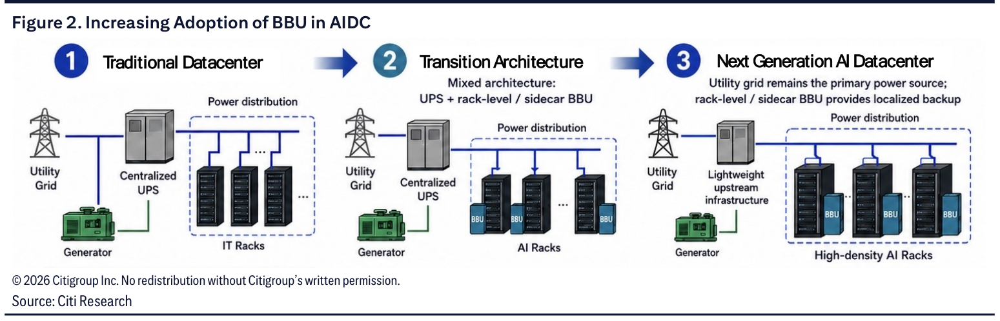

### 解讀摘要
BBU 架構從「Traditional DC」（48V PSU 嵌入機架，無備援）演進至「Transition」（BBU 嵌入機架，與 UPS 並存），再到「Next Gen AIDC」（BBU + PCS/UPS 混合，Power Rack 獨立化）。這不是技術替代而是分層補充：UPS 留守設施層長時備援，BBU 接管機架層毫秒級 ride-through，兩者分工使 BBU 的滲透不以 UPS 消失為前提，而是因 AI 機架功率密度上升而成為新增標準配備。

---

## Fig. 3｜HVDC Power Architecture（800V Future Power Architecture）

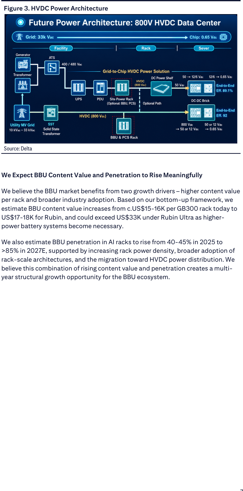

### 解讀摘要
Delta 提出的 800V HVDC 資料中心架構展示兩條路徑的效率差異：傳統路徑（Grid→UPS→PDU→Site Power Rack→DC Power Shelf）端到端效率 89.1%；HVDC 直接路徑（Grid→SST→HVDC 800Vdc→BBU & PCS Rack）端到端效率 92%，差距 2.9ppt。在百 MW 級資料中心中，這 2.9ppt 效率差距轉換為顯著的電費節省，且 HVDC 路徑消除多個 AC/DC 轉換環節，同時使 BBU 從「掛件」升格為核心電力路徑的一部分，直接提升 BBU 的系統地位與 ASP 潛力。

### 洞察
> **洞察一**：HVDC 路徑中 BBU（與 PCS 一起）承擔的是主備援功能，而非 UPS 的輔助補充。這意味著在 HVDC 架構下，BBU 的可靠性需求更嚴格，技術門檻（BMS、高壓安全設計）顯著提升，有利於已具備認證資格的現有廠商建立更深的護城河。

---

## Fig. 4｜BBU Content Value Per Rack by GPU Generation

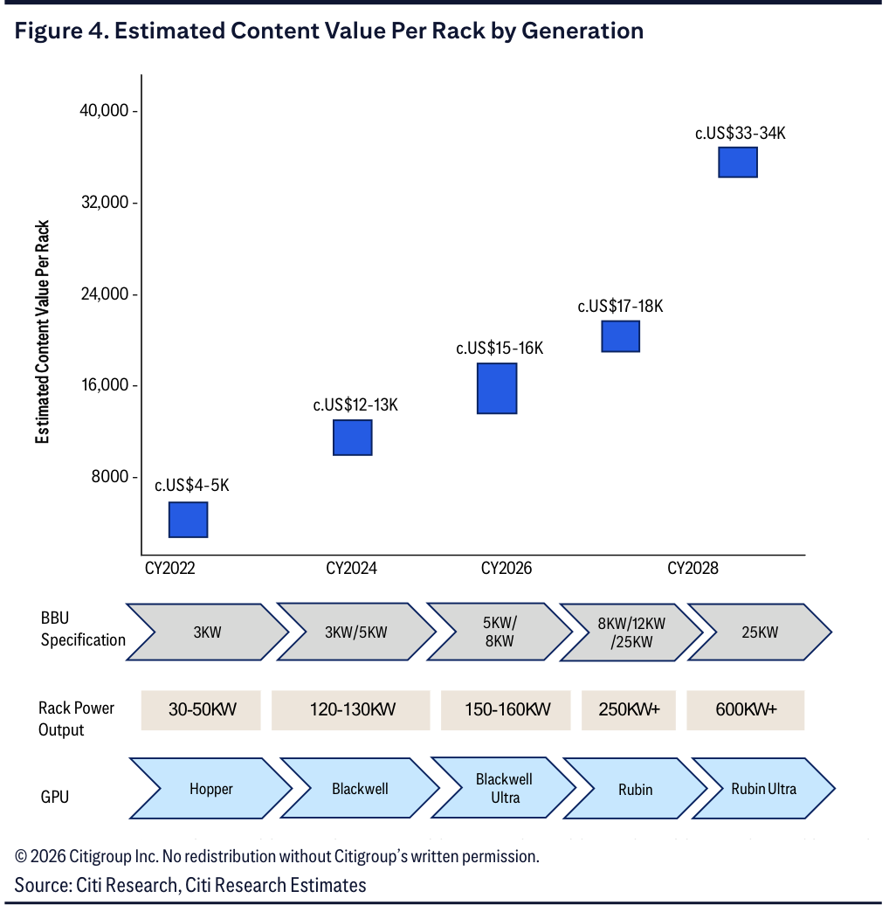

### 解讀摘要
BBU 每架含量從 Hopper（CY2022）的 US\$4-5K 至 Rubin Ultra 的 US\$33-34K，增幅接近 7 倍，驅動力是 rack power 從 30-50KW 躍升至 600KW+：更大的功率需要更高功率的 BBU 模組（3KW→25KW）且需要更多數量，ASP 與數量雙重擴張才造就這個含量暴增。這是供應鏈純增量需求——不是搶現有市占，每一代 GPU 平台的新架構都強制採購全新規格的 BBU。

### 表格

| GPU 世代 | CY | BBU 含量（每架） | BBU 模組規格 | Rack Power |
|---|---|---|---|---|
| Hopper | 2022 | c.US\$4-5K | 3KW | 30-50KW |
| Blackwell | 2024 | c.US\$12-13K | 3KW/5KW | 120-130KW |
| Blackwell Ultra | 2026 | c.US\$15-16K | 5KW/8KW | 150-160KW |
| Rubin | 2027E | c.US\$17-18K | 8KW/12KW/25KW | 250KW+ |
| Rubin Ultra | 2028E | c.US\$33-34K | 25KW | 600KW+ |

> **原文補充**：GB300 NVL72 架含量 c.US\$15-16K 假設配備 ~38 個 5KW BBU（ASP US\$400/個）。Rubin Ultra 採用 25KW 模組（ASP c.US\$1,200/個），僅需約 29 個模組即達 US\$33-34K，說明 ASP 提升（3x）是含量暴增的主要驅動力，而非模組數量增加。

### 洞察
> **洞察一**：Rubin Ultra 含量（US\$33-34K）是 GB300 時代（US\$15-16K）的 2.1 倍，但 BBU 模組數量從 38 降至 29（-24%）——這代表 ASP 從 US\$400 升至 US\$1,200（+3x）是主要驅動。能製造 25KW 高功率模組的廠商（Dynapack 產品藍圖顯示 2027 年量產）將享有更高定價權。

---

## Fig. 5｜BBU Penetration Rate（CY2022-CY2028E）

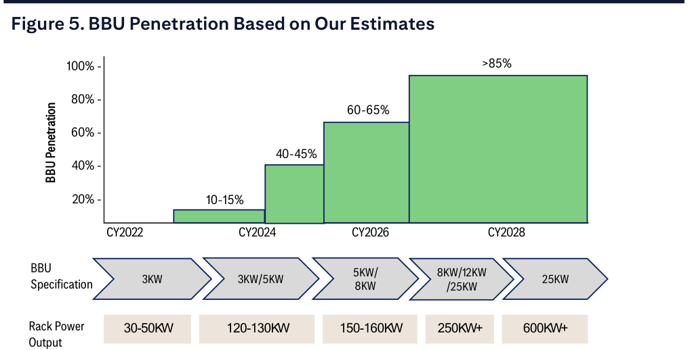

### 解讀摘要
BBU 在 AI 機架的滲透率呈 S 曲線加速：10-15%（2022）→40-45%（2024）→60-65%（2026E）→>85%（2028E）。2024-2026 是核心爬坡期（每兩年 +20-25ppt），其驅動力是 Blackwell 平台的 rack-scale 架構正式要求 BBU 為標配，而非選配。>85% 的 2028E 預估已假設 Rubin Ultra 使 UPS-only 架構幾乎退場於 hyperscaler 的高端 AI 機架。

### 表格

| 年份 | BBU 滲透率 | 增量 |
|---|---|---|
| CY2022 | 10-15% | 基期 |
| CY2024 | 40-45% | +30ppt |
| CY2026E | 60-65% | +20ppt |
| CY2028E | >85% | +25ppt |

---

## Fig. 7｜Dynapack Adjusted Earnings 2018-2028E（60% CAGR Growth Story）

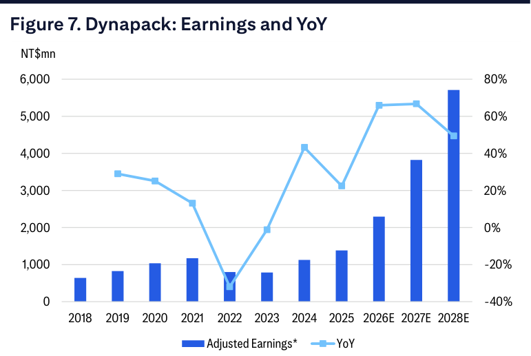

### 解讀摘要
Dynapack 調整後獲利（排除 2021/2024 不動產處置利益）在 2018-2024 長期維持 NT\$700-1,100mn 的平台，2025 起因 BBU 混合提升正式突破；Citi 預估 2025-2028E 三年獲利 CAGR 達 60%（NT\$1,382mn→NT\$5,710mn）。這張圖的重要性在於視覺化「舊 Dynapack 是成熟穩定的 IT 電池廠，新 Dynapack 是 BBU 爬坡期的獲利釋放故事」——過去七年的平台期意味著 2025 起的突破不是均值回歸，而是結構性轉換。

### 洞察
> **洞察一**：2022 年獲利谷底（NT\$700mn）後，2023-2024 回升至 NT\$800-1,100mn，進入 2025 才真正起飛達 NT\$1,382mn。獲利爆發與 Non-IT（BBU）銷售占比突破 35%（2025）高度相關——這個混合轉折點是 GPM 從 16% 跳升的關鍵，說明 BBU 毛利率遠高於傳統 IT 電池。

---

## Fig. 9｜Peer Comp：Forward P/E vs. EPS CAGR（2025-2027E）

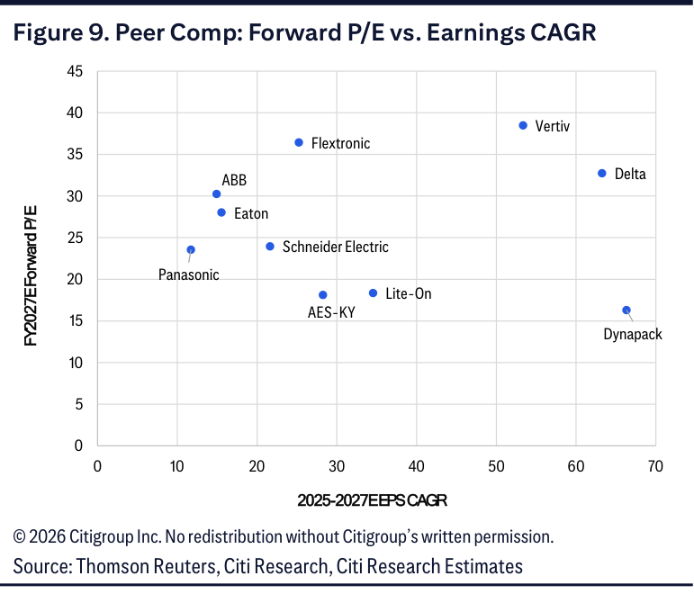

### 解讀摘要
在 BBU/AI 電源供應鏈的同業散點圖中，Dynapack 位於右下角：FY27E P/E 約 16x，EPS CAGR 約 66%，是所有標的中 PEG 最低的——Delta（33x / 63% CAGR）、Vertiv（38x / 53%）、甚至 AES（18x / 27%）均不如其 PEG 吸引力。這個低估源於 Dynapack 的市場認知仍停留在「IT 電池廠」而非「BBU 爬坡期早期受惠者」，Citi 此次啟動覆蓋正試圖填補這個認知差距。

### 表格（視覺估算）

| 公司 | FY27E P/E | EPS CAGR 2025-27E |
|---|---|---|
| Vertiv | 38x | 53% |
| Flextronic | 36x | 27% |
| ABB | 30x | 13% |
| Eaton | 28x | 14% |
| Panasonic | 24x | 11% |
| Schneider Electric | 24x | 21% |
| AES-KY | 18x | 28% |
| Lite-On | 18x | 33% |
| Delta | 33x | 63% |
| **Dynapack** | **16x** | **66%** |

視覺估算，交叉驗證：Dynapack EPS CAGR 66% ≈ 2025 NT\$9.05 → 2027E NT\$25 = 66% CAGR（通過）

### 洞察
> **洞察一**：Delta（63% CAGR / 33x）與 Dynapack（66% CAGR / 16x）成長率幾乎相同，但 P/E 差距達 2x。這個差距反映 Delta 是知名度高的大型電源廠，Dynapack 是新興 BBU 故事的「發現期」標的——若 Dynapack 完成 Rubin 量產認證，重估空間可期。

---

## Fig. 10｜Dynapack vs. AES Side-by-Side Comparison

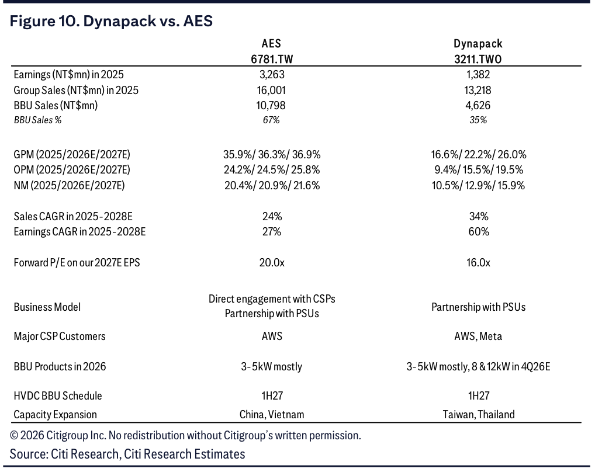

### 解讀摘要
Citi 以無評等欄的比較表呈現 Dynapack 與 AES 的相對優劣勢：AES 具備規模（FY26 BBU 銷售 ~US\$400mn vs Dynapack ~US\$300mn）、客戶多樣性（AWS、Meta、Google）及技術領先（Direct Engagement with CSP），但成長空間較小（27% CAGR）；Dynapack 成長性更強（60% CAGR）、毛利率擴張空間大，且作為 AWS/Meta 的 PSU 管道合作夥伴，切入門檻更低但業務彈性也更高。Citi 偏好 Dynapack 的核心論據：「BBU 爬坡早期，選 EPS CAGR 高、PEG 低的標的。」

---

## Fig. 13｜BBU vs. UPS：Close-to-Load vs. Centralized Backup

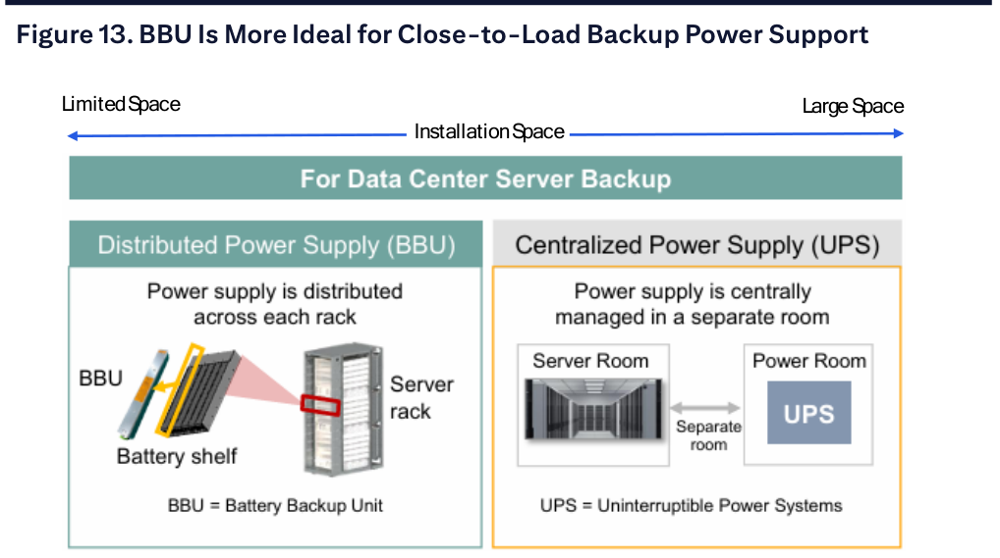

### 解讀摘要
圖示說明 BBU 的「close-to-load」設計優勢：BBU 嵌於機架旁或機架內，備援路徑短、響應時間為毫秒級，適合對電源中斷零容忍的 GPU 訓練工作負載；UPS 位於設施層（centralized），電力需穿越長距離配電路徑，響應速度較慢但備援時間更長（數分鐘至數十分鐘）。兩者在 Next Gen AIDC 中共存，BBU 處理短時 ride-through，UPS 處理長時保護，這個分工邏輯解釋了為什麼 BBU 滲透率可以持續提升而不需要 UPS 消失。

---

## Fig. 14｜Dynapack: 3kW BBU Unit

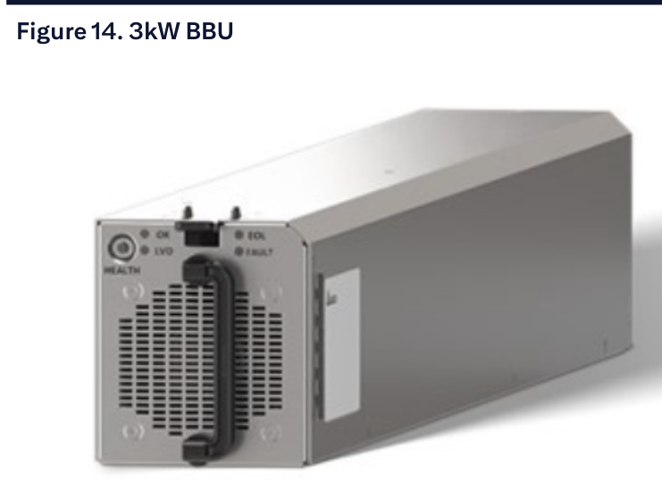

### 解讀摘要
3kW BBU 產品實物圖，為 Dynapack 現行主力出貨規格。前面板具備 OK / EOL / LVD / FAULT 狀態指示燈及健康度（HEALTH）監控接口，符合 OCP ORV3 機架的模組化插拔設計。此規格對應 Hopper/Blackwell 時代的 30-130KW 機架需求，為 Dynapack FY25-26E 的主要 BBU 營收來源。

---

## Fig. 15｜BBU in A Power Rack（NVIDIA BlueField-4 STX）

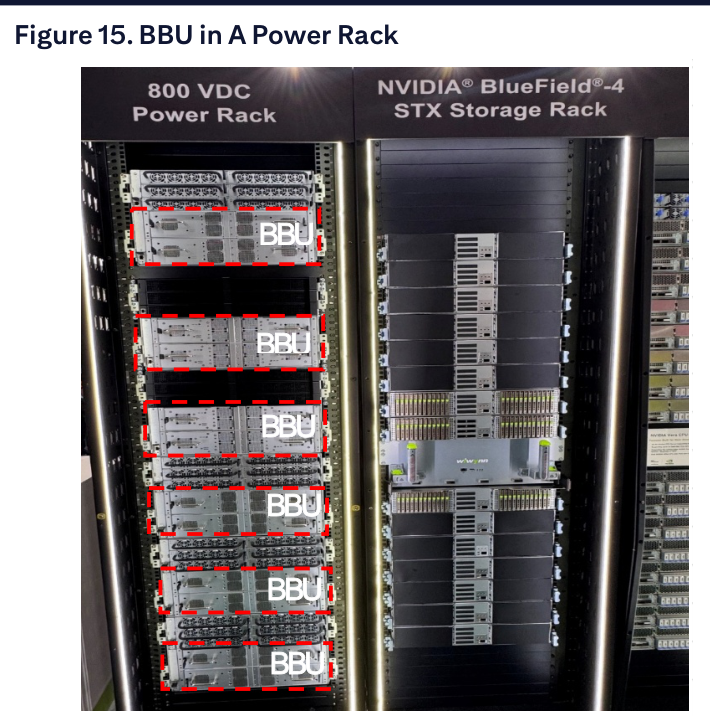

### 解讀摘要
實際部署照片顯示 800 VDC Power Rack 中整合了 6 個 BBU（紅框標示），緊鄰 NVIDIA BlueField-4 STX Storage Rack。6 個 BBU per power rack 的密度，以 5kW BBU 計算即 30kW 備援容量，可支援 150-160KW 機架在斷電瞬間的完整 ride-through。這張照片確認 BBU 已是 hyperscaler 現行部署的實際組件，不僅是路線圖規劃。

---

## Fig. 16｜BBU vs. UPS Comparison Table

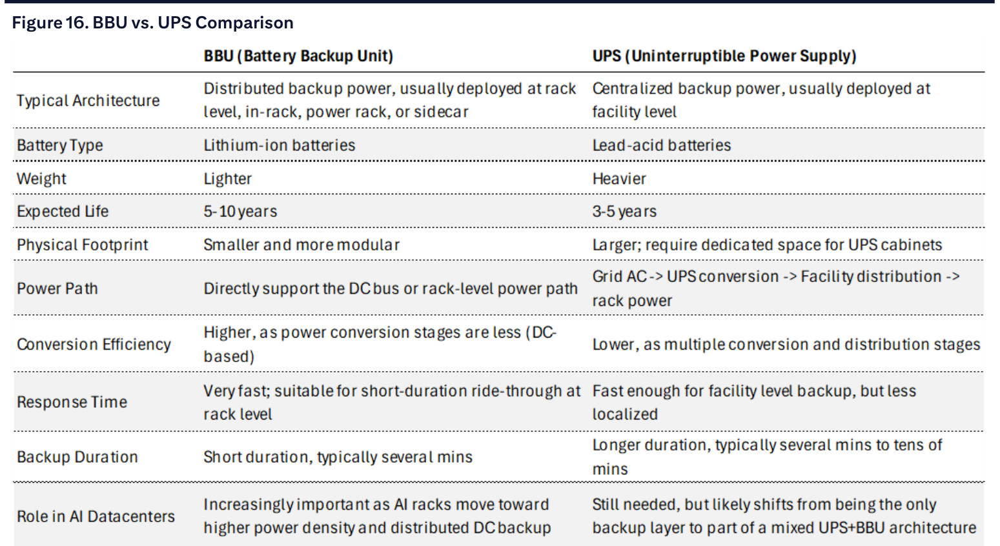

### 解讀摘要
結構化比較表揭示 BBU 在 AI 資料中心的競爭優勢不止一個維度：電池採鋰離子（vs UPS 鉛酸），使用壽命 5-10 年（vs 3-5 年）、重量更輕、佔地更小，且轉換效率更高（DC-based，轉換層次少）。對 hyperscaler 而言，壽命更長意味著 replacement cycle 更少，總持有成本（TCO）優勢隨規模擴大而放大；這也解釋了為什麼滲透率提升有正向強化效應。

### 表格

| 比較維度 | BBU | UPS |
|---|---|---|
| 架構 | 分散式，機架層 / Power Rack / Sidecar | 集中式，設施層 |
| 電池類型 | 鋰離子 | 鉛酸 |
| 重量 | 較輕 | 較重 |
| 使用壽命 | 5-10 年 | 3-5 年 |
| 佔地 | 小，模組化 | 大，需獨立 UPS 機櫃 |
| 電力路徑 | 直接支援 DC bus / 機架電力路徑 | Grid AC→UPS→設施配電→機架 |
| 轉換效率 | 較高（DC-based，轉換層次少） | 較低（多重 AC/DC 轉換） |
| 響應時間 | 極快，毫秒級 ride-through | 快但較不局域化 |
| 備援時長 | 短（數分鐘） | 長（數分鐘至數十分鐘） |
| AI DC 角色 | 越來越重要，成為標配 | 仍需要，但從唯一層變成混合架構的一部分 |

---

## Fig. 17｜BBU Shelf Configuration in OCP ORV3 Architecture

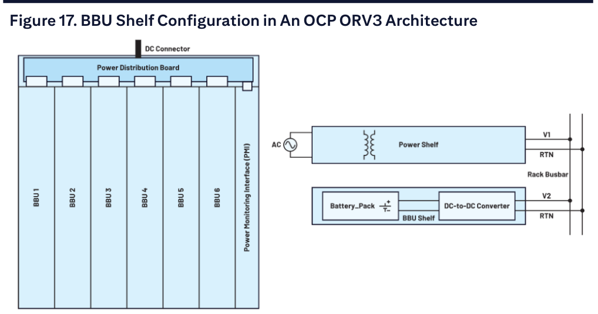

### 解讀摘要
OCP ORV3 機架中 BBU 的標準化架位配置：左圖顯示 Power Distribution Board 下方可容納 6 個 BBU（BBU 1-6）並配備 Power Monitoring Interface（PMI）；右圖電路示意顯示 BBU Shelf（Battery Pack + DC-to-DC Converter）與 Power Shelf 並聯於 Rack Busbar（V1/V2），分別輸出主電源（V1）與備援電源（V2）。OCP 的開放標準意味著 BBU 廠商只要通過認證即可供應多家 CSP，降低了封閉生態系統的風險，同時也使市場競爭更透明。

---

## Fig. 19｜BBU Supply Chain at A Glance

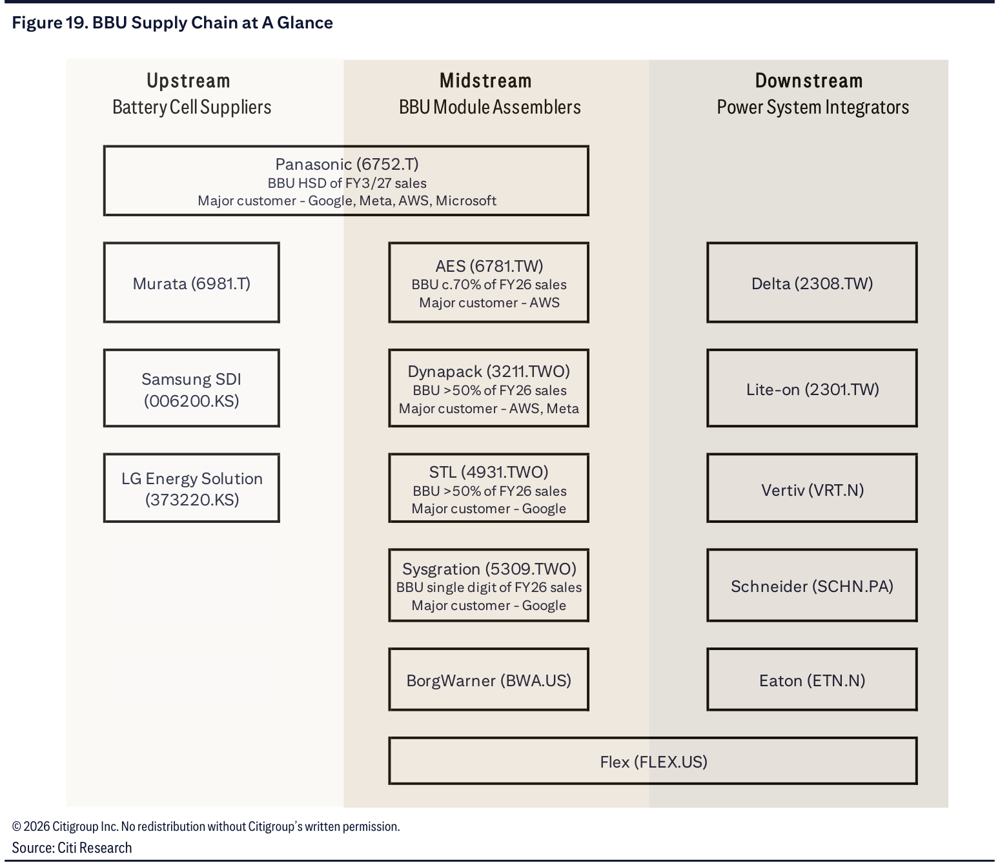

### 解讀摘要
BBU 供應鏈三層結構清晰：上游電芯（Panasonic HSD 為 FY3/27 銷售主力，Google/Meta/AWS/Microsoft 認證，另有 Murata、Samsung SDI、LG）；中游組裝（AES 約 70% FY26 銷售，AWS；Dynapack >50% FY26，AWS/Meta；STL >50% FY26，Google；Sysgration 個位數 FY26，Google）；下游電源整合（Delta、Lite-on、Vertiv、Schneider、Eaton）。中游的集中度（4 家廠商）遠低於市占集中（Panasonic 80%），說明「BBU 組裝」層是整個供應鏈中競爭最均質、成長機會最多的一段。

### 表格

| 層級 | 廠商 | 主要客戶 | BBU 佔銷售 |
|---|---|---|---|
| 上游（電芯） | Panasonic（6752.T） | Google, Meta, AWS, MS | HSD（FY3/27 主力） |
| 上游（電芯） | Murata（6981.T） | — | — |
| 上游（電芯） | Samsung SDI（006200.KS） | — | — |
| 上游（電芯） | LG Energy Solution（373220.KS） | — | — |
| 中游（組裝） | AES（6781.TW） | AWS | c.70% of FY26 |
| 中游（組裝） | Dynapack（3211.TWO） | AWS, Meta | >50% of FY26 |
| 中游（組裝） | STL（4931.TWO） | Google | >50% of FY26 |
| 中游（組裝） | Sysgration（5309.TWO） | Google | 個位數 FY26 |
| 中游（組裝） | BorgWarner（BWA.US） | — | — |
| 中游（組裝） | Flex（FLEX.US） | — | — |
| 下游（整合） | Delta（2308.TW） | — | — |
| 下游（整合） | Lite-on（2301.TW） | — | — |
| 下游（整合） | Vertiv（VRT.N） | — | — |
| 下游（整合） | Schneider（SCHN.PA） | — | — |
| 下游（整合） | Eaton（ETN.N） | — | — |

---

## Fig. 20｜Two Business Models in BBU Supply Chain

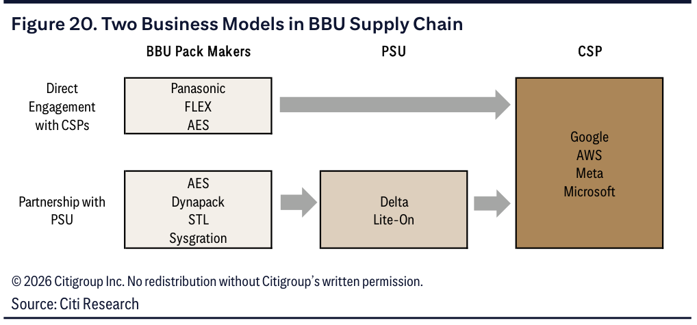

### 解讀摘要
BBU 供應鏈存在兩種商業模式：「Direct Engagement with CSPs」（Panasonic / FLEX / AES 直接對 Google、AWS、Meta、Microsoft），以及「Partnership with PSU」（AES、Dynapack、STL、Sysgration 透過 Delta / Lite-On 間接進入 CSP）。Dynapack 主要走第二條路，優點是進入門檻低（借用 PSU 的 CSP 認證與關係），缺點是 ASP 受到 PSU 中間商壓縮、且議價能力受限。這也解釋了為什麼 Dynapack 毛利率目前低於 AES（AES 部分直銷 CSP，有較高定價空間）。

### 洞察
> **洞察一（配合 Fig. 19）**：AES 同時跨兩種模式（既直銷又透過 PSU），說明其市場地位比 Dynapack 更穩固，但也意味 AES 的成長空間更取決於市場整體擴張而非分潤爭奪。若 Dynapack 未來升格為直銷路徑（如通過 AWS 直接認證），毛利率可能突破式上修。

---

## Fig. 22｜BBU Penetration + BBU Specification Evolution + Rack Power

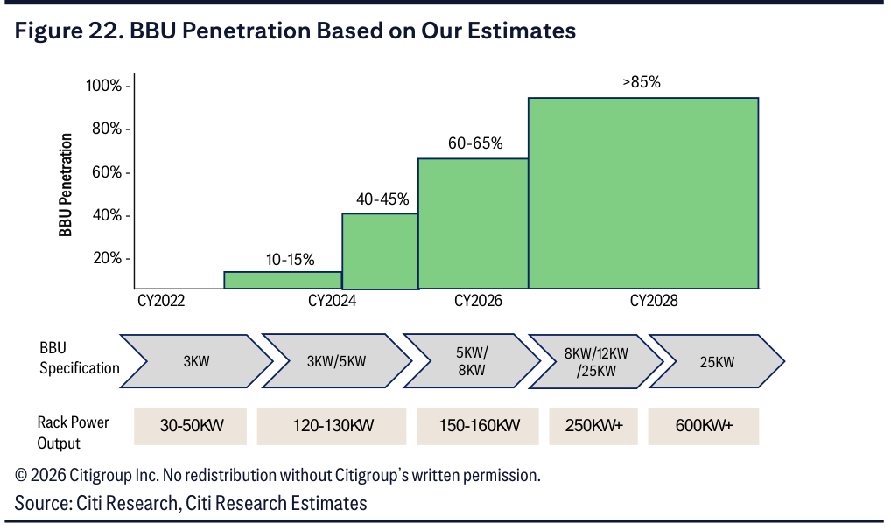

### 解讀摘要
比 Fig. 5 更完整的版本：在滲透率曲線下方加入 BBU 規格演進（3KW→25KW）及機架功率輸出（30-50KW→600KW+）兩個維度，讓每一個滲透率數據點都有對應的技術背景。關鍵洞察：每次規格升代並非漸進，而是跳躍性的——5KW/8KW（2026）→8KW/12KW/25KW（Rubin，2027+）→25KW（Rubin Ultra，2028+），這說明 BBU 廠商必須持續進行 R&D 認證，現有產線和製程不能完全沿用，形成動態的技術護城河。

### 表格

| 時間節點 | BBU 滲透率 | BBU 規格 | Rack Power Output |
|---|---|---|---|
| CY2022 | 10-15% | 3KW | 30-50KW |
| CY2024（過渡） | 40-45% | 3KW/5KW | 120-130KW |
| CY2026E | 60-65% | 5KW/8KW | 150-160KW |
| CY2027E | — | 8KW/12KW/25KW | 250KW+ |
| CY2028E | >85% | 25KW | 600KW+ |

---

## Fig. 23｜Estimated Content Value Per Rack by Generation（含 GPU 對應）

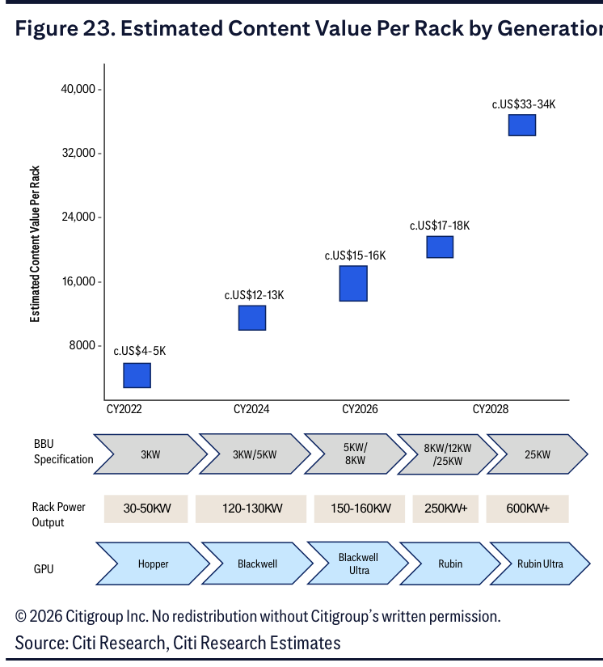

### 解讀摘要
將 Fig. 4 與 GPU 世代直接對應的增強版：Hopper（2022）c.US\$4-5K → Blackwell（2024）c.US\$12-13K → Blackwell Ultra（2026）c.US\$15-16K → Rubin（2027E）c.US\$17-18K → Rubin Ultra（2028E）c.US\$33-34K。Blackwell → Rubin Ultra 的 2.6 倍跳升是因為 Rubin Ultra 採用 25KW 模組（vs Blackwell 的 5KW），等效於 ASP 升至 3 倍（US\$400→US\$1,200）同時模組數量略降，這是報告最重要的單一假設。

---

## Fig. 25｜Market Share of BBU Supplier（FY2026E）

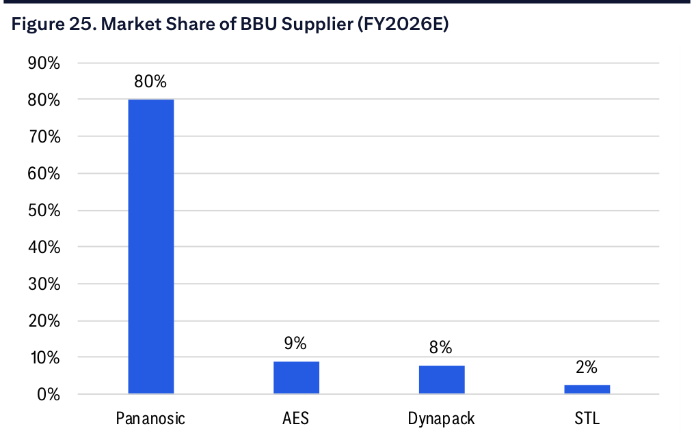

### 解讀摘要
FY2026E BBU 市場份額：Panasonic 80%、AES 9%、Dynapack 8%、STL 2%，高度集中於 Panasonic。然而 Panasonic 的市占來源是 HSD 電芯的供應商獨家地位（同時向競爭對手銷售電芯），其擴張受制於電芯產能投資週期。AES 和 Dynapack 的市占合計僅 17%，表明後起廠商的爬坡空間仍大，且 TAM 持續擴張意味不必搶佔 Panasonic 份額也能快速成長。

### 表格

| 廠商 | FY2026E 市占 | 資料來源 |
|---|---|---|
| Panasonic | 80% | 公司 IR，Citi 估算 |
| AES | 9% | Citi 估算 |
| Dynapack | 8% | Citi 估算 |
| STL | 2% | Citi 估算 |

---

## Fig. 26｜Dynapack BBU Products Pipeline（2026-2028+）

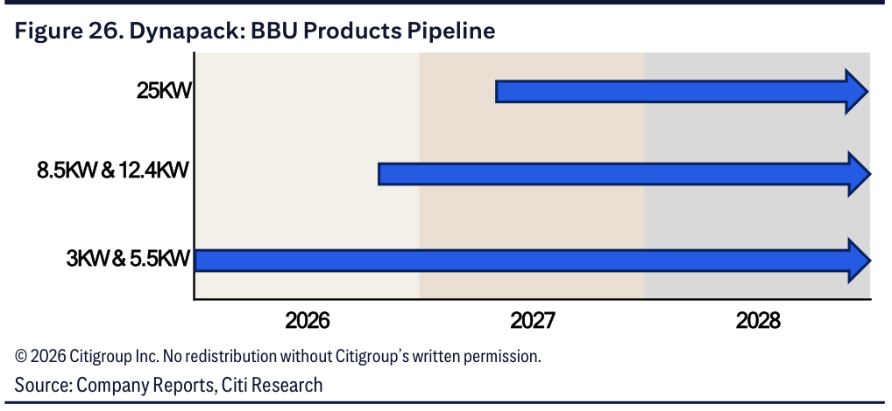

### 解讀摘要
Dynapack 的 BBU 產品路線圖清晰對應各 GPU 世代需求：3KW & 5.5KW 為現行量產主力（2026 全年持續出貨）；8.5KW & 12.4KW 預計 2026 年中導入（對應 Rubin 平台的 250KW+ 機架）；25KW 規格預計 2027 年量產（對應 Rubin Ultra 600KW+ 機架）。三條產品線同時在途的意義在於 Dynapack 已取得三個世代的同步認證位置，一旦某個世代加速，整個產品線均能即時受惠。

### 表格

| 產品規格 | 量產時程 | 對應 GPU 世代 |
|---|---|---|
| 3KW & 5.5KW | 2026 持續 | Blackwell / Blackwell Ultra |
| 8.5KW & 12.4KW | 2026 中段+ | Rubin（250KW+） |
| 25KW | 2027+ | Rubin Ultra（600KW+） |

---

## Fig. 27｜Dynapack Group Sales and YoY（2018-2028E）

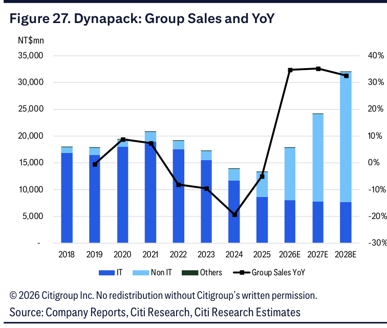

### 解讀摘要
Dynapack 集團銷售從 2024 年谷底 NT\$13,912mn 重拾成長：2026E NT\$17,803mn（+35% YoY）、2027E NT\$24,072mn（+35%）、2028E NT\$31,902mn（+33%）。驅動力完全來自 Non-IT（BBU）：IT 部分持續萎縮，Non-IT 從 2025 的 NT\$4,626mn 暴增至 2026E NT\$9,797mn（+112% YoY）、2027E NT\$16,223mn（+66%）。這是典型的「穿越週期」成長——傳統業務萎縮但 BBU 新業務彌補並超越，整體呈現 YoY 35%+ 的持續高速成長。

### 表格（NT\$mn）

| 年份 | IT | Non-IT | Others | Total | YoY |
|---|---|---|---|---|---|
| 2024 | 11,675 | 2,226 | 10 | 13,912 | -19% |
| 2025 | 8,570 | 4,626 | 22 | 13,218 | -5% |
| 2026E | 7,981 | 9,797 | 25 | 17,803 | +35% |
| 2027E | 7,822 | 16,223 | 28 | 24,072 | +35% |
| 2028E | 7,665 | 24,207 | 30 | 31,902 | +33% |

---

## Fig. 28｜Dynapack IT vs. Non-IT Sales YoY Growth

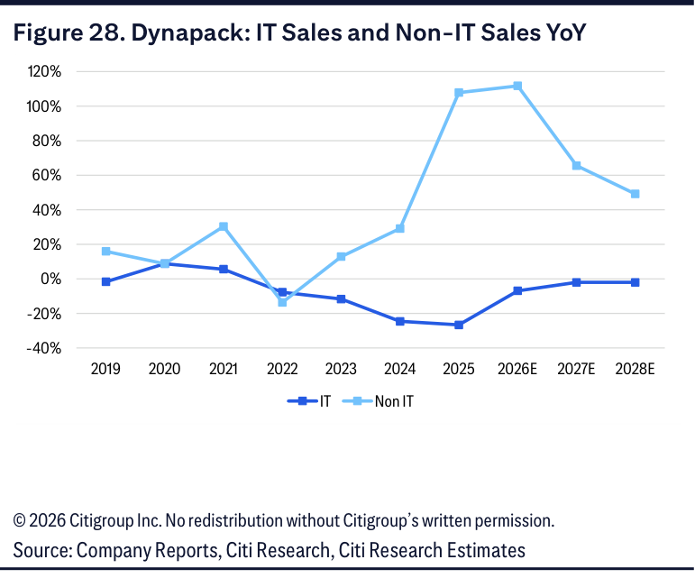

### 解讀摘要
IT 與 Non-IT 的成長軌跡清楚分叉：IT 業務自 2021 起持續衰退（-8% to -27%），預估 2026-2028E 仍維持 -2% 至 -7% 微幅萎縮；Non-IT（BBU 主導）則在 2024 起爆發，2025 +108%、2026E +112%，然後逐步正常化至 2027E +66%、2028E +49%。IT 的縮減屬有秩序的業務退出（筆電電池需求長期轉向），而非崩跌，因此不會衝擊公司的製造能力基礎；Non-IT 的爆發式成長是建立在 IT 的生產基礎設施之上，說明轉型成本相對低。

---

## Fig. 29｜Dynapack CAPEX Trend（2018-2028E）

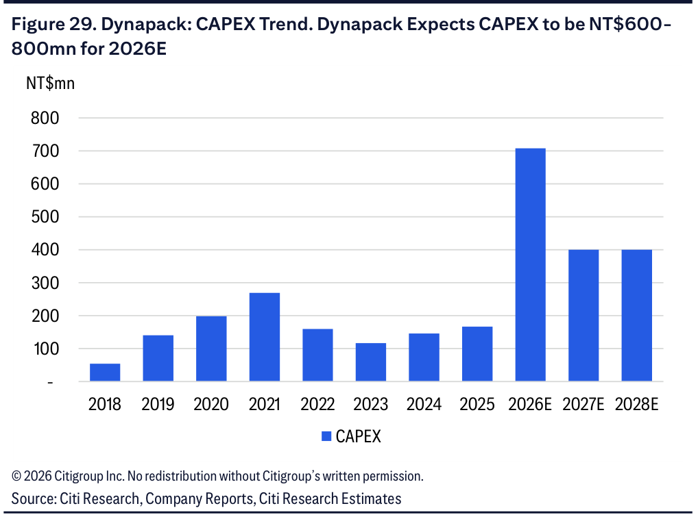

### 解讀摘要
CAPEX 在 2026E 達到歷史高點 NT\$710mn（歷史平均 NT\$150-200mn，約 3-4 倍），對應產能擴充以承接 BBU 訂單爬坡；2027-2028E 恢復至 NT\$400mn 正常水準，顯示管理層認為 2026 是集中投入期而非長期大幅擴張。NT\$710mn 的 CAPEX 規模相對 2026E 銷售 NT\$17,803mn 約佔 4%，屬合理範圍，不構成財務壓力。這也意味著 2027-2028 的自由現金流將大幅改善，支撐高配息（FY25 配息率達 127%）。

---

## Fig. 30 + Fig. 31｜Dynapack GPM Before/After BBU Ramp + AES GPM Reference

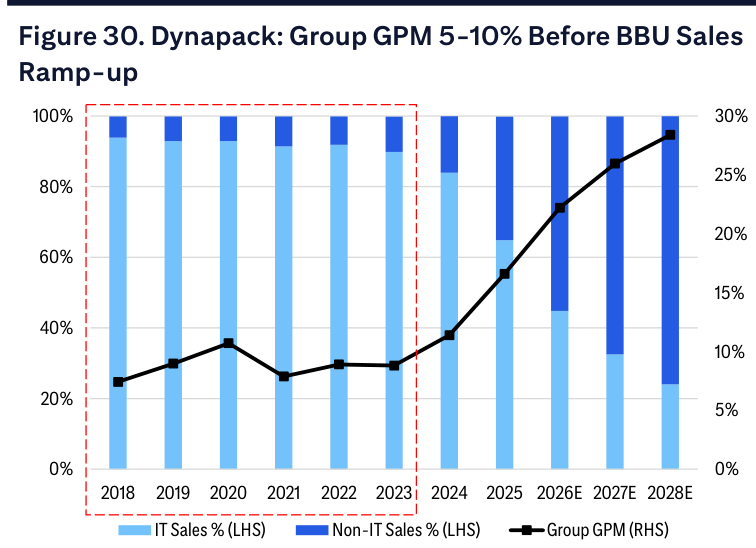

### 解讀摘要
圖左（Fig 30）以紅框標示「BBU 爬坡前」時期（2018-2023）：Dynapack 集團 GPM 長期維持 7-10%（IT 電池的低毛利特性），2024 起隨 Non-IT 混合提升顯著爬升，預估 2028E 達 28.4%——漲幅接近 20ppt。圖右（Fig 31）呈現 AES GPM 32-40%（2020-2028E），這是「成熟 BBU 廠商在 Direct CSP 銷售模式下的穩定毛利率區間」，為 Dynapack 的長期目標提供了市場可驗證的錨點。兩圖並置說明：Dynapack 的毛利率擴張不是假設，而是已有 AES 的歷史軌跡作為先例。

### 洞察
> **洞察一**：Dynapack 2028E GPM 28.4% 仍低於 AES 的 37-38%，差距約 9ppt。這個差距對應 Dynapack 以 PSU 管道銷售（而非直接 CSP 銷售），若未來升格直銷，還有顯著的毛利率上修空間——這也是為什麼 Citi 選擇「早期爬坡」而非「成熟穩定」作為買進時機。

---

## Fig. 35｜BBU FY26 Sales Comparison — Panasonic 10x Larger Than Dynapack

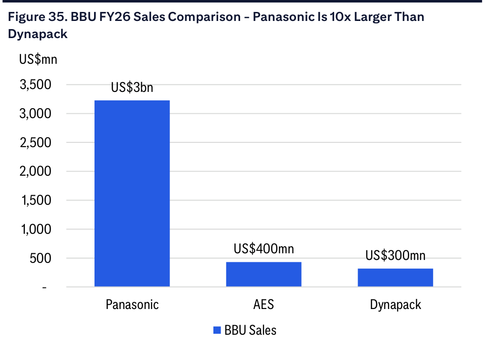

### 解讀摘要
FY2026E BBU 絕對銷售規模對比：Panasonic c.US\$3bn >> AES c.US\$400mn ≈ Dynapack c.US\$300mn。Panasonic 的 10 倍領先來自其 HSD 電芯的先發布局，但這也意味著 AES 和 Dynapack 以更少的資源基礎達到同一數量級，說明「非 Panasonic 廠商的資本效率更高」；同時，AES 與 Dynapack 規模相近，代表兩者正在同一起跑點進行份額競爭，勝負取決於 Rubin 世代的認證速度。

---

## Fig. 36｜Delta（2308.TW）AI Server Power Sales Estimates

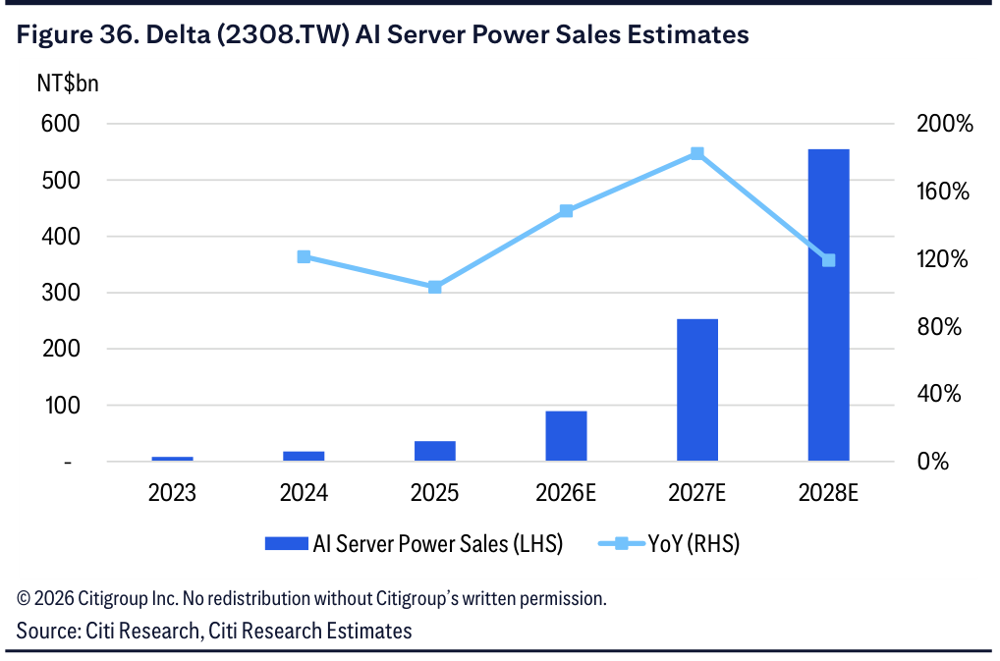

### 解讀摘要
Delta AI 伺服器電源銷售（NT\$bn）：2023 約 NT\$10bn → 2024 約 NT\$20bn → 2025 約 NT\$45bn → 2026E 約 NT\$95bn → 2027E 約 NT\$250bn → 2028E 約 NT\$555bn。YoY 成長率維持 120-175%。Delta 是 Dynapack 的主要 PSU 下游通路之一——Delta 的 AI 電源銷售成長直接帶動 Dynapack 的 BBU 出貨量（BBU 附帶在 Delta PSU 機架套件中），因此 Delta 本身的爆炸性成長是 Dynapack 訂單能見度的代理指標。

### 表格（視覺估算，NT\$bn）

| 年份 | AI 伺服器電源銷售 | YoY |
|---|---|---|
| 2023 | 10 | — |
| 2024 | 20 | 100% |
| 2025 | 45 | 125% |
| 2026E | 95 | 111% |
| 2027E | 250 | 163% |
| 2028E | 555 | 122% |

---

## Fig. 47｜Dynapack: Battery Packs for IT Products

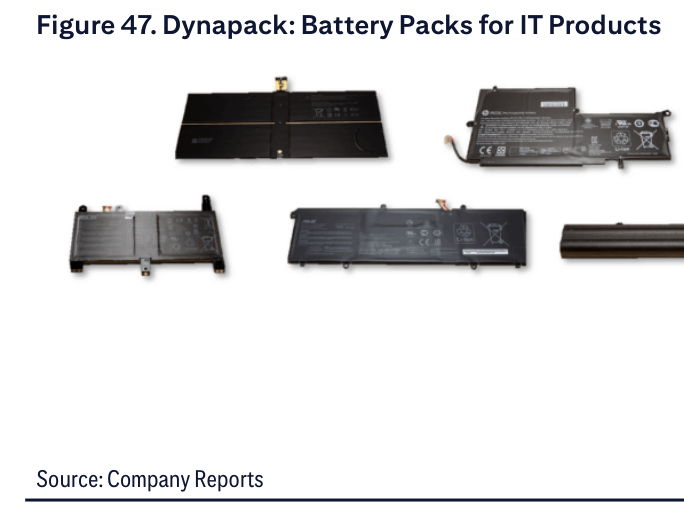

### 解讀摘要
五種規格的筆電/IT 產品電池組實物展示，包含 Microsoft Surface 型（上排左）、HP 型（上排右）、Asus 型（下排，多個）。這類 IT 電池為 Dynapack 的傳統業務——低毛利但高量、製程成熟。將此圖與 Fig. 48（BBU 產品）並置的意義在於視覺化「同一家公司的產品轉型」：IT 電池是薄型鋰離子組件，BBU 是高功率、含電池管理系統的工業級產品，兩者技術複雜度差異說明了為何 BBU 毛利率更高。

---

## Fig. 48｜Dynapack: BBU Product（3.2KW）Interior View

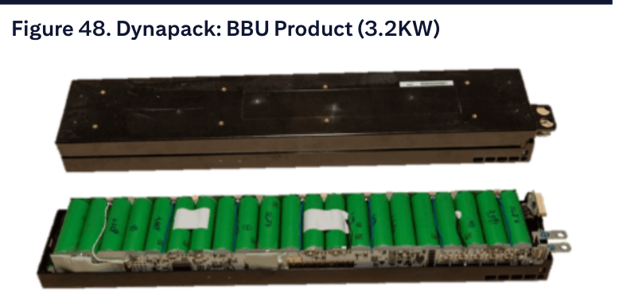

### 解讀摘要
3.2KW BBU 拆解圖，上方為外殼（模組化抽取式設計，對應 ORV3 標準），下方展示內部電芯陣列（綠色圓柱形鋰離子電芯，約 20 顆以上）與電路板（BMS 及保護電路）。相較於筆電電池組，BBU 的電芯數量多、整合密度高、BMS 功能更複雜（需支援 EOL/LVD 等指示），說明 BBU 的製造門檻顯著高於 IT 電池，也解釋了 Dynapack 在取得 AWS/Meta 認證後的競爭壁壘。

---

## Fig. 49｜Dynapack: Sales of IT vs. Non-IT（2018-2028E）

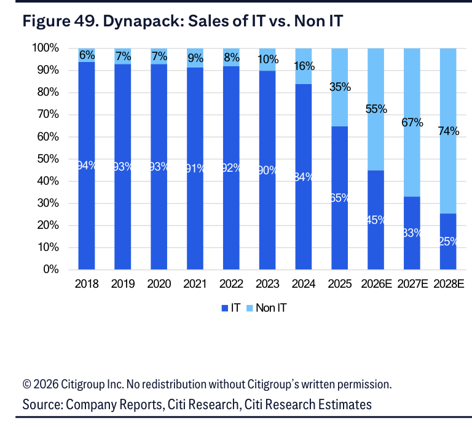

### 解讀摘要
100% 堆疊長條圖清晰呈現業務混合的戲劇性轉換：IT 佔比從 2018-2023 年的 90-94% 在 2024 開始下滑（84%），至 2025 快速降至 65%，預估 2026E 45%、2027E 33%、2028E 25%；對應 Non-IT（BBU）從 6%（2018）爬升至 74%（2028E）。這個圖的價值在於量化轉型速度——從 IT 主導到 Non-IT 主導僅花三年（2025-2027），遠快於多數市場預期的漸進轉型。

---

## Fig. 50｜Dynapack: Production Presence

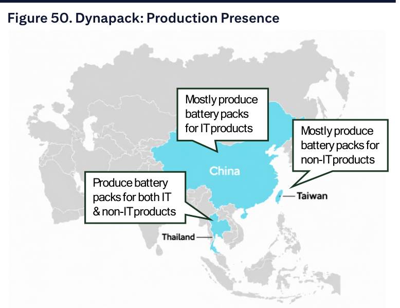

### 解讀摘要
Dynapack 三地產能分工地圖：中國工廠主要生產 IT 電池組（現行主力，持續萎縮中的業務）；台灣工廠主要生產 Non-IT（BBU，高毛利成長業務）；泰國工廠（2023 年子公司成立）IT 與 Non-IT 兼產。這個地理分工意義在於：BBU 生產集中於台灣，可受益於台灣精密製造生態系統，且泰國據點的建立也提供了供應鏈分散化的選項，符合 CSP 對製造地理風險管理的要求。

---

## Fig. 51｜Dynapack: Key Milestones（1998-2023）

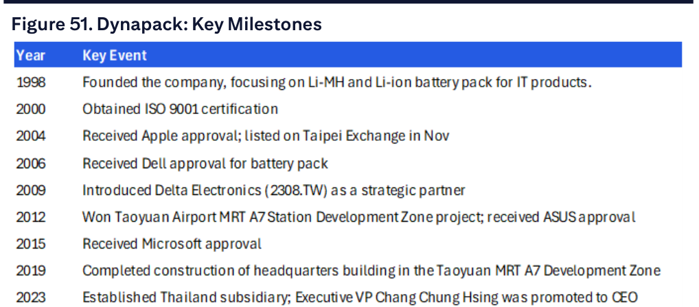

### 解讀摘要
里程碑時間軸從 1998 年成立橫跨至 2023 年，幾個關鍵節點揭示公司的技術認證積累路徑：2004 年取得 Apple 認證（標誌電池組品質達 Tier-1 水準）、2006 年 Dell 認證、2009 年引入 Delta Electronics 作為策略夥伴（為後來 PSU 管道銷售模式奠基）、2015 年 Microsoft 認證，2023 年成立泰國子公司並更換 CEO（Chang Chung Hsing 升任）。這個認證積累說明 Dynapack 的客戶信任並非一蹴而就——25 年建立的製造可靠性記錄，是 AWS/Meta 願意採用其 BBU 的重要前提，也是後進者難以複製的無形壁壘。

### 表格

| 年份 | 關鍵事件 |
|---|---|
| 1998 | 成立，專注鋰電池組（IT 產品） |
| 2000 | 取得 ISO 9001 認證 |
| 2004 | 取得 Apple 認證；於台北交易所掛牌（11 月） |
| 2006 | 取得 Dell 電池組認證 |
| 2009 | 引入台達電子（2308.TW）作為策略夥伴 |
| 2012 | 取得 ASUS 認證；承攬桃園機場捷運 A7 站開發 |
| 2015 | 取得 Microsoft 認證 |
| 2019 | 桃園捷運 A7 總部大樓完工 |
| 2023 | 成立泰國子公司；張宗興升任 CEO |

---

## 相關個股清單

| 類別 | 公司 | Ticker | 評等 | 備註 |
|---|---|---|---|---|
| BBU 組裝（主角） | 順達科技 Dynapack | 3211.TWO | Buy（Citi 啟動） | TP NT\$800，32x 2027E P/E |
| BBU 組裝（比較） | AES | 6781.TW | Neutral（nc） | TP NT\$1,680，27% CAGR，規模更大 |
| BBU 電芯（上游） | Panasonic | 6752.T | — | 市占 80%，AWS/Meta/Google/MS 認證 |
| PSU 整合（下游） | 台達電子 Delta | 2308.TW | — | Dynapack PSU 主要通路；AI 電源 2028E NT\$555bn |
| PSU 整合（下游） | 光寶科技 Lite-On | 2301.TW | — | 另一 PSU 通路 |
| 電源設備（下游） | Vertiv | VRT.N | — | 38x FY27E，AI DC 電源整合商 |
| BBU 組裝（新進） | STL | 4931.TWO | — | >50% FY26 BBU，Google 客戶 |
| BBU 組裝（新進） | Sysgration | 5309.TWO | — | 個位數 FY26，Google 客戶 |
