# Morgan Stanley｜AI Supply Chain: Further Updates on 2027 CoWoS Allocation and ASIC Dynamics

**券商**：Morgan Stanley  
**分析師**：Charlie Chan、Daniel Yen CFA、Daisy Dai CFA、Tiffany Yeh、Lucas Wang (RA)、Ethan Jia (RA)、Henry Zhao (RA)  
**日期**：2026-07-08  
**主題**：2027 CoWoS 分配更新與 ASIC 動態  
**評級**：M Idea（無產業評等）  
<a href="https://layx.uk/dl?g=產業&b=MS&d=20260708&h=AI-Supply-Chain">📎 下載 PDF</a>

---

## 報告總結

本報告是 MS 在 6 月 23 日發布 2027 CoWoS 初步分配後，針對大量投資人問題的進一步更新。核心催化劑有四：AMD MI400 系列分成 MI455（標準版）與 MI450（Meta 訂製）後，2027 CoWoS 240k 分配維持不變但執行風險存在；Google Sunfish 量集中 4Q26（3Q26 KYEC 僅 +10% QoQ 而非原估 +15%）；Blackwell 庫存確認為供鏈緩衝、2026 年底完全消化、不存在庫存疑慮；Meta Olympus 取消改由 Apollo 接班（Broadcom 設計、1Q28 量產），GUC 可能勝出 Meta 旁系 ASIC 項目（Rivos 團隊，tape-out 1H27）。

2027e CoWoS 需求 2,694k wafers（+93% YoY），HBM 需求 48.6bn Gb（+63% YoY），計算晶圓收入 TAM US\$46.2bn（+79% YoY）。供給端 2027 年底產能 280kwpm（TSMC 200 + non-TSMC 80），全年均攤約 2,700k wafers，與需求幾乎零缺口——2027 供需更緊於 2026。

---

## Morgan Stanley 完整投資邏輯鏈

| 論點層次 | Exhibit | 內容 |
|---|---|---|
| 需求信號明確 | 1, 2, 3 | 2027e CoWoS 需求 2,694k wafers（+93% YoY），HBM 48.6bn Gb，晶圓收入 TAM US\$46.2bn |
| 需求結構分析 | 4, 5 | NVIDIA 佔比 56%→45%（需求仍增但結構分散），AMD 9%→20%（+308% YoY），Broadcom 18% 持平 |
| 供給上限確認 | 6 | 2027e 年底 TSMC 200kwpm + non-TSMC 80kwpm = 280kwpm；均攤 ~2,700k wafers，幾乎滿足需求 |
| 庫存疑慮消除 | 10, 11, 12 | Blackwell「庫存」= 供鏈緩衝，2026 年底全數消化；7mn Rubin chip / 90k NVL72 racks 在 2027 |
| 個股分化機會 | 7, 13 | AI semis P/E 高位；AMD CoWoS 執行風險；GUC Meta 側項目潛力 |
| **結論** | 報告封面 | **2027 CoWoS 供需幾乎零缺口；NVIDIA/TSMC 主幹；AMD 執行需持續追蹤** |

> **報告最大邏輯缺口**：AMD 2027 CoWoS 240k 有下修風險（prior record of trimming）；Venice CPU 大量轉移至 OSAT（5.7-6mn chips vs. 1mn in 2026）能否準時執行是關鍵觀察點。

---

## 報告核心觀點

| 主題 | MS 觀點 | 市場共識 | 是否 Contra-Consensus |
|---|---|---|---|
| AMD 2027 CoWoS | 維持 240k，但執行風險不排除 | 多數假設 AMD 大幅擴張 | 中性（維持前估但警示下修風險） |
| Google Sunfish 量 | 3Q26 KYEC +10% QoQ（非 15%），全年 960k | 市場原估 15% QoQ | 偏空修正 |
| Blackwell 庫存 | 確認為供鏈緩衝，2026 年底清零 | 部分市場擔心庫存 | Contra（消除疑慮） |
| Rubin 2027 量 | 7mn chip + 90k NVL72 racks | 未明確 | 首次公布 Rubin 量化數字 |
| Meta ASIC | Olympus 取消，Apollo 1Q28 量產；GUC 可能勝出側項目 | 未明確 | 首次披露 Meta ASIC 路線圖更新 |

**個股偏好**：NVIDIA（Rubin CoWoS-L 主幹）、TSMC（供給端唯一大規模選擇）、KYEC（Sunfish 4Q 集中）、GUC（Meta 側項目潛力）  
**風險因子**：AMD 執行風險；Google Sunfish 時程不確定性；Meta Apollo 1Q28 量產能否達標

---

## Exhibit 1｜2027 HBM 需求表

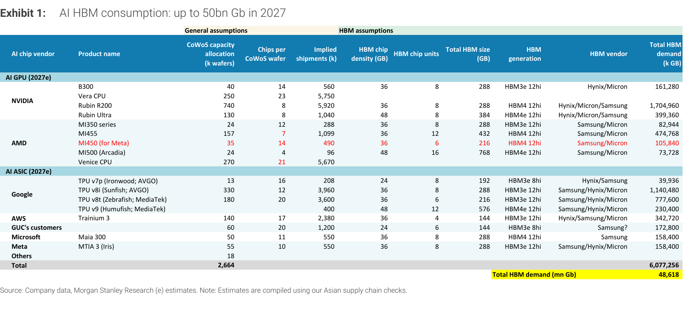

### 解讀摘要
2027e 全球 AI HBM 需求 48,618mn Gb（≈48.6bn Gb），主力來自 NVIDIA Rubin R200（1,704,960k GB，約 35%）。HBM 世代升級：Rubin R200 採 HBM4 12hi（288 GB/chip × 8）、Rubin Ultra 採 HBM4e 12hi（384 GB/chip × 8）；Google Sunfish（TPU v8i）以 330k CoWoS 分配貢獻 1,140,480k GB（約 23%），成需求第二大。AMD MI455 採 HBM4 12hi × 12 顆（432 GB/chip），是所有 GPU 中最高 stack 數設計。

> **原文補充**：MI450 為 Meta 訂製的半尺寸版，搭配 6 顆 HBM4 12hi（216 GB/chip）。AMD 在 MI455/MI450 主要選擇 Samsung/Micron 雙供應商，HBM4 世代下各廠排列略有分化。

### 表格（2027e AI HBM 需求）

| 晶片廠商 | 產品 | CoWoS 分配（k wafers） | 出貨量（k chips） | HBM 規格 | HBM 需求（k GB） |
|---|---|---|---|---|---|
| NVIDIA | B300 | 40 | 560 | HBM3e 12hi × 8（288 GB） | 161,280 |
| NVIDIA | Vera CPU | 250 | 5,750 | — | — |
| NVIDIA | Rubin R200 | 740 | 5,920 | HBM4 12hi × 8（288 GB） | 1,704,960 |
| NVIDIA | Rubin Ultra | 130 | 1,040 | HBM4e 12hi × 8（384 GB） | 399,360 |
| AMD | MI350 series | 24 | 288 | HBM3e 12hi × 8（288 GB） | 82,944 |
| AMD | MI455 | 157 | 1,099 | HBM4 12hi × 12（432 GB） | 474,768 |
| AMD | MI450（Meta） | 35 | 490 | HBM4 12hi × 6（216 GB） | 105,840 |
| AMD | MI500（Arcadia） | 24 | 96 | HBM4e 12hi × 16（768 GB） | 73,728 |
| AMD | Venice CPU | 270 | 5,670 | — | — |
| Google | TPU v7p（Ironwood; AVGO） | 13 | 208 | HBM3e 8hi × 8（192 GB） | 39,936 |
| Google | TPU v8i（Sunfish; AVGO） | 330 | 3,960 | HBM3e 12hi × 8（288 GB） | 1,140,480 |
| Google | TPU v8t（Zebrafish; MediaTek） | 180 | 3,600 | HBM3e 12hi × 6（216 GB） | 777,600 |
| Google | TPU v9（Humufish; MediaTek） | 400 | — | HBM4e 12hi × 12（576 GB） | 230,400 |
| AWS | Trainium 3 | 140 | 2,380 | HBM3e 12hi × 4（144 GB） | 342,720 |
| GUC's customers | — | 60 | 1,200 | HBM3e 8hi × 6（144 GB） | 172,800 |
| Microsoft | Maia 300 | 50 | 550 | HBM4 12hi × 8（288 GB） | 158,400 |
| Meta | MTIA 3（Iris） | 55 | 550 | HBM3e 12hi × 8（288 GB） | 158,400 |
| **合計（含其他）** | — | **2,664** | **33,996** | — | **6,077,256（= 48,618 mn Gb）** |

*以上數字取自 MS 供應鏈調查；TPU v9 出貨量（隱含）未列入*

### 洞察

> **洞察一**：Rubin R200（740k）+ Rubin Ultra（130k）合計 870k CoWoS wafers，對應 HBM4/HBM4e 需求 2,104,320k GB（43% of total）——HBM4 大量成長幾乎完全由 NVIDIA Rubin 單一生態系驅動，HBM4 供應商定價權集中在能供 NVIDIA 的廠商（Hynix/Micron/Samsung）。

> **洞察二**：Google TPU v9（Humufish）400k CoWoS 是表中第二大分配（僅次 Rubin R200），但每 wafer 出貨量未披露，代表 v9 規格細節 MS 尚未完全確認；576 GB/chip 的超高 HBM4e 密度若成真，v9 本身的 HBM 需求貢獻將超越 Sunfish。

---

## Exhibit 2｜2027 計算晶圓收入 TAM

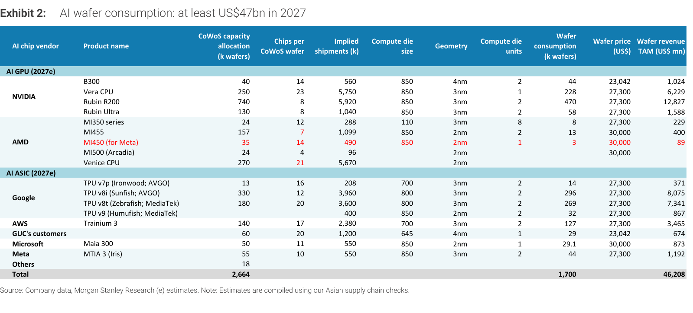

### 解讀摘要
2027e AI 計算晶圓消耗 1,700k wafers，晶圓收入 TAM US\$46.2bn（較 2026e US\$25.8bn +79% YoY）。晶圓均價從 2026e ~US\$24,244 升至 2027e ~US\$27,180（+12%），主因 2nm 製程（US\$30,000/wafer）比重提升——AMD MI455/MI450/MI500/Venice CPU 均採 2nm。Rubin R200 以 470k 計算晶圓、3nm 製程貢獻 US\$12,827mn，是單一最大晶圓收入貢獻項目。

> **原文補充**：米蘭台的 GPU die 尺寸（850mm²）與製程（3nm）為 MS 供應鏈調查結果；2nm 晶圓價格 US\$30,000 是 2027e 估值，尚未完全公開確認。

### 表格（2027e 計算晶圓收入 TAM）

| 晶片廠商 | 產品 | CoWoS（k wafers） | 製程 | 計算晶圓消耗（k wafers） | 晶圓價格（US\$） | 收入 TAM（US\$ mn） |
|---|---|---|---|---|---|---|
| NVIDIA | B300 | 40 | 4nm | 44 | 23,042 | 1,024 |
| NVIDIA | Vera CPU | 250 | 3nm | 228 | 27,300 | 6,229 |
| NVIDIA | Rubin R200 | 740 | 3nm | 470 | 27,300 | 12,827 |
| NVIDIA | Rubin Ultra | 130 | 3nm | 58 | 27,300 | 1,588 |
| AMD | MI350 series | 24 | 3nm | 8 | 27,300 | 229 |
| AMD | MI455 | 157 | 2nm | 13 | 30,000 | 400 |
| AMD | MI450（Meta） | 35 | 2nm | 3 | 30,000 | 89 |
| AMD | MI500（Arcadia） | 24 | 2nm | — | 30,000 | — |
| AMD | Venice CPU | 270 | 2nm | — | — | — |
| Google | TPU v7p（Ironwood; AVGO） | 13 | 3nm | 14 | 27,300 | 371 |
| Google | TPU v8i（Sunfish; AVGO） | 330 | 3nm | 296 | 27,300 | 8,075 |
| Google | TPU v8t（Zebrafish; MediaTek） | 180 | 3nm | 269 | 27,300 | 7,341 |
| Google | TPU v9（Humufish; MediaTek） | 400 | 2nm | 32 | 27,300 | 867 |
| AWS | Trainium 3 | 140 | 3nm | 127 | 27,300 | 3,465 |
| GUC's customers | — | 60 | 4nm | 29 | 23,042 | 674 |
| Microsoft | Maia 300 | 50 | 2nm | 29.1 | 30,000 | 873 |
| Meta | MTIA 3（Iris） | 55 | 3nm | 44 | 27,300 | 1,192 |
| **合計（含其他）** | — | **2,664** | — | **1,700** | — | **46,208** |

### 洞察

> **洞察一**：Rubin R200 + Vera CPU 合計晶圓收入 US\$12,827mn + US\$6,229mn = US\$19,056mn，佔 2027e 晶圓 TAM 的 41%——TSMC 3nm 重度依賴 NVIDIA Rubin 生態系，任何 Rubin 延遲直接衝擊 TSMC 2027 收入。

---

## Exhibit 3｜CoWoS 分配：依客戶與 CoW 供應商拆解

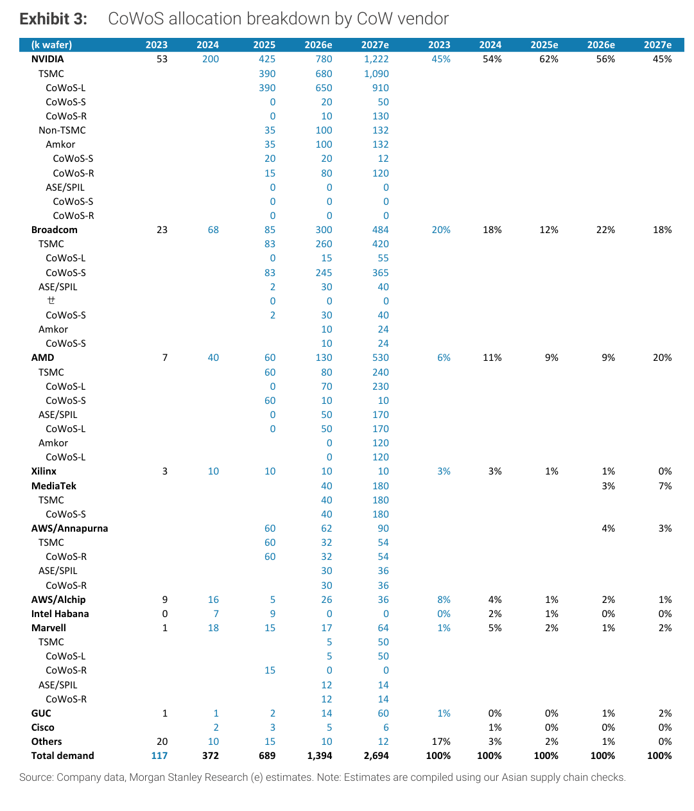

### 解讀摘要
2027e CoWoS 總需求 2,694k wafers，NVIDIA 1,222k（45%）、AMD 530k（20%）、Broadcom 484k（18%）三家合計 83%。AMD 佔比從 2026e 9% 大幅升至 20%，主因 Venice CPU（270k）與 MI400 系列（192k）同步加入。非 TSMC 供應商（Amkor/UMC/ASE）在 AMD Venice、Broadcom ASIC、Marvell 端份額持續擴張。

### 表格（CoWoS 分配 by 客戶，k wafers）

| 客戶 | 2023 | 2024 | 2025 | 2026e | 2027e | 2026e % | 2027e % |
|---|---|---|---|---|---|---|---|
| NVIDIA | 53 | 200 | 425 | 780 | 1,222 | 56% | 45% |
| Broadcom | 23 | 68 | 85 | 300 | 484 | 22% | 18% |
| AMD | 7 | 40 | 60 | 130 | 530 | 9% | 20% |
| Xilinx | 3 | 10 | 10 | 10 | 10 | 1% | 0% |
| MediaTek | — | — | — | 40 | 180 | 3% | 7% |
| AWS/Annapurna | — | — | — | 62 | 90 | 4% | 3% |
| AWS/Alchip | 9 | 16 | 5 | 26 | 36 | 2% | 1% |
| Marvell | 1 | 18 | 15 | 17 | 64 | 1% | 2% |
| GUC | 1 | 1 | 2 | 14 | 60 | 1% | 2% |
| Cisco | — | 2 | 3 | 5 | 6 | 0% | 0% |
| Others | 20 | 10 | 15 | 10 | 12 | 1% | 0% |
| **合計** | **117** | **372** | **689** | **1,394** | **2,694** | **100%** | **100%** |

### 洞察

> **洞察一**：AMD 2027e CoWoS 530k 中 Venice CPU 佔 270k（51%），標誌 CPU 首次大規模進入 CoWoS——且 MS 指出 Venice CoW 主要在 OSATs（ASE/SPIL、Amkor、Powertech）生產，而非 TSMC。這是 CoWoS 供應鏈結構從「TSMC 主導」向「TSMC + OSAT 並行」轉移的最大單一驅動事件。

> **洞察二**：GUC 從 2026e 14k 跳至 2027e 60k（+329% YoY），Meta Apollo 側項目（Rivos 團隊）若 tape-out 1H27、CoWoS 出 2027 年底或 1H28，GUC 的 60k 2027e 估計可能還偏保守。

---

## Exhibit 4｜2026e vs. 2027e CoWoS 需求長條圖（by 客戶）

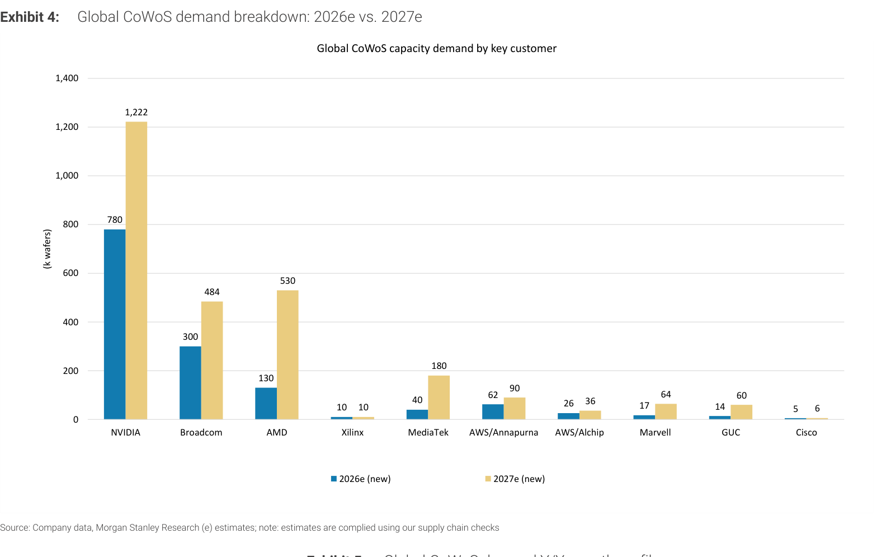

### 解讀摘要
視覺化呈現各客戶 2026e 到 2027e 的 CoWoS 分配絕對量對比。AMD 的長條擴張（130k→530k，+308%）最為顯眼，從最小 GPU 廠躍升為份額第二大；NVIDIA 增量（780k→1,222k，+442k）是絕對量最大增項；MediaTek（40k→180k，+350%）亦快速放量（Zebrafish + Humufish 同步在 2027 上量）。

---

## Exhibit 5｜CoWoS 需求 YoY 成長率一覽

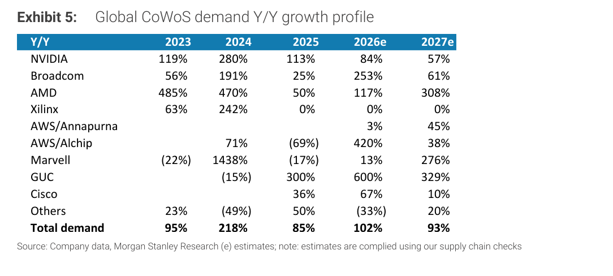

### 解讀摘要
2027e 整體 CoWoS 需求 +93% YoY，絕對增量 +1,300k wafers 遠超 2026e 的 +705k wafers。AMD 2027e +308% YoY 最高，GUC +329% YoY 緊追，Marvell +276% YoY 顯著——均反映 ASIC 設計廠的結構性崛起。NVIDIA 2027e 成長放緩至 +57%，但絕對量仍是主力。

### 表格（CoWoS 需求 YoY 成長率）

| 客戶 | 2023 | 2024 | 2025 | 2026e | 2027e |
|---|---|---|---|---|---|
| NVIDIA | 119% | 280% | 113% | 84% | 57% |
| Broadcom | 56% | 191% | 25% | 253% | 61% |
| AMD | 485% | 470% | 50% | 117% | 308% |
| Xilinx | 63% | 242% | 0% | 0% | 0% |
| AWS/Annapurna | — | — | — | 3% | 45% |
| AWS/Alchip | — | 71% | (69%) | 420% | 38% |
| Marvell | (22%) | 1438% | (17%) | 13% | 276% |
| GUC | — | (15%) | 300% | 600% | 329% |
| Cisco | — | — | 36% | 67% | 10% |
| Others | 23% | (49%) | 50% | (33%) | 20% |
| **合計** | **95%** | **218%** | **85%** | **102%** | **93%** |

### 洞察

> **洞察一**：Broadcom 2026e 爆發 +253% YoY（85k→300k），主因 Ironwood（TPU v7p）量產上量；2027e 回歸 +61% 正常成長（300k→484k），顯示 Sunfish 的增量是平穩吸收而非爆發性追加——對 Broadcom CoWoS 需求不應過度外推 2026 的爆發率。

---

## Exhibit 6｜CoWoS 供給端產能擴張

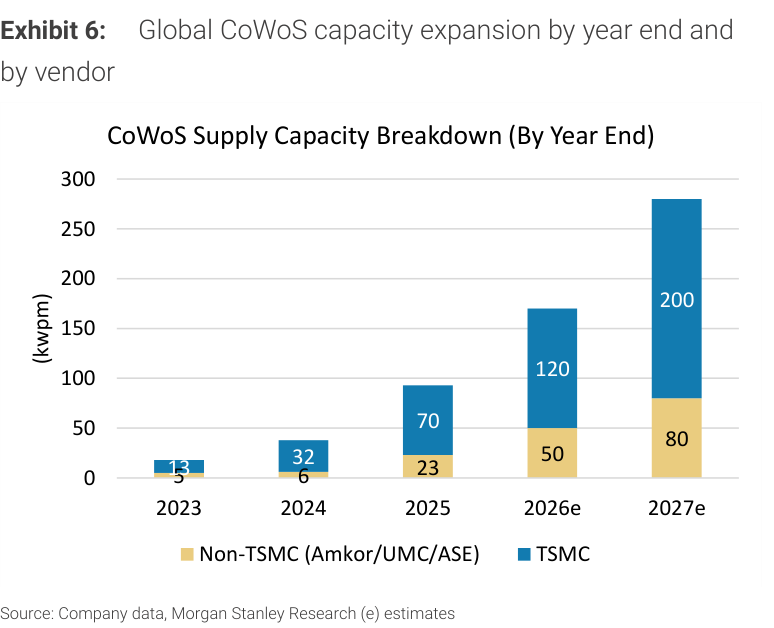

### 解讀摘要
2027e 年底 CoWoS 總產能 280kwpm（TSMC 200 + non-TSMC 80），從 2026e 170kwpm +65%。Non-TSMC 份額穩定在約 29%，絕對量翻倍（50→80kwpm），反映 Amkor/UMC/ASE 擴產加速但追不上 TSMC 節奏。TSMC 從 120kwpm 擴至 200kwpm（+67%），是供給增量主力。

### 表格（CoWoS 產能，kwpm，by 年底）

| 供應商 | 2023 | 2024 | 2025 | 2026e | 2027e |
|---|---|---|---|---|---|
| TSMC | 13 | 32 | 70 | 120 | 200 |
| Non-TSMC（Amkor/UMC/ASE） | 5 | 6 | 23 | 50 | 80 |
| **合計** | **18** | **38** | **93** | **170** | **280** |

### 洞察

> **洞察一（配合 Exhibit 3）**：以全年均攤估算（170→280kwpm，均值 ~225kwpm），2027 年全年可供應 ~2,700k wafers，與 2,694k 需求幾乎零缺口（<0.3%）。任何需求追加（AMD 優於預期、GUC Meta 確認）都立即造成 CoWoS 供給壓力，CoWoS 供應商定價權在 2027 年明顯強於 2026。

---

## Exhibit 7｜CoWoS 需求堆疊圖（by 客戶，2023-2027e）

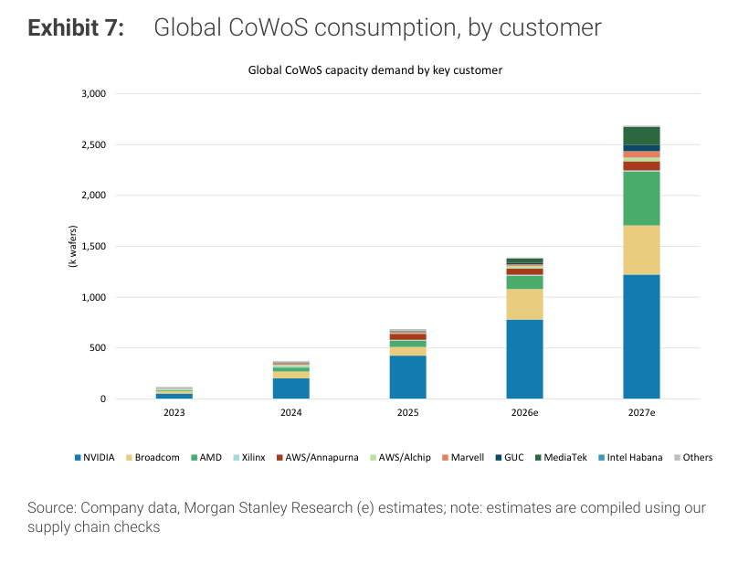

### 解讀摘要
堆疊長條圖呈現 2023-2027e 各客戶 CoWoS 需求的歷史成長脈絡。NVIDIA（最大塊）從 53k 擴張至 1,222k；AMD（藍色）在 2026-27 年急劇擴張清晰可見。此圖配合 Exhibit 4 的橫向比較，確認需求結構逐年多元化——2023 年前幾乎是 NVIDIA 一家，2027 年前三大合計仍達 83%，但 AMD 崛起及 MediaTek/GUC 加速是新結構特徵。

---

## Exhibit 8｜2026e HBM 需求表

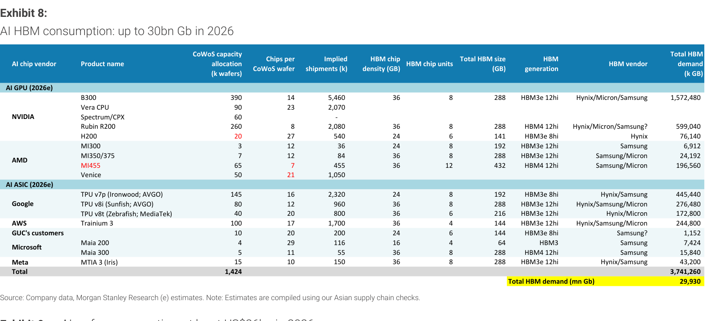

### 解讀摘要
2026e AI HBM 需求 29,930mn Gb（~30bn Gb），主力來自 NVIDIA B300（1,572,480k GB，53%）。B300 的 390k CoWoS 對應 5,460k chip 出貨，是 2026 最大 CoWoS 分配。Rubin R200 雖只有 260k CoWoS，但 HBM4 12hi × 8（288 GB/chip）對應 599,040k GB（20%），是 2026 年 HBM4 最主要需求來源——HBM4 初導入期由 Rubin 早期出貨（3Q26 開始量產）驅動。

### 表格（2026e AI HBM 需求，主要產品）

| 晶片廠商 | 產品 | CoWoS（k wafers） | 出貨量（k chips） | HBM 規格 | HBM 需求（k GB） |
|---|---|---|---|---|---|
| NVIDIA | B300 | 390 | 5,460 | HBM3e 12hi × 8（288 GB） | 1,572,480 |
| NVIDIA | Rubin R200 | 260 | 2,080 | HBM4 12hi × 8（288 GB） | 599,040 |
| NVIDIA | H200 | 20 | 540 | HBM3e 8hi × 6（141 GB） | 76,140 |
| AMD | MI300 | 3 | 36 | HBM3e 12hi × 8（192 GB） | 6,912 |
| AMD | MI350/375 | 7 | 84 | HBM3e 12hi × 8（288 GB） | 24,192 |
| AMD | MI455 | 65 | 455 | HBM4 12hi × 12（432 GB） | 196,560 |
| Google | TPU v7p（Ironwood; AVGO） | 145 | 2,320 | HBM3e 8hi × 8（192 GB） | 445,440 |
| Google | TPU v8i（Sunfish; AVGO） | 80 | 960 | HBM3e 12hi × 8（288 GB） | 276,480 |
| Google | TPU v8t（Zebrafish; MediaTek） | 40 | 800 | HBM3e 12hi × 6（216 GB） | 172,800 |
| AWS | Trainium 3 | 100 | 1,700 | HBM3e 12hi × 4（144 GB） | 244,800 |
| GUC's customers | — | 10 | 200 | HBM3e 8hi × 6（144 GB） | 1,152 |
| Microsoft | Maia 200 | 4 | 116 | HBM3 × 4（64 GB） | 7,424 |
| Microsoft | Maia 300 | 5 | 55 | HBM4 12hi × 8（288 GB） | 15,840 |
| Meta | MTIA 3（Iris） | 15 | 150 | HBM3e 12hi × 8（288 GB） | 43,200 |
| **合計（含其他）** | — | **1,424** | **18,526** | — | **3,741,260（= 29,930 mn Gb）** |

### 洞察

> **洞察一（配合 Exhibit 1）**：2026→2027 HBM 需求從 29.9bn 到 48.6bn Gb，+18.7bn Gb。其中 Rubin 系列（R200+Ultra）HBM4/4e 增量約 +10bn Gb（從 2026e 的 599k GB 擴至 2027e 的 2,104k GB），AMD MI455 的 HBM4 12hi × 12（432 GB/chip）是 GPU 中最高 stack 設計，以差異化 HBM 密度競爭。

---

## Exhibit 9｜2026e 計算晶圓收入 TAM

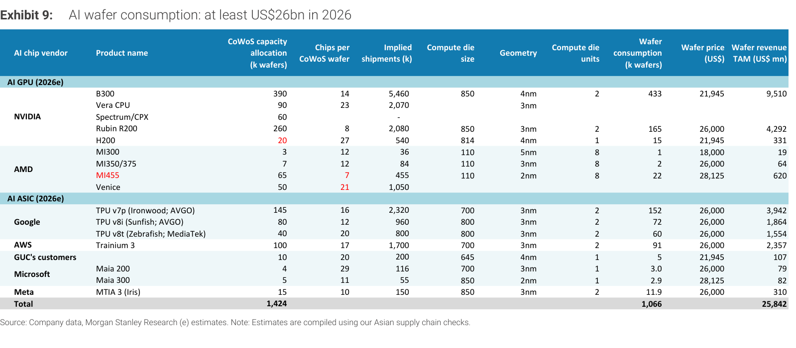

### 解讀摘要
2026e AI 計算晶圓消耗 1,066k wafers，晶圓收入 TAM US\$25.8bn。B300 消耗 433k 計算晶圓，貢獻 US\$9,510mn（37%）——NVIDIA Blackwell 是 2026 晶圓收入絕對主力。Rubin R200 以 165k 晶圓貢獻 US\$4,292mn（17%），3nm 單價（US\$26,000）比 B300 採用的 4nm（US\$21,945）高 18%。

### 表格（2026e 計算晶圓收入 TAM，主要產品）

| 晶片廠商 | 產品 | CoWoS（k wafers） | 製程 | 計算晶圓消耗（k wafers） | 晶圓價格（US\$） | 收入 TAM（US\$ mn） |
|---|---|---|---|---|---|---|
| NVIDIA | B300 | 390 | 4nm | 433 | 21,945 | 9,510 |
| NVIDIA | Rubin R200 | 260 | 3nm | 165 | 26,000 | 4,292 |
| NVIDIA | H200 | 20 | 4nm | 15 | 21,945 | 331 |
| AMD | MI300 | 3 | 5nm | 1 | 18,000 | 19 |
| AMD | MI350/375 | 7 | 3nm | 2 | 26,000 | 64 |
| AMD | MI455 | 65 | 2nm | 22 | 28,125 | 620 |
| Google | TPU v7p（Ironwood; AVGO） | 145 | 3nm | 152 | 26,000 | 3,942 |
| Google | TPU v8i（Sunfish; AVGO） | 80 | 3nm | 72 | 26,000 | 1,864 |
| Google | TPU v8t（Zebrafish; MediaTek） | 40 | 3nm | 60 | 26,000 | 1,554 |
| AWS | Trainium 3 | 100 | 3nm | 91 | 26,000 | 2,357 |
| GUC's customers | — | 10 | 4nm | 5 | 21,945 | 107 |
| Microsoft | Maia 200 | 4 | 3nm | 3.0 | 26,000 | 79 |
| Microsoft | Maia 300 | 5 | 2nm | 2.9 | 28,125 | 82 |
| Meta | MTIA 3（Iris） | 15 | 3nm | 11.9 | 26,000 | 310 |
| **合計（含其他）** | — | **1,424** | — | **1,066** | — | **25,842** |

---

## Exhibit 10｜Blackwell 晶片 vs. NVL72 Rack 出貨（舊版，未含 HGX）

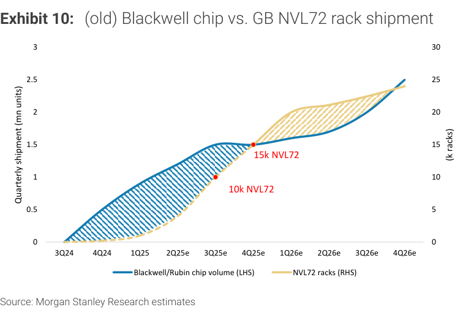

### 解讀摘要
舊版模型（未含 HGX）顯示 Blackwell chip 出貨量（LHS）與 NVL72 racks（RHS）的季度對比，3Q24 起量，2Q26e 附近出現 chip 累積「超出」rack 消化的表面落差，市場曾疑為庫存。本圖峰值約 15k NVL72/季。MS 確認此落差為供鏈緩衝，並非真實庫存堆積，待新版模型（Exhibit 11）納入 HGX 後落差消失。

---

## Exhibit 11｜Blackwell 晶片 vs. NVL72 + HGX 等效 Rack 出貨（新版）

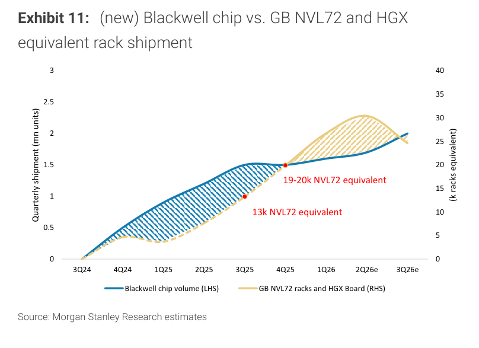

### 解讀摘要
新版模型納入 HGX（8-GPU per server），以 9 HGX servers = 1 NVL72 equivalent 計算。加入 HGX 後，等效 rack 需求明顯提升至 19-20k NVL72 equivalent/季，chip 出貨量（LHS）與 rack 需求的差距大幅縮小——確認所謂「庫存」是為 HGX 伺服器供貨的供鏈緩衝，預計 2026 年底全數消化。MS 估 2026 年 Blackwell chip 總出貨 5.4mn 單位。

### 洞察

> **洞察一**：納入 HGX 前後，等效 rack 需求從峰值 ~15k 跳至 ~19-20k（+27-33%），代表 HGX 伺服器約佔 Blackwell 需求的 20-25%，不可忽視——過去只算 NVL72 racks 低估了 GPU 真實消化量，也解釋了為何 chip 出貨領先 rack 訂單。

---

## Exhibit 12｜Rubin 晶片 vs. NVL72 Rack 出貨預測

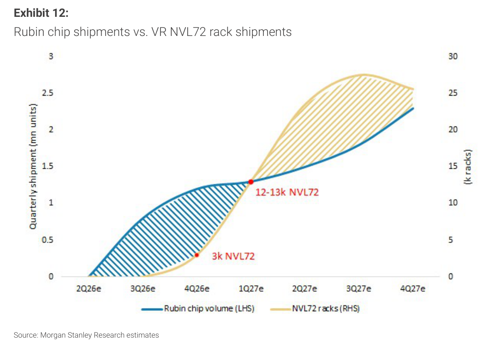

### 解讀摘要
MS 預估 2027 年 Rubin chip 合計約 7mn 單位（R200 5,920k + Ultra 1,040k ≈ 6,960k），NVL72 racks 達 90k。Rubin 從 3Q26 開始量產，rack 出貨從 4Q26 啟動，複製 Blackwell 模式（chip 先跑、rack 後跟）。MS 認為 Rubin 不會出現「庫存疑慮」，因 Blackwell 的前車之鑑已確認此模式為正常供鏈節奏。

### 洞察

> **洞察一**：90k NVL72 racks × 72 GPU/rack = 6.48mn GPU 等效需求，與 7mn Rubin chip 出貨高度匹配（差距 ~7%），暗示幾乎所有 Rubin 晶片用於 NVL72 配置，HGX 型態在 Rubin 世代比 Blackwell 更少——或 MS 估計尚未完整反映 HGX Rubin 需求。

---

## Exhibit 13｜AI 半導體 P/E 倍數走勢（Nov 2022 - May 2026）

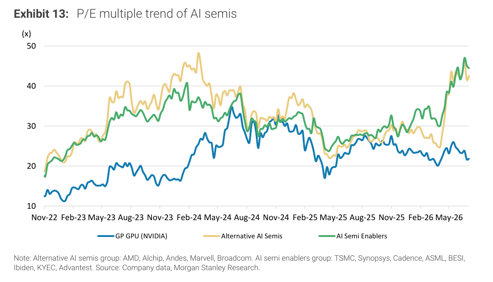

### 解讀摘要
三組 AI 半導體 P/E 走勢：GP GPU（NVIDIA）、Alternative AI Semis（AMD/Alchip/Andes/Marvell/Broadcom）、AI Semi Enablers（TSMC/Synopsys/Cadence/ASML/BESI/Ibiden/KYEC/Advantest）。三組均在 2023-2024 年快速爬升至 40-50x 峰值，2025 年後 NVIDIA P/E 維持高位，Alternative AI Semis 趨於收斂；Enablers 組（含 TSMC）P/E 最低但最穩定，反映確定性溢價而非成長溢價。

---

## Exhibit 14｜DC/HPC 半導體收入預測（NVIDIA + AMD，2014-2027e）

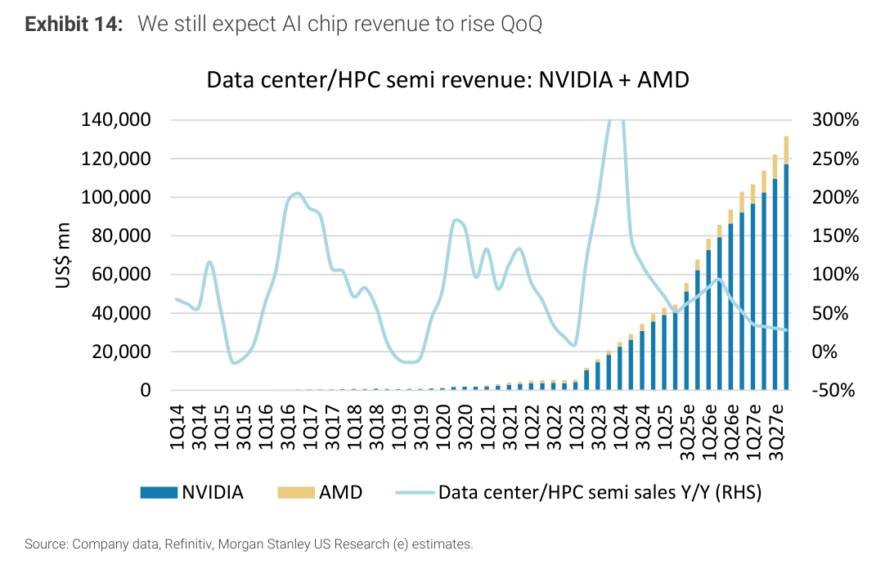

### 解讀摘要
NVIDIA + AMD 合計 DC/HPC 半導體季度收入從 2014 年幾乎為零，到 2026e 超過 US\$120bn 年化水準。MS 仍預期 AI 晶片收入 QoQ 持續上升——Sunfish 延遲與 KYEC 低於預期只是時程平移至 4Q26 或 1Q27，需求端並未下修。Y/Y 成長率（RHS）在 2024-2025 年超過 200%，2026-2027e 趨緩至 50-100% 仍屬高速成長。

---

## Exhibit 15｜TSMC AI 相關收入 2021-2029e

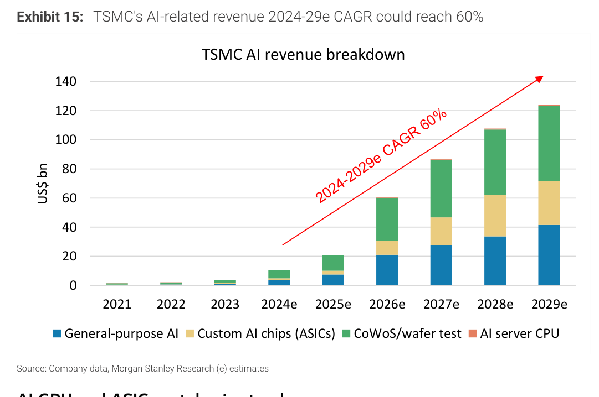

### 解讀摘要
TSMC 2024-2029e AI 相關收入 CAGR 預估達 60%，分四條成長線：General-purpose AI（GPU）、Custom AI chips（ASICs）、CoWoS/wafer test、AI server CPU。2026e 起 Custom AI chips 與 CoWoS 兩條線加速爬升，對應本報告中 Sunfish/Zebrafish/Rubin 多產品線同步放量。2029e 預估總 AI 收入達 US\$100bn 以上。

### 洞察

> **洞察一**：AI server CPU（NVIDIA Vera、AMD Venice）在 2026-27e 首次成為顯著 TSMC 收入貢獻項，代表傳統 CPU 供應商角色從 Intel 轉移到 TSMC 最具象徵意義的一步——TSMC 的 CoWoS AI server CPU 收入線單獨作為一條成長軸，2027e 後開始加速。

---

## Exhibit 16｜H100 雲端租賃定價追蹤（截至 2026 年 3 月底）

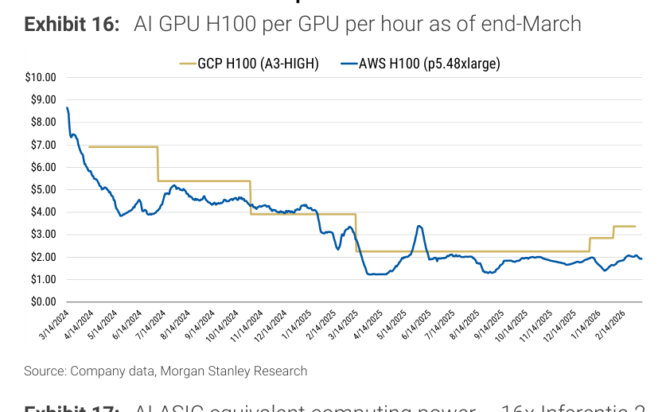

### 解讀摘要
截至 2026 年 3 月底，GCP H100（A3-HIGH）與 AWS H100（p5.48xlarge）每 GPU 每小時定價均已大幅回落（從 2024 年峰值約 US\$8-9 降至目前區間）。定價走低反映 Blackwell 大量上市後舊一代 GPU 供應趨於寬鬆，這是正常世代折舊，不代表 AI 需求疲軟——MS 預期 Rubin 上市後 H100 將繼續降價、但整體 AI 算力支出仍持續增長。

---

## Exhibit 17｜AWS Trainium 等效算力定價（16x Trainium/小時）

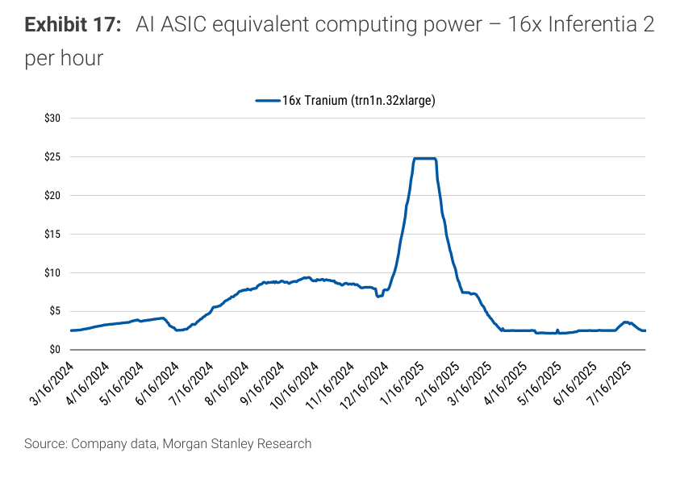

### 解讀摘要
16x Trainium（trn1n.32xlarge）每小時定價，反映 AWS 以自建 ASIC 低成本搶奪算力市場份額的定價策略（注：圖表標題標注「Inferentia 2」但 Y 軸標籤為「16x Trainium」，應為 Trainium 定價）。Trainium 比同等算力 H100 系統便宜約 60-70%，Trainium 3（Alchip 設計，100k CoWoS 分配）在 2026-27 年放量後，AWS 計算成本優勢將進一步擴大。

---

## Exhibit 18｜NVIDIA 5090 中國市場定價追蹤（2024/7 - 2026/6）

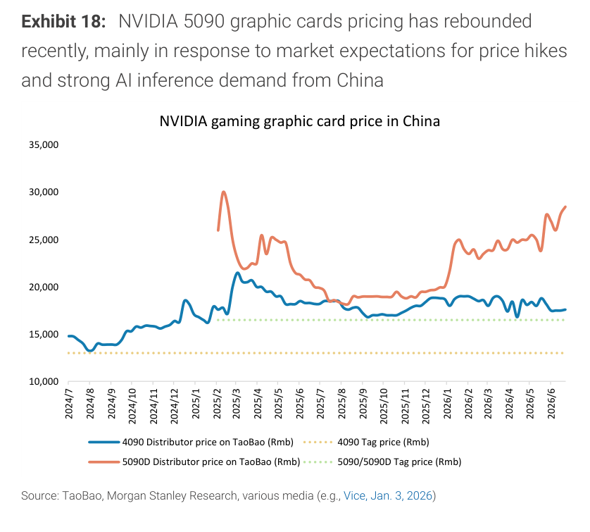

### 解讀摘要
NVIDIA 5090/5090D 中國 TaoBao 分銷商定價近期反彈，主因市場對漲價預期加強及中國 AI inference 需求強勁。4090 分銷商價格亦出現上漲。出口管制反而催生「稀缺性溢價」——中國市場以遠高於官方售價的分銷商溢價持續採購，顯示中國 AI 部署需求並未因管制而停滯，甚至因管制造成的供給緊缺而支撐更高價格。

---

## 跨 Exhibit 彙整表

### 彙整 1｜2026e vs. 2027e 供需關鍵指標對比（來源：Exhibit 3, 6, 8, 9, 1, 2）

| 指標 | 2026e | 2027e | YoY |
|---|---|---|---|
| CoWoS 總需求 | 1,394k wafers | 2,694k wafers | +93% |
| CoWoS 供給產能（年底） | 170kwpm | 280kwpm | +65% |
| 全年均攤可供產能（估算） | ~130kwpm → ~1,560k wafers | ~225kwpm → ~2,700k wafers | +73% |
| HBM 需求 | 29,930mn Gb | 48,618mn Gb | +63% |
| 計算晶圓收入 TAM | US\$25.8bn | US\$46.2bn | +79% |
| NVIDIA CoWoS 佔比 | 56% | 45% | -11ppt |
| AMD CoWoS 佔比 | 9% | 20% | +11ppt |

*均攤產能為視覺估算，以各年年初→年底線性插值*

> **彙整洞察**：2026e 供需存在緩衝（~1,560k 供 vs 1,394k 需，利用率 ~89%）；2027e 轉為幾乎零缺口（~2,700k 供 vs 2,694k 需，利用率 ~99.8%）。任何 2027 年需求上修（AMD 執行優於預期、GUC Meta 確認）都直接轉化為供給缺口，CoWoS 供應商定價權 2027 年明顯強於 2026 年。

---

## 相關個股清單

| 類別 | 公司 | Ticker | 評等 | 備註 |
|---|---|---|---|---|
| GPU | NVIDIA | NVDA | OW（MS） | Rubin 2027e 870k CoWoS；供鏈主幹受益 |
| GPU | AMD | AMD | — | 2027e 240k CoWoS；執行風險需持續監測 |
| ASIC 設計服務 | Broadcom | AVGO | — | Sunfish（330k）、Apollo 設計；1Q28 Meta 量產 |
| ASIC 設計服務 | GUC | 2457 | — | Meta Apollo 側項目（Rivos 團隊）潛在勝出，tape-out 1H27 |
| ASIC 設計服務 | Alchip | 3661 | — | AWS/Alchip 36k CoWoS；AMD Venice OSAT 潛力 |
| ASIC 設計 | MediaTek | 2454 | — | Zebrafish（180k）+ Humufish（400k）雙產品設計 |
| 晶圓代工 | TSMC | 2330 | OW（MS） | 2027e CoWoS 200kwpm；AI revenue CAGR 60%（2024-29e） |
| 封測 | KYEC | 2449 | — | Sunfish 量集中 4Q26；3Q26 +10% QoQ（非原估 15%） |
| 封測 | ASE/SPIL | 3711 | — | AMD Venice CoWoS-R/CoWoS-L 主要 OSAT |
| 封測 | Amkor | AMKR | — | AMD/Broadcom/Marvell 非 TSMC CoWoS 份額 |
