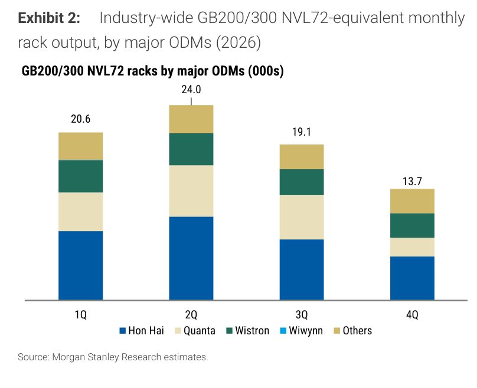
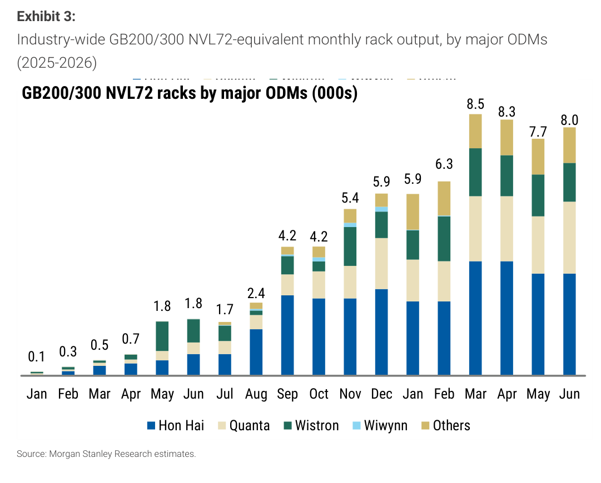
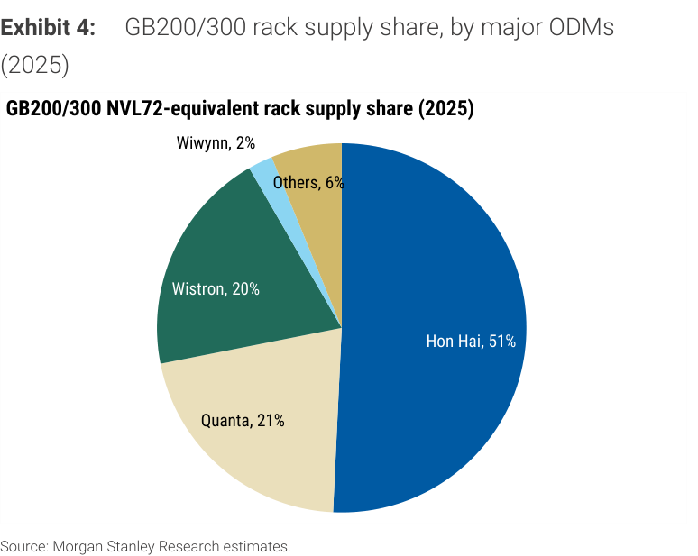

# Morgan Stanley｜GB200 and GB300 NVL72 Racks in June 2026

**券商**：Morgan Stanley  
**分析師**：Howard Kao、Andy Meng CFA、Irene Yen (RA)  
**日期**：2026-07-08  
**主題**：NVL72 rack 月度追蹤：2026 年 6 月出貨  
**評級**：In-Line（產業評等）  
<a href="https://layx.uk/dl?g=產業&b=MS&d=20260708&h=NVL72-Racks">📎 下載 PDF</a>

---

## 報告總結

本報告為 MS 每月發布的 GB200/300 NVL72 Rack 出貨追蹤，觸發時點為三大 ODM（鴻海、廣達、緯創）公布 6 月月營收後。6 月產業合計約 8.0k racks（+5% m/m），2Q26 累計 24.0k racks，符合 MS 全年 70-80k 預估的進度。Quanta/Wistron 2Q 小幅低於原預期（分別 6.2-6.3k vs 6.7k、3.9-4.0k vs 4.2k），短缺量預期遞延至 2H26，全年預估未動。Hon Hai 2Q 略超預期（10.3k vs 10k），3Q 管理層暗示有上行空間（前估 7.5k）。

個股偏好排序：Wistron > Hon Hai > Quanta（based on upside to PT）。2026 全年出貨型態呈現前高後低（1Q 20.6k、2Q 24.0k、3Q 19.1k、4Q 13.7k），4Q 較 2Q 銳減，與 Rubin rack 從 4Q26 啟動接力的時程一致——Blackwell 收尾、Rubin 接棒的轉換期。

---

## Morgan Stanley 完整投資邏輯鏈

| 論點層次 | Exhibit | 內容 |
|---|---|---|
| 需求信號持續 | 1, 2 | 2026 全年 70-80k racks（+100%+ YoY vs 2025 ~29k）；6 月 8.0k，月出貨維持高位 |
| 個股分化 | 3, 4, 5 | 鴻海份額從 51%（2025）降至 41%（2026）；Others 從 6% 升至 17%，市場結構分散化 |
| 遞延不等於取消 | 2 | Quanta/Wistron 2Q 短缺均定性為「pushed out to 2H」；全年維持不變 |
| 個股偏好排序 | 報告封面 | Wistron > Hon Hai > Quanta（上行空間 to PT）；Hon Hai 3Q 暗示 upside |
| **結論** | 報告封面 | **2026 NVL72 rack 出貨軌道完好；3Q 鴻海有上行，4Q 隨 Rubin 接棒自然降速** |

---

## 報告核心觀點

| 主題 | MS 觀點 | 市場共識 | 是否 Contra-Consensus |
|---|---|---|---|
| 2026 全年 NVL72 racks | 70-80k，全年不變 | ~70-80k | 一致 |
| Quanta 2Q26 | 6.2-6.3k（小幅低於預期 6.7k） | ~6.7k | 偏空（但遞延不取消） |
| Wistron 2Q26 | 3.9-4.0k（小幅低於預期 4.2k） | ~4.2k | 偏空（同上） |
| Hon Hai 2Q26 | 10.3k（小幅超預期 10k） | ~10k | 偏多 |
| Hon Hai 3Q26 | 管理層暗示 >7.5k，有 upside | ~7.5k | 偏多 |
| 個股偏好 | Wistron > Hon Hai > Quanta | — | — |

**零件/個股偏好**：Wistron（3231）最偏好；Hon Hai（2317）次之；Quanta（2382）第三

---

## Exhibit 1｜2025 各季 NVL72 Rack 出貨（by ODM）

### 解讀摘要
2025 全年 NVL72 racks 合計約 29k（= 0.9 + 4.3 + 8.3 + 15.5），呈現典型後端集中型態——4Q 佔全年 53%（15.5k），1Q 僅 0.9k（3%）。Hon Hai 為全年最大 ODM（約 51% 份額，見 Exhibit 4），4Q 衝高至 ~8k 以上。這是 GB200 從小批驗收到大批量交付的典型 ramp 曲線，2026 年複製類似模式但起點大幅拉高（1Q 即達 20.6k）。

### 表格（2025 各季 NVL72 Rack 出貨，000s）

| 季度 | 出貨量（k racks） |
|---|---|
| 1Q25 | 0.9 |
| 2Q25 | 4.3 |
| 3Q25 | 8.3 |
| 4Q25 | 15.5 |
| **全年 2025** | **~29.0** |

### 洞察

> **洞察一**：2025 年整體出貨 ~29k，4Q 佔超過半數（15.5k），體現大型 AI 伺服器訂單的 skewed-to-year-end 交付特性——供應鏈從 L10 計算托架交付至 rack 組裝測試（L11）還有時間差，MS 提醒實際到客戶端交付量低於上圖數字。

---

## Exhibit 2｜2026 各季 NVL72 Rack 出貨預測（by ODM）

### 解讀摘要
2026 全年 NVL72 racks 約 77.4k（20.6 + 24.0 + 19.1 + 13.7），符合 MS 70-80k 預估區間。與 2025 年後端集中型態相反，2026 前端（1Q-2Q）明顯較重（58%），3-4Q 遞減——反映 Blackwell 出貨在 2H26 自然降溫，同時 Rubin 從 4Q26 接棒（但 Rubin NVL72 尚非本系列追蹤範圍）。1Q26 即達 20.6k，是 2025 全年的 71%，需求規模徹底換量級。

### 表格（2026 各季 NVL72 Rack 出貨預測，000s）

| 季度 | 出貨量（k racks） | 各季佔比 |
|---|---|---|
| 1Q26 | 20.6 | 27% |
| 2Q26 | 24.0 | 31% |
| 3Q26e | 19.1 | 25% |
| 4Q26e | 13.7 | 18% |
| **全年 2026e** | **~77.4** | **100%** |

*合計 ~77.4k，在 MS 全年 70-80k 指引區間內*

### 洞察

> **洞察一（配合 Exhibit 1）**：2025→2026 YoY 成長 +167%（29k→77.4k），2Q26 單季 24.0k 已等於 2025 全年 29k 的 83%。此規模擴張驗證 AI 伺服器需求已完全脫離前期受限於供給（CoWoS/HBM）的制約，進入大規模量產交付階段。

> **洞察二**：4Q26 降至 13.7k（較 2Q 峰值 -43%），不應被解讀為需求疲軟——這是 Blackwell 世代收尾 + Rubin 接棒前的自然轉換期；看 Rubin 4Q26 rack 啟動量是否能填補缺口。

---

## Exhibit 3｜月度 NVL72 Rack 出貨追蹤（2025 Jan - 2026 Jun）

### 解讀摘要
月度出貨從 2025 Jan 0.1k 穩步爬升至 2026 Mar 峰值 8.5k，此後在 7-8k 區間高位盤整（Apr 8.3k、May 7.7k、Jun 8.0k）。2026 年 6 月 8.0k（+5% m/m）顯示出貨動能仍穩健，無明顯下滑訊號。2026 1Q 月均 ~6.9k，2Q 月均 ~8.0k，符合季度累計。

### 表格（月度 NVL72 Rack 出貨，k racks）

| 月份 | 2025 | 月份 | 2026 |
|---|---|---|---|
| Jan | 0.1 | Jan | 5.9 |
| Feb | 0.3 | Feb | 6.3 |
| Mar | 0.5 | Mar | 8.5 |
| Apr | 0.7 | Apr | 8.3 |
| May | 1.8 | May | 7.7 |
| Jun | 1.8 | Jun | 8.0 |
| Jul | 1.7 | — | — |
| Aug | 2.4 | — | — |
| Sep | 4.2 | — | — |
| Oct | 4.2 | — | — |
| Nov | 5.4 | — | — |
| Dec | 5.9 | — | — |

### 洞察

> **洞察一**：2025 Dec（5.9k）→ 2026 Jan（5.9k）無季節性跌落，顯示 AI rack 出貨沒有傳統 ODM 的 1Q 淡季特性——訂單強度蓋過淡旺季節奏，這對評估 2026 1Q 結果特別重要（傳統模型可能低估）。

---

## Exhibit 4｜2025 NVL72 Rack 供應份額（by ODM）

### 解讀摘要
2025 年 NVL72 rack 供應份額：Hon Hai 51%、Quanta 21%、Wistron 20%、Wiwynn 2%、Others 6%。鴻海以絕對優勢主導 2025 年供應，Quanta 與 Wistron 幾乎並列第二；Wiwynn 雖是 Wistron 子公司，單獨列出份額僅 2%，代表 Wistron 主力是直接 rack 業務而非透過 Wiwynn。

### 表格（2025 NVL72 Rack 供應份額）

| ODM | 份額 |
|---|---|
| Hon Hai（2317） | 51% |
| Quanta（2382） | 21% |
| Wistron（3231） | 20% |
| Wiwynn（6669） | 2% |
| Others | 6% |

---

## Exhibit 5｜2026 NVL72 Rack 供應份額（by ODM）

### 解讀摘要
2026 年份額重組：Hon Hai 下滑至 41%（-10ppt），Quanta 升至 24%（+3ppt），Wistron 降至 18%（-2ppt），Wiwynn 降至 0%，Others 大幅升至 17%（+11ppt）。「Others」躍升 11ppt 是最大變化，暗示新 ODM 進入 NVL72 rack 生態系（可能包含 Inventec/英業達、Pegatron 或其他供應商），市場結構分散化趨勢明顯。

### 表格（2026 NVL72 Rack 供應份額）

| ODM | 份額 | vs. 2025 |
|---|---|---|
| Hon Hai（2317） | 41% | -10ppt |
| Quanta（2382） | 24% | +3ppt |
| Wistron（3231） | 18% | -2ppt |
| Wiwynn（6669） | 0% | -2ppt |
| Others | 17% | +11ppt |

### 洞察

> **洞察一（配合 Exhibit 4）**：Hon Hai 份額從 51% 降至 41%，但對應的是絕對量大幅成長（從 ~14.8k 到 ~31.7k，+114% YoY）——份額稀釋不等於業務萎縮，是市場大餅膨脹下的自然稀釋。真正的風險是 Others 17% 代表哪些競爭者：若為 Lenovo 或 Inventec 等，代表 NVIDIA 在 ODM 分散化，長期影響鴻海定價能力。

> **洞察二**：Wistron 2026 份額 18%（18k→14.1k YoY 預估）對應全年 ~14.1k racks，明顯低於 Exhibit 2 的隱含 18% × 77.4k = ~13.9k，MS 個股預估數與份額圖高度一致（誤差 <1%）。

---

## 跨 Exhibit 彙整表

### 彙整 1｜各 ODM 2026 全年 NVL72 Rack 預估（來源：Exhibit 2, 5，配合正文）

| ODM | 2026e 份額 | 2026e 全年估算（k racks） | MS 個股預估（k racks） | 備註 |
|---|---|---|---|---|
| Hon Hai（2317） | 41% | ~31.7k | ~31.7k（=10.3k 2Q × 推算） | 3Q 管理層暗示 upside vs 7.5k 預估 |
| Quanta（2382） | 24% | ~18.6k | ~18.7k | 2Q 6.2-6.3k，下半年遞延補齊 |
| Wistron（3231） | 18% | ~13.9k | ~14.1k | 2Q 3.9-4.0k，下半年遞延補齊 |
| Wiwynn（6669） | 0% | ~0k | — | — |
| Others | 17% | ~13.2k | — | 新 ODM 進入，待確認 |
| **合計** | **100%** | **~77.4k** | **~70-80k（MS 指引）** | |

> **彙整洞察**：三大 ODM 個股預估加總（18.7 + 14.1 + ~31.7 ≈ 64.5k）vs 產業總量 77.4k，缺口 ~12.9k 即為 Others 17% 份額，印證「Others」是來自非傳統 ODM 的真實新增出貨，而非誤算。

---

## 相關個股清單

| 類別 | 公司 | Ticker | 評等 | 備註 |
|---|---|---|---|---|
| Server ODM | Hon Hai（鴻海） | 2317 | OW（MS） | 2026 41% 份額；3Q rack 有 upside；個股偏好排序第二 |
| Server ODM | Quanta（廣達） | 2382 | OW（MS） | 2026 24% 份額；2Q 6.2-6.3k；全年 18.7k；個股偏好第三 |
| Server ODM | Wistron（緯創） | 3231 | OW（MS） | 2026 18% 份額；2Q 3.9-4.0k；全年 14.1k；**個股最偏好** |
| Server ODM | Wiwynn（威聯通） | 6669 | — | 2026 份額降至 0%（Wistron 子公司，本追蹤顯示無獨立 rack 份額） |
