# BofA｜Global Memory Tech Weekly：超級週期再確認，DRAM 2026E +325% YoY

**券商**：Bank of America Global Research  
**分析師**：Simon Woo (CFA)、Dai Shen、Vivek Arya、Mikio Hirakawa、Matt Shin  
**日期**：2026-07-11  
**主題**：Global Memory Tech Weekly — Samsung correction, strong indicator, CXMT IPO, Nanya Tech upturn  
**評級**：Samsung Electronics Buy（TP W480,000）；SK Hynix Restricted；Nanya Buy（TP NT\$660）  
<a href="https://layx.uk/dl?g=產業&b=BofA&d=20260711&h=Memory-Weekly">📎 下載 PDF</a>

---

## 報告總結

本週記憶體超級週期關鍵指標同步亮燈：BofA Memory Indicator 5 月仍在歷史高位 183（前峰值 120-140），DRAM/NAND 全球帳款 YoY 均超 +300%，Nanya 2Q26 OPM 達 74%（去年同期 -43%），韓國半導體出口 6 月 YoY +199%。報告核心是釐清 Samsung 股價修正原因（Meta 砍單恐慌、CXMT IPO、QoQ 成長放緩），BofA 認為基本面無破壞——3Q26 合約更有利，CXMT 市佔僅 high-single-digit%，BofA 小幅上調 3Q26 DRAM ASP 假設至 +21% QoQ（前 +17%）。

DRAM 2026E 全年營收目標 US\$568.8bn（+325% YoY），2027E 進一步升至 US\$826.4bn（+45%）；HBM 2026E US\$76.8bn（+122% YoY），OPM 近 50%。NAND 短期合約價 QoQ 略降但 YoY 仍 +600%+，下半年承壓幅度可控。

---

## BofA 完整投資邏輯鏈

| 論點層次 | Exhibit | 內容 |
|---|---|---|
| 超級週期驗證 | 10–12 | BofA Memory Indicator 5 月 183，遠超 2017/2024 峰值（120-140）；DRAM billings +309% YoY、NAND billings +377% YoY |
| 需求端確認 | 17–18, 39–44 | AI 伺服器佔 DRAM 需求逾半；超大型雲端業者 capex 持續創高 |
| 供給紀律未破壞 | 26–29 | 大三廠 DRAM 產能 YoY +11%，NAND +5%；HBM 佔走 DRAM 製程產能，傳統 DRAM 供給更緊 |
| ASP 上修信號 | 15–16, 52–65 | 3Q26 DRAM ASP 上調至 +21% QoQ；6 月現貨 DDR5 ATH \$48、DDR4 16Gb \$77.6 |
| 風險澄清 | 30–32, 33–38 | CXMT high-single-digit% 市佔、HBM/GDDR7 仍 ex-China 主導；HBM 2026E OPM ~50% |
| Nanya 驗證 | 3–6 | 2Q26 OPM 74%（去年同期 -43%），DRAM ASP QoQ +60%+；Samsung 傳統 DRAM 讀穿正面 |
| **結論** | 封面 | **DRAM 超級週期延續至 2027E（US\$826bn）；偏好 Samsung（Buy）、Nanya（Buy）、SK Hynix（Restricted）** |

> **報告最大邏輯缺口**：3Q26 DRAM ASP +21% QoQ 假設依賴「新合約已透露 20%+ 漲價」渠道數據，尚無公開第三方驗證。

---

## 報告核心觀點

| 主題 | BofA 觀點 | 市場共識 | 是否 Contra-Consensus |
|---|---|---|---|
| Samsung 股價修正 | 恐慌源於 Meta 砍單 / CXMT / QoQ 放緩，非基本面；3Q26 合約更有利 | 空方認為週期見頂 | 是（BofA 逆市偏多） |
| CXMT 威脅 | market share high-single-digit%，高端 DRAM 仍以 ex-China 為主 | 市場高估衝擊 | 是 |
| DRAM 超級週期 | 延續至 2027E；Memory Indicator 183 史無前例 | 普遍擔憂反轉 | 是 |
| HBM | 2026E US\$77bn +122% YoY，OPM ~50%；2027E US\$135bn | 普遍看好 HBM | 無（方向一致，幅度更積極） |
| NAND 短期 | 512Gb 合約 QoQ -11%，但 YoY +621%，下行可控 | 擔憂 NAND 轉弱 | 無（BofA 承認短期承壓） |

**偏好排序**：SK Hynix（HBM 市佔最高）＞ Samsung（傳統 DRAM 受益最大）＞ Nanya（最純粹的傳統 DRAM 受益者，OPM 結構性升至 70%+）

---

## Exhibit 1｜全球記憶體展望 — 超級週期預計延續至 2027

*(封面摘要表，BofA locator 未單獨裁切圖片)*

### 解讀摘要

2026E DRAM 銷售 +325% YoY（ASP +249%，bit +22%）；NAND 銷售 +299% YoY（ASP +238%，bit +18%）。ASP 是主要驅動力，bit 成長幅度遠低於 ASP 漲幅，說明這是一個「價格主導」而非「量能主導」的超級週期。2027E DRAM 成長放緩至 +45%（ASP +25%，bit +17%），週期不反轉只是降溫。

### 表格

| 指標 | 2024 | 2025 | 2026E | 2027E |
|---|---|---|---|---|
| DRAM 銷售 YoY | +86% | +52% | **+325%** | +45% |
| NAND 銷售 YoY | +84% | +4% | **+299%** | +30% |
| DRAM ASP YoY | +62% | +29% | +249% | +25% |
| NAND ASP YoY | +65% | -8% | +238% | +9% |
| DRAM bit YoY | +15% | +18% | +22% | +17% |
| NAND bit YoY | +11% | +13% | +18% | +20% |
| DRAM capex YoY | +49% | +43% | +65% | +27% |
| NAND capex YoY | +4% | -5% | +55% | +18% |
| DRAM 產能 YoY | +7% | +8% | +11% | +9% |
| NAND 產能 YoY | -2% | -7% | +5% | +4% |

> **洞察一**：DRAM ASP +249% vs 產能 +11%，兩者倍率差距 >20 倍，意味若 ASP 未來五年回歸正常，利潤池會大幅壓縮——這正是為何 BofA 強調「週期不反轉，只是降溫」的敘事至關重要。

---

## Exhibit 2｜DDR5 / DDR4 6 月上漲，NAND 現貨轉軟

*(封面摘要表，BofA locator 未單獨裁切圖片)*

### 解讀摘要

截至 2026-07-10 的最新現貨行情：DDR5 WoW +2% 創新高 US\$47.8，DDR4 16Gb 同步 +2% 至 US\$77.6，8Gb DDR4 +3% 至 US\$37.8。YoY 漲幅均超 +650%。NAND 現貨則 WoW -1% 至 -3%，QoQ -7% 至 -11%，NAND 短期動能分歧於 DRAM。

### 表格

| 品項 | 現價（US\$） | WoW | QoQ | YoY |
|---|---|---|---|---|
| 16Gb DDR5 spot | 47.8 | +2% | +29% | +688% |
| 16Gb DDR4 spot | 77.6 | +2% | +9% | +825% |
| 8Gb DDR4 spot | 37.8 | +3% | +13% | +661% |
| 1Tb NAND wafer spot | 24.2 | -1% | -9% | +377% |
| 512Gb NAND wafer spot | 19.3 | -3% | -11% | +621% |
| 256Gb NAND wafer spot | 10.2 | 0% | -7% | +578% |

> **洞察一**：DDR4 16Gb spot US\$77.6 vs DDR5 16Gb US\$47.8——DDR4 比 DDR5 貴 63%，反映遺留 DDR3/4 系統無法換 DDR5，造成特定規格供不應求的極端情況，這正是 Nanya（純 DDR3/4）毛利高達 79% 的核心原因。

---

## Exhibit 3｜Nanya 6 月月營收再創新高（NT\$29.4bn）

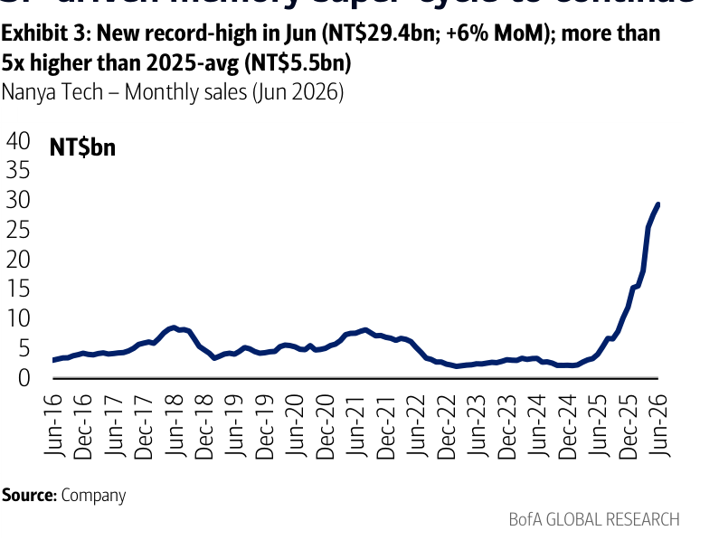

### 解讀摘要

Nanya 2026 年 6 月月營收 NT\$29.4bn（+6% MoM），比 2025 年均值 NT\$5.5bn 高出逾 5 倍，為有史以來單月最高紀錄。持續的 DRAM ASP 上漲是唯一驅動力，Nanya 出貨量本身無顯著成長，說明整個漲幅幾乎純為 ASP 貢獻。

> **洞察一**：5 倍以上月營收成長與 Nanya 產能長期停滯在 4x nm 形成強烈對比——這正是「遺留 DRAM 稀缺性溢價」最直觀的量化呈現，也支持了 BofA「遺留 DRAM 比 HBM 更賺錢」的反共識論點。

---

## Exhibit 4｜Nanya YoY 月銷售成長 +621%，連 11 個月三位數反彈

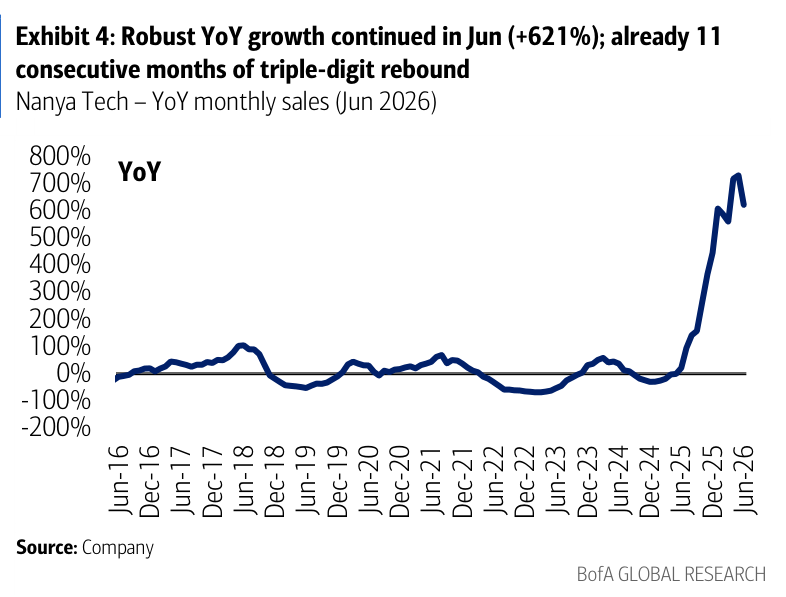

### 解讀摘要

Nanya 6 月 YoY 成長達 +621%，已連續 11 個月維持三位數 YoY 成長。成長趨勢完全由 DRAM 遺留產品 ASP 上漲驅動，2025 年 6 月底部效應低基期也放大了 YoY 倍數。

---

## Exhibit 5｜Nanya DRAM ASP 逐季軌跡：2Q26 +60%+ QoQ，3Q26E +23%

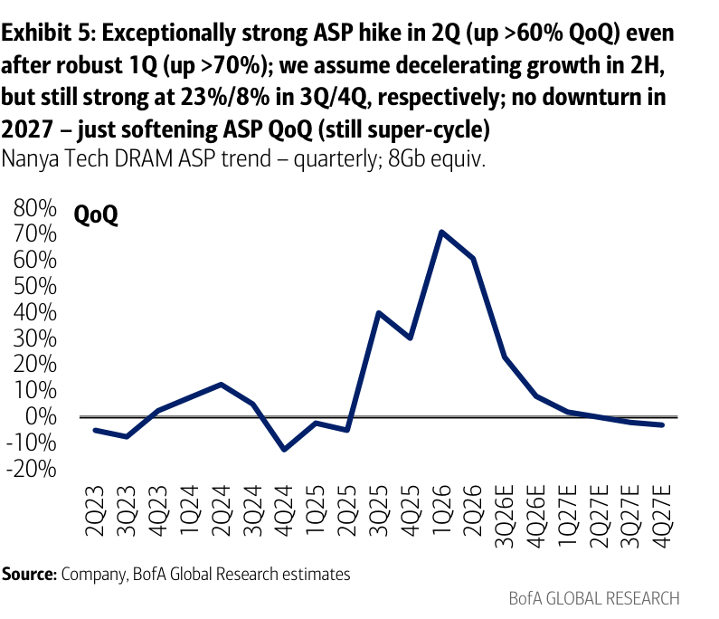

### 解讀摘要

Nanya 2Q26 DRAM ASP QoQ 漲幅超 +60%（接續 1Q26 的 +70%+），BofA 估計 3Q26E +23% QoQ，4Q26E +8%。2027 年即使 ASP 走軟，仍不至於出現下跌週期——BofA 將此定性為「降溫」而非「反轉」。ASP 序列（2Q26：+60%，3Q26E：+23%，4Q26E：+8%，1Q27E：持平）呈現典型的超級週期高原期形態。

### 表格

| 季度 | Nanya DRAM ASP QoQ |
|---|---|
| 1Q26（實際） | +70%+ |
| 2Q26（實際） | +60%+ |
| 3Q26E（BofA） | +23% |
| 4Q26E（BofA） | +8% |

---

## Exhibit 6｜Nanya 毛利 / 營益率趨勢：2Q26 GM 79%，OPM 74%

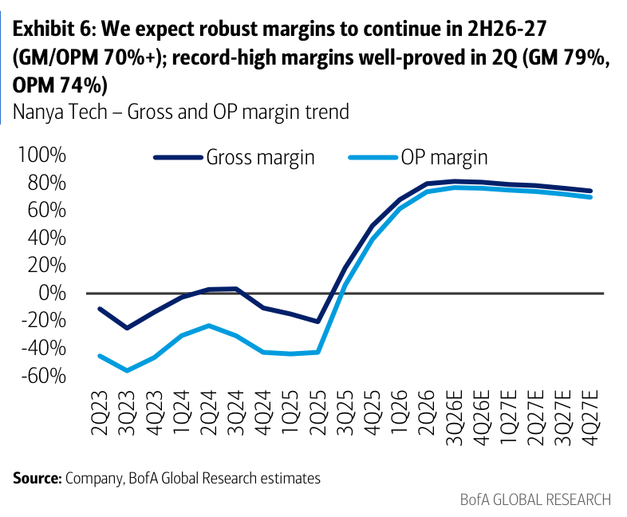

### 解讀摘要

Nanya 2Q26 毛利率 79%、營益率 74%（去年同期 GM：負值，OPM：-43%）。BofA 預期 2H26-27 均可維持 GM/OPM 70%+ 水準。Nanya 因無 HBM capex 包袱，固定成本低，在 ASP 強勁的遺留 DRAM 週期中享有極高的 OPM 槓桿。

### 表格

| | 2Q26（實際） | 2H26E（BofA） | 2027E（BofA） |
|---|---|---|---|
| 毛利率 | 79% | 70%+ | 70%+ |
| 營益率 | 74% | 70%+ | 70%+ |
| 去年同期 OPM | -43% | — | — |

> **洞察一**：Nanya 74% OPM 背後的含義是，若 DRAM ASP 從 2Q26 水準腰斬，Nanya 的 OPM 仍有很大的安全墊——這正是 BofA 「低估值買點」論述的基礎（9x 2027-28E P/E）。

---

## Exhibit 7｜Phison 6 月月營收創歷史新高（NT\$24.9bn）

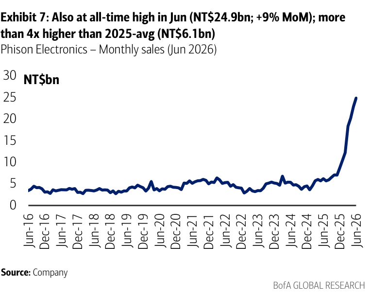

### 解讀摘要

Phison 2026 年 6 月月營收 NT\$24.9bn（+9% MoM），超越 2025 年均值 NT\$6.1bn 逾 4 倍，為歷史新高。Phison 受益於 NAND 控制器及 Enterprise SSD 漲價，也反映了 AI 資料中心對高效能 SSD 的持續強勁需求。

---

## Exhibit 8｜Phison YoY 月銷售成長 +301%，連 6 個月三位數

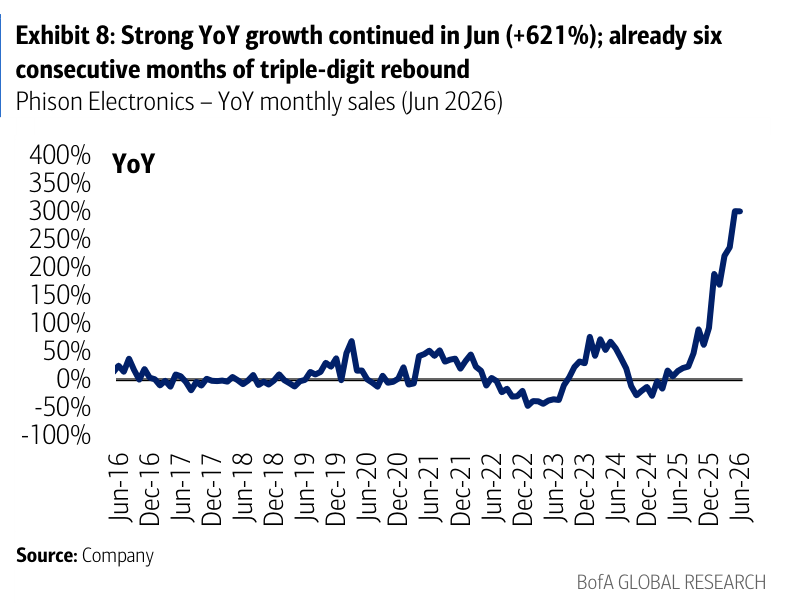

### 解讀摘要

Phison 6 月 YoY +301%，已連續 6 個月維持三位數成長。相對於 Nanya 的 +621% YoY，Phison 漲幅較低，反映 NAND 控制器漲幅適中（NAND wafer QoQ 已轉軟），也暗示下半年 Phison 月營收成長可能趨緩。

---

## Exhibit 10｜BofA Memory Indicator 5 月維持歷史高位（183）

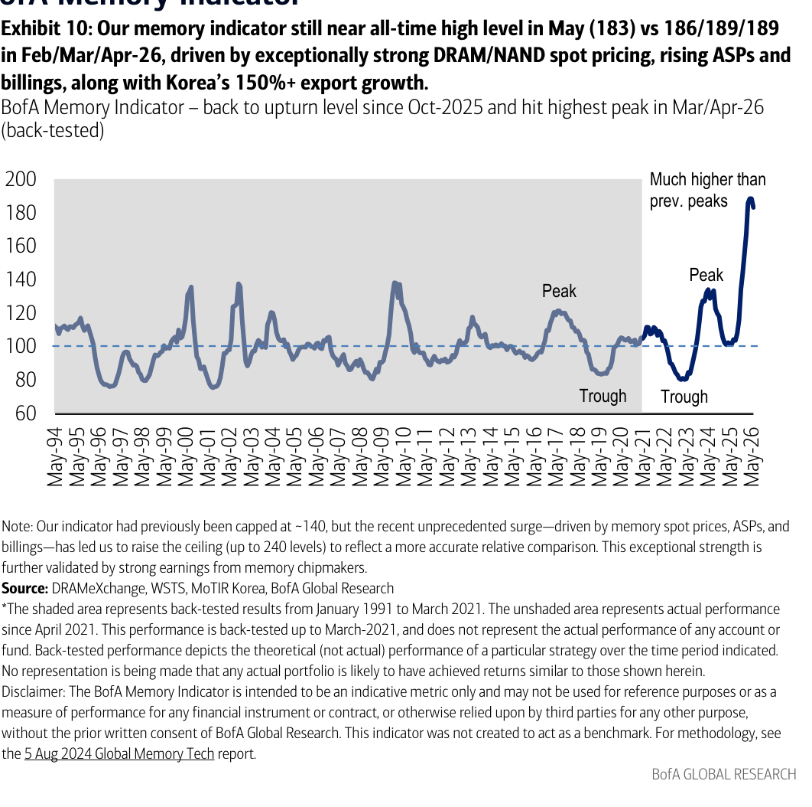

### 解讀摘要

BofA Memory Indicator 5 月讀數 183，2 月 / 3 月 / 4 月分別為 186 / 189 / 189（接近今年高峰）。歷史上 2017 年和 2024 年週期高峰約在 120-140，中性水準 100，衰退水準 80。當前 183 遠超所有歷史前例，BofA 為此上調量表上限至 240 以更精確反映實際強度。Indicator 由 7 個分量組成：DRAM/NAND 現貨價、韓國半導體出口、DRAM/NAND ASP 和 billing。

> **洞察一**：183 vs 歷史峰值 140 代表強度超出歷史最大值約 30%，若前一週期（2017）配合的個股表現是數倍漲幅，本週期強度更高、但起始估值也更高，兩者需要同時考量。

---

## Exhibit 11｜Memory Indicator 與股價高度相關（回測）

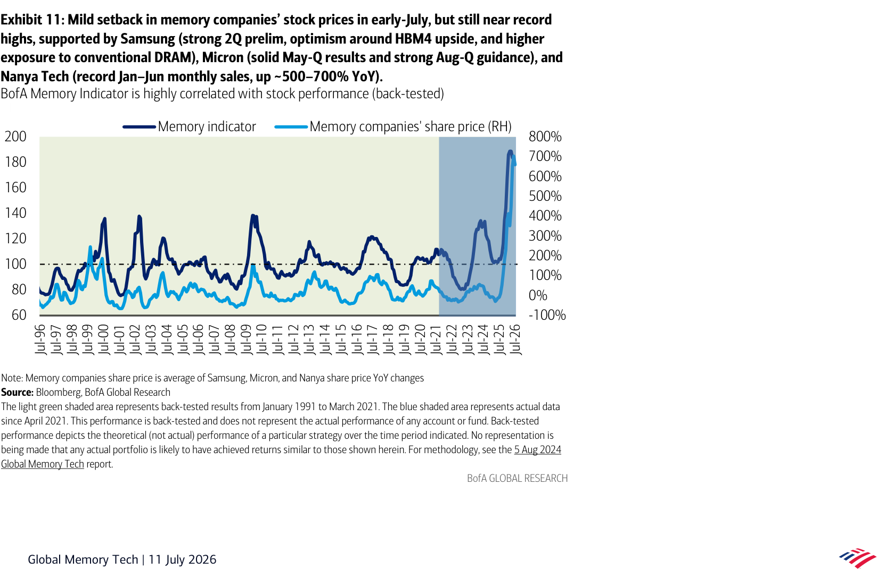

### 解讀摘要

BofA Memory Indicator 與三大記憶體廠（Samsung、Micron、Nanya）股價 YoY 變化高度相關。7 月初股價輕微回落，但仍接近歷史高位，受 Samsung 強勁 2Q OP（W89.4tn）、Micron 強勁 May-Q 業績及 Nanya 1-6 月月銷售 +500-700% YoY 所支撐。

---

## Exhibit 12｜BofA Memory Indicator 七大分量 MoM / YoY 趨勢

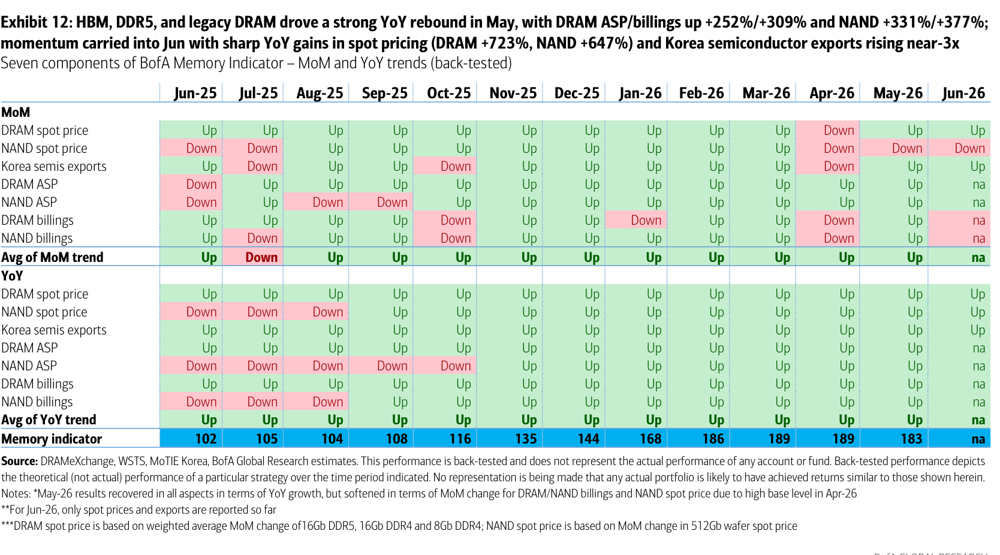

### 解讀摘要

5 月 DRAM ASP +252% YoY、DRAM billing +309% YoY；NAND ASP +331% YoY、NAND billing +377% YoY。6 月現貨 DRAM YoY +723%、NAND YoY +647%，韓國半導體出口 YoY 接近 3 倍（+199%）。NAND 現貨 MoM 從 4 月起轉負（6 月繼續下行），是七大分量中唯一持續走弱的項目。

### 表格（7 個分量 MoM 方向，Jun-25 至 Jun-26）

| 分量 | Jun-25 | Jul-25 | Aug-25 | Sep-25 | Oct-25 | Nov-25 | Dec-25 | Jan-26 | Feb-26 | Mar-26 | Apr-26 | May-26 |
|---|---|---|---|---|---|---|---|---|---|---|---|---|
| DRAM spot | 上 | 上 | 上 | 上 | 上 | 上 | 上 | 上 | 上 | 上 | **下** | 上 |
| NAND spot | 下 | 下 | 上 | 上 | 上 | 上 | 上 | 上 | 上 | 上 | **下** | **下** |
| Korea 出口 | 上 | 下 | 上 | 上 | 下 | 上 | 上 | 上 | 上 | 上 | 下 | 上 |
| DRAM ASP | 下 | 上 | 上 | 上 | 上 | 上 | 上 | 上 | 上 | 上 | 上 | 上 |
| NAND ASP | 下 | 上 | 下 | 下 | 上 | 上 | 上 | 上 | 上 | 上 | 上 | 上 |
| DRAM billing | 上 | 上 | 上 | 上 | 下 | 上 | 上 | 下 | 上 | 上 | 下 | 上 |
| NAND billing | 上 | 下 | — | — | — | — | — | — | — | — | — | — |

> **洞察一**：NAND spot MoM 連三個月下行（Apr/May/Jun-26）是本報告最值得關注的弱勢訊號，但 DRAM spot 在 May-26 down 後 Jun-26 重新翻升（+11% MoM），確認 DRAM/NAND 結構分歧加大。

---

## Exhibit 13｜Samsung 2Q26 強勁業績帶動記憶體股上漲

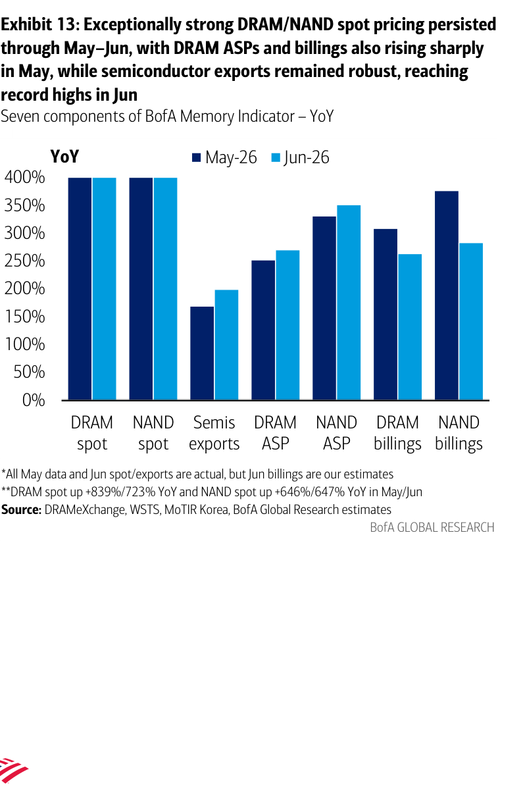

### 解讀摘要

Samsung 7 月 7 日公告 2Q26 OP W89.4tn，帶動記憶體族群上漲。BofA Memory Indicator 在 Samsung 業績前已預測此走勢，再次驗證指標的前瞻性。

---

## Exhibit 14｜Korea 半導體出口數據追蹤

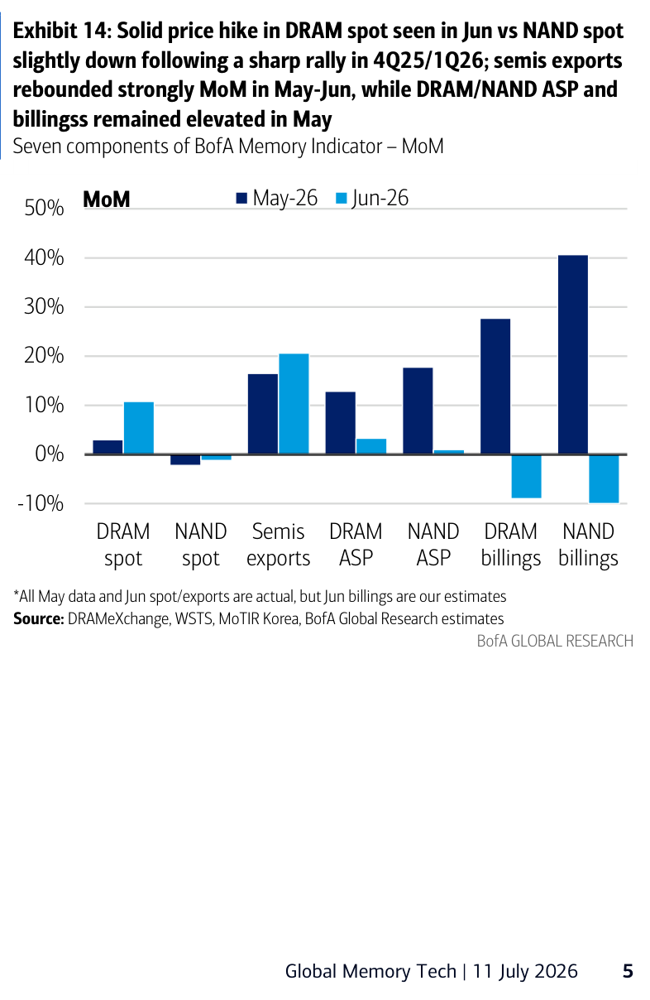

### 解讀摘要

韓國 6 月半導體出口 +199% YoY、+21% MoM，其中高端記憶體（HBM4、SOCAMM 等）貢獻高於一般 DRAM。出口 MoM 領先現貨 MoM（+11%），暗示高端規格組合正在升級。

---

## Exhibit 15｜全球 DRAM 營收預估近四倍（2026E +325%）

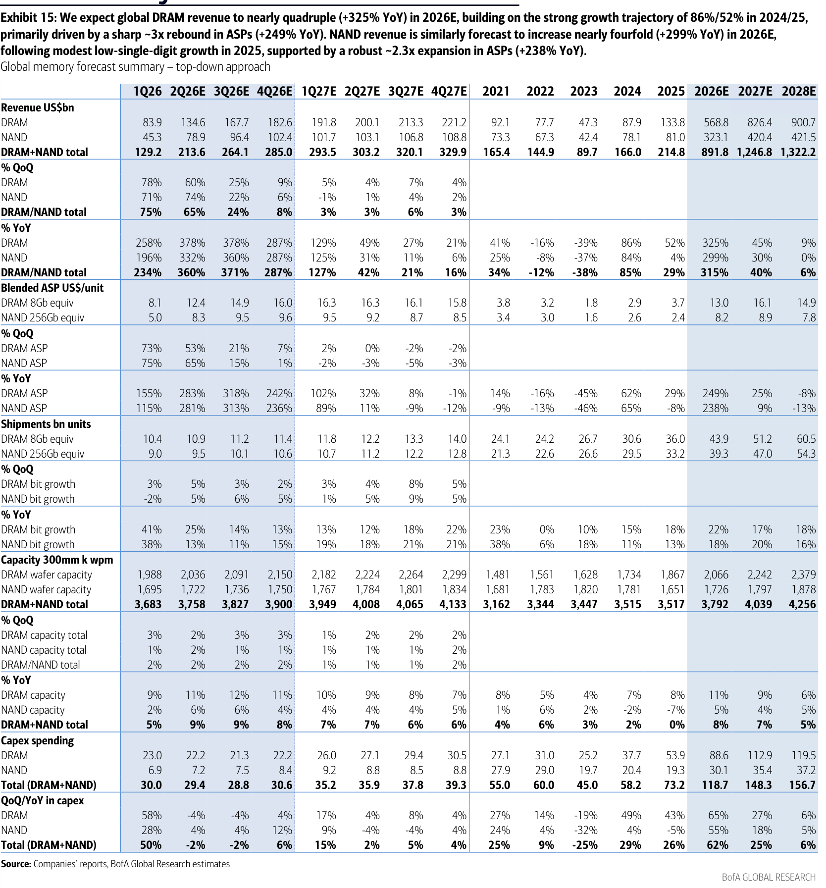

### 解讀摘要

BofA 預期 2026E 全球 DRAM 營收 US\$568.8bn（+325% YoY），接近 2025 年的四倍。各季預估（億美元）：1Q26 839→2Q26E 1,346→3Q26E 1,677→4Q26E 1,826，下半年明顯加速。NAND 2026E US\$323.1bn（+299% YoY）。合計 DRAM+NAND 2026E US\$891.8bn，2027E US\$1,246.8bn。

### 表格

| | 2022 | 2023 | 2024 | 2025 | 2026E | 2027E | 2028E |
|---|---|---|---|---|---|---|---|
| DRAM revenue（US\$bn） | 92.1 | 47.3 | 87.9 | 133.8 | **568.8** | 826.4 | 900.7 |
| NAND revenue（US\$bn） | 67.3 | 42.4 | 78.1 | 81.0 | **323.1** | 420.4 | 421.5 |
| 合計（US\$bn） | 144.9 | 89.7 | 166.0 | 214.8 | **891.8** | 1,246.8 | 1,322.2 |

> **洞察一**：2026E DRAM 營收（US\$568.8bn）已超過 2023 年整個記憶體市場的 5 倍以上（US\$89.7bn），本週期之大在記憶體產業史上絕無僅有。

---

## Exhibit 16｜2026-28E DRAM 營收預估小幅上調 2-3%

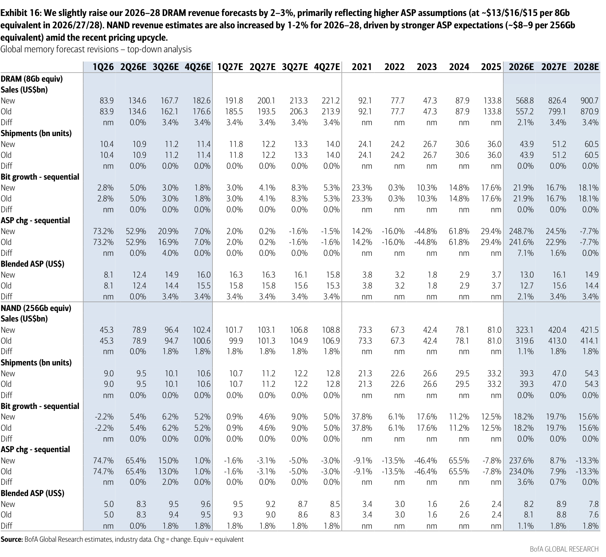

### 解讀摘要

BofA 將 2026-28E DRAM 營收上調 2-3%，主因是調高 ASP 假設（8Gb equiv. ASP：2026 ~US\$13、2027 ~US\$16、2028 ~US\$15/GB）。此次調整主要反映 3Q26 合約數據好於預期（+21% QoQ vs 前估 +17%）。

---

## Exhibit 17｜伺服器（含 AI/HBM）佔 DRAM 需求逾半

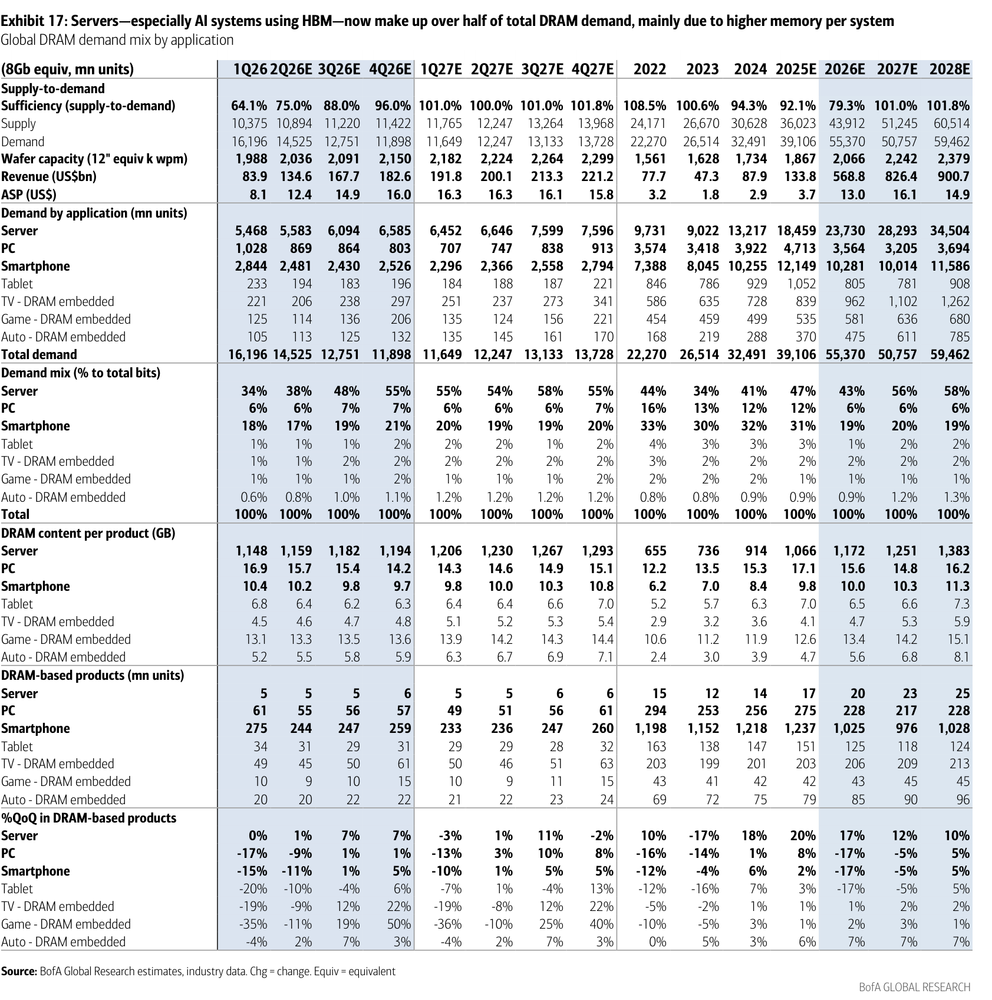

### 解讀摘要

AI 伺服器（HBM）加上一般伺服器，合計已佔全球 DRAM 需求逾 50%，主要因為每系統記憶體用量大幅提升（HBM 每 GPU 192-288GB，一般伺服器 DDR5 容量也不斷升級）。手機與 PC 佔比因此相對收縮，但絕對量仍穩定。

---

## Exhibit 18｜Enterprise SSD 佔 NAND 需求逾半

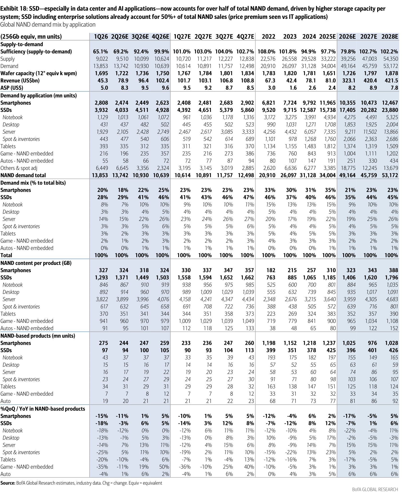

### 解讀摘要

AI 資料中心對高容量 eSSD 需求帶動，Enterprise/DC SSD 佔 NAND 需求比例突破 50%。每台 AI 伺服器的 SSD 容量持續提升，加上資料中心大規模擴建，使得 NAND 需求結構大幅移向高單價的企業用途。

---

## Exhibit 19｜大廠 DRAM 銷售 / ASP / 出貨量 / 毛利比較

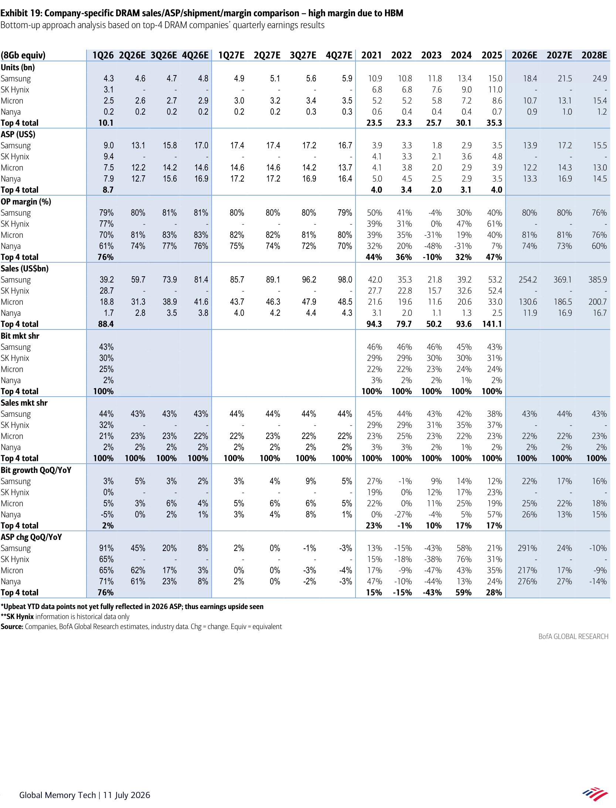

### 解讀摘要

跨廠商 DRAM 比較顯示 HBM 業務占比高者（SK Hynix）毛利最高，三星緊追，Nanya 因遺留 DRAM 溢價也取得破紀錄高利潤。各廠出貨量 YoY 成長有限（10-20% 數量級），確認 ASP 是收入增量的壓倒性來源。

---

## Exhibit 20｜大廠 NAND 銷售 / ASP / 出貨量 / 毛利比較

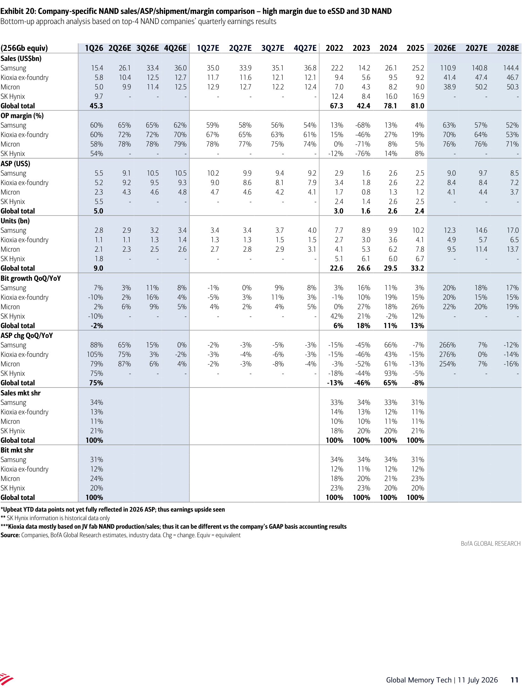

### 解讀摘要

eSSD 帶動的高 ASP 使 NAND 廠商利潤改善顯著，尤其 Samsung 和 SK Hynix 的企業 SSD 佔比高，毛利率回升幅度大。Kioxia/Sandisk 受益最大（YTD 股價 +350%+）。

---

## Exhibit 21｜手機 / PC 生產 2026 年因記憶體短缺小幅下修

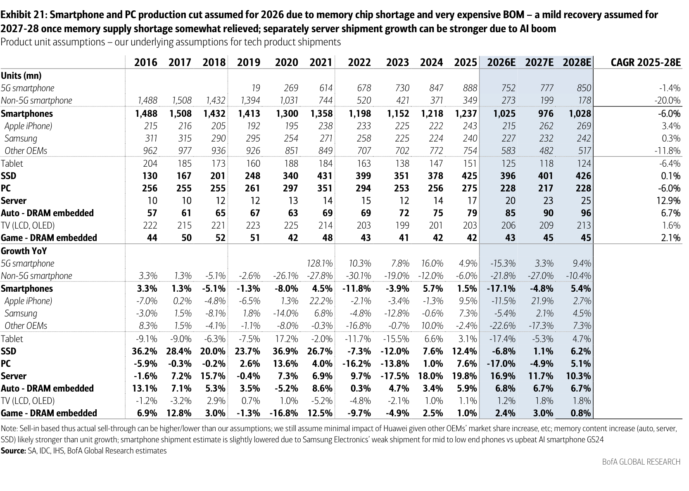

### 解讀摘要

BofA 因記憶體晶片短缺與 BOM 成本急漲，略下修 2026E 手機和 PC 出貨量預估，並假設 2027 年恢復溫和成長。記憶體短缺不只影響獲利，也正在結構性影響消費電子出貨量。

---

## Exhibit 22｜NAND 庫存可能延續至 2027 年

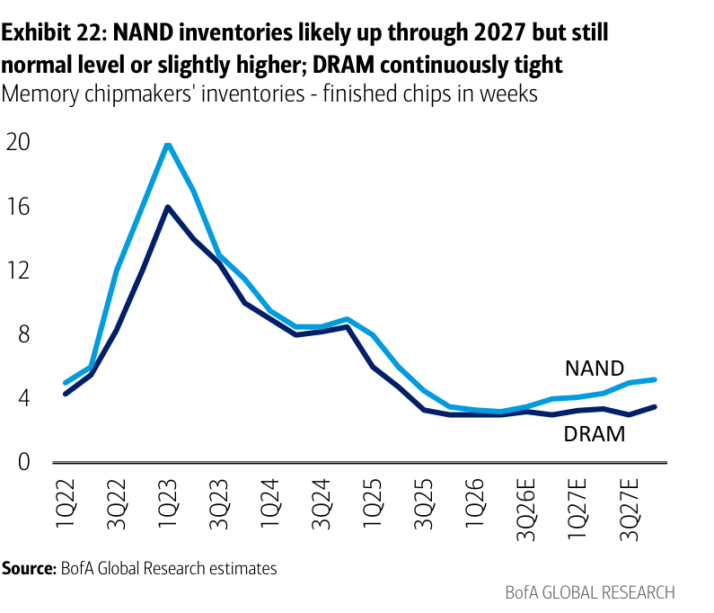

### 解讀摘要

NAND 庫存估計 2026-27 年維持偏高水準，但不至於觸發典型去庫存週期——供給紀律（僅 +5% YoY 產能）加上強勁的 enterprise SSD 需求，使得高庫存並未造成價格崩跌。

---

## Exhibit 23｜DRAM 幾近全產能；NAND 也超過 90% 利用率

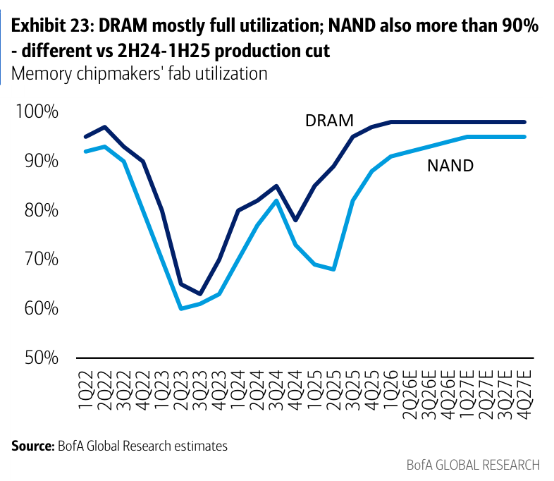

### 解讀摘要

DRAM 產能利用率接近 100%，NAND 超過 90%，兩者均處於史上最高水準。HBM 需求吸收大量 DRAM 晶圓產能，使傳統 DRAM 供給更形緊繃，是 Nanya 獲利暴增的結構性原因。

---

## Exhibit 24｜DRAM 需求成長以伺服器（HBM）和手機為主

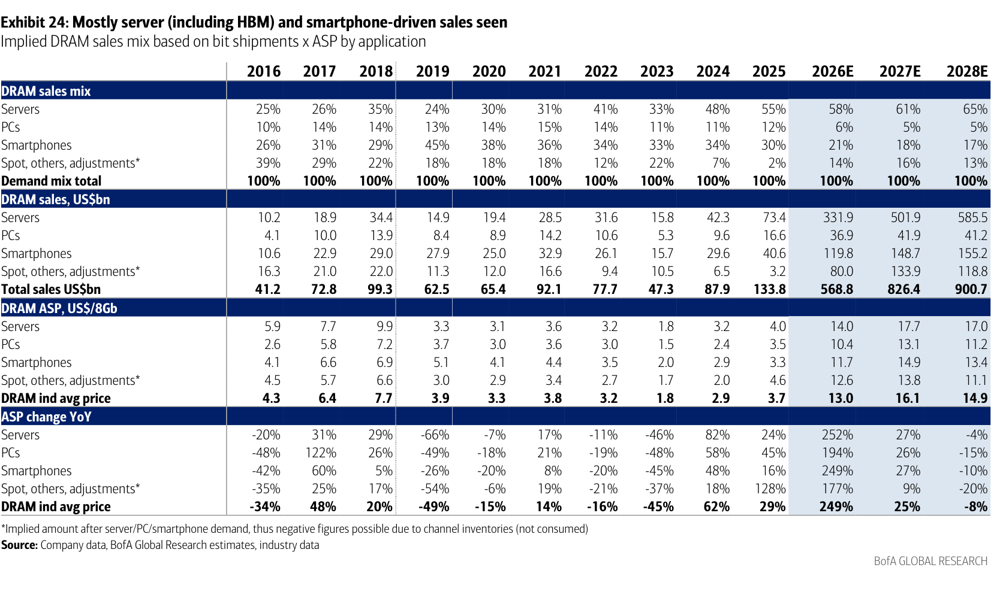

### 解讀摘要

2026-27E DRAM 需求增量主要由 AI+HBM 伺服器和手機貢獻，PC 端相對穩定，工業 / 汽車端成長緩慢。伺服器端成長不僅來自數量，還有每台伺服器記憶體用量大幅提升（每 AI 訓練節點超 1TB）。

---

## Exhibit 25｜NAND 需求成長以 eSSD 和手機為主

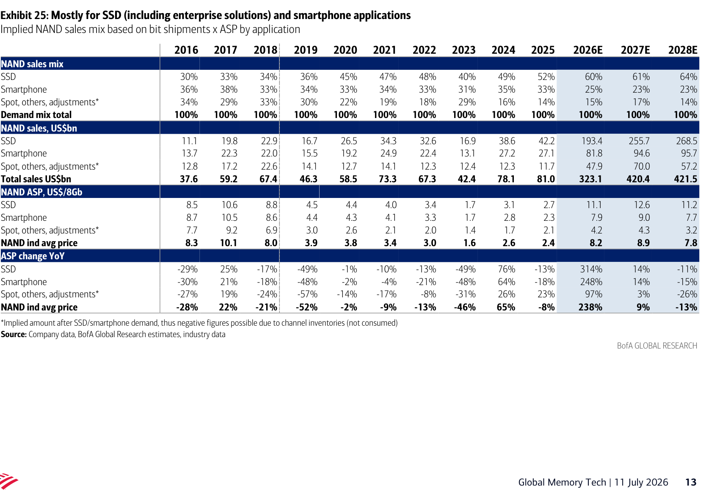

### 解讀摘要

Enterprise SSD 和手機是 2026-27E NAND 需求成長的兩大主軸。AI 資料中心每台伺服器的儲存容量快速升級（AI 訓練需要大量本地快存），使得企業級 SSD 需求持續超預期。

---

## Exhibit 26｜大三廠 DRAM capex 2026 年成長，但含大量非 WFE 支出

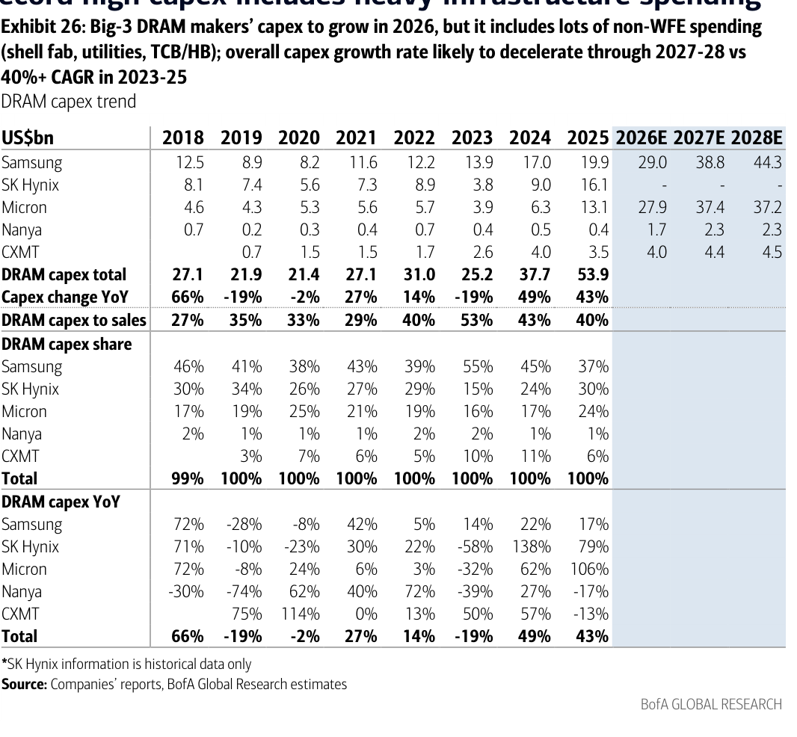

### 解讀摘要

Samsung / SK Hynix / Micron 合計 DRAM capex 2026E +65% YoY，但相當比例是廠房 / 基礎設施（非晶圓設備 WFE）支出，真正有效 WFE 增幅遠小於帳面 capex 數字。HBM 產線轉換本身消耗大量現有 WFE，使傳統 DRAM 的有效新增產能有限。

---

## Exhibit 27｜NAND capex 2026 年成長，主要是 2025 年低基期效應

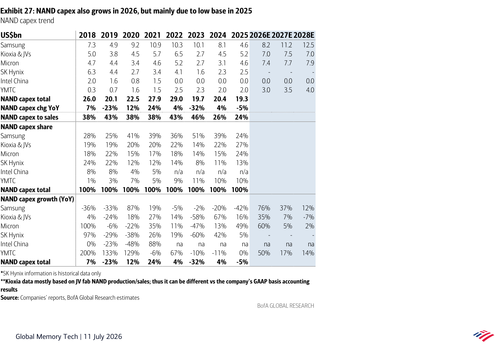

### 解讀摘要

NAND capex 2026E +55% YoY，但起點是 2025 年歷史低谷（-5% YoY），實際擴產節奏受控。產能 YoY 僅 +5%，確認 NAND 廠商並未大舉擴充晶圓產能。

---

## Exhibit 28｜HBM 拉動設備 capex；傳統 DRAM / NAND WFE 紀律穩健

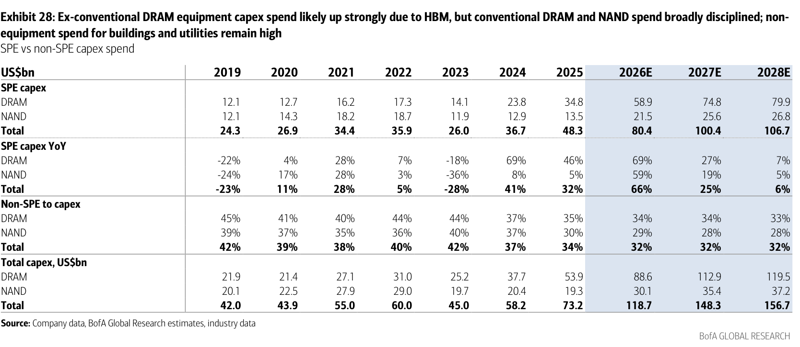

### 解讀摘要

BofA 分析顯示，排除傳統 DRAM 設備投資後，HBM 相關設備 capex 大幅上升；傳統 DRAM 和 NAND 的 WFE 支出均維持紀律。這說明半導體設備廠受益主要是 HBM 相關（如 TC bonding、HBM 製程設備），而非傳統 DRAM/NAND 擴產。

---

## Exhibit 29｜大三廠 DRAM capex 維持強勁；NAND capex 亦顯著成長

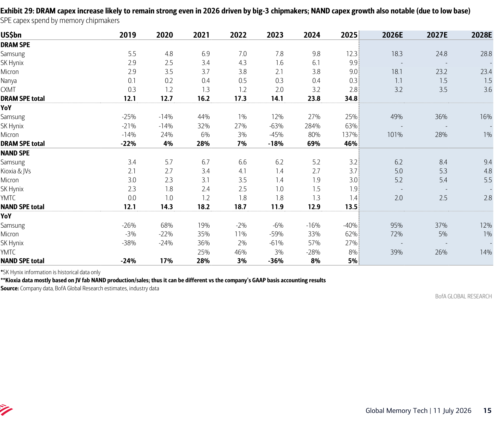

### 解讀摘要

Samsung、SK Hynix、Micron 三家的 DRAM capex 2026-27E 均維持高位，韓國廠商以 HBM 為主要投資方向。NAND capex 自低基期反彈，但規模遠小於 DRAM。

---

## Exhibit 30｜HBM 全球市場：2026E US\$76.8bn（+122%），OPM ~50%

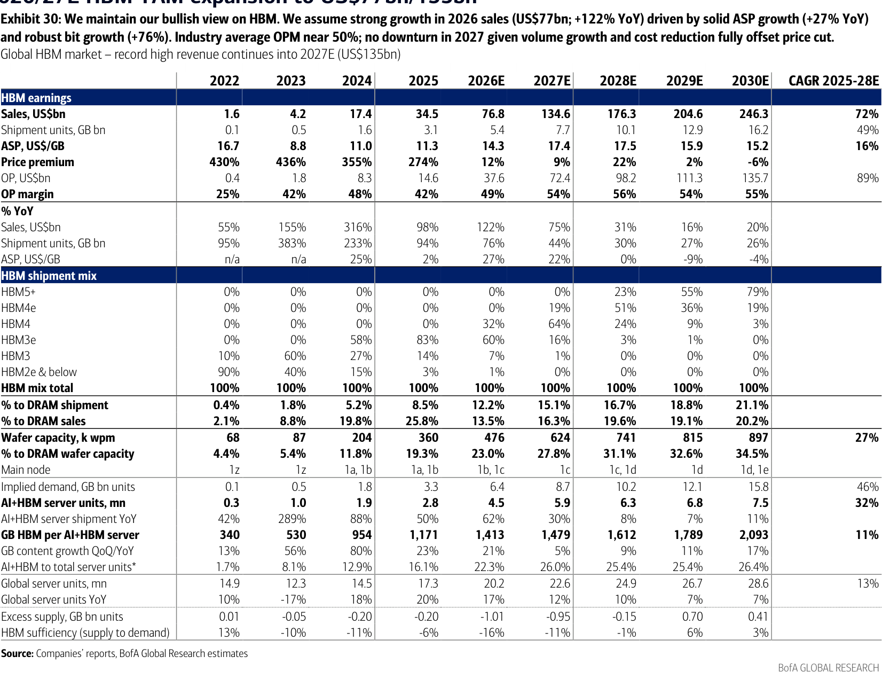

### 解讀摘要

BofA 維持對 HBM 的多頭觀點：2026E HBM 銷售 US\$76.8bn（+122% YoY），由 ASP +27% 和 bit 出貨 +76% 共同驅動。OPM ~50%（2026E），2027E 進一步升至 54%。BofA 預計 2027E HBM 銷售達 US\$134.6bn，2030E 達 US\$246.3bn，2025-28E CAGR 72%。

### 表格

| 指標 | 2022 | 2023 | 2024 | 2025 | 2026E | 2027E | 2028E | 2025-28E CAGR |
|---|---|---|---|---|---|---|---|---|
| HBM 銷售（US\$bn） | 1.6 | 4.2 | 17.4 | 34.5 | **76.8** | 134.6 | 176.3 | 72% |
| 出貨（GB bn） | 0.1 | 0.5 | 1.6 | 3.1 | 5.4 | 7.7 | 10.1 | 49% |
| ASP（US\$/GB） | 16.7 | 8.8 | 11.0 | 11.3 | 14.3 | 17.4 | 17.5 | 16% |
| OP（US\$bn） | 0.4 | 1.8 | 8.3 | 14.6 | 37.6 | 72.4 | 98.2 | 89% |
| HBM OPM | 25% | 42% | 48% | 42% | **49%** | 54% | 56% | — |

> **洞察一**：HBM ASP 2025→2026E 從 US\$11.3 升至 US\$14.3/GB（+27%），扭轉了 2023 跌落至 US\$8.8 的低點，原因是 HBM4 單價高且供給緊。  
> **洞察二**：2030E HBM 銷售 US\$246.3bn，已接近 2025 年整個 DRAM 市場規模（US\$133.8bn）——HBM 自身就在成為一個龐大的新 TAM。

---

## Exhibit 31｜HBM 大三廠自下而上的長期規劃

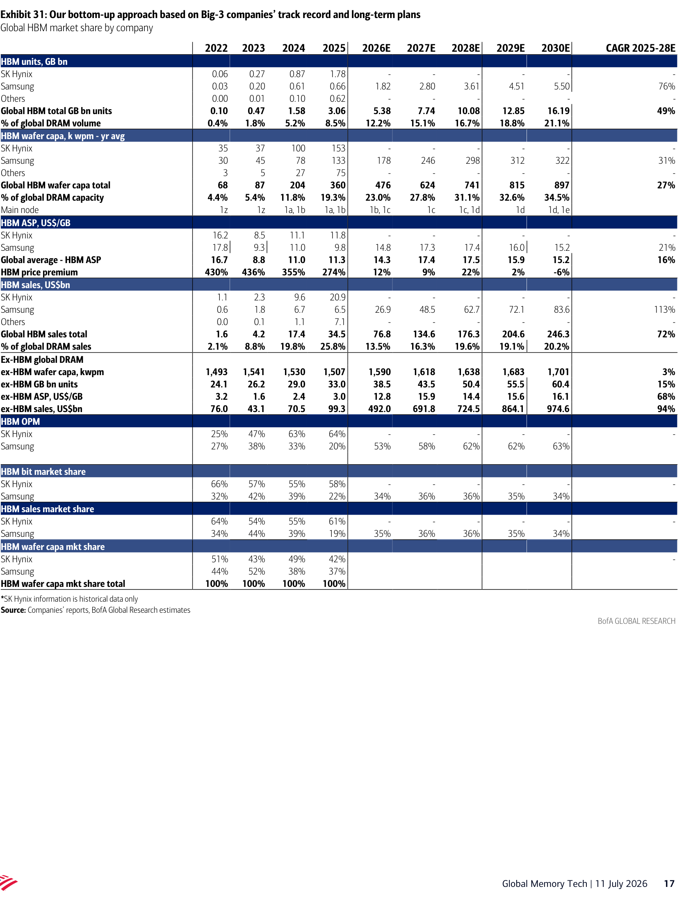

### 解讀摘要

BofA 依 SK Hynix、Samsung、Micron 各自的 HBM 產能規劃和 wafer 轉換進度，建立自下而上的全球 HBM 供需模型，驗證 Exhibit 30 總量數字的合理性。SK Hynix 在 HBM wafer 份額領先，Samsung 在 2026-27E 受益於 HBM4 客戶拓展。

---

## Exhibit 32｜Samsung HBM 盈餘展望：上行空間來自 HBM4 價格正常化

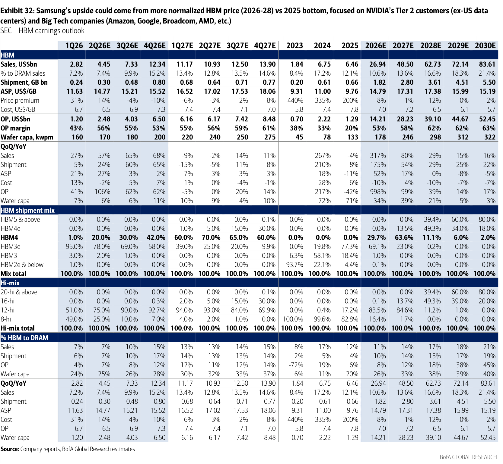

### 解讀摘要

Samsung 2026E HBM 銷售 US\$26.94bn（1Q-4Q 分別：US\$2.82→4.45→7.33→12.34bn），YoY +316%（2025：US\$6.46bn）。Samsung HBM 佔 DRAM 銷售比 2025：10.6%→2026E：13.6%→2027E：16.6%。上行空間來自 HBM 價格較 2025 年低谷正常化，鎖定 NVIDIA Tier 2 客戶（非美資料中心）及 Big Tech（Amazon、Google、Broadcom、AMD）。

### 表格

| 指標 | 2024 | 2025 | 2026E | 2027E | 2028E |
|---|---|---|---|---|---|
| Samsung HBM 銷售（US\$bn） | 6.75 | 6.46 | **26.94** | 48.50 | 62.73 |
| HBM % of 三星 DRAM | 17.2% | 10.6% | 13.6% | 16.6% | 18.3% |
| 出貨（GB bn） | 0.61 | 0.66 | 1.82 | — | — |

> **洞察一**：Samsung 2026E HBM 銷售僅佔全球 HBM（US\$76.8bn）的 35%，低於 SK Hynix；但四季度呈指數加速（US\$2.82→12.34bn），如果 SK Hynix 持續供給緊繃，Samsung HBM 佔比可能在 2H26 顯著提升。

---

## Exhibit 33｜NVIDIA GPU HBM 規格演進：B300→Rubin→Rubin Ultra

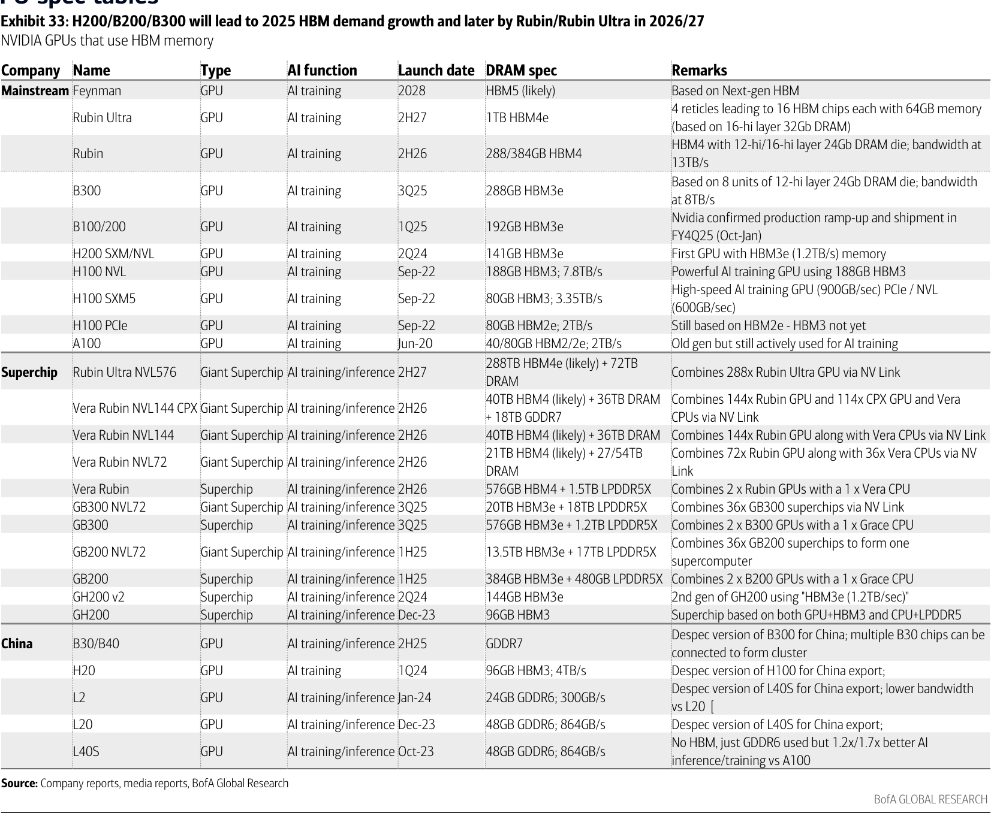

### 解讀摘要

NVIDIA GPU HBM 規格每代大幅升級：B300（3Q25）288GB HBM3e / 8TB/s → Rubin（2H26）288-384GB HBM4 / 13TB/s → Rubin Ultra（2H27）1TB HBM4e / 16 顆 HBM 晶片。Rubin Ultra 的 1TB HBM 是 B300 的 3.5 倍，即使出貨台數不變也代表 HBM 需求爆炸性增長。

### 表格

| GPU | 發布 | HBM 規格 | 記憶體容量 | 頻寬 |
|---|---|---|---|---|
| H100 NVL | Sep-22 | HBM3 | 188GB | 7.8 TB/s |
| H200 SXM | 2Q24 | HBM3e | 141GB | 1.2 TB/s |
| B100/B200 | 1Q25 | HBM3e | 192GB | — |
| B300 | 3Q25 | HBM3e（8 units 12-hi 24Gb） | 288GB | 8 TB/s |
| Rubin | 2H26 | HBM4（12-hi/16-hi 24Gb） | 288-384GB | 13 TB/s |
| Rubin Ultra | 2H27 | HBM4e（16 chips, 16-hi 32Gb） | 1TB | — |
| Feynman | 2028 | HBM5（likely） | — | — |

> **洞察一**：Rubin Ultra 的 1TB HBM 需要 16 顆 HBM 晶片，是 B300（8 顆）的兩倍。即使 NVIDIA 維持相同出貨量，Rubin Ultra 世代每 GPU HBM 內容量就翻倍，是 HBM TAM 的最大增量驅動。

---

## Exhibit 34｜AI 訓練 / 推理 GPU 完整陣容；12-hi LPDDR5 / GDDR6 需求升溫

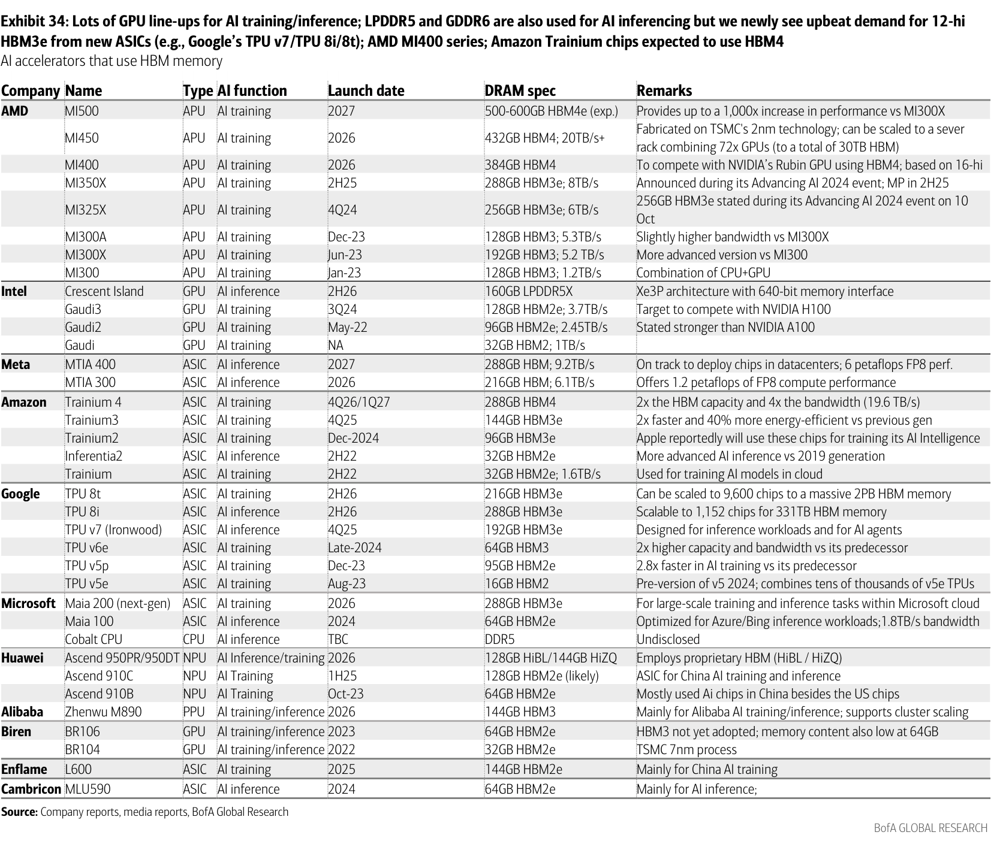

### 解讀摘要

除 NVIDIA 外，AMD、Intel 等 GPU 及各大科技公司自研 ASIC（Google TPU、Amazon Trainium、Meta MTIA）陣容完整。推理端開始使用 12-hi LPDDR5 和 GDDR6，帶動非 HBM 高頻寬記憶體需求新成長點。

---

## Exhibit 35｜HBM 內容量大幅成長，2025/2026 尤為顯著

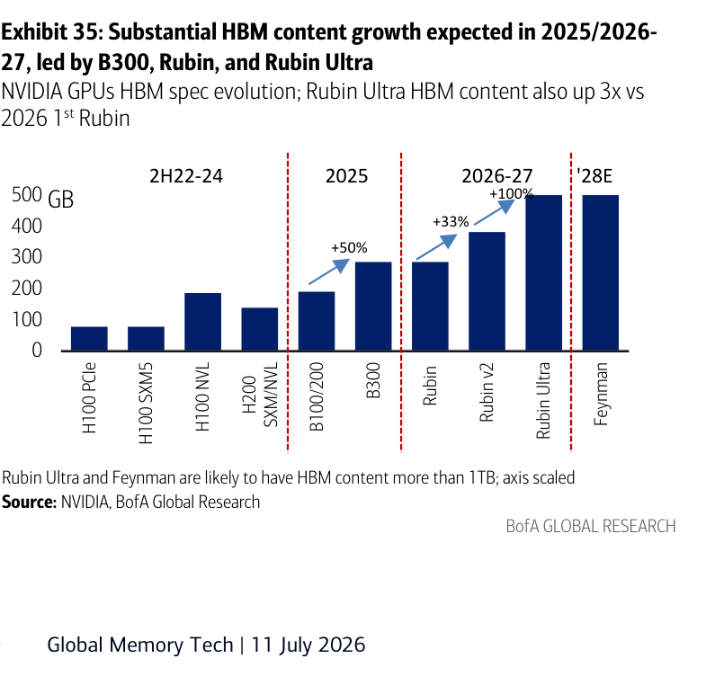

### 解讀摘要

每顆 GPU 的 HBM 容量從 H100（188GB）到 B300（288GB）到 Rubin（384GB）到 Rubin Ultra（1TB）呈現階梯式成長，推動 HBM per server 的 GB 內容持續升級。這是全球 HBM TAM 能夠維持高速成長的基本假設。

---

## Exhibit 36｜AMD GPU HBM 容量也逐代成長 10-30%

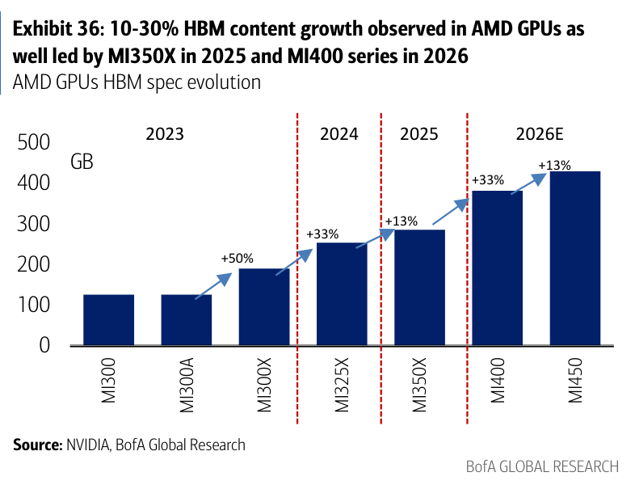

### 解讀摘要

AMD MI series GPU 的 HBM 容量逐代成長 10-30%，確認 HBM 升級趨勢並非 NVIDIA 獨有，AI GPU 全生態系統均在增加記憶體內容量。

---

## Exhibit 37｜Rubin Ultra（2027）HBM 容量達 1TB；Feynman Ultra（2030）超 1.5TB

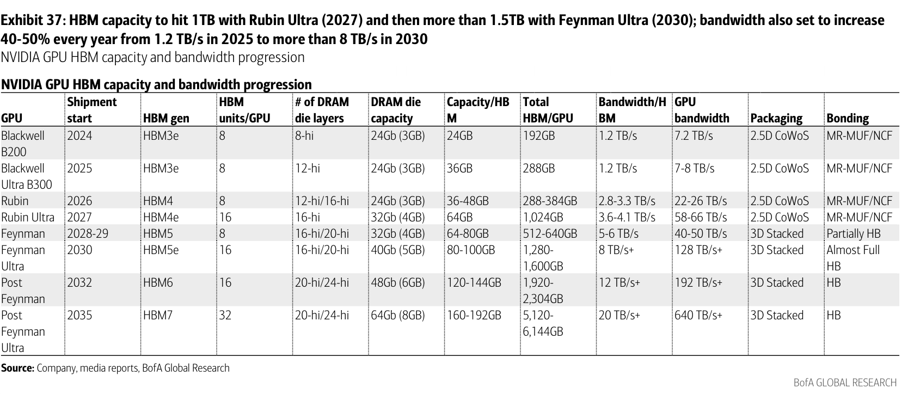

### 解讀摘要

HBM 總容量路線圖：Rubin Ultra（2H27）1TB、Feynman Ultra（2030）超 1.5TB。頻寬同步大幅提升。以 BofA HBM ASP US\$14.3/GB（2026E）估算，1TB 的 HBM 內容單 GPU 價值超過 US\$14,000。

---

## Exhibit 38｜GPU / ASIC / TPU 使用 6-8 顆 HBM；Rubin Ultra 升至 16 顆

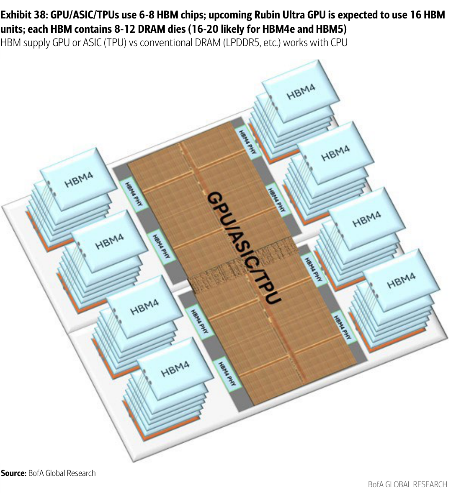

### 解讀摘要

目前主流 GPU（B200/B300）使用 8 顆 HBM 晶片。Rubin Ultra 升至 16 顆（翻倍）。HBM 晶片數量提升意味著封裝複雜度大增，CoWoS-S/L 和 TCB 設備需求同步增加，對 TSMC CoWoS 和相關設備廠商（AMAT、Lam、TEL）具體利多。

---

## Exhibit 39｜Amazon、Microsoft、Alphabet、Meta、Oracle capex 追蹤

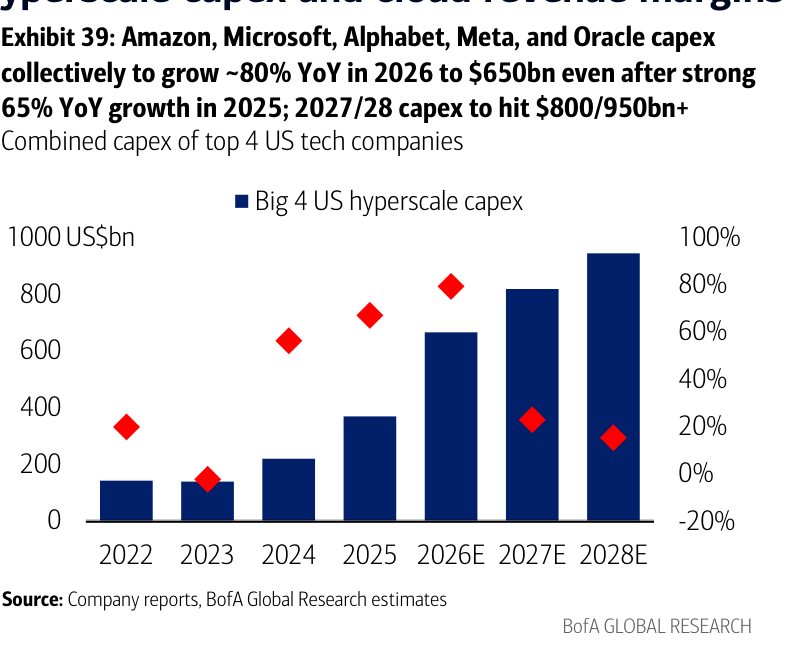

### 解讀摘要

五大超大型業者 capex 合計持續創歷史新高，反映 AI 基礎設施投資浪潮未減速。各家 2026E capex 指引均高於 2025 年實際值。

---

## Exhibit 40｜Big-4 超大型業者 capex 全面創新高

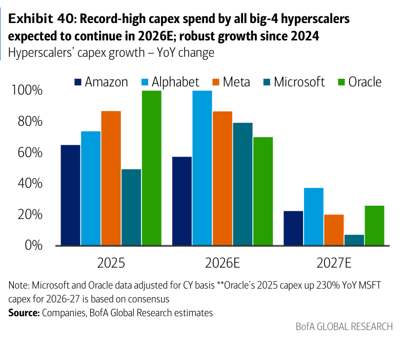

### 解讀摘要

Amazon、Microsoft、Alphabet、Meta 四家 2026E capex 均刷新歷史紀錄，是 AI GPU 和記憶體需求最強力的宏觀確認信號。

---

## Exhibit 41｜超大型業者整體營收

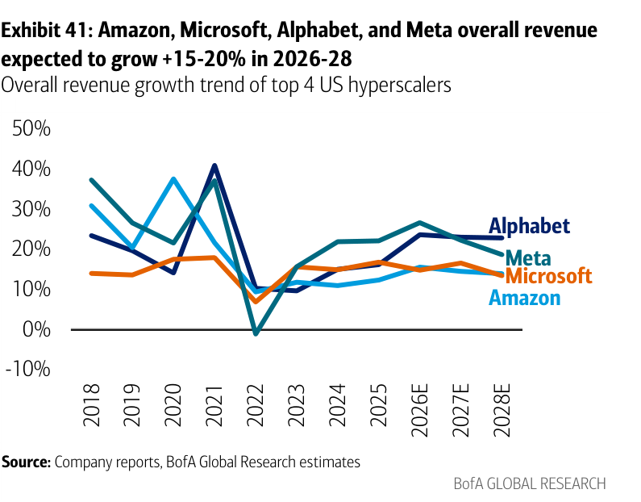

### 解讀摘要

Big-4 合計營收持續成長，現金流充裕支撐高額 capex；AI 服務的貨幣化已開始轉化為雲端收入加速，形成「capex → 收入」的正回饋。

---

## Exhibit 42｜超大型業者毛利率維持 70-80%

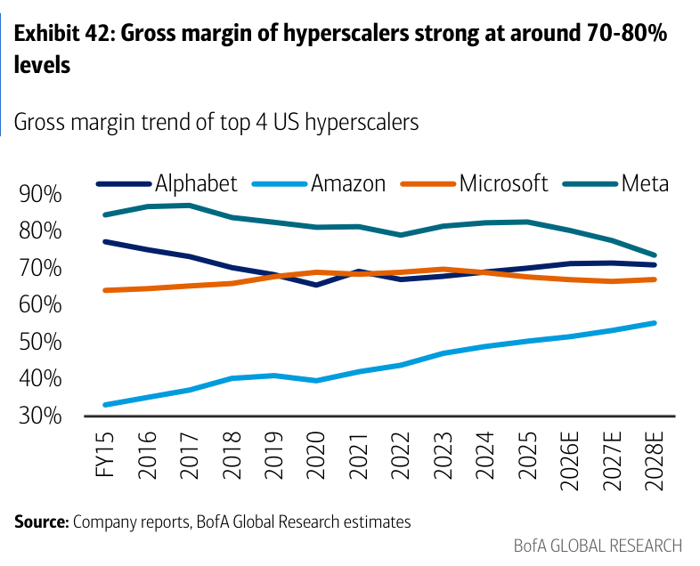

### 解讀摘要

Big-4 毛利率穩定在 70-80%，確認 AI 投資不會因盈利壓力而中斷。高毛利代表即使 capex 大增，也不影響自由現金流支撐能力。

---

## Exhibit 43｜雲端收入成長 2026-28E 維持 35-40% YoY

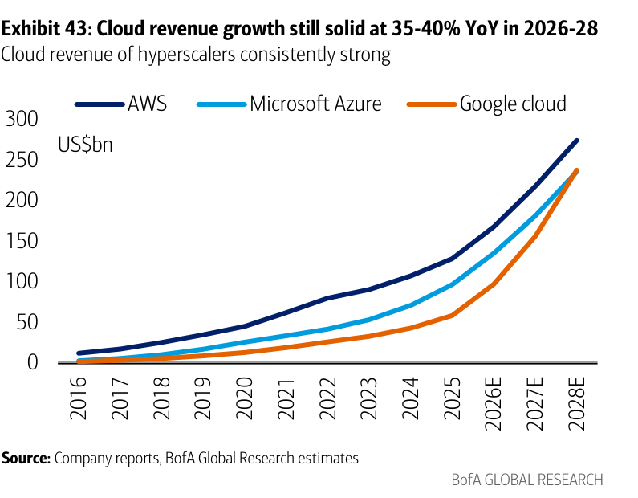

### 解讀摘要

AWS、Azure、Google Cloud 合計 2026-28E 雲端收入 YoY 均維持 35-40% 成長，且加速趨勢明顯。AI 推理服務收入是成長加速的核心貢獻者。

---

## Exhibit 44｜AWS OPM 35%+，Azure 40%+

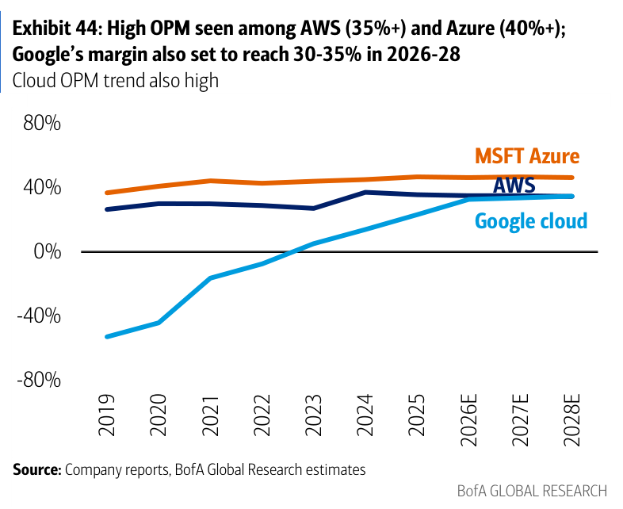

### 解讀摘要

雲端業務 OPM 持續改善：AWS 超過 35%，Azure 超過 40%。雲端業務利潤快速擴張，強化了超大型業者繼續高額 capex 投資的動機，這對記憶體和 AI 硬體需求而言是結構性正面。

---

## Exhibit 45｜DRAM 現貨 6 月回升，延續 5 月修正後的反彈

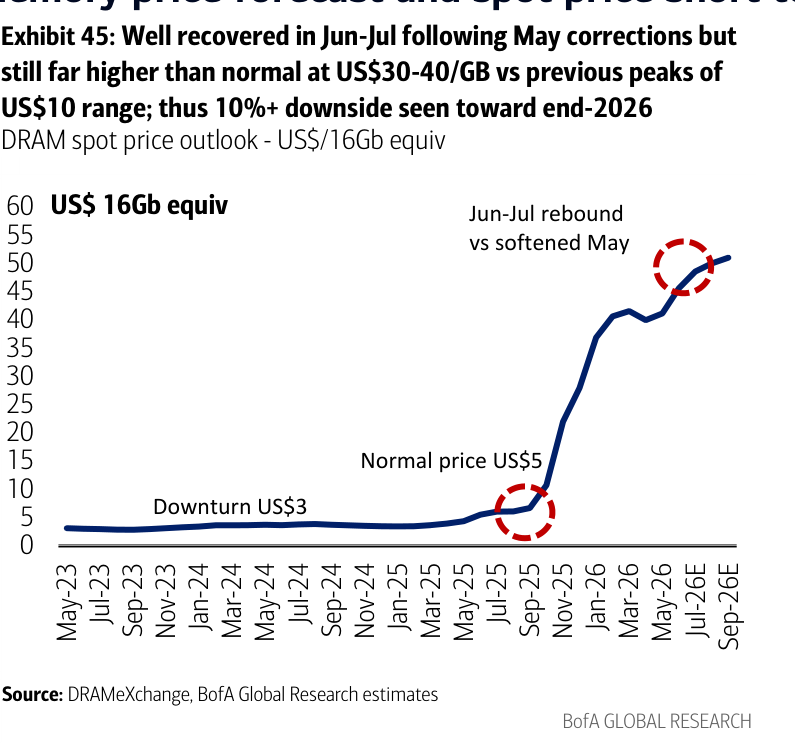

### 解讀摘要

DRAM 現貨 6 月全面反彈，逆轉 4-5 月的短暫修正，確認 2025 年 9 月以來的上升趨勢完整。BofA 視 4-5 月回檔為健康鞏固，6 月重返升軌為正面訊號。

---

## Exhibit 46｜NAND 現貨 5 月起轉為回檔，與 DRAM 走勢分歧

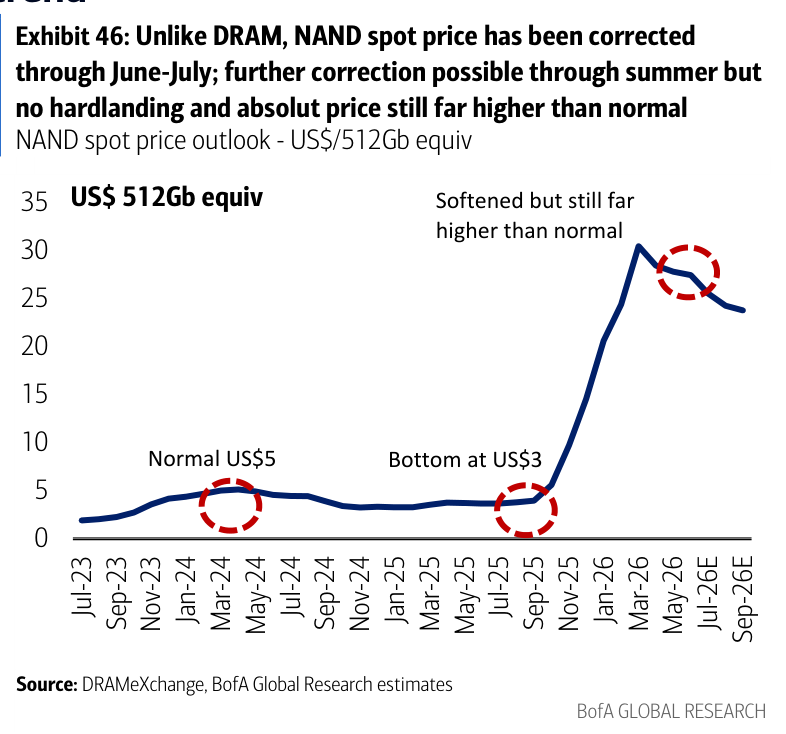

### 解讀摘要

NAND 現貨自 5 月起轉為下行，6 月繼續走弱（-3% WoW），與 DRAM 的強勢形成鮮明對比。BofA 認為 NAND 短期承壓，但 YoY 仍 +600%+ 的強度限制了下行風險。

---

## Exhibit 47｜DDR5 早七月達新高（US\$48），本週仍接近高位

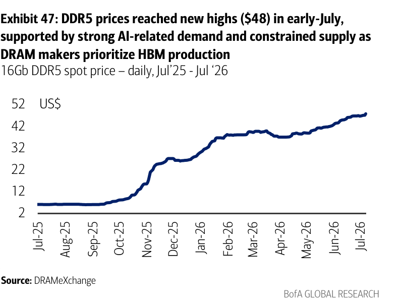

### 解讀摘要

16Gb DDR5 spot 在 7 月初創下約 US\$48 的歷史新高（歷史常態範圍約 US\$3-5），YoY 漲幅超 +688%。DDR5 與 DDR4 的現貨價格仍呈現 DDR4 溢價（DDR4 16Gb US\$77 > DDR5 US\$48），反映舊系統對 DDR4 的特定需求。

---

## Exhibit 48｜DDR4 16Gb 維持週期高位，AI 伺服器置換舊設備帶動

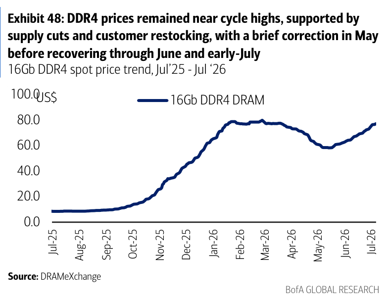

### 解讀摘要

16Gb DDR4 spot US\$77.6（ATH 附近），QoQ +9%，YoY +825%。AI 伺服器建置需要汰換舊有 DDR4 伺服器設備，對 DDR4 產生額外需求，是 DDR4 比 DDR5 更貴的主要解釋。

---

## Exhibit 49｜8Gb DDR4 維持高位，舊世代設備需求強勁

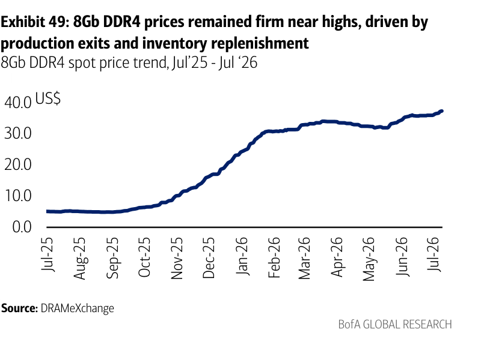

### 解讀摘要

8Gb DDR4 spot US\$37.8（+3% WoW），YoY +661%。工業、汽車和網通等遺留用途對 8Gb DDR4 的需求遠比市場預期穩健，Nanya 的產品線正是集中在這個區間。

---

## Exhibit 50｜NAND wafer 現貨上漲至高位，後轉趨穩定至下滑

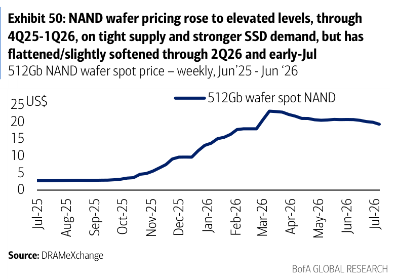

### 解讀摘要

512Gb NAND wafer spot 本週 US\$19.3（-3% WoW），自今年稍早的 US\$30 高峰回落。Exhibit 50 顯示 NAND spot 的週度序列，6 月以來持續走軟，但 YoY +621% 的底部仍遠高於一年前水準。

---

## Exhibit 51｜DRAM 現貨長期走勢（2000-2026）：本週期幅度空前

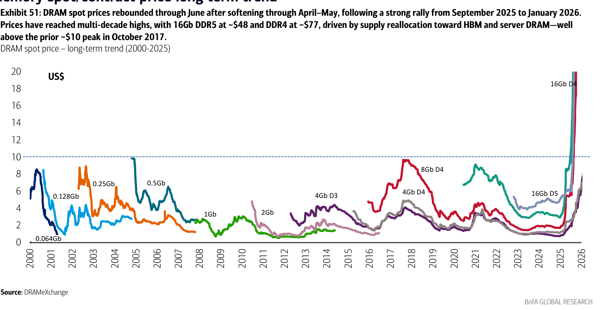

### 解讀摘要

2000 年以來最長期 DRAM 現貨走勢圖，顯示 2025-26 年的漲幅從底部 to 高峰已遠超歷史任何週期。本週期的「量不大、價極高」特性（ASP +249% vs bit +22%）在圖中清晰可見，歷史上從未有過如此大的 ASP/volume 背離。

---

## Exhibit 52｜DRAM 現貨與合約均攀至歷史高位

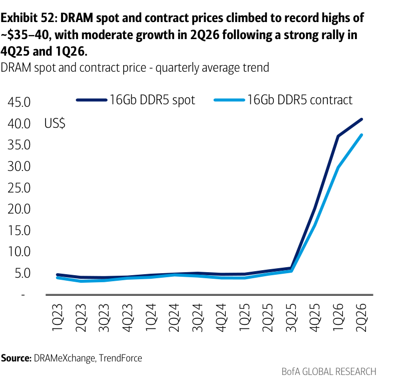

### 解讀摘要

DRAM spot 和 contract 均升至週期高位，兩者走勢高度趨同。合約價走強代表大廠客戶（超大型業者）也在接受大幅漲價，而非僅有現貨市場投機性上漲，這是超級週期持續性的關鍵確認。

---

## Exhibit 53｜NAND wafer 合約價漲幅顯著領先現貨

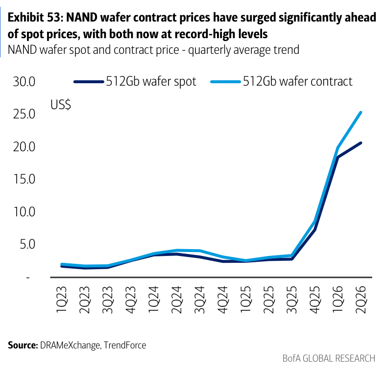

### 解讀摘要

NAND wafer 合約價累計漲幅高於現貨，反映客戶提前鎖定供給的意願強烈。但 6 月合約 QoQ 開始轉弱，顯示 NAND 下半年合約談判對賣方的議價空間在縮小。

---

## Exhibit 54｜DDR5 16Gb 長期月趨勢：5-6 月及七月初重新上漲至 US\$48

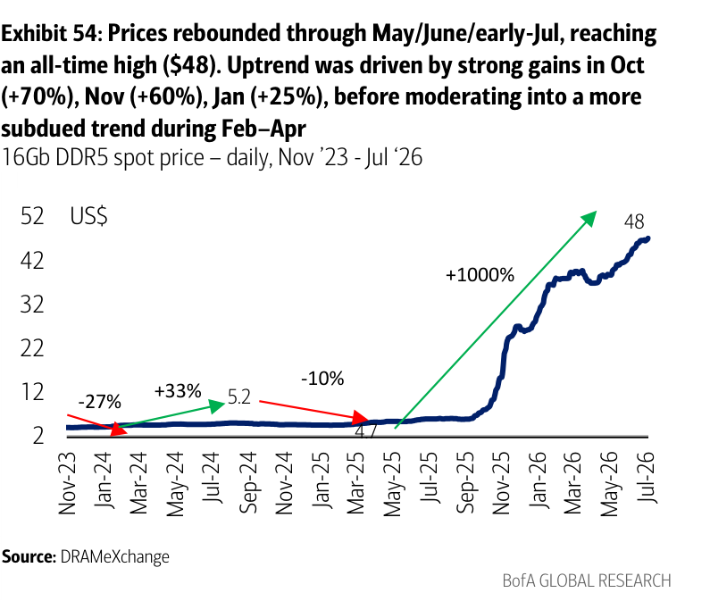

### 解讀摘要

Nov'23–Jul'26 的 DDR5 16Gb 長期月度序列，清楚呈現週期底部（約 US\$2.5，2024 年初）、加速上漲（2025H2）和新高（US\$48，Jul'26 初）的完整形態。報告特別標注 5-7 月重新反彈為「Jun'26 spot 回到升軌後的延續」。

---

## Exhibit 55｜DDR5 MoM 變化：5-6 月溫和上漲 +5-10%

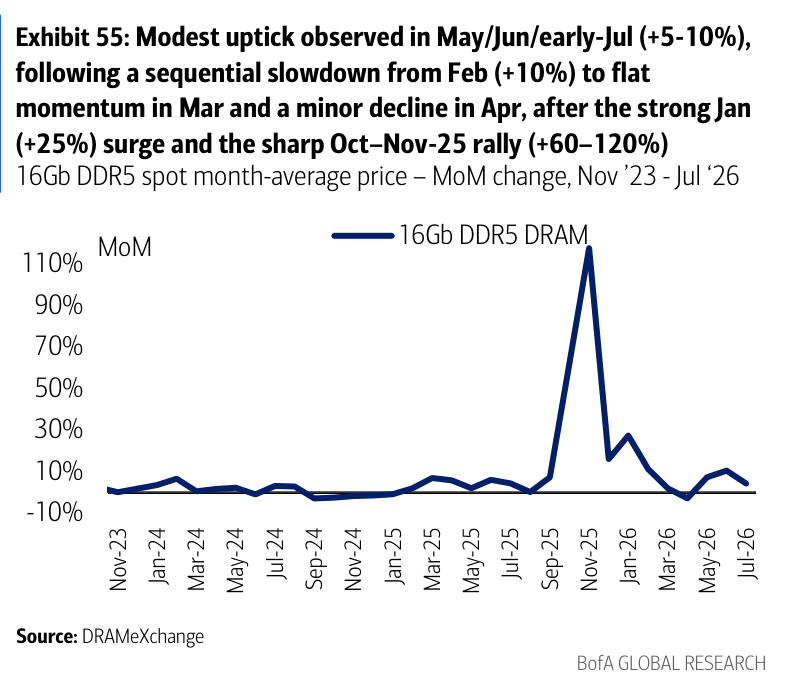

### 解讀摘要

DDR5 16Gb 現貨 MoM 變化顯示 2025 年底的極端漲速已收斂（Oct-Dec'25 漲速最高），5-7 月初重回正值但幅度適中（+5-10% MoM）。溫和正值 MoM 是健康鞏固的信號。

---

## Exhibit 56｜8Gb DDR4 現貨達歷史新高約 US\$37（2500%+ YoY）

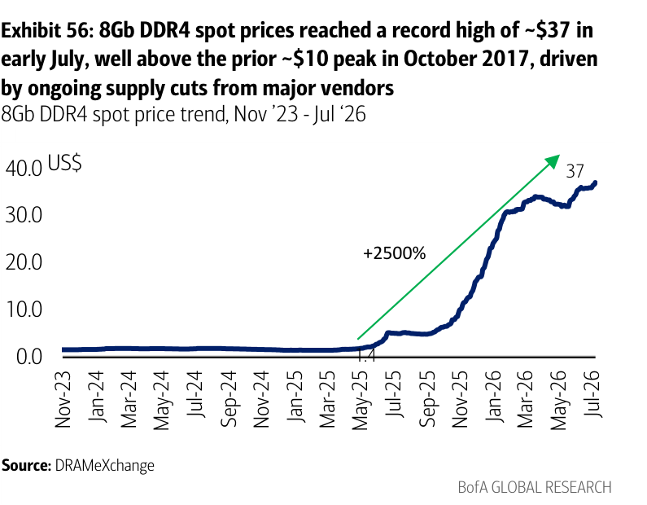

### 解讀摘要

8Gb DDR4 spot 從 Nov'23 的約 US\$1.4 底部漲至 Jun'26 約 US\$37，累計漲幅超過 +2500%。這個數字直接說明 Nanya（幾乎全部為 DDR3/4 產品）的 OPM 能夠從 -43% 在一年內跳升至 74% 的根本原因。

---

## Exhibit 57｜DDR4 16Gb 現貨反彈至週期高點（近 US\$77）

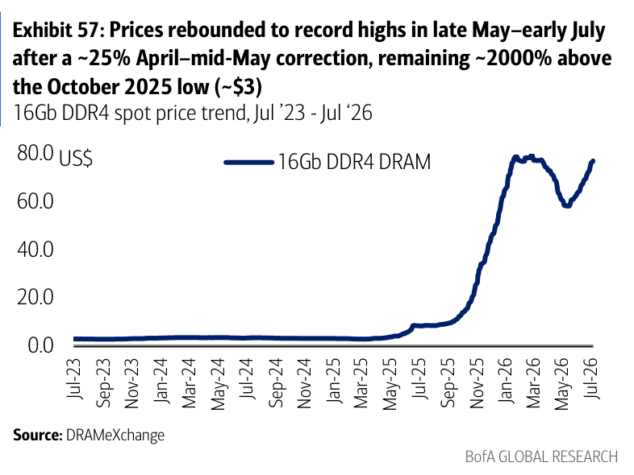

### 解讀摘要

16Gb DDR4 spot Jul'23–Jul'26 走勢，顯示最高觸及 US\$77.6（ATH）。16Gb DDR4 比 8Gb 貴很多，反映高容量舊世代模組的稀缺性（大型舊伺服器需要高密度 DDR4）。

---

## Exhibit 58｜DDR4 和 DDR5 16Gb 合約價接近（約 US\$50 相似水準）

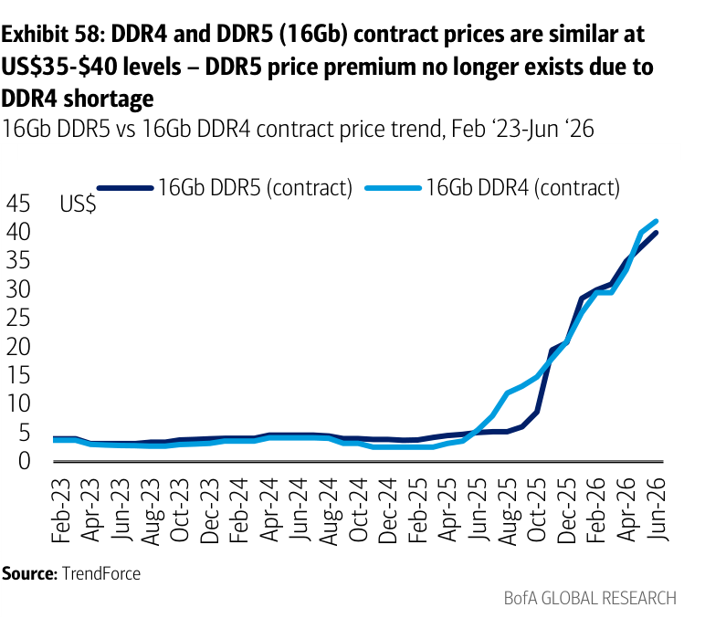

### 解讀摘要

DDR4 和 DDR5 的合約價已趨近，意味著下游 OEM 購買 DDR5 的成本溢價幾乎消失，有助於加速 DDR5 滲透。然而現貨仍是 DDR4 溢價，反映現貨市場的遺留系統特殊需求。

---

## Exhibit 59｜DDR5 / DDR4 合約 MoM 預期 7 月持平

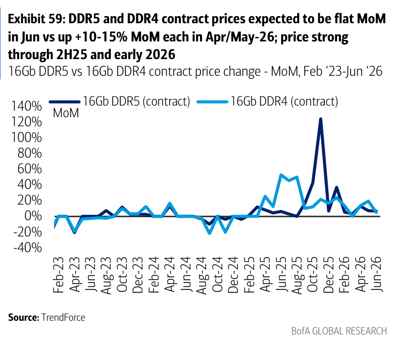

### 解讀摘要

7 月 DRAM 合約 MoM 預計持平，與現貨仍在小漲形成對比。合約市場的談判透明度低，BofA 據渠道數據（20%+ 漲價的新合約）判斷 3Q26 合約將較 2Q26 大幅提升。

---

## Exhibit 60｜NAND spot Apr'21–Jul'26 長期走勢：維持穩定至略為走軟

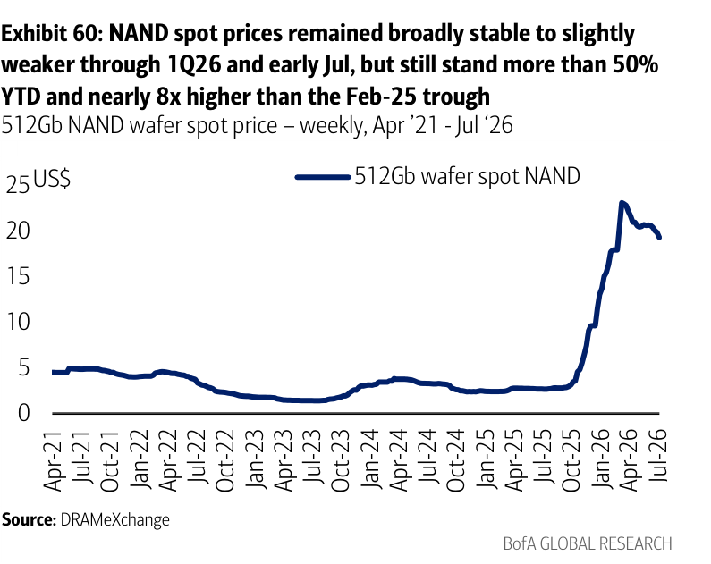

### 解讀摘要

NAND 512Gb wafer spot 長期走勢顯示 2025H2 急漲至約 US\$30，2026 年初稍回落至 US\$20 附近後走平，最近 WoW -3%。整體仍遠高於 2025 年 4 月底部（約 US\$3.1），但近期走軟趨勢需關注。

---

## Exhibit 61｜NAND spot 6 月及七月初略低，維持平穩

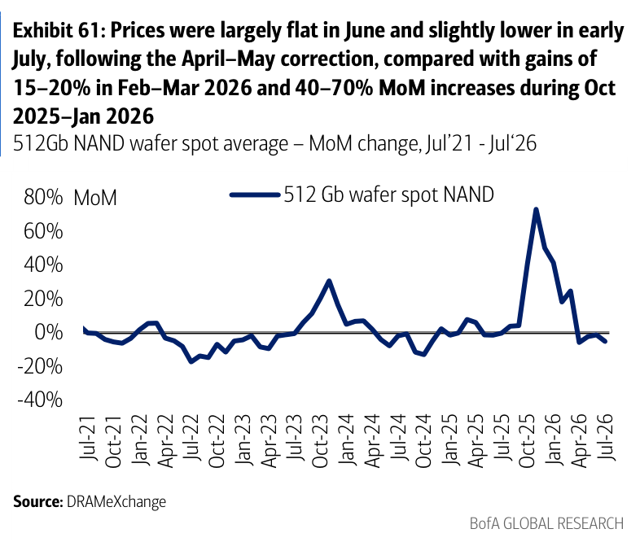

### 解讀摘要

512Gb NAND wafer spot MoM 變化顯示 Jun-Jul'26 初 MoM 接近持平至小幅負值，大幅低於 Oct-Dec'25 的 40-50% MoM 高峰。NAND 價格動能正在正常化。

---

## Exhibit 62｜NAND 合約現價約 US\$25，約為 Feb-25 的 10 倍

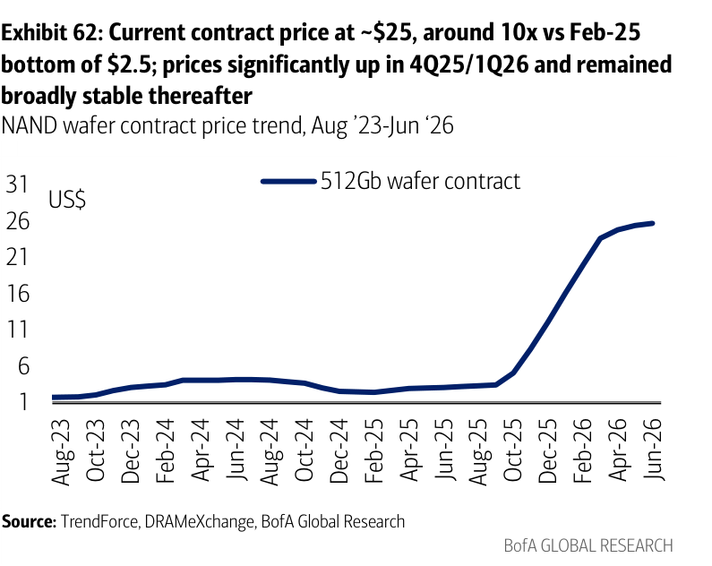

### 解讀摘要

512Gb NAND wafer 合約價 Aug'23–Jun'26 走勢，Jun'26 約 US\$25，是 Feb-25 低谷（約 US\$2.5）的 10 倍。即使 QoQ 轉弱，絕對水準仍屬歷史高位，YoY 獲利能力依然強勁。

---

## Exhibit 63｜NAND 合約 Apr/May/Jun 每月僅漲 +1-5%，動能趨緩

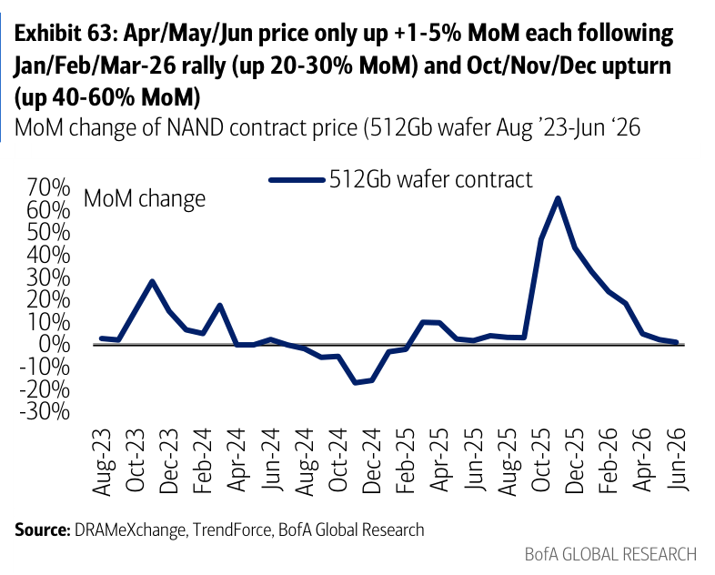

### 解讀摘要

NAND wafer 合約 MoM 漲幅從 Jan-Mar'26 的 +20-30%/月大幅收斂至 Apr-Jun'26 的 +1-5%/月。趨勢明顯放緩，下半年 NAND 合約談判對買方更有利，但尚未出現合約大幅下調。

---

## Exhibit 64｜16Gb DDR5 現貨與合約均在 US\$35-40，歷史常態為 US\$3-5

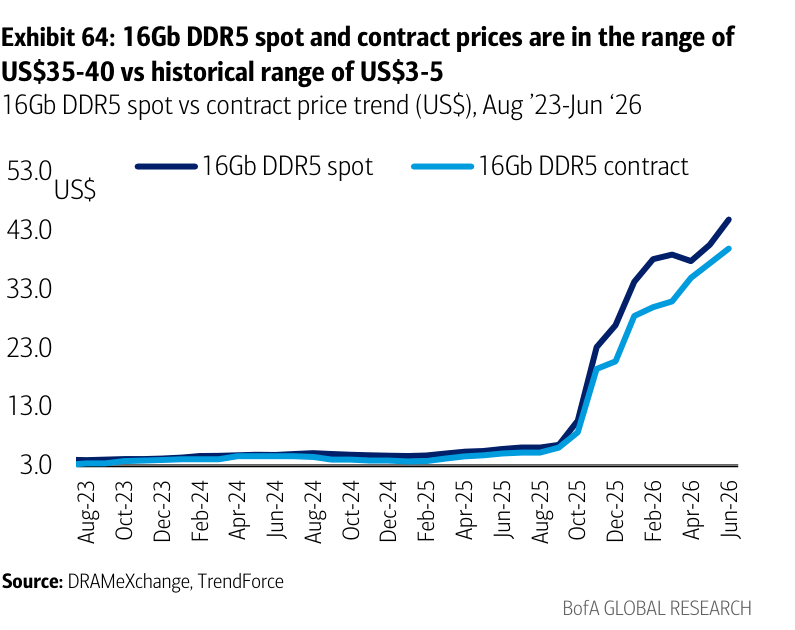

### 解讀摘要

Aug'23–Jun'26 的 16Gb DDR5 spot vs contract 月度走勢，Jun'26 兩者均在 US\$35-40 附近（報告時點 spot 已升至 US\$47.8），而歷史常態範圍是 US\$3-5。整整 8-10 倍的倍數說明市場結構已根本改變（AI 需求量級不同以往）。

---

## Exhibit 65｜DDR5 spot / contract MoM：Oct-Dec'25 大漲後 Jun'26 再轉正

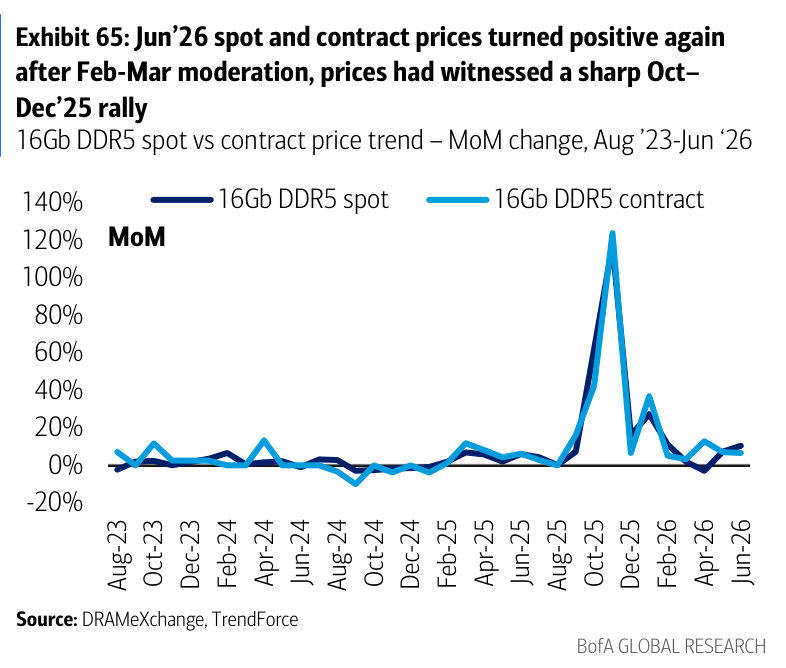

### 解讀摘要

16Gb DDR5 spot vs contract MoM 變化（Aug'23–Jun'26）：Oct-Dec'25 contract 最高一個月漲 ~125% MoM（sharp rally）；Feb-Mar'26 轉負（moderation）；Jun'26 雙雙重回正值。這個 MoM 序列呈現「大漲→鞏固→再上漲」的健康型態。

---

## Exhibit 66｜512Gb NAND 現貨與合約均比 2025 年夏季高出數倍

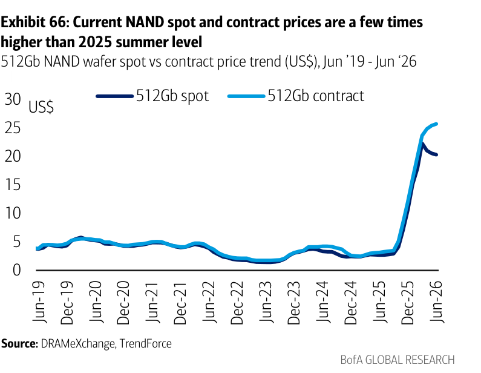

### 解讀摘要

Jun'19–Jun'26 的 512Gb NAND 長期走勢，顯示 2019-2024 年長期在 US\$3-5 範圍盤整，2025 下半年急漲，Jun'26 spot ~US\$20-21、contract ~US\$25-26。BofA 標題指出「比 2025 年夏季高出數倍」，但距離 2026 年初高峰（~US\$30）已有回落。

---

## Exhibit 67｜NAND MoM 變化：Oct-Dec'25 漲 40-50%/月，Jan-Mar'26 漲 20-30%/月，Apr-Jun'26 正常化

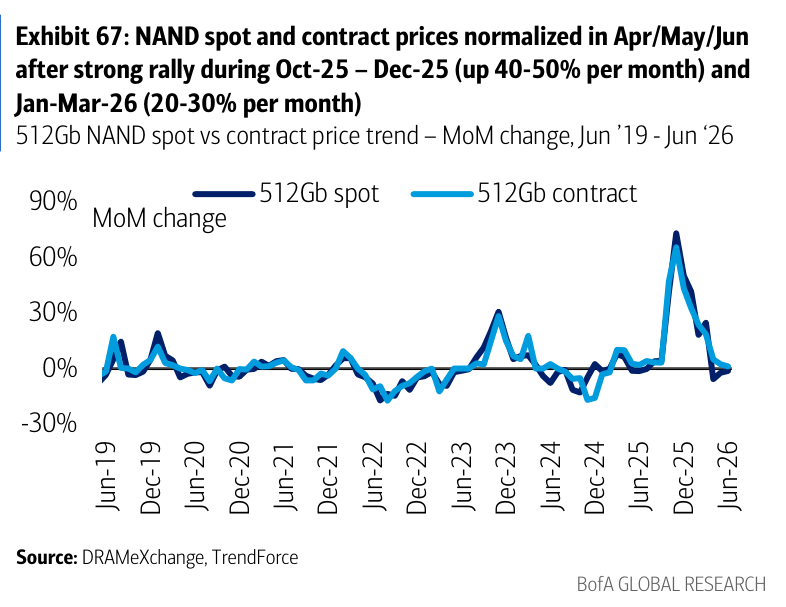

### 解讀摘要

Jun'19–Jun'26 的 512Gb NAND wafer spot vs contract MoM 變化，2025 下半年的 rally 強度史無前例（Oct-Dec'25 各月均 +40-50%），Jan-Mar'26 仍有 +20-30%/月，4-6 月正常化（接近 0%），符合「高原期」特徵。

---

## Exhibit 68｜Server DRAM 64GB 模組創歷史新高：DDR5 US\$1,400，DDR4 US\$1,100

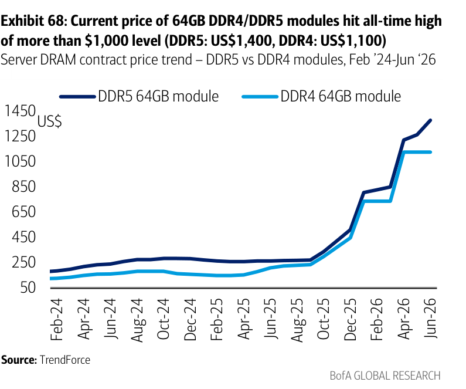

### 解讀摘要

Server DRAM 64GB 模組（wafer 層級以上的終端產品），DDR5 版本在 Jun'26 達到 ATH ~US\$1,400，DDR4 版本 ~US\$1,100，兩者均從 Feb'24 的約 US\$150-175 起漲，分別累計上漲 8-9 倍。Oct-Dec'25 出現加速飆升，模組漲幅甚至大於 chip wafer 漲幅，顯示模組封裝端也在享有額外溢價。

### 表格

| 模組規格 | Feb'24（起點） | Jun'26 ATH | 漲幅倍數 |
|---|---|---|---|
| 64GB DDR5 Server | ~US\$175 | ~US\$1,400 | ~8x |
| 64GB DDR4 Server | ~US\$150 | ~US\$1,100 | ~7x |

> **洞察一**：Server DRAM 64GB module 的漲幅（7-8x）遠超 wafer-level 漲幅（DDR5 wafer +688% = 約 7.9x YoY，但 QoQ 幅度不同），暗示模組廠在本輪週期也享有加成毛利，Micron（同時做 wafer + 模組）受益尤為明顯。

---

## Exhibit 69｜Server DRAM 模組 MoM：Jan'26 DDR4 +65%，Apr'26 雙雙 +40-60%，Jun'26 DDR5 回升 / DDR4 持平

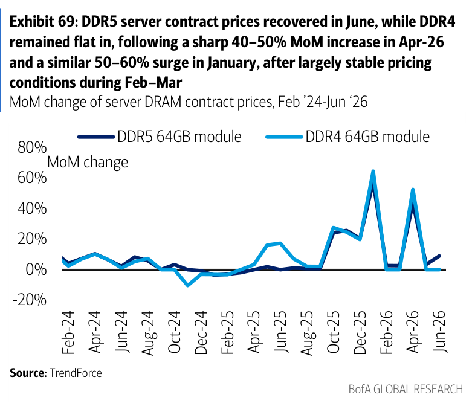

### 解讀摘要

Feb'24–Jun'26 的 64GB DDR5 vs DDR4 server module MoM 變化：Jan'26 DDR4 出現 ~65% MoM 飆升；Apr'26 DDR5 +40%、DDR4 +60%；Feb-Mar'26 兩者持平（穩定期）；Jun'26 DDR5 重回正值、DDR4 約持平。BofA 標題指出 DDR5 在 Jun 回升，而 DDR4 維持持平（DDR4 漲勢動能已較 DDR5 更弱）。

---

## Exhibit 70｜客端 SSD（PC）Apr'24–Jun'26：1Q26 和 4 月急漲，7 月 2H 略軟

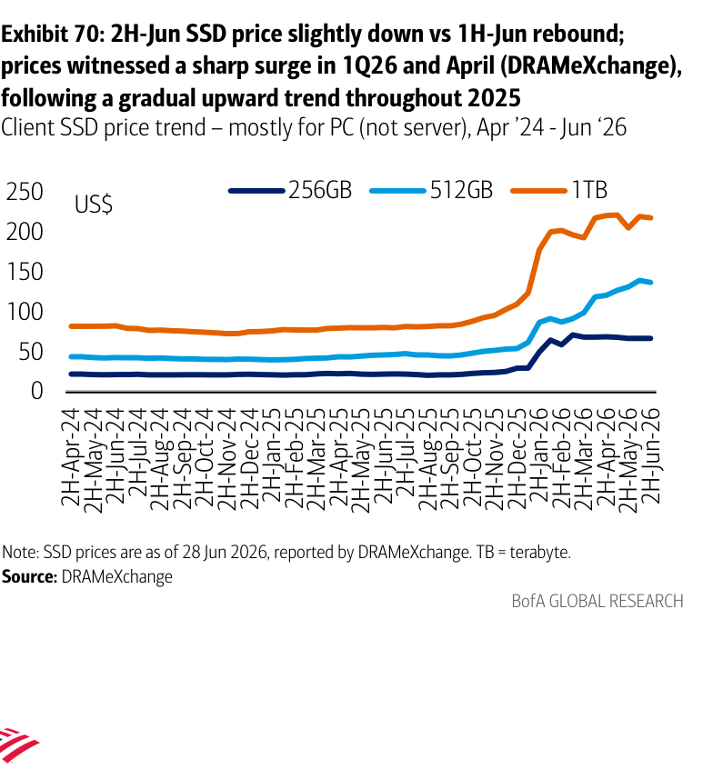

### 解讀摘要

PC 用 Client SSD 價格在 1Q26 和 4 月急漲，6 月下半期略微回落（相對 6 月上半期的反彈）。Jun'26 收盤：256GB ~US\$67，512GB ~US\$135，1TB ~US\$215。2025 全年呈現緩步上漲，2026 1Q 出現跳升，動能主因是 NAND 供給緊繃外溢至 SSD 成品。

### 表格

| SSD 容量 | Apr'24 低點（約） | Jun'26（約） | YoY 約倍數 |
|---|---|---|---|
| 256GB | ~US\$25 | ~US\$67 | ~2.7x |
| 512GB | ~US\$45 | ~US\$135 | ~3x |
| 1TB | ~US\$75 | ~US\$215 | ~2.9x |

---

## Exhibit 71｜PC SSD 6 月較 2025 年底翻倍：256GB US\$40→\$67，512GB US\$73→\$138，1TB US\$129→\$219

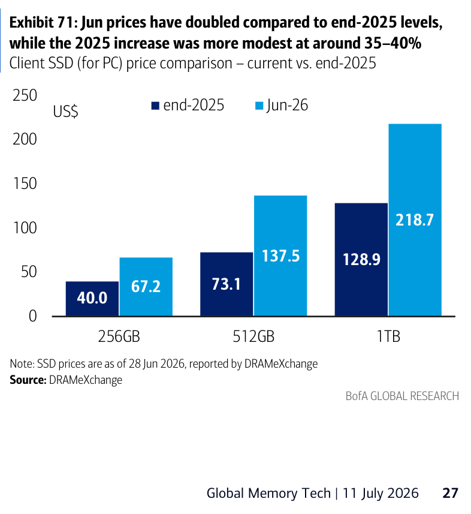

### 解讀摘要

Client SSD 2025 年底→2026 年 6 月漲幅達約翻倍（相較 2025 全年漲幅僅 35-40%）。2026 年上半年的漲速遠超 2025 年，說明 NAND 供給緊張在 2026 年顯著惡化（PC BOM 成本壓力增加）。

### 表格（Client SSD 客端 PC 用價格比較）

| 容量 | 2025 年底 | 2026 年 6 月 | 漲幅 |
|---|---|---|---|
| 256GB | US\$40.0 | US\$67.2 | +68% |
| 512GB | US\$73.1 | US\$137.5 | +88% |
| 1TB | US\$128.9 | US\$218.7 | +70% |

> **洞察一**：PC SSD 半年翻倍，對筆電 / 桌機 BOM 的影響極大——按 2TB 配置估算 NAND 成本從 ~US\$260 漲至 ~US\$440，PC 廠毛利壓縮明顯，也解釋了 BofA Exhibit 21 對 PC 出貨量的下修假設。

---

## Exhibit 73｜記憶體公司 2026 YTD 股價表現：Sandisk / Kioxia +800%+，Micron / Hynix +240%+

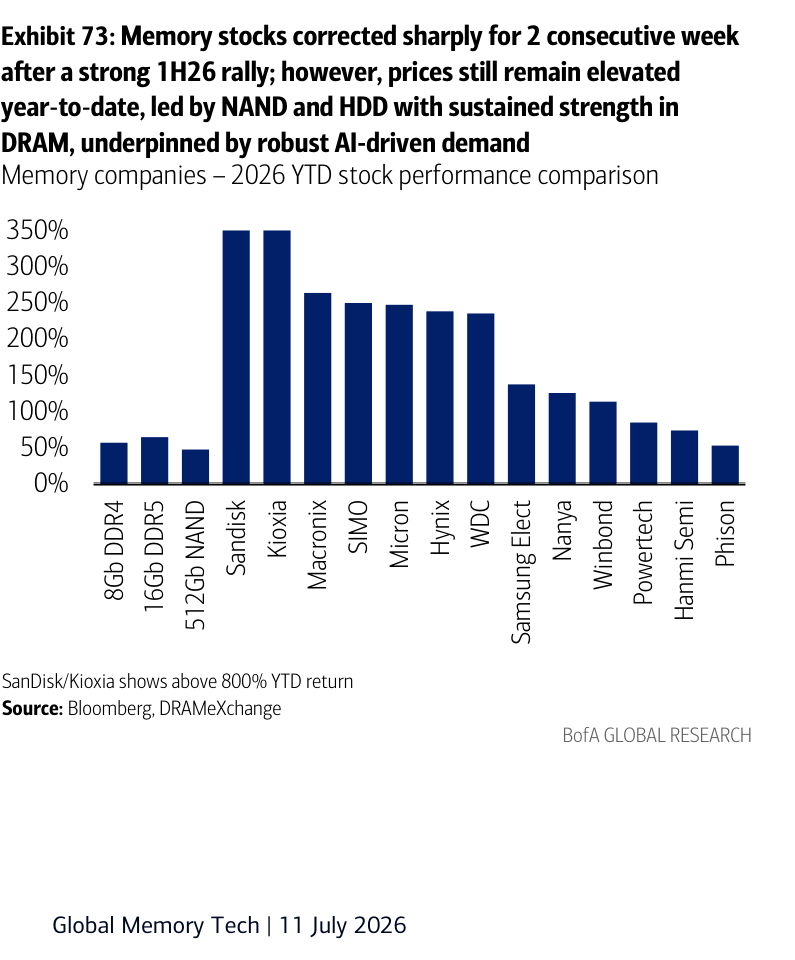

### 解讀摘要

連續兩週大幅修正後，2026 YTD 記憶體族群股價漲幅仍十分驚人：Sandisk / Kioxia >800%（圖表截斷顯示 ~350%，實際超 800%）、Macronix ~260%、SIMO / Micron / Hynix ~240-250%、Samsung ~140%、Nanya ~125%、Phison ~50%。NAND 廠商（Sandisk / Kioxia）的超高 YTD 表現說明市場已對 NAND 週期劇烈超漲定價。

### 表格（2026 YTD 股價漲幅估算）

| 公司 | YTD 約 |
|---|---|
| Sandisk / Kioxia | >800%（圖截斷） |
| Macronix | ~260% |
| SIMO | ~250% |
| Micron | ~245% |
| SK Hynix | ~240% |
| WDC | ~235% |
| Samsung Elect | ~140% |
| Nanya | ~125% |
| Winbond | ~110% |
| Powertech | ~80% |
| Hanmi Semi | ~70% |
| Phison | ~50% |
| 8Gb DDR4 價格（參考） | ~60% |
| 512Gb NAND 價格（參考） | ~50% |

> **洞察一**：Sandisk / Kioxia（最純粹的 NAND 廠）YTD 超 +800%，而 Phison（NAND 控制器）僅 +50%，說明下游控制器廠的漲幅大幅落後 wafer 廠。Phison 如果 NAND ASP 回落，業績影響相對較小，但如果 NAND 維持高位，Phison 的落後是潛在補漲空間。

---

## Exhibit 74｜全球大型科技公司 2026 YTD：Intel / AMD 大幅跑贏 NVIDIA

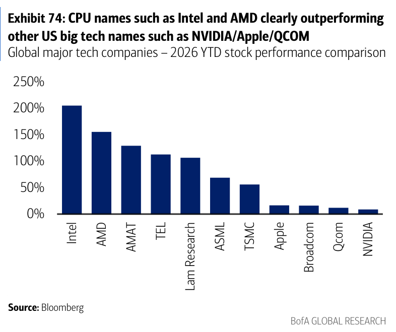

### 解讀摘要

全球主要科技股 2026 YTD：Intel ~205%、AMD ~155%、AMAT ~130%、TEL ~115%、Lam Research ~107%、ASML ~70%、TSMC ~57%，而 Apple ~15%、Broadcom ~15%、Qualcomm ~12%、NVIDIA ~10%。CPU（Intel / AMD）全面跑贏 AI GPU（NVIDIA），暗示市場對非 AI 伺服器復甦（Intel Xeon 換機週期）及 PC CPU（AMD）已充分定價，且早已超越對 AI GPU 龍頭 NVIDIA 的佈局。

### 表格（全球主要科技 2026 YTD 漲幅）

| 公司 | YTD 漲幅 |
|---|---|
| Intel | ~205% |
| AMD | ~155% |
| AMAT | ~130% |
| TEL | ~115% |
| Lam Research | ~107% |
| ASML | ~70% |
| TSMC | ~57% |
| Apple | ~15% |
| Broadcom | ~15% |
| Qualcomm | ~12% |
| NVIDIA | ~10% |

> **洞察一**：Intel YTD +205% 而 NVIDIA 僅 +10%，是本報告期間最反直覺的市場事實。可能的解釋：NVIDIA 已在 2024 上漲數倍後高估值；Intel 受益於非 AI 傳統伺服器 + PC 復甦；記憶體相關受益股（AMAT / TEL / Lam）已跑贏 NVIDIA，暗示「AI 硬體設備」比「AI GPU」更受市場青睞。

---

## 相關個股清單

| 類別 | 公司 | Ticker | 評等 | 備註 |
|---|---|---|---|---|
| 首選（DRAM-HBM） | SK Hynix | 000660.KS | Restricted | HBM 市佔最高；BofA Restricted |
| 首選（DRAM 傳統） | Samsung Electronics | 005930.KS | Buy | TP W480,000（普通）/ W360,000（優先）；12m SOTP；2Q26 OP W89.4tn |
| 首選（遺留 DRAM） | Nanya Technology | 2408.TW | Buy | TP NT\$660（9x 2027-28E P/E）；2Q26 OPM 74%；遺留 DRAM 稀缺性溢價最純粹受益者 |
| DRAM 美股 | Micron Technology | MU | C-1-7 | 2026E P/E 13.6x，EV/EBITDA 10.9x |
| NAND | Kioxia | XIYUF | C-1-9 | 2026 YTD +800%+；pure NAND play |
| NAND | Sandisk | SNDK | C-1-9 | 2026 YTD +800%+；pure NAND play |
| NAND 控制器 | Phison | 8299.TW | C-1-8 | 月營收 +301% YoY；YTD 僅 +50% 落後 wafer 廠 |
| AI 設備 | AMAT | AMAT | B-1-7 | YTD +130%；HBM / TC bonding 受益 |
| AI 設備 | Lam Research | LRCX | C-1-7 | YTD +107% |
| AI 設備 | TEL | TOELF | C-1-7 | YTD +115% |
| 封裝 | Hanmi Semi | HNSIF | C-1-7 | YTD +70%；TC bonding 受益 |
| 封裝 | ASMPT | ASMVF | C-1-7 | YTD +50% |
