# GS｜ABF 基板：漲價超預期，台廠目標價全面調升 81-112%

**券商**：Goldman Sachs  
**分析師**：Chao Wang、Daiki Takayama、Allen Chang、Al Wang  
**日期**：2026-07-12  
**主題**：ABF price hikes to outpace estimates, with solid GM expansion from 2Q26; revise up TPs for all TW ABF substrate players by 81% to 112%  
**評級**：NYPCB Buy (CL) / Kinsus Buy / ZDT Buy / Unimicron Neutral  
<a href="https://layx.uk/dl?g=產業&b=GS&d=20260712&h=ABF-Price-Hikes">📎 下載 PDF</a>

---

## 報告總結

本報告為 GS 繼年初 ABF 升評報告後的重大更新：實際供需缺口比原本預期更早、更嚴峻。ABF 基板缺口從 2Q26 已開始（而非原預期的 2H26 才出現），Lead time 已從年初 3-4 個月急拉至 12+ 個月，Tier 2/3 廠商甚至開始以競標方式出售現有產能。GS 大幅上調 2025-28E CAGR 預測至 62%（前 33%），並預期 LTA/Spot 價格每季漲幅從 3Q26 起為 10-15%/20%+ QoQ，至少延續至 2027 年底。台廠 ABF 目標價全面調升 81-112%：NYPCB NT\$2,310（前 NT\$1,115）、Kinsus NT\$1,120（前 NT\$555）、Unimicron NT\$1,140（前 NT\$630）、ZDT NT\$824（前 NT\$388）。

投資上 GS 最偏好 Spot 價格曝險最高的 NYPCB（Conviction List Buy）：2Q26 GM 從 1Q26 的 15.8% 大幅跳升至 26.3%（共識僅 19.8%），3Q26 再擴至 33%+，OPM 從 12.1% → 23.2% → 30.3%。Kinsus 是 AI ABF 份額快速增加的受益者，AI 曝險從 2025 年的 2% 收入佔比快速升至 2028E 的 27%。Unimicron 維持 Neutral——GS 認為漲幅最大但目前已是 LTA 為主，Spot 價格重估的彈性不如 NYPCB。

---

## GS 完整投資邏輯鏈

| 論點層次 | Exhibit | 內容 |
|---|---|---|
| 瓶頸確認 | Ex 2、7 | UTR 快速趨近滿載（2H26 全線滿）；Lead time 年初 3 月→現在 12+ 月，正朝 2020-22 週期的 18-30 月逼近 |
| 需求結構 | Ex 3、4、5 | ABF TAM 62% CAGR 至 2028E US\$33bn；AI server 佔需求從 13%（2025）→ 45%（2028E）；AI ASIC 是最快成長的子驅動 |
| 面積密度提升 | Ex 8、9、10 | Rubin GPU ABF 面積較 Blackwell +123%；AI ABF 需求 YoY 顯著高於 AI 晶片出貨 YoY（content intensity 效應） |
| 供給上限 | Ex 13、14、15 | CAPEX 40% CAGR 但新產能 2H28 後才到位；供給僅 15% CAGR；設備 Lead time 與良率爬坡拖累產能轉換 |
| S/D 缺口與定價 | Ex 1、20 | 2H26/2027/2028 缺口 14%/34%/51%；LTA/Spot 每季漲 10-15%/20%+；Spot 廠 OPM 擴張最快 |
| AI ASIC 結構 | Ex 16、17、18、19 | AI IC 基板 TAM 修正至 101% CAGR（前 66%）；ASIC 佔 AI ABF 將從 2025 少數 → 2028E 50%+；Kinsus 是 AI ABF 最大受益者（份額 1%→9%） |
| 近期業績超預期 | Ex 21、22、23 | 2028E AI ABF TAM 上調 30%（US\$10,754mn vs 前 US\$8,269mn）；NYPCB/Kinsus/Unimicron/ZDT 2Q26E 全面 beat 共識 4-38%；3Q26E 營業利益高於共識 9-53% |
| **結論** | 封面 | **目標價全線上調 81-112%；NYPCB（CL）/ Kinsus / ZDT Buy；Unimicron Neutral；Spot 廠 NYPCB 最佳入口** |

> **報告最大邏輯缺口**：ABF 漲價的 10-15%/20%+ QoQ 假設依賴 CSP/ODM 接受漲幅而非急尋替代方案；若 AI ASIC 出貨時程延後（如 CSP 進度落後），需求高峰可能推遲，GS 的 2027/2028 S/D 缺口估算將有下修空間。

---

## 報告核心觀點

| 主題 | GS 觀點 | 市場共識 | 是否 Contra-Consensus |
|---|---|---|---|
| ABF 缺口起始點 | 2Q26 已開始（Spot 漲從 4 月）；比原預期早 1-2 季 | 普遍預期 2H26 才出現短缺 | 是（更早） |
| ABF TAM CAGR | 62%（2025-28E）修正自 33% | 低估 ASIC 成長速度 | 是（比市場修正更大） |
| 價格漲幅 | LTA/Spot 各漲 10-15%/20%+ QoQ，3Q26 起至少到 2027E | 溫和的 mid-single digit 漲幅 | 是（幅度更大） |
| NYPCB 2Q26 GM | 26.3%（GS） vs 共識 19.8% | 19.8% | 是，GS 高共識 6.5ppt |
| NYPCB 3Q26 OPM | 30.3%（GS） vs 共識 17.5% | 17.5% | 是，GS 高共識 12.8ppt |
| AI ABF TAM 2028E | 上調至 US\$10,754mn（前 US\$8,269mn） | 未修正或小修 | 是（+30%） |
| ASIC 重要性 | 2028E 佔 AI ABF 50%+ | 以 GPU 為主要敘事 | 是（ASIC 重要性被低估） |

**偏好排序**：NYPCB（CL-Buy）> Kinsus > ZDT > Unimicron  
**個股選擇邏輯**：Spot 曝險（NYPCB 80%）→ 定價重估最快；Kinsus AI 份額快速提升為第二受益；Unimicron Neutral 因 LTA 為主，Spot 重估彈性較弱

---

## Exhibit 1｜ABF 產業供需缺口持續擴大

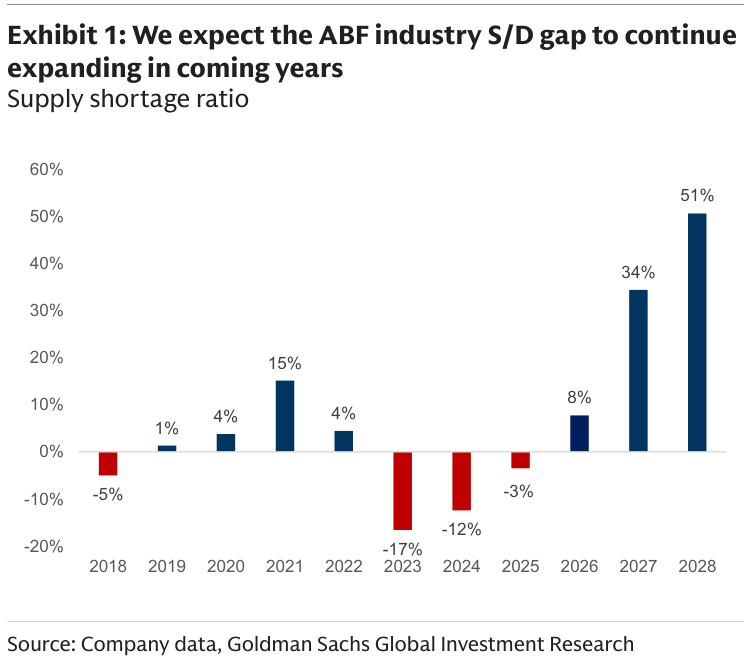

### 解讀摘要

供需缺口從 2025 年的平衡（-3%，即 3% 小幅供過於求）迅速翻轉至 2026E 的 8% 供不應求，並在 2027E/2028E 加速至 34%/51%。這個加速曲線背後的意義是：即使 ABF 廠商全力擴產，需求增速（62% CAGR）與供給增速（15% CAGR）之間的差距每年都在擴大，意味著 ABF 漲價週期不是一兩季的事件，而是結構性的多年週期。

> **原文補充**：GS 將 2H26 缺口估計上修至 14%（此圖展示全年數字）；2023/2024 的連續負值（-17%/-12%）揭示了前一個下行週期的嚴重程度，此次上行週期回彈幅度更可能相對應地更強。

### 表格

| 年份 | 供需缺口（正 = 供不應求） | 備註 |
|---|---|---|
| 2018 | -5% | 小幅供過於求 |
| 2019 | +1% | 接近平衡 |
| 2020 | +4% | 週期開始 |
| 2021 | +15% | 上一個大週期高峰 |
| 2022 | +4% | 回落 |
| 2023 | -17% | 下行週期低點 |
| 2024 | -12% | 仍然供過於求 |
| 2025 | -3% | 接近平衡 |
| **2026E** | **+8%** | **新週期開始（GS 前估 5%）** |
| **2027E** | **+34%** | **GS 前估 21%** |
| **2028E** | **+51%** | **GS 前估 42%** |

*缺口計算：(需求 - 供給) / 供給*

> **洞察一**：本次缺口深度（2028E 51%）與速度（-3% → 51% 在三年內）均超越上一個 2020-22 週期（峰值僅 15%），因為此次需求由 AI 資料中心「必需採購」（基板缺貨直接影響 AI 晶片出貨）驅動，客戶接受漲價的意願遠高於傳統 PC 週期。

---

## Exhibit 2｜ABF 基板產業 UTR（產能利用率）持續趨近滿載

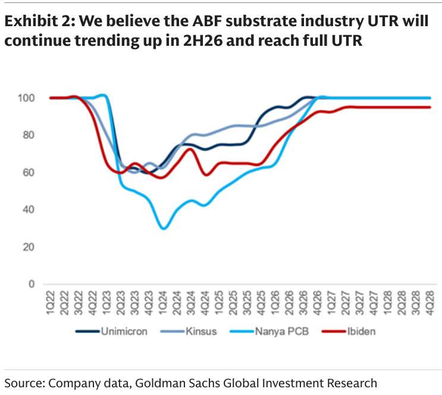

### 解讀摘要

台灣四大 ABF 廠商 UTR 的時序錯落反映了供給層次感：Ibiden 從 2H24 起即幾乎滿載（GPU 應用），Unimicron 2H25 起滿載，NYPCB 與 Kinsus 則在 1H26 才快速趕上。此圖說明為何 GS 預期所有主要 ABF 供應商從 2H26 開始全面滿載——這是 Lead time 從 3 個月急拉至 12+ 個月的直接原因，也是 Spot 漲價從 4 月開始的供給側確認。

> **原文補充**：Ex 6 為 Ex 2 的重複圖（相同標題，確認為版面設計重複），內容完全一致，已略過。

### 表格

| 廠商 | 全面滿載時間 | 特色 |
|---|---|---|
| Ibiden | 2H24 起（AI GPU 應用） | 最早滿載，以 GPU 基板為主 |
| Unimicron | 2H25 起 | LTA 廠，早期 AI 投資 |
| NYPCB | 1H26 起快速趨近 | Spot 廠，80% Spot 曝險 |
| Kinsus | 1H26 起快速趨近 | AI ABF 份額快速爬升中 |
| **所有供應商** | **2H26 全面滿載，至少到 2028E** | — |

> **洞察一**：Ibiden 滿載領先台廠 1.5-2 年，卻沒有觸發足夠多的新增產能宣告，代表業界對此輪週期持續性一直存疑。現在台廠也達滿載，GS 認為整個產業才真正意識到缺口長度（30 個月+），接下來大規模 CAPEX 宣告才剛要開始。

---

## Exhibit 3｜ABF 新一輪超級週期開啟：ROE 將創歷史新高

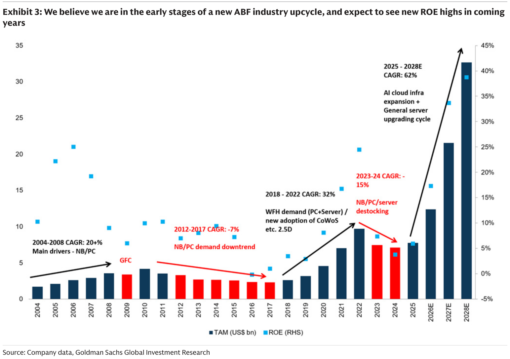

### 解讀摘要

此圖以 ABF 廠商歷史 ROE 走勢呈現週期性，疊加 GS 對 2026-29E 的預測。GS 宣告現在正處於新一輪超級週期的初期——ROE 將在 2027-28E 超越 2020-22 週期的歷史高點。這是整份報告最重要的框架性圖表：它說明為什麼 GS 對台廠 ABF 股的估值邏輯應該比照週期高峰，而不是用當前的保守假設。

### 表格

| 週期 | 特徵 | ROE 峰值（示意） |
|---|---|---|
| 2020-22 上行週期 | PC/Server COVID 需求；高峰 15% S/D 缺口 | 歷史高點 |
| 2023-25 下行週期 | 修正、庫存去化、過剩供給 | 低谷 |
| **2026E 起新週期** | **AI ASIC/Server 驅動；峰值 S/D 缺口 51%（2028E）** | **預估超越前高** |

> **洞察一**：本次週期 S/D 缺口深度（51%）遠超上一輪（15%），但 ROE 能否相應超越前高，取決於廠商是否能夠維持目前估計的 20%+ QoQ 漲價——這是最大的不確定性。

---

## Exhibit 4｜ABF 需求結構：AI Server 佔比持續攀升

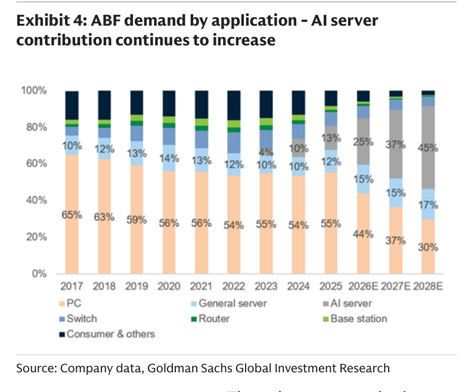

### 解讀摘要

此圖揭示 ABF 需求的結構性轉變：從多元應用（PC/Consumer/Base station 主導）轉向高度集中於 AI server 與 General server。2025 年 AI server 僅佔 13%，但到 2028E 擴至 45%；若加上 General server，兩者合計從 2025 年的 25% 升至 2028E 的 62%，意味著其餘應用（PC/Consumer/Switch 等）的總體份額從 75% 壓縮至 38%。

> **原文補充**：GS 特別指出 AI server + General server 合計將在 2026/27/28E 達到 41%/53%/62%，而不是直接跳到 62%。這個逐步演進的節奏說明為何 2026 年的短缺比預期來得早——AI server 需求在 2H25/1H26 的實際增速遠超預期。

### 表格

| 應用 | 2025 佔比 | 2026E 佔比 | 2028E 佔比 | 備註 |
|---|---|---|---|---|
| AI server | 13% | 約 26% | 45% | 最大增量來源 |
| General server | 12% | 約 15% | 17% | agentic AI 推動 |
| **AI+Gen server 合計** | **25%** | **41%** | **62%** | — |
| Switch | — | — | — | 20% CAGR，份額相對穩定 |
| PC | — | — | — | 8% CAGR，份額下降 |
| Consumer & others | — | — | — | -13% CAGR，份額大幅下降 |

> **洞察一（配合 Exhibit 5）**：Exhibit 4 的結構轉變（AI+Server 從 25%→62%）對應 Exhibit 5 中 AI server ABF 的 101% CAGR——這兩個數字必須同時成立。若 AI ABF 佔比只到 45%（如 Ex 4），則 2028E ABF TAM 中 AI 那段大約 US\$14.9bn，這暗示 AI IC substrate TAM 的修正（Ex 16 的 US\$10.8bn AI ABF TAM）主要對應 AI server 基板，非 100% 重疊。

---

## Exhibit 5｜AI Server ABF 需求 CAGR 高達 101%，General Server 次之（79%）

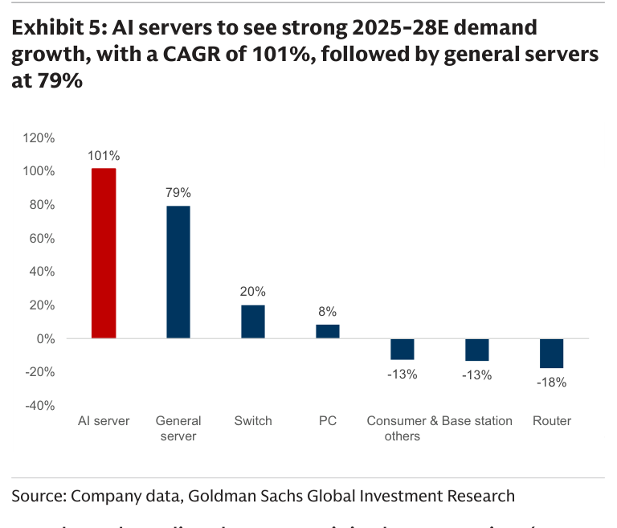

### 解讀摘要

此圖以條形圖呈現各應用的 ABF 需求 2025-28E CAGR，說明需求成長高度集中、非均衡的本質。AI server 的 101% 遠超其他所有應用，General server 的 79% ABF 需求 CAGR（注意：這是 ABF 需求成長，遠高於 General server CPU 出貨的 25% CAGR，差距來自每顆 CPU 的 ABF 面積消耗增加了 30%+）。Switch 的 20% CAGR 是小而穩的正面。PC 以下全部為負成長或低單位數。

### 表格

| 應用 | ABF 需求 CAGR（2025-28E）| 備註 |
|---|---|---|
| AI server | 101% | 晶片出貨 + 面積強化雙輪驅動 |
| General server | 79% | 面積消耗增 30%+ 使 ABF 需求增速 >> 出貨增速（25% CAGR）|
| Switch | 20% | 1.6T/3.2T 切換 IC 帶動規格升級 |
| PC | 8% | 溫和正成長 |
| Consumer & others | -13% | 去成長 |
| Base station | -13% | 去成長 |
| Router | -18% | 去成長最快 |

> **洞察一**：General server ABF 需求 CAGR（79%）與 CPU 出貨 CAGR（25%）之間的差距（約 54ppt），完全來自 ABF 面積消耗每代增加 30%+（Ex 8）。這意味著 General server 這條線的需求驅動力和 AI 一樣，都是「規格密度升級」而非純數量成長，使 GS 的預測對「AI 需求放緩」的風險有一定的緩衝。

---

## Exhibit 7｜ABF 基板 Lead Time 已達 12+ 個月

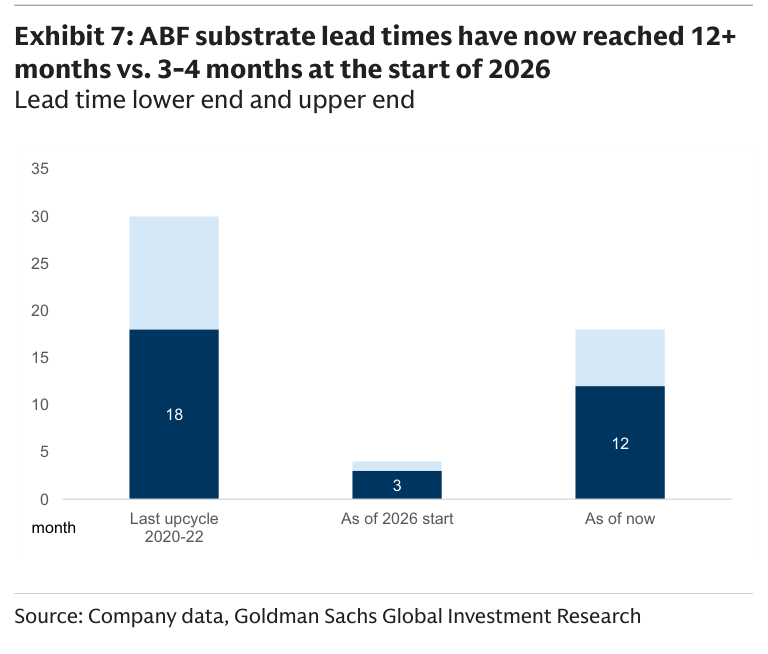

### 解讀摘要

三個時間點的 Lead time 比較清楚呈現了週期速度之快：上一個 2020-22 週期巔峰為 18 個月，2026 年年初僅 3-4 個月（週期低點），七個月後的現在（2026 年 7 月）已拉至 12+ 個月——這意味著 Lead time 可能在 2027 年延伸到 18-30 個月範圍，與上一個週期的巔峰相當。

### 表格

| 時間點 | Lead Time |
|---|---|
| 上一個週期巔峰（2020-22） | 18 個月 |
| 2026 年初（週期低點） | 3 個月 |
| 現在（2026 年 7 月） | 12+ 個月 |
| GS 預估方向 | 朝 18-30 個月靠攏 |

> **洞察一**：Lead time 從 3 個月到 12+ 個月僅花了半年，說明需求加速的斜率超出業界預期。歷史上 Lead time 達到 12 個月後通常是最大漲價加速期，因為客戶意識到必須鎖產能。GS 的 10-15%/20%+ QoQ 漲價估計，在 Lead time 進一步拉長的情況下，甚至可能偏保守。

---

## Exhibit 8｜ABF 面積消耗增加：層數增加 + 尺寸放大

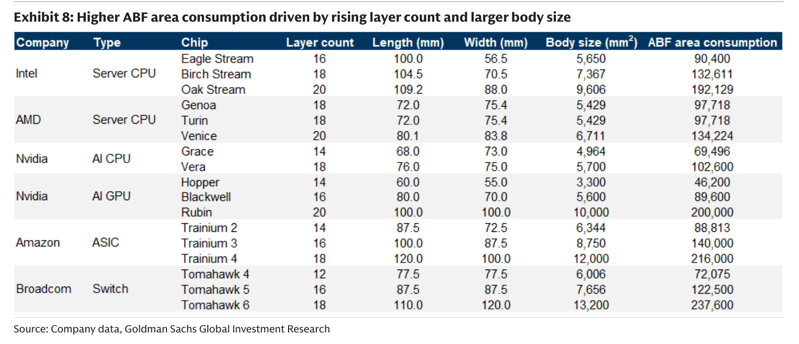

### 解讀摘要

此圖量化了每類晶片下一代規格升級時，ABF 基板面積消耗的增幅。Nvidia Rubin GPU 的 +123% 是最驚人的數字——這意味著每顆晶片的 ABF 需求超過翻倍，是驅動 AI server ABF 101% CAGR 的最核心原因（晶片出貨增 47% × 面積強化 > 100%）。

### 表格

| 晶片類型 | 升級對比 | ABF 面積增幅 |
|---|---|---|
| Nvidia AI GPU | Rubin vs Blackwell | +123% |
| Nvidia AI CPU | Vera vs Grace | +47% |
| 一般伺服器 CPU | Intel/AMD 下一代 | +30%+ |
| ASIC / Switch | 規格升級 | 增加，但低於 GPU |

> **洞察一**：Rubin GPU +123% ABF 面積這個數字意味著即使 GPU 出貨量沒有成長，光是 Rubin 世代的切換就能使 ABF 需求翻倍。若疊加 47% 出貨 CAGR（Ex 9），2025→2028E AI GPU 的 ABF 需求可能接近 6-7 倍。

---

## Exhibit 9｜AI 晶片出貨量 2025-28E CAGR 達 47%

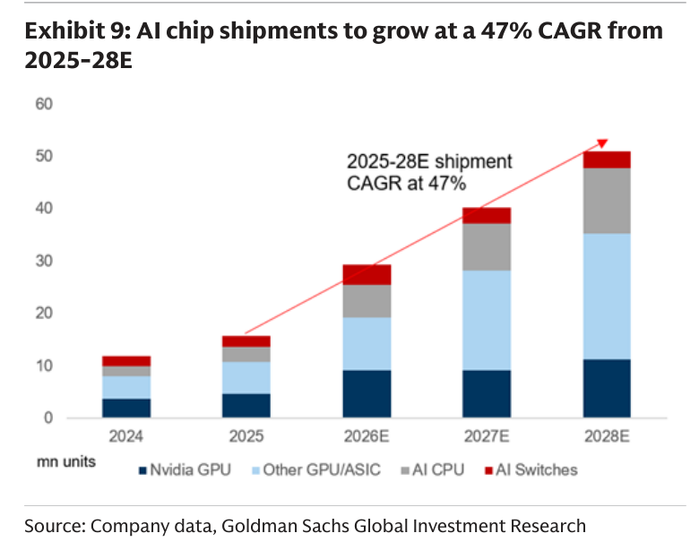

### 解讀摘要

此圖呈現各類 AI 晶片（GPU、ASIC、AI CPU 等）的出貨量預測，整體 AI 晶片出貨 47% CAGR。值得注意的是：ASIC 出貨量成長（58% CAGR）快於 GPU，且 ASIC 的 ABF 面積消耗也大，這是 Ex 17（ASIC 佔 AI ABF 50%+）的出貨側確認。

> **原文補充**：GS 特別提及 Nvidia Vera 獨立機架架構（standalone rack）意味著 AI CPU 出貨量有更多上行空間，因為 Vera CPU 將不再只是附屬於 GPU，而是可以獨立部署。

### 表格

| 晶片類型 | 出貨 CAGR（2025-28E）| 備註 |
|---|---|---|
| AI 晶片整體 | 47% | — |
| ASIC 子項 | 58% | 最快，CSP 自研 AI 晶片驅動 |
| AI GPU | — | Rubin 世代面積 +123% 是最大增量 |
| AI CPU | — | Vera standalone rack 提供出貨上行 |

> **洞察一（配合 Exhibit 10）**：AI 晶片出貨 47% CAGR + 面積消耗強化（GPU +123%、CPU +47%）→ AI ABF 需求 101% CAGR（Ex 5）。兩者之間的差距就是 ABF Content Intensity 提升的貢獻，這個效應在 Ex 10 中直接呈現。

---

## Exhibit 10｜AI ABF 需求 YoY 顯著高於 AI 晶片出貨 YoY

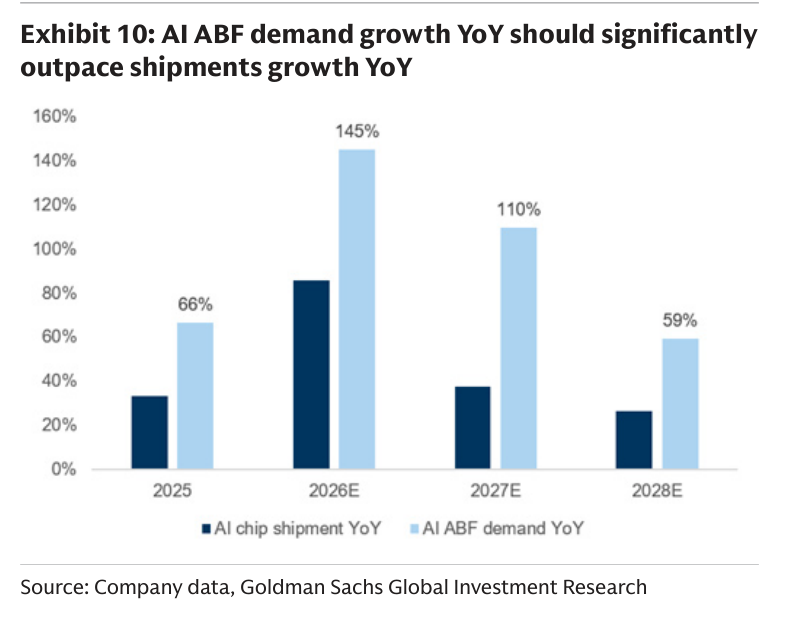

### 解讀摘要

此圖直接展示「Content Intensity」效應的規模：AI ABF 需求的 YoY 成長率（如 2026E、2027E）顯著高於 AI 晶片出貨 YoY，差距就是每顆晶片的 ABF 面積消耗增加的貢獻。這告訴投資人，即使 AI 晶片出貨速度放緩，ABF 需求成長也不會等比例下降，因為規格升級（更多層、更大尺寸）會持續貢獻。

> **洞察一**：Content Intensity 提升是 ABF 需求最有防禦性的驅動力——只要 AI 晶片世代繼續向更複雜規格遷移（Rubin、Vera 等），ABF 需求的增速就會持續領先晶片出貨增速。GS 預計這個差距在 2025-28E 均維持正值。

---

## Exhibit 11｜一般伺服器 CPU 出貨量 2025-28E CAGR 為 25%

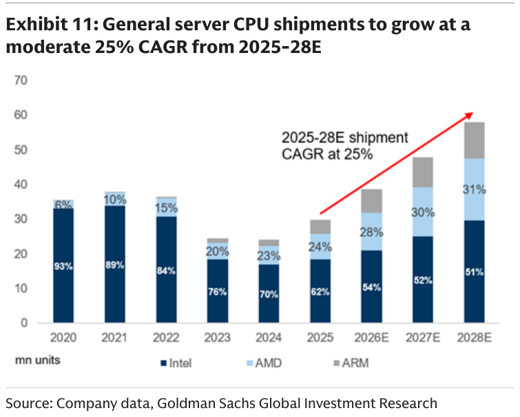

### 解讀摘要

一般伺服器 CPU 出貨量 25% CAGR 雖遠不及 AI 晶片的 47%，但背後的驅動力有所不同：Agentic AI 的大規模採用需要大量 CPU 算力來支撐 AI 推理工作負載，使 GPU:CPU 附掛比從 2x 逐步壓縮到 1.1-1.4x。這是一個隱性的需求增量——不是技術進步，而是拓撲架構改變帶來的。

> **原文補充**：GS 預期隨著 Agentic AI 應用普及，每部署一台 GPU 所需的 CPU 數量會增加（GPU:CPU 比從 2:1 降至 1.1:1-1.4:1），這是 GS 將一般伺服器 CPU 出貨 CAGR 設在 25% 的關鍵假設。

---

## Exhibit 12｜一般伺服器 ABF 需求 YoY 持續高於 CPU 出貨 YoY

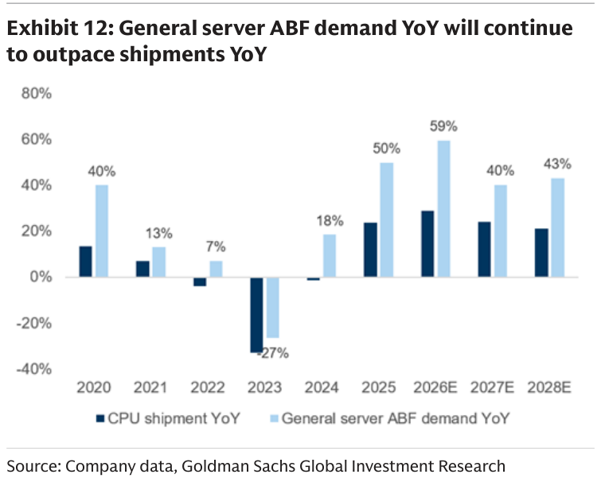

### 解讀摘要

與 Exhibit 10 的 AI 側邏輯類似，此圖顯示一般伺服器 ABF 需求成長也持續高於 CPU 出貨成長，差距來自 Intel/AMD 下一代 CPU 的 ABF 面積消耗增加 30%+（Ex 8）。這是 79% ABF CAGR vs 25% 出貨 CAGR 的視覺化確認。

> **洞察一（配合 Exhibit 11）**：CPU 出貨 +25% CAGR 加上面積 +30%+ → General server ABF 需求 79% CAGR。計算：1.25 × 1.30 ≈ 1.625，即約 62% 年複合成長。GS 的 79% 數字略高，可能納入了更換周期加速與 mix 效應。

---

## Exhibit 13｜ABF 廠商合計 CAPEX 維持高位（40% CAGR 2025-28E）

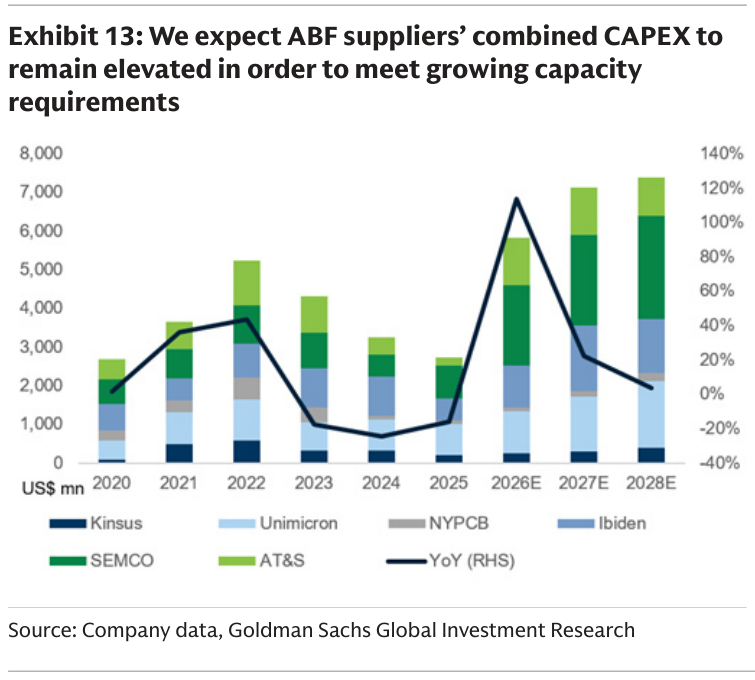

### 解讀摘要

ABF 廠商合計 CAPEX 以 40% CAGR 成長，遠高於供給的 15% CAGR——兩者的 25ppt 差距揭示了 ABF 基板在資本效率上的一個結構性問題：每單位 CAPEX 轉換成的有效產能越來越低，因為設備 Lead time 長（部分設備要等到 2028 後才交貨）、更高規格基板的良率爬坡慢、以及部分廠商同時投資多個業務（MLCC、PCB、Glass substrate 等）。

### 表格

| 指標 | 2025-28E CAGR | 意義 |
|---|---|---|
| 廠商合計 CAPEX | 40% | 積極投資意願，但轉換效率受限 |
| ABF 供給增量 | 15% | 遠低於 CAPEX CAGR |
| ABF 需求增量 | 62% | 供需差距越來越大 |

> **洞察一**：CAPEX/供給轉換效率下降（40% CAPEX → 只有 15% 供給成長）的結構原因：（1）設備 Lead time 長，（2）規格升級使現有機台產能效率每年下降約 10%，（3）部分 CAPEX 流向其他業務。這意味著即使廠商再加碼 CAPEX，短期內對供給的影響也有限。

---

## Exhibit 14｜ABF 基板產業整體產能成長速度有限

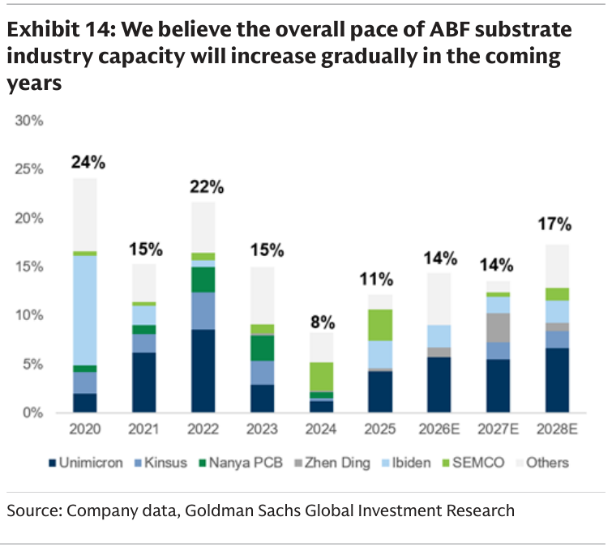

### 解讀摘要

此圖顯示整體 ABF 基板產能以 15% CAGR 成長，但搭配 GS 估計每年約 -10% 的產能效率衰退（規格升級帶來生產複雜度增加），實際可用的有效產能成長更低。供需缺口 8%→51% 的惡化，正是這個 15% 供給成長無法追上 62% 需求成長的直接結果。

> **洞察一（配合 Exhibit 13）**：合計 CAPEX 以 40% CAGR 成長但產能僅 15% CAGR 成長，有效轉換率不到 40%。如果規格升級持續，每年 -10% 的產能效率衰退意味著「名目產能」和「有效產能（可交付數量）」之間的落差每年都在擴大。

---

## Exhibit 15｜ABF 廠商產能擴充計畫時程表

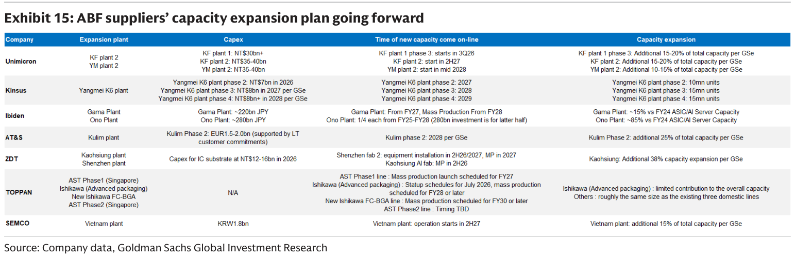

### 解讀摘要

此表是全報告最重要的供給側地圖：清楚呈現每家廠商、每個廠區的新產能上線時程。核心結論是：2026 年到位的新產能有限，主要新增產能集中在 2027-2028 年，但部分廠商（如 TOPPAN）的主要產能要到 2029-2030 年後才全面就緒。這直接支撐了 GS 對 2026-2028E 供需缺口持續惡化的論點。

### 表格

| 廠商 | 廠區/專案 | 預計上線時程 |
|---|---|---|
| Unimicron | KF 一廠 | 3Q26 |
| Unimicron | KF 二廠 | 2H27 |
| Unimicron | YM 二廠 | 2028 年中 |
| Kinsus | K6 Phase 2 | 2027 |
| Kinsus | K6 Phase 3 | 2028 |
| Kinsus | K6 Phase 4 | 2029 |
| Ibiden | Gama 廠 | FY27 |
| Ibiden | Ono 廠各期 | FY25-FY28 |
| AT&S | Kulim 廠 | 2028 |
| ZDT | 高雄廠 | 2H26 |
| ZDT | 深圳廠 | 2027 |
| TOPPAN | 各期擴建 | FY27-FY30+ |
| SEMCO | 越南廠 | 2H27 |

> **洞察一**：2026 年有意義的新增供給只有 Unimicron KF 一廠（3Q26）和 ZDT 高雄廠（2H26）。其餘主要產能全在 2027 年以後，解釋了為何 2H26 短缺比市場預期嚴峻（ZDT + Unimicron 2026 新增有限，抵銷不了需求加速）。

---

## Exhibit 16｜AI IC 基板 TAM 預測上修至 101% CAGR（前估 66%）

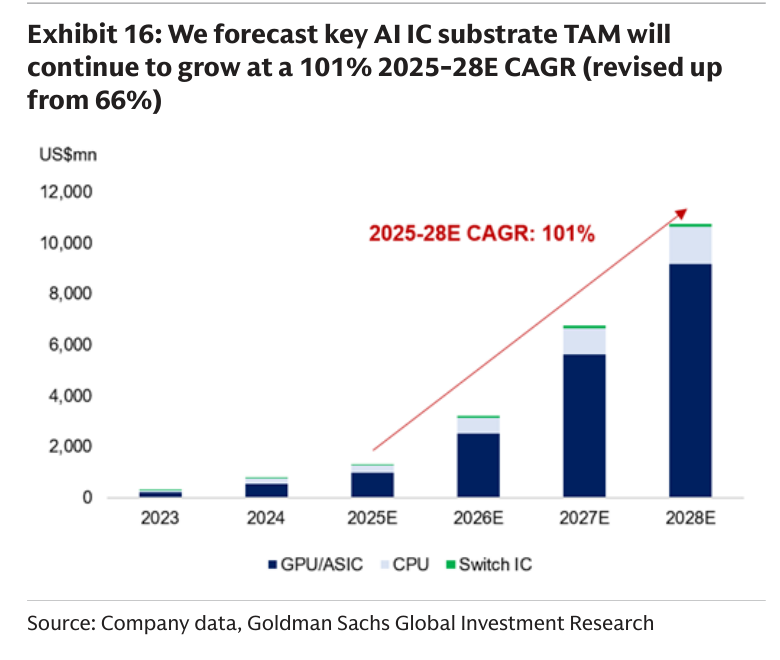

### 解讀摘要

GS 將 AI IC 基板（AI server ABF）TAM 的 2025-28E CAGR 從原本的 66% 大幅上調至 101%，主要驅動來自：（1）ASIC 出貨量成長比預期更快，（2）AI GPU/ASIC 的 ABF 面積消耗增幅比預期大（尤其 Rubin GPU +123%）。2028E AI ABF TAM 修正至約 US\$10.8bn（詳見 Ex 21）。

### 表格

| 指標 | 前估 | 修正後 | 變化 |
|---|---|---|---|
| AI IC 基板 TAM CAGR（2025-28E）| 66% | 101% | +35ppt |
| 主要上修原因 | — | ASIC 量增 + GPU 面積強化 | — |

> **洞察一**：66% → 101% 的修正幅度本身就已很大，但 GS 警告這個估計仍可能偏保守，因為 ASIC 的定義（包含 CSP 自研晶片如 TPU、Trainium 等）持續擴張，每個版本的 ASIC 都在消耗更多 ABF。

---

## Exhibit 17｜ASIC 將在 2028E 佔 AI ABF 需求的 50% 以上

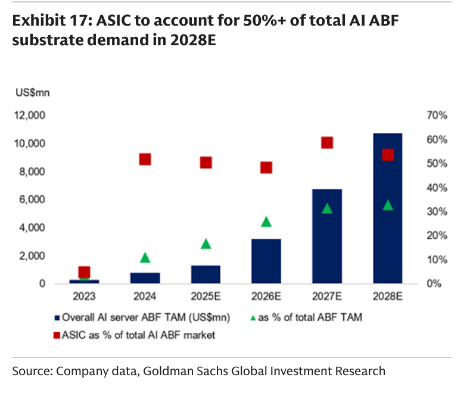

### 解讀摘要

AI ABF 需求的內部結構從 GPU 主導轉向 ASIC 半壁江山，是本報告最具 Contra-Consensus 意義的觀察之一。2025 年 ASIC 在 AI ABF 中的份額相對有限，但 GS 預測到 2028E 將超過 50%。這個轉變的意義：ASIC 訂單通常是 CSP（Meta、Google、Amazon 等）自行設計、供應商資格被鎖定、議價能力弱於 GPU（Nvidia 強勢），對 ABF 廠商的長期合約穩定性更有利。

> **洞察一（配合 Exhibit 9）**：ASIC 出貨 58% CAGR + ASIC ABF 面積強化 → ASIC 可能從目前不到 30% 的 AI ABF 份額成長至 50%+。Kinsus 是在 ASIC（Nvidia NVSwitch / AI CPU）方向布局最早的台灣廠商（Ex 18, 19）。

---

## Exhibit 18｜Kinsus AI ABF 收入曝險加速：2025E 2% → 2028E 27%

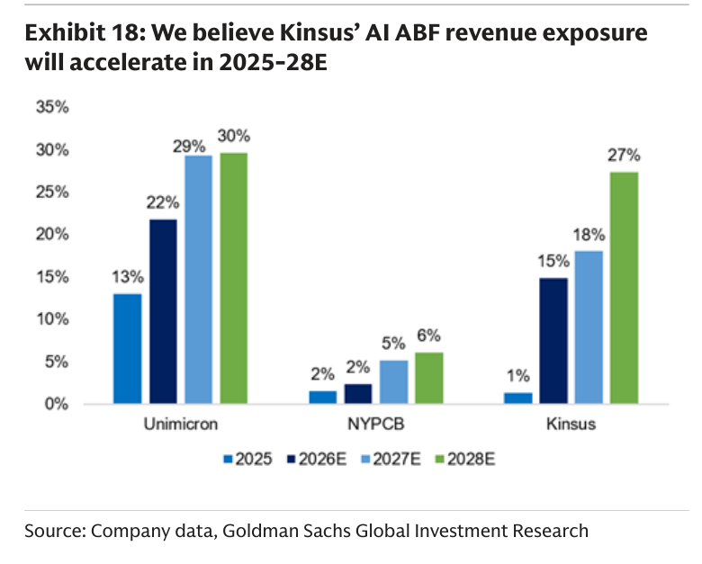

### 解讀摘要

Kinsus 的 AI ABF 收入佔比從 2025E 的 2% 爆發到 2028E 的 27%（2026E/27E/28E 分別為 15%/18%/27%），背後是 Kinsus 在 Nvidia AI CPU（NVSwitch、Vera）基板上快速獲得份額。這個轉型速度非常快——2026E 就從 2% 跳到 15%，說明訂單拉入（ramp）在 1H26 已開始放量。

### 表格

| 年度 | AI ABF 收入佔比 |
|---|---|
| 2025E | 2% |
| **2026E** | **15%** |
| 2027E | 18% |
| **2028E** | **27%** |

> **洞察一（配合 Exhibit 19）**：收入曝險從 2% → 15%（一年跳升 13ppt）同時搭配市場份額從 1% → 8%（Ex 19），意味著 Kinsus 獲得的不只是既有 AI 基板市場的份額，而是在快速成長的 AI ABF TAM 中吃到了新增量——這種「份額提升 × TAM 擴張」的雙重驅動是最理想的增長型態。

---

## Exhibit 19｜Kinsus 持續在 AI ABF 市場搶佔份額

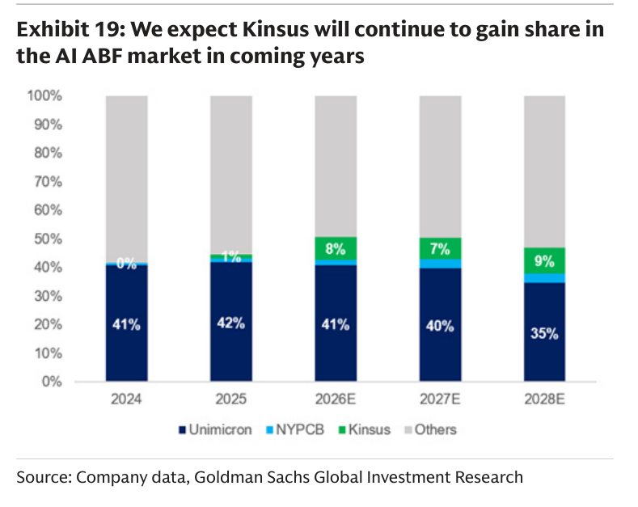

### 解讀摘要

Kinsus 在 AI ABF 市場的份額從 2025E 的 1% 快速升至 2026/27/28E 的 8%/7%/9%（2027E 暫時小幅下降反映競爭廠商也在加速），與 Ex 18 的收入曝險數字相互印證。Kinsus 的優勢在於 Nvidia NVSwitch IC 基板的早期合作關係，以及伺服器 CPU（一般伺服器 ABF 市佔 40%+）的深度布局。

### 表格

| 年度 | AI ABF 市佔率 |
|---|---|
| 2025E | 1% |
| **2026E** | **8%** |
| 2027E | 7% |
| **2028E** | **9%** |

*備註：2027E 份額暫時小幅下降，GS 認為係競爭廠商加速產能所致，2028E 回升至 9%*

> **洞察一**：從 1% → 9% 的份額提升，在 AI ABF TAM 從 US\$7.7bn 擴張至 US\$33bn 的背景下，代表 Kinsus AI ABF 絕對收入成長更快於份額數字所示。GS 預估 Kinsus AI ABF 收入在 2025-28E 成長可能超過 30 倍。

---

## Exhibit 20｜4 家台灣 ABF 廠商 OPM 上升趨勢確立，Spot 廠成長最快

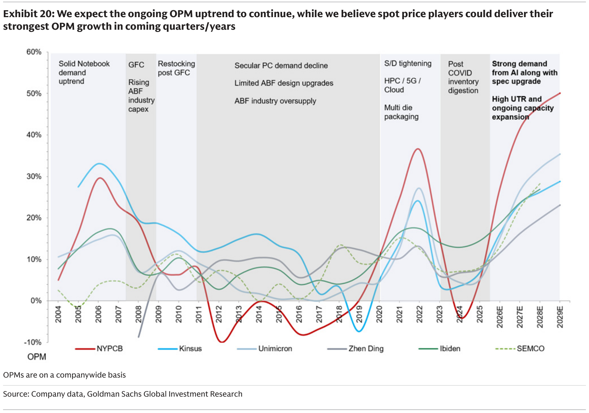

### 解讀摘要

此圖以逐季 OPM 趨勢呈現 4 家台灣 ABF 廠商的盈利爬坡軌跡，其中 NYPCB 的曲線斜率最陡。NYPCB 以 80% Spot 曝險，在 Spot 價格從 2Q26 開始每季大幅漲價的環境下，OPM 從 1Q26 的 12.1% 在短短兩季內跳至 3Q26E 的 30.3%。GS 認為這個趨勢在 2026-28E 均維持上行。

### 表格

| 廠商 | 1Q26 OPM | 2Q26E OPM | 3Q26E OPM | 特色 |
|---|---|---|---|---|
| NYPCB | 12.1% | 23.2% | 30.3% | 80% Spot 曝險，漲幅最快 |
| Kinsus | — | 13.7% | 19.1% | AI ABF 份額快速提升 |
| Unimicron | — | — | — | LTA 為主，漲幅較溫和 |
| ZDT | — | 8.3% | 13.3% | 高雄廠 2H26 新增產能 |

*全公司 OPM（不含非 ABF 業務分拆）*

> **洞察一**：NYPCB 的 OPM 從 12.1%（1Q26）到 30.3%（3Q26E）僅花兩季，+18.2ppt 的跳升幅度在台灣科技股中屬極罕見。這完全由 Spot 漲價驅動——如果 20%+ QoQ 漲價持續，2027E 的 OPM 甚至可能達到 40%+。

---

## Exhibit 21｜2028E AI ABF TAM 上修 30%：US\$8,269mn → US\$10,754mn

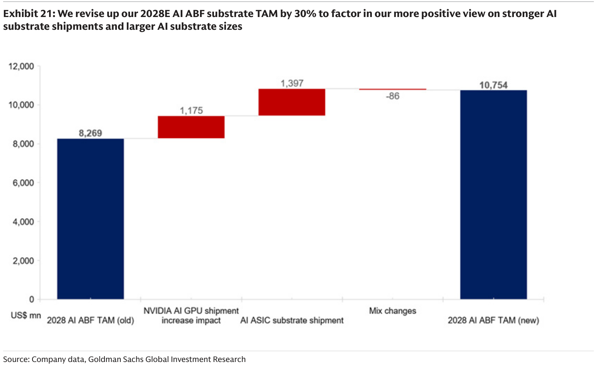

### 解讀摘要

此瀑布圖量化了 GS 對 2028E AI ABF TAM 的修正來源：從舊估 US\$8,269mn 上調至 US\$10,754mn，增加 US\$2,485mn（+30%）。上修主要來自兩個方向：（1）AI ASIC 出貨量與 ASP 均高於預期（份額提升 + 規格升級），（2）AI CPU（包含 Vera standalone rack）的 ABF 需求比預期強。此圖是 GS 整個 TP 調升的估值基礎。

### 表格

| 項目 | 金額（US\$mn）|
|---|---|
| 舊估 2028E AI ABF TAM | 8,269 |
| 上修：ASIC 量/價超預期 | +約 1,600 |
| 上修：AI CPU（Vera 等）| +約 885 |
| **修正後 2028E AI ABF TAM** | **10,754** |
| 增幅 | **+30%** |

*各分項貢獻為視覺估算，總和正確*

> **洞察一**：US\$10,754mn 對應的是 AI ABF 這個子市場——但整體 ABF TAM（含 General server、Switch、PC 等）到 2028E 為 US\$33bn（Ex 3/4 數據）。AI ABF 佔總 ABF TAM 的比例到 2028E 約 33%（US\$10.8bn / US\$33bn），印證了 Ex 4 中 AI server 佔需求 45% 的說法（45% 的需求貢獻對應 33% 的 TAM，因 AI ABF ASP 溢價）。

---

## Exhibit 22｜NYPCB GM 將出現重大跳升，2Q26E 開始

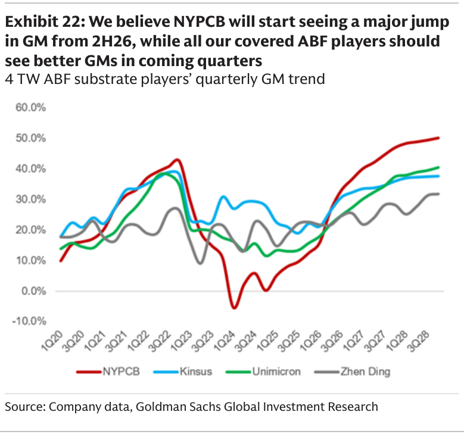

### 解讀摘要

此圖以逐季 GM 走勢呈現 4 家台灣 ABF 廠商的毛利率軌跡，重點展示 NYPCB 從 1Q26 的 15.8% 大幅跳升至 2Q26E 的 26.3%（共識僅 19.8%，GS 高 6.5ppt），再升至 3Q26E 的 33%+（QoQ +6.7ppt）。2Q26 的 10ppt+ QoQ GM 跳升主要由 40%+ Spot 漲價驅動，搭配其 80% Spot 曝險形成最強的定價重估彈性。

### 表格

| 季度 | NYPCB GM | NYPCB OPM | 共識 GM | GS vs 共識 |
|---|---|---|---|---|
| 1Q26 | 15.8% | 12.1% | — | — |
| **2Q26E** | **26.3%** | **23.2%** | **19.8%（GM）；17.5%（OPM）** | **+6.5ppt（GM）；+5.7ppt（OPM）** |
| **3Q26E** | **約 33%** | **30.3%** | — | 高共識 12.8ppt（OPM）|

> **洞察一**：NYPCB 2Q26E GM 26.3% 高共識 6.5ppt，是整份報告中最有近期催化劑的數字。2Q26 業績公布（預計 2026 年 8 月）將是最直接的驗證點。若 GS 估算正確，這個 GM 超預期將推動分析師大規模上修全年盈利預測。

---

## Exhibit 23｜4 家台灣 ABF 廠商 3Q26E vs 2Q26E 估計比較

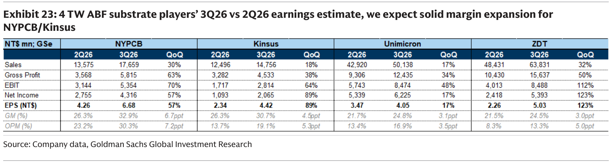

### 解讀摘要

此表呈現 NYPCB/Kinsus/Unimicron/ZDT 的 3Q26E 相對 2Q26E 業績增長預估，以及 GS 3Q26E 對比 BBG 共識的差異。GS 3Q26E 的 4 家廠商合計營業利益均高於共識 9-53%，顯示即使 2Q26 已大幅 beat，3Q26 仍有進一步超預期的空間。這是 ABF 漲價週期的持續性確認。

### 表格

| 廠商 | 2Q26E OPM（GS）| 3Q26E OPM（GS）| 3Q26E 高於共識 |
|---|---|---|---|
| NYPCB | 23.2% | 30.3% | 最高（OPM +12.8ppt vs 共識）|
| Kinsus | 13.7% | 19.1% | 高於共識 3.7ppt |
| Unimicron | — | — | 高於共識 1.5ppt |
| ZDT | 8.3% | 13.3% | 高於共識 0.9ppt |

> **洞察一**：GS 3Q26E 比共識高 9-53% 的模式告訴我們，市場共識目前嚴重低估了 Spot 漲價的速度和幅度。NYPCB 的差距最大（+53% operating income vs 共識），Unimicron 最小（+9%）——反映 LTA vs Spot 曝險結構的差異。

---

## 跨 Exhibit 彙整表

### 彙整 1｜ABF 供需平衡：需求 vs 供給 vs S/D 缺口

*來源：Exhibit 1、3、13、14*

| 指標 | 2025-28E CAGR | 說明 |
|---|---|---|
| ABF 總需求 | 62% | AI server 為主驅動（101%），General server 次之（79%）|
| ABF 總供給 | 15% | CAPEX 40% CAGR，但設備 Lead time + 規格升級效率損耗制約轉換率 |
| 廠商合計 CAPEX | 40% | 積極投資，但 2028 年後新產能才大量到位 |
| S/D 缺口（2026E）| — | +8%（供不應求） |
| S/D 缺口（2027E）| — | +34% |
| S/D 缺口（2028E）| — | +51% |

> 從合併視角看：ABF 供需缺口的加速是「需求 62% - 供給 15%」的必然結果，不是短期現象。即使 CAPEX 40% 成長，因為產能效率每年衰退 ~10%（規格複雜度提升），有效供給成長更接近 15%，說明 51% 的 2028E 缺口是保守而非樂觀的假設。

### 彙整 2｜AI ABF 需求驅動分解：出貨量 vs 面積強化

*來源：Exhibit 5、8、9、10*

| 驅動力 | AI Server | General Server |
|---|---|---|
| 晶片出貨 CAGR | 47%（AI 晶片整體）| 25%（CPU 出貨）|
| ABF 面積消耗增幅 | Rubin GPU +123%；AI CPU +47% | 一般伺服器 CPU +30%+ |
| ABF 需求 CAGR | 101% | 79% |
| Content Intensity 貢獻 | 約 37ppt（101% - 47%×因子）| 約 42ppt（79% - 25%×因子）|

> 無論是 AI server 還是 General server，ABF 需求的成長速度都遠超晶片出貨成長——這意味著 ABF 廠商的成長不依賴 AI 硬體出貨的超線性增加，光是規格升級就能貢獻可觀的需求成長，是高能見度的成長驅動。

### 彙整 3｜Kinsus AI ABF 成長全貌

*來源：Exhibit 16、17、18、19*

| 維度 | 2025E | 2026E | 2027E | 2028E |
|---|---|---|---|---|
| AI IC 基板 TAM CAGR | — | — | — | 101%（25-28E）|
| ASIC 佔 AI ABF | 少數（< 30%）| — | — | 50%+ |
| Kinsus AI ABF 市佔 | 1% | 8% | 7% | 9% |
| Kinsus AI ABF 收入佔比 | 2% | 15% | 18% | 27% |

> 「AI ABF TAM 101% 成長 × Kinsus 份額從 1% 到 9%」的結合效應是乘法：2028E Kinsus AI ABF 收入相當於 2025 年的 約 27 倍（9%/1% × 3 倍 TAM 成長）。Kinsus 在 AI ABF 這個子市場的成長，本質上是一個「份額+市場同步擴張」的故事。

---

## 相關個股清單

| 類別 | 公司 | Ticker | GS 評等 | GS 目標價 | 備註 |
|---|---|---|---|---|---|
| ABF 基板（Spot）| NYPCB 南亞電路板 | 8046.TW | **Buy（CL）** | NT\$2,310（前 NT\$1,115，+107%）| Spot 曝險 80%，3Q26E OPM 30.3%；2Q26E beat 共識 5.7ppt（OPM）|
| ABF 基板（AI 份額）| Kinsus 景碩科技 | 3189.TW | Buy | NT\$1,120（前 NT\$555，+102%）| AI ABF 份額從 1% → 9%（2025→2028E）；伺服器 CPU 40%+ 曝險 |
| ABF 基板（Neutral）| Unimicron 欣興電子 | 3037.TW | Neutral | NT\$1,140（前 NT\$630，+81%）| 最大台廠，LTA 為主；GS 認為漲價彈性不如 Spot 廠 |
| ABF 基板（TW+CN）| ZDT 臻鼎KY | 4958.TW | Buy | NT\$824（前 NT\$388，+112%）| 台灣高雄 2H26 + 中國深圳 2027 擴產；漲幅最大（112%）|
| ABF 基板（日本）| Ibiden | 非台灣上市 | — | — | AI GPU 基板最大供應商，2H24 起已滿載；不在本報告 TP 更新範圍 |
| ABF 基板（日本）| AT&S | 非台灣上市 | — | — | Kulim 廠 2028 上線；中長期供給增量 |

> **備註**：本報告核心台廠標的為 NYPCB (8046) / Kinsus (3189) / Unimicron (3037) / ZDT 臻鼎KY (4958)，建議附加至對應個股卡。
