# BofA Securities｜All Ring 萬潤首次覆蓋 — 搭上先進封裝擴產浪潮

**券商**：BofA Securities（Merrill Lynch Taiwan）  
**分析師**：Haas Liu、Cathy Hsu、Mike Yang  
**日期**：2026-07-13  
**主題**：All Ring 萬潤（6187）首次評等——先進封裝設備的全線解決方案供應商  
**評級**：BUY｜PO NT\$1,500（36x 2027E P/E，歷史區間 8-41x）  
<a href="https://layx.uk/dl?t=6187&b=BofA&d=20260713">📎 下載 PDF</a>

---

## 報告總結

BofA 首次以 BUY 評等覆蓋萬潤（6187），目標價 NT\$1,500。報告撰寫觸媒為：股價因 CPO 延遲疑慮回落至 NT\$1,050，使估值壓縮至 40x/25x 2026/27E P/E，低於同業均值 42x/26x，BofA 認為市場誤讀了 CPO 延遲的衝擊（Advanced packaging 主業未受影響），創造進場時機。

核心結論：後端封裝業 capex 2026E +60% YoY 至 US\$24bn 代表結構性而非週期性擴張，萬潤在 CoWoS 點膠/TIM 設備具市場主導地位（NT\$130mn/k WPM content），2026-28E Sales/EPS CAGR 34%/42%；CPO 設備從 2026E 2% 銷售佔比激增至 2028E 42%，形成第二成長引擎，使 EPS CAGR 有上行空間超越大盤。

---

## BofA 完整投資邏輯鏈

| 論點層次 | Exhibit | 內容 |
|---|---|---|
| 產業瓶頸確認 | Ex1 | 後端封裝 capex 2026E US\$24bn（+60% YoY），capital intensity 升至 25-30% vs 歷史均值 15-20%，TSMC back-end capex +100% YoY 佔行業 31% |
| 需求結構 | Ex2 | CoWoS demand 2026-28E CAGR 52%，需求方多元化（Nvidia/AMD/Google/Amazon 等），抵抗單一客戶風險 |
| 萬潤設備壁壘 | Ex7、Ex12 | 全線設備（Underfill → AOI → Heat Sink → CPO coupling）與 TSMC 共同開發配方，客戶切換成本高，FoCoS/CoPoS 採用路徑已確立 |
| 內容升值 | Ex30 | CoWoS NT\$130mn/k WPM，CoPoS 同等；2026-28E Advanced packaging revenue CAGR 35%（NT\$8.8bn→NT\$15.9bn） |
| 第二成長引擎 | Ex35、Ex36 | CPO OE wafer demand 2026-30E CAGR +3,800%，萬潤 CPO 設備 2027E NT\$4bn（29% 銷售）→ 2028E NT\$5.9bn（42%） |
| 財務驗證 | Ex5 | GM 51-53%，OpM 從 2026E 29% 擴大至 2028E 34%；EPS 2026E/27E/28E NT\$26.46/41.82/53.34 |
| **結論** | 報告封面 | **現價 40x/25x 2026/27E P/E 低於同業均值（42x/26x），市場因 CPO 疑慮創造買點；PO NT\$1,500（36x 2027E P/E），上漲空間 +43%** |

> **報告最大邏輯缺口**：CPO 商業化時程高度依賴大客戶設備認證節奏，若認證延後超過兩季，2027E CPO revenue 佔比 29% 的假設面臨下調風險。但 Advanced packaging 主業可作為業績下限支撐。

---

## 報告核心觀點

| 主題 | BofA 觀點 | 市場共識 | 是否 Contra-Consensus |
|---|---|---|---|
| 後端 capex 週期 | 2026E +60% YoY；結構性擴張非周期頂點 | 擔心 AI capex 放緩後拉回 | 是，BofA 更樂觀 |
| CPO 商業化時程 | 2027 初始、2028 大規模；延遲已充分反映股價 | 擔心 CPO 再延遲衝擊業績 | 是，BofA 認為買點出現 |
| 萬潤 GM 韌性 | Advanced packaging GM 54-55%，asset-light 驅動 OpM 擴張 | 擔心競爭壓價 | 是，配方壁壘難以複製 |
| 估值合理性 | 36x 2027E 為歷史區間高端（8-41x）合理目標 | 高位難以再上 | 是，BofA 認為 42% EPS CAGR 支撐高估值 |

**偏好排序**：CoWoS（立即貢獻）> FoCoS（2026-27 快速成長）> CPO（2027-28 激增）> CoPoS（2028 認證催化劑）  
**個股偏好**：萬潤（6187）BUY；GPTC（3131）BUY

---

## Exhibit 1｜Semiconductor back-end sales & capex 趨勢

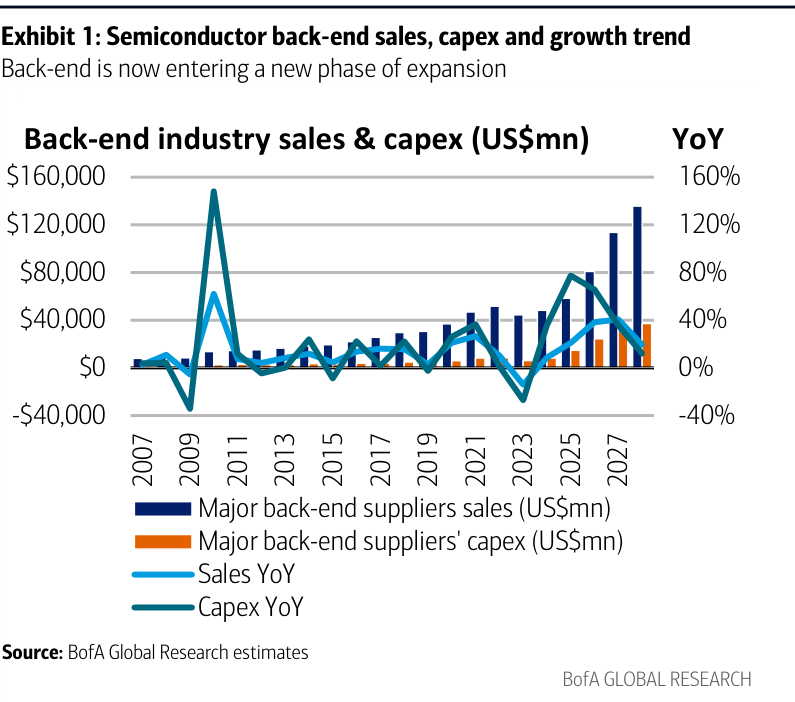

### 解讀摘要
後端封裝業自 2023 年起扭轉歷史每 1-2 年就修正一次的 capex 週期——2024/25/26E 分別 +36%/+77%/+60% YoY，capital intensity 從 15-20% 升至 25-30%，這是結構性轉變而非週期峰值。核心驅動力是 AI chipset 大尺寸封裝帶來的設備 content 升級，使設備採購不再單純跟隨出貨量，而是隨封裝技術複雜度同步增長。TSMC 2026E back-end capex +100% YoY，佔行業 31%（vs 2025 年 24%），是最重要的單一驅動力。

### 表格

| 指標 | 2024A | 2025A | 2026E | 2027E | 2028E |
|---|---|---|---|---|---|
| Capex YoY | +36% | +77% | +60% | +40% | +40% |
| Industry capex（US\$bn） | 11 | 15 | 24 | —  | — |
| Capital intensity | 20% | 25% | 28% | 28% | 30% |

*2027/28 capex 絕對值視覺估算

> **洞察一**：BofA 估 TSMC back-end capex 2026E +100% YoY，ASE、Amkor 同步加速，且 TSMC 持續外包 CoWoS 給 ASE——這代表萬潤的客戶群（ASE 44%、TSMC 11%）雙雙進入資本支出加速期，業績能見度高。

---

## Exhibit 2｜Industry CoWoS demand（分客戶）

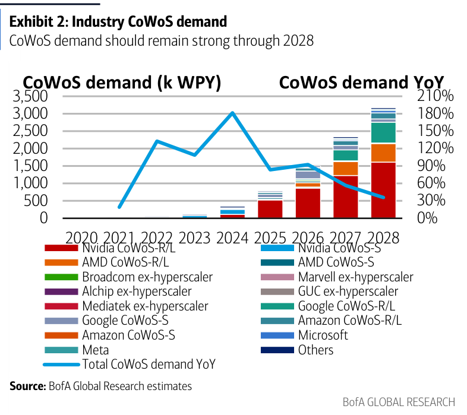

### 解讀摘要
CoWoS 年化需求從 2024A 約 500k WPY 成長至 2028E 約 3,000k WPY（CAGR 约 57%），需求方已從 Nvidia 主導演變為多元化——Google/Amazon/Microsoft/Meta hyperscalers 各自拉貨 CoWoS，加上 AMD、Broadcom、Marvell 等 ASIC 設計公司，任一客戶放緩不致引發系統性需求崩跌。CoWoS-R/L（更大封裝，更多 dispense content）份額持續提升。

### 表格

| 年份 | CoWoS demand（k WPY）| YoY |
|---|---|---|
| 2020 | 約 50 | — |
| 2022 | 約 100 | — |
| 2024 | 約 500 | — |
| 2025 | 約 800 | +60% |
| 2026E | 約 1,500 | +88% |
| 2027E | 約 2,300 | +53% |
| 2028E | 約 3,000 | +30% |

*視覺估算（CoWoS demand YoY% 來自圖表文字層）

> **洞察一**：CoWoS 需求 2027E 仍 +53% YoY，即便基數已大幅墊高，顯示 AI 資本支出擴張的持續性。這支撐 BofA 2027E Advanced packaging revenue NT\$11.6bn 的估算。

---

## Exhibit 3｜All Ring blended content vs. packaging capacity mix

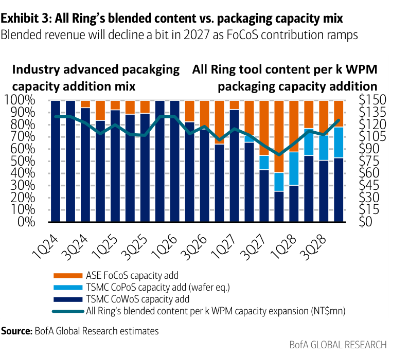

### 解讀摘要
萬潤混合 content（NT\$mn/k WPM）在 2027 年出現短暫稀釋，原因是 FoCoS（ASE 的 CoWoS-like 技術）佔新增產能比例提升，而 FoCoS content 較 TSMC CoWoS 低（約 NT\$80mn vs NT\$130mn）。但這不是業務流失，是業務組合暫時稀釋——2028 年 CoPoS 通過 TSMC 認證後，content 應回升至 CoWoS 水準（CoPoS NT\$130mn/k WPM 等值）。

### 表格

| 年份 | 主要新增產能類型 | Content 趨勢 |
|---|---|---|
| 2025 | TSMC CoWoS 主導 | 高（約 NT\$130mn） |
| 2026E | TSMC CoWoS 主導，FoCoS 開始加速 | 維持高位 |
| 2027E | FoCoS 佔比明顯提升 | 下降（稀釋） |
| 2028E | CoPoS 加入，FoCoS 持平 | 回升 |

---

## Exhibit 4｜All Ring revenue by technologies

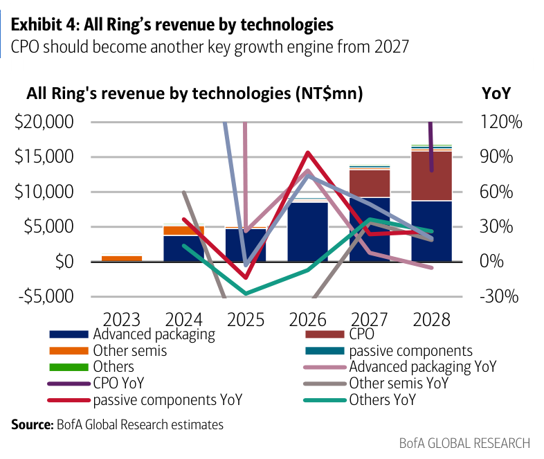

### 解讀摘要
CPO 是報告最具爆發力的投資主題：從 2026E NT\$186mn（佔銷售 2%）跳升至 2027E NT\$4,000mn（29%）再至 2028E NT\$5,900mn（42%）。Advanced packaging 仍是絕對主力（2026-28E 維持 NT\$8.8-16bn），CPO 是純增量的第二引擎，而非替代既有業務——因此即使 CPO 延遲，EPS CAGR 的下限由 Advanced packaging 保障。

### 表格

| 年份 | Advanced packaging（NT\$mn）| CPO（NT\$mn）| 其他（NT\$mn）| Total（NT\$mn）|
|---|---|---|---|---|
| 2024A | 約 1,800 | 0 | 3,735 | 5,535 |
| 2025A | 約 3,100 | 約 50 | 2,216 | 5,366 |
| 2026E | 8,800 | 186 | 347 | 9,333 |
| 2027E | 約 9,600 | 4,000 | 368 | 13,968 |
| 2028E | 約 9,800 | 5,900 | 1,109 | 16,809 |

*Advanced packaging 2027/28E 及其他欄視覺估算；CPO 值由 29%/42% 佔比推算

> **洞察一**：CPO 設備每台 ASP 遠高於 dispensing/TIM 設備，這是 CPO 佔比能快速從 2% 升至 42% 的原因——不需要大量台數，高單價設備即可快速拉高 revenue 佔比，同時維持較高的 GM（CPO coupling 技術壁壘高）。

---

## Exhibit 5｜All Ring quarterly revenue & GMs/OpMs

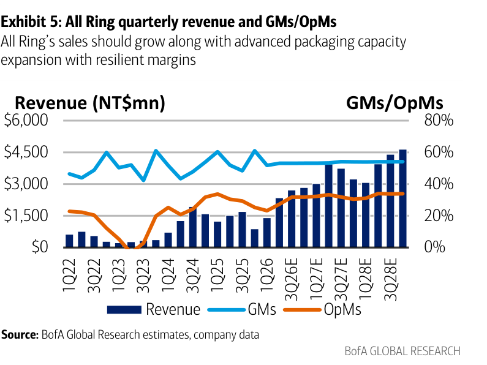

### 解讀摘要
1Q26 revenue NT\$1,411mn 為季節性低點（春節+客戶設備驗收節奏），但 2Q26E 起重啟加速——BofA 估 2Q26E NT\$2,355mn（+67% QoQ），領先 Street 13%。GM 維持 51-53% 走廊，OpM 從 1Q26 低谷 23.2% 逐步恢復，反映固定費用攤薄效果。BofA 對 4Q26E 最樂觀（NT\$2,844mn vs Street NT\$2,362mn，+20%），分歧來自 CPO 初始出貨節奏認定。

### 表格

| 季度 | Revenue（NT\$mn）| GM | OpM | BofA vs Street |
|---|---|---|---|---|
| 1Q26A | 1,411 | 51.8% | 23.2% | — |
| 2Q26E | 2,355 | 53.1% | 27.3% | BofA +13% |
| 3Q26E | 2,723 | 53.1% | 31.8% | BofA +6% |
| 4Q26E | 2,844 | 53.2% | 31.8% | BofA +20% |

> **洞察一**：4Q26E BofA vs Street +20% 的差距是此報告最大的「可驗證關鍵假設」——若 CPO 設備出貨如期在 2H26 啟動，BofA 估值成立；若延至 2027Q1，4Q26 應更接近 Street 估值。這也是市場觀察萬潤的最重要短期催化劑。

---

## Exhibit 7｜Equipment process flow diagram

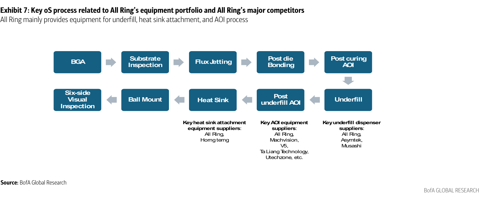

### 解讀摘要
萬潤設備覆蓋 CoWoS 後段關鍵步驟：Underfill dispenser（保護 micro-bumps，填充 interposer 間隙）→ Post underfill AOI（即時良率回饋）→ Heat Sink attachment（熱管理）→ Six-side visual inspection（最終品質把關）。這種全線供應能力讓萬潤能以「完整解決方案」而非「單一設備」進行客戶綁定，提高切換成本，也使每個新專案的 revenue capture 更大。

> **原文補充**：主要競爭對手—— Underfill：Asymtek（美）、Musashi Engineering（日）；Heat Sink：Horng Terng（7751 TT）；AOI：Machvision（3563）、V5（7822）、Ta Liang Technology、Utechzone 等。萬潤的關鍵優勢是與 TSMC 共同開發 CoWoS 點膠配方，後被 ASE 採用形成「TSMC 量產驗證 → ASE 複製擴產」的擴散路徑，建立難以複製的配方資料庫。

---

## Exhibit 10｜Development milestone

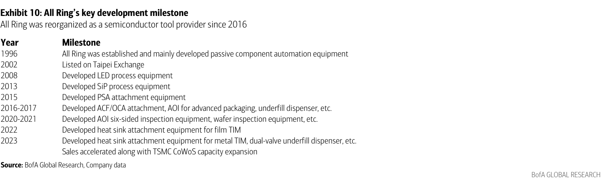

### 解讀摘要
萬潤從 2016 年起有意識地將自身重新定位為半導體封測設備供應商，2022-23 年完成 Metal TIM 和雙閥 underfill dispenser 等 AI CoWoS 核心產品開發，時機與 TSMC CoWoS 2023-24 年加速擴產高度吻合——2024 年銷售 +360% YoY 正是這十年轉型的結果變現。報告以此時程表證明萬潤不是 AI 風口的偶然受益者，而是提前十年布局的市場領先者。

### 表格

| 年份 | 里程碑 |
|---|---|
| 1996 | 成立，主要供應被動元件自動化設備 |
| 2002 | 台灣交易所上市 |
| 2008 | 開發 LED 製程設備 |
| 2013 | 開發 SiP 製程設備 |
| 2015 | 開發 PSA 附著設備 |
| 2016-2017 | 開發 ACF/OCA 附著、AOI（先進封裝）、Underfill dispenser |
| 2020-2021 | 開發 AOI 六面檢測、晶圓檢測設備 |
| 2022 | 開發 Film TIM heat sink 附著設備 |
| 2023 | 開發 Metal TIM heat sink 附著設備、雙閥 underfill dispenser |

---

## Exhibit 12｜All Ring major equipment offerings

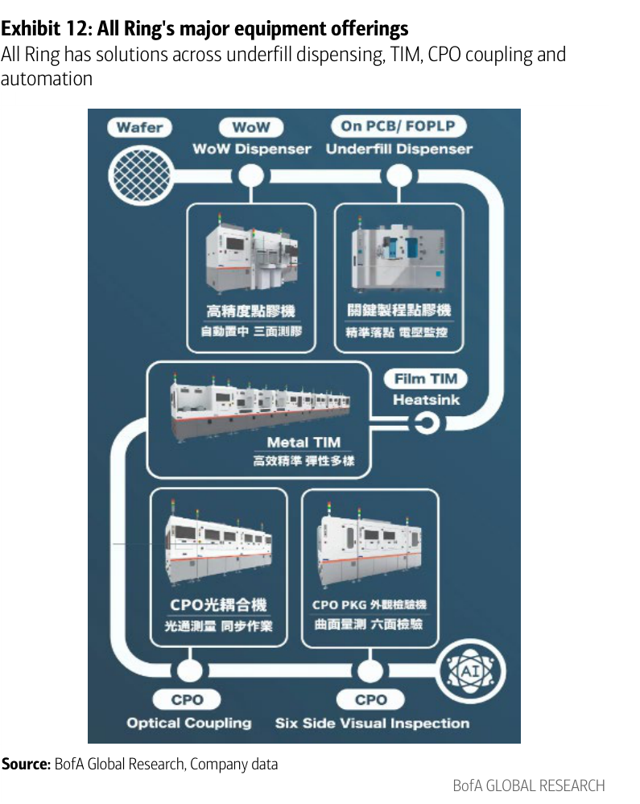

### 解讀摘要
萬潤完整設備組合涵蓋五大類：WoW Dispenser（CoWoS underfill/flux/encapsulation）、Metal/Film TIM（heat sink attachment，micron 級厚度控制）、AOI 六面檢測（20μm 定位精度）、CPO coupling（FAU 六軸對位，5nL 點膠精度）、Precision automation（bonding/lamination/搬運）。重要的是 CPO coupling 整合了現有六軸精密運動、UV 固化、光功率量測等能力，代表萬潤切入 CPO 設備市場的邊際開發成本極低，但進入壁壘對競爭者卻很高。

---

## Exhibit 22｜Industry CoWoS-R/L supply/demand

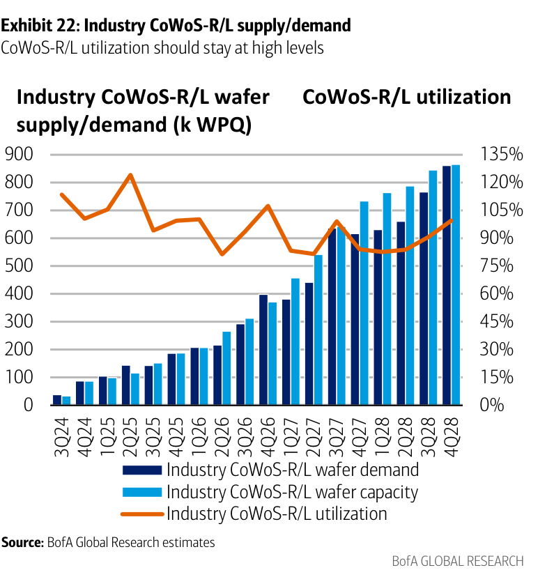

### 解讀摘要
CoWoS-R/L 利用率在 2026Q2 後持續高位（>90%），顯示 TSMC 及 OSAT 的 CoWoS-R/L 產能擴張仍跟不上需求。高利用率直接代表持續的設備採購壓力，因為客戶需要不斷增加設備台數提升 throughput。BofA 估 TSMC CoWoS-R/L 4Q26→4Q27 產能 120k→180k WPM（+50%），加上 ASE FoCoS 35k→75k WPM（+114%），設備採購高峰集中在 2026H2-2027。

### 表格

| 季度 | Supply（k WPQ）| Demand（k WPQ）| Utilization |
|---|---|---|---|
| 3Q24 | 約 80 | 約 75 | 94% |
| 1Q26 | 約 160 | 約 185 | 超 100% |
| 2Q26 | 約 200 | 約 205 | 100% |
| 4Q26E | 約 260 | 約 255 | 98% |
| 4Q27E | 約 420 | 約 400 | 95% |
| 4Q28E | 約 560 | 約 520 | 93% |

*視覺估算

> **洞察一**：整個預測期間 CoWoS-R/L 利用率均 >90%，沒有出現供給過剩跡象——這意味著設備採購週期不會突然中斷，為萬潤 2026-28E 業績提供可見度保障。

---

## Exhibit 25｜3D SoIC technology

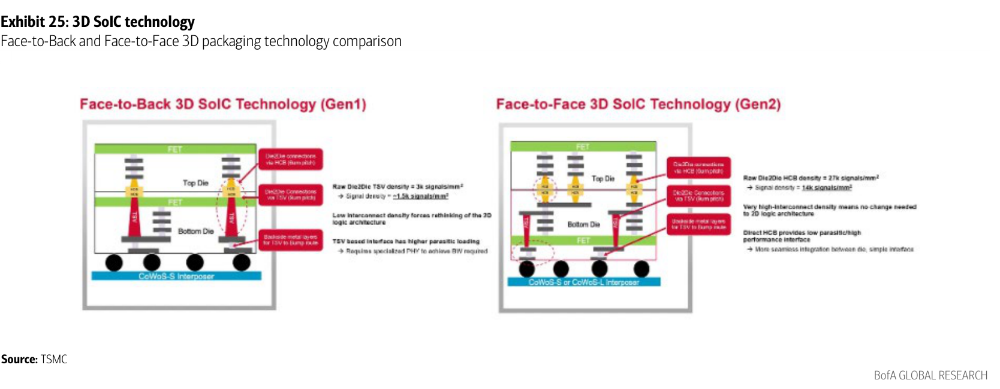

### 解讀摘要
SoIC Face-to-Back（Gen1）vs Face-to-Face（Gen2/SoIC-X）比較顯示：F2F 實現更短互連距離（sub-10μm pitch）和更高頻寬密度，是 AMD Venice（Zen6 + TSMC 2nm + SoIC-X + CoWoS-L）及 Nvidia 2028 年 Feynman GPU 的核心封裝技術。萬潤在 SoIC 流程的 Thermal attach 和 Dispensing 能力均適用，但報告指出 SoIC content 相對低（NT\$10mn/k WPM），主要貢獻仍在 CoWoS/CoPoS。

---

## Exhibit 26｜TSMC SoIC supply/demand trend

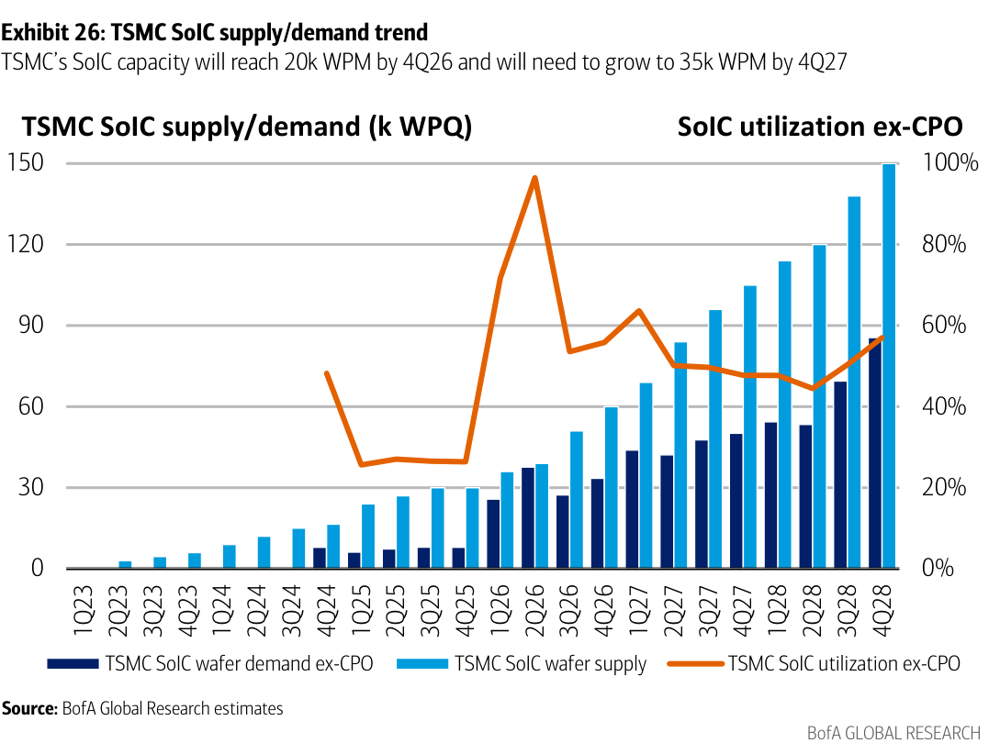

### 解讀摘要
TSMC SoIC 產能 4Q26E 達 20k WPM，需在 4Q27E 擴至 35k WPM（+75%），4Q28E 再到 50k WPM（+43%）；利用率在整個預測期間維持 >80%，代表持續的設備採購需求。SoIC 2027 年因 hyperscaler custom server CPU（Broadcom Monaka、Google 自研 ARM CPU）採用加速，BofA 估 2028 年 SoIC 可貢獻 TSMC 年收入 US\$2,516mn。

### 表格

| 時間 | TSMC SoIC 產能（k WPM）| Utilization（ex-CPO）|
|---|---|---|
| 4Q25 | 約 8 | 約 75% |
| 4Q26E | 20 | 超 90% |
| 4Q27E | 35 | 約 85% |
| 4Q28E | 50 | 約 80% |

*視覺估算

> **洞察一**：SoIC content 僅 NT\$10mn/k WPM vs CoWoS NT\$130mn，但 SoIC 產能增長更陡峭（4Q26→4Q27 +75%），兩者相乘的絕對貢獻仍相對有限。萬潤 SoIC revenue 的真正貢獻時點在 2028E 之後，現階段更多是為未來布局。

---

## Exhibit 30｜All Ring revenue per k capacity addition by technology

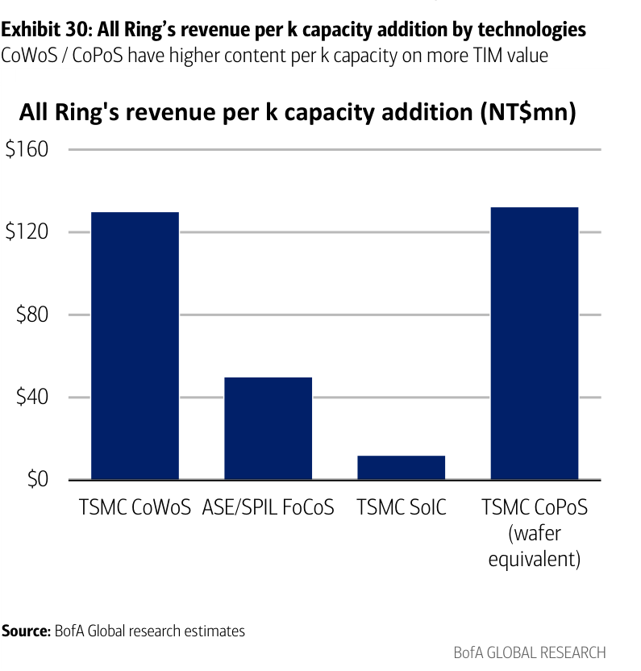

### 解讀摘要
各技術的設備 content 差距懸殊：CoWoS NT\$130mn/k WPM 是核心基準，FoCoS（ASE）較低（流程差異：FoCoS 不需要相同密度的 CoWoS 級別 underfill），SoIC 僅 NT\$10mn（underfill 用量少），CoPoS 對齊 CoWoS 水準（NT\$130mn）。CPO 未列於此圖但 ASP 更高。此 content 差異是 BofA 建構 bottom-up 分析模型的核心輸入假設，直接決定 2026-28E Advanced packaging revenue 估算。

### 表格

| 技術 | Content（NT\$mn/k WPM 或等值）|
|---|---|
| TSMC CoWoS | 130 |
| ASE/SPIL FoCoS | 約 80 |
| TSMC SoIC | 10 |
| TSMC CoPoS（wafer eq.）| 130 |

*FoCoS content 為視覺估算；CoWoS/SoIC/CoPoS 來自原文

> **洞察一**：CoWoS 與 SoIC content 差距 13x，反映 SoIC 的 bonding 精度要求更高但 underfill 用量更少——這意味著 SoIC 的快速擴產不會直接等比例拉動萬潤 revenue，投資人不應將 SoIC 擴產新聞與萬潤業績加速直接連結。

---

## Exhibit 32｜All Ring advanced packaging business trend

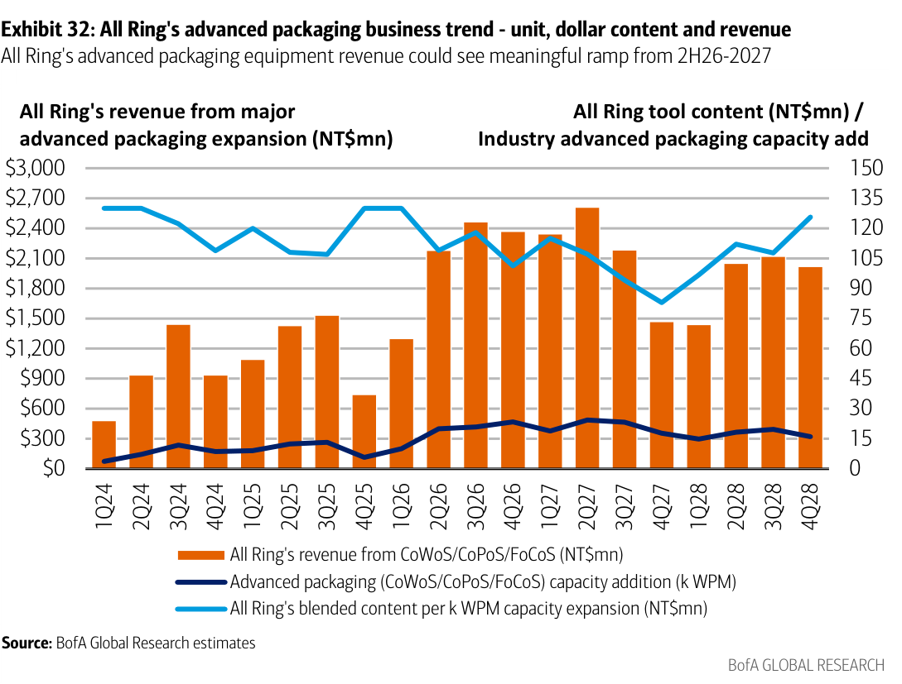

### 解讀摘要
萬潤 Advanced packaging revenue（CoWoS+CoPoS+FoCoS 合計）的單位 content 趨勢與產能加裝呈現出「2026H2-2027 為加速期」的格局——隨著 ASE FoCoS 產能快速爬坡（15 個新廠同步建設）和 TSMC 持續擴產。BofA 預估 Advanced packaging revenue 從 2026E NT\$8.8bn 增至 2028E NT\$15.9bn（35% CAGR），以季度 revenue 走勢呈現加速趨勢清晰可見。

---

## Exhibit 34｜CPO process steps（from ASE）

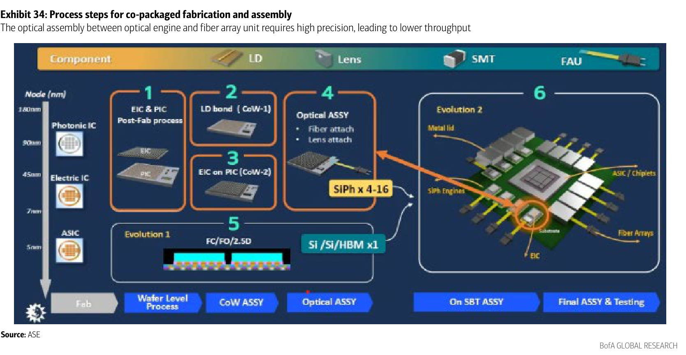

### 解讀摘要
CPO 製程中最高難度步驟是 FAU（Fiber Array Unit）與 Optical Engine 的光學對位，需要六軸運動精度 2.5μm、5nL 點膠精度、UV 固化補償，並在完成後立即做插入損耗量測驗證。這正是萬潤 FAU coupling cell 的核心價值所在——自研六軸臂 + 機器視覺 + 對位演算法 + 點膠 + UV 固化一體化，垂直整合設備堆疊使 cycle time 優化內部可控而非依賴第三方子系統，此設計使競爭對手難以在短期追上。

> **原文補充**：CPO 設備的另一差異化優勢在 Heat Sink attach——OE switch 封裝對溫度和應力敏感，attach force、warpage control 和 bond-line uniformity 要求遠高於傳統 lid attach，萬潤現有 TIM attach 製程知識可直接遷移；CPO content 還包含 Post attach AOI 和 integrated SiPh inspection/test cells，這些都是萬潤既有核心能力的延伸。

---

## Exhibit 35｜CPO networking switch shipment & wafer demand

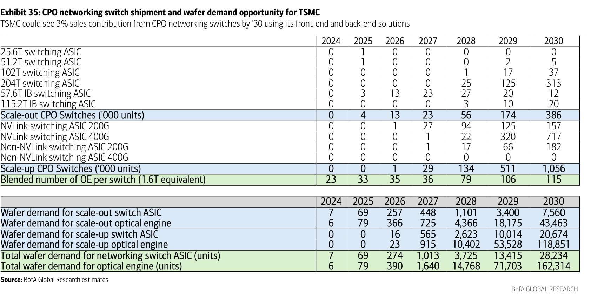

### 解讀摘要
Scale-out（Ethernet backbone）和 Scale-up（NVLink/IB）CPO switch 合計 2026-30E CAGR 219%，至 2030E 達 1,442k units（佔 51.2T+ switch 市場 10%）。光引擎（OE）wafer 需求爆發尤為明顯——從 2026E 390 units 激增至 2030E 162,314 units（40 年 CAGR >3,800%），主要驅動來自 Scale-up（NVLink 400G switch 的 OE 需求 2029E 達 53,528 units vs 2026E 0 units）。

### 表格（Switch shipment，k units）

| 年份 | Scale-out（k units）| Scale-up（k units）| Total OE wafer demand（units）|
|---|---|---|---|
| 2025 | 4 | 0 | 79 |
| 2026E | 13 | 1 | 390 |
| 2027E | 23 | 29 | 1,640 |
| 2028E | 56 | 134 | 14,768 |
| 2029E | 174 | 511 | 71,703 |
| 2030E | 386 | 1,056 | 162,314 |

> **洞察一**：OE wafer demand 2026→2028 成長 38x，Scale-up（NVLink/IB）貢獻遠大於 Scale-out，因 Scale-up switch 中每個 OE 光通道數更多（約 79 個 OE/switch at 1.6T 等值）。這意味著 NVLink 900G/1.6T switch 的 CPO 採用是 2028E OE 需求爆發的最重要催化劑。

> **值得驗證**：2028E 的 OE wafer demand 14,768 units 中約 70% 來自 Scale-up（NVLink 400G）的假設。若 Nvidia NVLink CPO 時程延遲超過兩季，此數字需大幅下修，連帶影響萬潤 2028E CPO revenue 42% 佔比假設。

---

## Exhibit 36｜All Ring CPO sales & industry OE demand

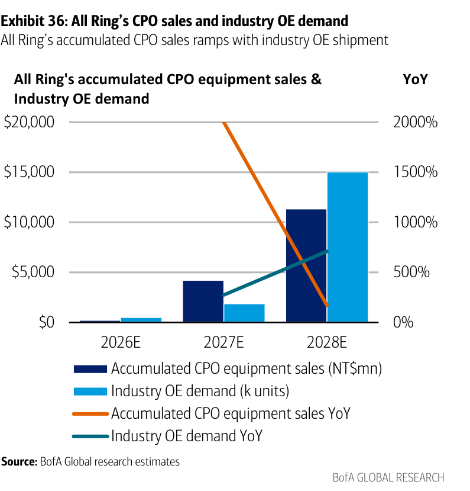

### 解讀摘要
萬潤 CPO 設備 accumulated sales 與 OE 需求走勢同步攀升：2026E NT\$186mn → 2027E NT\$4,000mn（+2,050% YoY）→ 2028E NT\$5,900mn（+48% YoY）。BofA 認為萬潤在 CPO 光耦合設備佔有重要市場份額，因為 FAU 對位是全台灣僅少數供應商具備商用資格的利基市場，高進入壁壘形成定價能力。

### 表格

| 年份 | CPO equipment sales（NT\$mn）| OE demand（k units）| CPO 佔總銷售 |
|---|---|---|---|
| 2026E | 186 | 不足 1 | 2% |
| 2027E | 4,000 | 約 1.6 | 29% |
| 2028E | 5,900 | 約 14.8 | 42% |

> **洞察一（配合 Exhibit 35）**：2027E OE demand 僅 1,640 units，但萬潤 CPO 設備 revenue 即達 NT\$4,000mn——換算每台 OE 生產所用設備投資約 NT\$2.4mn（合理，光耦合設備屬高精度儀器，ASP 遠高於傳統 dispensing）。這意味著 CPO 設備市場是「台數少但價值高」的利基，萬潤的高 GM 在此業務應可維持甚至超過 Advanced packaging 水準。

---

## 跨 Exhibit 彙整表

### 彙整 1｜萬潤各技術 content 與 revenue 貢獻對照（2028E）

（來源：Exhibit 4、30、32、36）

| 技術 | Content（NT\$mn/k WPM）| 2028E revenue（NT\$mn）| 2026-28E CAGR |
|---|---|---|---|
| CoWoS+CoPoS | 130 | 約 9,800 | 20%+ |
| FoCoS（ASE）| 約 80 | 約 6,100 | 高速成長 |
| SoIC | 10 | 少量 | — |
| CPO 設備 | 高（per unit ASP 更高）| 5,900 | 激增（99%+/yr） |
| **Total Advanced packaging** | — | **15,900** | **35%** |
| **Total 含 CPO** | — | **16,809** | **34%** |

*FoCoS、CoWoS+CoPoS 2028E revenue 為視覺估算；CPO 值由佔比推算

> 2028E Revenue 分散度大幅改善——CPO 從 0 增至 35%，降低對單一 CoWoS 週期的依賴。這是業務風險降低而非增加，且 Advanced packaging 仍作為業績下限。

---

## 相關個股清單

| 類別 | 公司 | Ticker | 評等 | 備註 |
|---|---|---|---|---|
| **目標股** | All Ring 萬潤 | 6187 TT | BUY | PO NT\$1,500，Advanced packaging+CPO 雙引擎 |
| **同業** | Horng Terng 宏鈞 | 7751 TT | NC | Heat sink 競爭對手 |
| **同業** | MACHVISION | 3563 TT | NC | AOI 競爭對手 |
| **同業** | GPTC | 3131 TT | BUY | Advanced packaging 設備，BofA 另有覆蓋 |
| **客戶** | ASE | 3711 TT | — | 萬潤 44% revenue 來源，FoCoS 擴產主力 |
| **客戶** | TSMC | 2330 TT | — | 萬潤 11% revenue，CoWoS 技術推手 |
| **受益** | BESI | BESI NA | BUY | Hybrid bonding 設備 |
| **受益** | Hanmi Semiconductor | 042700 KS | BUY | HBM bonding 設備 |
