# BofA｜FAU 對位與自動化深度報告

**券商**：BofA Global Research  
**分析師**：Katherine Zhu、Robert Cheng、Doris Kao  
**日期**：2026-07-14  
**主題**：FAU（Fiber Array Unit）在 CPO 供應鏈中的定位、TAM 與競爭壁壘  
**評級**：N/A（產業總覽）  
<a href="https://layx.uk/dl?g=產業&b=BofA&d=20260714&h=FAU-Alignment-Automation">📎 下載 PDF</a>

---

## 報告總結

BofA 深度解析 FAU 供應鏈，核心結論是：FAU 進入門檻遠高於市場認知——微米級對位精度（CPO 要求 ≤±0.3µm）與大規模自動化能力構成雙重壁壘，新進者雖多但能成功者寥寥。有意義的 CPO 量預計在 2028-29 啟動（Nvidia CPO switch 2028E 達 190k units），推動 FAU TAM 從 2026E 的 US\$45mn 爆發至 2030E 的 US\$8bn。

受此邏輯驅動，BofA 升 Largan（3008）至 Buy，認為其進入認證階段的速度領先其他新進者，CPO 業務可望於 2028E 帶動估值重評；Sunny Optical（2382）因缺乏具體 CPO 專案，重申 Neutral。GlassBridge（Corning）短期無法取代 FAU，不構成近期威脅。

---

## BofA 完整投資邏輯鏈

| 論點層次 | Exhibit | 內容 |
|---|---|---|
| CPO 量能確認 | E1 | Nvidia CPO switch 2026/27/28E 僅 14k/52k/190k units，有意義量在 2028-29 |
| FAU 在 BOM 的位置 | E3、E4 | FAU 佔 BOM 5-10%（US\$6-7k/switch），高於 ELS 但遠低於 OE（40-55%） |
| TAM 成長路徑 | E5 | 2028E 以前 TAM 僅百萬美元級，2028→2030 因量爆拉升至 US\$8bn |
| ASP 壓縮路徑 | E6 | dFAU 現行 US\$150-200，量產後降至 US\$100；但通道數升至 70-100ch 提供 content upside |
| 進入門檻量化 | E10 | CPO pitch tolerance ≤±0.3µm，較 Pluggable（±0.5-1.0µm）嚴格 2-3 倍，需精密光學量產 + 自動化 |
| 供應鏈格局 | E7、E8 | FA（V-groove）佔 FAU BOM ~50%；現有 CPO FAU 100% 由中國廠商供應；Largan 列 potential |
| 競爭威脅排除 | E11、E12 | GlassBridge 尚需解決 70+ channel 製造難題，且仍需 fiber array；edge coupling 空間受限 |
| **結論** | 封面 | **升 Largan Buy（CPO 進展最快），Sunny Optical Neutral（缺具體專案）** |

> **報告最大邏輯缺口**：TAM 估算假設 CPO switch 單台含 115 units 1.6T OE 及 FAU ASP 不低於 US\$100，兩個假設任一偏差幅度 >30% 都會大幅影響 2030E TAM（TAM 線性反映 ASP 與 units）。

---

## 報告核心觀點

| 主題 | BofA 觀點 | 市場共識 | 是否 Contra-Consensus |
|---|---|---|---|
| CPO 規模時間點 | 有意義量在 2028-29 | 部分市場看 2027 | 偏保守 |
| FAU 供給競爭 | 進入門檻高，新進者多但贏家少 | 看好眾多廠商切入 | Contra（看少） |
| GlassBridge 威脅 | 短期無法取代 FAU，需解決 70+ ch 瓶頸 | 市場擔憂 FAU 被取代 | Contra（淡化威脅） |
| Largan CPO 進度 | 最快，升 Buy；CPO 2028 帶動重評 | 多數仍觀望 | Bullish |
| Sunny Optical CPO | 缺具體專案，Neutral | N/A | — |

**零件偏好**：FAU > ELS > MPO（依進入門檻與議價力排序）  
**個股偏好**：Largan（光電精密 + CPO 最近進度） > Sunny Optical（觀望）

---

## Exhibit 1｜Nvidia CPO Switch 出貨量預測（2026-2030E）

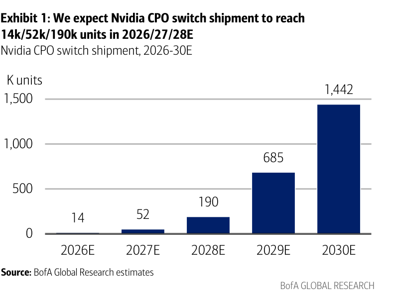

### 解讀摘要

CPO switch 出貨在 2026-27 仍屬試量，2028 才進入量產斜坡：2026/27E 合計僅 66k units，2028E 就跳至 190k，2029-30E 再翻至 685k/1,442k。這條出貨曲線直接決定 FAU TAM 的形狀——2027 年以前 TAM 幾乎為零，2028 開始才有規模，意味現在佈局的廠商必須先撐過 2-3 年低量認證期，才能吃到 2028+ 的大量訂單。

### 表格（年度出貨量）

| 年度 | CPO Switch 出貨（千台） |
|---|---|
| 2026E | 14 |
| 2027E | 52 |
| 2028E | 190 |
| 2029E | 685 |
| 2030E | 1,442 |

> **洞察一**：2027→2028 出貨跳升 3.7 倍，是整個 CPO 週期的關鍵節點；FAU 廠商若無法在 2027 年底前通過認證，就錯過 2028 年的初始量產訂單，而初始供應商通常享有高於量產後的 ASP 溢價。

---

## Exhibit 2｜Nvidia CPO Switch 各元件數量彙整

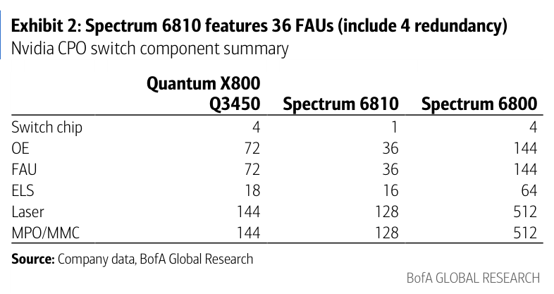

### 解讀摘要

Spectrum 6810 每台含 36 FAU（含 4 備援）與 36 OE，且每顆 FAU 對應一顆 OE，是 FAU 需求的標準設定。相較之下，Q3450 是 Spectrum 6810 的換算基礎，含 72 FAU 但單台 ASP 較低（FAU content US\$6,120，見 E3）。Spectrum 6800 含 144 FAU，代表更大型平台的設定，但目前時間表較 6810 為晚。

> **原文補充**：Spectrum 6810 的 36 FAU 中含 4 顆備援（redundancy），實際運作為 32 通道。這是 FAU 可靠性要求的體現——CPO 在 on-substrate 位置無法像 pluggable 一樣熱插拔，備援設計是 field replacement 的替代方案。

### 表格（每台 switch 元件數量）

| 元件 | Quantum Q3450 | Spectrum 6810 | Spectrum 6800 |
|---|---|---|---|
| Switch chip | 4 | 1 | 4 |
| OE（光引擎） | 72 | 36 | 144 |
| FAU | 72 | 36 | 144 |
| ELS（外部雷射源） | 18 | 16 | 64 |
| Laser | 144 | 128 | 512 |
| MPO/MMC | 144 | 128 | 512 |

> **洞察二**：FAU 與 OE 是 1:1 對應關係（Q3450=72/72，S6810=36/36，S6800=144/144），代表 FAU TAM 直接跟隨 OE 的量與價——任何 OE 設計變更（例如整合多通道進一顆 OE）都會同比例影響 FAU 需求。

---

## Exhibit 3｜Nvidia CPO Switch BOM 分析（US\$）

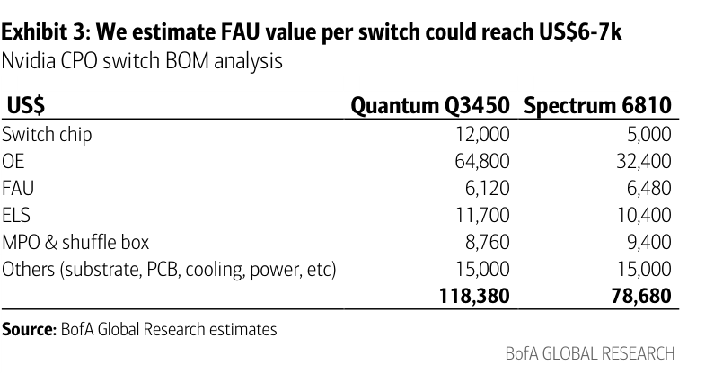

### 解讀摘要

OE 是 CPO switch BOM 的絕對主體（Q3450 佔 55%、S6810 佔 41%），FAU 雖然只佔 5-8%，但絕對金額 US\$6-7k/switch 已相當可觀。更關鍵的是，S6810 的 FAU 含量（US\$6,480）略高於 Q3450（US\$6,120），顯示 Spectrum 平台對 FAU 規格要求更高（36ch dFAU vs Q3450 的 72ch 但 ASP 較低），並非純粹用量多寡的差異。

### 表格（BOM 細項，美元）

| 元件 | Quantum Q3450 | Spectrum 6810 |
|---|---|---|
| Switch chip | \$12,000 | \$5,000 |
| OE | \$64,800 | \$32,400 |
| FAU | \$6,120 | \$6,480 |
| ELS | \$11,700 | \$10,400 |
| MPO & shuffle box | \$8,760 | \$9,400 |
| Others（substrate, PCB, cooling, power） | \$15,000 | \$15,000 |
| **合計** | **\$118,380** | **\$78,680** |

> **洞察三**：S6810 總 BOM（\$78,680）遠低於 Q3450（\$118,380），主要來自 switch chip（-\$7,000）與 OE（-\$32,400）的差異——S6810 換用單一 switch chip 架構，大幅降低整體成本，讓 CPO 在規模化後比 pluggable 更具競爭力。FAU 在兩個平台的 content 相近（相差僅 \$360），對 FAU 廠商而言兩個平台的 ASP 差異有限。

---

## Exhibit 4｜FAU 在 Nvidia CPO Switch BOM 中的佔比

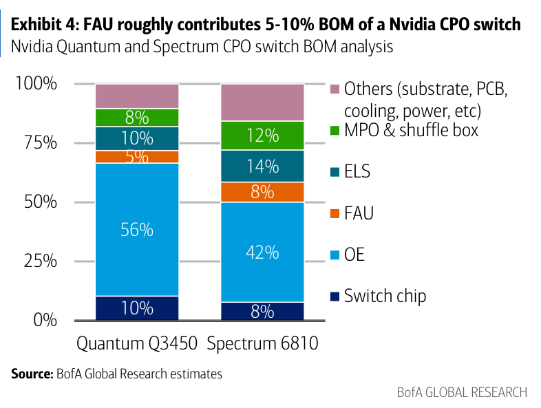

### 解讀摘要

FAU 在 Q3450 佔 BOM 約 5%、在 S6810 佔約 8%，符合「5-10%」的報告結論。OE 是 BOM 最大佔比項（S6810 約 41%），也是 CPO 生態議價力最集中之處；FAU 介於第二梯（ELS、MPO）之上，是精密度門檻最高的元件之一。

### 表格（BOM 佔比，依 E3 數據推算）

| 元件 | Q3450 佔比 | Spectrum 6810 佔比 |
|---|---|---|
| Switch chip | ~10% | ~6% |
| OE | ~55% | ~41% |
| FAU | ~5% | ~8% |
| ELS | ~10% | ~13% |
| MPO & shuffle box | ~7% | ~12% |
| Others | ~13% | ~19% |

*以上佔比依 E3 絕對金額推算，視覺估算，交叉驗證通過（總計 100%）。*

---

## Exhibit 5｜FAU TAM 預測（CPO Switch，2026-2030E）

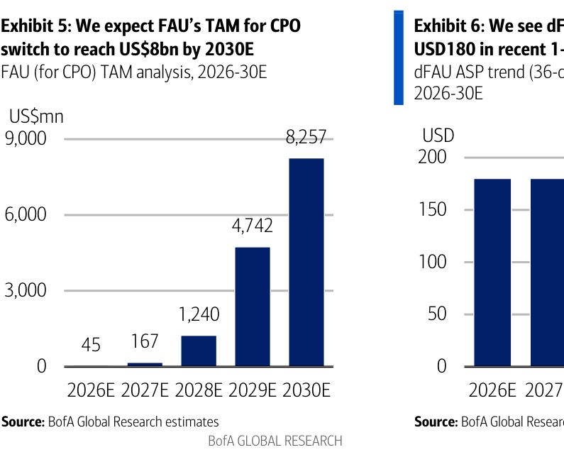

### 解讀摘要

FAU TAM 在 2026-27 僅為百萬美元級（US\$45/167mn），2028 出現第一個爆發式跳升（+US\$1,073mn YoY），2030 達 US\$8,257mn。這條曲線的形狀完全由 E1 的出貨量決定，量的複合成長才是主要驅動——不是 ASP 上漲，而是出貨量從 14k 爆發至 1,442k（CAGR ~217%）。

### 表格（FAU TAM，2026-2030E）

| 年度 | FAU TAM（US\$mn） | YoY 增量 |
|---|---|---|
| 2026E | 45 | — |
| 2027E | 167 | +122 |
| 2028E | 1,240 | +1,073 |
| 2029E | 4,742 | +3,502 |
| 2030E | 8,257 | +3,515 |

> **洞察四**：2028→2029 是 TAM 增量最大的一年（+US\$3.5bn），但此時出貨量仍從 190k→685k（+2.6 倍）；若 ASP 壓縮速度快於預期（如競爭加劇令 dFAU 從 US\$180 提前跌至 US\$80），TAM 可能比 E5 所示低 40-50%。這是本報告最大的估算風險點。

> **值得驗證**：報告假設 2030E CPO switch 1.4mn units × 115 OE/switch，需確認 Nvidia 是否在 2028-29 就引入更大 switch（如 Spectrum 7000/7200 系列），更大平台 FAU 數量不一定等比例增加。

---

## Exhibit 6｜dFAU ASP 趨勢（36 通道，3.2T equivalent，2026-2030E）

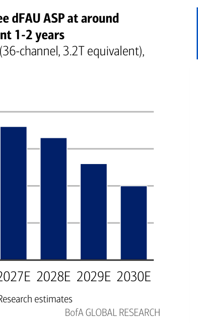

### 解讀摘要

dFAU ASP 從 2026/27E 約 US\$180 逐步下滑，預計 2030E 降至約 US\$100。但這是 36 通道規格的走勢；報告同時指出，若規格升級至 70-100 通道或多層設計，單顆 FAU content 可望反彈，ASP 不必然單向下行。近期 ASP 保持高位（US\$150-200）也反映供給高度集中（目前 100% 中國廠商）。

> **原文補充**：BofA 指出 Spectrum 6810 採用 36ch dFAU，定價 US\$150-200；量產規模化後 ASP 有望降至 US\$100。這段 ASP 路徑隱含：Largan 等新進者需在高 ASP 階段（2026-27）完成認證，才能在量產期（2028+）享受較好的初始定價。

> **洞察五（配合 Exhibit 5）**：若 dFAU ASP 在 2028-29 較 BofA 估算快速壓縮至 US\$100（比 2030 的基準提早 2 年），則 2029E TAM 將從 US\$4.7bn 降至約 US\$2.6bn——約少 45%。ASP 壓縮速度是 TAM 實現最大的不確定因素。

---

## Exhibit 7｜FAU BOM 組成分析（含 micro lens、prism 等）

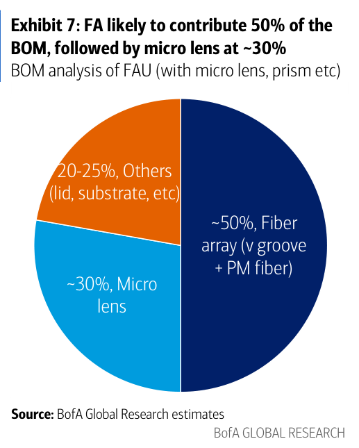

### 解讀摘要

Fiber array（V-groove + PM fiber）佔 FAU BOM 約 50%，是價值最高的子元件；micro lens 佔約 30%，是 Largan 等光學廠商切入的核心競爭場域；其餘 lid、substrate 等佔 20-25%。這個結構說明為何 V-groove 供應商（TFC、Senko 等）掌握 FAU 的主要成本，而整合 micro lens 的 FAU（即 dFAU）具有更高的技術門檻與 ASP。

> **原文補充**：報告提到高端 FAU 整合了 micro lens、prism 和 MT ferrules 等光學元件——這正是 dFAU（detachable FAU）與標準 FAU 的主要差異，也是 ASP 來到 US\$150-200 的原因（標準 FAU 約 US\$80）。

### 表格（FAU BOM 組成，視覺估算）

| 元件 | 佔 BOM 比例 |
|---|---|
| Fiber array（V-groove + PM fiber） | ~50% |
| Micro lens | ~30% |
| Others（lid, substrate 等） | 20-25% |

---

## Exhibit 8｜CPO 供應鏈主要供應商彙整

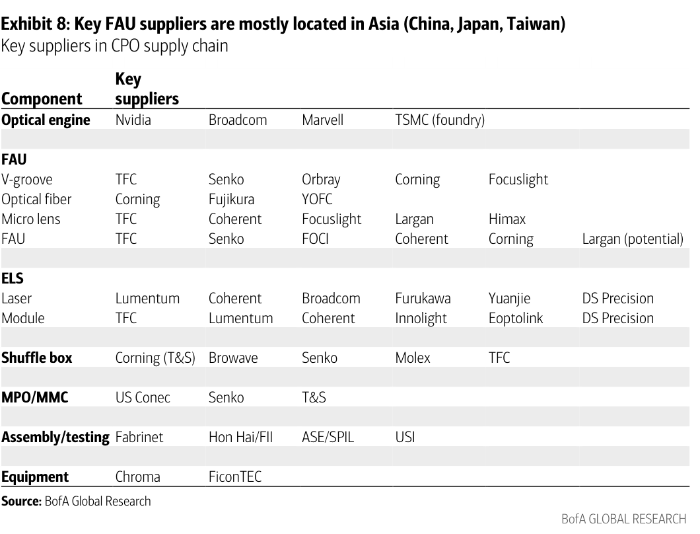

### 解讀摘要

目前 CPO FAU 供給 100% 由亞洲（以中國為主）廠商掌握；台灣廠商在 V-groove、micro lens 和整合 FAU 方面有切入機會，但 Largan 目前仍是「potential」狀態，尚未確認量產訂單。FAU 供應鏈橫跨多個子元件（V-groove、fiber、micro lens），單一廠商垂直整合的難度高，Senko 與 TFC 目前在多個環節同時出現，顯示整合能力優先。

### 表格（CPO 供應鏈供應商）

| 元件 | 主要供應商 |
|---|---|
| 光引擎（OE） | Nvidia、Broadcom、Marvell；TSMC（晶圓代工）|
| V-groove | TFC、Senko、Orbray、Corning、Focuslight |
| 光纖（Optical fiber） | Corning、Fujikura、YOFC |
| Micro lens | TFC、Coherent、Focuslight、**Largan**、Himax |
| FAU（整合） | TFC、Senko、FOCI、Coherent、Corning、**Largan（potential）** |
| 雷射（Laser） | Lumentum、Coherent、Broadcom、Furukawa、Yuanjie、DS Precision |
| ELS Module | TFC、Lumentum、Coherent、Innolight、Eoptolink、DS Precision |
| Shuffle box | Corning (T&S)、Browave、Senko、Molex、TFC |
| MPO/MMC | US Conec、Senko、T&S |
| 組裝/測試 | Fabrinet、Hon Hai/FII、ASE/SPIL、USI |
| 設備 | Chroma、FiconTEC |

> **洞察六**：TFC（日商）在 V-groove、micro lens、FAU 整合、ELS module、shuffle box 五個環節同時出現，是目前 CPO FAU 供應鏈裡垂直整合度最高的廠商；Senko（日商）亦覆蓋 V-groove、FAU 整合、shuffle box 三個環節。台灣廠商目前僅 Largan（micro lens、FAU potential）有機會——且仍是「potential」，而非確認量產。

---

## Exhibit 9｜FAU 結構示意圖（grating coupler 方案）

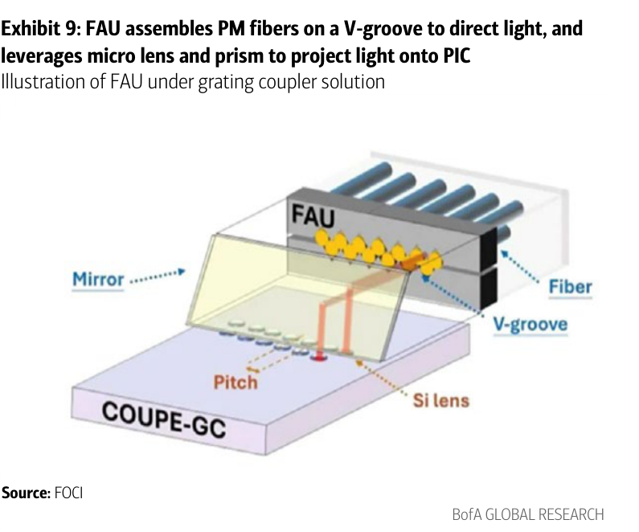

### 解讀摘要

FOCI 的 FAU 示意圖展示 grating coupler（光柵耦合）方案的光路架構：PM fiber 排列在 V-groove 上，搭配 micro lens 將光投射到 PIC 的光柵耦合器上（垂直耦合）。這個架構的優點是 wafer-level testing 可行（見 E12），缺點是耦合效率不如 edge coupling——但 BofA 認為 grating coupling 的自動化測試優勢使其仍是近期 CPO 主流。

---

## Exhibit 10｜FAU 在不同應用的規格比較（Pluggable vs NPO vs CPO）

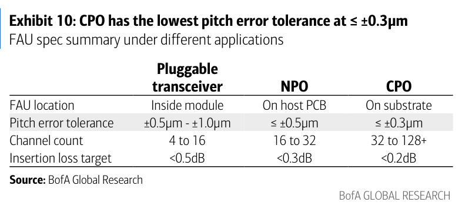

### 解讀摘要

CPO 的 pitch error tolerance（≤±0.3µm）比 pluggable transceiver（±0.5-1.0µm）嚴格 2-3 倍，比 NPO（≤±0.5µm）嚴格 40-67%——這一數字精確量化了 CPO FAU 的進入壁壘。通道數從 Pluggable 的 4-16ch 擴展至 CPO 的 32-128+ch，對齊誤差的線性累積讓問題呈指數難度上升。

### 表格

| 規格項目 | Pluggable Transceiver | NPO | CPO |
|---|---|---|---|
| FAU 位置 | 模組內部 | Host PCB 上 | 基板（substrate）上 |
| Pitch error tolerance | ±0.5µm～±1.0µm | ≤ ±0.5µm | ≤ ±0.3µm |
| 通道數 | 4 to 16 | 16 to 32 | 32 to 128+ |
| Insertion loss 目標 | <0.5dB | <0.3dB | <0.2dB |

> **洞察七**：智慧型手機鏡頭模組的 active alignment（AA）精度約 ≤±5µm，比 CPO FAU 的要求寬鬆 17 倍——Largan 等廠商雖有 AA know-how 可部分遷移，但需要重新建立一套更高精度的對位系統，而非直接套用現有設備。這解釋了為何 BofA 說「know-how 需要多年累積」。

---

## Exhibit 11｜Corning GlassBridge 連接器（wafer-based fiber-to-PIC）

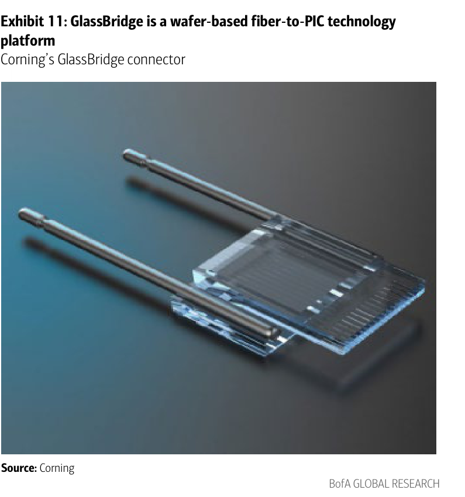

### 解讀摘要

GlassBridge 是 Corning 的 wafer-scale fiber-to-PIC 連接方案，市場擔憂其可能取代 FAU。BofA 判斷這是短期誤解：GlassBridge 仍處早期，無法進入當前及次世代 CPO 設計，原因包括：wafer 表面不平整導致 PIC 對位困難（edge coupling 特性），以及通道數升至 70+ 後製造難度急升。即使 GlassBridge 普及，仍需要 fiber array（只是精度要求略低），FAU 不會歸零。

> **原文補充**：BofA 補充，GlassBridge 採用 edge coupling（水平耦合），相較於 grating coupling 雖有插入損耗優勢，但無法進行 wafer-level testing（見 E12），且水平設計有空間限制，在 70+ 通道時製造難度非線性上升。這些特性讓 GlassBridge 短期難以進入量產 CPO 設計。

---

## Exhibit 12｜Grating Coupling vs Edge Coupling 比較

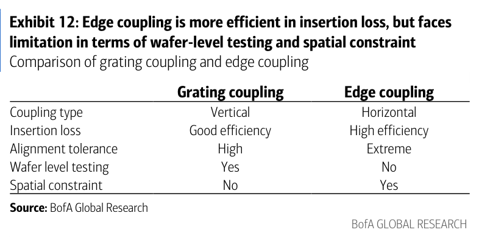

### 解讀摘要

Grating coupling（FAU 現行主流）的最大優勢是支持 wafer-level testing，可在晶圓階段篩選不良品，大幅提升製程良率和成本控制；edge coupling 雖插入損耗更低，但無法 wafer testing、且空間限制嚴重。這個比較直接解釋了為何 GlassBridge（edge coupling）短期不會取代現有 FAU（grating coupling）——良率可控性是量產優先。

### 表格

| 比較項目 | Grating Coupling（FAU 現行） | Edge Coupling（GlassBridge）|
|---|---|---|
| 耦合方向 | 垂直（Vertical） | 水平（Horizontal） |
| 插入損耗 | 好（Good efficiency） | 更優（High efficiency） |
| 對位容忍度 | 高（High） | 極嚴（Extreme） |
| Wafer-level testing | 可行（Yes） | 不可行（No） |
| 空間限制 | 無（No） | 有（Yes） |

> **洞察八（配合 Exhibit 11）**：GlassBridge 在插入損耗上有技術優勢（edge coupling > grating coupling），但無法 wafer-level testing 是量產化的致命缺陷——量產 CPO 需要高良率、一致性，GlassBridge 若無法在晶圓階段過濾不良品，每顆 OE 的不良品率就直接影響整台 switch 的出廠測試成本。此為技術優勢被量產化需求否定的典型案例。

---

## 跨 Exhibit 彙整表

### 彙整 1｜FAU 在 CPO 量產週期中的複合曝險

| 年度 | CPO Switch 出貨（k units，E1） | FAU TAM（US\$mn，E5） | dFAU ASP（USD，E6） |
|---|---|---|---|
| 2026E | 14 | 45 | ~180 |
| 2027E | 52 | 167 | ~175 |
| 2028E | 190 | 1,240 | ~150 |
| 2029E | 685 | 4,742 | ~120 |
| 2030E | 1,442 | 8,257 | ~100 |

*ASP 為視覺估算，E6 Y 軸刻度 0-200 USD。*

> TAM = 出貨量 × 每 switch FAU content value（約 US\$6k）；ASP 壓縮與出貨量爆發同步進行，整體 TAM 仍呈上升趨勢，但 ASP 壓縮速度將決定 2028-29 的 TAM 實現率——這是本報告最關鍵的追蹤指標。

---

## 相關個股清單

| 類別 | 公司 | Ticker | BofA 評等 | 備註 |
|---|---|---|---|---|
| 光電（micro lens + FAU potential） | 大立光 | 3008 TT | Buy（升）| CPO 認證進度最快，TP NT\$5,600（25x 2028E P/E） |
| 光電（micro lens 切入） | 舜宇光學 | 2382 HK | Neutral | 缺乏具體 CPO 專案，TP HK\$69（17x 2026E P/E） |
