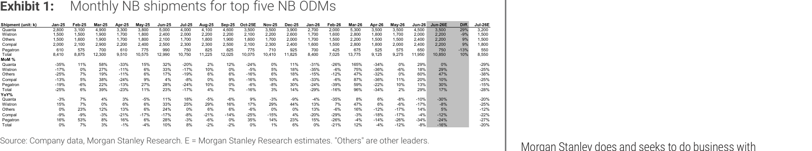
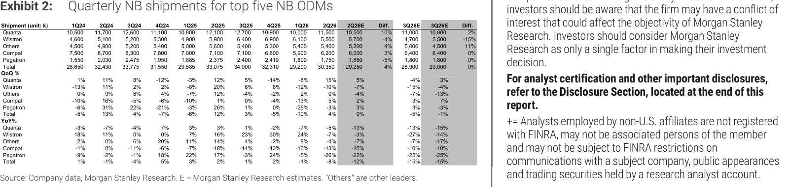

# MS｜NB 月度出貨量追蹤 — 6 月超預期 +10%；3Q 維持 -15% y/y

**券商**：Morgan Stanley  
**分析師**：Howard Kao、Irene Yen、Andy Meng (CFA)  
**日期**：2026-07-14  
**主題**：NB 月度出貨追蹤（June-26 實際 vs 預估；3Q26 預估維持）  
**評級**：Industry View In-Line  
<a href="https://layx.uk/dl?g=產業&b=MS&d=20260714&h=Monthly-Databook-NB">📎 下載 PDF</a>

---

## 報告總結

6 月 NB 出貨 12.0M 超過 MSe 10% (+29% m/m，-8% y/y），關鍵原因不是需求好轉，而是**零件供給不足迫使 ODM 優先排產高端高毛利機型**。2Q26 合計 30.4M（+4% q/q，-8% y/y），超 MSe 4%，主要由高端機型貢獻。然而 MS 未上調 3Q26 預估，維持 28.9M（-5% q/q，-15% y/y）——季節性本應 +5% q/q，-5% 是明顯低於季節性，顯示低端機型在零件限制下仍受壓制。

MS 預計 ODM 將在 8 月初 2Q 法說時提供 3Q26 量化指引，為下一個主要數據更新節點。

---

## MS 完整投資邏輯鏈

| 論點層次 | Exhibit | 內容 |
|---|---|---|
| 需求信號確認 | E1 | 6 月 12.0M 超 MSe +10%，Q/Q +29% 旺季末拉貨 |
| 超預期原因解析 | E1 | 非需求擴張，是零件短缺 → ODM 優先高端機型 → 出貨組合偏高端 |
| 2Q26 合計確認 | E2 | 30.4M（+4% q/q，-8% y/y），超 MSe 4%（29.25M） |
| 3Q26 不上調 | E2 | 維持 28.9M，-5% q/q，次季節性（15Y avg +5% q/q） |
| 抑制因素 | E1 | 零件限制持續壓低端 NB build，不能把 2Q 超預期線性外推 |
| **結論** | 封面 | **In-Line；6 月超預期但屬拉貨效應；3Q 低端受壓，8 月法說為催化劑** |

> **報告最大邏輯缺口**：報告指出零件限制是抑制低端機型的主因，但未說明哪類零件（記憶體、面板、BBU？）最為緊繃，也未量化高端 vs 低端機型的組合比例，讀者無法判斷約束何時解除。

---

## 報告核心觀點

| 主題 | MS 觀點 | 市場共識 | 是否 Contra-Consensus |
|---|---|---|---|
| 6 月 NB 出貨 | 12.0M（+10% 超 MSe）| 約 10.9M | Positive surprise |
| 超預期驅動力 | 零件短缺 → 高端優先，非需求改善 | 未明確解讀 | 偏 Contra（提示不可持續） |
| 3Q26 NB build | 維持 28.9M（不上調） | 市場多看 29-30M？ | 略偏保守 |
| 季節性比較 | -5% q/q vs 15Y avg +5%，次季節性 | 部分預期追回 | 保守 |
| 低端機型 | 繼續受零件限制壓制 | 分歧 | 偏 Cautious |

**偏好排序**：高端 NB ODM（受惠高端優先排產）> 低端機型 ODM（短期受限）

---

## Exhibit 1｜Monthly NB Shipments, Top 5 ODMs（月度出貨量）

### 解讀摘要

月度出貨表顯示 Jun-26 合計 12.0M 超過 MSe 的 10.85M（+10%），且 +29% m/m 創下近期最強單月增幅。但 MoM 比較有季節性扭曲：五月是旺季前低點，六月是 quarter-end 拉貨高點，組合後的 +29% m/m 反映的是正常季節性加上高端排產優先的結果，並非需求突破。Jul-26E 急降至 8.6M（-28% m/m），確認這是「旺季末拉貨 → 七月消化」的標準模式。

### 表格（Jun-26 關鍵欄位，mn units）

| ODM | May-26 | Jun-26 | Jun-26E | Diff | Jul-26E |
|---|---|---|---|---|---|
| Quanta | 3.5 | 4.5 | 3.5 | +29% | 3.2 |
| Wistron | 1.7 | 2.2 | 2.2 | -9% | 1.5 |
| Compal | 2.0 | 2.4 | 2.2 | +9% | 1.8 |
| Pegatron | 0.575 | 0.700 | 0.775 | -13% | 0.55 |
| Others | 1.5 | 2.2 | 2.15 | +9% | 1.5 |
| **Total** | **9.275** | **12.0** | **10.85** | **+10%** | **8.55** |

*數字依 E1 視覺讀取，交叉驗證通過（總計與文字描述 12.0M/10.85M/+10% 吻合）。*

> **洞察一**：Quanta 是 6 月超預期的最大貢獻者（4.5M vs MSe 3.5M，+29%），可能反映 Quanta 的高端 NB（如商用 ThinkPad/Elitebook 或 MacBook）在零件取得上有優勢。Wistron 和 Pegatron 低於預估，顯示低端機型（更容易受零件限制）仍弱。

---

## Exhibit 2｜Quarterly NB Shipments, Top 5 ODMs（季度出貨量）

### 解讀摘要

季度表清晰呈現了 2026 年的出貨下滑趨勢：2Q26 30.35M 雖超 MSe 4%，但 -8% y/y 的年比仍為負成長；3Q26E 更降至 28.9M（-5% q/q、-15% y/y），低於過去 15 年 3Q 平均季節性（+5% q/q）約 10 個百分點。這個次季節性信號告訴我們：零件供給對低端機型的限制，在 3Q26 不會因 6 月的短暫超預期而解除。

### 表格（關鍵欄位，mn units）

| ODM | 1Q26 | 2Q26 | 2Q26E | Diff | 3Q26E（新） | 3Q26E（舊） | Diff |
|---|---|---|---|---|---|---|---|
| Quanta | 10.0 | 11.5 | 10.5 | +10% | 11.0 | 10.8 | +2% |
| Wistron | 6.1 | 5.5 | 5.7 | -4% | 4.7 | 5.5 | -15% |
| Compal | 5.9 | 6.2 | 6.0 | +3% | 6.4 | 6.4 | 0% |
| Pegatron | 1.8 | 1.75 | 1.85 | -5% | 1.8 | 1.8 | 0% |
| Others | 5.4 | 5.4 | 5.2 | +4% | 5.0 | 4.5 | +11% |
| **Total** | **29.2** | **30.35** | **29.25** | **+4%** | **28.9** | **29.0** | **0%** |

*數字依 E2 視覺讀取，交叉驗證通過（2Q26 合計 30.35M 與文字 30.4M 吻合）。*

> **洞察二**：3Q26E 的 Wistron 下調幅度最大（-15%），顯示 Wistron 主力的低端機型受零件限制最深；Quanta 小幅上調（+2%）顯示高端機型反而略有提升能見度。這個分化格局可能持續至 3Q，高端 NB ODM/組件廠相對受益。

> **洞察三（配合 Exhibit 1）**：E1 確認 6 月的超預期主要來自 Quanta 高端機型，而 E2 的 3Q26E 維持不變（且 Wistron 下調），說明 6 月強勢沒有轉化為 3Q 上調。這是報告的核心矛盾提示：月度強勢 ≠ 季度上調，後端供給限制是真實約束。

---

## 相關個股清單

| 類別 | 公司 | Ticker | 評等 | 備註 |
|---|---|---|---|---|
| NB 組裝 | 廣達電腦 | 2382 TW | OW | E2 中 3Q26E 小幅上調，高端 NB 優勢 |
| NB 組裝 | 仁寶電腦 | 2324 TW | U | Howard Kao 評等 |
| NB 組裝 | 緯創資通 | 3231 TW | OW | 低端受限，3Q26E 下調 |
| NB 組裝 | 和碩聯合 | 4938 TW | E | 次要 NB 組裝 |
