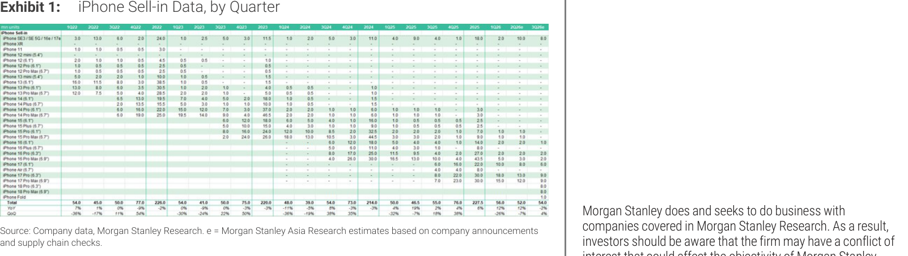
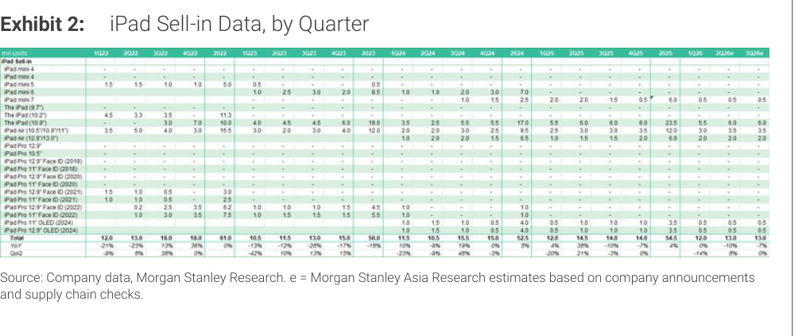

# MS｜iPhone & iPad 月度出貨量追蹤 — 3Q26 預估維持不變

**券商**：Morgan Stanley  
**分析師**：Howard Kao、Derrick Yang、Andy Meng (CFA)、Irene Yen、Vivi Huang、Betty Chen  
**日期**：2026-07-14  
**主題**：iPhone & iPad 季度出貨量更新（2Q26 完工核對 + 3Q26E 維持）  
**評級**：Industry View In-Line  
<a href="https://layx.uk/dl?g=產業&b=MS&d=20260714&h=Monthly-Databook-iOS">📎 下載 PDF</a>

---

## 報告總結

MS 月度 iOS 出貨追蹤顯示 2Q26 iPhone build 符合預期（52M，-7% q/q、+12% y/y），優於通常 -15～25% 的季節性跌幅，主因六月出貨回升（Hon Hai 表現好於季節性）。3Q26 iPhone build 預估維持 54M（+4% q/q、-2% y/y），SKU 向 premium 傾斜（iPhone 18 Pro/Pro Max + iPhone Fold），標準 iPhone 18 推遲至 1H27 才上市。

iPad 方面，2Q26 13M 符合預期，3Q26 預估也維持 13M（flat q/q、-7% y/y），存貨正常，但記憶體與料件漲價是潛在下行風險。此次更新無重大調整，為純數據核對報告。

---

## MS 完整投資邏輯鏈

| 論點層次 | Exhibit | 內容 |
|---|---|---|
| 需求信號確認 | E1 | 2Q26 iPhone 52M 好於季節性（歷史 -15～25% q/q vs 本次 -7%），6 月出貨回升 |
| 3Q26 build 維持 | E1 | 54M (+4% q/q, -2% y/y)，iPhone Fold 7-8M 在 2H26，不上修也不下修 |
| SKU mix 解讀 | E1 | iPhone 18 標準版延至 1H27，3Q26 純靠 Pro/Pro Max + Fold，ASP 組合偏高 |
| iPad 不變 | E2 | 3Q26 13M（flat q/q），存貨正常，記憶體漲價為下行風險 |
| **結論** | 封面 | **In-Line；2Q26 好於季節性，3Q26 無調整；關注 Fold 量產爬坡進度** |

> **報告最大邏輯缺口**：iPhone Fold 7-8M 的預估範圍寬幅仍大，且未說明 2H26 的 1Q/2Q 分布——此為 3Q26 實際 build 是否達到 54M 的主要不確定性來源。

---

## 報告核心觀點

| 主題 | MS 觀點 | 市場共識 | 是否 Contra-Consensus |
|---|---|---|---|
| 2Q26 iPhone build | 52M，好於季節性 | 約 50-52M | In-line |
| 3Q26 iPhone build | 54M，無調整 | 約 54M | In-line |
| iPhone Fold 時間表 | 7-8M in 2H26，持續觀察 | 市場看法分歧 | 偏保守（未上修） |
| iPhone 18 時間 | 1H27，非 3Q26 | 部分預期 2H26 | 確認 |
| 記憶體漲價影響 | iPad 潛在下行風險 | 已知風險 | In-line |

**偏好排序**：iPhone（量好於季節性、premium mix）> iPad（量平、記憶體漲價隱憂）

---

## Exhibit 1｜iPhone Sell-in Data, by Quarter

### 解讀摘要

表格呈現 iPhone 各型號逐季出貨量（mn units），從 1Q22 延伸至 3Q26e。2Q26 合計 52M 好於季節性（-7% q/q vs 歷史 -15～25%），顯示 sell-through 動能穩健，記憶體漲價未影響需求。3Q26e 維持 54M（+4% q/q），iPhone 18 系列僅有 Pro/Pro Max 和 Fold 在 3Q26 上市，標準 iPhone 18 延至 1H27 使這一季 SKU 高度 premium。

### 表格（關鍵彙總列）

| 指標 | 1Q26 | 2Q26e | 3Q26e |
|---|---|---|---|
| iPhone 合計（mn units） | 56 | 52 | 54 |
| QoQ | +7% | -7% | +4% |
| YoY | — | +12% | -2% |

> **洞察一**：3Q26 YoY -2% 反映的是 iPhone 18 拆分發布策略帶來的基期效應（2025 年同期 55M 含標準型，今年 3Q26 只有 Pro/Fold），而非需求走弱——售完率若維持，實際需求強度被 SKU 結構扭曲。

---

## Exhibit 2｜iPad Sell-in Data, by Quarter

### 解讀摘要

iPad 合計 2Q26 13M（+8% q/q、-10% y/y），YoY 負成長反映 2Q25 有產品上市的高基期。3Q26 預估維持 13M（flat q/q、-7% y/y），存貨水位正常，但 MS 提示記憶體與料件漲價有潛在下行影響。iPad 整體動能弱於 iPhone，無上調基礎。

### 表格（關鍵彙總列）

| 指標 | 1Q26 | 2Q26e | 3Q26e |
|---|---|---|---|
| iPad 合計（mn units） | 12 | 13 | 13 |
| QoQ | — | +8% | flat |
| YoY | — | -10% | -7% |

> **洞察二**：iPad 兩季連續 YoY 負成長（2Q=-10%、3Q=-7%）但 QoQ 持平或正，顯示需求並非萎縮，而是「去年有新機發布 → 今年基期高」的年比效應。短期 iPad 供應鏈出貨節奏不需要悲觀解讀。

---

## 相關個股清單

| 類別 | 公司 | Ticker | 評等 | 備註 |
|---|---|---|---|---|
| 組裝（iOS） | 鴻海精密 | 2317 TT | N/A | 明確提及 2Q26 表現好於季節性 |
| 組裝（iOS） | 和碩聯合 | 4938 TT | N/A | 次要組裝夥伴 |
