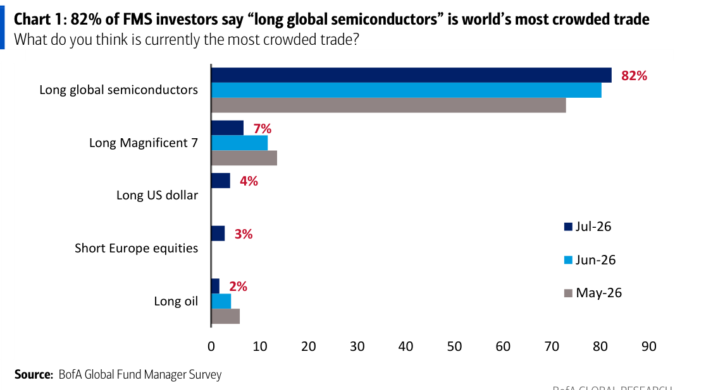
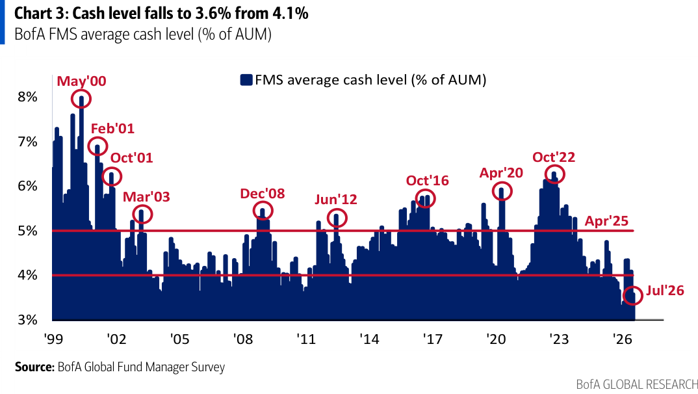
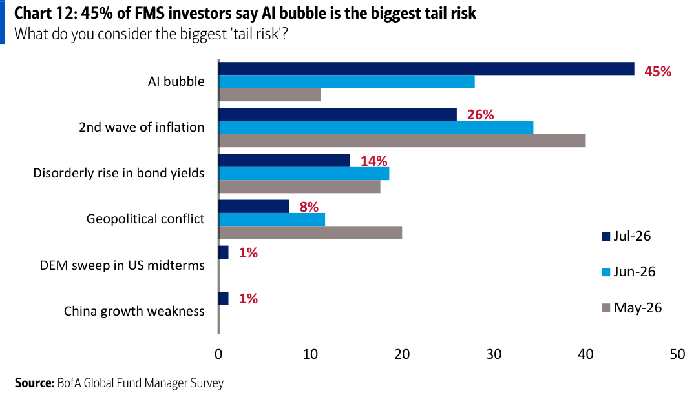
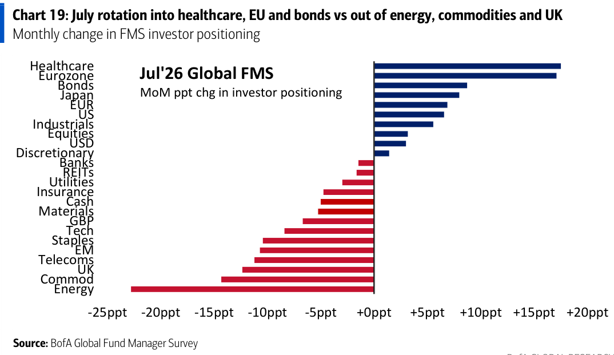
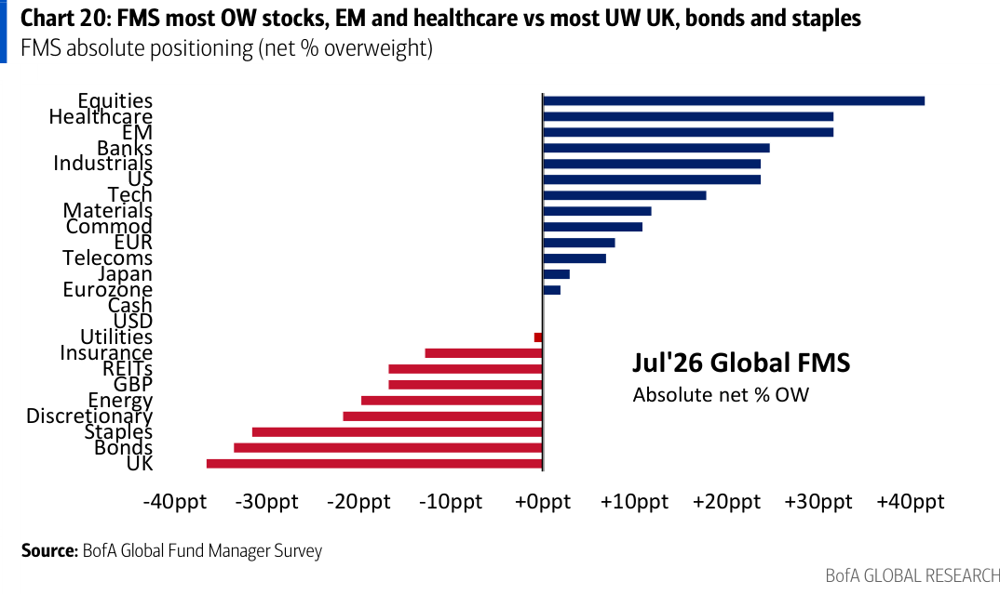
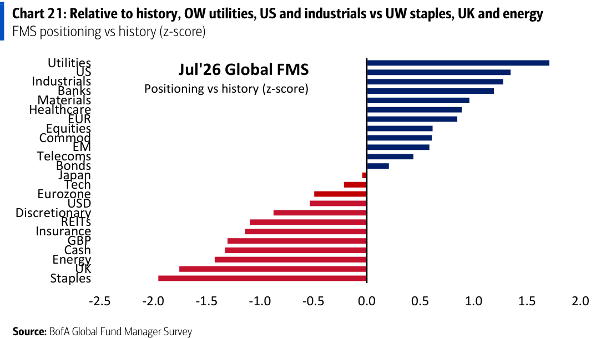

# BofA｜Global Fund Manager Survey — Pain trades: duration, dividend, defensives

**券商**：BofA Securities（Global Investment Strategy）  
**分析師**：Michael Hartnett、Anya Shelekhin、Myung-Jee Jung、Jessica Guo  
**日期**：2026-07-16（封面標示 14 July 2026，系統日期以檔名 20260716 為準；調查期間 7/2–7/9，210 位經理人、AUM \$555bn）  
**主題**：2026 年 7 月全球基金經理人調查（FMS）  
**評級**：Global 跨資產策略（月度定位調查，非個別產業評等）  
<a href="https://layx.uk/dl?g=產業&b=BofA&d=20260716&h=Global-Fund-Manager-Survey">📎 下載 PDF</a>

---

## 報告總結

7 月 FMS 顯示投資人情緒轉更樂觀，由「經濟 boom」樂觀、AI 資本支出信心與鴿派 Fed 三者驅動；現金水位自 4.1% 驟降至極低的 3.6%（2002 年以來第 16 次觸及 3.6% 或更低），美股加碼為 Dec'24 以來最大，BofA Bull & Bear 指標飆至 9.4 的極度樂觀讀數——這正是本報告的時機與核心訊號：**極端多方定位本身已成為風險**。BofA 的 FMS Cash Rule（現金 ≤4.0% 觸發賣訊）與 B&B 指標同步發出「減碼股票與高 beta」訊號。

投資意涵偏防禦與逆勢：報告標題「duration, dividend, defensives」即 contrarian 方向——極端定位下最佳逆勢交易為「若 Fed 意外鷹派 → 多必需消費與黃金、空半導體與醫療」、「若 peak boom → 多債券/英股/高息股、空工業與銀行」。「long global semis」以 82% 成為史上最擁擠交易，「AI 泡沫」則躍居首要尾部風險（45%），是當前多頭結構最脆弱的一環。

---

## BofA 完整投資邏輯鏈

| 論點層次 | Chart | 內容 |
|---|---|---|
| **情緒過熱** | 2 | FMS 廣義情緒指標升至 7.2（自 6.0），Feb'26 以來最樂觀 |
| **現金觸賣訊** | 3 | 現金水位 4.1%→3.6%，跌破 4.0% 觸發 FMS Cash Rule 賣訊 |
| **歷史回測不利** | Table 1 | 現金 ≤3.6% 的 16 次前例，其後兩週股票平均 −0.8%、債券勝出 |
| **定位擁擠** | 1 | 82% 認為「long global semis」為最擁擠交易，多頭高度集中 |
| **風險認知轉向** | 12 | 「AI 泡沫」升為首要尾部風險（45%，自上月 28%） |
| **輪動防禦化** | 19–21 | 加碼醫療/歐洲/債券，減碼能源/商品/英國；首度預期低息股勝高息股 |
| **結論** | 封面 | **極端多方定位＝風險；建議減碼股票與高 beta，夏季風險資產上檔受多頭定位壓抑** |

> **報告最大邏輯缺口**：賣訊來自「定位/情緒」的反向指標，而非基本面轉弱——若 AI 資本支出與「no landing」續強（61% 認為無 hyperscaler 砍單、54% 認為經濟不著陸），擁擠交易可能維持更久，反向訊號的時點風險偏高。

---

## 報告核心觀點

| 主題 | BofA/FMS 觀點 | 市場共識 | 是否 Contra-Consensus |
|---|---|---|---|
| 整體定位 | 情緒極度樂觀、現金 3.6% 觸賣訊 | 續抱 AI 多頭 | 是（喊減碼） |
| 半導體 | 82% 最擁擠交易，contrarian 空方候選 | 續多半導體 | 是 |
| AI 泡沫 | 躍為首要尾部風險（45%），惟 48% 仍不認為是泡沫 | 分歧 | 部分 |
| 總經 | 54% 預期「no landing」、Fed 續鴿（83% 認為期中選舉前不升息） | 軟著陸 | 「no landing」偏鷹於共識 |
| 股利風格 | 首度（自 May'17）預期低息股勝高息股 | — | 是 |
| 黃金 | Mar'23 以來最被低估 | — | 逆勢偏多黃金 |

**偏好排序（加碼）**：醫療（Jul'21 以來最 OW）、歐元區、工業、美股（Dec'24 以來最 OW）、債券。  
**減碼**：英國（Aug'20 以來最 UW）、能源（Jun'10 以來最大單月降幅）、商品、必需消費（Feb'14 以來最 UW）、新興市場。  
**Contrarian 交易**：鷹派意外 → 多必需消費＋黃金、空半導體＋醫療；peak boom → 多債券/英股/高息股、空工業＋銀行。

---

## Chart 1｜82% 認為「long global semiconductors」為全球最擁擠交易

### 解讀摘要
「做多全球半導體」以 82% 壓倒性居冠，遠高於第二名「long Magnificent 7」的 7%——這種一面倒的集中度本身就是風險訊號：當某一交易被 82% 的經理人視為最擁擠，代表增量買盤有限、且一旦反轉時擁擠出場的踩踏風險最大。這也讓半導體成為 BofA contrarian「空方」清單的首選。

### 表格
| 最擁擠交易 | Jul-26 佔比 |
|---|---|
| Long global semiconductors | 82% |
| Long Magnificent 7 | 7% |
| Long US dollar | 4% |
| Short Europe equities | 3% |
| Long oil | 2% |

> **洞察一**：82% vs 次名 7% 的斷崖差距（11.7x）是本調查數年來最極端的單一擁擠讀數之一，意味半導體多頭的邊際承接力最薄弱，也是「若市場修正、跌最凶」的候選。

---

## Chart 3｜現金水位自 4.1% 降至 3.6%，觸發 FMS Cash Rule 賣訊

### 解讀摘要
FMS 平均現金水位降至 3.6%（占 AUM），為 Feb'26 以來最低，並跌破 4.0% 的 FMS Cash Rule 門檻——歷史上現金 ≤4.0% 對應風險資產短線見頂的賣訊。現金愈低代表經理人已幾乎滿倉，後續加碼子彈有限，是「多頭定位擠壓上檔」的量化證據。

> **原文補充**：BofA 明列現金 3.6% 觸發 Cash Rule 賣訊（門檻 4.0%）；並統計 2002 年以來現金 ≤3.6% 共 16 次前例（見下表）。

### 表格（Table 1：現金 3.6% 或更低後的資產報酬）
| FMS 現金% | 2002 以來訊號次數 | 全球股票 2週 | 全球股票 1月 | 美債 2週 | 美債 1月 |
|---|---|---|---|---|---|
| 3.5 | 11 | −1.1% | −1.5% | +0.6% | +0.6% |
| **3.6** | **16** | **−0.8%** | **−0.5%** | **+0.6%** | **+0.4%** |
| 3.7 | 24 | −0.5% | +0.1% | +0.5% | +0.4% |
| 3.8 | 39 | −0.1% | +0.5% | +0.3% | +0.1% |
| 3.9 | 57 | −0.1% | +0.6% | +0.2% | +0.1% |
| 4.0 | 71 | +0.1% | +0.3% | +0.3% | +0.3% |

> **洞察二**：現金愈低、後續股票報酬愈差且債券愈勝出——3.6% 對應其後兩週股票平均 −0.8%、美債 +0.6%，印證報告標題「duration（債券存續期）」為 contrarian 首選。

---

## Chart 12｜「AI 泡沫」躍居首要尾部風險（45%）

### 解讀摘要
「AI 泡沫」自上月 28% 跳升至 45%，一舉超越「二次通膨」（自 34% 降至 26%）成為最大尾部風險——風險認知的重心已從通膨轉向 AI 估值。值得注意的矛盾是：45% 視 AI 泡沫為最大尾部風險，但同一調查中 48% 又認為 AI「並非泡沫」，顯示投資人一邊擔憂、一邊續抱的分裂心態。

### 表格
| 最大尾部風險 | Jul-26 |
|---|---|
| AI 泡沫 | 45% |
| 二次通膨 | 26% |
| 債券殖利率失序上升 | 14% |
| 地緣政治衝突 | 8% |
| 美期中選舉 DEM 全勝 | 1% |
| 中國成長疲弱 | 1% |

> **洞察三**：尾部風險認知從「二次通膨」（6 月 #1）換位到「AI 泡沫」（7 月 #1，45%），與 Chart 1 的半導體擁擠交易互相呼應——市場最集中的多頭，正是自認最大的風險來源，這種自我矛盾通常出現在週期後段。

---

## Chart 19｜7 月輪動：加碼醫療/歐洲/債券，減碼能源/商品/英國

### 解讀摘要
月度定位變化顯示明顯的防禦化輪動：加碼幅度最大者為醫療、歐元區、債券、日本；減碼最深者為能源（單月降幅最大）、商品、英國、電信。這是「peak boom」情境下典型的資金再配置——從景氣循環/通膨受益資產轉向存續期與防禦類。

### 表格（月度定位變化方向）
| 方向 | 主要項目 |
|---|---|
| 加碼（MoM +） | 醫療、歐元區、債券、日本、歐元、美股、工業、股票、美元 |
| 減碼（MoM −） | 能源（降幅最大）、商品、英國、電信、EM、必需消費、科技、GBP、原物料、現金 |

---

## Chart 20｜絕對定位：最加碼股票/EM/醫療，最減碼英國/債券/必需消費

### 解讀摘要
以絕對淨加碼（net % OW）看，經理人最加碼股票、EM、醫療、銀行、工業、美股；最減碼英國、債券、必需消費、Discretionary、能源。「最加碼股票」對照 Chart 3 的極低現金，構成滿倉多頭的完整圖像——這是報告喊「減碼」的定位基礎。

### 表格
| 淨加碼（OW 前段） | 淨減碼（UW 後段） |
|---|---|
| 股票、EM、醫療、銀行、工業、美股、科技 | 英國、債券、必需消費、Discretionary、能源、REITs |

> **洞察四（配合 Chart 3）**：「最加碼股票」＋「現金 3.6% 極低」＝經理人幾乎滿倉；絕對定位與現金水位兩個獨立指標指向同一結論，強化 contrarian 減碼訊號的可信度。

---

## Chart 21｜相對歷史（z-score）：加碼公用/美股/工業，減碼必需消費/英國/能源

### 解讀摘要
以相對自身歷史的 z-score 衡量，最極端加碼者為公用事業、美股、工業、銀行；最極端減碼者為必需消費、英國、能源、現金。必需消費落在 −1.9 z-score（Feb'14 以來最 UW），能源、英國同樣處於歷史極低——這些「被拋棄」的板塊正是 contrarian 逆勢做多的候選。

### 表格（z-score 兩端）
| 相對歷史最加碼 | z-score | 相對歷史最減碼 | z-score |
|---|---|---|---|
| 公用事業 | ~ +1.7 | 必需消費 | ~ −1.9 |
| 美股 | ~ +1.3 | 英國 | ~ −1.7 |
| 工業 | ~ +1.2 | 能源 | ~ −1.4 |

*z-score 為視覺估算。*

> **洞察五**：必需消費 −1.9 z-score 對應報告 contrarian 清單「若 Fed 意外鷹派 → 多必需消費」——定位極度悲觀處，正是逆勢報酬空間最大處；這與 Chart 1 的半導體（極度擁擠、contrarian 空方）形成對稱的兩端。

---

## 相關個股清單

（跨資產總經策略調查，無特定個股評等。對台股投資人的間接意涵：82% 視「long global semis」為最擁擠交易、AI 泡沫為首要尾部風險，對高度集中於半導體/AI 供應鏈的台股大盤具指標性參考——多頭定位已極端，短線上檔恐受壓抑。）
