# Goldman Sachs｜Taiwan CCL

**券商**：Goldman Sachs  
**分析師**：Chao Wang、Allen Chang、Al Wang  
**日期**：2026-07-17  
**主題**：高階 CCL 盈利能力上升趨勢重啟，定價與產品組合持續改善；Buy EMC（TP NT\$9,500↑）、TUC（TP NT\$2,860↑）  
**評級**：Buy（EMC & TUC）  
<a href="https://layx.uk/dl?g=產業&b=GS&d=20260717&h=Taiwan-CCL">📎 下載 PDF</a>

---

## 報告總結

高階 CCL 在 2Q26 迎來第二輪漲價週期啟動，M7+ 上漲 10-15%、M6 以下上漲 40-80%，PCB 客戶幾乎無抗拒，GS 以此為由大幅上調 EMC/TUC 目標價（EMC: NT\$6,000→NT\$9,500，+58%；TUC: NT\$1,888→NT\$2,860，+51%）。報告撰寫時機為「首輪漲價消化完後的二次確認」：GS 預期 2Q26 EMC/TUC GM 分別擴張 +4.7/+4.8ppt QoQ，並首次引入 2028E CCL TAM 估計（US\$57bn），揭示 53% 2025-28E CAGR 的全市場成長框架。

核心結論：高階 CCL 供需缺口至 2028E 持續存在（需求 96% CAGR vs. 供給 22% CAGR），AI 伺服器 CCL 由 2025 年 15% 市場佔比躍升至 2028E 70%，EMC 坐穩 Nvidia/Google/AWS 全部 AI 伺服器項目主要供應商地位（市占 46-53%），TUC 以 Switch CCL 20%+ 市占銜接成長；兩家 2026-28E GM 有望持續達到 AI 時代新高（EMC 37%+，TUC 33%+）。

---

## Goldman Sachs 完整投資邏輯鏈

| 論點層次 | Exhibit | 內容 |
|---|---|---|
| 瓶頸確認 | 2、5 | 高階 CCL 需求 96% CAGR vs. 供給 22% CAGR，供需缺口持續擴大至 2028E |
| 需求結構 | 1、3、4 | CCL TAM 53% CAGR 至 US\$57bn，AI 伺服器 2028E 佔 70%；VR200 CCL 含量 3.5x+ GB300 |
| 供給上限 | 5、6 | 高階 CCL 擴產速度不足（22% CAGR）；低階 CCL 需求疲軟無擴產動機 |
| 定價動能 | 11 | 2H26 高階/低階雙向漲價；高階由需求驅動（可持續），低階由成本推升（趨緩） |
| 盈利展望 | 8、10、12 | EMC AI 敞口 2028E→89%，M7+ 敞口 99%；GM 由 ~26% 擴至 37%+ |
| 受益排序 | 9、封面 | EMC（AI 伺服器 CCL 龍頭，市占 50%+）＞TUC（Switch + AI 伺服器，20%+市占） |
| 結論 | 封面 | **EMC Buy NT\$9,500（↑ from NT\$6,000）；TUC Buy NT\$2,860（↑ from NT\$1,888）** |

> **報告最大邏輯缺口**：M7+ 第二輪漲價（2H26 再 +10-15%）的假設基於 GS 自身通路查驗；若 PCB 客戶因宏觀景氣轉弱而抗拒，對 2026-28E EPS 影響達 15-30%。

---

## 報告核心觀點

| 主題 | GS 觀點 | 市場共識 | Contra-Consensus |
|---|---|---|---|
| CCL TAM 2028E | US\$57.0bn（53% CAGR） | — | 是（首次引入 2028E 估算） |
| 高階 CCL 定價趨勢 | 2H26 M7+ 再漲 10-15%，客戶無抗拒 | 不確定 | 是 |
| EMC 2Q26 GM | +4.7ppt QoQ → 34.1%，beat 共識 | Street 低估 | 是（OPM beat +2.4ppt） |
| TUC 2Q26 GM | +4.8ppt QoQ → 29.9%，beat 共識 | Street 低估 | 是（OPM beat +2.0ppt） |
| EMC 2026E EPS | NT\$117.98（上修 27%） | 低於 GS 約 21% | 是 |
| TUC 2026E EPS | NT\$38.75（上修 4%） | 低於 GS 約 10% | 是（2Q26 OPM beat 共識 +2.0ppt） |
| 高低階 CCL 定價差異 | 高階=需求驅動可持續；低階=成本推升將趨緩 | 混淆或未區分 | 是 |

**偏好排序**：EMC > TUC  
**個股偏好**：EMC（Elite Material，2383.TW）、TUC（Taiwan Union Technology，6274.TWO）

---

## Exhibit 1｜整體 CCL 市場 TAM（US$ mn，按應用分拆）

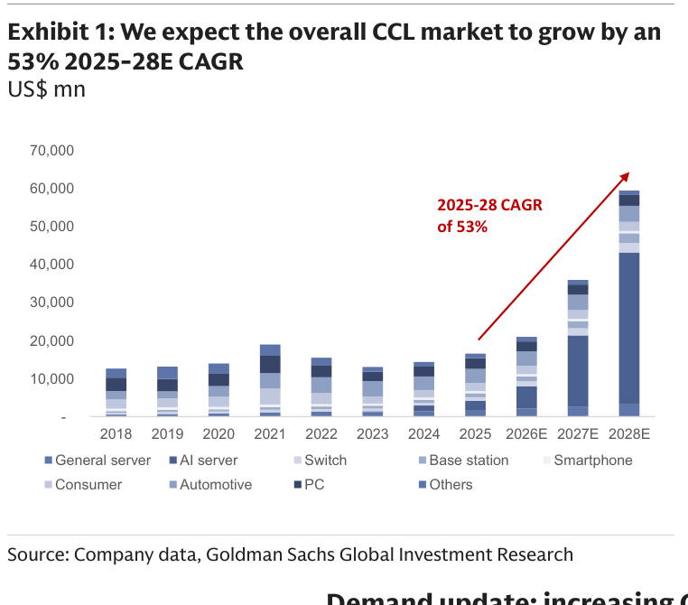

### 解讀摘要

整體 CCL TAM 在 AI 週期驅動下由 2025 年約 US\$10bn 呈指數增長，2026/27/28E 分別達 US\$20.0/34.1/57.0bn，53% 2025-28E CAGR。AI 伺服器是單一最大驅動力（155% CAGR），將由 2025 年 15% 的市場佔比飆升至 2028E 的 70%，意味著 CCL 市場已從消費性電子週期型需求轉型為結構性 AI 基礎設施需求。Switch（36% CAGR）和一般伺服器（23% CAGR）形成第二梯隊，而手機、PC 等傳統應用因換機週期走弱而呈負成長。

> **原文補充**：AI 伺服器 CCL 需求中，Nvidia 是最強驅動力（192% 2025-28E CAGR），除 GPU 出貨量穩定成長（14% CAGR）外，VR200 換代帶來 3.5x+ 的 CCL 金額含量增加（M7+→M8+ 升規使 ASP 提升 50%+，加上 Midplane 新增 CCL 用量），是純增量需求。

### 表格

| 應用類別 | 2025-28E CAGR | 2028E 佔比備註 |
|---|---|---|
| AI 伺服器 | 155% | 約 70%（vs. 2025 年 15%） |
| Switch | 36% | — |
| 一般伺服器 | 23% | Agentic AI 驅動，需求可延續 3-5 年 |
| 基地台 | 低 | — |
| 手機 | 負（-10%/3%/1% YoY） | 消費疲弱 |
| PC | 負（-14%/-5%/0% YoY） | 換機週期弱 |
| **合計 TAM** | **53%** | — |
| **合計金額** | — | **US\$20.0bn / US\$34.1bn / US\$57.0bn（2026/27/28E）** |

### 洞察

> **洞察一**：AI 伺服器 CCL 佔比由 15% → 70%（2025→2028E），不只是「一個應用在成長」，而是整個 CCL 市場的需求主軸完全替換——所有結構性定價談判力量都向 AI 供應鏈集中，非 AI 應用的 CCL 廠商在定價上的話語權將持續萎縮。

---

## Exhibit 2｜整體 CCL 市場供需平衡（供給 vs. 需求 YoY % 成長）

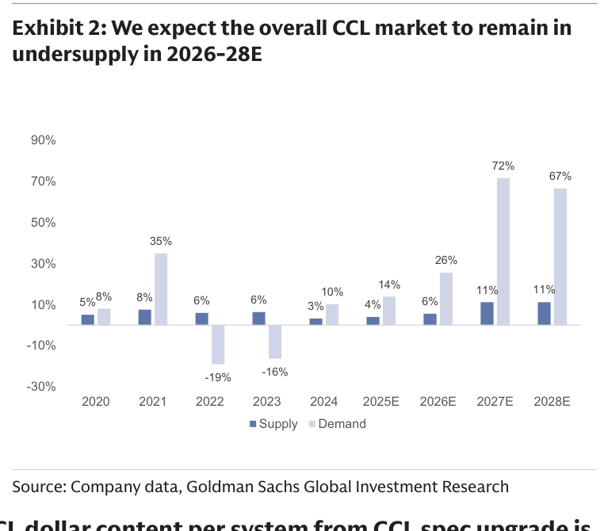

### 解讀摘要

整體 CCL 市場在 2024 年之前供需相對均衡，2026E 起因 AI 需求爆發，需求成長遠超供給擴張速度，形成持續性供不應求。整體 CCL 供給約 9% CAGR（2025-28E），而需求（尤其高階部分）以 96% CAGR 推進，缺口在 2026-28E 整個預測期間持續擴大。市場的供需缺口是支撐 CCL 廠商持續漲價的核心基礎，且 GS 認為此缺口不可能在 2028E 前閉合。

> **原文補充**：GS 在最新行業通路查驗中確認「PCB 客戶對漲價幾乎沒有抗拒」，根因是 PCB 廠商可將材料成本全額轉嫁終端客戶，且 AI 伺服器生產時程緊迫性遠高於節約材料成本的考量。

### 洞察

> **洞察一**：高階 CCL 建廠週期通常 2-3 年，加上上游 Low DK 玻纖布和 HVLP4 銅箔的同步擴產瓶頸，供給加速的空間極為有限。「供需缺口持續至 2028E」是具有工程現實支撐的判斷，不只是情緒推演。

---

## Exhibit 3｜高階 CCL 需求——市場規模及與整體 CCL TAM 比較

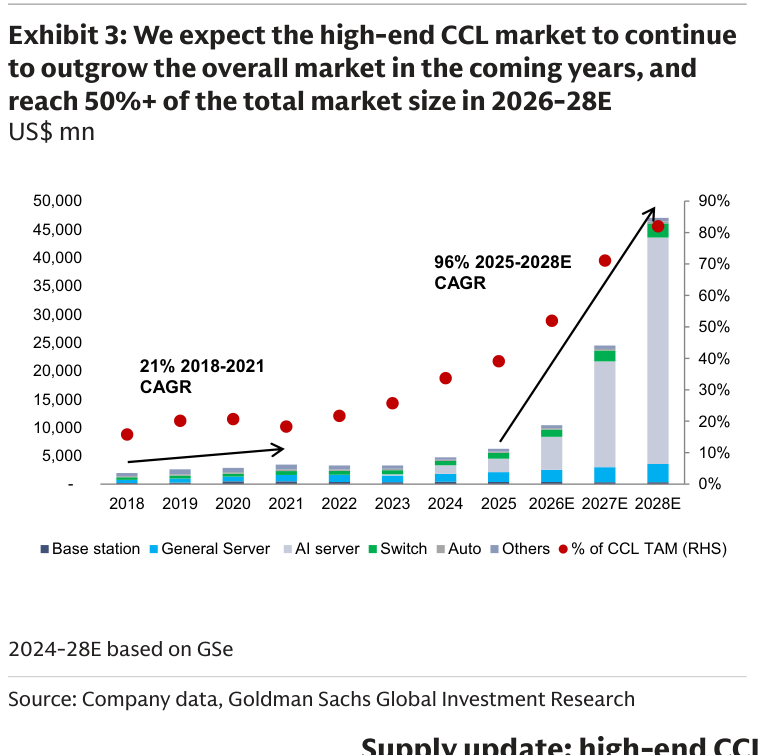

### 解讀摘要

高階 CCL 市場規模以 96% 2025-28E CAGR 成長，在 2026-28E 期間跨越 50% 的整體 CCL TAM 佔比，首次超越低階 CCL 成為市場主體。驅動高階 CCL 需求的核心機制是 AI 伺服器 CCL 規格升級（M6→M7+→M8+，每代升規帶來 50%+ 的 ASP 增幅），加上系統內 CCL 用量增加（更高層次 PCB + VR200 的 Midplane 新增用料）。

> **原文補充**：高階 CCL 的 ASP 一般是中低端產品的 2-8 倍，使得市場份額比例（Vol%）轉換為金額比例（Rev%）時有顯著放大效應，是 TAM 金額快速擴張的主要槓桿。

### 表格

| 指標 | 2025 | 2026E | 2027E | 2028E |
|---|---|---|---|---|
| 高階 CCL 佔整體 CCL TAM | <40% | 52% | 71% | 82% |
| 高階 CCL 2025-28E CAGR | — | — | — | 96% |
| 整體 CCL 2025-28E CAGR | — | — | — | 53% |

### 洞察

> **洞察一**：52% → 82% 的佔比爬升意味著 2028E 時「低階 CCL 市場」已萎縮為整體的 18%，定價主導權全面移交高階廠商，這是對 EMC/TUC 估值倍數擴張的基本面論證。

---

## Exhibit 4｜高階 CCL 佔整體 CCL TAM 比例走勢（2018-2028E）

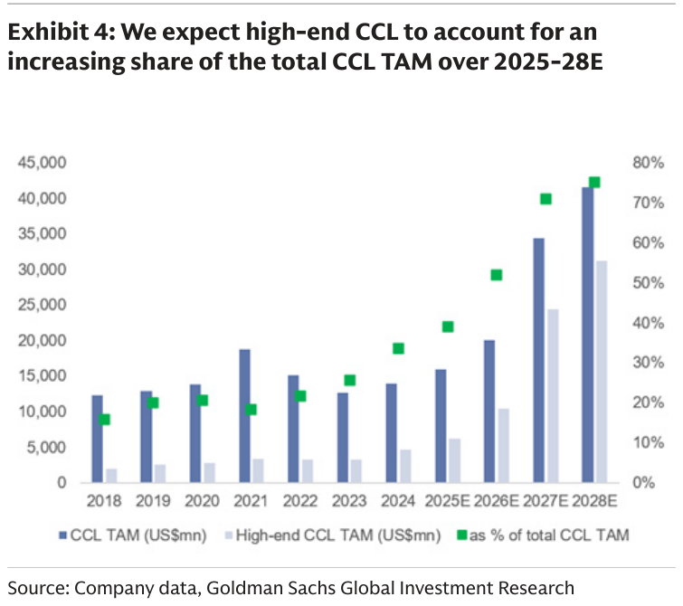

### 解讀摘要

本圖呈現高階 CCL 的市場結構轉變時間軸，從 2018-2021 年約 21% CAGR 的基礎性增長，轉為 2025-28E 96% CAGR 的爆發式擴張。2025 年是轉折點，高階 CCL 佔比首次接近 40%；2026E 超越 50%，標誌著 CCL 行業的定性轉型——從週期性零組件到 AI 供應鏈關鍵制約物料。

### 表格

| 年份 | 高階 CCL 佔 CCL TAM |
|---|---|
| 2018-2021 | 逐步上升（CAGR 21%）|
| 2025 | <40% |
| 2026E | ~52% |
| 2027E | ~71% |
| 2028E | ~82% |

### 洞察

> **洞察一（配合 Exhibit 1）**：Exhibit 1 的 TAM 金額 × Exhibit 4 的高階佔比可推算高階 CCL 的絕對規模：2026E 約 US\$10.4bn（20.0 × 52%）→ 2028E 約 US\$46.7bn（57.0 × 82%），後者是 2025 年基礎期的 10x 以上——這是 EMC/TUC 真正可觸及的 AI CCL 市場大小。

---

## Exhibit 5｜高階 CCL 供需平衡——持續供不應求至 2026-28E

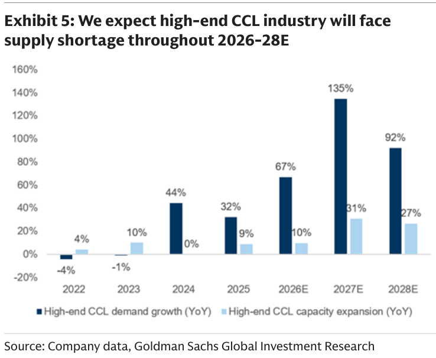

### 解讀摘要

高階 CCL 需求以 96% 2025-28E CAGR 成長，而高階 CCL 供給擴張速度僅 22% CAGR，形成極端的結構性供應短缺。即便已採取積極擴產策略的頂級高階 CCL 廠商均在滿載運行，新增產能也遠不足以填補需求缺口。GS 明確預期高階 CCL 市場在整個 2026-28E 預測期間均將維持供不應求格局。

> **原文補充**：供給端約束不僅是 CCL 廠商自身的建廠週期問題，更在於上游材料（Low DK 玻纖布、HVLP4 銅箔）的同步擴產瓶頸——這些特殊材料的供應商也面臨良率和容量限制，構成多層供應鏈制約。

### 洞察

> **洞察一**：96% vs 22% 的供需成長率差意味著「利用率溢價」在 2026-28E 不會消失，支撐高階 CCL 定價能力的基礎是結構性的，不是週期性的——類似 CoWoS 先進封裝的短供格局：廠商不需要市占擴張就能享受定價能力持續提升。

---

## Exhibit 6｜低階 CCL 市場——需求持續疲弱

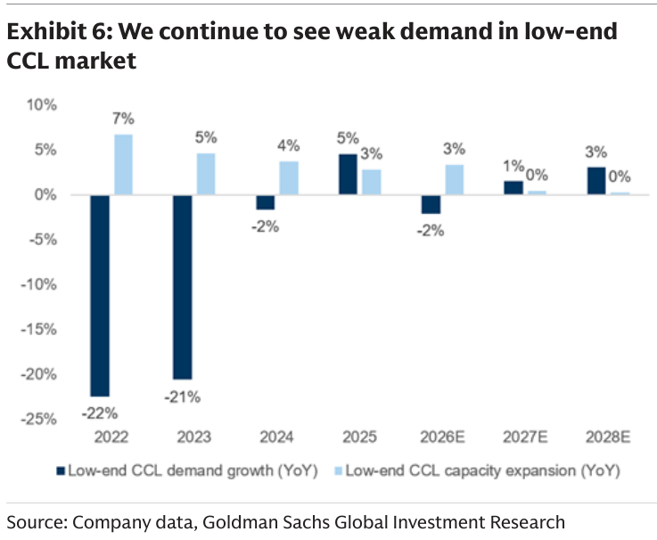

### 解讀摘要

低階 CCL 市場受消費性電子週期制約，需求展望疲弱：GS 預估 2026-28E 智能手機出貨 -10%/+3%/+1% YoY，PC 出貨 -14%/-5%/0% YoY，而消費性應用佔低階 CCL 需求超過 50%。低階 CCL 廠商面臨「需求不足 + 材料成本上升（E 玻纖短缺）+ 客戶議價能力強」三重壓力，利用率未達滿載，擴產誘因低。

> **原文補充**：E 玻纖在 1H26 漲價 80%+，主因供應商將產能轉移至高價值的 Low DK 玻纖。部分 CCL 廠商也將低階產能轉往高階，進一步收緊低階供應，支撐 3Q26 低階 CCL 價格繼續上漲。但 GS 預期 4Q26 後 E 玻纖短缺將逐步緩解（供應商回調產能），且消費電子進入淡季，低階 CCL 漲價趨勢在 4Q26 後將明顯趨緩。

### 洞察

> **洞察一**：低階 CCL 短期（3Q26）因 E 玻纖短缺出現異常漲幅，但這是非常態——需求基本面疲軟、E 玻纖供給將回補，低階 CCL 屬「成本推升型」漲幅，可持續性遠低於高階 CCL 的「需求拉動型」。EMC/TUC 的 2Q26 GM 受惠於此，但不應納入估值模型的長期假設。

---

## Exhibit 8｜EMC 與 TUC AI 應用佔比走勢（2025-2028E）

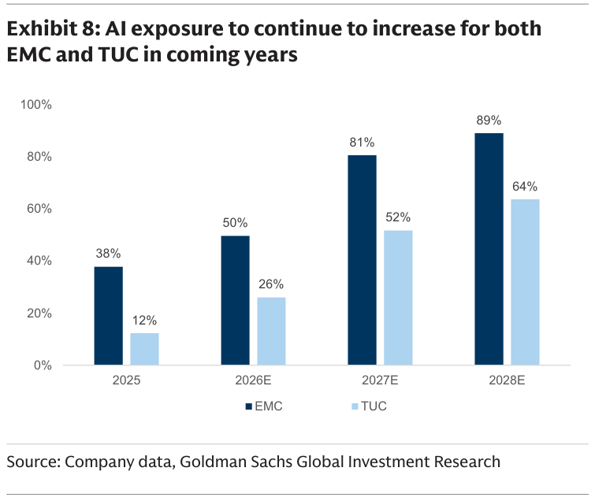

### 解讀摘要

EMC 和 TUC 的 AI 應用佔比均大幅提升，但進度差異顯著——EMC 領先：2025 年 38% → 2026E 50% → 2027E 81% → 2028E 89%；TUC 落後約 1-2 年：2025 年 12% → 2026E 26% → 2027E 52% → 2028E 64%。差距反映兩者在 Nvidia/Google/AWS AI 伺服器項目的切入時序不同。EMC 2027E AI 佔比跨越 80% 後，整體 GM 幾乎完全由 AI CCL 的高毛利結構決定。

### 表格

| 公司 | 2025 | 2026E | 2027E | 2028E |
|---|---|---|---|---|
| EMC | 38% | 50% | 81% | 89% |
| TUC | 12% | 26% | 52% | 64% |

### 洞察

> **洞察一**：TUC 的 AI 佔比在 2027E（52%）才剛超過 EMC 的 2025 年水準（38%），時間差代表 TUC 是 EMC 的「落後期版本」，但也意味著 TUC 的 AI 切入斜率更加陡峭（12%→64%），每季的 AI 佔比超預期空間可能更大，股價催化劑密度更高。

> **洞察二（配合 Exhibit 10）**：AI 敞口與 M7+ 敞口幾乎同步提升——兩個比率的乘積代表「真正的高毛利訂單佔比」，EMC 2028E 的 89% × 99% ≈ 88%，意味著整家公司的產品線幾乎全面升級完畢，EPS 可預測性顯著提高。

---

## Exhibit 9｜AI 伺服器 CCL 市場份額——EMC + TUC 合計 50%+ 以上

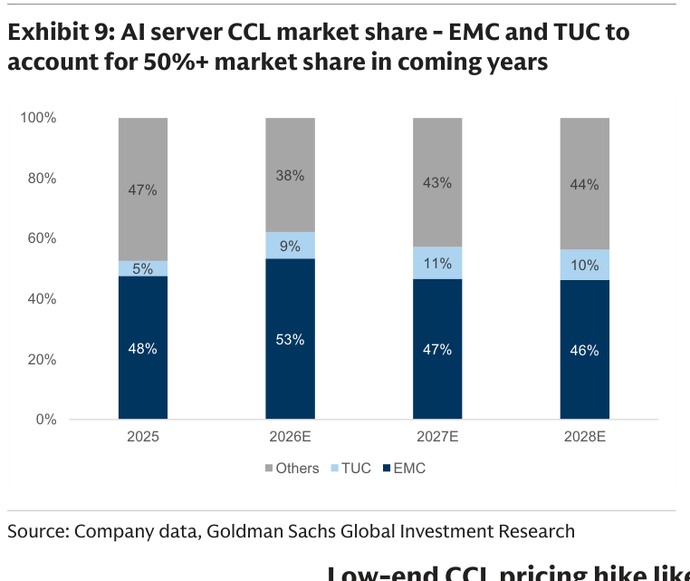

### 解讀摘要

EMC 在 AI 伺服器 CCL 市場的份額穩定維持在 46-53%，是絕對龍頭；TUC 從 5%（2025）逐步上升至 9-11%（2026-28E），EMC + TUC 合計在整個 2026-28E 預測期間維持 56-62% 的聯合市占。其餘廠商（38-47%）主要為非台灣廠商，定價談判力量弱於台灣龍頭。

### 表格

| 供應商 | 2025 | 2026E | 2027E | 2028E |
|---|---|---|---|---|
| EMC | 48% | 53% | 47% | 46% |
| TUC | 5% | 9% | 11% | 10% |
| Others | 47% | 38% | 43% | 44% |
| **EMC+TUC 合計** | **53%** | **62%** | **58%** | **56%** |

### 洞察

> **洞察一**：EMC 在 2027-28E 的市占略微下滑（53%→47%→46%）不代表份額流失，而是 AI CCL 市場 TAM 本身（96% CAGR）擴張太快，即使 EMC 絕對出貨量大幅增長，在更大分母下市占率略微稀釋。絕對金額持續高速成長才是核心論點。

> **洞察二（配合 Exhibit 1）**：TUC AI 伺服器 CCL 市占從 5%→11%，乘以快速成長的高階 CCL TAM，TUC 的絕對 AI CCL 營收成長率甚至高於 EMC——這是 TUC 股價催化劑更密集的數字依據。

---

## Exhibit 10｜EMC 與 TUC M7+ 高階 CCL 敞口走勢（2025-2028E）

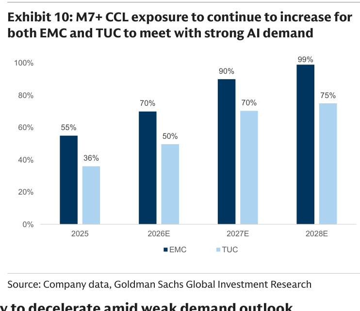

### 解讀摘要

EMC 的 M7+ CCL 敞口從 2025 年 55% 快速提升至 2028E 99%，幾乎完全轉型為 AI 用高階 CCL 廠商；TUC 從 36%（2025）提升至 75%（2028E），進度稍慢但方向一致。M7+ 等級 CCL 的 ASP 比 M6 高 50%+，這個組合改善直接驅動 GM 擴張，且速度超過純市占提升所能解釋的幅度。

### 表格

| 公司 | 2025 | 2026E | 2027E | 2028E |
|---|---|---|---|---|
| EMC M7+ 佔比 | 55% | 70% | 90% | 99% |
| TUC M7+ 佔比 | 36% | 50% | 70% | 75% |

> **原文補充**：M7+ 需求不僅來自 AI GPU 伺服器，Switch（400G/800G）也是驅動 M7+ 佔比提升的重要來源（Exhibit caption 明確提及），TUC 尤其受益於 Switch CCL 市占持續提升。

### 洞察

> **洞察一（配合 Exhibit 8）**：EMC 在 2028E 的 AI 敞口 89% × M7+ 敞口 99% ≈ 88% 的收入由最高規格 AI CCL 貢獻，ASP 和 GM 模型的分散性接近消失——這對財務可預測性是正面訊號，投資人對 EPS 估算的信心度可以更高。

> **洞察二**：TUC 的 M7+ 敞口（75%）比其 AI 伺服器敞口（64%）更高，差異在於 Switch CCL 也使用 M7+ 規格——TUC 的盈利改善有「AI 伺服器 + Switch 雙引擎」支撐，不只是 AI 伺服器的單一驅動。

---

## Exhibit 11｜高階 vs 低階 CCL 漲幅對比（2026E 漲幅 %，含 COGS 佔比）

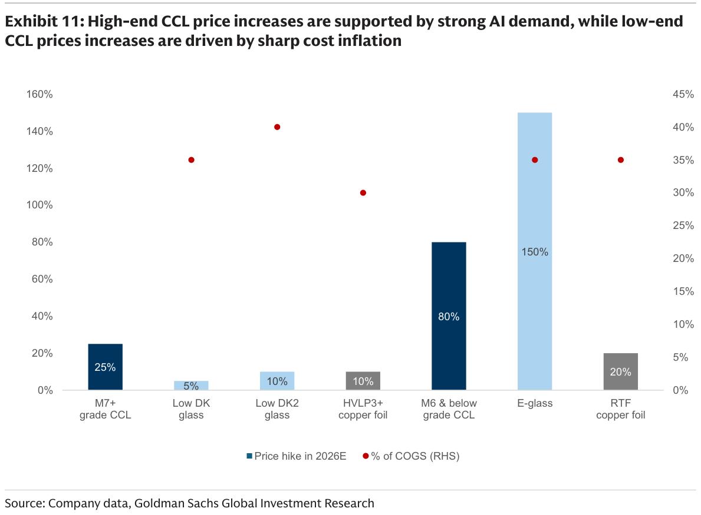

### 解讀摘要

本圖揭示高階與低階 CCL 漲價機制的根本差異：低階原材料（E 玻纖 +150%、M6 以下 CCL +80%）漲幅遠高於高階（M7+ CCL +25%），但高階漲幅是由需求拉動（供不應求），低階漲幅則由成本推升（E 玻纖嚴重短缺）。對 EMC/TUC 的含義：M7+ 的 25% 漲幅「可持續」（供需基本面支撐，且 2H26 還有第二輪），M6 以下的 40-80% 漲幅有助 2Q26 GM，但 4Q26 後趨緩甚至回落。

### 表格

| 原料 / CCL 品級 | 2026E 漲幅 | 漲幅機制 |
|---|---|---|
| M7+ 高階 CCL | +25% | 需求驅動（AI 供需缺口，可持續） |
| Low DK 玻纖 | +5% | 輕微緊缺 |
| Low DK2 玻纖 | +10% | 輕微緊缺 |
| HVLP3+ 銅箔 | +10% | 輕微緊缺 |
| M6 以下 CCL | +80% | 成本推升（E 玻纖短缺，趨緩） |
| E 玻纖 | +150% | 產能轉移至 Low DK 導致嚴重短缺 |
| RTF 銅箔 | +20% | 輕微緊缺 |

### 洞察

> **洞察一**：E 玻纖 +150% 是「人為製造的短缺」——廠商把 E 玻纖產能轉換成 Low DK 玻纖賺取更高毛利，但這種轉換可以逆轉（4Q26 後 GS 預期緩解）。反觀 M7+ CCL 的 +25% 漲幅：上游材料沒有同步大漲，代表漲價帶來的 GM 擴張幾乎全部沉澱在 EMC/TUC 的利潤中，這是兩種性質完全不同的漲價。

> **洞察二**：高階 CCL 廠商在此組合中同時扮演「漲價受益方」（出售 M7+ CCL）和「部分漲價承受方」（採購 HVLP3+/Low DK 等原材料），但因 M7+ 的溢價定價能力，淨效果是 GM 大幅擴張，這也是 GS 預計 EMC 2026-28E GM 逐年創新高的基礎。

---

## Exhibit 12｜EMC 與 TUC 毛利率季度展望（2025-2028E）

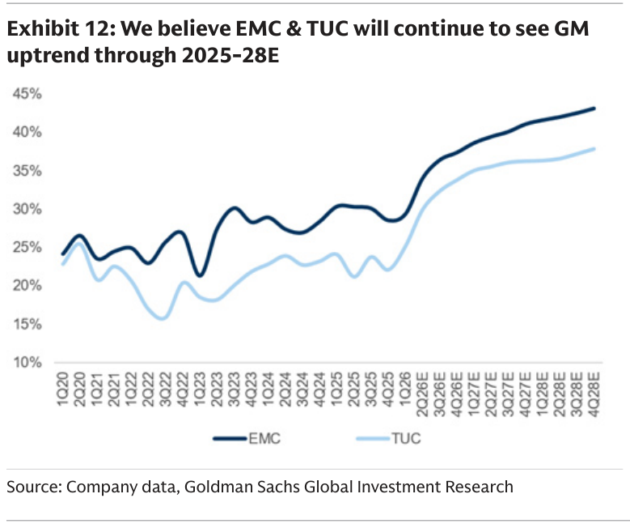

### 解讀摘要

EMC/TUC 的 GM 從 AI 時代前（2020-2023 均值約 26%/21%）→ 2024-2025 均值（~29%/~23%）→ 2026-28E 持續新高，2Q26E 分別為 34.1%/29.9%，4Q26E 達 37.4%/33.8%，並有望在 2027-28E 進一步拉升。每季 GM 擴張的驅動力是組合改善（低階向高階切換）和定價提升（M7+ 每輪漲 10-15%），而非單純銷量放大。

> **原文補充**：TUC 在 2Q26 主動停供部分低階 CCL 產品（guided），以加速向高階 AI CCL 轉型。管理層在需求緊俏時主動放棄低毛利訂單，這是比被動調整更強的信號——代表公司對高階需求的信心，以及對組合升級路徑的確定性。

### 表格

| 季度 | EMC GM | TUC GM |
|---|---|---|
| 2020-2023 均值 | ~26% | ~21% |
| 2024-2025 均值 | ~29% | ~23% |
| 1Q26 | 29.4% | 25.1% |
| 2Q26E | 34.1%（+4.7ppt QoQ） | 29.9%（+4.8ppt QoQ） |
| 3Q26E | 36.5%（+2.4ppt QoQ） | 32.3%（+2.4ppt QoQ） |
| 4Q26E | 37.4%（+0.9ppt QoQ） | 33.8%（+1.5ppt QoQ） |

### 洞察

> **洞察一**：2Q26 的 +4.7/+4.8ppt QoQ GM 擴張是「漲價 + 組合改善雙效」的集中體現，也是 GS 預計 EMC/TUC 2Q26 EPS 分別 beat 共識 21%/13% 的主要來源——街道尚未完全反映漲價效果。

> **洞察二**：若 2H26 第二輪 M7+ 漲價（+10-15%）如期落地，3Q26 的 GM 擴張節奏（+2.4ppt QoQ）相對 2Q26（+4.7/+4.8ppt）的放緩將是暫時性的，4Q26 可能再加速至 37.4%/33.8%。GS 的 4Q26E 預估已納入此假設。

---

## 跨 Exhibit 彙整表

### 彙整 1｜EMC vs TUC 盈利能力全方位對照（來源：Exhibit 8、9、10、12）

| 指標 | 公司 | 2025 | 2026E | 2027E | 2028E |
|---|---|---|---|---|---|
| AI 敞口（Rev%） | EMC | 38% | 50% | 81% | 89% |
| AI 敞口（Rev%） | TUC | 12% | 26% | 52% | 64% |
| M7+ 敞口（Rev%） | EMC | 55% | 70% | 90% | 99% |
| M7+ 敞口（Rev%） | TUC | 36% | 50% | 70% | 75% |
| AI 伺服器 CCL 市占 | EMC | 48% | 53% | 47% | 46% |
| AI 伺服器 CCL 市占 | TUC | 5% | 9% | 11% | 10% |
| 毛利率 | EMC | ~29%（均） | ~34%（2Q26E） | — | — |
| 毛利率 | TUC | ~23%（均） | ~30%（2Q26E） | — | — |

> EMC 在 AI 敞口、M7+ 敞口、市占均領先，但 TUC 的各項比率爬坡斜率更陡，且 Switch CCL 是 TUC 獨有的第二成長驅動力。兩者並非替代關係，而是在同一 AI CCL 結構性趨勢中的不同切入點。

---

## 相關個股清單

| 類別 | 公司 | Ticker | 評等 | 目標價 | EPS 預估 | 估值 |
|---|---|---|---|---|---|---|
| 台灣高階 CCL | Elite Material（台光電） | 2383.TW | Buy | NT\$9,500↑ | 2026E NT\$117.98 / 2027E NT\$249.67 / 2028E NT\$457.53 | 27x 2H27-1H28E P/E |
| 台灣高階 CCL | Taiwan Union Technology（聯茂） | 6274.TWO | Buy | NT\$2,860↑ | 2026E NT\$38.75 / 2027E NT\$93.50 / 2028E NT\$168.70 | 22x 2H27-1H28E P/E |
