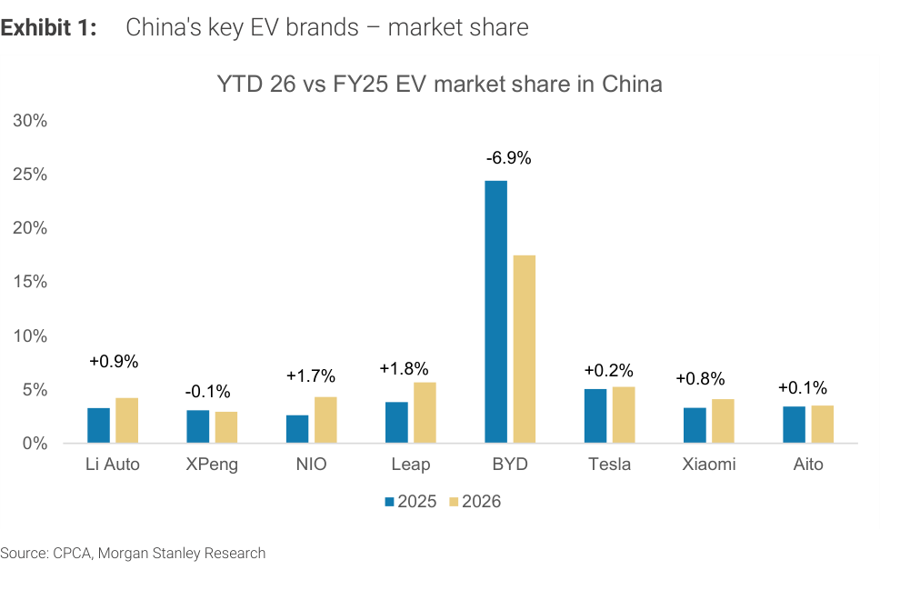

# MS｜中國 EV 六月市佔率洗牌：Leapmotor 創歷史新高，競爭格局重排

**券商**：Morgan Stanley  
**分析師**：Tim Hsiao、Shelley Wang CFA、Joey Xu CFA、Andrew S Percoco、Javier Martinez de Olcoz Cerdan、Peggy Wang  
**日期**：2026-07-20  
**主題**：中國汽車與共享出行 — 六月市佔率更新  
**評級**：China Autos & Shared Mobility — In-Line  
<a href="https://layx.uk/dl?g=產業&b=MS&d=20260720&h=China-Auto-Jun-Share">📎 下載 PDF</a>

---

## 報告總結

MS 根據中國乘聯會（CPCA）6 月數據統計各 EV 品牌市佔率。整體格局相對穩定，最大亮點是 Leapmotor（躍馬）再創市佔歷史新高（7.0%），徹底改寫電動車新勢力排行榜；BYD 大本磐；XPeng/NIO 靠新車型收復失地；Li Auto 因 L-series 預售觀望而暫時回落，新款 L8/L6 將於夏季奪回份額。

---

## MS 完整投資邏輯鏈

| 論點層次 | Exhibit | 內容 |
|---|---|---|
| 競爭格局快照 | 1 | 各 EV 品牌 YTD 26 vs FY25 市佔率；Leapmotor 7% 改寫新勢力排名 |
| 市場結構穩定 | — | 多數品牌 MoM 變動 ≤0.3ppt，BYD 維持絕對優勢 17.6% |
| 型號週期驅動分歧 | — | XPeng（GX）、NIO（ES9）上行；Li Auto（L6 refesh）、AITO（批發/上牌時間差）短暫回落 |
| 2H 催化劑 | — | Li Auto 新 L8/L6、XPeng MONA L03（8 月）、NIO 五座 ES8；型號節奏主導下半年份額走向 |
| **結論** | 封面 | **關注 Leapmotor 持續上升曲線及 Li Auto 2H 回升力道** |

---

## 報告核心觀點

| 品牌 | 6 月市佔率 | MoM | YTD | MS 解讀 |
|---|---|---|---|---|
| XPeng | 3.2% | +0.4ppt | 2.9% | GX 帶動一線城市份額，MONA L03 為 8 月下一引擎 |
| Li Auto | 3.1% | -0.5ppt | 4.2% | L-series 訂單因改款觀望而走弱；新 L8/L6 夏季回升 |
| NIO | 4.1% | +0.3ppt | 4.3% | ES9 交付帶動；五座 ES8 支撐 2H26 |
| Xiaomi | 3.5% | -0.1ppt | 4.1% | 小幅回落 |
| BYD | 17.6% | +0.1ppt | 17.5% | 新品連續發布穩住絕對主導地位 |
| Tesla | 5.2% | 0 | 5.3% | 持平 |
| Leapmotor | **7.0%** | +0.1ppt | 5.7% | **歷史新高，改寫 EV 新勢力競爭排行** |
| AITO | 2.9% | -0.8ppt | 3.5% | 批發量持平，但時間差致上牌數下滑 |
| 歐系豪華 | — | BBA 微升 | — | Mercedes-Benz +0.4ppt, BMW +0.2ppt MoM |

---

## Exhibit 1｜中國主要 EV 品牌市佔率（YTD 26 vs FY25）

### 解讀摘要

最顯著的變化是 BYD 由 FY25 的 24.5% 下滑至 YTD26 的 17.6%（-6.9ppt）——這是整張圖最大的幅度，反映其他新勢力集體搶食 BYD 的月度份額，尤其是 Leapmotor（+1.8ppt 至 7%）和 NIO（+1.7ppt 至 4.1%）。BYD 市佔率的下滑並非基本面惡化，而是市場擴大後分母效應 + 競品同步拉升，絕對銷量仍領先所有競爭者。

### 表格

| 品牌 | FY25 市佔率 | YTD 26 市佔率 | YoY 變化（ppt） |
|---|---|---|---|
| BYD | 24.5% | 17.6% | -6.9 |
| Leapmotor | 3.9% | 5.7% | +1.8 |
| NIO | 2.6% | 4.3% | +1.7 |
| Li Auto | 3.3% | 4.2% | +0.9 |
| Xiaomi | 2.7% | 4.1% | +0.8（est.） |
| Tesla | 5.0% | 5.3% | +0.3 |
| AITO | 3.4% | 3.5% | +0.1 |
| XPeng | 2.8% | 2.9% | +0.1（est.） |

*FY25 數值為 bar chart 目視估算*

> **洞察一**：Leapmotor YTD 26 市佔 5.7%（6 月單月 7%），相較 FY25 3.9% 增加 1.8ppt，在 8 家品牌中漲幅第二高（僅次於 NIO 的 1.7ppt 形式）。MS 強調此為「改寫電動車新勢力競爭排行」的結構性信號，並非一次性事件——連續創歷史新高的背後是 C10/C11 系列導入歐洲 Stellantis 合作後的量產規模效益。
>
> **值得驗證**：AITO 6 月市佔 -0.8ppt MoM 至 2.9%，但批發量持平。MS 歸因「批發與上牌時間差」，若為系統性問題（主要在月底出貨），7 月上牌數應有補回；若延續下滑，則反映 Huawei AITO 需求真實走弱，影響評估將截然不同。

---

## 相關個股清單

| 類別 | 公司 | Ticker | 備註 |
|---|---|---|---|
| EV OEM | BYD | 002594 CH / 1211 HK | 市佔最大，Ocean/Dynasty 系列穩健 |
| EV OEM | XPeng | 9868 HK / XPEV US | GX + MONA L03（8 月）雙驅動 |
| EV OEM | Li Auto | 2015 HK / LI US | L8/L6 facelift 夏季回升關鍵 |
| EV OEM | NIO | 9866 HK / NIO US | ES9 + 五座 ES8（2H） |
| EV OEM | Leapmotor | 9863 HK | 市佔創歷史新高，新勢力重排 |
| EV OEM | Xiaomi | 1810 HK | 市佔微降至 3.5% |
