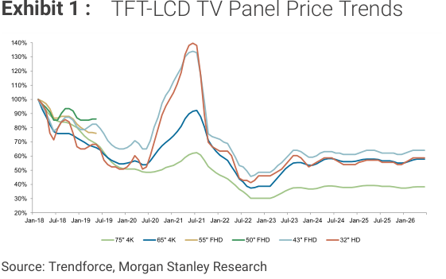
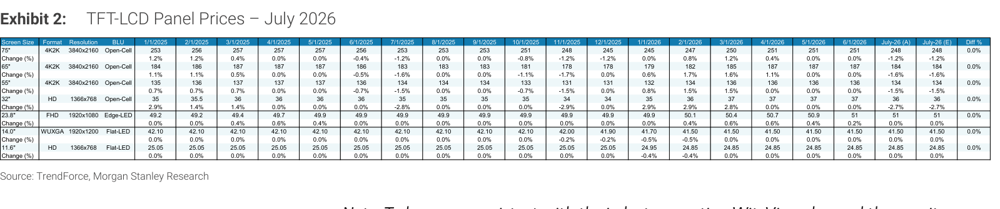
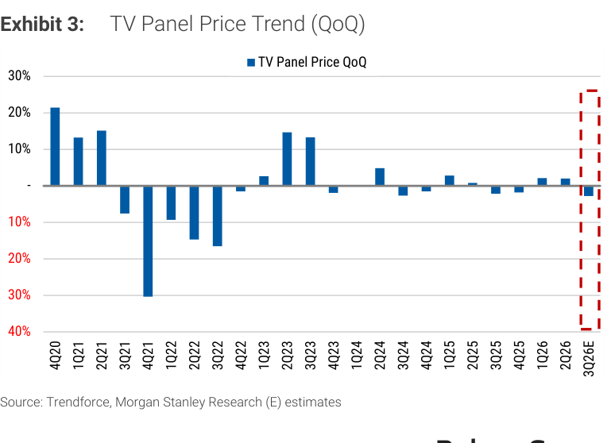
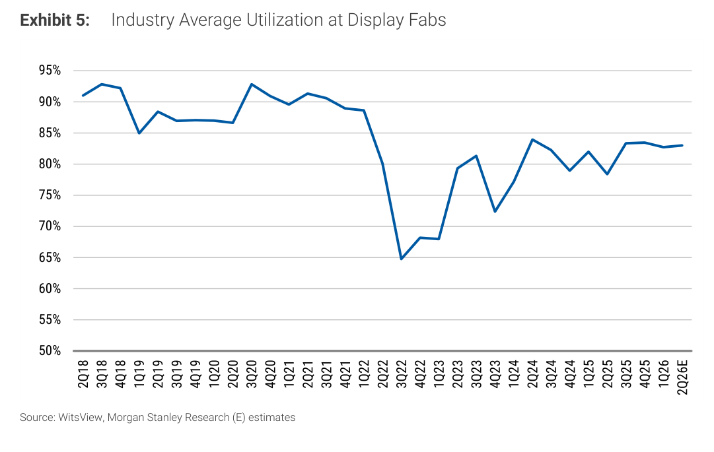
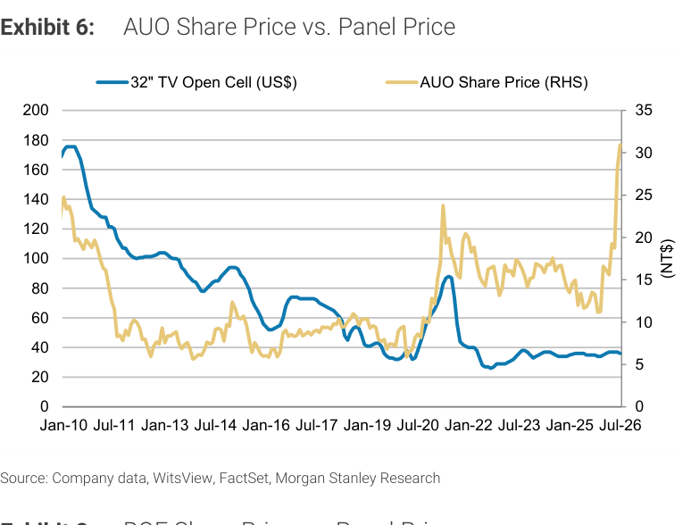
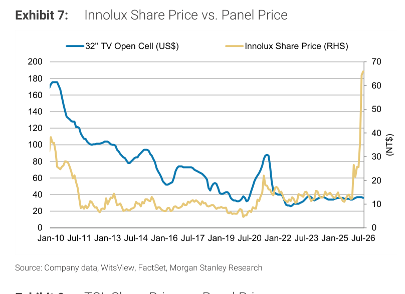
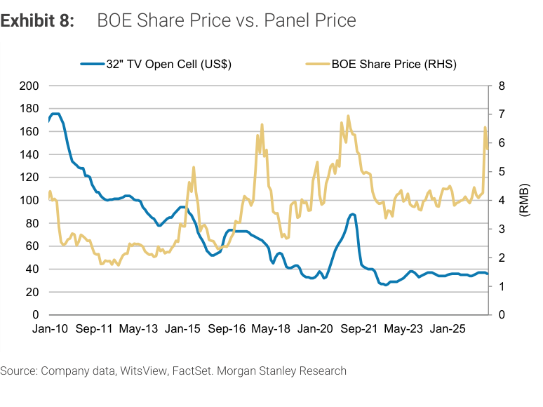
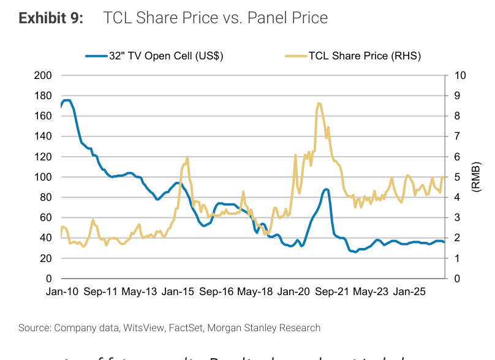
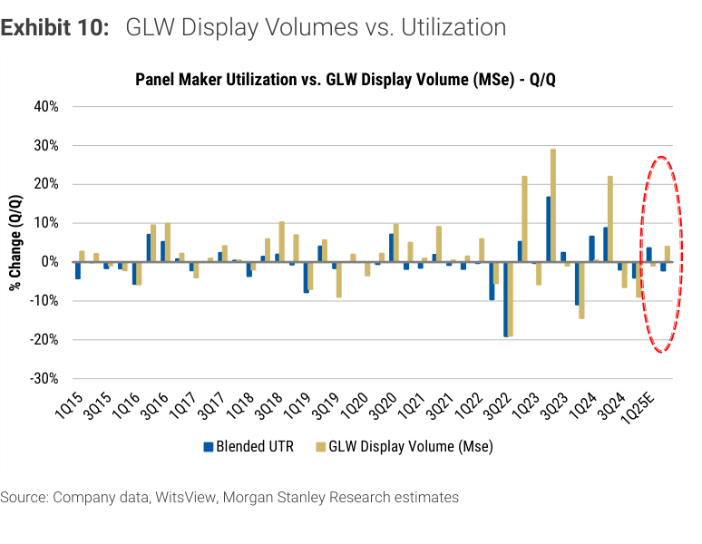

# MS｜TFT-LCD Panel Prices for July 2026: TVs -2%, IT Flat MoM

**券商**：Morgan Stanley  
**分析師**：Derrick Yang、Shawn Kim、Vivi Huang、Andy Meng CFA  
**日期**：2026-07-21（封面標示 Jul 20，系統日期以檔名 20260721 為準）  
**主題**：7月面板價格更新——TV 開始下行，IT 維穩，產業評級 In-Line  
**評級**：Greater China Tech Hardware：In-Line；S. Korea Technology：Attractive  
<a href="https://layx.uk/dl?g=產業&b=MS&d=20260721&h=2H-Jul-Panel-Px">📎 下載 PDF</a>

---

## 報告總結

MS 於 2026 年 7 月月度面板價格更新中指出，TV 面板價格在 7 月開始下滑（主流尺寸 -1% 至 -3% MoM），符合 MS 預期；IT 面板（Monitor、NB）持平，面板廠在零件成本壓力下不願降價。觸發因子是 1H26 大型賽事（冬奧、世足）帶動的提前備貨動能消退，導致 2H26 面板出貨低於季節性水準。

整體投資建議維持審慎——台灣 AUO 與 Innolux 估值修正後勉強合理（P/B 1.3–1.7x），玻璃基板機會（先進封裝）貢獻時程超過 2028，現在就計入過早；中國 BOE 優於 TCL（規模與玻璃基板進度領先）；Corning 受惠於面板廠稼動率及光纖通訊復甦。

---

## MS 完整投資邏輯鏈

| 論點層次 | Exhibit | 內容 |
|---|---|---|
| 需求前移確認 | Ex. 3, 4 | 1H26 大型賽事提前拉貨，2H26 TV 出貨低於季節性，IT 亦放緩 |
| 供給自律支撐底部 | Ex. 5 | 2Q26 稼動率維持 80-85%，中國廠商轉向獲利優先，供應週期縮短至季度 |
| TV 價格開始下行 | Ex. 1, 3 | 7 月 TV 各尺寸 -1% 至 -3% MoM，3Q26E 預計低 single-digit % QoQ 下行 |
| IT 價格近期持穩 | Ex. 4 | 7 月 IT 持平，3Q26E 預計持平 QoQ，廠商拒絕讓利 |
| 估值修正後合理 | Ex. 6-9 | TW 名稱 P/B 1.3-1.7x；玻璃基板機會 >2028 才有貢獻 |
| 個股排序 | 封面 | **BOE > AUO ≈ Innolux > TCL；Corning 受惠稼動率** |

> **報告最大邏輯缺口**：TV 供給自律假設——若面板廠為搶市佔在需求轉弱時提升稼動，下行幅度可能超出「low single-digit %」的溫和預測。

---

## 報告核心觀點

| 主題 | MS 觀點 | 市場共識 | 是否 Contra-Consensus |
|---|---|---|---|
| TV 面板 3Q26 走勢 | 低 single-digit % QoQ 下行，非崩跌 | 部分市場擔心更大幅下行 | 是（MS 較為樂觀，強調供給自律） |
| IT 面板 3Q26 走勢 | 持平 QoQ | 普遍預期 IT 軟化 | 輕微 Contra-Consensus（MS 對 IT 相對中性） |
| 玻璃基板概念入股時機 | 尚早，>2028 才有貢獻 | 部分投資人已定價玻璃機會 | 是（MS 明確說現在計入「過早」） |
| BOE vs TCL | 偏好 BOE（規模+玻璃進度更快） | 市場對 A 股面板廠多無明顯排序 | 是 |

**個股偏好排序**：BOE（2.5x P/B 目標）＞ AUO（EW, NT\$27, 1.4x P/B）≈ Innolux（EW, NT\$60, 2.1x P/B）＞ TCL（EW, RMB4.70, 1.7x P/B）；LGD 謹慎（0.8x P/B 估值仍偏貴）；Corning 正向（稼動率+光纖雙引擎）

---

## Exhibit 1｜TFT-LCD TV Panel Price Trends

### 解讀摘要

長期來看，TV 面板價格（以 Jan-18=100% 為基準）從 2018 年高點（~130-140%）一路下滑至 2022 年谷底（32" HD 降至 ~30%），2023-2024 年出現週期性反彈，目前各尺寸穩定在 40-65% 區間——代表面板廠是在一個長期結構性低價格環境中運作。75" 大尺寸相對抗跌（佔比較小、高檔），32" HD 最便宜（市佔最大、競爭最烈）。這張圖的投資意義是：目前面板價格距歷史高點仍遠，價格反彈空間結構性受限，任何「上行週期」幅度都難以回到 2021 年水準。

---

## Exhibit 2｜TFT-LCD Panel Prices – July 2026

### 解讀摘要

7 月面板價格表顯示，TV 各主流尺寸實際價（A）與 MS 估計（E）完全吻合（Diff = 0.0%），代表 MS 本月預測準確。TV 尺寸全面下滑，IT 尺寸（Monitor 23.8"、NB 14.0"/11.6"）持平，反映出兩個市場截然不同的需求動態——TV 受 1H26 備貨後回補需求消退，IT 廠商則因成本壓力強撐價格。

> **原文補充**：WitsView 自 2025 年 1 月起改為每月 5 日發布全月預覽、20 日發布實際終值（原為每月上下半月各一次），本報告的 July-26 (A) 即 20 日終值。

### 表格（TV 尺寸關鍵價格 — July 2026）

| 尺寸 | 格式 | 解析度 | 背光 | June-26 US\$ | July-26 (A) US\$ | MoM 變動 |
|---|---|---|---|---|---|---|
| 75" | 4K2K | 3840×2160 | Open-Cell | 251 | 248 | -1.2% |
| 65" | 4K2K | 3840×2160 | Open-Cell | 187 | 184 | -1.6% |
| 55" | 4K2K | 3840×2160 | Open-Cell | 136 | 134 | -1.5% |
| 32" | HD | 1366×768 | Open-Cell | 37 | 36 | -2.7% |
| 23.8" | FHD | 1920×1080 | Edge-LED | 51 | 51 | 0.0% |
| 14.0" | WUXGA | 1920×1200 | Flat-LED | 41.50 | 41.50 | 0.0% |
| 11.6" | HD | 1366×768 | Flat-LED | 24.85 | 24.85 | 0.0% |

*June-26 值取自前一月欄位（視覺讀取）

> **洞察一**：TV 降幅呈「尺寸越小、降幅越大」分布（32" -2.7% vs 75" -1.2%），反映大尺寸需求相對穩健、品牌對價格較不敏感；小尺寸競爭更激烈。

---

## Exhibit 3｜TV Panel Price Trend (QoQ)

### 解讀摘要

TV 面板季度 QoQ 趨勢圖顯示，2026 年前三季均持平或輕微正值，而 3Q26E（紅框標示）首度轉負——符合 MS「TV 面板自 3Q26 起進入下行」的核心判斷。圖中可見歷史上曾出現大幅修正（2Q21 約 -30%），目前市場明顯更有紀律；3Q26E 的負值幅度遠小於過去週期，印證供給自律「軟著陸」而非崩跌。

### 表格（近期季度 QoQ，視覺估算）

| 季度 | TV 面板 QoQ |
|---|---|
| 1Q26 | +2% |
| 2Q26 | 0% |
| 3Q26E | -3% 至 -5%（估計範圍）|

*以上為視覺估算

> **值得驗證**：3Q26E 的 QoQ 降幅取決於 8-9 月品牌備貨力道（MS 列為「下個關鍵檢查點」）。若年底促銷前備貨早於預期啟動，降幅可能收窄至 -1 至 -2%。

---

## Exhibit 4｜IT Panel Price (QoQ)

### 解讀摘要

IT 面板（Monitor + NB）的季度 QoQ 走勢圖顯示，3Q26E（紅框）預估 Monitor 輕微正值、NB 接近持平，兩者均與 TV 的轉負形成對比。驅動因子不同：IT 廠商面臨原物料（零件）成本壓力，寧可維持高稼動率也不願讓利，因此即使需求放緩，價格下行空間有限。這說明 MS 預測的 3Q26E IT「持平 QoQ」不是因為需求強勁，而是廠商定價紀律的結果。

### 表格（近期季度 QoQ，視覺估算）

| 季度 | Monitor 面板 QoQ | NB 面板 QoQ |
|---|---|---|
| 1Q26 | +1% | +1% |
| 2Q26 | 0% | -1% |
| 3Q26E | +1% 至 +2% | 0% |

*以上為視覺估算

---

## Exhibit 5｜Industry Average Utilization at Display Fabs

### 解讀摘要

面板廠平均稼動率自 2022 年谷底（65%）反彈，2025 年底至 2026 年 2Q 穩定在 80-85%——這個水準是結構性改善的表現，背後是中國廠商由量轉利、政府補貼縮減、LGD Guangzhou Gen8.5 廠賣給 TCL、Sharp Gen10 關廠等供給重組。2Q26E 稼動率持平 QoQ（約 82%），顯示供給自律繼續支撐底部，MS 預期即使 3H26 需求轉弱，稼動率也不會大幅拉升。

### 表格（近期稼動率，視覺估算）

| 季度 | 產業平均稼動率 |
|---|---|
| 4Q24 | 80% |
| 1Q25 | 82% |
| 2Q25 | 78% |
| 3Q25 | 80-85% |
| 4Q25 | 80-85% |
| 1Q26 | 80-85% |
| 2Q26E | 80-83% |

*以上為視覺估算；原文提供部分確認值

> **洞察二**：稼動率在 80-85% 這個區間可「維持利潤、避免崩跌」但無法支撐大幅漲價。面板廠將在量減但不崩的前提下維持利潤，投資人不應期待 2021-2022 年式的暴力上行週期再現。

---

## Exhibit 6｜AUO Share Price vs. Panel Price

### 解讀摘要

AUO 股價與 32" TV 開放式面板價格（US$）的 15 年走勢對比顯示，兩者存在明顯相關性——面板價格下行期（2018-2022）AUO 股價也長期低迷，2020-2021 面板超級週期期間股價攀升至 NT$25+，之後隨面板下行跌至 NT$10 以下。目前面板價格在 US$36 附近盤整，AUO 股價近期從峰值 NT$30 附近大幅修正。MS 給 EW + NT$27 目標（1.4x 2026E P/B），認為目前估值「尚合理」，玻璃基板機會的定價需等 2028 後。

---

## Exhibit 7｜Innolux Share Price vs. Panel Price

### 解讀摘要

Innolux 近期股價從 NT$65+ 高點急速拉回（與面板超级週期及玻璃基板炒作有關），目前回歸 NT$15-20 區間，更貼近面板價格走勢所暗示的基本面位置。MS 認為 Innolux 確實參與了一家晶圓廠客戶的玻璃基板項目，但量產時程在 2028 前難有實質貢獻，且進入競爭者可能增加。EW + NT$60 目標（2.1x P/B）顯示 MS 仍認為有向上空間，但並不積極推薦。

---

## Exhibit 8｜BOE Share Price vs. Panel Price

### 解讀摘要

BOE 股價（RMB）走勢相對穩定，目前約 RMB4.5，對應 1.6x 2026E P/B。MS 目標 RMB9.30（2.5x P/B），相對於 ROE 5-8% 的估值是偏高的設定，但邏輯在於 BOE 是最快推進玻璃基板（advanced packaging）的面板廠，且規模最大（佔中國面板出貨超 50%）。相比 TCL，BOE 在同一面板價格環境下擁有更高的運營槓桿和成本控制能力。

---

## Exhibit 9｜TCL Share Price vs. Panel Price

### 解讀摘要

TCL 股價（RMB）目前約 RMB4.5-5，估值 1.7x 2026E P/B，高於其自 2022 年以來的中週期均值 1.4x，MS 給 EW + RMB4.70（1.7x P/B）。在 MS 的框架中 TCL 劣於 BOE 的原因是：規模較小、玻璃基板進度落後，且股票估值已反映中週期以上的溢價，上行空間有限。

> **洞察三（配合 Exhibit 8）**：BOE vs TCL 在股價接近（4.5 RMB 附近）的情況下，MS 偏好 BOE 的核心邏輯是「玻璃基板進度差距 + 規模槓桿」，而非當期面板價格敏感度。若玻璃基板量產時程延後（MS 自己已說 >2028），BOE 的估值溢價就需重新評估。

---

## Exhibit 10｜GLW Display Volumes vs. Utilization

### 解讀摘要

Corning（GLW）顯示部門出貨量 QoQ 變化與面板廠混合稼動率的歷史對比圖，可作為 Corning 顯示業務的前瞻指標——面板廠稼動率上升 → 需要更多玻璃 → Corning 出貨量增加，反之亦然。1Q25E 圖中標示的紅圈顯示 Corning 出貨量 QoQ 略為轉負、稼動率小幅正值，是短期背離，但 MS 認為 Corning 顯示業務長期受益於稼動率維持在 80%+ 水準，加上外匯相關的價格提升。

*Exhibit 11（GLW Display Revenue vs. Utilization）與本圖完全一致（同圖例、同數據），判定為真重複，已刪除。*

---

## 相關個股清單

| 類別 | 公司 | Ticker | 評等 | 備註 |
|---|---|---|---|---|
| 台灣面板廠 | AUO | 2409.TW | EW | NT\$27 目標（1.4x P/B）；玻璃基板貢獻 >2028 |
| 台灣面板廠 | Innolux | 3481.TW | EW | NT\$60 目標（2.1x P/B）；玻璃基板參與但時程不確定 |
| 中國面板廠 | BOE | 000725.SZ | 首選 | RMB9.30 目標（2.5x P/B）；規模+玻璃進度最快 |
| 中國面板廠 | TCL | 000100.SZ | EW | RMB4.70 目標（1.7x P/B）；估值偏貴 |
| 韓國面板廠 | LG Display | 034220.KS | 謹慎 | 0.8x P/B，歷史中週期 0.5x，尚未轉多 |
| 美國玻璃供應商 | Corning | GLW.N | 正向 | 顯示+光纖雙驅動；稼動率指標最直接受益 |
| 台灣 DDIC | Novatek | 3034.TW | UW | PC/手機/車用需求弱，毛利承壓 |
