# MS｜2026 上海 WAIC 深度觀察：SuperPod 驅動中國 AI 算力競爭上移系統層

**券商**：Morgan Stanley  
**分析師**：Charlie Chan、Henry Zhao、Daisy Dai CFA、Daniel Yen CFA、Lucas Wang、Tiffany Yeh、Ethan Jia  
**日期**：2026-07-21  
**主題**：2026 上海 WAIC 展覽觀察 + 中國科技巡迴（7/16-17）  
**評級**：Greater China Semiconductors — Attractive  
<a href="https://layx.uk/dl?g=產業&b=MS&d=20260721&h=Shanghai-WAIC-2026">📎 下載 PDF</a>

---

## 報告總結

MS 團隊直擊 2026 上海 WAIC，核心觀察：競爭焦點從單晶片規格轉向系統級 SuperPod，幾乎每家國產加速器廠商都展示了 64-128 卡規模的超算解決方案。Huawei Atlas 950 SuperPod 達到 1,024 個 Ascend 950DT NPU（較 CloudMatrix 384 的 384 顆翻近 3 倍），記憶體池高達 256TB。P/D 拆分推論成為新主題，一種配置將 90% 國產算力用於 prefill、10% H20 用於 decode，吞吐量提升 54%、首詞延遲降低 64%。

從投資角度，中國 AI GPU TAM 預計從 2025 年 US\$32bn 成長至 2030 年 US\$91bn，本土芯片自給率同期從 42% 升至 70%；在 TCO 層面，國產晶片可比 Nvidia 低 30-60%，token 成本已達到或超越。MS 首選 Cambricon、Iluvatar、Hygon（OW），設備端偏好 NAURA、AMEC、ACM Research、ASMPTc（全 OW）。

---

## MS 完整投資邏輯鏈

| 論點層次 | Exhibit | 內容 |
|---|---|---|
| 系統競爭加速 | 4 | WAIC 2026 重心從晶片規格轉至 SuperPod：幾乎所有廠商展示 64-128 卡系統，Huawei Atlas 950 達 1,024 NPU |
| 技術路徑分歧 | 6、8 | 兩種架構並行：midplane-free 正交設計（Huawei/ZTE）vs 傳統 cable-tree；DF1000 走 3D 堆疊路線繞過製程節點限制 |
| 需求持續爆發 | 13、14 | ByteDance 月處理 token 數 Dec-25 達 1,900T；中國雲端 capex 2026E US\$105bn（+42% YoY） |
| 自給率快速提升 | 9、10 | 2030E AI GPU TAM US\$91bn，本土芯片自給率從 42%（2025E）升至 70% |
| 成本競爭力確立 | 15 | 國產晶片 TCO 較 Nvidia 低 30-60%；頂尖廠商 per-token 成本已與 Nvidia 相當或更優 |
| **結論** | 封面 | **OW：Cambricon、Iluvatar、Hygon；設備：NAURA、AMEC、ACM Research、ASMPTc；晶圓：SMIC OW** |

> **報告最大邏輯缺口**：P/D 拆分推論中，90% 國產 prefill + 10% H20 decode 的配置隱含對 H20 的持續依賴；若 H20 出口管制進一步收緊，此架構是否能以純國產替代尚未論述。

---

## 報告核心觀點

| 主題 | MS 觀點 | 市場共識 | 是否 Contra-Consensus |
|---|---|---|---|
| 競爭焦點 | 從晶片轉向系統（SuperPod、互連、軟體） | 多數仍聚焦晶片規格比較 | 是，較早提出系統層競爭 |
| Huawei Atlas 950 | 1,024 NPU + UnifiedBus 2.0 = 本土大模型訓練的硬體基礎 | 市場認識尚淺 | 是 |
| 國產芯片 TCO | 30-60% 低於 Nvidia，token cost 已相當或更優 | 仍普遍認為國產僅次選 | 是，MS 主張已具競爭力 |
| AI GPU TAM | US\$91bn（2030E），CSP 主導，自給率達 70% | 多數預測 <US\$70bn | 是，偏樂觀 |
| P/D 拆分 | 成為主流推論優化方向，可顯著提升吞吐 | 多數視為小眾架構 | 是 |

**偏好排序**：Cambricon > Iluvatar > Hygon > MetaX（EW）；設備：NAURA / AMEC / ACM Research / ASMPTc；晶圓：SMIC OW，Hua Hong EW

---

## Exhibit 1｜Huawei Atlas 950 SuperPod 外觀

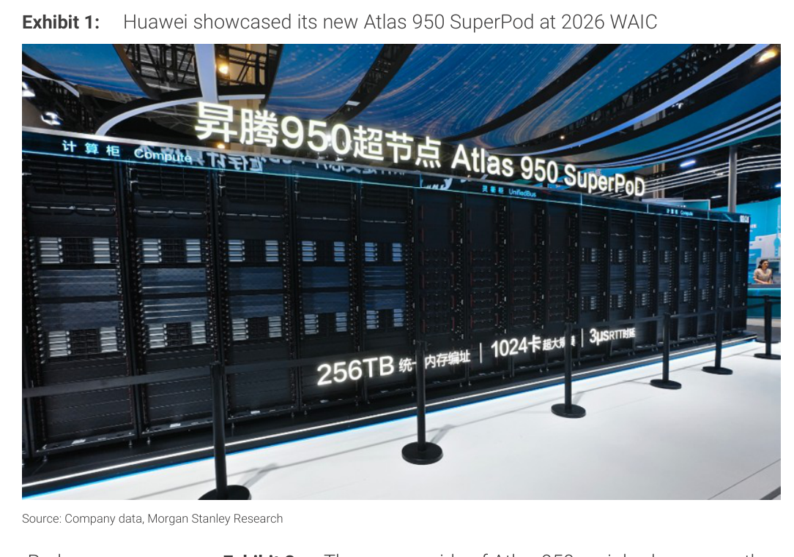

### 解讀摘要

Atlas 950 是 Huawei 在 WAIC 2026 亮相的新一代 SuperPod，核心標識「1024 卡、256TB 統一記憶體池、3μs RTT」直接標示在系統外殼，代表硬體規格的大幅躍升（前代 CloudMatrix 384 為 384 卡）。展覽現場展示物理系統而非模型，說明硬體開發已具實體成果，不僅是概念展示。

---

## Exhibit 2｜Atlas 950 NPU 刀片（8P FullMesh 全光互連）

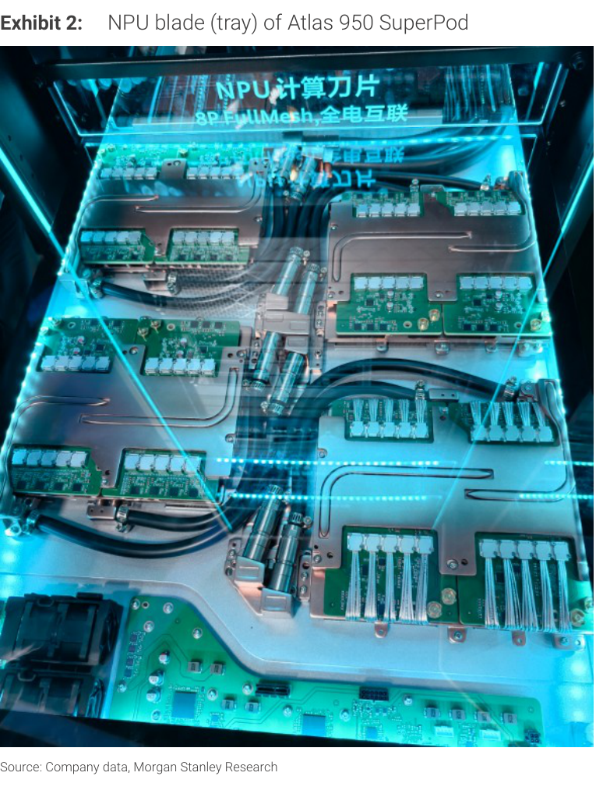

### 解讀摘要

NPU 刀片的透明展示揭示 Atlas 950 的板卡層級互連架構：8 顆 NPU 以 FullMesh 拓撲直連，搭配全電互聯（All-electric）與光互連模組並排。這種「刀片內銅連、機櫃間光連」的分層設計，是 UnifiedBus 2.0 在物理層的實現，短距用銅以降低延遲與功耗，長距用光以維持頻寬與可靠性。

---

## Exhibit 3｜Atlas 950 背面：UBlink 光互連模組

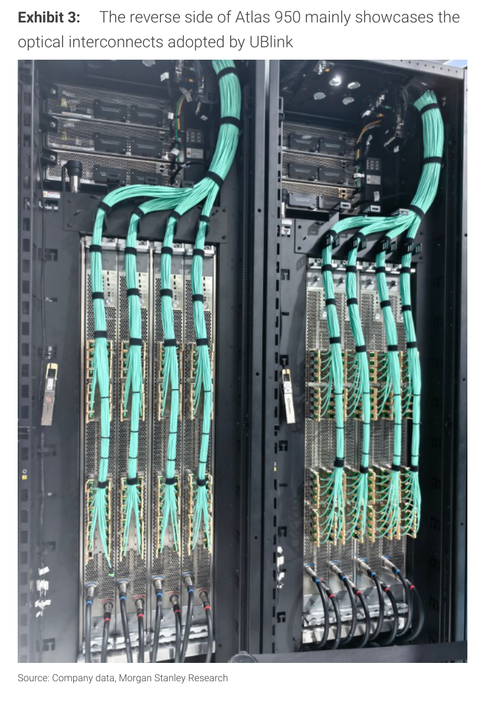

### 解讀摘要

Atlas 950 背面密集部署 UBlink 光纖束，是跨機櫃光互連的實物呈現。光纖數量龐大說明 1,024 NPU 全對全通訊所需的頻寬規模，也顯示光互連零件（包含光模組、光纖束、光路保護模組）是 Atlas 950 的核心差異化來源。若國產光互連供應鏈能持續支撐，此設計優勢可延伸至 Atlas 950 以後的產品。

---

## Exhibit 4｜2026 WAIC 主要 SuperPod 方案比較

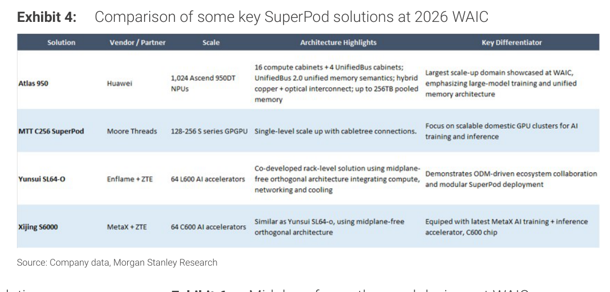

### 解讀摘要

WAIC 2026 展示的 SuperPod 方案呈現明顯的架構分歧：Huawei 走「統一記憶體 + 光互連」的大規模路線（1,024 NPU），而 Enflame（搭配 ZTE）與 MetaX（搭配 ZTE）則採用「Midplane-free 正交架構」的 64 卡系統，Moore Threads 走電纜樹拓撲。這顯示中國 AI 系統設計生態已具備多元競爭方向，ODM 整合能力（伺服器+互連+散熱+電源）成為新差異點。

### 表格

| 系統名稱 | 廠商/夥伴 | 規模 | 架構特色 | 主要差異點 |
|---|---|---|---|---|
| Atlas 950 | Huawei | 1,024 Ascend 950DT NPU | UnifiedBus 2.0 統一記憶體；混合銅光互連；最高 256TB pooled memory | WAIC 最大規模 scale-up，主打大模型訓練與統一記憶體架構 |
| MTT C256 SuperPod | Moore Threads | 128-256 S 系列 GPGPU | 電纜樹（cabletree）連線，單層 scale-up | 聚焦可擴展的國產 GPU 叢集用於 AI 訓練與推論 |
| Yunsui SL64-O | Enflame + ZTE | 64 L600 AI 加速器 | Midplane-free 正交架構；整合計算、網路、散熱 | ODM 驅動的生態系協作，展示模組化 SuperPod 部署 |
| Xijing S6000 | MetaX + ZTE | 64 C600 AI 加速器 | Midplane-free 正交架構（同 Yunsui SL64-O） | 搭載 MetaX 最新 AI 訓練+推論加速器 C600 |

> **洞察一**：Enflame 與 MetaX 共用 ZTE 的 Midplane-free 正交方案，顯示 ODM（ZTE）已在 AI 伺服器系統整合中扮演類似 Nvidia 生態中 Quanta/Wiwynn 的角色，形成「晶片廠 + ODM」的搭檔模式，供應鏈集中度值得留意。

---

## Exhibit 5｜Enflame SuperPod（與 ZTE 共同開發）

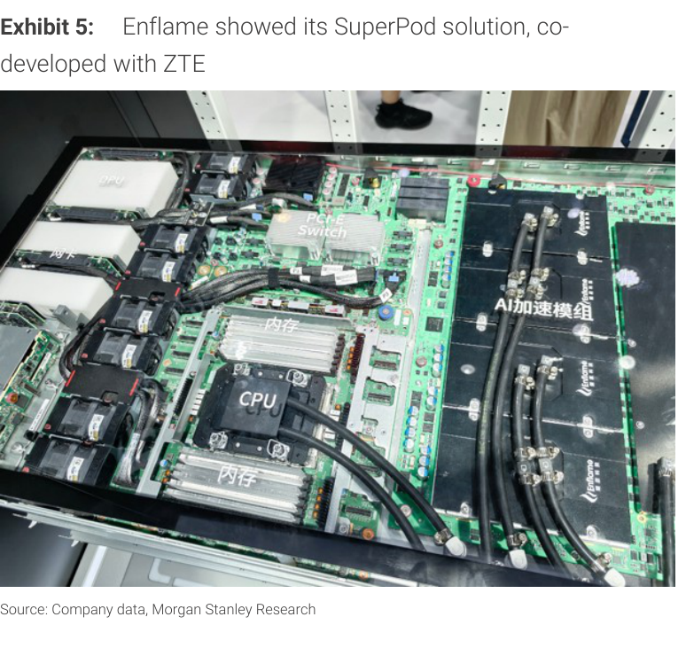

### 解讀摘要

Enflame SuperPod 展示了節點層級的硬體配置：透明板卡清楚顯示 PCIe Switch、CPU、HBM 記憶體（內存）及 AI 加速模組的相對位置，GPU-to-CPU 比例約 4:1 或 8:1。此配置反映現階段中國 AI 工作負載仍以推論為主，AI Agentic 需求尚未大量擴展，因此 CPU 瓶頸不突出。

---

## Exhibit 6｜WAIC 展場 Midplane-free 正交設計實物

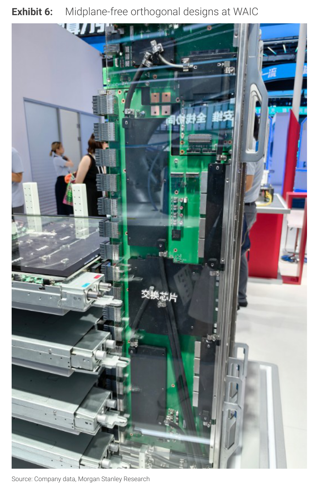

### 解讀摘要

Midplane-free 正交設計實物清楚呈現「去掉中央大型 PCB」的架構：前後板垂直互插，連接器直接對接，省略傳統 Backplane 所需的高層數 PCB。此設計降低大型 midplane 的製造難度與良率風險，縮短電氣路徑；代價是機械設計與連接器複雜度提升。展場看到「交換芯片」標示，說明 Enflame/MetaX 方案的網路層採用專用 switch chip，而非 Huawei 的 UnifiedBus 專屬方案。

---

## Exhibit 7｜Iluvatar 天柱（Tiangai）300 芯片

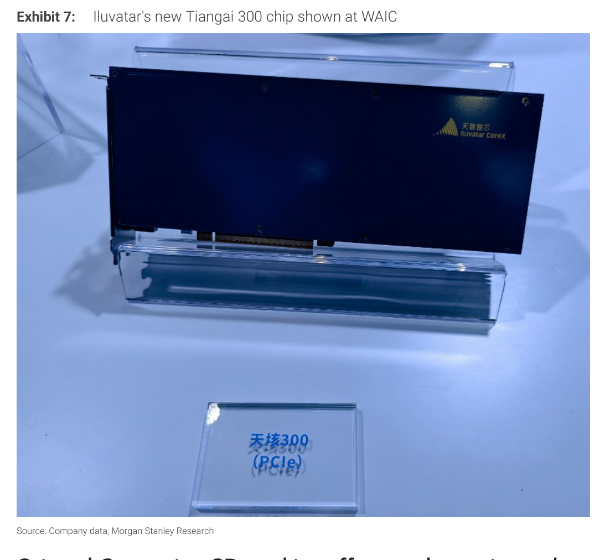

### 解讀摘要

Tiangai 300（天柱 300）以 PCIe 卡形態展示，產品定位延伸至 prefill 與 decode 兩個推論階段——此前 Tiangai 150 主打 prefill。依供應鏈確認，Tiangai 300 採用 HBM3E（~4TB/s），144GB 記憶體容量。管理層表示在 DeepSeek V3.2 和 GLM 5.2 等國產 LLM 測試中，prefill 和 decode 性能均超越 H100，但仍落後 Blackwell 世代。展品形態表明已有工程樣品，預計 2025 年出貨約 10 萬張卡。

---

## Exhibit 8｜東方算象 DF1000：3D 堆疊 AI 芯片

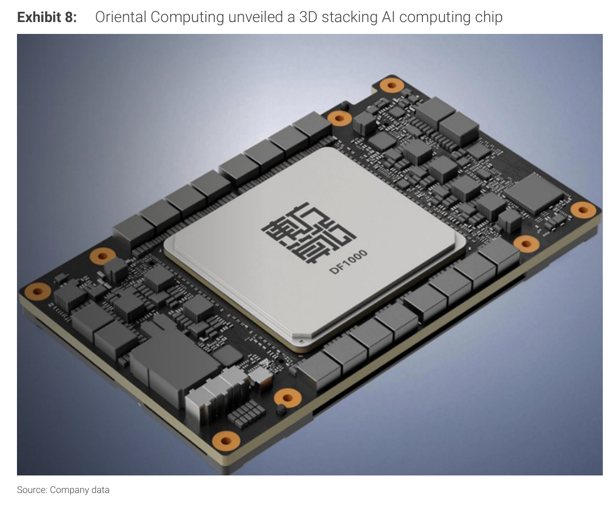

### 解讀摘要

東方算象（Oriental Computing）DF1000 採用 14nm 國產製程 + Wafer-level hybrid bonding 3D 堆疊（DRAM 與 Logic 垂直整合），聲稱記憶體頻寬 6.4TB/s、BF16 算力 520TFLOPS，128 卡叢集已完成穩定性驗證。此設計與 Huawei 的「T-Scaling」理念相似——以 3D 封裝架構繞過製程節點限制，代表中國在算法（MoE）、架構（SuperPod）、封裝（3D 堆疊）三條技術路線同步推進，不依賴先進製程節點。

> **原文補充**：DF1000 為私人公司產品，目前尚無外部融資或量產計劃確認，128 卡叢集穩定性驗證是已知最新進度。

---

## Exhibit 9｜中國 AI GPU TAM 預測（2023-2030E）

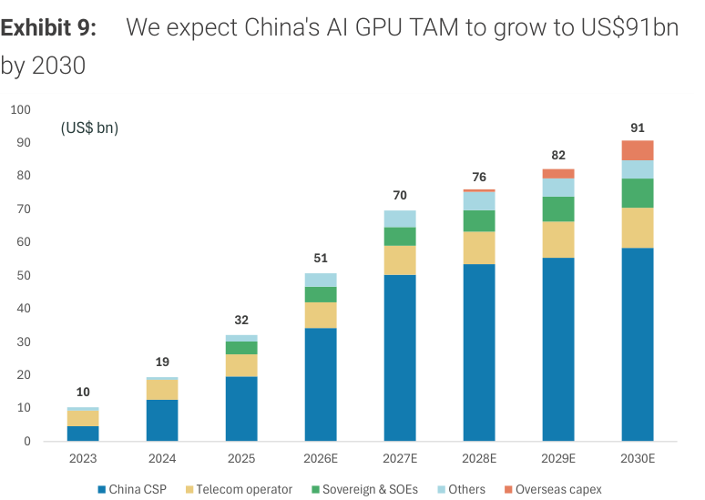

### 解讀摘要

MS 預估中國 AI GPU TAM 將從 2023 年 US\$10bn 成長至 2030 年 US\$91bn，2025-2030 CAGR 約 24%。驅動力以中國 CSP（雲端服務商）為主，電信運營商、主權基金/國企次之。值得注意的是 2028 年（US\$76bn→2027 年 US\$70bn）出現輕微減速，後 2029 年再加速至 US\$82bn，可能反映 capex 週期的自然波動。

### 表格

| 年度 | AI GPU TAM（US\$ bn） | 主要驅動 |
|---|---|---|
| 2023 | 10 | — |
| 2024 | 19 | CSP 起步 |
| 2025 | 32 | CSP 加速 |
| 2026E | 51 | CSP 主導 |
| 2027E | 70 | CSP + 主權 |
| 2028E | 76 | 週期微放緩 |
| 2029E | 82 | 再加速 |
| 2030E | 91 | CSP+電信+海外 capex |

> **洞察一**：2023→2030 成長 9.1x，等同 24% CAGR，但 2027→2028 僅 +9%——若此放緩幅度更深，2029 年的加速反彈假設即存在不確定性，是最需監測的年份。

---

## Exhibit 10｜中國 AI 芯片自給率趨勢（2021-2030E）

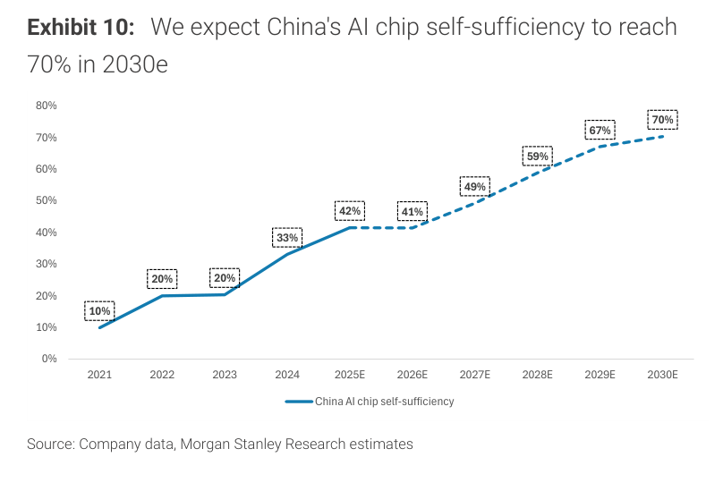

### 解讀摘要

中國 AI 芯片自給率從 2021 年 10% 上升至 2025E 42%，至 2030E 預計達 70%。2025E→2026E 出現 42%→41% 的輕微下滑，可能反映總需求爆增但本土供給跟不上 TAM 增速的短期失衡（類似 2022→2023 年 20%→20% 停滯）。這個框架對 Exhibit 9 的 TAM 預測有配套意義：自給率愈高，國產廠商能取得的市場份額愈大。

### 表格

| 年度 | 自給率 |
|---|---|
| 2021 | 10% |
| 2022 | 20% |
| 2023 | 20% |
| 2024 | 33% |
| 2025E | 42% |
| 2026E | 41% |
| 2027E | 49% |
| 2028E | 59% |
| 2029E | 67% |
| 2030E | 70% |

> **洞察一（配合 Exhibit 9）**：自給率 41% × TAM US\$51bn = 國產廠商 2026E 可及市場約 US\$21bn；若 2030E 自給率 70% × TAM US\$91bn = 約 US\$64bn，對應 3x 以上的市場擴張，遠大於 TAM 本身的 1.8x 增長。

---

## Exhibit 11｜中美 AI 產業優勢雷達圖（0-10 分）

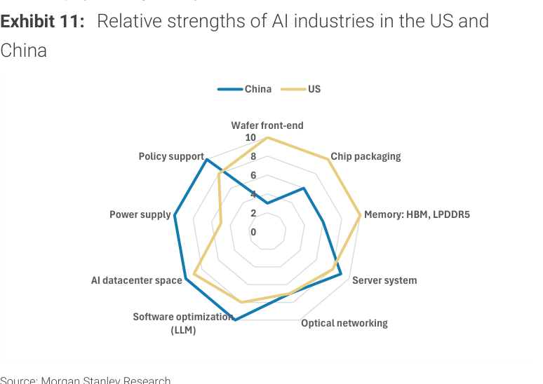

### 解讀摘要

中美 AI 產業差距的雷達圖呈現出不對稱格局：美國在晶圓前段製程、記憶體（HBM/LPDDR5）方面擁有明顯領先，中國在政策支持和 AI 資料中心空間（土地/電力）方面領先，封裝、伺服器系統、光互連、軟體優化相對平衡。這與本次 WAIC 的觀察一致——中國在系統整合（SuperPod）和光互連方面的競爭力正快速追趕，正是填補「晶片節點落後」缺口的替代路徑。

### 表格（視覺估算，僅供方向參考）

| 維度 | 中國 | 美國 |
|---|---|---|
| 晶圓前段製程 | 4 | 9 |
| 芯片封裝 | 7 | 7 |
| 記憶體（HBM/LPDDR5） | 3 | 8 |
| 伺服器系統 | 6 | 7 |
| 光互連 | 6 | 7 |
| 軟體優化（LLM） | 6 | 7 |
| AI 資料中心空間 | 8 | 6 |
| 電源 | 6 | 7 |
| 政策支持 | 9 | 5 |

*以上為視覺估算*

---

## Exhibit 12｜中國主流 AI LLM 平均 Token 定價趨勢

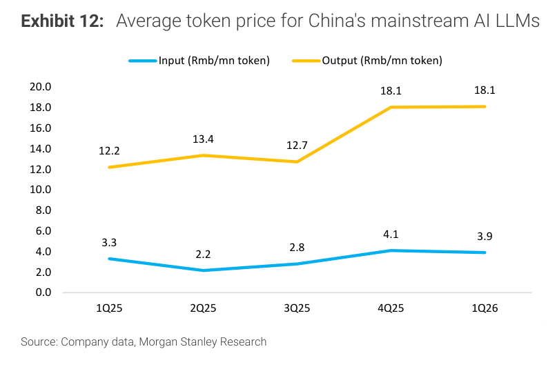

### 解讀摘要

中國 AI LLM token 輸出定價從 1Q25 Rmb12.2/mn 升至 4Q25 Rmb18.1/mn（+48%），並維持至 1Q26。輸入定價相對穩定（Rmb3-4/mn）。定價反彈（3Q25→4Q25）與 ByteDance Doubao 流量爆增時間點接近（見 Exhibit 13），說明需求超過供給的情境支撐了定價能力。輸出定價遠高於輸入（約 4-5x），意味 decode 端資源稀缺性仍在主導價格結構。

### 表格

| 季度 | 輸入（Rmb/mn token） | 輸出（Rmb/mn token） |
|---|---|---|
| 1Q25 | 3.3 | 12.2 |
| 2Q25 | 2.2 | 13.4 |
| 3Q25 | 2.8 | 12.7 |
| 4Q25 | 4.1 | 18.1 |
| 1Q26 | 3.9 | 18.1 |

> **洞察一**：輸出/輸入比 ~4.6x（1Q26），代表 decode 的記憶體頻寬成本被大幅轉嫁給用戶；若 P/D 拆分推論降低 decode 成本，輸出定價可能走向軟化——對 AI 算力需求而言是正面（Jevons' Paradox），對國產 decode 加速器則是利多。

---

## Exhibit 13｜ByteDance (Volcano Engine/Doubao) 月 Token 量

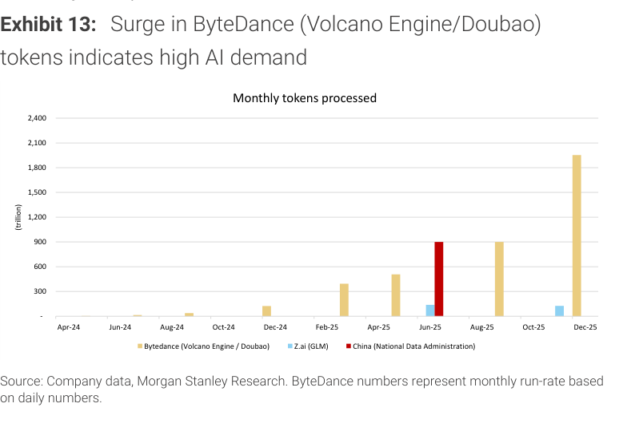

### 解讀摘要

ByteDance Doubao 月處理 token 量從 2024 年中接近 0，在 2025 年呈爆炸式成長，Dec-25 達約 1,900T（trillion tokens/月）。同期中國國家數據局在 Jun-25 提供的官方數據為約 900T，Z.ai 數量相對小得多（約 100-200T）。ByteDance 數據基於每日數字外推月跑率，增速在 2025 年下半年呈指數爆發態勢，是中國 AI 需求真實性的最強證據之一。

> **洞察一**：Dec-25 ByteDance 月 token 量 ~1,900T 若維持，意味 2026E 年處理量將超過 20,000T（2萬兆 tokens），與 2024 年全年量相比可能超過 100 倍——這直接驅動 GPU 需求，並印證了 Exhibit 9 的 TAM 成長假設。

---

## Exhibit 14｜中國與全球雲端 Capex 趨勢（2023-2026E）

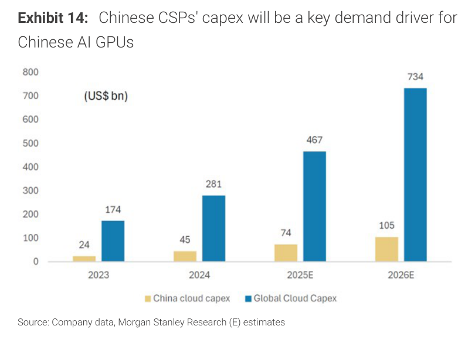

### 解讀摘要

中國雲端 capex 從 2023 年 US\$24bn 增至 2026E US\$105bn（+340%、CAGR 63%），而全球雲端 capex 同期從 US\$174bn 增至 US\$734bn（CAGR 62%）。中國佔全球比例從 14%（2023）穩定至約 14%（2026E），說明中國增速與全球同步而非特別領先——中國 AI 硬體需求本質上是全球 AI capex 大浪潮的一個比例分額。

### 表格

| 年度 | 中國 Cloud Capex（US\$ bn） | 全球 Cloud Capex（US\$ bn） | 中國佔比 |
|---|---|---|---|
| 2023 | 24 | 174 | 14% |
| 2024 | 45 | 281 | 16% |
| 2025E | 74 | 467 | 16% |
| 2026E | 105 | 734 | 14% |

> **洞察一（配合 Exhibit 9）**：全球 Cloud Capex 2026E US\$734bn，但中國 AI GPU TAM 僅 US\$51bn（約 7%），差距反映中國 AI 基礎設施支出中仍有大量非 GPU 投資（伺服器、網路、電力等），或部分 GPU 採購尚未計入本土 TAM。

---

## Exhibit 15｜國產 AI 芯片 TCO 與 per-token 成本 vs Nvidia

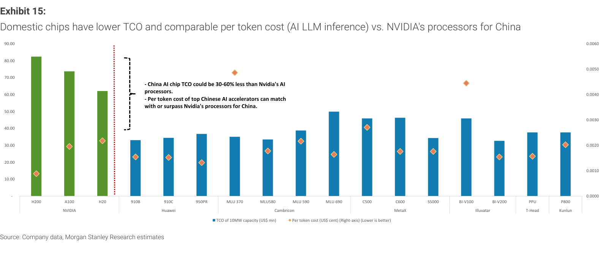

### 解讀摘要

這是本報告最有投資意涵的圖表：在 10MW 資料中心容量的 TCO 比較中，Nvidia H200（約 US\$83mn）、A100（US\$75mn）、H20（US\$63mn）明顯高於大多數國產芯片（約 US\$33-50mn），差異 30-60%。Per-token 成本方面，Huawei 910B、Cambricon MLU 580/590、MetaX C500/C600 等頂尖國產品達到或優於 Nvidia 在中國市場可供貨的 H20。這意味中國 CSP 選擇國產芯片不僅是政策導向，也具備真實的經濟理性。

### 表格（視覺估算）

| 芯片 | 廠商 | TCO 10MW（US\$ mn） | per-token cost（US\$ cent，右軸） |
|---|---|---|---|
| H200 | NVIDIA | 83 | 0.00085 |
| A100 | NVIDIA | 75 | 0.0020 |
| H20 | NVIDIA | 63 | 0.0022 |
| 910B | Huawei | 33 | 0.0016 |
| 910C | Huawei | 35 | 0.0016 |
| 950PR | Huawei | 37 | 0.0013 |
| MLU 370 | Cambricon | 35 | 0.0018 |
| MLU 580 | Cambricon | 34 | 0.0018 |
| MLU 590 | Cambricon | 39 | 0.0021 |
| MLU 690 | Cambricon | 50 | 0.0017 |
| C500 | MetaX | 46 | 0.0027 |
| C600 | MetaX | 46 | 0.0018 |
| S5000 | MetaX | 34 | 0.0018 |
| BI-V100 | Iluvatar | 46 | 0.0033 |
| BI-V200 | Iluvatar | 33 | 0.0015 |
| PPU | T-Head | 38 | 0.0015 |
| P800 | Kunlun | 38 | 0.0020 |

*以上為視覺估算*

> **洞察一**：TCO 最低的是 Huawei 910B（US\$33mn）與 Cambricon MLU 580（US\$34mn），分別比 H20 低 48%/46%。若此差距維持，中國 CSP 在算力擴張時，每美元購買的 inference capacity 可比使用 H20 高出約 1.9 倍——這是 Exhibit 9 TAM 加速的微觀基礎。
>
> **值得驗證**：Exhibit 15 的 per-token 數字是 MS 估算，非廠商實測。實際 per-token 成本高度依賴工作負載（MoE 模型 vs 密集模型、batch size、KV cache 大小）；若測試基準不同，排名可能移動。

---

## 相關個股清單

| 類別 | 公司 | Ticker | MS 評等 | 備註 |
|---|---|---|---|---|
| AI 加速器 | Cambricon | 688256 CH | OW | 訂單能見度強，Exhibit 15 MLU 系列 TCO 具競爭力 |
| AI 加速器 | Iluvatar CoreX | — | OW | Tiangai 300 擴入 decode；目標 2026 年出貨 10 萬卡 |
| AI 加速器 | Hygon Information | 688041 CH | OW | 供應鏈穩固 |
| AI 加速器 | MetaX | — | EW | C600 TCO 偏高，競爭壓力大 |
| 晶圓代工 | SMIC | 981 HK | OW | 先進節點擴產受益 |
| 晶圓代工 | Hua Hong | 1347 HK | EW | 8" 利用率 >110%，但 depreciation 壓力上升 |
| 半導體設備 | NAURA | 002371 CH | OW | 記憶體客戶三年能見度強 |
| 半導體設備 | AMEC | 688012 CH | OW | Memory + 先進邏輯雙線推進 |
| 半導體設備 | ACM Research | ACMR US | OW | — |
| 半導體設備 | ASMPTc | 522 HK | OW | — |
| OSAT / 封裝 | JCET | 600584 CH | — | CNY7.8bn 上海臨港新廠；AI 封裝早期，空間大 |
| CIS / 光學 | OmniVision | — | — | 光模組（TIA/SerDes）進入 DC 光互連，2年後放量 |
