# MS｜Cloud Semis: Unlikely to Slow Down

**券商**：Morgan Stanley  
**分析師**：Daniel Yen CFA、Charlie Chan、Daisy Dai CFA、Tiffany Yeh、Ethan Jia  
**日期**：2026-07-22  
**主題**：Greater China Semiconductors — Cloud Semis 定期更新  
**評級**：Attractive（Industry View）  
<a href="https://layx.uk/dl?g=產業&b=MS&d=20260722&h=Cloud-Semis">📎 下載 PDF</a>

---

## 報告總結

本報告由 MS 台灣 AI 晶片分析師團隊在 7 月 17–20 日赴上海 WAIC 參訪後發布，核心觸媒為 WAIC 現場觀察（AMD、Nvidia、Hygon 伺服器訂單增加、高端 x86 CPU 定價近翻倍 YoY）疊加 1Q26 美國四大 hyperscaler 法說後的 cloud capex tracker 上修（+92% YoY，較 3 月底預測 +87% YoY 再升 5ppt），加上 Aspeed 股利發行稀釋。Aspeed（5274，OW）是本次唯一有數字更新的標的，PT 從 NT\$21,324 下調 11% 至 NT\$20,888，純粹反映股利稀釋，基本面論點不變；ASIC BMC TAM 定量化（AWS+Google+Meta 合計 2027E 佔 Aspeed 收入 21%）首次揭露，為最大新增資訊。Montage（688008.SS，OW）維持評等，韓國政府調查帶來加碼機會。

---

## MS 完整投資邏輯鏈

| 論點層次 | Exhibit | 內容 |
|---|---|---|
| 需求信號明確 | 7、8、9 | 台灣處理器出口連 20 個月 YoY 正成長；美國 DC 建設支出 +35% YoY 創新高；1Q26 雲端 capex +64% YoY |
| Capex 加速確認 | 10、11、12 | Tracker 升至 +92% YoY；前 14 大 CSP 2026E 合計 \$916bn；資本密集度達 31%（史上新高） |
| Aspeed 的結構優勢 | 1、5、13 | 一般伺服器與 AI ASIC 伺服器 capex 效率最高→每 BMC 成本最低；伺服器族群月營收連 20 個月 YoY 50%+ |
| ASIC BMC TAM 量化 | 2、14、15、18、19 | 2030 BMC TAM 65.7mn units；AWS 5%/5.1%、Google 4.1%/14.4%、Meta 0.6%/1.6% 分別在 2026/2027 佔 Aspeed 收入 |
| 技術與市場份額擴張 | 3、4 | AST2700→AST2755→AST2800 + BIC；Dell、Google 市占擴張；ASP +40–50% |
| AWS 架構確認 | 16、17 | Trainium3 UltraServer：144 晶片 / 機架、NeuronLink 互連；雙機架結構 |
| 估值有支撐 | 22 | RI 模型 PT NT\$20,888 = 77x 2027E EPS；ROAE 穩定 80%+ |
| EPS 上修廣度 | 23 | FY2 EPS 上修廣度 2026 創新高，歷史上修正廣度領先股價 6–9 個月 |
| **結論** | 封面 | **OW Aspeed（PT NT\$20,888）+ Montage（韓國調查為加碼點）；BUY into cloud capex 法說行情** |

> **報告最大邏輯缺口**：Google TPU 採用 Aspeed AST2700 BMC 的假設尚未由 Google 官方確認（過去 Google TPU 使用 MCU 遠端控制）。若 Google 維持 MCU 路線，Aspeed 2027E ASIC 貢獻將減少約 14ppt（NT\$3,754bn → 0），PT 下行空間顯著。

---

## 報告核心觀點

| 主題 | MS 觀點 | 市場共識 | 是否 Contra-Consensus |
|---|---|---|---|
| 2026 雲端 capex 總量 | \$916bn（前 14 大 CSP，+92% YoY） | 較低 | 是 |
| 2027 雲端 capex | MS \$1,304bn（+42% YoY） | \$1,048bn | 是，高 24% |
| Aspeed ASIC BMC TAM | 2026E 佔收入 9.7%、2027E 佔 21.1% | 未明確量化 | 是，首次定量 Google TPU 切換 |
| 一般伺服器需求 | 強勁，AI agent 增加 CPU 伺服器需求 | 已有反映 | 輕微超預期 |
| Montage | OW 維持，韓國調查為加碼機會 | 不確定 | 是 |

**偏好排序**：Aspeed (BMC 壟斷地位 + ASIC 新 TAM) > Montage (China DC localization)  
**相關個股**：Aspeed Technology 5274.TWO、Montage Technology 688008.SS

---

## Exhibit 1｜General Server & AI ASIC 的 BMC Capex Efficiency 最高

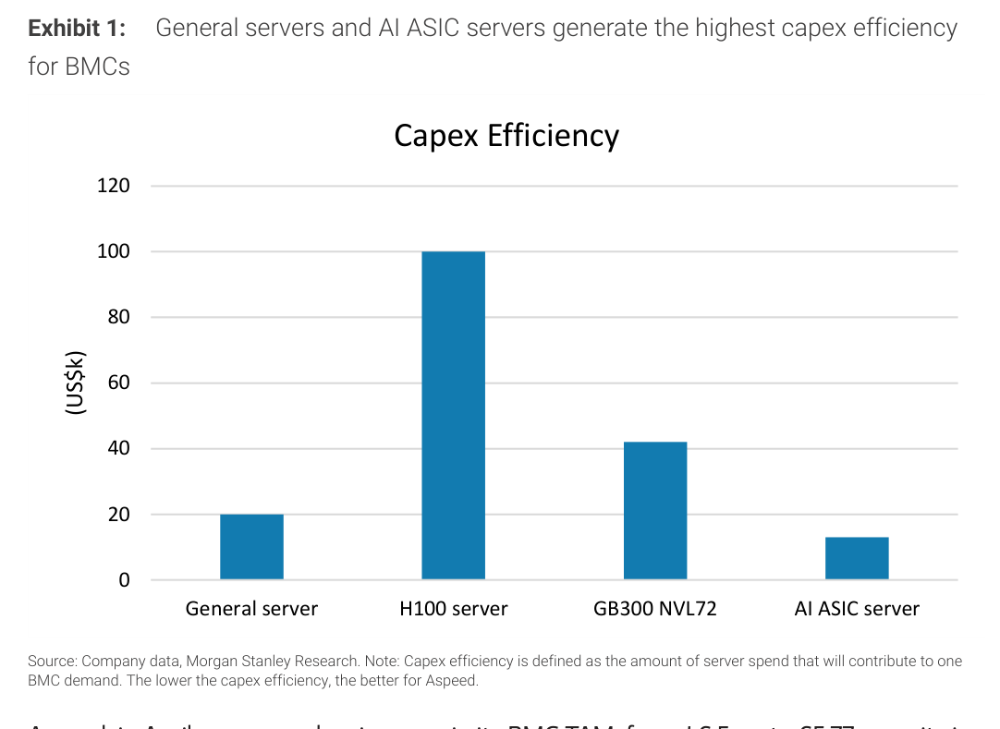

### 解讀摘要

報告用 "capex efficiency"（定義：每產生一個 BMC 需求所需的 server 支出；**數字越低對 Aspeed 越有利**）說明產品組合移轉為何對 Aspeed 有利。General server ~\$20k/BMC（最低，最有效率），AI ASIC server ~\$13k/BMC（最低，且為新增 TAM），H100 server ~\$100k（效率最差，BMC 需求少），GB300 NVL72 ~\$42k（介中）。意義在於：雲端 capex 結構中，一般伺服器（CPU + agentic AI 驅動）和 AI ASIC（自研晶片）二者對 Aspeed 最「划算」，而這正是 2026–2027 增量最大的兩塊。

### 表格

| 伺服器類型 | Capex Efficiency（\$/BMC，視覺估算） |
|---|---|
| General server | ~20,000（最優，最多 BMC） |
| AI ASIC server | ~13,000（最優，ASIC rack BMC 需求濃度高） |
| GB300 NVL72 | ~42,000 |
| H100 server | ~100,000（最差） |

*以上為視覺估算，AI ASIC server 數值尤其接近最低，順序以圖片為準*

> **洞察一**：H100 每產生一個 BMC 需求要花 $100k，是 General server 的 5 倍，意味著 Nvidia GPU server 的 capex 佔比大但對 Aspeed 的 BMC 拉動效果反而最弱。ASIC server 以 $13k 居最低，Google TPU/AWS Trainium 的大規模上線是純增量、且效率極佳的 BMC 需求。

---

## Exhibit 2｜Aspeed BMC TAM 預測：2030 達 65.7mn 單位

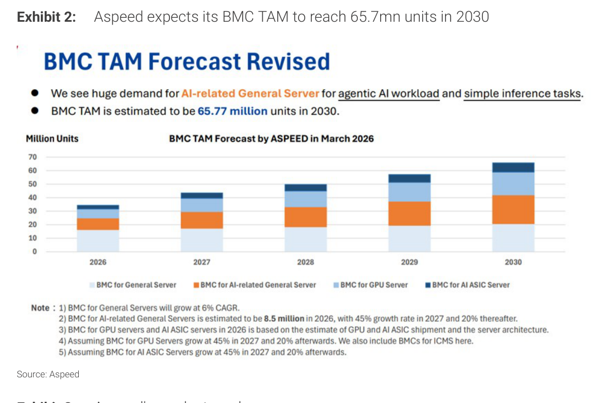

### 解讀摘要

Aspeed 在 2026 年 4 月更新 BMC TAM 預測，從 46.5mn 上修至 2030 年 65.77mn units，主要驅動力為 AI 相關一般伺服器需求（agentic AI 帶動 CPU 伺服器需求）。圖表為 Aspeed 官方 TAM 預測長條圖，顯示各年度 BMC unit 出貨規模。

> **原文補充**：MS 預期 AI 相關一般伺服器在 2026 年佔總一般伺服器需求 25%，2027 年升至 45%，2028–2030 年穩定在 20%。General server 整體成長穩定 6%/年（2025–2030）。顧客已開始提供 7–8 倍 Aspeed 單月營收的預訂量，且預計 2027 年產能需求翻倍 YoY。

> **洞察二**：從 46.5mn 上修至 65.77mn（+41.5%）說明 Aspeed 自身也大幅提高了對 agentic AI CPU 需求的樂觀度，這個修正幅度比典型的 EPS 上修要大得多，顯示公司層級的結構性重新定價。

---

## Exhibit 3｜Aspeed 產品路線圖 2026–2030

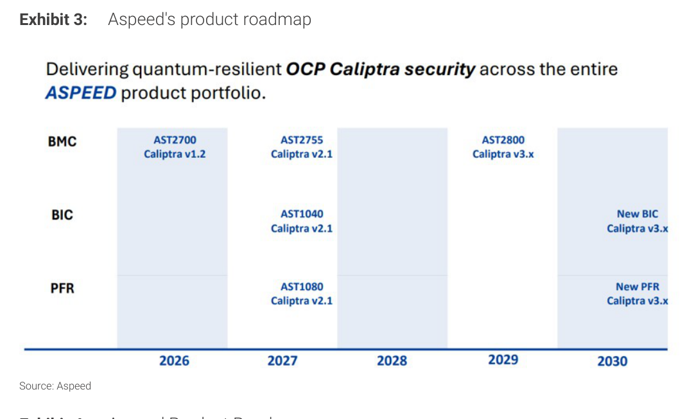

### 解讀摘要

展示 Aspeed 2026–2030 年的 BMC 系列產品規劃，包括 AST2700（現行）、AST2755（次代）、AST2800（2028+），以及 BIC（Baseboard Interface Controller）、PFR（Platform Firmware Resilience）、Caliptra 安全晶片模組。每一代產品除效能升級外，安全功能同步強化，符合超大規模資料中心對「零信任硬體根信任」的要求。

> **原文補充**：AST2700 向 Dell、Google 等新客戶擴張市占，ASP 相較前代提升 40–50%。E-glass（電氣玻璃基板）認證即將完成，可突破目前 T-glass 短缺的出貨瓶頸，月出貨量預計突破 200 萬 units。

> **洞察三**：路線圖中的 BIC 是全新品類——它負責 ASIC rack 內不同 slot 間的 baseboard interface 通訊，並非傳統 BMC 的替代品而是附加需求。若每個 ASIC rack 需要 1 BMC + 1–2 BIC，則 Exhibit 14 中的 BIC 數字仍是低估。

---

## Exhibit 4｜Aspeed 產品路線圖 2023–2027（歷史版本）

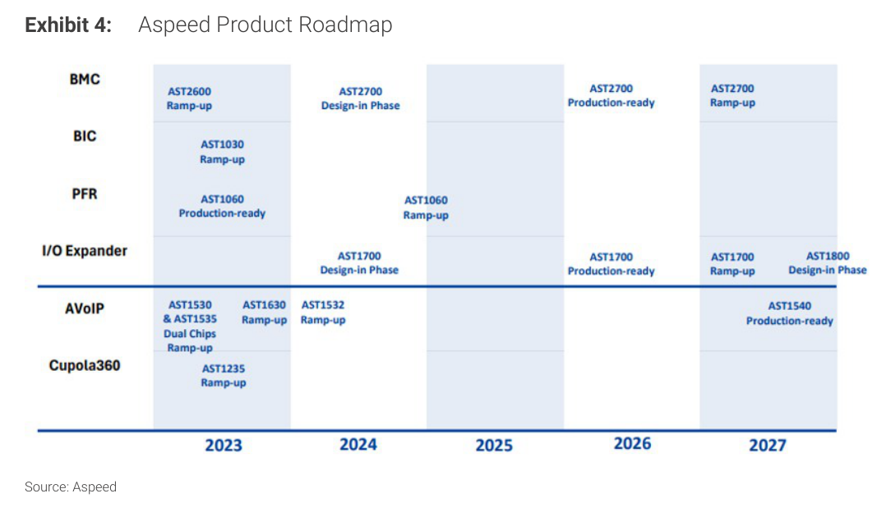

### 解讀摘要

這是 Aspeed 先前版本的產品路線圖，時間軸為 2023–2027，可與 Exhibit 3 的更新版本對照，確認 AST2700 系列以及安全晶片（PFR、Caliptra）的上市進度符合原規劃。

> **洞察四（配合 Exhibit 3）**：比對新舊路線圖，AST2700 量產時程符合預期，而新圖多出了 AST2755、AST2800 的後續節點以及更完整的安全晶片生態，說明 Aspeed 在 2025–2026 年將平台化，不再只是單一 BMC 賣點。

---

## Exhibit 5｜台灣伺服器相關族群月營收 YoY 趨勢

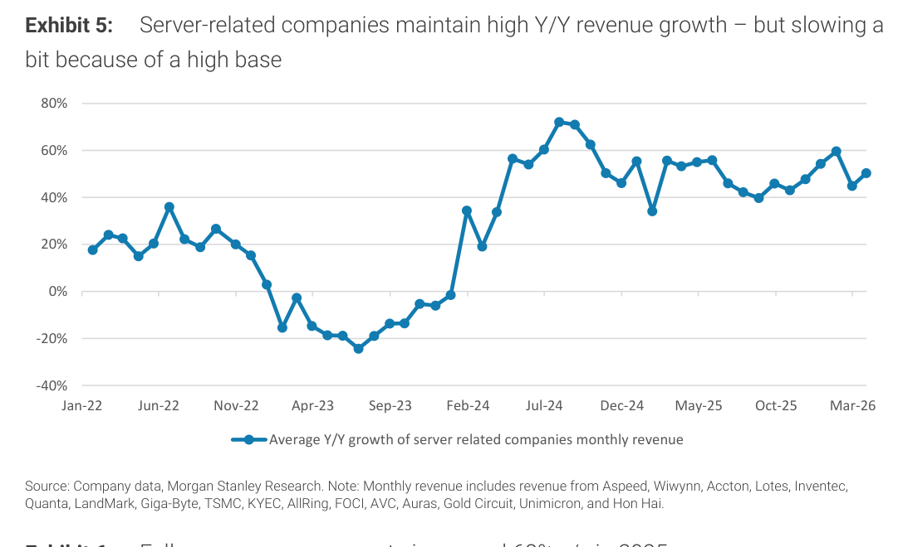

### 解讀摘要

追蹤包含 Aspeed、Wiwynn、Accton、Quanta、TSMC、Hon Hai 等 16 家公司的平均月營收 YoY 成長率，從 2022 年初至 2026 年 3 月。2024 年下半至 2025 年 3Q 達到 YoY 70%+ 高峰，此後因高基期效應而略為收斂至 40–50%（2025Q4–2026Q1），但整體方向仍向上，尚未見到結構性轉弱。

> **洞察五**：當前 YoY 增速（~50%）實際上比市場通常認為的「大盤成長趨緩」要強很多，只因 2024 年的高基期讓百分比顯得縮水。如用絕對值衡量，月營收仍在持續創高。

---

## Exhibit 6｜台灣處理器全年出口額：2025 年 +68% YoY

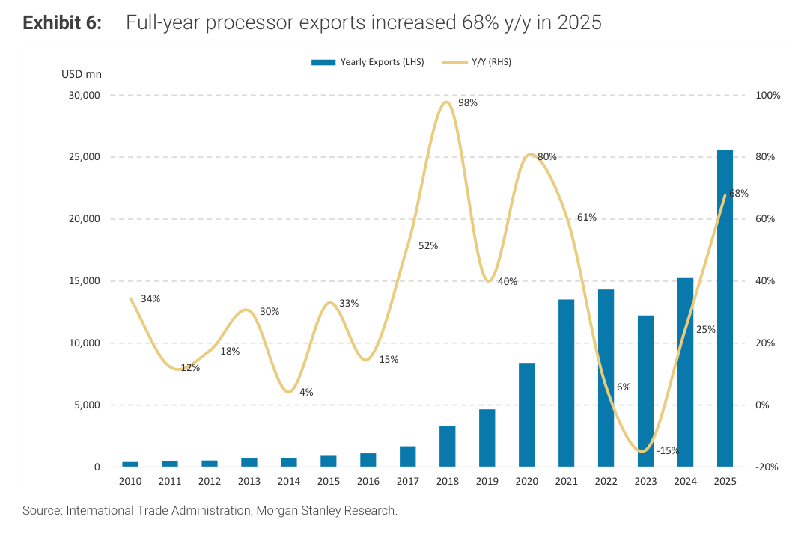

### 解讀摘要

美國國際貿易局數據，台灣處理器出口 2025 年達約 \$255bn，YoY +68%，且絕對金額是 2020 年（+80% YoY 年）的 3 倍。2025 年 +68% 雖低於 2020 年 +80% 的高峰，但絕對量更大，顯示台灣 AI 晶片供應鏈在出口層面已進入量價齊揚的新階段。

### 表格

| 年份 | YoY 成長 | 全年出口（USD mn，目測） |
|---|---|---|
| 2023 | -15% | ~12,000 |
| 2024 | +25% | ~15,000 |
| 2025 | +68% | ~25,500 |

*歷史數據：2010年+34%、2018年+52%（98%是高峰）、2020年+80%*

> **洞察六（配合 Exhibit 7）**：年度 +68% 搭配 Exhibit 7 的月度趨勢看，2025 年 5–9 月的 YoY 成長曾達 130–140%，年底因基期走高而收斂至 30–50%。2026 年初再次回升至 60%+，顯示下一波加速週期已啟動。

---

## Exhibit 7｜台灣處理器月度出口：連續 20 個月 YoY 成長

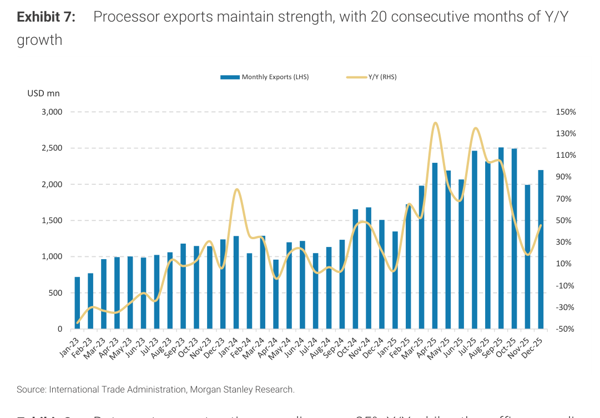

### 解讀摘要

月度出口數據顯示 2026 年 1 月至最新月份均維持 YoY 正成長，月出口額達 \$2,000–2,500mn，YoY 在 30–60% 區間。連 20 個月 YoY 正成長是近年最長的持續上行週期，超越 2020–2021 年雲端 capex 週期（約 16 個月），說明這一波 AI 驅動的需求具有更強的持久性。

---

## Exhibit 8｜美國資料中心建設支出 +35% YoY；辦公室支出下滑

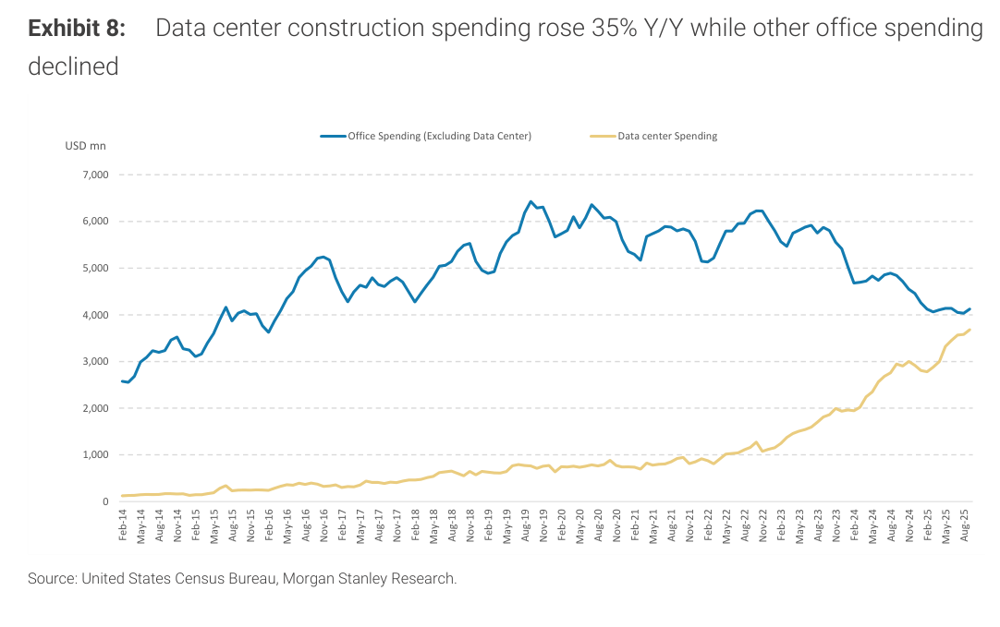

### 解讀摘要

美國人口普查局數據，資料中心建設月支出（金線）從 2023 年底的 ~\$1,000mn 急速攀升至 2025 年 8 月的 ~\$3,700mn，YoY +35%；辦公室建設月支出（藍線）從高峰 ~\$6,400mn 下降至 ~\$4,100mn。兩線的交叉點大約在 2024 年底，之後 DC 支出仍加速上升。

> **洞察七**：DC 建設與辦公室支出形成明顯的「蹺蹺板效應」——辦公室建設資本向 DC 轉移，而非整體商業地產衰退。這驗證了 cloud capex 是主動資本配置決策，而非被動週期。

---

## Exhibit 9｜美國雲端 Capex 成長週期：1Q26 +64% YoY

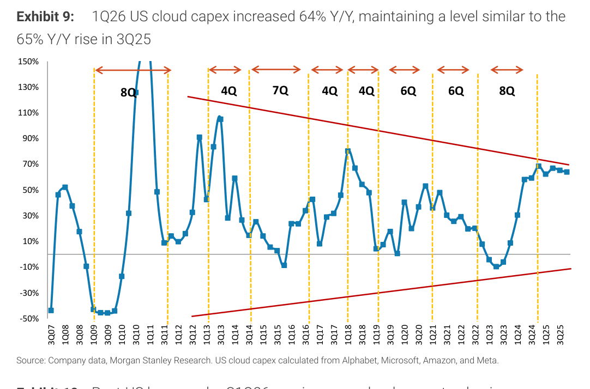

### 解讀摘要

追蹤 Google（Alphabet）、Microsoft、Amazon、Meta 四大 US hyperscaler 的合計季度 capex YoY 成長率，從 2007 年至 2026 年 Q1，並標示各個成長/收縮週期的持續季數。當前週期（最右）標示為「8Q」，代表 MS 預期此次 capex 成長週期至少延續 8 個季度，對應紅色下降趨勢線的均值回歸幅度遠小於前幾次。1Q26 的 YoY +64% 與 3Q25 的 +65% 相近，顯示增速高位持平而非衰退。

> **原文補充**：圖中兩條紅色收斂趨勢線暗示 MS 認為即使週期末段也將以 60%+ 的高個位數結束，而非像 2011–2012 年那樣急速下滑至個位數，主因是 AI 結構性需求。

> **洞察八**：過去週期（4Q、7Q、6Q 等）顯示在前一波高峰後的衰退往往深入負值，但本輪 YoY 成長率在 2022–2023 的回落最低仍在 +10% 以上，底部明顯更高。

---

## Exhibit 10｜1Q26 法說後 Cloud Capex Tracker：2026 升至 +92% YoY

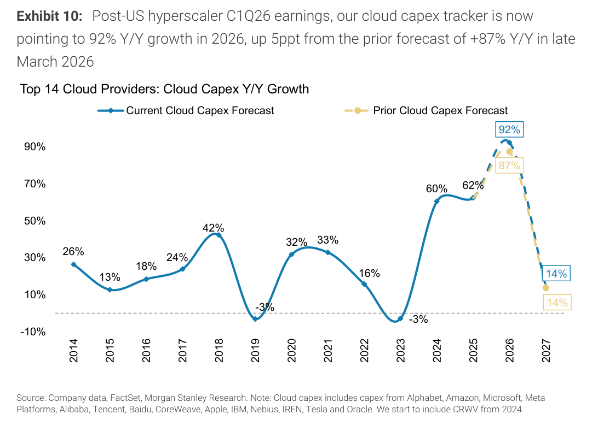

### 解讀摘要

前 14 大 CSP 合計 cloud capex YoY 成長率的 MS tracker 歷史（2014–2026E 及 2027E），美元當前估計（藍線）vs 3 月底先前估計（金虛線）。2026E 由 87% 上修至 92%（+5ppt），2027E 兩者均估 +14% YoY（高基期效應）。MS 2027E \$1,304bn 比共識 \$1,048bn 高 24%，即使用 14% YoY 這個相對保守的數字也顯著超越共識的絕對量。

### 表格

| 年份 | YoY 成長（共識） | YoY 成長（MS） |
|---|---|---|
| 2025 | 62% | 62% |
| 2026E | 87% → 92% | 92% |
| 2027E | 14% | 14%（但絕對量高 24%） |

> **洞察九（配合 Exhibit 11）**：2026E +92% YoY = \$916bn，但 2027E 即使「只成長 14%」，MS 絕對量估計 \$1,304bn 是因為 2026E base 比共識高 5ppt（\$916bn vs 低估的共識）。所以 2027E 的 contra-consensus 其實是兩個估計差距的累積放大效果。

---

## Exhibit 11｜前 14 大 CSP 雲端 Capex 絕對量：2026E \$916bn

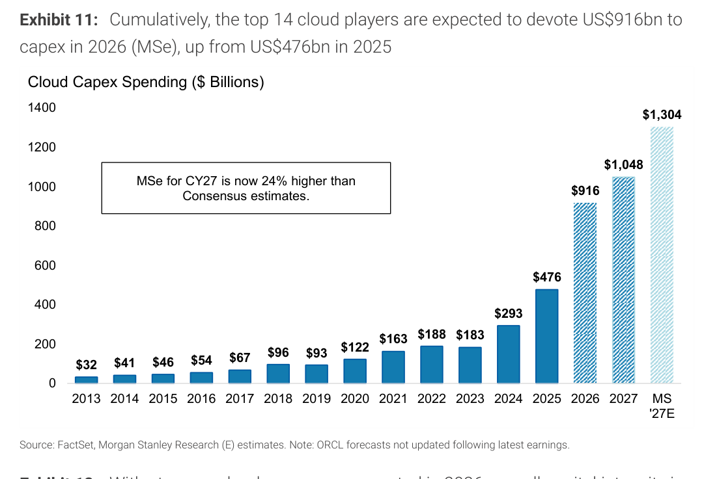

### 解讀摘要

從 2013 年 \$32bn 一路成長至 2025 年 \$476bn，2026E \$916bn（MS 估），共識 2027E \$1,048bn，而 MS 2027E \$1,304bn 高 24%。圖中特別標注「MSe for CY27 is now 24% higher than Consensus estimates」，以斜線填充柱表示 MS 超共識的估計部分。

### 表格

| 年份 | 雲端 Capex（\$bn） | 來源 |
|---|---|---|
| 2024 | 293 | 實際 |
| 2025 | 476 | 實際 |
| 2026E | 916 | MSe |
| 2027E | 1,048 | 共識 |
| MS '27E | 1,304 | MS 獨家估計 |

> **洞察十**：2025→2026 增量 \$440bn（+92%），2026→2027 共識增量 \$132bn（+14% YoY）。MS 認為 2027E 增量應達 \$388bn（+42% YoY），核心分歧在於記憶體（HBM/DDR5）需求能否繼續加速。

---

## Exhibit 12｜前 14 大 CSP 資本密集度：2026E 30.8%，史上新高

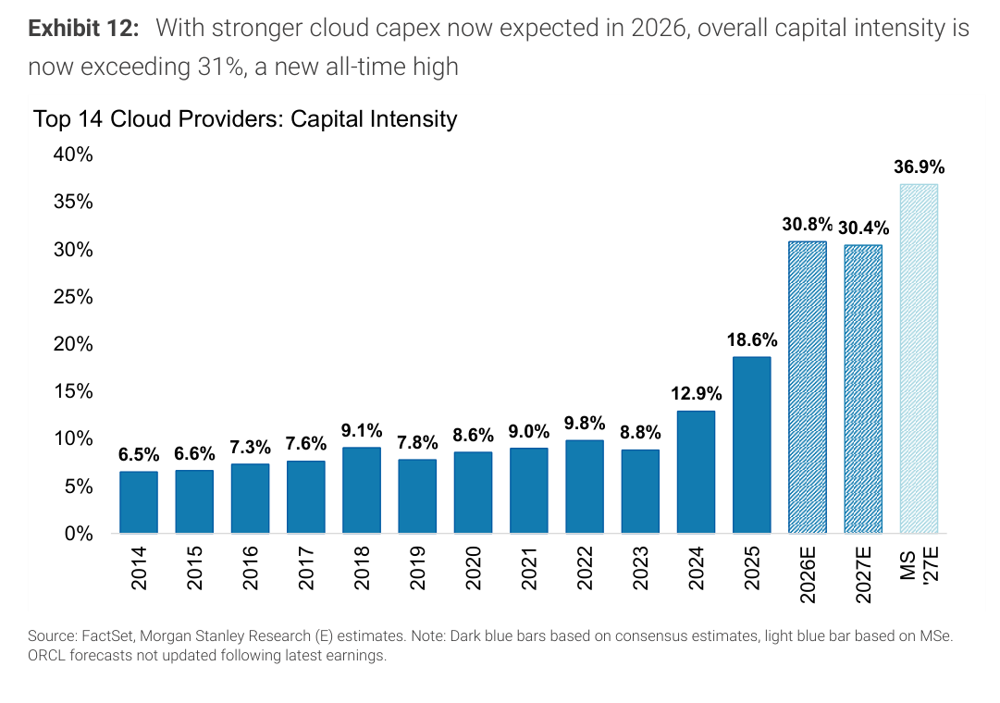

### 解讀摘要

資本密集度（Capex/Revenue）從 2014–2023 年的 6–10% 區間，在 2024–2025 年急速提升至 13–19%，2026E 達 30.8%（共識）/ MS '27E 36.9%。此指標創歷史新高，代表雲端公司正以史無前例的比例把收入投回基礎設施。

### 表格

| 年份 | 資本密集度 | 標注 |
|---|---|---|
| 2014–2023 均值 | ~8% | 歷史常態 |
| 2024 | 12.9% | 啟動 |
| 2025 | 18.6% | 加速 |
| 2026E（共識） | 30.8% | 史上新高 |
| 2027E（共識） | 30.4% | 維持高位 |
| MS '27E | 36.9% | 更高 |

> **洞察十一**：若 MS '27E 資本密集度 36.9% 成真，雲端公司幾乎把每 3 塊錢收入中的 1 塊投回 capex，這在傳統軟體業是不可持續的，但 AI infra 的長期收益率（ROI）計算已與傳統 IT 不同。此數字的可持續性本身就是最大的 tail risk。

---

## Exhibit 13｜Aspeed BMC 出貨量 YoY vs Intel+AMD CPU 出貨量 YoY

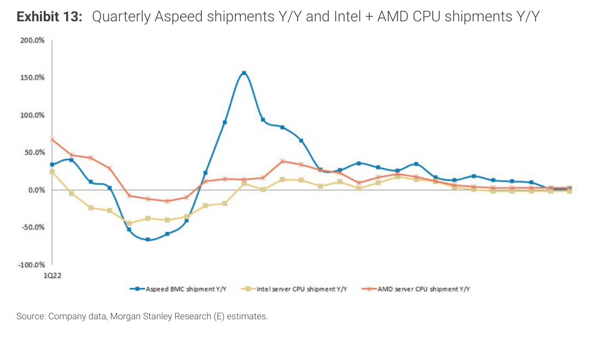

### 解讀摘要

三條線追蹤 Aspeed BMC 季度出貨 YoY（藍）、Intel 伺服器 CPU YoY（金）、AMD 伺服器 CPU YoY（橘紅），起點 1Q22。Aspeed 在 2022 年因庫存調整大幅下滑至 -70%，隨後在 2023Q3–2024Q2 反彈至峰值 +155%，且在整個回升期間均領先 Intel/AMD 出貨量復甦。2026 年最新資料點顯示 Aspeed、Intel、AMD 三者的 YoY 成長率逐漸收斂至 +5–20% 區間。

> **洞察十二**：Aspeed 出貨量歷史上比 CPU 出貨量約領先 1–2 季（先出 BMC，CPU 伺服器才裝上線），因此當前 Aspeed 出貨數持穩（而非下滑）意味著後續的 CPU 伺服器出貨仍有支撐。

---

## Exhibit 14｜Aspeed ASIC BMC TAM：2026E 佔收入 9.7%、2027E 21.1%

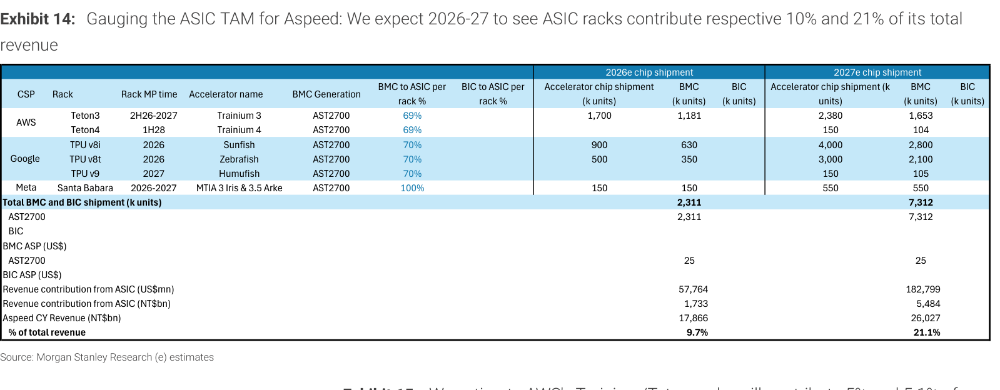

### 解讀摘要

這是報告中最關鍵的新增資訊——MS 首次完整量化 AWS、Google、Meta 三大 ASIC 客戶對 Aspeed 的收入貢獻。2026E 合計 BMC 出貨 2,311k units（全為 AST2700，ASP \$25），ASIC 佔 Aspeed 總收入 9.7%（NT\$1,733bn）。2027E 出貨量跳升至 7,312k units，ASIC 貢獻 21.1%（NT\$5,484bn），主要由 Google TPU 大量出貨（+5,100k units）驅動。

### 表格

| CSP | Rack | Accelerator | BMC % | 2026e ASIC出貨（k） | 2026e BMC（k） | 2027e ASIC出貨（k） | 2027e BMC（k） |
|---|---|---|---|---|---|---|---|
| AWS | Teton3（2H26–2027） | Trainium3（AST2700） | 69% | 1,700 | 1,181 | 2,380 | 1,653 |
| AWS | Teton4（1H28） | Trainium4（AST2700） | 69% | - | - | 150 | 104 |
| Google | TPU v8i（2026） | Sunfish / Broadcom | 70% | 900 | 630 | 4,000 | 2,800 |
| Google | TPU v8t（2026） | Zebrafish / MTK | 70% | 500 | 350 | 3,000 | 2,100 |
| Google | TPU v9（2027） | Humufish / MTK | 70% | - | - | 150 | 105 |
| Meta | Santa Babara（2026–27） | MTIA 3 Iris & 3.5 Arke | 100% | 150 | 150 | 550 | 550 |
| **合計** | | | | **3,250** | **2,311** | **10,230** | **7,312** |

*Note：AST2700 ASP = US\$25；Aspeed 2026E CY Revenue NT\$17,866bn；2027E NT\$26,027bn*

| 指標 | 2026E | 2027E |
|---|---|---|
| ASIC 收入貢獻（US\$mn） | 57,764 | 182,799 |
| ASIC 收入貢獻（NT\$bn） | 1,733 | 5,484 |
| Aspeed CY Revenue（NT\$bn） | 17,866 | 26,027 |
| **佔 Aspeed 總收入** | **9.7%** | **21.1%** |

> **洞察十三**：2026→2027 ASIC BMC 出貨量從 2,311k → 7,312k（+216%），幾乎完全來自 Google（+5,100k）。Google 一旦確認切換，規模效果非常顯著。但反過來說，若 Google 延遲或取消，這 14ppt 的收入貢獻在 2027E 中如數消失。

---

## Exhibit 15｜AWS Trainium/Teton 對 Aspeed 的貢獻：2026E 5%、2027E 5.1%

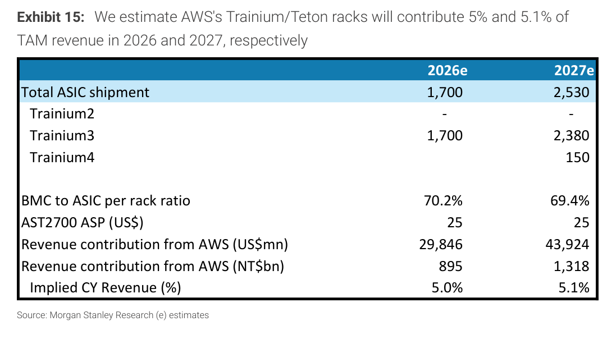

### 解讀摘要

AWS 是三大 ASIC 客戶中最確定性最高的——Trainium3 已進入量產（2H26 開始出貨），Trainium4（1H28 MP）已排入規劃。2026E 出貨 1,700k units（全為 Trainium3），BMC 比例 70.2%；2027E 出貨 2,530k（Trainium3 2,380k + Trainium4 150k），BMC 比例 69.4%。收入貢獻相對穩定在 5.0–5.1%，代表 AWS 是低風險、可預期的基本盤。

### 表格

| | 2026E | 2027E |
|---|---|---|
| 總 ASIC 出貨（k units） | 1,700 | 2,530 |
| 　Trainium3 | 1,700 | 2,380 |
| 　Trainium4 | - | 150 |
| BMC to ASIC 比例 | 70.2% | 69.4% |
| AST2700 ASP（US\$） | 25 | 25 |
| AWS 貢獻（US\$mn） | 29,846 | 43,924 |
| AWS 貢獻（NT\$bn） | 895 | 1,318 |
| **佔 Aspeed CY Revenue** | **5.0%** | **5.1%** |

---

## Exhibit 16｜AWS Trainium3 UltraServer 產品圖

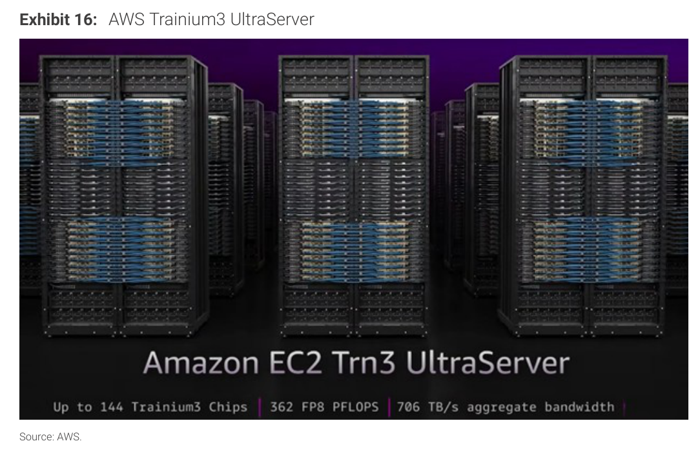

### 解讀摘要

Amazon EC2 Trn3 UltraServer 官方產品圖：三機架並排，每機架含 144 顆 Trainium3 晶片，合計 FP8 算力 362 PFLOPS，網路頻寬 706 TB/s。這是 Aspeed AST2700 BMC 在 ASIC rack 的實體部署形態，每個 UltraServer 需要數個 BMC 晶片管理機架韌體。

> **原文補充**：AWS 的 NeuronLink 是自研互連技術，UltraServer 的規模化連接是 2026–2027 年 Teton3 出貨量的主要驅動力。

---

## Exhibit 17｜AWS Trainium3 UltraServer 架構圖

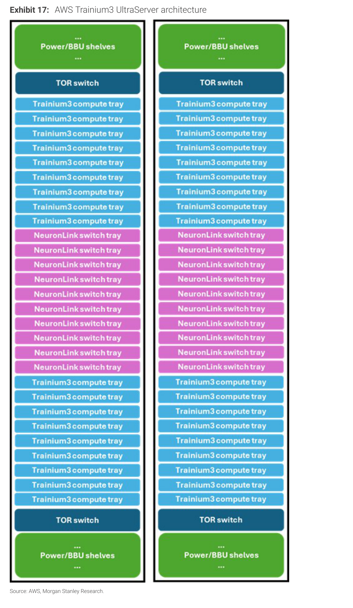

### 解讀摘要

雙機架架構圖：每個機架（左右各一）由上下 Power/BBU shelves 夾住，中央為 TOR switch、9 層 Trainium3 compute trays（藍色）、10 層 NeuronLink switch trays（粉色）、再 9 層 Trainium3 compute trays，底部再一個 TOR switch。對稱設計確保每機架 144 晶片（72 per half）的算力均衡分布，NeuronLink switch 層負責晶片間高頻寬互連。

> **洞察十四（配合 Exhibit 16）**：每個雙機架 UltraServer 包含 288 顆 Trainium3，BMC 管理需求為 2–4 顆 AST2700（每機架各一組），顯示每個 UltraServer 的 BMC 密度高於一般 2U 伺服器，ASP 貢獻更佳。

---

## Exhibit 18｜Google TPU 對 Aspeed 的貢獻：2026E 4.1%、2027E 14.4%

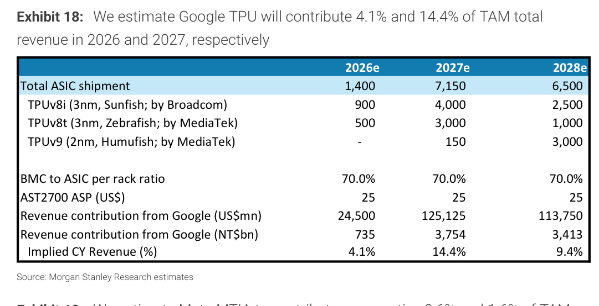

### 解讀摘要

Google 是 Aspeed ASIC 收入最大的上行機會與最大的不確定性。2026E 出貨 1,400k units（TPUv8i 900k + TPUv8t 500k），貢獻 4.1%（NT\$735bn）；2027E 急升至 7,150k units（TPUv8i 4,000k + TPUv8t 3,000k + TPUv9 150k），貢獻 14.4%（NT\$3,754bn）。2028E 則因 v8 世代部分退役而降至 6,500k units，14.4%→9.4%。

### 表格

| | 2026E | 2027E | 2028E |
|---|---|---|---|
| 總 ASIC 出貨（k units） | 1,400 | 7,150 | 6,500 |
| 　TPUv8i（3nm，Sunfish，Broadcom） | 900 | 4,000 | 2,500 |
| 　TPUv8t（3nm，Zebrafish，MTK） | 500 | 3,000 | 1,000 |
| 　TPUv9（2nm，Humufish，MTK） | - | 150 | 3,000 |
| BMC to ASIC 比例 | 70% | 70% | 70% |
| AST2700 ASP（US\$） | 25 | 25 | 25 |
| Google 貢獻（US\$mn） | 24,500 | 125,125 | 113,750 |
| Google 貢獻（NT\$bn） | 735 | 3,754 | 3,413 |
| **佔 Aspeed CY Revenue** | **4.1%** | **14.4%** | **9.4%** |

> **值得驗證**：Google TPU 採用 Aspeed AST2700 BMC 的假設（從 MCU 切換）是 Aspeed 2027E 增量最大的單一假設，貢獻 Aspeed 總收入 14.4ppt（約 NT\$3,754bn）。若此假設偏差，2027E 收入下滑約 14%，PT 也須對應調整。MS 在原文中說明 "Starting with TPUv8t (Sunfish)，given better performance，we expect Google to adopt Aspeed's AST2700"，但尚非客戶官方確認。

---

## Exhibit 19｜Meta MTIA 對 Aspeed 的貢獻：2026E 0.6%、2027E 1.6%

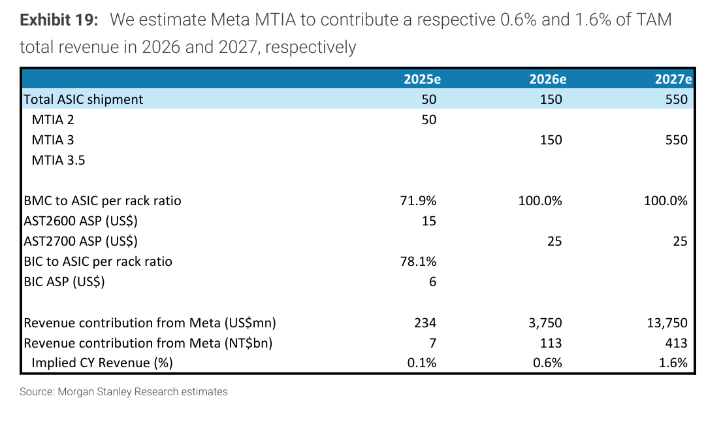

### 解讀摘要

Meta 的 MTIA 3（Santa Babara rack，2026–2027）採用 100% BMC-to-ASIC 比例（無 BIC），BMC 全部升級為 AST2700（ASP \$25），2026E 150k units，2027E 550k units。相較 AWS 和 Google，Meta 規模偏小，但 100% 採用率（不像 AWS 的 69%）代表每個 ASIC 晶片都對應一個 BMC，邊際貢獻效率最高。

### 表格

| | 2025E | 2026E | 2027E |
|---|---|---|---|
| 總 ASIC 出貨（k units） | 50 | 150 | 550 |
| 　MTIA 2 | 50 | - | - |
| 　MTIA 3 | - | 150 | 550 |
| BMC to ASIC 比例 | 71.9% | 100% | 100% |
| AST2600 ASP（US\$） | 15 | - | - |
| AST2700 ASP（US\$） | - | 25 | 25 |
| Meta 貢獻（US\$mn） | 234 | 3,750 | 13,750 |
| Meta 貢獻（NT\$bn） | 7 | 113 | 413 |
| **佔 Aspeed CY Revenue** | **0.1%** | **0.6%** | **1.6%** |

> **洞察十五（配合 Exhibit 14）**：Meta 從 AST2600（\$15）切換到 AST2700（\$25），ASP 成長 67%；同時 BMC 比例從 72% 升至 100%。兩個因素疊加讓 2025E→2026E 每台 ASIC 對應的 BMC 收入從 \$10.8 跳至 \$25，即使出貨量只成長 3 倍，收入貢獻成長 16 倍（NT\$7bn→NT\$113bn）。

---

## Exhibit 22｜Aspeed 殘值收益法估值模型（RI Model）

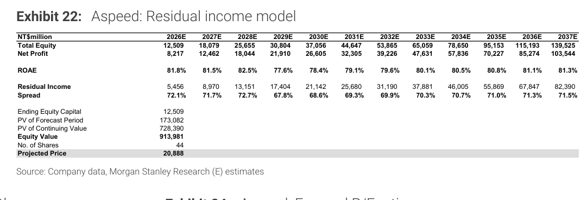

### 解讀摘要

MS 採用殘值收益法（Residual Income Model）為 Aspeed 定價，關鍵假設：CoE 9.8%（2% 無風險率 + 6% 風險溢酬 + 1.3 beta）、中期成長率 21.4%、終值成長率 5.5%、現金派息率 85%。2026E Equity \$12,509mn、Net Profit \$8,217mn、ROAE 81.8%，Residual Income \$5,456mn（Spread 72.1%）。Equity Value \$913,981mn，除以流通股 44mn 股（含股利發行後），得 Projected Price \$20,888。

### 表格（節選 2026E–2030E）

| 年度 | Total Equity（NT\$mn） | Net Profit（NT\$mn） | ROAE | Residual Income（NT\$mn） | Spread |
|---|---|---|---|---|---|
| 2026E | 12,509 | 8,217 | 81.8% | 5,456 | 72.1% |
| 2027E | 18,079 | 12,462 | 81.5% | 8,970 | 71.7% |
| 2028E | 25,655 | 18,044 | 82.5% | 13,151 | 72.7% |
| 2029E | 30,804 | 21,910 | 77.6% | 17,404 | 67.8% |
| 2030E | 37,056 | 26,605 | 78.4% | 21,142 | 68.6% |

| 估值組成 | NT\$mn |
|---|---|
| Ending Equity Capital | 12,509 |
| PV of Forecast Period | 173,082 |
| PV of Continuing Value | 728,390 |
| Equity Value | 913,981 |
| 流通股（mn） | 44 |
| **Projected Price** | **20,888** |

> **原文補充**：本次 PT 由 NT\$23,456 下調至 NT\$20,888（含 bull case NT\$25,500、bear case NT\$10,000），主要反映股利發行後每股 EPS 稀釋（2026E EPS -19%），核心假設不變。PT 隱含 2027E 77x P/E、2028E 53x P/E，高於 2020 年以來 42x 的歷史均值，MS 以需求改善和市占擴張作為溢價理由。

> **洞察十六**：PV of Continuing Value（NT\$728bn）佔 Equity Value（NT\$914bn）的 80%，代表 Aspeed 的估值中 80% 來自 2037 年以後的終值假設，對終值成長率（5.5%）和 CoE（9.8%）極度敏感。這是高估值半導體公司的標準風險——若 CoE 提升 1ppt（到 10.8%），理論上 PT 下滑幅度顯著。

---

## Exhibit 23｜Aspeed EPS 修正廣度：當前創 2020 年以來新高

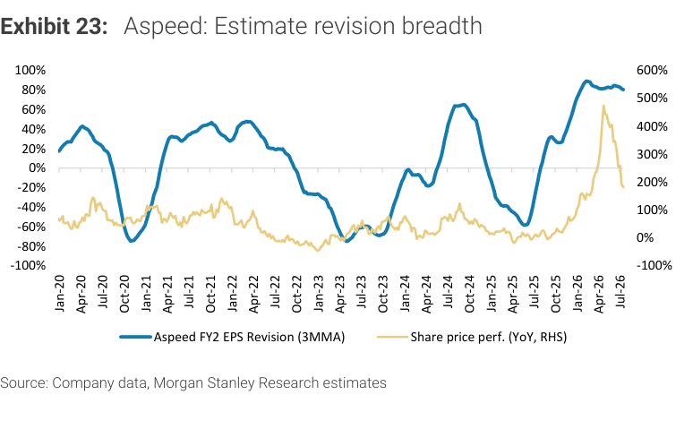

### 解讀摘要

雙軸圖：左軸為 Aspeed FY2（未來第二財年）EPS 修正廣度的 3 個月移動均值（藍線），右軸為 Aspeed 股價 YoY 表現（金線）。2026 年初至 7 月，EPS 修正廣度達 +80%（僅次於 2021 年峰值），股價 YoY +450%。歷史上，EPS 廣度峰值通常領先股價峰值 6–9 個月，是預判轉折的先行指標。

> **原文補充**：本報告的 PT 切割（-11%）主因是股利稀釋而非 EPS 廣度下滑，MS 維持「EPS 廣度仍正向、2027E 修正方向向上」的判斷，意味著修正峰值尚未出現。

> **洞察十七（配合 Exhibit 20 分析）**：MS 雖然下修 2026E EPS -19%（股利稀釋），但強調這不是盈利能力下降，是機械性稀釋。Market 若把這一次 EPS「修正」誤讀為廣度轉弱，可能提供買點。

---

## 跨 Exhibit 彙整表

### 彙整 1｜Aspeed ASIC 收入貢獻總覽（2026–2028E）

（來源 Exhibits 14、15、18、19）

| CSP | 2026E 佔收入 | 2027E 佔收入 | 2028E 佔收入 |
|---|---|---|---|
| AWS | 5.0% | 5.1% | - |
| Google | 4.1% | 14.4% | 9.4% |
| Meta | 0.6% | 1.6% | - |
| **合計 ASIC** | **9.7%** | **21.1%** | - |

> **跨 Exhibit 洞察**：2027E 的 21.1% ASIC 貢獻中，Google 佔 14.4ppt（68%），AWS 佔 5.1ppt（24%），Meta 1.6ppt（8%）。Google 是決定性因素。若用反向推算：Google 若只達 2027E 目標的 50%，Aspeed 總收入下滑約 7%，PT 對應下調至約 NT\$18,500。

---

## 相關個股清單

| 類別 | 公司 | Ticker | 評等 | 備註 |
|---|---|---|---|---|
| 覆蓋 | Aspeed Technology | 5274.TWO | OW | PT NT\$20,888；RI model；77x 2027E EPS；PT 下調 11% 純屬股利稀釋 |
| 覆蓋 | Montage Technology | 688008.SS | OW | 維持 OW；韓國政府調查（DDR5 interface）提供加碼時機 |
| 提及 | MediaTek | 2454.TW | - | Google TPUv8t（Zebrafish）+ TPUv9（Humufish）ASIC 設計方 |
| 提及 | Broadcom | AVGO.US | - | Google TPUv8i（Sunfish）ASIC 設計方 |
| 提及 | Alchip | 3661.TW | - | AWS Trainium 相關 |
| 提及 | Hygon | 海光資訊 | - | WAIC 觀察：中國高端 x86 替代品，訂單增加 |
