# Goldman Sachs｜Taiwan CCL：高端玩家獲利上行重啟

**券商**：Goldman Sachs  
**分析師**：Chao Wang、Allen Chang、AI Wang  
**日期**：2026-07-23  
**主題**：Taiwan CCL — High-end players' profitability uptrend restart, with better pricing and product mix outlook  
**評級**：Buy EMC (2383.TW)、Buy TUC (6274.TWO)  
<a href="https://layx.uk/dl?g=產業&b=GS&d=20260723&h=CCL-HighEnd-EMC-TUC">📎 下載 PDF</a>

---

## 報告總結

Goldman Sachs 預期台灣 CCL 產業迎來第二輪高端定價上漲——M7+ 等級 CCL 2H26 漲價幅度 +10-15% QoQ，由 AI 伺服器需求主導、非成本推動。GS 認為市場低估了 EMC 與 TUC 的利潤彈性：2Q26E EMC EPS NT\$28.27 較 BBG 共識高 21%，3Q26E NT\$36.85 較共識高 34%；TUC 2Q26E EPS NT\$9.18 高 13%，3Q26E NT\$12.03 高 21%。

GS 同步上調兩家目標價——EMC 至 NT\$9,500（27x 2H27-1H28E P/E），TUC 至 NT\$2,860（22x 2H27-1H28E P/E）——認為市場尚未充分反映高端 CCL 供給長期短缺（2026-28E 需求年增 67-135% vs 供給僅 10-31%）以及兩者在 M7+ CCL 幾近壟斷的地位（EMC 99%、TUC 75% by 2028E）。（封面標示 17 July 2026，系統日期以檔名 20260723 為準。）

---

## Goldman Sachs 完整投資邏輯鏈

| 論點層次 | Exhibit | 內容 |
|---|---|---|
| TAM 結構性擴張 | 1 | CCL TAM 53% CAGR 至 US\$57.0bn by 2028E；AI 伺服器成最大驅動力 |
| 供需長期失衡 | 2、5 | 2026-28E 高端 CCL 需求年增 67-135%，供給僅 10-31%；整體市場 2027E 缺口達 +61ppt |
| 高端化加速 | 3、4 | 高端 CCL 96% CAGR，佔 TAM 比例從 2025 <20% 升至 2028E ~80% |
| 定價驅動力結構優越 | 11 | M7+ CCL 漲 25%（需求驅動）vs 低端漲 80%（成本轉嫁）；高端毛利改善，低端不改善 |
| 個股 AI 曝險集中 | 8、9、10 | EMC AI 曝險 89% by 2028E，M7+ CCL 佔比 99%；TUC AI 64%，M7+ 75% |
| 近期盈餘超預期幅度大 | 13 | 2Q26E EMC EPS NT\$28.27（+21% vs BBG），3Q26E NT\$36.85（+34% vs BBG） |
| **結論** | 封面 | **Buy EMC TP NT\$9,500（↑ from NT\$6,000）；Buy TUC TP NT\$2,860（↑ from NT\$1,888）** |

> **報告最大邏輯缺口**：未明確說明 2H26 M7+ CCL 漲價 +10-15% 的客戶接受度與合約結構（長約 vs 現貨比例）；若漲價落地慢於預期，3Q26E EPS 超預期幅度會收窄。

---

## 報告核心觀點

| 主題 | Goldman Sachs 觀點 | 市場共識 | 是否 Contra-Consensus |
|---|---|---|---|
| 2H26 高端 CCL 漲價 | M7+ +10-15% QoQ；需求驅動，可持續 | 市場預期漲價但幅度保守 | ✅ 幅度超市場預期 |
| EMC 2Q26E EPS | NT\$28.27，高於 BBG 21% | BBG 共識 ~NT\$23 | ✅ 顯著超預期 |
| TUC 2Q26E EPS | NT\$9.18，高於 BBG 13% | BBG 共識 ~NT\$8.1 | ✅ 超預期 |
| EMC 毛利率軌跡 | 2Q26E 34.1% → 3Q26E 36.5%，最終達 40%+ | 市場低估速度與高點 | ✅ Contra |
| 高端 CCL 供需缺口 | 2026-28E 需求增長遠超供給，結構性短缺 | 廣泛認知，但對持續期有疑慮 | 一致（持續期更長） |

**偏好排序**：EMC > TUC（M7+ CCL 曝險更集中，毛利彈性更大）

---

## Exhibit 1｜CCL TAM 53% CAGR（2025-28E）

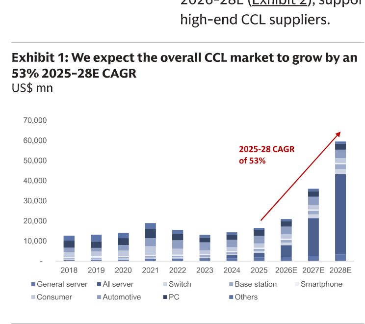

### 解讀摘要

整體 CCL TAM 2025-28E 預估 53% CAGR 至 US\$57.0bn，幾乎全部增量由 AI 伺服器驅動。這是結構性轉變：AI 伺服器對高階 M7+ CCL 的需求是 capex 計畫驅動，而非可遞延的消費性需求，採購方對價格的敏感度顯著低於 PC/手機終端。圖中 2025 年以後柱體急速拉高，AI server 已全面取代傳統終端成為 CCL 市場的唯一邊際增量來源。

### 表格

| 年度 | CCL TAM（US\$ mn，視覺估算） |
|---|---|
| 2025E | ~15,000 |
| 2026E | ~20,000 |
| 2027E | ~35,000 |
| 2028E | ~57,000 |
| **2025-28E CAGR** | **53%** |

> **洞察一**：AI 伺服器佔整體 CCL 增量幾乎全部，意味著 CCL 的客戶結構已從「消費電子分散需求」轉為「超大型雲端業者集中訂單」——議價格局根本改變，AI 採購客戶的 CCL 需求剛性遠高於傳統終端。

---

## Exhibit 2｜CCL 供需缺口：2026-28E 持續性供給不足

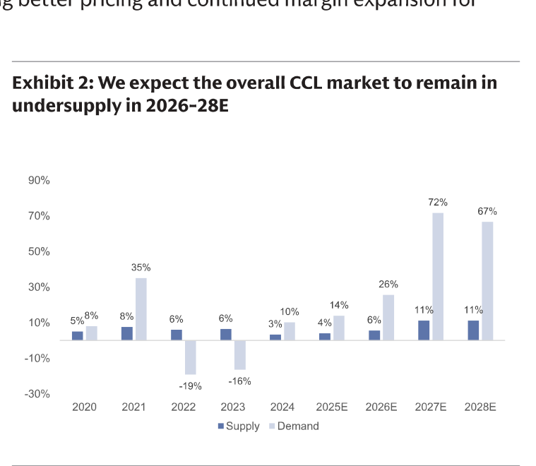

### 解讀摘要

整體 CCL 市場需求年增長率 2026E 達 26%、2027E 達 72%、2028E 達 67%，而供給擴充僅 6%、11%、11%。缺口幅度已超越 2021 年的歷史高峰（需求 +35% vs 供給 +8%），且預估在 2028E 前都不會彌合。供給受限原因在於高端 CCL 製程複雜、客戶認證週期長，短期難以快速追上。

### 表格

| 年度 | 供給 YoY | 需求 YoY | 缺口（需求－供給） |
|---|---|---|---|
| 2020 | 5% | 8% | +3ppt |
| 2021 | 8% | 35% | +27ppt |
| 2022 | 6% | -19% | -25ppt |
| 2023 | 6% | -16% | -22ppt |
| 2024 | 3% | 10% | +7ppt |
| 2025E | 4% | 14% | +10ppt |
| 2026E | 6% | 26% | +20ppt |
| 2027E | 11% | 72% | +61ppt |
| 2028E | 11% | 67% | +56ppt |

> **洞察二**：2027E 缺口 +61ppt 是 2021 年歷史峰值 +27ppt 的 2.3 倍。2021 年後整體 CCL 漲價 20-30%，若需求/供給失衡更嚴重，定價能力理應更強——這是 GS 對 2H26 漲價信心的量化基礎。

---

## Exhibit 3｜高端 CCL 96% CAGR，佔 TAM 比例從 <20% 升至 ~80%（2025-28E）

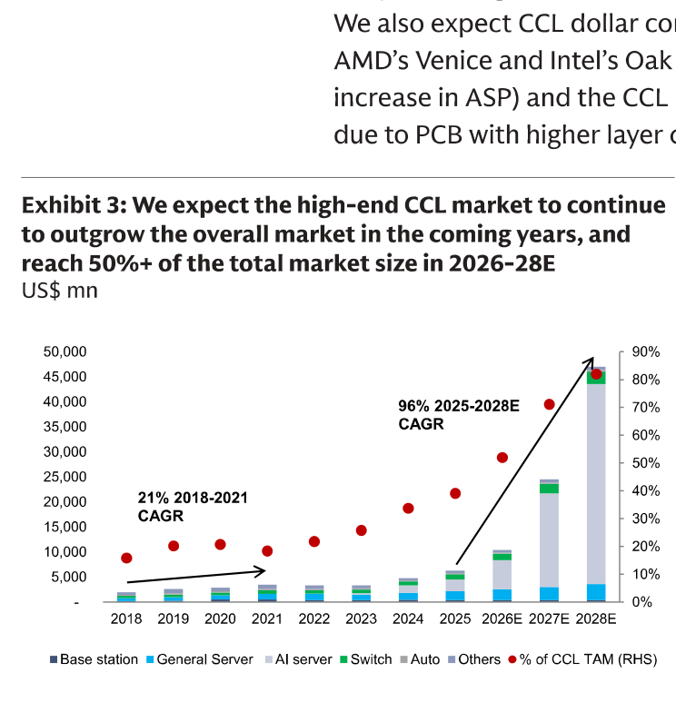

### 解讀摘要

高端 CCL（AI server + 高端 switch 用）2025-28E 預估 96% CAGR，遠超整體 CCL 的 53%。佔 CCL TAM 的比例從 2025 年約 18-20%，飛速拉升至 2028E ~80%，意味著整體 CCL 的未來增量幾乎全由高端驅動，低端 CCL 被邊緣化。2018-2021 年的「上一輪高端 CCL 」僅有 21% CAGR，本輪的 96% 完全是數量級的差異。

### 表格

| 年度 | 高端 CCL TAM（US\$ mn，視覺估算） | 佔 CCL TAM % |
|---|---|---|
| 2021 | ~3,000 | ~20% |
| 2025E | ~3,000-5,000 | ~18-20% |
| 2026E | ~10,000 | ~50% |
| 2027E | ~25,000 | ~70% |
| 2028E | ~46,000 | ~80% |
| **2025-28E CAGR** | **96%** | |

> **洞察三（配合 Exhibit 1）**：整體 CCL TAM ~US\$57bn - 高端 CCL ~US\$46bn = 低端 CCL ~US\$11bn（2028E），與 2025 年的低端 CCL 規模相近。換言之，低端 CCL 幾乎不增長，所有增量都被高端吃走——EMC/TUC 的財務表現與其他傳統 CCL 廠商差距將以年計算地擴大。

---

## Exhibit 4｜高端 CCL 佔 CCL TAM 比例快速上升

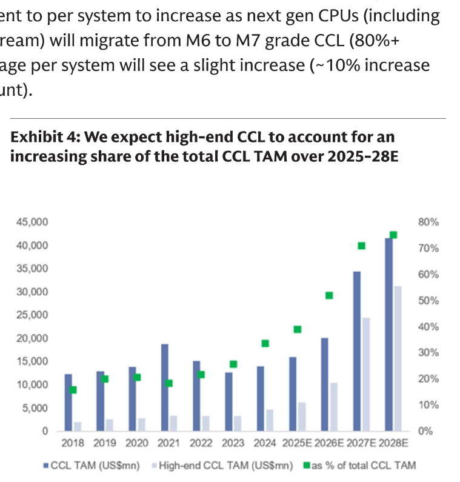

### 解讀摘要

圖表直觀呈現整體 CCL TAM（深藍柱）與高端 CCL TAM（淺藍柱）的相對規模：2024 年以前高端 CCL 幾乎不可見，2025-26E 起快速放大，2027E 高端 CCL 規模已超整體 CCL 的一半。綠點顯示佔比從 2025E 約 20% 飛升至 2028E 的 ~75-80%。

### 表格

| 年度 | CCL TAM（US\$ mn）| 高端 CCL TAM（US\$ mn）| 高端佔比 |
|---|---|---|---|
| 2026E | ~20,000 | ~10,500 | ~50% |
| 2027E | ~35,000 | ~25,000 | ~70% |
| 2028E | ~43,000 | ~32,000 | ~75% |

視覺估算。

---

## Exhibit 5｜高端 CCL 供給長期嚴重短缺（2026-28E）

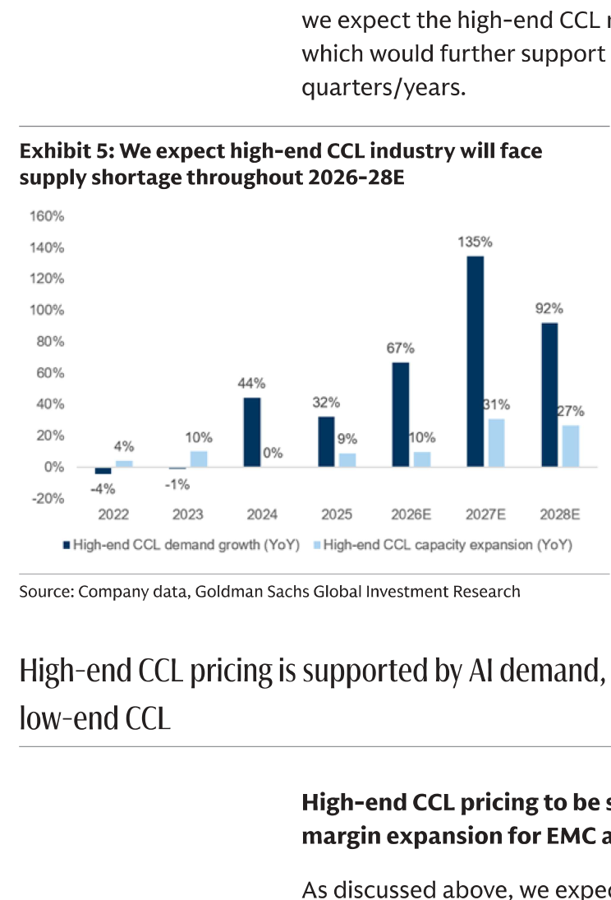

### 解讀摘要

高端 CCL 需求年增 2026E +67%、2027E +135%、2028E +92%，而供給擴充速度僅 10%、31%、27%。需求增速是供給的 3-7 倍，結構性短缺成因明確：M7+ CCL 製程技術複雜、客戶認證週期長達 6-18 個月，新廠商難以快速進場，現有廠商產能擴建也需時 2-3 年。

### 表格

| 年度 | 高端 CCL 需求 YoY | 高端 CCL 供給 YoY | 倍數（需求/供給） |
|---|---|---|---|
| 2022 | -4% | 4% | — |
| 2023 | -1% | 10% | — |
| 2024 | 44% | 0% | — |
| 2025 | 32% | 9% | 3.6 |
| 2026E | 67% | 10% | 6.7 |
| 2027E | 135% | 31% | 4.4 |
| 2028E | 92% | 27% | 3.4 |

> **洞察四**：即使 EMC/TUC 積極擴廠，高端 CCL 供給年增 30% 已是技術上限。在此上限下，需求 +67-135% 的格局意味著高端 CCL 的稀缺性在 2026-28E 框架內不會改善——定價能力不是短暫的，是有結構支撐的。

---

## Exhibit 6｜低端 CCL 需求持續疲弱

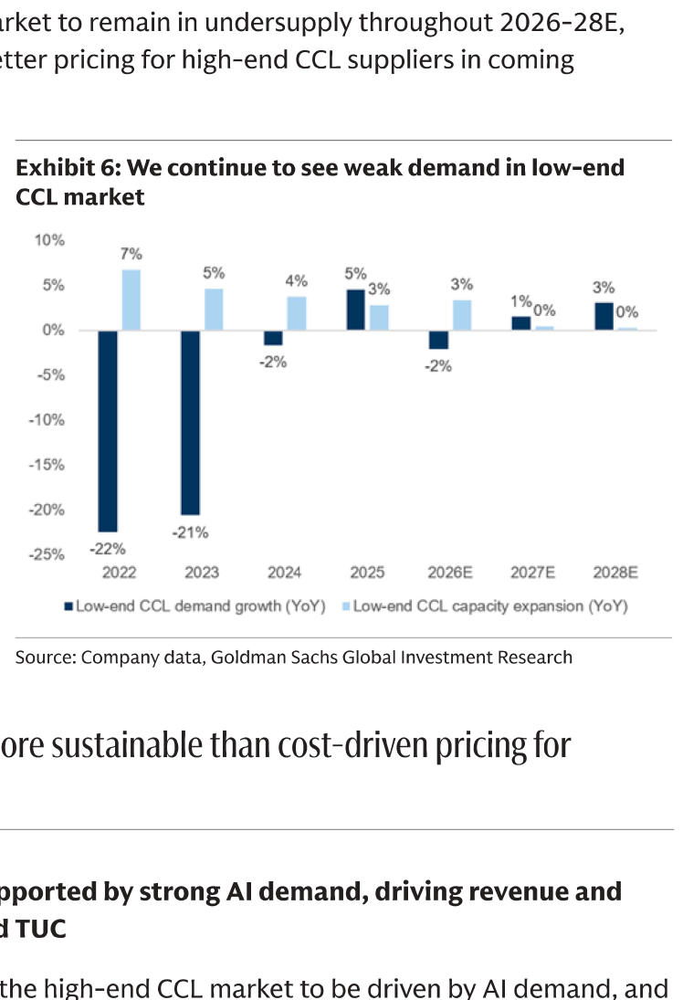

### 解讀摘要

低端 CCL 需求在 2022-23 年分別下滑 22%、21%，2024-25 年小幅回溫後，2026E 又轉為 -2%，2027-28E 僅勉強持平（+1-3%）。與高端 CCL 供不應求形成鮮明對比，低端 CCL 的漲價（Exhibit 11 中 M6 漲 80%）完全是成本轉嫁（E-glass +150%），毛利率無法改善。

### 表格

| 年度 | 低端 CCL 需求 YoY | 低端 CCL 供給 YoY |
|---|---|---|
| 2022 | -22% | 7% |
| 2023 | -21% | 5% |
| 2024 | -2% | 4% |
| 2025 | 5% | 3% |
| 2026E | -2% | 3% |
| 2027E | 1% | 0% |
| 2028E | 3% | 0% |

> **洞察五（配合 Exhibit 5）**：高端 CCL 需求 +67-135% vs 低端 -2%/+1%，CCL 產業實際上分裂為兩個完全不同的市場。EMC/TUC 所處的高端 CCL 受 AI capex 驅動、定價不敏感；傳統低端 CCL 廠商面對的是消費電子週期、成本轉嫁困難、估值邏輯與前者無法比較。

---

## Exhibit 8｜EMC 與 TUC AI 曝險持續上升

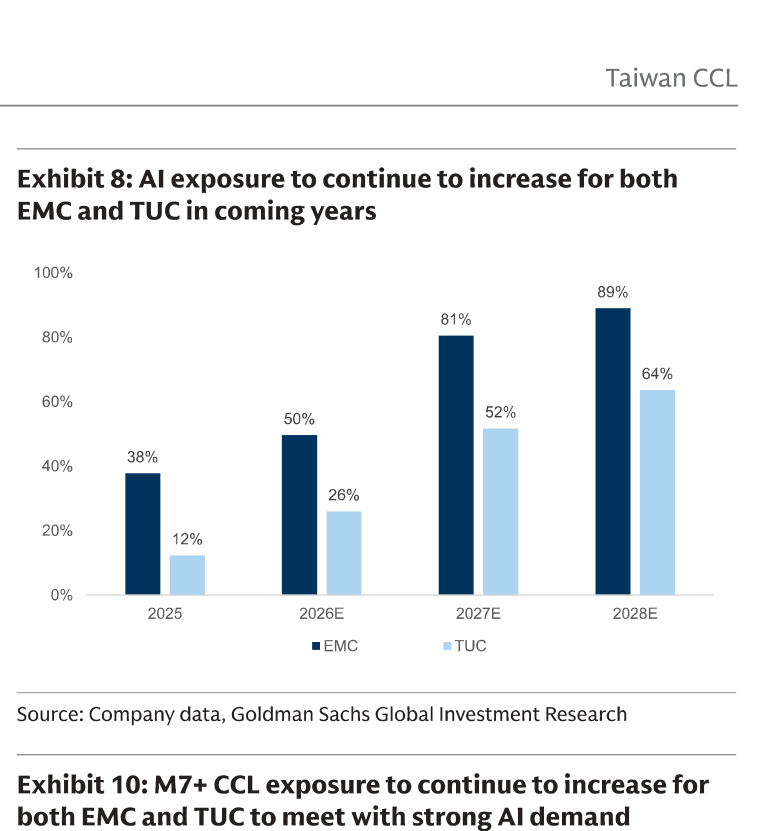

### 解讀摘要

EMC 的 AI 曝險（AI 伺服器 CCL 佔總收入比例）從 2025 年 38% 快速上升至 2028E 89%，TUC 從 12% 上升至 64%。EMC 到 2028E 接近純 AI CCL 播放器，財務表現幾乎等於「高端 CCL 週期」本身；TUC 仍有 36% 非 AI 業務，業績波動較分散。EMC 對高端 CCL 定價週期的 beta 更高，反映在更高的目標 P/E（27x vs TUC 22x）。

### 表格

| 年度 | EMC AI 曝險 | TUC AI 曝險 |
|---|---|---|
| 2025 | 38% | 12% |
| 2026E | 50% | 26% |
| 2027E | 81% | 52% |
| 2028E | 89% | 64% |

---

## Exhibit 9｜AI 伺服器 CCL 市場份額：EMC+TUC 合計 53%+

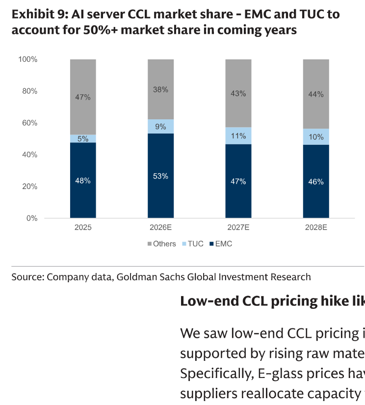

### 解讀摘要

在 AI 伺服器 CCL 市場，EMC 維持 46-53% 市占，TUC 從 2025 年 5% 上升至 2026E 9%、2027-28E 10-11%。EMC+TUC 合計在 2026E 達 62% 市占高峰，2027-28E 略降至 56-58%（Others 回升，可能是 Panasonic 等全球廠商擴產貢獻）。高端 CCL 的客戶認證壁壘使 Others 份額被壓縮至歷史低點 38%（2026E），是護城河最直觀的體現。

### 表格

| 年度 | EMC | TUC | EMC+TUC | Others |
|---|---|---|---|---|
| 2025 | 48% | 5% | 53% | 47% |
| 2026E | 53% | 9% | 62% | 38% |
| 2027E | 47% | 11% | 58% | 43% |
| 2028E | 46% | 10% | 56% | 44% |

> **洞察六**：EMC 2026E 市占 53% 高峰後 2027-28E 略降至 46-47%，不是失去份額，而是在需求爆炸（+135%）背景下 TUC 和 Others 的新產能稀釋了市占率，EMC 絕對出貨量仍大幅成長。市占看似下滑、實則量額雙升。

---

## Exhibit 10｜M7+ CCL 曝險：EMC 達 99%，TUC 達 75%（by 2028E）

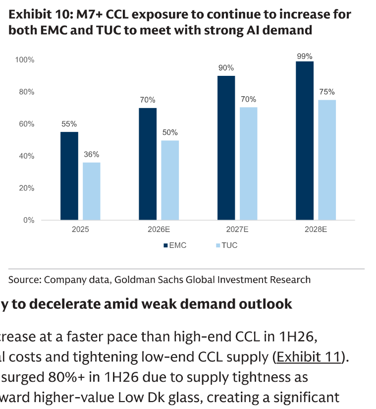

### 解讀摘要

M7+ 是高端 CCL 中規格最高的等級，直接對應 AI 伺服器主機板最嚴苛需求。EMC 的 M7+ 曝險從 2025 年 55% 上升至 2028E 99%，TUC 從 36% 上升至 75%。EMC 2028E 幾乎 100% 的產品都在最高溢價等級，2H26 M7+ CCL 漲價 +10-15% QoQ 對 EMC 的毛利率衝擊最直接——這是 GS 大幅上調 EMC 毛利率預測的核心假設。

### 表格

| 年度 | EMC M7+ 曝險 | TUC M7+ 曝險 |
|---|---|---|
| 2025 | 55% | 36% |
| 2026E | 70% | 50% |
| 2027E | 90% | 70% |
| 2028E | 99% | 75% |

> **洞察七（配合 Exhibit 8）**：EMC 2028E = 89% AI 曝險 × 99% M7+ CCL → 收入幾乎完全來自最高溢價產品服務最具財力的 AI capex 客戶。「雙重集中」提供最高的毛利率上限，但也意味著 AI 投資週期放緩或 M7+ 客戶轉單是最集中的下行風險。

---

## Exhibit 11｜高端 CCL 定價需求驅動，低端成本轉嫁：利潤含義截然不同

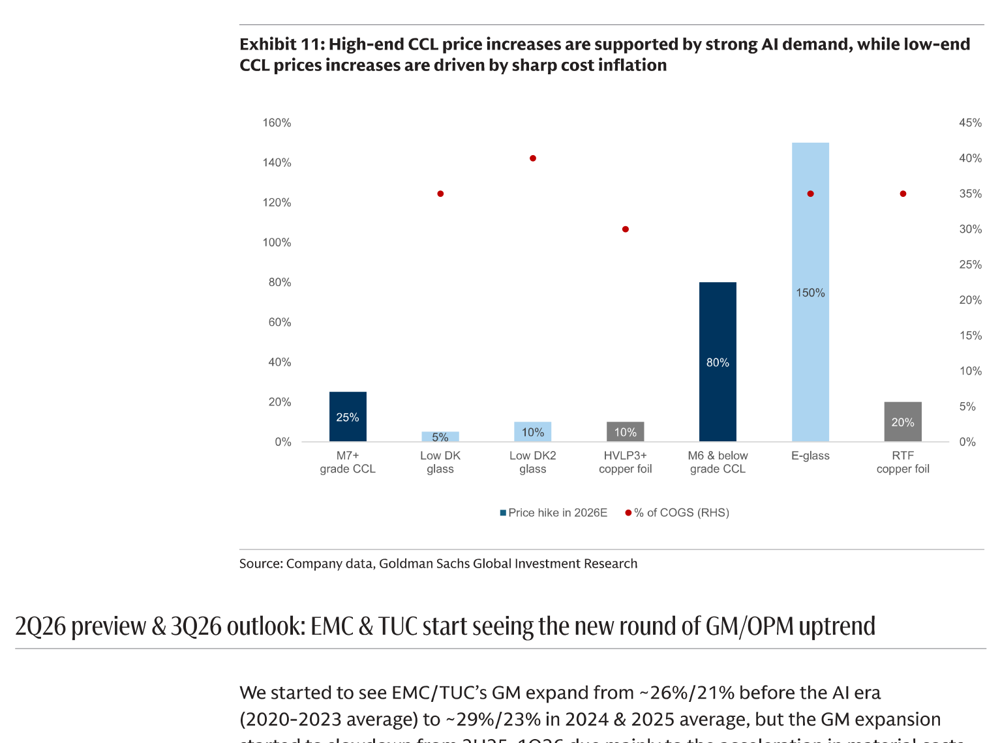

### 解讀摘要

M7+ CCL 2026E 漲價 25%（需求驅動），而主要原料 Low DK glass 僅漲 5%、Low DK2 glass 漲 10%——售價與成本的剪刀差使毛利率顯著改善。相反，M6 及以下漲幅高達 80%，但背後是 E-glass 漲 150%、RTF 銅箔漲 20% 的成本推動；Low-end CCL 廠商以漲價維持毛利率，根本沒有擴張空間。這解釋了為什麼同樣「漲價」，但只有高端 CCL 廠商（EMC/TUC）能從定價週期中真正受益。

### 表格

| 材料 / 產品 | 2026E 漲幅 | 佔 COGS（視覺估算） |
|---|---|---|
| M7+ grade CCL | 25% | ~35% |
| Low DK glass | 5% | ~35% |
| Low DK2 glass | 10% | ~40% |
| HVLP3+ copper foil | 10% | ~30% |
| M6 & below grade CCL | 80% | N/A（成品） |
| E-glass | 150% | ~35% |
| RTF copper foil | 20% | ~35% |

視覺估算（% of COGS 從圖右軸紅點讀取）。

> **洞察八**：M7+ CCL 售價漲 25% 而主要原料漲 5-10%，假設原料占 COGS 約 65-70%，每 1% 售價上漲對應約 1.6-1.7ppt 的毛利率改善。25% 的售價漲幅理論上帶來約 40ppt 的毛利率改善空間，實際受產品組合移轉速度（非全量 M7+）影響，但方向明確——這是毛利率持續上行的算術基礎。

---

## Exhibit 12｜EMC & TUC 毛利率趨勢：GMU 上行重啟（1Q20-4Q28E）

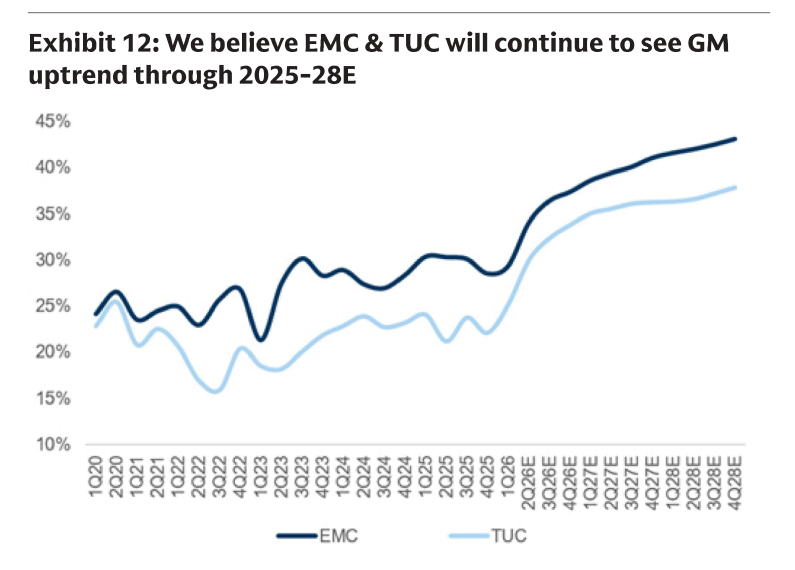

### 解讀摘要

季度 GM 趨勢圖顯示，EMC（深藍線）與 TUC（淺藍線）在 AI 時代前（2020-2023 均值約 26%/21%）長期在 15-30% 區間震盪。AI 週期第一輪（2024-2025）帶來初步上升至約 29-30%/23-24%，而 2026E 起出現「折彎」加速——GS 預測 EMC 到 4Q28E 達 ~43%，TUC 達 ~38%。這不是漸進式改善，而是高端 CCL 第二輪漲價 + M7+ 產品組合快速集中的 step-up 效應。

> **洞察九**：EMC 從歷史均值 ~26% 到 2028E 目標 ~43%，累積 +17ppt 毛利擴張——其中 AI 週期第一輪約 +3ppt，第二輪（2026-28E）需貢獻 +14ppt。第二輪的驅動力（需求爆炸 + 供給有技術上限）比第一輪更結構化，也是 GS 高目標價能成立的最核心假設。

---

## Exhibit 13｜EMC & TUC 2Q26/3Q26 盈利預估：超預期幅度持續擴大

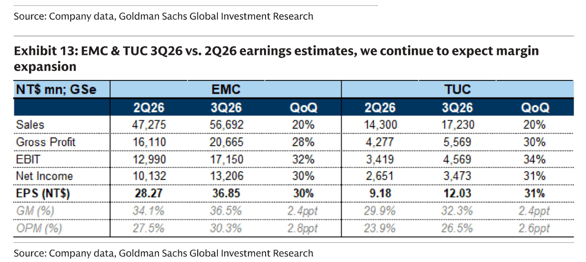

### 解讀摘要

GS 預測 2Q26E 兩家公司均已大幅超越 Bloomberg 共識，3Q26E 超越幅度進一步擴大。EMC 3Q26E EPS NT\$36.85 較 BBG 共識高 34%（QoQ +30%）；TUC 3Q26E EPS NT\$12.03 較 BBG 高 21%（QoQ +31%）。毛利率端：EMC 2Q26E→3Q26E +2.4ppt，顯示高端 CCL 第二輪漲價已開始反映在損益表。

### 表格

| NT\$ mn；GSe | EMC 2Q26 | EMC 3Q26 | EMC QoQ | TUC 2Q26 | TUC 3Q26 | TUC QoQ |
|---|---|---|---|---|---|---|
| Sales | 47,275 | 56,692 | 20% | 14,300 | 17,230 | 20% |
| Gross Profit | 16,110 | 20,665 | 28% | 4,277 | 5,569 | 30% |
| EBIT | 12,990 | 17,150 | 32% | 3,419 | 4,569 | 34% |
| Net Income | 10,132 | 13,206 | 30% | 2,651 | 3,473 | 31% |
| **EPS (NT\$)** | **28.27** | **36.85** | **30%** | **9.18** | **12.03** | **31%** |
| GM (%) | 34.1% | 36.5% | +2.4ppt | 29.9% | 32.3% | +2.4ppt |
| OPM (%) | 27.5% | 30.3% | +2.8ppt | 23.9% | 26.5% | +2.6ppt |

| 指標 | EMC 2Q26E vs BBG | EMC 3Q26E vs BBG | TUC 2Q26E vs BBG | TUC 3Q26E vs BBG |
|---|---|---|---|---|
| EPS 超預期幅度 | +21% | +34% | +13% | +21% |

> **洞察十**：EMC 3Q26E 毛利率 36.5% 距 2028E 目標 ~43% 仍有約 6.5ppt，且每季以 +2.4ppt 節奏推進。若 2H26 M7+ 漲價 +10-15% QoQ 如期落地，4Q26 毛利率可能提前觸及 38-39%——3Q26E 超預期是這輪 GM 上行的起點，不是終點。

---

## 相關個股清單

| 類別 | 公司 | Ticker | 評等 | 備註 |
|---|---|---|---|---|
| 主要推薦 | 台光電 (EMC) | 2383.TW | Buy | TP NT\$9,500（↑ from NT\$6,000），27x 2H27-1H28E P/E |
| 主要推薦 | 聯茂電子 (TUC) | 6274.TWO | Buy | TP NT\$2,860（↑ from NT\$1,888），22x 2H27-1H28E P/E |
