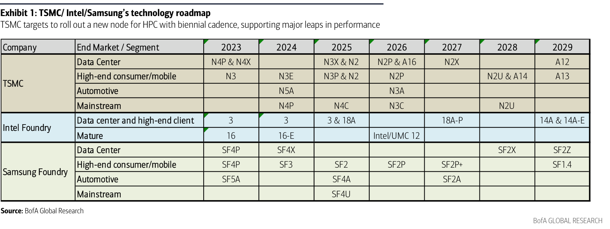
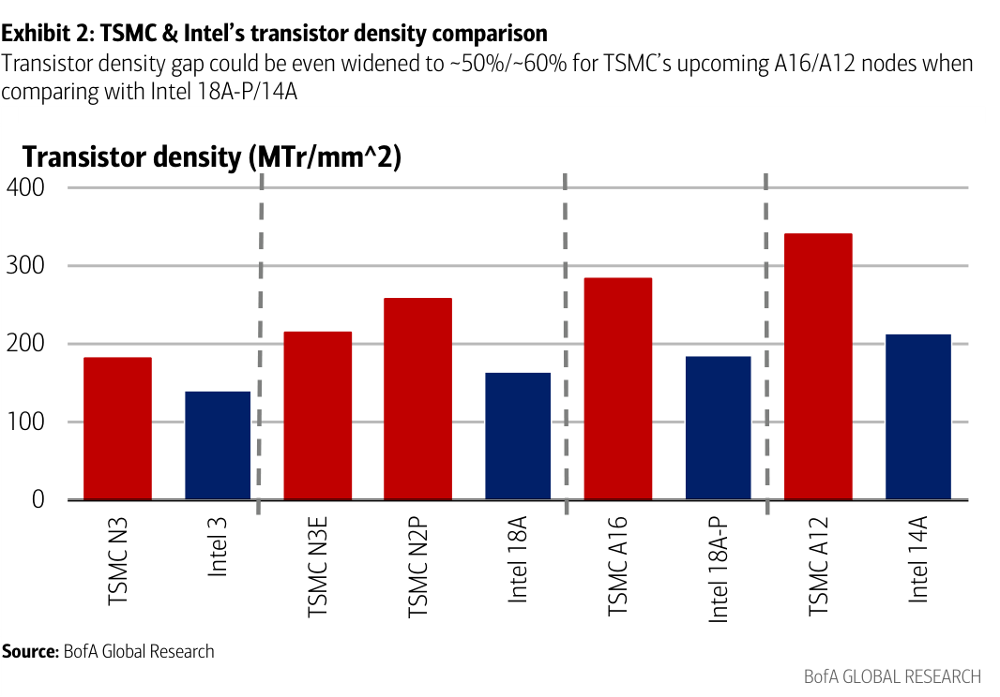
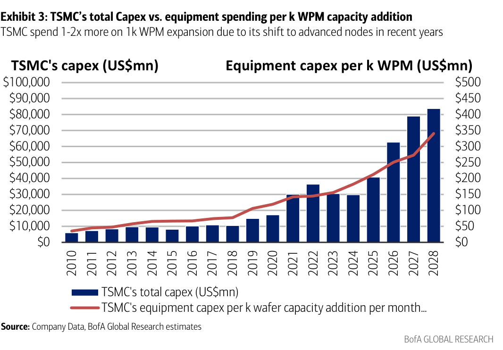

# BofA｜Intel 讀後：對 TSMC 生態系的競爭與供給衝擊有限

**券商**：BofA Securities（Merrill Lynch Taiwan）  
**分析師**：Haas Liu、Mike Yang、Cathy Hsu  
**日期**：2026-07-24  
**主題**：Intel read through — Limited competition and supply disruption to TSMC ecosystem  
**評級**：偏好 TSMC、ASE、Chroma、All Ring  
<a href="https://layx.uk/dl?g=產業&b=BofA&d=20260724&h=Intel-Implication">📎 下載 PDF</a>

---

## 報告總結

本報告是 BofA 台灣半導體團隊接續美國分析師 Vivek Arya 對 Intel 伺服器 CPU 展望與製造進度的更新，回答台廠投資人最關心的一件事：Intel 在 Intel 3／18A 前段擴產與 EMIB-T 先進封裝的推進，是否會侵蝕 TSMC 生態系的訂單與供給。結論是「競爭風險有限」——即便 Intel 把 2026 資本支出上調至 US\$20bn+、產能全數投入自家 CPU，其 Intel 3＋18A 合計產能上限僅約 60k WPM，相對 TSMC 同級節點 400k WPM 規模僅零頭；EMIB-T 則卡在基板與製程良率，須在 2027 上半提升至 98%+ 才有資格成為 CoWoS 替代方案。

投資意涵上，供應鏈與 hyperscaler 至今回報的需求與資本支出展望比市場情緒（去槓桿、AI 投資可持續性疑慮）樂觀，EPS 持續上修加上估值不貴，BofA 偏好高獲利品質的半導體（TSMC、ASE、MediaTek）與股價落後的設備商（Chroma、All Ring）。

---

## BofA 完整投資邏輯鏈

| 論點層次 | Exhibit | 內容 |
|---|---|---|
| 競爭格局 | 1 | TSMC 以雙年一節奏推進 HPC 先進製程，路線圖領先 Intel／Samsung |
| 技術領先 | 2 | A16／A12 對 Intel 18A-P／14A 電晶體密度領先擴大至 ~50%／~60% |
| 供給規模懸殊 | — | Intel 3＋18A 上限約 60k WPM vs TSMC 同級 400k WPM，供給衝擊有限 |
| 封裝門檻 | — | EMIB-T 良率須 2027 上半達 98%+ 才具 CoWoS 替代資格 |
| 設備受惠 | 3 | 製程往先進節點移動使每 k WPM 設備支出 1–2 倍上升，利設備商 |
| **結論** | 報告封面 | **競爭風險有限、需求優於情緒；偏好 TSMC、ASE、Chroma、All Ring** |

> **報告最大邏輯缺口**：Intel「capex 上調全數轉為設備採購」是估算 5–7k WPM 增量產能的前提，若部分用於廠房/研發，實際新增產能更小，競爭衝擊被進一步高估。

---

## 報告核心觀點

| 主題 | BofA 觀點 | 市場共識 | 是否 Contra-Consensus |
|---|---|---|---|
| Intel 對 TSMC 競爭 | 產能規模與封裝良率限制使衝擊有限 | 擔憂 Intel 內製化/搶單 | 是 |
| AI 需求可持續性 | 供應鏈與 hyperscaler 回報優於情緒 | 去槓桿、投資疑慮致情緒疲弱 | 是 |
| EMIB-T vs CoWoS | 尚未達 98%+ 良率，短期非合格替代 | 視為 CoWoS 潛在威脅 | 部分 |
| 設備商評價 | 股價落後、估值不貴，具上行 | 隨 AI 情緒承壓 | 是 |

**偏好排序**：TSMC ＞ ASE ＞ Chroma ＞ All Ring（另看好 MediaTek 獲利品質）  
**零件/個股偏好**：晶圓代工 TSMC、封測 ASE、測試/封裝設備 Chroma 與 All Ring

---

## Exhibit 1｜TSMC／Intel／Samsung 技術路線圖

### 解讀摘要
TSMC 在資料中心 HPC 線以「雙年一節點」節奏推進（2025 N3X&N2 → 2026 N2P&A16 → 2027 N2X → 2029 A12），持續維持對 Intel Foundry（3→18A→18A-P→14A）與 Samsung（SF 系列）的世代領先。對投資人的意義是：TSMC 的節點領先不是單點優勢，而是可預期的路線圖節奏，讓 AI/HPC 客戶把最先進設計綁定 TSMC，Intel 即使 14A 於 2028 量產，時間點仍落後 TSMC 同級節點。

> **原文補充**：Intel 14A PDK 0.9 預計 10 月對客戶就緒、2027 下半 risk ramp、2028 量產；18A-P 已於 2Q26 進入 risk production——時程本身落後於 TSMC 對應節點的商用時點。

### 表格
| 公司 | 區隔 | 2023 | 2024 | 2025 | 2026 | 2027 | 2028 | 2029 |
|---|---|---|---|---|---|---|---|---|
| **TSMC** | Data Center | N4P & N4X |  | N3X & N2 | N2P & A16 | N2X |  | A12 |
| 　 | High-end consumer/mobile | N3 | N3E | N3P & N2 | N2P |  | N2U & A14 | A13 |
| 　 | Automotive |  | N5A |  | N3A |  |  |  |
| 　 | Mainstream |  |  | N4P | N4C | N3C |  | N2U |
| **Intel Foundry** | Data center & high-end client | 3 | 3 | 3 & 18A |  | 18A-P |  | 14A & 14A-E |
| 　 | Mature | 16 | 16-E |  | Intel/UMC 12 |  |  |  |
| **Samsung Foundry** | Data Center | SF4P | SF4X |  |  |  | SF2X | SF2Z |
| 　 | High-end consumer/mobile | SF4P | SF3 | SF2 | SF2P | SF2P+ |  | SF1.4 |
| 　 | Automotive | SF5A |  | SF4A | SF2A |  |  |  |
| 　 | Mainstream |  |  | SF4U |  |  |  |  |

---

## Exhibit 2｜TSMC & Intel 電晶體密度比較

### 解讀摘要
在同世代對比中 TSMC 電晶體密度全面領先，且領先幅度隨節點推進「擴大」而非收斂：早期 N3 對 Intel 3 約領先 +31%，到 A16 對 18A-P 擴大至 ~54%、A12 對 14A 達 ~62%。機制是 TSMC 每一節點的密度增益幅度高於 Intel，意義在於即使 Intel 節點命名看似接近（18A ≈ 1.8nm），實際單位面積電晶體數仍明顯落後，客戶在同樣晶片面積下用 TSMC 能塞入更多運算單元——這是 AI 晶片最在意的指標。

### 表格
| 節點對比 | 電晶體密度（MTr/mm²，視覺估算） | TSMC 領先幅度 |
|---|---|---|
| TSMC N3 vs Intel 3 | 183 vs 140 | +31% |
| TSMC N3E | 215 | — |
| TSMC N2P vs Intel 18A | 258 vs 163 | +58% |
| TSMC A16 vs Intel 18A-P | 285 vs 185 | +54% |
| TSMC A12 vs Intel 14A | 340 vs 210 | +62% |

> **洞察一**：領先幅度從 N3 世代的 +31% 擴大到 A12 世代的 ~62%，代表 Intel 每推進一節點反而被拉開更遠；密度差是先進製程「代工不可替代性」的量化證據，支撐報告「競爭風險有限」的主論點。（密度值為 bar chart 視覺估算，比例與封面 ~50%/~60% 描述一致）

---

## Exhibit 3｜TSMC 總資本支出 vs 每 k WPM 設備支出

### 解讀摘要
TSMC 總資本支出從 2010 的約 US\$6bn 一路攀升至 2028E 約 US\$83bn，而「每新增 1k WPM 產能的設備支出」同步由約 US\$30mn 升至約 US\$340mn（右軸），亦即製程往先進節點移動使**單位產能的設備投入放大 1–2 倍**。意義有二：一是先進製程擴產的資本密集度結構性上升，二是每一單位新增產能對應更多設備採購金額，直接放大設備商（Chroma、All Ring 等）的可及市場，這也是報告偏好落後補漲設備股的量化根據。

> **洞察二**：設備支出/k WPM 十餘年放大約 10 倍以上（~US\$30mn→~US\$340mn），成長速度快於總 capex 本身，代表新增產能的「設備含量」持續提升——即使晶圓產能增速趨緩，設備需求仍有結構性支撐。（線值為無標籤折線視覺估算）

---

## 相關個股清單

| 類別 | 公司 | Ticker | 評等 | 備註 |
|---|---|---|---|---|
| 晶圓代工 | 台積電 TSMC | 2330 TT / TSM | Buy（PO NT\$3,100 / US\$590，20x 2027E P/E） | 首選，節點與密度領先 |
| 封測 OSAT | ASE 日月光 | 3711 TT / ASX | Buy（PO NT\$750 / US\$48，20x 2H27-1H28E P/E） | AI 時代地位穩固 |
| 測試設備 | Chroma 致茂 | 2360 TT | Buy（PO NT\$3,050，38x 2027E P/E） | 2025-27E 獲利 CAGR +70% |
| 封裝設備 | All Ring 萬潤 | 6187 TT | Buy（PO NT\$1,500，36x 2027E P/E） | 受惠先進封裝擴產 |
| IC 設計 | MediaTek 聯發科 | 2454 TT | Buy（PO NT\$5,100，23x 2H27-1H28 P/E） | ASIC pipeline 擴大 |
