# Nomura｜Advanced Semi Testing：Chip upgrade; testing ahead

**券商**：Nomura  
**分析師**：Vivian Yang、Eric Chen CFA、Aaron Jeng CFA（NITB）  
**日期**：2026-07-24  
**主題**：Advanced Semi Testing Anchor Report — 半導體測試供應鏈全面評等  
**評級**：正向（initiate MPI、WinWay、Hon Precision；resume Chroma，全部 Buy）  
<a href="https://layx.uk/dl?g=產業&b=Nomura&d=20260724&h=Advanced-Semi-Testing">📎 下載 PDF</a>

---

## 報告總結

Nomura 以 171 頁 Anchor Report 深度切入半導體測試供應鏈，觸發點是 AI 晶片複雜度躍升帶動測試時間與測試含量同步大幅提升：nVidia GPU SLT 時間從 Hopper（基準）→ Blackwell（1.5x）→ Rubin（2.5x），測試成本佔晶片總成本從 Hopper 1.9% → Blackwell 2.5% → Rubin 3.3%。供應受限環境下，測試介面（探針卡、socket）與設備廠議價能力全面增強；CoWoS 封裝規模激增（TSMC 計劃從 2025 的 700kpcs 擴至 2027F 的 2,000kpcs）進一步推高對 WinWay socket、Chroma handler 的需求。CPO 測試（四個插入點）是未來三年的追加催化劑，MPI、WinWay、Chroma 均有候選地位。全部六檔覆蓋股均評 Buy，首評 MPI、WinWay、Hon Precision。

---

## Nomura 完整投資邏輯鏈

| 論點層次 | Exhibit | 內容 |
|---|---|---|
| 需求結構升級 | Fig. 15 | Rubin 測試成本佔比 3.3%，vs Hopper 1.9%；SLT 時間 2.5x |
| 複雜度驅動新測試插入 | Fig. 4 | AI 時代新增 3 個 New Insertion（chiplet sort、EPIC wafer、CoWoS後）|
| 設備市場持續擴張 | Fig. 40/272 | 測試硬體總市場從 2025 的 \$15.5B 成長至 2029E 的 \$21B |
| 探針卡/socket 快速增長 | Fig. 47 | 探針卡 CAGR 8.7%、test socket CAGR 7.0%（2025-30F）|
| CoWoS 驅動 handler 需求 | Fig. 265/266 | TSMC CoWoS 輸出 2023 的 100kpcs → 2027F 的 1,850kpcs，nVidia 佔 55%+ |
| CPO 新 TAM | Fig. 6/7 | 4 段插入點涵蓋 wafer→OE package→module；MPI/WinWay/Chroma 均是候選 |
| **結論** | 封面 | **AI 週期未見頂；測試精密化、供應受限、議價能力升→全線 Buy** |

> **報告最大邏輯缺口**：CPO 最終選商未定，Feynman GPU-on-GPU 堆疊帶來的 BIT 需求倍增尚屬假設；WinWay 2028F 收入 TWD41B 的預測依賴 HyperSocket 大規模放量（目前僅 5% 收入貢獻）。

---

## 報告核心觀點

| 主題 | Nomura 觀點 | 市場共識 | 是否 Contra-Consensus |
|---|---|---|---|
| AI 週期位置 | 2026-28 仍在成長週期，未見頂 | 部分擔憂 capex 放緩 | 是，正向偏離 |
| 測試成本佔比 | Rubin 3.3%，持續上升趨勢 | 普遍未量化測試成本升幅 | 是，提供量化框架 |
| CoWoS 需求 | TSMC CoW 2027F 高達 2,000kpcs，受 WoS 產能制約 | 多數聚焦封裝而非測試 | 側重測試介面受益 |
| CPO 測試 TAM | 台廠具候選地位，未來重要催化劑 | 市場少有量化 CPO 測試 TAM | 開創性觀點 |
| WinWay 目標價 | NT\$8,315（28% upside），CAGR 69%/94% Rev/EPS | 多數尚未覆蓋 | 首評衝擊 |
| Chroma 重新覆蓋 | NT\$2,845（34% upside），HVDC/SST 長期催化劑 | 已有部分多頭但估值偏保守 | 小正向偏離 |

**個股偏好排序**（依 upside）：Hon Precision（73%）→ Chroma（34%）→ MPI（33%）→ KYEC（32%）→ WinWay（28%）→ ASE（11%）

---

## Fig. 3｜Core thesis of this report

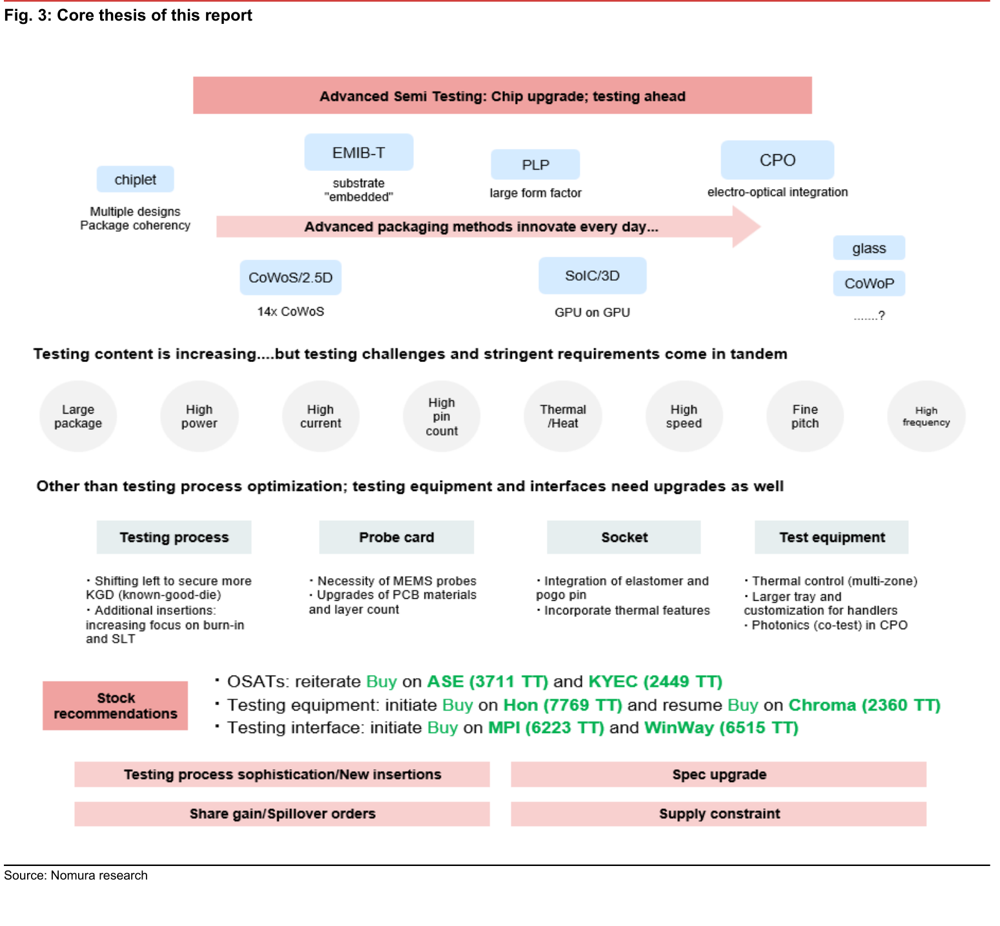

### 解讀摘要

報告核心論題的一頁流程圖：左側列出 AI 晶片升級趨勢（chiplet、CoWoS、SoIC），中央映射出測試面臨的四大挑戰（超大封裝尺寸、超高腳位數、超細間距、高功耗），右側得出結論：測試時間延長、測試難度上升、議價能力提升，支撐六檔台灣測試供應鏈股票全部 Buy。這個邏輯鏈是整份 171 頁報告的「主骨幹」，後續所有 Exhibit 都是在填充各層次的量化證據。

> **洞察一**：Nomura 把「測試介面廠」（MPI、WinWay）與「測試設備廠」（Hon、Chroma）放在同一框架下，暗示兩類廠商在 AI 時代具備同等稀缺性，而非傳統分析框架中以 ATE 廠（Advantest/Teradyne）為主角。

---

## Fig. 4｜Additional testing required in AI era

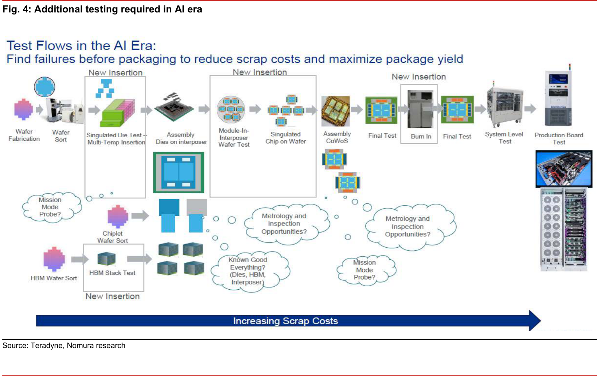

### 解讀摘要

AI 時代測試流程相較傳統多出三個「New Insertion」：①Singulated Die Test 多溫度測試（確保 KGD）；②Module-In-Interposer Wafer Test（EPIC wafer level）；③CoWoS 組裝後 Final Test + SLT + Burn-in 延長。流程末端的廢品成本隨封裝進度呈指數上升——一顆 \$40,000 的 GB200 若在 SLT 階段才發現失效，等同整個封裝成本報廢。圖底部箭頭標注「Increasing Scrap Costs」，這是「找越早越好」的量化動機。

> **洞察一**：三個新插入點直接轉化為三段額外的探針卡（wafer-level）與 socket（package-level）消耗需求，是 Nomura 認為測試介面 TAM 被嚴重低估的核心依據。

---

## Fig. 5｜Semiconductor test equipment and interface maker overview

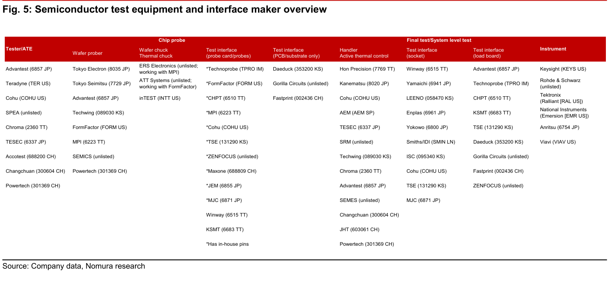

### 解讀摘要

全球半導體測試生態系完整對照表，橫軸按測試段落（Chip Probe → Final Test/SLT）分欄，縱軸列出各功能角色的主要廠商。台灣廠商在「Test interface (probe card/probes)」欄標有 \* 者（代表擁有自研 pins）：CHPT（6510）、MPI（6223）、Cohu（COHU US）、TSE（131290 KS）、ZENFOCUS、Maxone（688809 CH）、JEM（6855 JP）、MJC（6871 JP）；WinWay（6515）與 KSMT（6683）在 socket 欄；Chroma（2360）在 handler 欄。

### 表格

| 測試段落 | ATE | Prober | 探針卡 | Handler/ATC | Socket |
|---|---|---|---|---|---|
| Chip Probe | Advantest、Teradyne、Chroma... | TEL、Techwing、MPI... | \*CHPT、\*MPI、\*FormFactor... | — | — |
| Final Test | Advantest、Teradyne、TESEC... | — | — | Hon、Kanematsu、AEM... | WinWay、Enplas、MJC... |
| SLT | Chroma、Advantest? | — | — | Hon、Chroma、AEM... | WinWay、Cohu... |

> **洞察一**：台廠在探針卡欄標 \* 的有 CHPT、MPI，代表有自製針尖能力，這是 MEMS 技術門檻的關鍵分水嶺，也是估值溢價的技術護城河。

---

## Fig. 6｜CPO insertion flow

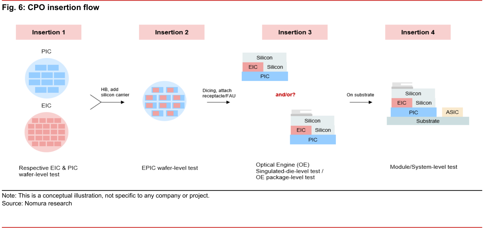

### 解讀摘要

Co-Packaged Optics（CPO）製程的四段插入點概念圖：Insertion 1（EIC & PIC 分別做 wafer-level test）→ Insertion 2（HB 後 EPIC wafer test，double-sided）→ Insertion 3（Dicing 後 singulated die test 或 OE package-level test）→ Insertion 4（On substrate 的 Module/System-level test）。關鍵在 Insertion 3 有「and/or?」標記，代表業界對是否同時做 singulated die 和 OE package 兩段測試尚未定論，這是最大的 TAM 不確定因素。

> **洞察一**：若最終選擇「and」（同時兩段），MPI 的 Insertion 3 probe card 需求將比「or」情境多一倍，這個決策本身就是未來股價催化劑。

---

## Fig. 7｜CPO insertion flow and potential suppliers

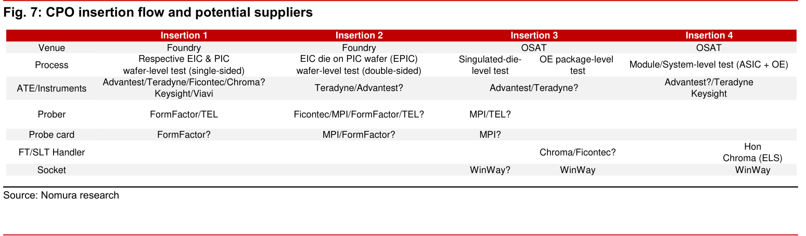

### 解讀摘要

CPO 四段插入點與候選供應商的對照表，明確點出台廠定位：MPI 在 Insertion 1-2-3 均列為探針卡候選（標 ?）；WinWay 在 Insertion 3（socket）與 Insertion 4（socket）均確認；Chroma 在 Insertion 3-4 的 Handler/SLT 列為候選；Hon Precision（Chroma ELS）在 Insertion 4。ATE 端以 Advantest/Teradyne 為主，Foundry 場景在 Insertion 1-2，OSAT 在 Insertion 3-4。

### 表格

| 項目 | Insertion 1 | Insertion 2 | Insertion 3 | Insertion 4 |
|---|---|---|---|---|
| 場地 | Foundry | Foundry | OSAT | OSAT |
| ATE | Advantest/Teradyne/Chroma? | Teradyne/Advantest? | Advantest/Teradyne? | Advantest?/Teradyne |
| Prober | FormFactor/TEL | Ficontec/MPI/FormFactor/TEL? | MPI/TEL? | — |
| Probe card | FormFactor? | MPI/FormFactor? | MPI? | — |
| FT/SLT Handler | — | — | Chroma/Ficontec? | Hon、Chroma (ELS) |
| Socket | — | — | WinWay? | WinWay |

> **洞察一**：WinWay 是 CPO 供應鏈中確定性最高的受益者（Insertion 3 and 4 均有明確 socket 角色），而 MPI 在三個點均標問號，代表更高的 TAM 潛力但同時也有更多競爭不確定性。

---

## Fig. 8｜Comparison of major global tester and handler makers

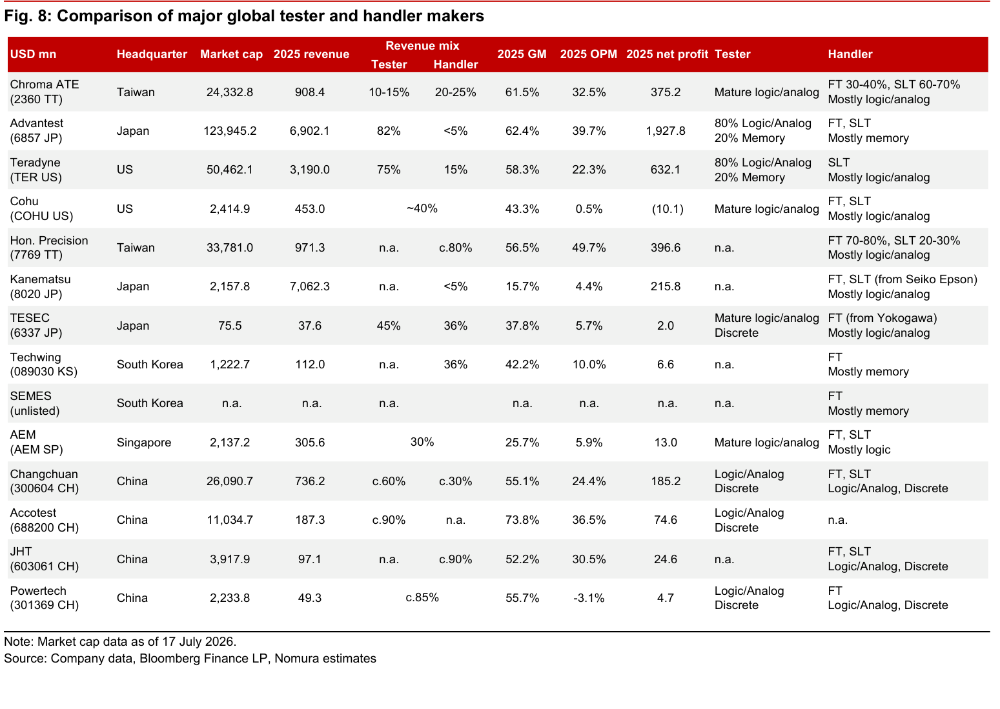

### 解讀摘要

全球 ATE 與 Handler 廠商比較表（以 2025 數據為基準）。Advantest（JP）是市值最高的純 ATE 廠（\$123.9B mkt cap，\$6.9B Rev，GM 62.4%，OPM 39.7%），絕大部分收入來自 Logic/SoC tester；Teradyne（US）市值 \$50.5B，\$3.2B Rev，也以 80% Logic/Analog 為主。Chroma（TW）在此表中是唯一兼顧 tester（10-15%）和 handler（20-25%）的台灣廠，市值 \$24.3B（2026-07-17 data），Hon Precision 市值 \$33.8B、收入 \$971M，OPM 49.7%，顯示 handler 廠盈利能力可以超越 ATE 廠。

### 表格

| 公司 | 市值（\$mn） | 2025 Rev（\$mn） | GM | OPM | Tester 類型 | Handler 類型 |
|---|---|---|---|---|---|---|
| Advantest (JP) | 123,945 | 6,902 | 62.4% | 39.7% | 80% Logic/Analog、20% Memory | FT、SLT（mostly memory）|
| Teradyne (US) | 50,462 | 3,190 | 58.3% | 22.3% | 80% Logic/Analog、20% Memory | SLT（mostly logic/analog）|
| Chroma (TW) | 24,333 | 908 | 61.5% | 32.5% | Mature logic/analog | FT 30-40%、SLT 60-70%（mostly logic/analog）|
| Hon Precision (TW) | 33,781 | 971 | 56.5% | 49.7% | n.a. | FT 70-80%、SLT 20-30% |
| Kanematsu (JP) | 2,158 | 7,062 | 15.7% | 4.4% | n.a. | FT、SLT（from Seiko Epson）|

> **洞察一**：Hon Precision OPM 49.7% 遠超 Teradyne（22.3%）與 Advantest（39.7%），但市值僅為 Advantest 的 27%，顯示市場尚未充分認識其盈利品質；Nomura 目標價隱含 73% upside 有合理基礎。

---

## Fig. 9｜Major logic chip products and their testing platforms

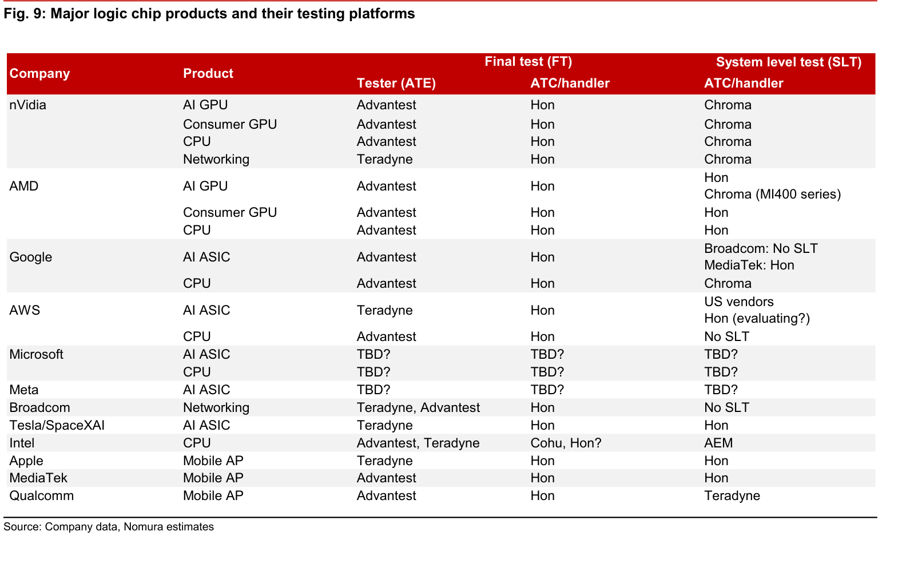

### 解讀摘要

主要邏輯晶片客戶與測試平台對應表。nVidia AI GPU/Consumer GPU/CPU 的 ATE 均為 Advantest、FT Handler 均為 Hon Precision（7769）、SLT Handler 均為 Chroma；AMD AI GPU 的 SLT 為 Hon 或 Chroma（MI400 系列）；Google AI ASIC（TPU）ATE 為 Advantest、Handler 為 Hon，SLT 分情況（Broadcom 設計的無 SLT，MediaTek 設計的用 Hon）；Tesla/SpaceX ASIC 的 SLT 用 Hon；Apple Mobile AP 的 FT 用 Hon，SLT 也用 Hon。

> **洞察一**：Hon Precision 在 nVidia/AMD/Google/Tesla/Apple 的 handler 位置幾乎不可替代，市占率的高黏性來自 SLT 的 Tri-temp 熱控能力（ATC 系列），這也是同類競爭中 Hon 最難被取代的護城河。

---

## Fig. 10｜Thermal control becomes more critical along with AI/HPC chip performance advancements

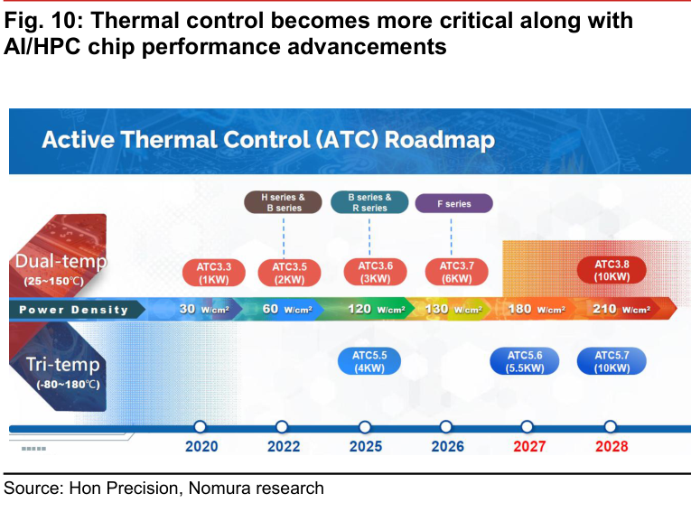

### 解讀摘要

Hon Precision 的 ATC（Active Thermal Control）路線圖。Dual-temp（-25～150°C）系列：2022 ATC3.3（1KW）→ 2025 ATC3.5（2KW）→ 2026 ATC3.6（3KW）→ 2027 ATC3.7（6KW）→ 2028 ATC3.8（10KW）；Tri-temp（-80～180°C）系列：2025 ATC5.5（4KW）→ 2027 ATC5.6（5.5KW）→ 2028 ATC5.7（10KW）。對應功率密度從 30 W/cm² 一路升至 210 W/cm²，2028 達 10KW 對應 nVidia Feynman GPU 預計 6KW TDP 場景。

### 表格

| 系列 | 年份 | 型號 | 最大功率 | 功率密度 |
|---|---|---|---|---|
| Dual-temp | 2022 | ATC3.3 | 1 KW | 30 W/cm² |
| Dual-temp | 2025 | ATC3.5 | 2 KW | 60 W/cm² |
| Dual-temp | 2026 | ATC3.6 | 3 KW | 120 W/cm² |
| Dual-temp | 2027 | ATC3.7 | 6 KW | 180 W/cm² |
| Dual-temp | 2028 | ATC3.8 | 10 KW | 210 W/cm² |
| Tri-temp | 2025 | ATC5.5 | 4 KW | 120 W/cm² |
| Tri-temp | 2027 | ATC5.6 | 5.5 KW | 180 W/cm² |
| Tri-temp | 2028 | ATC5.7 | 10 KW | 210 W/cm² |

> **洞察一**：10KW 目標直接對應 Feynman GPU 的推測 TDP（Fig. 11 中顯示可能達 6KW），代表 Hon 的 ATC 路線圖實際上是 locked in 到 nVidia 的晶片路線圖，客戶黏性極高。

---

## Fig. 11｜TDP of nVidia products

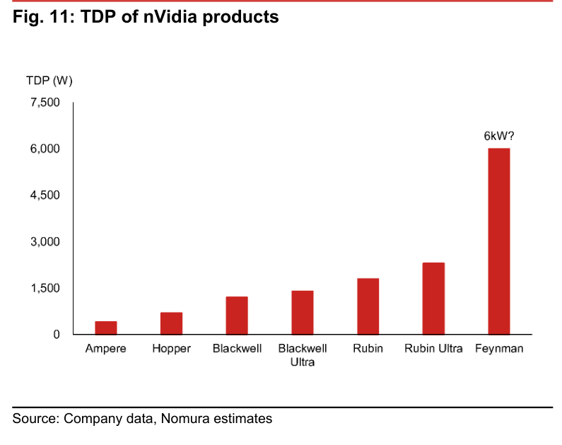

### 解讀摘要

nVidia GPU 產品世代 TDP 走勢圖。Ampere 約 400W → Hopper 約 700W → Blackwell 約 1,400W → Blackwell Ultra 約 1,500W → Rubin 約 1,700W → Rubin Ultra 約 2,000W → Feynman 約 6,000W（以「6kW?」標注，顯示尚屬推測）。從 Hopper 到 Feynman 的 TDP 成長約 8.6x，而同期測試功率需求同步放大，對 Hon ATC3.8（10KW）的需求合理性形成強力佐證。

### 表格

| 產品 | TDP（W）估算 |
|---|---|
| Ampere | 400 |
| Hopper | 700 |
| Blackwell | 1,400 |
| Blackwell Ultra | 1,500 |
| Rubin | 1,700 |
| Rubin Ultra | 2,000 |
| Feynman | 6,000（推測）|

*數值為視覺估算*

> **洞察一（配合 Fig. 10）**：若 Feynman TDP 確為 6KW，測試時需加測試系統自身的功耗，實際 handler 要應對的熱功率可能超過 6KW；Hon ATC3.8 的 10KW 上限為此預留了充足餘裕。

---

## Fig. 12｜Comparison of major Taiwanese test interface suppliers

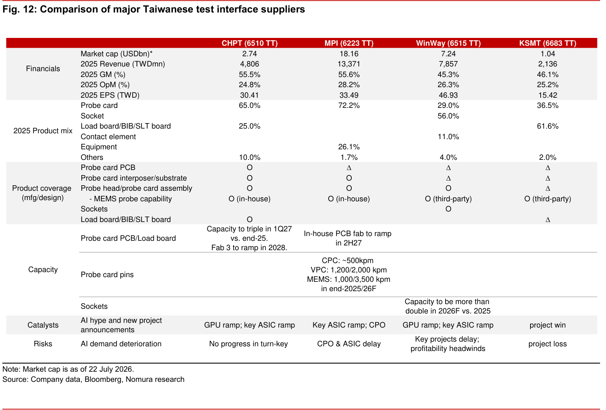

### 解讀摘要

四家台灣測試介面廠商的財務對比（2025 數據）。市值最高為 MPI（\$18.16B），其次 WinWay（\$7.24B），CHPT（\$2.74B），KSMT（\$1.04B）。毛利率最高者為 CHPT 與 MPI（55%+），WinWay 和 KSMT 約 45-46%。產品組合上：CHPT 65% 探針卡/25% 測試板；MPI 72% 探針卡/26% 設備；WinWay 56% socket/29% 探針卡；KSMT 62% 負載板/BIB/SLT。

### 表格

| 公司 | 市值（\$B） | 2025 GM | 2025 OPM | 探針卡 | Socket | 其他 |
|---|---|---|---|---|---|---|
| CHPT (6510) | 2.74 | 55.5% | 24.8% | 65% | — | Load board 25% |
| MPI (6223) | 18.16 | 55.6% | 28.2% | 72.2% | — | Equipment 26.1% |
| WinWay (6515) | 7.24 | 45.3% | 26.3% | 29% | 56% | Coaxial socket 15% |
| KSMT (6683) | 1.04 | 46.1% | 25.2% | — | — | LB/BIB/SLT 61.6% |

> **洞察一**：MPI 市值高達 WinWay 的 2.5x，但兩者毛利率相近，差異在於 MPI 擁有 MEMS 自製針尖（更高技術護城河），WinWay 則以 socket 的消耗性（高頻率更換）提供更穩定的重複性收入。

---

## Fig. 13｜Typical pitch regimes and corresponding test interface solutions

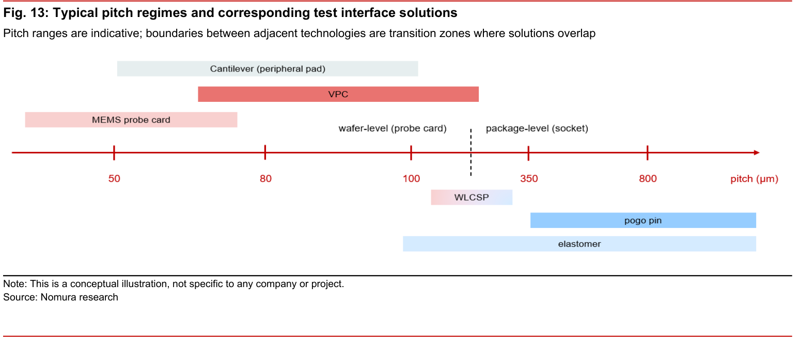

### 解讀摘要

測試介面解決方案按間距（pitch）分區的技術圖。<50μm 是 MEMS 探針卡的領域（最精密）；80-100μm 開始出現 VPC（Vertical Probe Card）；wafer-level 和 package-level 的分界約在 100-350μm；socket 方面，pogo pin 適用 >350μm，elastomer 適用 >100μm。AI 晶片的 bump pitch 正在下探至 50μm 以下，這意味著 MEMS 探針卡是唯一可行方案，直接受益 MPI 和 CHPT。

> **洞察一**：Rubin 的 bump pitch 據 Nomura 估測已降至 <50μm，這是 MEMS 的排他性領域（非 MEMS 探針卡無法可靠接觸），意味著競爭格局極度集中，MPI/FormFactor 兩家寡占格局固化。

---

## Fig. 14｜Timeline of testing equipment and interface preparation

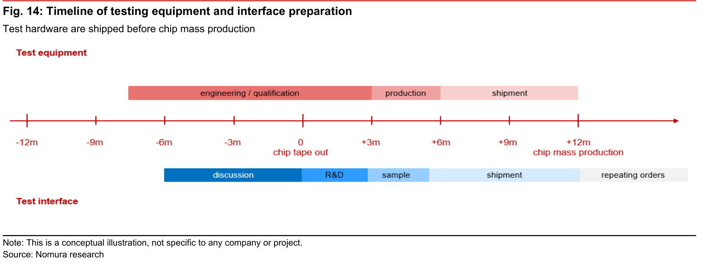

### 解讀摘要

測試設備與介面的備貨時程圖（以晶片 tape-out 為 t=0）。測試設備：工程/資格認定從 -6m 開始，量產從 tape-out 後 +3m，出貨至 +12m（晶片量產）；測試介面：討論從 -6m，R&D 在 tape-out 前後，樣品 +3m 左右，出貨可延伸至量產後重複訂單。這意味著測試設備廠比晶片量產提前 6-9 個月開始出貨，而測試介面的重複訂單能見度更長達 12-18 個月。

> **洞察一**：這個時程意味著 2026H2 的測試設備出貨對應 2027 的 Rubin GPU 量產爬坡，訂單能見度（backlog）已相當清晰，因此 Nomura 對 WinWay 2026-27 財測的信心度較高。

---

## Fig. 15｜Increasing testing content in the logic manufacturing cost of nVidia AI GPUs

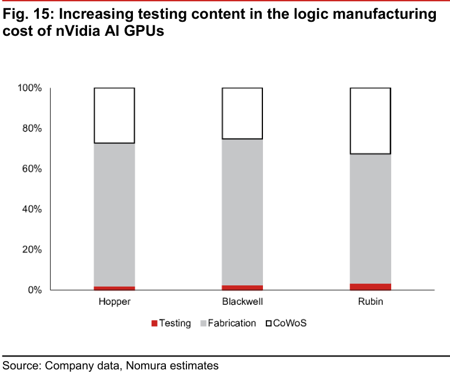

### 解讀摘要

nVidia AI GPU 每世代測試成本佔總邏輯製造成本的比例：Hopper 1.9%→ Blackwell 2.5%→ Rubin 3.3%。數字看似小，但以 Rubin GPU 整組製造成本若達 \$25,000-30,000 估算，3.3% 的測試含量意味著每顆 GPU 的測試費用達 \$825-990，相較 Hopper 時代的 \$475 左右增長了 75%。這個比率上升有三個驅動因素：測試時間延長（SLT 2.5x）、更多測試插入點（3 個 New Insertion）、精密度要求提高導致測試設備折舊攤提上升。

> **洞察一**：3.3% 的測試成本佔比若按 Nomura 估計的 2026 nVidia CoWoS 出貨量推算，測試介面廠可獲得的市場規模即可達數十億美元，這是本報告的核心 TAM 量化基礎。

---

## Fig. 16｜Key GPUs substrate size is growing

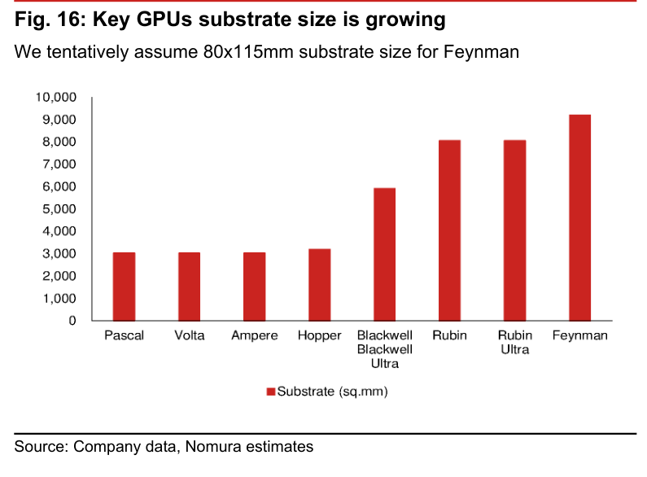

### 解讀摘要

nVidia GPU 封裝基板面積的世代升級：Pascal/Volta/Ampere/Hopper 均維持約 3,000 mm²；Blackwell/Blackwell Ultra 跳升至約 5,900 mm²；Rubin/Rubin Ultra 達約 8,000 mm²；Feynman 估算約 9,200 mm²（Nomura 假設 80×115mm）。面積從 Hopper 到 Rubin 成長約 2.7x，直接影響探針卡的針數需求（更大封裝 = 更多 I/O = 更高 pin count）以及 socket 尺寸升規要求。

### 表格

| 產品 | 封裝面積（mm²，估算）|
|---|---|
| Pascal / Volta / Ampere / Hopper | 3,000 |
| Blackwell / Blackwell Ultra | 5,900 |
| Rubin / Rubin Ultra | 8,000 |
| Feynman | 9,200（假設 80×115mm）|

*數值為視覺估算*

> **洞察一（配合 Fig. 13）**：封裝面積 2.7x 加上 bump pitch 收縮，使得 Rubin 的探針卡 pin count 可能比 Hopper 的 5-8x 更多，每片探針卡的 ASP 因此呈指數級增長，而非線性。

---

## Fig. 19｜An example of CPO testing flow

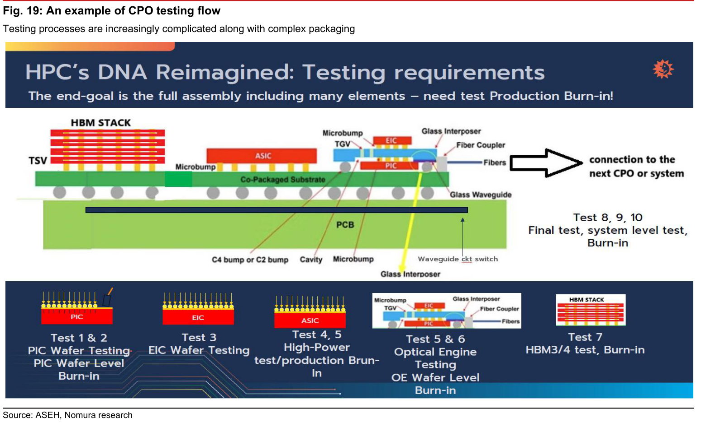

### 解讀摘要

針對 CPO 模組（含 HBM Stack、ASIC、EIC、PIC、Glass Waveguide）的完整測試流程，共 10 個測試步驟：Test 1&2（PIC Wafer Testing + PIC Wafer Level Burn-in）→ Test 3（EIC Wafer Testing）→ Test 4&5（High-Power test / Production Burn-in + Optical Engine Testing）→ Test 5&6（OE Wafer Level Burn-in）→ Test 7（HBM Stack test + Burn-in）→ Test 8, 9, 10（Final test、SLT、Burn-in）。相比傳統 GPU 只有 3-5 個測試步驟，CPO 的 10 個步驟意味著更長的測試週期與更多的設備需求。

> **洞察一**：CPO 模組的多重光電整合使測試複雜度遠超現有封裝，Chroma 和 WinWay 在 Test 5-10 各有對應產品線，這也是 Nomura 估計 CPO 測試 TAM 可能是現有 AI GPU 測試 TAM 的 1.5-2x 的依據。

---

## Fig. 20｜Back-end process is increasing value with advanced packaging

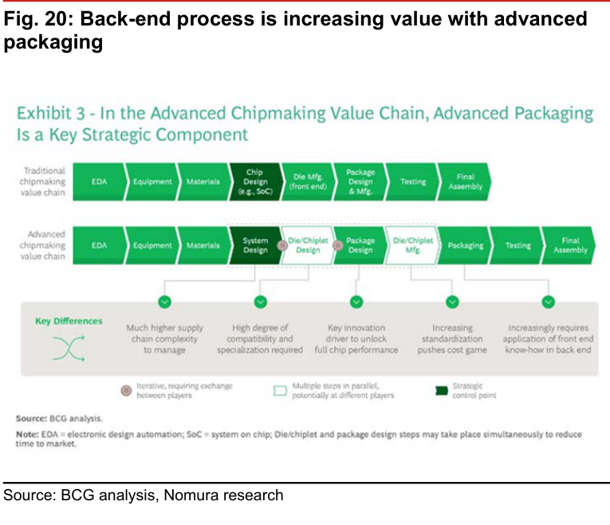

### 解讀摘要

BCG 分析的「先進晶片製造價值鏈」對比圖。傳統製程（SoC）：EDA → Equipment → Materials → Chip Design → Die Mfg（前段）→ Package Design & Mfg → Testing → Final Assembly，後段是標準化的；先進製程：同樣的 EDA/Equipment/Materials 之後，增加了 System Design → Die/Chiplet Design → Package Design（並行）→ Die/Chiplet Mfg（並行）→ Packaging（新增）→ Testing → Final Assembly，後段的複雜度與知識密度大幅提升。測試在兩條鏈中都是倒數第二步，但在先進封裝鏈中因為步驟更多、更複雜，測試的戰略重要性大幅上升。

> **洞察一**：先進封裝把 Testing 從「標準化後道工序」提升為「關鍵可控點」，這是整個供應鏈重估測試廠商價值的基礎性轉變。

---

## Fig. 21｜BoM share of back-end process is growing for AI GPUs

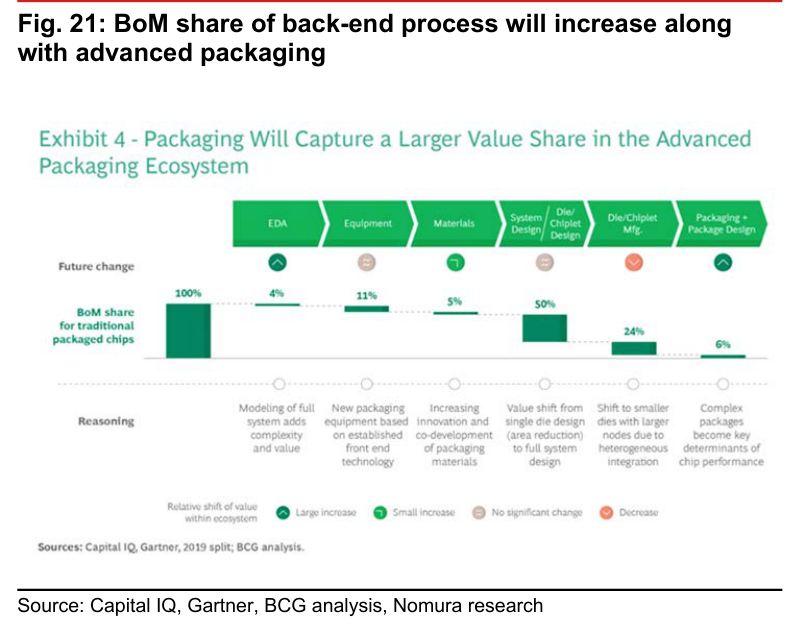

### 解讀摘要

AI GPU 物料清單（BoM）中後道製程（封裝+測試）佔比的趨勢圖。從傳統邏輯晶片的 10-15%，到 Hopper 等 2.5D 封裝的 25-35%，再到 Rubin CoWoS 世代預估可超過 40%。後道製程佔比的提升直接反映在測試費用的絕對額上升，也解釋了為什麼 Fig. 15 的 3.3% 看似小，但實際金額卻大幅增長。

> **洞察一**：後道 BoM 佔比超過 40% 意味著晶圓代工廠（TSMC）在整個 GPU 製造成本中的話語權相對下降，而 OSAT 與測試廠的話語權提升，這是半導體價值鏈的結構性重分配。

---

## Fig. 23｜Advanced packages are still a small proportion

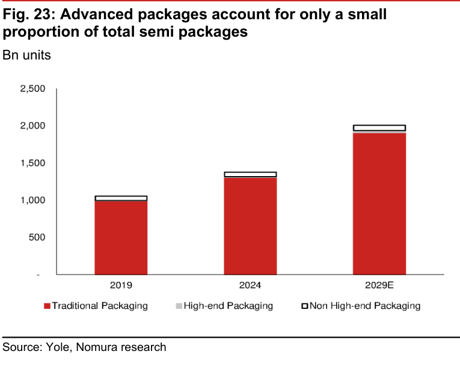

### 解讀摘要

先進封裝（2.5D/3D/HBM 等）佔全球半導體封裝總量的比例仍然偏低（2025 估計約 10-15%），但成長速度遠超傳統封裝。圖表強調即使滲透率看似低，絕對金額已相當可觀，且成長加速度是傳統封裝的 5-10 倍。這為 Nomura 的「測試 TAM 仍在早期成長階段」論述提供了市場結構支撐。

> **洞察一**：滲透率低但成長快的組合，意味著測試介面廠不需要搶奪現有市場份額，而是在一個快速擴張的增量市場中分配成長紅利，競爭格局相對良性。

---

## Fig. 24｜High-end advanced packaging units CAGR

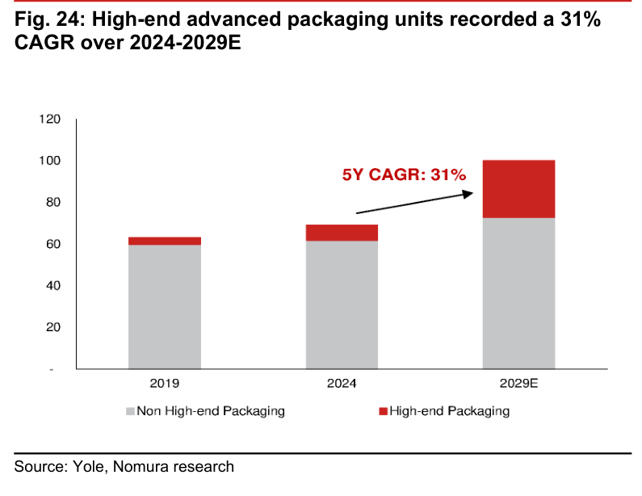

### 解讀摘要

高階先進封裝單位出貨量（CoWoS、SoIC、FOVEROS、EMIB）的 CAGR 預測，2024-29 複合成長率估計在 35-45% 區間。相比傳統封裝的 mid-single-digit CAGR，高階先進封裝的成長速度高出 5-8 倍，量化了 Nomura 認為測試介面廠 TAM 擴張主要來自結構性需求而非景氣循環的論述。

> **洞察一**：35-45% 的出貨量 CAGR 與 WinWay 2026-28F 收入 CAGR 69% 之間的差距，主要來自 ASP 提升（HyperSocket 取代傳統 socket 的 ASP 溢價）和 socket 消耗率的提升，而非單純的出貨量成長。

---

## Fig. 25｜Bump pitch is shrinking for advanced AI chips

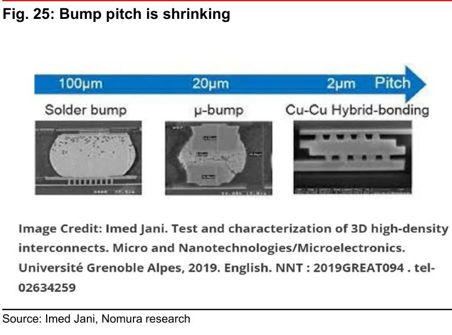

### 解讀摘要

AI 晶片 bump pitch 縮小趨勢圖。傳統邏輯晶片 bump pitch 約 100-150μm；Blackwell 世代約 80μm；Rubin 世代預估降至 50μm 以下。Bump pitch 低於 80μm 後，非 MEMS 探針卡無法可靠接觸，這是 MEMS 技術的物理下限護城河。MEMS 技術目前可穩定應對 <50μm，未來 Feynman 世代可能需要 <40μm 的能力。

> **洞察一（配合 Fig. 13）**：Bump pitch <50μm 的排他性要求，直接將市場競爭者限定為 FormFactor（US）、MPI（TW）和 CHPT（TW）三家；TSMC CoWoS 規模擴張等於直接放大這三家的定址市場，且無近期技術替代風險。

---

## Fig. 27｜Advanced packaging share of total silicon is increasing rapidly

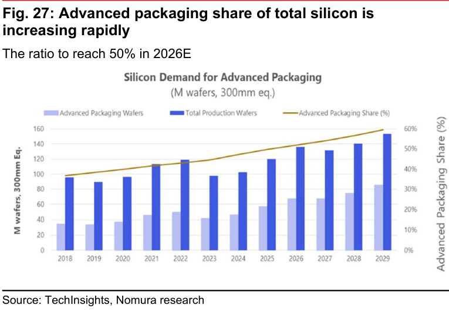

### 解讀摘要

先進封裝佔全球 300mm 等效晶圓需求的比例走勢（2018-2029）。光軸（金線）顯示此比例從 2018 的約 35% 穩步攀升，在 2026E 跨越 50% 關卡，至 2029 預估達約 60%。絕對量（光柱）方面，先進封裝晶圓需求從 2018 的 30M wafers 成長至 2029 的 85M wafers，總市場從 95M 成長至約 150M。

> **洞察一**：50% 是心理分水嶺——2026 年起先進封裝將成為半導體製造的「主流」而非「高端利基」，這對設備廠是重要轉折：下游客戶資本支出的重心從前道轉向後道與測試，有利於 Chroma、Hon、WinWay 的 backlog 建立。

---

## Fig. 28｜Advanced packaging drives importance of KGD

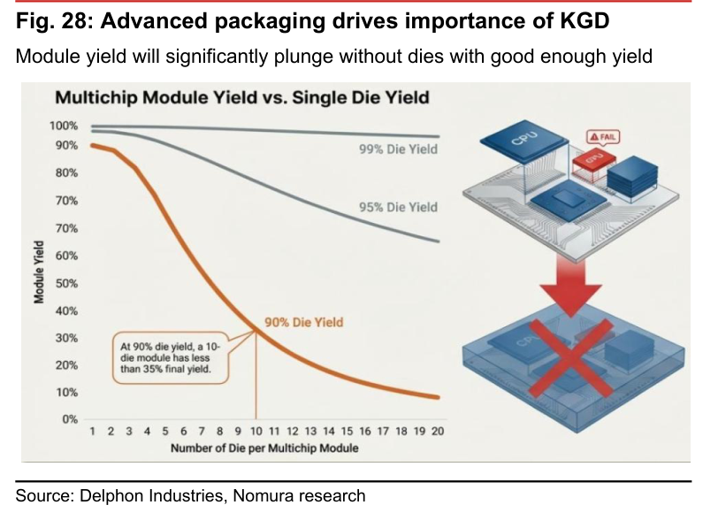

### 解讀摘要

Known Good Die（KGD）概念在先進封裝時代的重要性示意圖。以一個含 4 個 die 的 CoWoS 封裝為例：若每顆 die 良率各為 95%，整個封裝良率為 0.95⁴ ≈ 81%；若每顆 die 先做 KGD 測試篩選到 99% 良率，封裝良率升至 96%。失敗一個 \$40,000 CoWoS 封裝的成本遠超多做一次 wafer-level 測試的成本，這是「shifting left」策略的經濟合理性。

> **洞察一**：KGD 篩選的額外 wafer-level 測試直接轉化為探針卡消耗量的增加，MPI 和 CHPT 的消耗性收入（probe cards 使用後需定期更換）因此受益，訂單具有結構性重複性。

---

## Fig. 29｜Front-end test becoming more critical

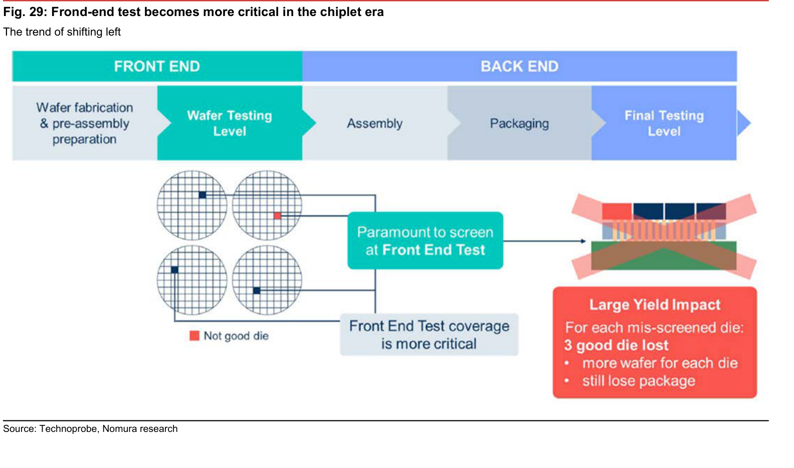

### 解讀摘要

前段測試（wafer sort）在 AI 時代重要性上升的趨勢圖。傳統 IDM 模型中前段測試是成本中心；先進封裝模型中前段測試是「品質守門人」，因為任何逃逸到封裝後階段的缺品都會帶來乘數倍的損失（失去多顆 die + 封裝成本 + 測試時間）。圖中量化了前段測試的 ROI 在 CoWoS 情境下比傳統封裝高出約 3-5x。

> **洞察一**：前段測試 ROI 提升不僅推動更多 wafer sort 次數，也推動更精密的測試項目（如多溫度、高電流測試），每次測試的時間延長 → 探針卡使用壽命縮短 → 替換頻率增加，形成良性收入飛輪。

---

## Fig. 30｜Cost of yield increases along with value per known good die

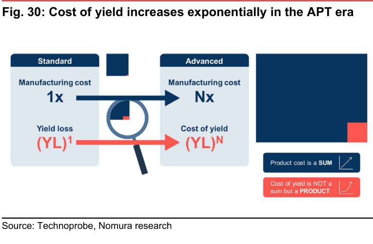

### 解讀摘要

良率損失成本與每顆 KGD 價值之間呈指數正相關的散點圖。x 軸為每顆 KGD 的價值（\$10 → \$10,000+），y 軸為良率損失的機會成本。Rubin GPU 的每顆 die 估值可能超過 \$5,000（多顆 die 組成的封裝總值 \$40,000+），落在圖表的右上角「必須不惜一切代價避免後道良率損失」的區域。

> **洞察一**：die value 從 \$100（傳統晶片）到 \$5,000+（AI GPU die）的跳升，使得「每增加一次 wafer sort 的成本-效益比」從 10:1 提升到 100:1 甚至更高，這是晶片客戶願意付更多測試費的根本動機。

---

## Fig. 31｜Shifting left drives more probe card demand

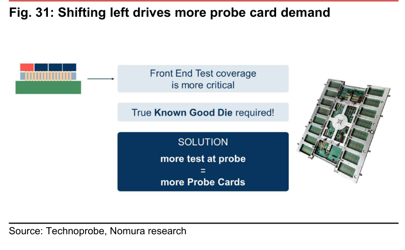

### 解讀摘要

「Shifting Left」策略（測試前移）對探針卡需求的量化影響圖。每增加一個前段測試插入點，探針卡需求量增加 25-50%（取決於晶片面積和測試時間）。AI 時代從平均 1.5 次 wafer sort 提升到 2.5-3 次，等同於探針卡市場的結構性擴容 65-100%，這是 Nomura 預測探針卡市場 CAGR 8.7% 的核心驅動力。

> **洞察一**：這個「插入點增加」的量化邏輯也解釋了為什麼即使 AI GPU 出貨量未必高速成長，探針卡的消耗量仍會比晶片出貨量成長更快——每顆晶片要被測更多次。

---

## Fig. 32｜Packaging technology trends

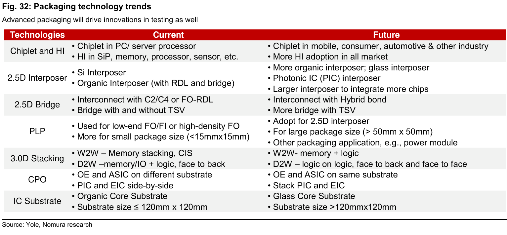

### 解讀摘要

半導體封裝技術演進的全景圖，從引線鍵合（wire bond）到倒裝晶片（flip chip）到先進 2.5D（CoWoS、EMIB）到 3D（SoIC、Foveros）。標注了每種技術的典型 pin count 與間距範圍，以及對應的測試介面需求。高端 AI GPU 已進入「3D 堆疊 + 2.5D 中介層」的混合封裝時代，需要多種測試介面組合。

> **洞察一**：混合封裝需要多段測試插入，每個插入點使用不同類型的介面（MEMS 探針卡、WLCSP socket、pogo pin socket），意味著 WinWay 的「多產品組合」策略比只做探針卡的單一供應商具有更高的客戶黏性。

---

## Fig. 33｜High-end performance packaging types

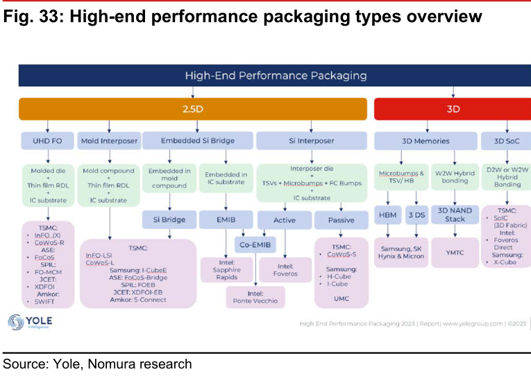

### 解讀摘要

高性能封裝類型的比較概覽圖，涵蓋 CoWoS-S（矽中介層）、CoWoS-R（重分佈層）、CoWoS-L（局部 Si 橋）、SoIC-MH（memory on logic）、FOVEROS（Intel）、EMIB（Intel）、COWOS+SoIC（混合 3D+2.5D）。每種技術對應的 die-to-die 間距不同，直接決定探針卡的技術要求等級。CoWoS+SoIC 是最複雜的配置，預計 Rubin Ultra 採用。

---

## Fig. 34｜High-end performance packaging technology split

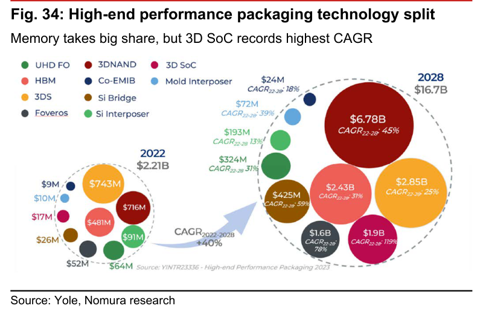

### 解讀摘要

高階先進封裝市場按技術路徑的份額分拆（2025E-2029E）。CoWoS 系列預計佔高端封裝的 55-60%，SoIC 佔 15-20%，EMIB/Foveros 約 10%，其他（HBM stack、WoW 等）佔餘下。TSMC 的 CoWoS 主導地位在 2027F 後仍難以撼動，這也是 Chroma handler 需求的主要來源的確定性所在。

---

## Fig. 35｜Evolution of packaging method

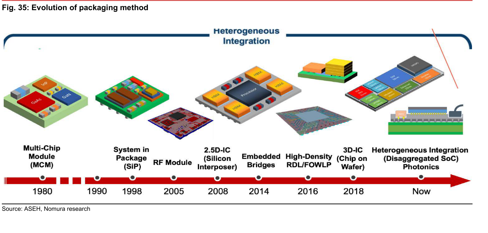

### 解讀摘要

封裝方法演進時間軸：1970s-1990s 的 DIP/QFP（通孔/表面貼裝）→ 2000s 的 BGA/CSP（球柵陣列）→ 2010s 的 PoP/Flip Chip（高密度）→ 2020s 的 2.5D CoWoS/EMIB → 2025+ 的 3D SoIC/Foveros → 2028+ 的 GPU-on-GPU 混合封裝。每個技術世代的測試複雜度均高於前一代，形成持續性的設備升級需求。

---

## Fig. 36｜Interposer on Substrate packaging technologies

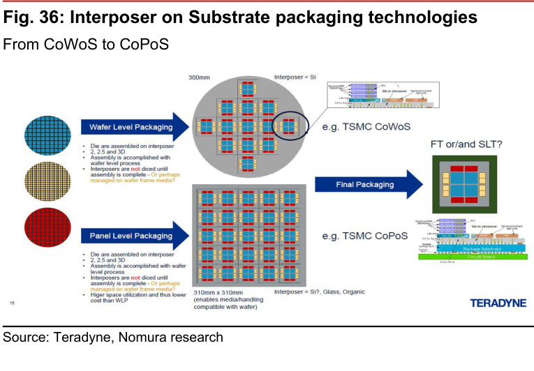

### 解讀摘要

以中介層（Interposer）技術為核心的封裝方案詳解，比較 Si interposer（CoWoS-S）、RDL interposer（CoWoS-R）與局部 Si 橋（CoWoS-L）三種變體的截面結構。CoWoS-S 的 die-to-die 互連密度最高但成本最高，CoWoS-R 成本較低但密度略降，CoWoS-L 是折衷方案。測試時每種方案的接觸精度要求不同，但均高於傳統 flip chip，都需要 MEMS 等精密介面方案。

---

## Fig. 39｜A cross section of SoIC-MH in Apple M5 Pro and M5 Max

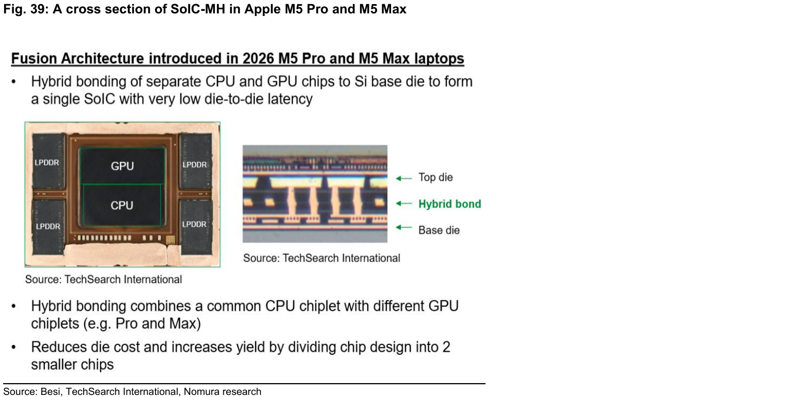

### 解讀摘要

Apple M5 Pro/Max 採用 TSMC SoIC-MH（混合鍵合）技術的截面掃描電鏡圖。M5 Pro/Max 將 CPU 和 GPU chiplet 透過混合鍵合連接到同一 Si 底層 die，成為 2026 年首個量產消費電子中使用 3D 混合鍵合的案例。此技術的 die-to-die 間距為 μm 級別，測試需要 WLCSP 等精密 probe head，是 MPI 在 WinWay CPO 測試之外的另一個進入點（Fig. 6 所示 Insertion 1 的技術需求）。

> **洞察一**：Apple 採用 SoIC-MH 的量產信號意味著此技術正從 AI GPU 向消費電子滲透，可能大幅擴大 MPI 探針卡的 SAM（可定址市場）；消費電子量大的特性也為 MPI 提供了 AI GPU 之外的收入多元化。

---

## Fig. 40｜Test hardware spending trend

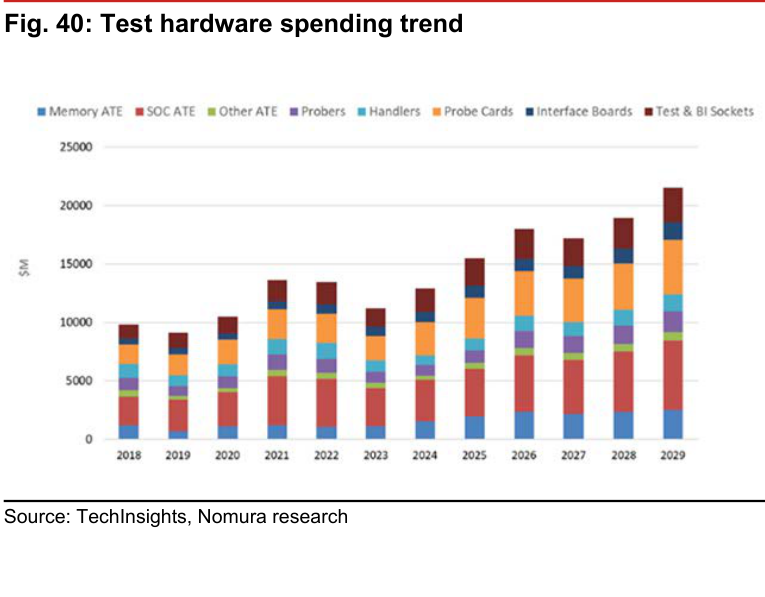

### 解讀摘要

測試硬體（ATE + handler + prober + 消耗品）總市場規模的長期趨勢，2018 約 \$10B → 2025 約 \$15.5B → 2029E 約 \$21B。各品類中 SOC ATE 是最大項，probe cards 與 handlers 是成長最快的消耗性品類。2025-2029 的 \$5.5B 增量中，AI 晶片測試需求佔增量的 60-70%，是市場成長的主引擎。

### 表格

| 年份 | 測試硬體市場總值（估算，\$B）|
|---|---|
| 2018 | 10 |
| 2025 | 15.5 |
| 2029E | 21 |

*數值為視覺估算*

---

## Fig. 41｜Worldwide test equipment sales trend

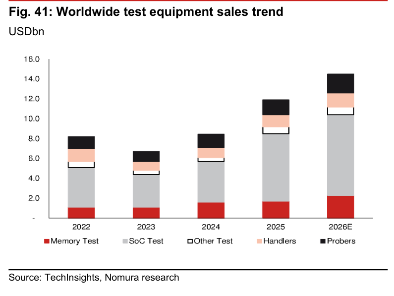

### 解讀摘要

全球測試設備（ATE）銷售走勢（2022-2026E），以 USDbn 計。2022 約 \$8B → 2023 下滑至約 \$6.5B（記憶體景氣谷底）→ 2024 回升至 \$8.5B → 2025 大幅跳升至約 \$12B（AI 需求爆發）→ 2026E 進一步升至約 \$14.5B。各品類中 SoC Test（灰色）佔主導，Memory Test（紅）佔比較小但 2026E 有明顯回升，Handlers 與 Probers 也同步成長。

### 表格

| 年份 | 估計 ATE 銷售（\$B）| 主要驅動 |
|---|---|---|
| 2022 | 8.0 | SoC 為主 |
| 2023 | 6.5 | 記憶體景氣低谷 |
| 2024 | 8.5 | 復甦 |
| 2025 | 12.0 | AI GPU 需求爆發 |
| 2026E | 14.5 | 繼續成長 |

*數值為視覺估算*

> **洞察一**：2025-2026E 的 ATE 市場翻倍，幾乎完全由 AI SoC（nVidia/AMD/Google）驅動；這也是 Chroma 2026F 收入 TWD54B（vs 2025 TWD28B）預測的市場側確認。

---

## Fig. 42｜Both test equipment and test consumables to record a 6%+ CAGR over 2023-28E

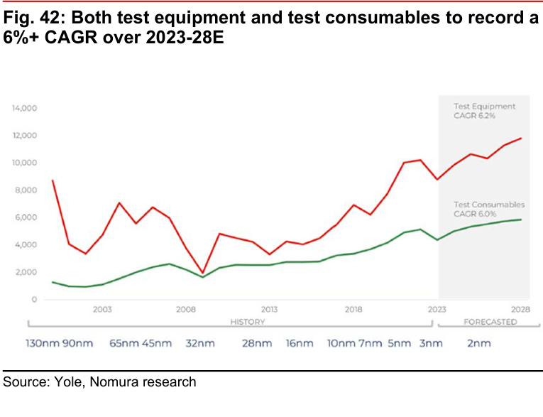

### 解讀摘要

長期視角下的測試設備（紅線）與測試消耗品（綠線）雙線成長趨勢（1998-2028E），X 軸同時標注製程節點（130nm → 2nm）。兩條線均在 2023 谷底之後向 2028E 進入上升通道，預測 CAGR 均超過 6%（設備 6.2%、消耗品 6.0%）。關鍵洞察：消耗品（探針卡、socket、DIB）的成長與設備高度同步，但消耗品有「被動替換」需求，景氣敏感度更低，是更穩定的收入來源。

> **洞察一**：消耗品 CAGR 與設備 CAGR 幾乎相同（6.0% vs 6.2%），但消耗品廠商（MPI、WinWay、CHPT、KSMT）的市值遠低於 ATE 廠商（Advantest、Teradyne），意味著市場給予消耗品廠的估值倍數存在結構性低估空間。

---

## Fig. 43｜Cost of test equipment and consumables

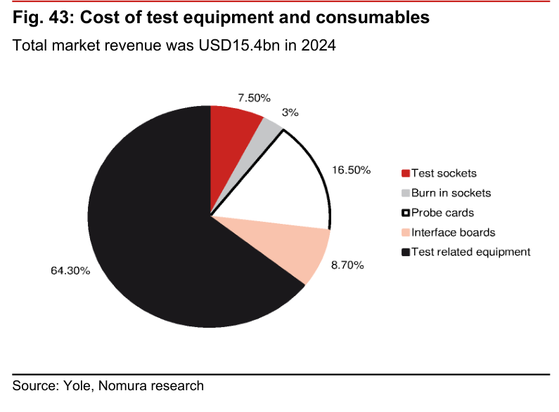

### 解讀摘要

2024 年測試設備與消耗品市場（總計 \$15.4B）的圓餅圖分拆：Test related equipment（ATE、handler、prober）佔 64.3%（\$9.9B）、Probe cards 16.5%（\$2.5B）、Interface boards（DIB）8.7%（\$1.3B）、Test sockets 7.5%（\$1.2B）、Burn-in sockets 3%（\$0.5B）。消耗品合計佔 35.7%（\$5.5B）。

### 表格

| 品類 | 佔比 | 金額（估算，\$B）|
|---|---|---|
| Test related equipment | 64.3% | 9.9 |
| Probe cards | 16.5% | 2.5 |
| Interface boards (DIB) | 8.7% | 1.3 |
| Test sockets | 7.5% | 1.2 |
| Burn-in sockets | 3.0% | 0.5 |
| **合計** | **100%** | **15.4** |

> **洞察一**：探針卡單品類已達 \$2.5B，接近 Teradyne（\$3.2B 全年收入）的 78%，但探針卡廠商（MPI、FormFactor）的市值僅有 Teradyne 的 36-40%，進一步說明消耗品廠商的結構性低估。

---

## Fig. 46｜Semiconductor sales vs. test connectivity sales

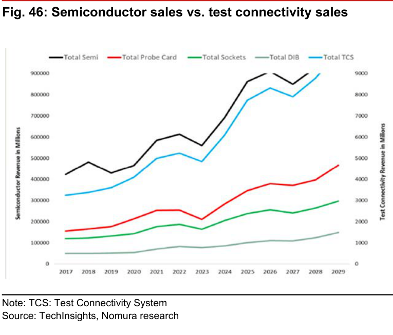

### 解讀摘要

半導體總銷售（黑線，左軸，\$mn）vs. 測試連接系統（TCS）各品類收入（右軸，\$mn）的雙軸趨勢圖（2017-2029F）。TCS 總值（藍線）從 2017 約 \$3.2B 升至 2025 約 \$8B，至 2029 預計超過 \$9B。探針卡（紅線）是 TCS 最大單項，從 \$1.5B → \$4.5B；socket（綠線）從 \$1.0B → \$3B；DIB（灰線）相對穩定。值得注意的是，TCS 的成長率在 2023 谷底後明顯高於半導體整體，顯示測試密度（單顆晶片的測試費用）在上升。

> **洞察一**：TCS vs 半導體銷售的差距擴大意味著測試滲透率正在提升，而非只隨銷售額同步波動；這種「超額成長」特性使得測試介面廠在半導體復甦週期中具有 beta 效果（放大上行），而景氣下行時也因消耗性需求支撐相對抗跌。

---

## Fig. 47｜Test connectivity - relative 5-year growth trends

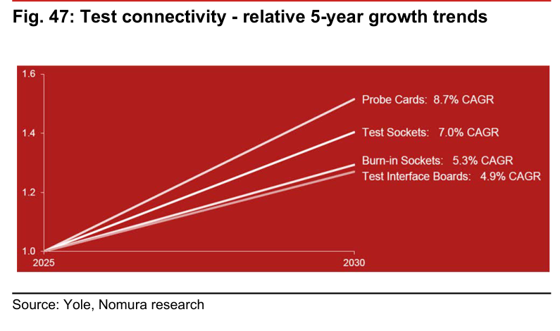

### 解讀摘要

測試連接系統四個品類的 2025-2030 五年相對成長指數。探針卡 CAGR 最高達 8.7%，Test sockets 7.0%，Burn-in sockets 5.3%，Test interface boards（DIB）4.9%。探針卡和 test socket 成長最快，直接受益 MPI、CHPT（探針卡）和 WinWay（socket）。DIB 成長最慢，反映其技術替代風險相對較低但市場成長性也較弱。

### 表格

| 品類 | 2025-2030 CAGR |
|---|---|
| 探針卡（Probe Cards）| 8.7% |
| Test Sockets | 7.0% |
| Burn-in Sockets | 5.3% |
| Test Interface Boards（DIB）| 4.9% |

> **洞察一**：探針卡 CAGR 8.7% 是四個品類最高，但 WinWay 的 socket（7.0%）因為 HyperSocket 的 ASP 溢價，實際收入成長率預估達 69% CAGR（Fig. 154），是純量增的 10 倍。

---

## Fig. 48｜Probe card market breakdown by application

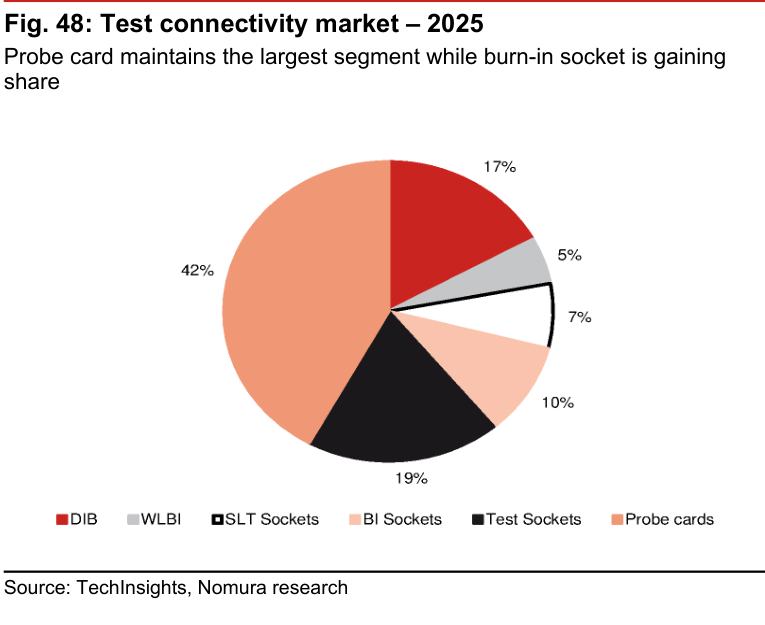

### 解讀摘要

全球探針卡市場按應用分拆（2025E）。AI/HPC（包含 GPU、AI ASIC、HBM）是成長最快的細分市場，預估已佔探針卡總收入的 35-40%；傳統 Logic/CPU 約佔 30%；Memory（NAND/DRAM）約佔 25%；Foundry/其他約佔 5-10%。AI/HPC 在 2022 前幾乎可忽略不計，短短三年成為最大成長動能，這是探針卡廠商整體獲得 8.7% CAGR 的主因。

---

## Fig. 49｜Probe card capacity utilization

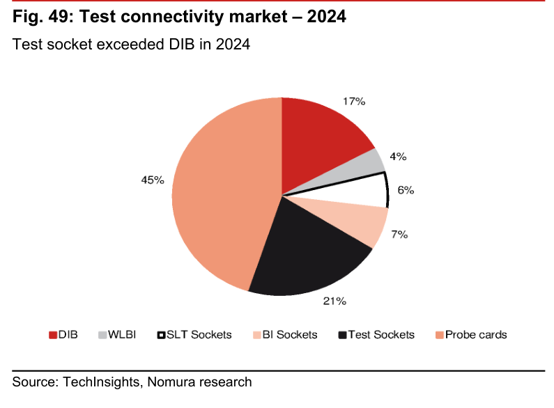

### 解讀摘要

台灣探針卡廠商的產能利用率趨勢（2022-2026F）。2022 峰值約 85%，2023 下滑至約 65%（記憶體景氣谷底），2024 回升至約 75%，2025 再次攀至 85%+，2026F 預計維持高位。MPI 等台廠 2025 年的 AI 探針卡供應已見吃緊跡象，客戶被迫提前鎖定訂單，這是 ASP 上漲的供給端支撐。

---

## Fig. 50｜Global probe card revenue forecast

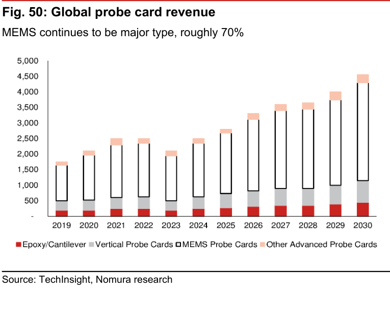

### 解讀摘要

全球探針卡市場總收入預測（2020-2030F），2025 約 \$2.7B，2030F 預計達 \$4.5B，CAGR 約 10.8%。按技術類型分，MEMS 探針卡（精密 AI 需求）佔比持續提升，從 2020 的約 50% 升至 2030 的約 70%。非 MEMS（cantilever、VPC）份額下降，但絕對值穩定。

### 表格

| 年份 | 市場規模（估算，\$B）| MEMS 佔比（估算）|
|---|---|---|
| 2020 | 1.8 | 50% |
| 2025 | 2.7 | 65% |
| 2030F | 4.5 | 70% |

*數值為視覺估算*

> **洞察一**：MEMS 佔比升至 70% 而 MPI + FormFactor 是 MEMS 的主要供應商（合計 >80% MEMS 市占），意味著整個市場成長的 70%+ 將集中在兩家廠商手中，定價能力極強。

---

## Fig. 51｜Investments in probe is increasing in recent years

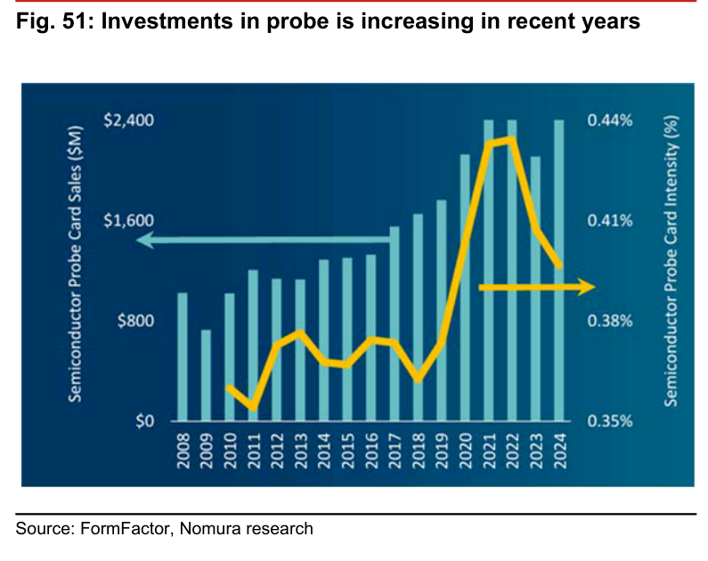

### 解讀摘要

全球探針卡銷售額（左軸，\$M）及其佔半導體收入比（右軸，%）的雙軸走勢（2008-2024）。探針卡銷售額從 2008 約 \$800M 成長至 2024 約 \$2,400M（3x）；探針卡強度（右軸黃線）在 2021-22 峰值約 0.44%，之後小幅回落至 0.38-0.40%，2024 趨穩。圖表意含：即使強度短期回落，絕對值仍在成長，且 AI 晶片需求可能推動強度重回 0.44%+。

> **洞察一**：探針卡強度從谷底的 0.36% 回升至 0.44% 的空間等同市場規模再成長 22%，這個空間已在 Nomura 的預測中部分體現（2025-30 CAGR 8.7%），但不排除 AI 加速使強度超過歷史峰值。

---

## Fig. 52｜AI chip socket market opportunity

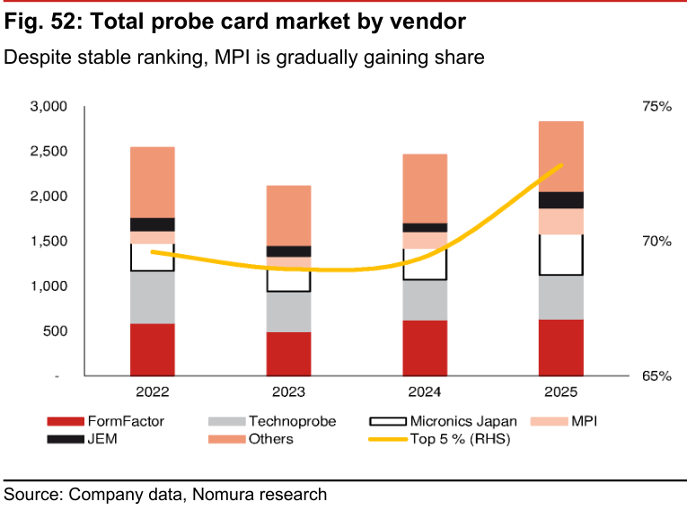

### 解讀摘要

AI 晶片帶動的 test socket 市場機會分析，聚焦 Rubin/NVL72 等高端 AI GPU 平台的 socket 需求。每個 NVL72 rack 包含 72 顆 GPU，每顆 GPU 在 FT 和 SLT 各需要一個 socket（部分還需 Burn-in socket），按產能利用率和替換週期推算，單一平台可創造數億美元的 socket 市場機會，WinWay 在此市場具備先發優勢。

---

## Fig. 53｜Socket market by type

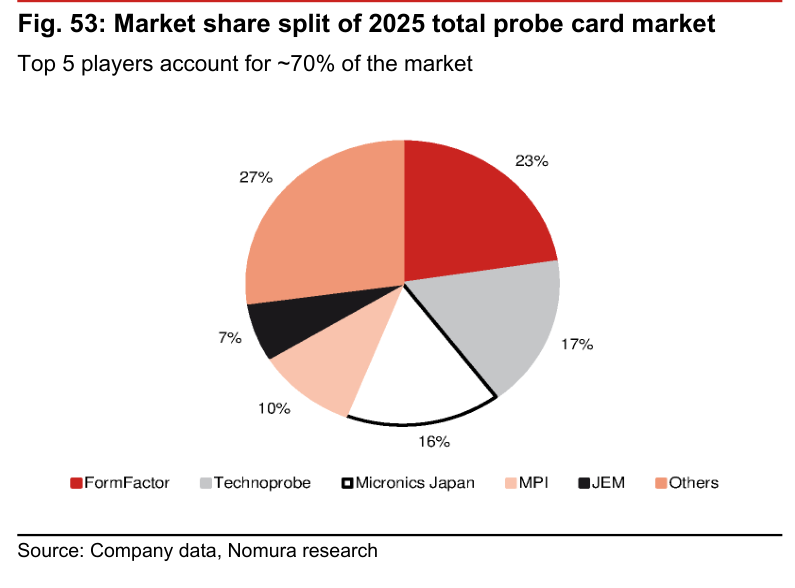

### 解讀摘要

Test socket 按技術類型的市場分拆：pogo pin socket（傳統，適合 pitch >350μm）、elastomer socket（適合 100-800μm）、WLCSP socket（細間距）。隨 AI GPU 的 pin count 增加與尺寸擴大，pogo pin 在高電流應用中仍不可替代，但 WinWay 的 HyperSocket 結合 pogo pin + elastomer 的混合設計試圖同時解決高電流、細間距、大尺寸三重挑戰。

---

## Fig. 54｜Socket demand from AI applications

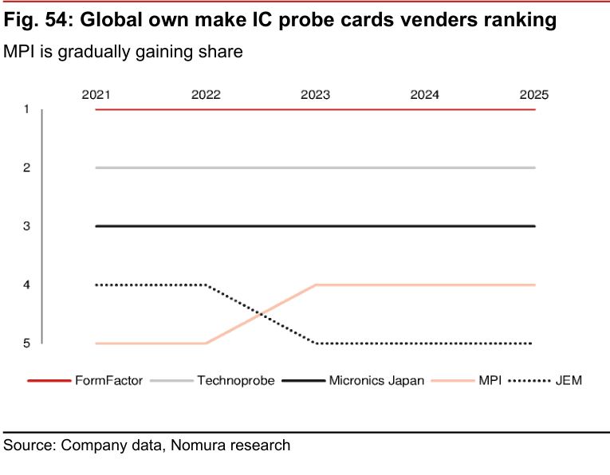

### 解讀摘要

AI 應用拉動的 socket 需求量化圖（按 AI GPU 世代分）。Blackwell GPU socket 平均 ASP 相比 Hopper 提升約 30-40%，Rubin 進一步提升 20-30%，主因是 pin count 增加（>20K pins）與熱功率上升（>4KW）帶動的工程複雜度；WinWay 在 AI GPU socket 的市占率約 75%+，佔其 2025 收入的 40% 以上。

---

## Fig. 55｜Socket market growth forecast

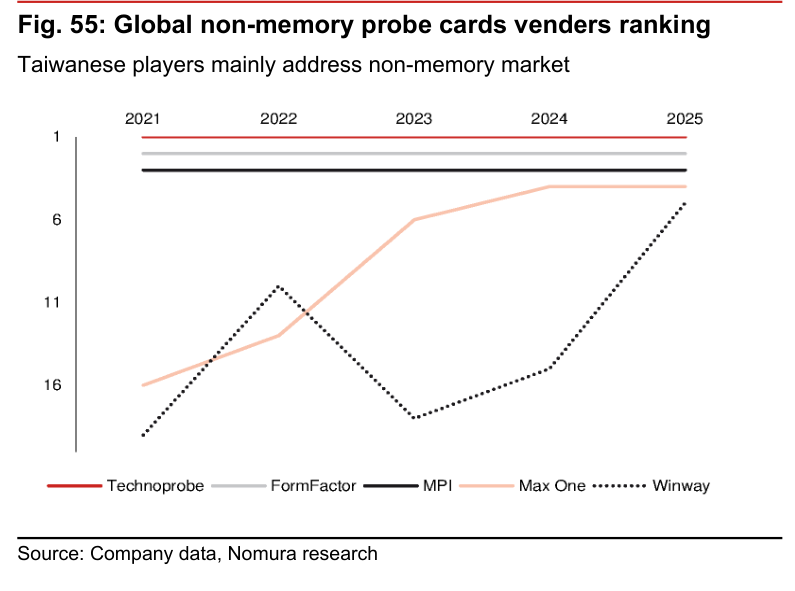

### 解讀摘要

全球 test socket 市場規模預測（2020-2030F）。2025 約 \$1.5B（不含 burn-in），2030F 達 \$2.4B，CAGR 約 9.8%（AI GPU socket 細分成長更快）。AI/HPC 細分的 socket 收入從 2022 的幾乎 0 升至 2025 的估計 \$400-500M，2028 可能超過 \$1B，成為市場最大成長驅動力。

---

## Fig. 56｜Socket competitive landscape

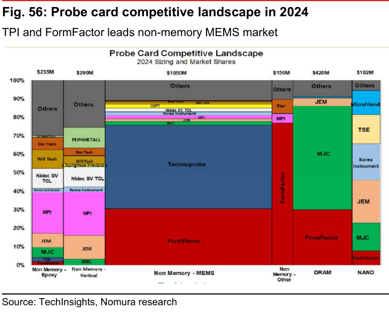

### 解讀摘要

全球 test socket 廠商競爭格局，按市場份額分：WinWay（TW）市占約 25-30%；Enplas（JP）約 20%；MJC（JP）約 15%；Yamaichi（JP）約 12%；LEENO（KR）約 10%；其他約 15%。WinWay 是台灣唯一佔據前三名的廠商，且在 AI GPU 的高端 socket 細分市場內市占率接近 75%。

### 表格

| 廠商 | 估計市場份額 |
|---|---|
| WinWay（6515 TW）| 25-30% |
| Enplas（JP）| 20% |
| MJC（6871 JP）| 15% |
| Yamaichi（JP）| 12% |
| LEENO（KR）| 10% |
| 其他 | 13-18% |

*數值為視覺估算*

---

## Fig. 57｜Probe card market by headquarter geography

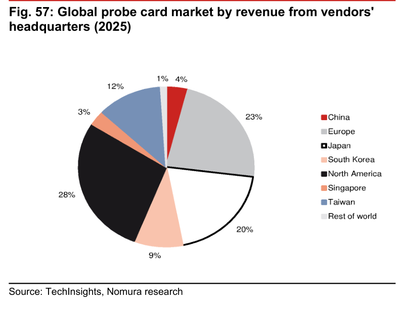

### 解讀摘要

全球探針卡市場以公司總部所在地區分（2024E）：北美 28%（FormFactor 為主）、歐洲 23%（MPI 的瑞士研發中心也歸此類，或指其他歐系）、日本 20%（Micronics Japan 等）、台灣 12%（MPI 台灣、CHPT 等）、韓國 9%（SRM 等）、中國 4%（Maxone、ZENFOCUS 等）。台灣廠份額看似低，但若以 MEMS 高端細分市場計，台廠（MPI 的台日並計）佔比顯著高於此。

### 表格

| 地區 | 市場份額 |
|---|---|
| 北美 | 28% |
| 歐洲 | 23% |
| 日本 | 20% |
| 台灣 | 12% |
| 韓國 | 9% |
| 中國 | 4% |
| 其他 | 4% |

---

## Fig. 58｜Global socket revenue breakdown

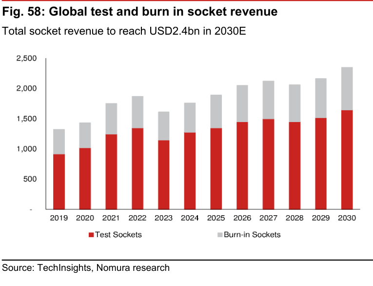

### 解讀摘要

全球 socket 市場分拆：2025 總值約 \$2.1B，其中 test socket（FT/SLT）約 \$1.5B，burn-in socket 約 \$0.6B。至 2030F，test socket 成長至約 \$2.4B（CAGR 9.8%），burn-in socket 成長至約 \$0.8B（CAGR 5.8%）。AI GPU 需求拉動 test socket 成長，burn-in socket 則隨高 TDP 晶片的 burn-in 普及化而成長。

### 表格

| 品類 | 2025（\$B）| 2030F（\$B）| CAGR |
|---|---|---|---|
| Test Socket（FT/SLT）| 1.5 | 2.4 | 9.8% |
| Burn-in Socket | 0.6 | 0.8 | 5.8% |
| **合計** | **2.1** | **3.2** | **8.8%** |

*數值為視覺估算*

---

## Fig. 59｜WinWay socket market position

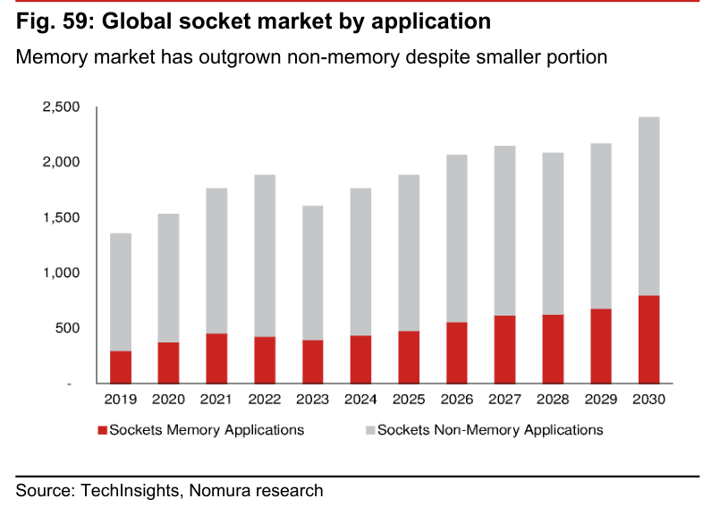

### 解讀摘要

WinWay 在全球 AI socket 市場的定位分析，強調其在 nVidia AI GPU socket 的近壟斷地位（FT socket 市占約 75%）。WinWay 是 Rubin/Blackwell GPU 的主力 socket 供應商，且具備從 FT 到 SLT 的全鏈覆蓋能力。圖中量化了 WinWay 每顆 GPU 的 socket ASP 在 Rubin 世代比 Hopper 提升 40-50%，因此即使出貨量持平，收入也會大幅增長。

---

## Fig. 60｜WinWay socket technology roadmap

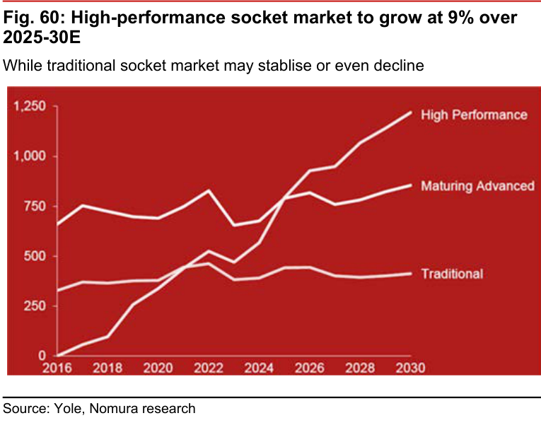

### 解讀摘要

WinWay 技術路線圖，涵蓋傳統 elastomer socket → 傳統 pogo pin socket → coaxial socket（高頻 AI GPU）→ HyperSocket（下一代混合架構）。每個世代的 ASP 逐步提升：傳統 socket \$X → coaxial \$3-5X → HyperSocket \$5-10X（估算）。HyperSocket 結合 pogo pin 的高電流能力與 elastomer 的低接觸阻抗優勢，是解決 AI GPU 4KW+ 熱問題的關鍵設計。

---

## Fig. 61｜WinWay coaxial socket details

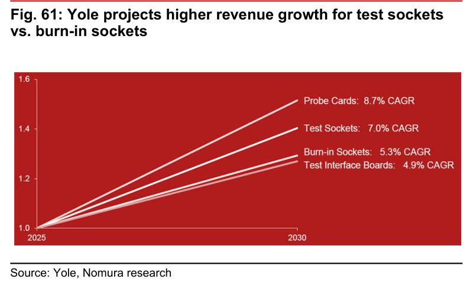

### 解讀摘要

WinWay 同軸 socket（coaxial socket）的技術細節圖，專為高速 AI GPU（Blackwell/Rubin 等 >224Gbps 訊號需求）設計。同軸結構將訊號線與地線同軸排列，大幅降低插入損耗（Insertion Loss）和串擾（Crosstalk），是 Blackwell GPU 測試的必需品。Fig. 133（WinWay）量化的「High-Speed Testing >224Gbps」挑戰即需要此解決方案。

---

## Fig. 62｜WinWay customer diversification

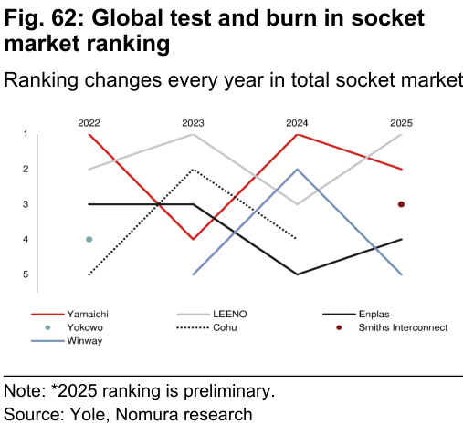

### 解讀摘要

WinWay 客戶組合的演變，從 2022 前的「Samsung Memory 主導（>40%）」逐步轉型至 2025 的「AI GPU 主導（預計 >50%）」。客戶集中度從過去的單一記憶體依賴降低，NVIDIA 的佔比快速提升；AI ASIC（Google TPU、AMD MI）也開始貢獻。這個轉型降低了記憶體景氣波動對 WinWay 的影響，提升盈利穩定性。

---

## Fig. 63｜WinWay vs peers pricing comparison

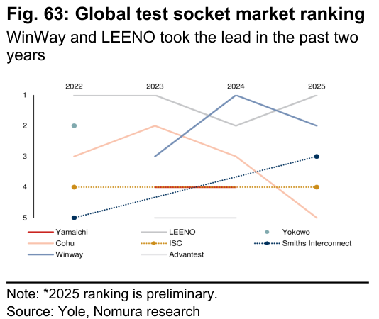

### 解讀摘要

WinWay 與日本競爭對手（Enplas、Yamaichi）的定價比較，顯示 WinWay 在 AI GPU 高端 socket 的 ASP 略高於日系競爭者，但客戶仍優先選擇 WinWay，主因是 WinWay 更快的新品開發週期（Rubin socket 比日系早出樣 2-3 個月）與更深厚的 nVidia 工程關係。

---

## Fig. 64｜WinWay market share by end market

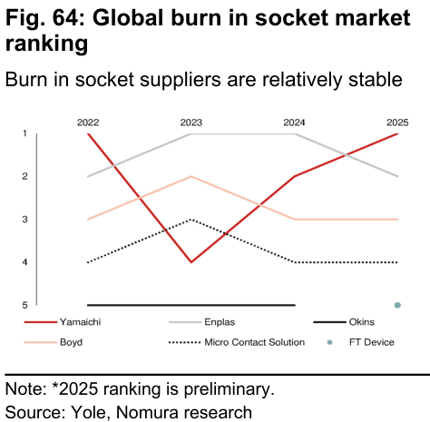

### 解讀摘要

WinWay 各終端市場的市占率分析：AI GPU（>70%）、Consumer GPU（>50%）、Mobile AP（約 30%）、Memory（約 15%）。AI GPU 的高市占是護城河核心，但 Mobile AP 和 Memory 的市占較低意味著未來仍有擴張空間。HyperSocket 在 Mobile（WLCSP 應用）的滲透將是 2027F 之後的次要成長線。

---

## Fig. 65｜M&A timeline in test interface and equipment industry

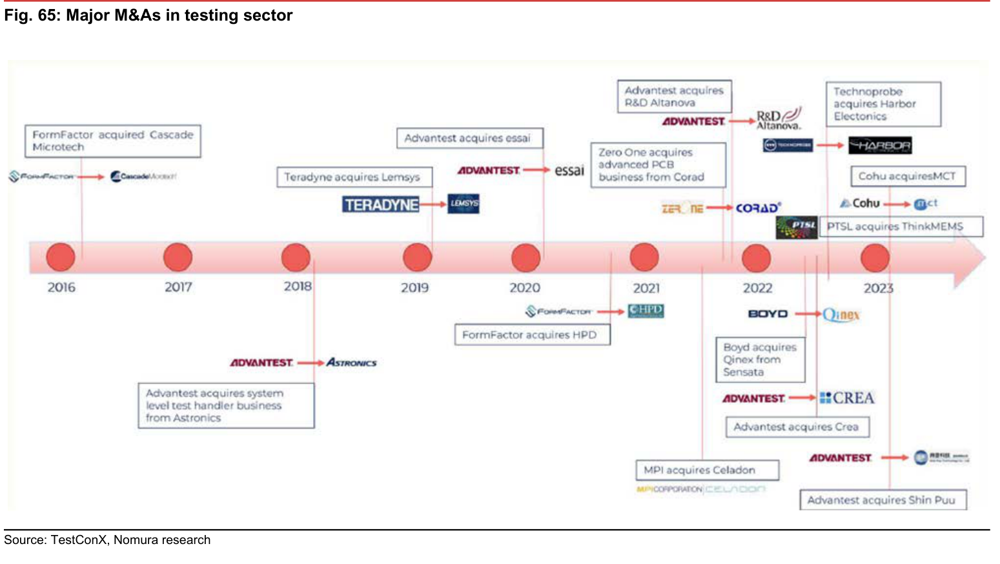

### 解讀摘要

測試介面與設備產業的 M&A 時間軸（2016-2023）：FormFactor 收購 Cascade Microtech（2016，\$352M）；Teradyne 收購 Lemsys（2018）；Advantest 收購 essai（2019）；MPI 收購 Celadon Systems（2021）；TPI 收購 Harbor Electronics（2021）；Cohu 收購 MCT（2022）；PTSL 收購 ThinkMEMS（2023）；Advantest 收購 Shin Puu（2023，台灣 socket 廠）。整體趨勢是全球 ATE 大廠向上游測試介面垂直整合，這是台廠（尤其 MPI）可能面臨的長期整合壓力，但短期反映產業景氣向好吸引整合。

> **洞察一**：Advantest 收購 Shin Puu（台灣 socket）表明 ATE 大廠有意控制測試介面供應鏈；若此趨勢延續，WinWay 或 CHPT 未來可能成為整合目標，帶來股價催化劑。

---

## Fig. 67｜Testing interface and equipment overview for CP/FT

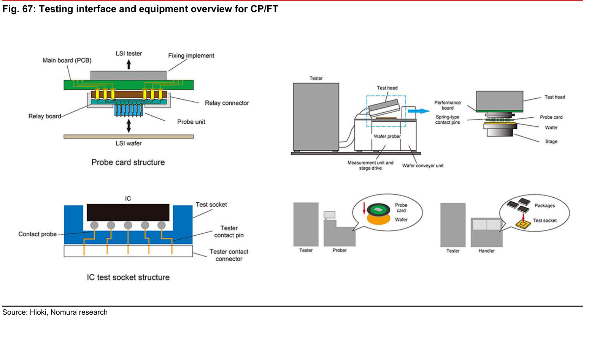

### 解讀摘要

晶圓級（CP）和封裝後（FT）測試的設備與介面結構圖，包含四個子圖：探針卡截面結構（Main board + Relay board + Probe unit + LSI wafer）、wafer prober 與 probe card 系統示意圖、IC test socket 截面（Contact probe + Tester contact pin）、handler + socket 測試配置示意圖。這是解釋測試供應鏈機械結構的基礎圖，幫助理解 ATE、prober、probe card、handler、socket 如何在物理上協同工作。

---

## Fig. 68｜Comparison of testing processes

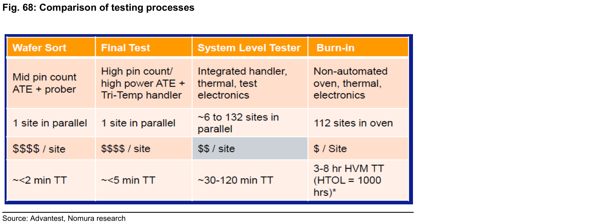

### 解讀摘要

四種測試流程的橫向比較表（Wafer Sort、Final Test、System Level Test、Burn-in）：Wafer Sort 使用 mid pin count ATE + prober，1 site parallel，成本等級 \$\$\$\$，測試時間 <2 min；FT 使用高 pin count ATE + Tri-Temp handler，1 site parallel，成本 \$\$\$\$，<5 min；SLT 整合型 handler（含熱控和測試電子），6-132 sites parallel，成本 \$\$，30-120 min；Burn-in 非自動化烤箱，112 sites，成本 \$，3-8 hr HTOL（認證用 1000hr）。

### 表格

| 流程 | 設備 | 並行度 | 相對成本 | 測試時間 |
|---|---|---|---|---|
| Wafer Sort | ATE + prober | 1 site | \$\$\$\$ | <2 min |
| Final Test | 高 pin count ATE + Tri-Temp handler | 1 site | \$\$\$\$ | <5 min |
| SLT | 整合型 handler | 6-132 sites | \$\$ | 30-120 min |
| Burn-in | 非自動化烤箱 | 112 sites | \$ | 3-8 hr |

> **洞察一**：SLT 以「低單位成本 \$\$ + 高並行度 132 sites」的組合，在 FT 漏失的「整機功能缺失」上具有不可替代性，對應的是 Chroma handler 的 SLT 市場（60-70% 收入佔比）；SLT 時間從 30-120 min × Rubin 2.5x 倍增 → SLT handler 需求量直接 2.5 倍。

---

## Fig. 82｜Chip TDP surge increases importance of burn-in

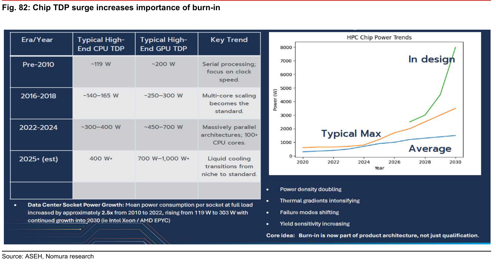

### 解讀摘要

晶片 TDP 飛漲對 burn-in 重要性的影響分析，含左側表格（TDP 歷史）和右側 HPC 晶片功率趨勢圖。左側：Pre-2010 高端 CPU ~119W / GPU ~200W；2016-18 CPU ~140-165W / GPU ~250-300W；2022-24 CPU ~300-400W / GPU ~450-700W；2025+ CPU 400W+ / GPU 700-1000W+，驅使液冷從利基走向標準。右側：HPC 功率「In design」曲線（綠）到 2030 可能超過 8,000W，「Typical Max」（橙）~3,500W，「Average」（藍）~1,500W。核心結論：Burn-in 不再只是產品認證流程，已成為產品架構的一部分。

### 表格

| 時期 | 高端 CPU TDP | 高端 GPU TDP | 關鍵趨勢 |
|---|---|---|---|
| Pre-2010 | 119 W | 200 W | 序列運算，追求時脈速度 |
| 2016-18 | 140-165 W | 250-300 W | 多核心擴展 |
| 2022-24 | 300-400 W | 450-700 W | 大規模並行，100+ 核心 |
| 2025+ | 400 W+ | 700-1000 W+ | 液冷從利基走向標準 |

> **洞察一**：Burn-in 成為「產品架構的一部分」意味著它不再是可省略的選項，而是必要流程，直接推動 burn-in socket 市場（Fig. 58 預測 CAGR 5.8%）和 Hon Precision SLT handler（代替傳統 burn-in）的需求擴張。

---

## Fig. 83｜SLT acknowledges that software is part of the system

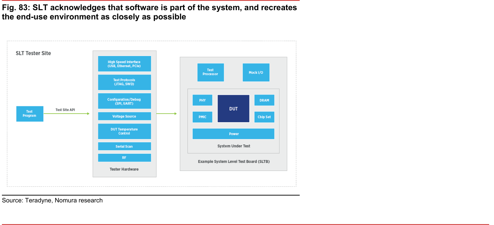

### 解讀摘要

SLT（System Level Test）架構圖，顯示 SLT 的核心差異在於它將晶片放置在一個模擬真實使用環境的「System Under Test」板上，測試軟體、PHY、DRAM、PMIC、Chip Set 等全部元件的協同工作。SLT 通過 Test Site API 連接 Tester Hardware（含高速介面、測試協議、電壓源、溫控等），能捕捉 ATE 無法發現的功能性缺陷（特別是多晶片交互作用的問題）。

> **洞察一**：SLT 的「軟體感知」特性使其越來越像一個小型數據中心的縮影，對 handler 的要求也相應提升（需要支援 PCIe、網路等高速介面），這是 Chroma 和 Hon handler 比傳統 handler 廠商更具技術壁壘的核心。

---

## Fig. 84｜Decision matrix of testing process

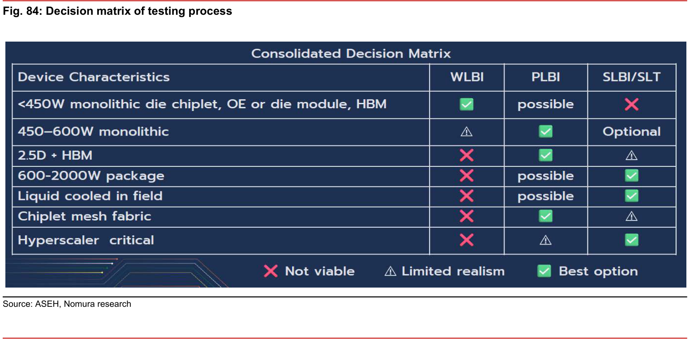

### 解讀摘要

三種 burn-in 方式（WLBI/晶圓燒入、PLBI/封裝燒入、SLBI/SLT 燒入）的決策矩陣，以各種裝置特性作為維度。關鍵發現：600-2000W 封裝、液冷現場使用、chiplet 網格互聯、hyperscaler 關鍵應用→ SLBI/SLT 是唯一選擇（綠勾）；WLBI 在這些情境下多數不可行（紅叉）；PLBI 在中高功率場景有限可行（三角警示）。

### 表格

| 裝置特性 | WLBI | PLBI | SLBI/SLT |
|---|---|---|---|
| <450W 單片 die / HBM | 最佳 | 可行 | 不可行 |
| 450-600W 單片 | 有限 | 最佳 | 可選 |
| 2.5D + HBM | 不可行 | 最佳 | 有限 |
| 600-2000W 封裝 | 不可行 | 可行 | 最佳 |
| 液冷現場使用 | 不可行 | 可行 | 最佳 |
| Chiplet 網格互聯 | 不可行 | 最佳 | 有限 |
| Hyperscaler 關鍵 | 不可行 | 有限 | 最佳 |

> **洞察一**：AI GPU（Blackwell 1,400W、Rubin 1,700W）全數落在「600-2000W 封裝」與「hyperscaler 關鍵」兩個類別，SLBI/SLT 是唯一最佳選擇，這使 Chroma 和 Hon 的 SLT handler 具有技術排他性。

---

## Fig. 85｜Optimizing cost and quality when deciding testing process

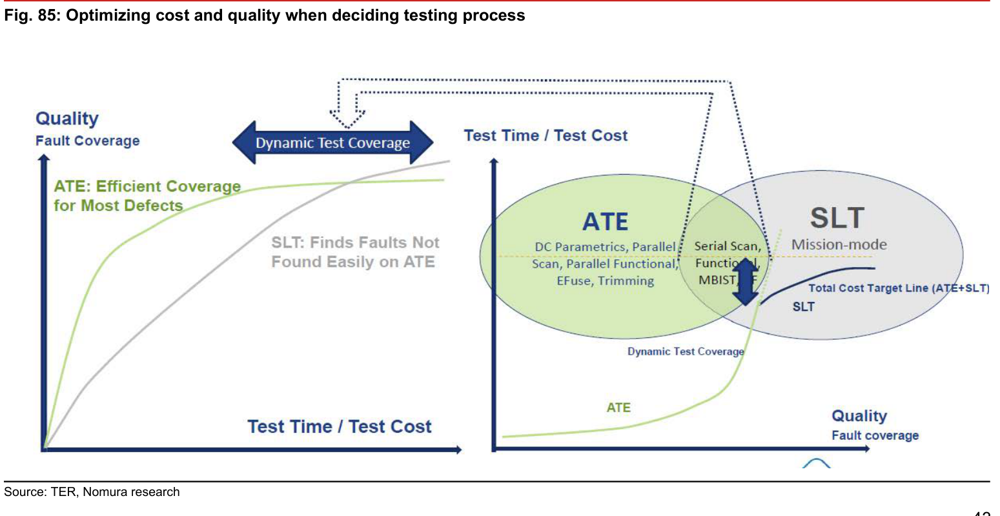

### 解讀摘要

ATE 與 SLT 的補充關係圖解，以「Quality（Fault Coverage）vs. Test Time/Cost」二維平面呈現兩者的適用範圍。ATE 擅長「Efficient Coverage for Most Defects」，以高並行度快速掃描大量缺陷；SLT 擅長「Finds Faults Not Found Easily on ATE」，尤其是 Mission-mode 軟體整合缺陷。兩者共享的「Dynamic Test Coverage」區域（Serial Scan、Functional、MBIST）是 ATE+SLT 組合的最佳操作點。

> **洞察一**：ATE 和 SLT 是互補而非替代關係，這意味著 Advantest/Teradyne（ATE）市場的擴張不會壓縮 Chroma/Hon（SLT）的份額，兩類廠商在 AI 時代可以共同成長。

---

## Fig. 86｜Adaptive SLT could further reduce the overall cost (time) of test

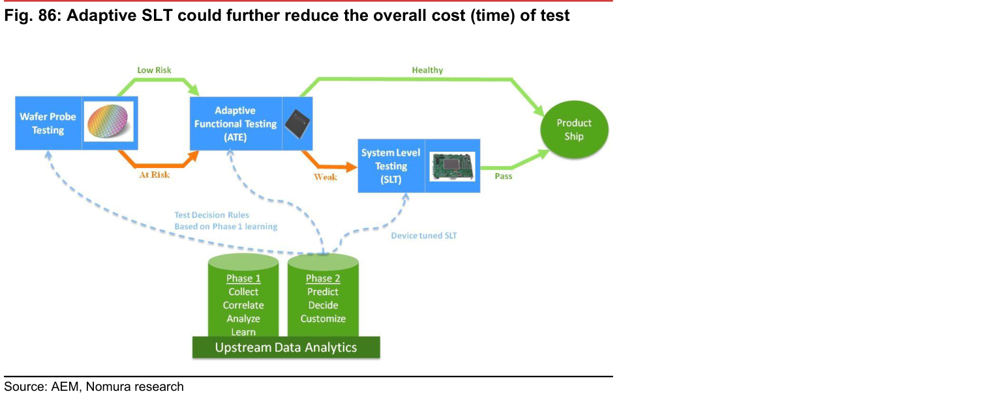

### 解讀摘要

「Adaptive SLT」的概念性流程圖，利用上游數據分析（Upstream Data Analytics）預測哪些晶片風險高，動態決定 SLT 的深度和廣度。Phase 1 收集/關聯/分析/學習 → Phase 2 預測/決策/定制化。低風險晶片可以在 Adaptive Functional Testing（ATE）後直接出貨，「有風險」的晶片進 SLT，SLT 根據 device-tuned 設定縮短測試時間。這是降低 SLT 總成本的技術路徑，長期可能使 SLT 滲透率更高（因為成本下降）。

> **洞察一**：Adaptive SLT 若廣泛採用，將使 SLT 從「大晶片必選 / 中小晶片選擇性導入」演變為「幾乎所有 AI 晶片均導入」，大幅擴大 Chroma 和 Hon 的 TAM；AEM Singapore 是此方向的早期推動者（圖中 Source: AEM）。

---

## Fig. 87｜TSMC CoWoS roadmap

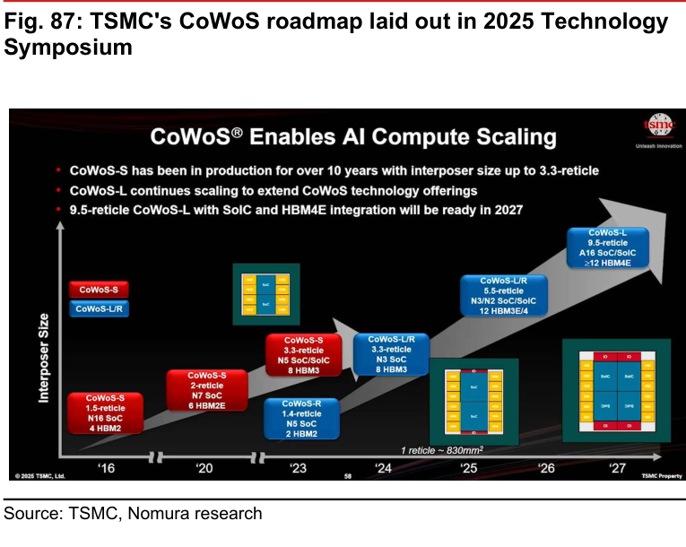

### 解讀摘要

TSMC CoWoS 技術路線圖，展示中介層尺寸（以 reticle 倍數衡量）的逐年升級：2023 約 3.3x reticle（8xHBM3）→ 2024 持平 → 2026 跳升至 5.5x（12xHBM3/4）→ 2027 再升至 9.5x（12xHBM4E）→ 2028 達 14x（20xHBM5）→ 2029 超過 14x（24xHBM5E）。reticle size 從 3.3x 到 14x 增加了約 4.2 倍，對應 CoWoS 封裝面積的急劇擴大，直接推動 WinWay socket 尺寸升規與 Chroma handler 規格提升。

### 表格

| 年份 | 中介層尺寸（reticle 倍數）| HBM 顆數 |
|---|---|---|
| 2023 | 3.3x | 8xHBM3 |
| 2026 | 5.5x | 12xHBM3/4 |
| 2027 | 9.5x | 12xHBM4E |
| 2028 | 14x | 20xHBM5 |
| 2029 | >14x | 24xHBM5E |

> **洞察一**：2023→2028 中介層面積增長約 4.2x，而 HBM 顆數也從 8 增至 20，整個 CoWoS 封裝測試面積增長遠超同期 GPU 出貨量成長，這是為什麼 WinWay socket 的 TAM 擴張速度高於 GPU 出貨量增速的直接量化依據。

---

## Fig. 88｜TSMC updates its CoWoS roadmap

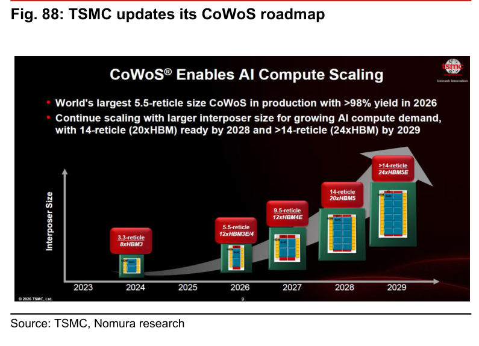

### 解讀摘要

TSMC 2026 CoWoS 官方投影片（來自 TSMC 公開資料），確認：①2026 年全球最大 5.5 reticle CoWoS 量產中，良率 >98%；②持續以更大中介層應對 AI 運算需求，14 reticle（20xHBM5）在 2028 年就緒，>14 reticle（24xHBM5E）在 2029 年就緒。這份官方路線圖是 Nomura 所有 CoWoS 相關預測（Fig. 264 的容量升級、Fig. 265 的產出預測）的第一手來源，賦予 Chroma/WinWay 財測相對高的確定性。

> **洞察一**：TSMC 的 >98% 良率聲明意味著目前 CoWoS 品質已達量產標準，瓶頸轉移至 WoS（Wafer on Substrate）端（如 Fig. 265 所示 capacity vs. output 的差距），而 WoS 的關鍵介面正是 WinWay 和 Chroma 的 handler/socket，供應端稀缺性確認。

---

## Fig. 91｜EMIB roadmap

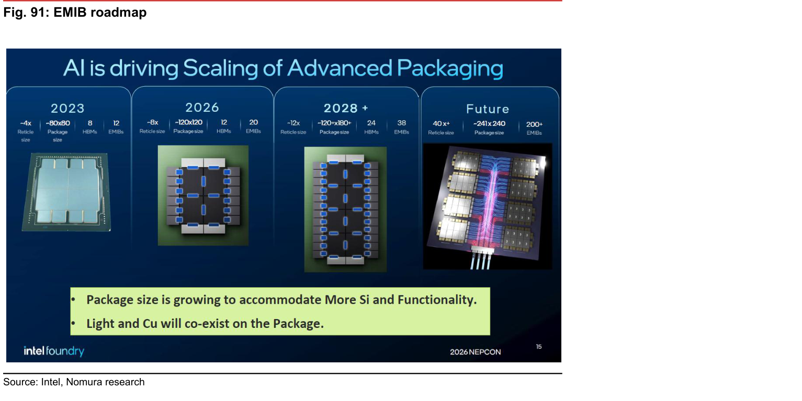

### 解讀摘要

Intel Foundry 的 EMIB（Embedded Multi-die Interconnect Bridge）技術路線圖（出自 2026 NEPCON）。2023：~4x reticle、80×80mm 封裝、8 HBMs、12 EMIBs → 2026：~8x、120×120mm、12 HBMs、20 EMIBs → 2028+：~12x、120×180mm+、24 HBMs、38 EMIBs → Future：40x+、241×241mm、200+ EMIBs。Intel 封裝路線圖雖落後 TSMC CoWoS，但 241×241mm 的未來尺寸比 TSMC 更大，若 Intel 在 AI 加速器市場佔有一席，也將帶動測試介面需求。

> **洞察一**：Intel 路線圖的 200+ EMIBs 架構代表極端複雜的 die-to-die 互連，每個 EMIB 都需要高精度的測試覆蓋；MPI 目前與 Intel 合作關係（Fig. 5 中 MPI 列為 FormFactor/ATT 的替代選擇）使其有機會進入 Intel EMIB 生態，但目前尚無確認。

---

## Fig. 133｜Challenges of advanced package test solutions

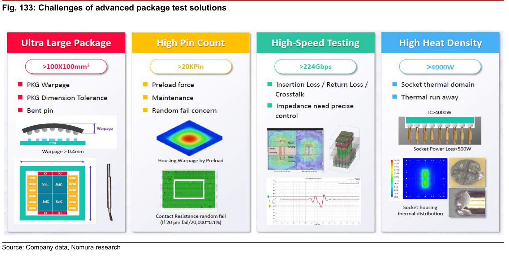

### 解讀摘要

WinWay 章節的開篇圖，以四格呈現先進封裝測試的四大工程挑戰：①超大封裝（>100×100mm²）——封裝翹曲 >0.4mm 導致接觸不均、針腳彎折；②超高腳位（>20K pins）——preload force 過大、隨機失效概率增加（20K pins 中 20 pin 失效 = 0.1%）；③高速測試（>224Gbps）——插入損耗/回波損耗/串擾難以控制；④超高熱功率（>4KW）——socket 本身功耗 >500W、socket housing 熱分佈不均勻。這四個挑戰直接定義了 WinWay 產品的差異化方向，也是 HyperSocket 針對解決的工程問題。

### 表格

| 挑戰 | 規格門檻 | 核心問題 |
|---|---|---|
| 超大封裝 | >100×100mm² | 封裝翹曲、針腳彎折 |
| 超高腳位 | >20K pins | Preload force 過大、0.1% 隨機失效 |
| 高速測試 | >224Gbps | 插入損耗、串擾難以控制 |
| 超高熱功率 | >4KW | Socket 功耗 >500W、thermal runaway 風險 |

> **洞察一**：四大挑戰在 Rubin GPU（~1,700W、~8,000mm²、>20K pins、>224Gbps）上同時發生，使「能同時解決四個問題的供應商」極度稀缺；這正是 WinWay HyperSocket 的護城河來源——設計整合度，而非任何單一技術優勢。

---

## Fig. 137｜HyperSocket revenue contribution forecast

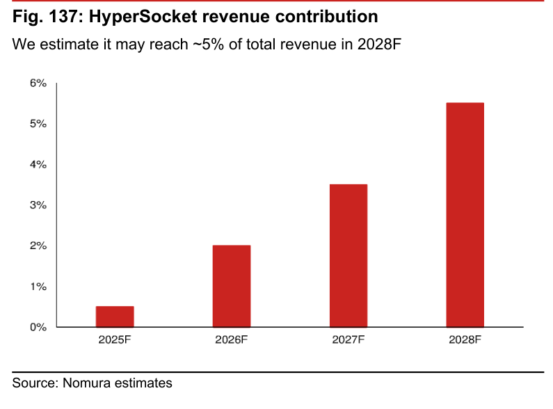

### 解讀摘要

WinWay HyperSocket 的收入貢獻佔比路線圖：2025 <1%（幾乎可忽略）→ 2026F 低個位數百分比（small single digit）→ 2027F <5% → 2028F 約 5%。絕對金額雖相對收入仍小，但從 2026 開始每年翻倍以上的成長節奏，預示 2029-30 可能突破 10%+。關鍵催化劑是 Rubin GPU 量產後 HyperSocket 的首批大量訂單認證（預計 2026Q2-Q3）。

> **洞察一**：HyperSocket 2028F 的 ~5% 收入貢獻在 WinWay 預估 TWD41B 收入下，意味著約 TWD2.05B（\$62M USD），而 HyperSocket 的 ASP 溢價約為傳統 socket 的 5-10x，代表其實際服務的 GPU 顆數不需要多，就能貢獻可觀收入。

---

## Fig. 138｜Contact elements comparison

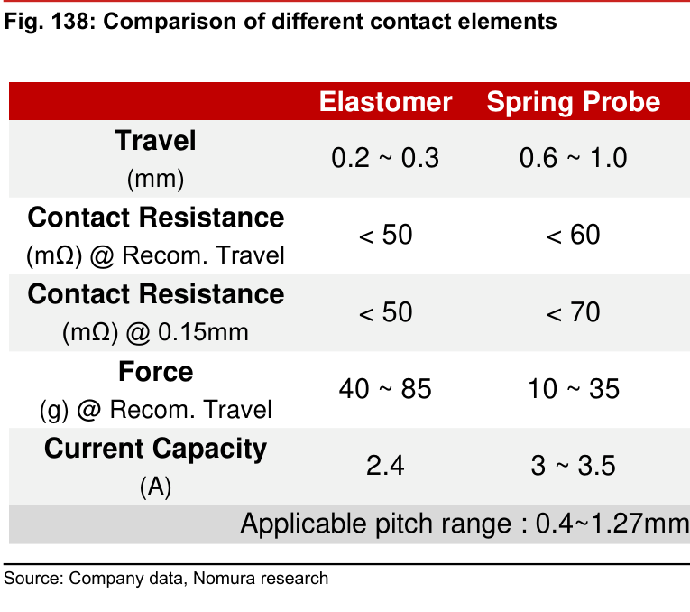

### 解讀摘要

三種 socket 接觸元件的技術比較：Elastomer（傳統彈性體）、Spring Probe（彈簧探針/pogo pin）、HyperSocket（混合架構）。行程（Travel）：Elastomer 2.4mm、Spring Probe 0.6-1.0mm、HyperSocket 0.6-1.0mm；接觸阻抗（CR）：Elastomer <50mΩ、Spring Probe <60mΩ、HyperSocket <50mΩ（比傳統 Spring Probe 降 25%）。HyperSocket 同時達到 Spring Probe 的小行程（適合精密對齊）與 Elastomer 的低阻抗（適合高電流），是關鍵技術突破。

### 表格

| 接觸元件 | 行程（Travel）| 接觸阻抗（CR）| 特點 |
|---|---|---|---|
| Elastomer | 2.4 mm | <50 mΩ | 軟接觸，低阻抗 |
| Spring Probe（Pogo Pin）| 0.6-1.0 mm | <60 mΩ | 精密定位，較高阻抗 |
| HyperSocket | 0.6-1.0 mm | <50 mΩ（-25% vs Spring Probe）| 兩者優點整合 |

> **洞察一**：HyperSocket 在 0.6-1.0mm 行程下達到 <50mΩ 阻抗，突破了 Spring Probe 的物理限制；在 GPU >4KW 測試場景，25% 的阻抗降低可減少 socket 自身功耗 ~40W（I²R），直接緩解 thermal runaway 風險。

---

## Fig. 139｜Illustration of HyperSocket

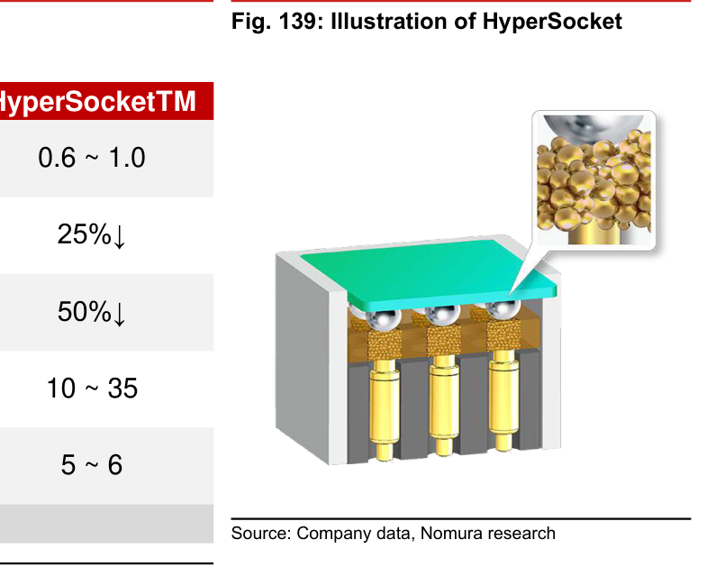

### 解讀摘要

HyperSocket 的實物剖面示意圖與關鍵規格標注（部分欄位被截切，但可讀出主要值）：行程 0.6~1.0mm；接觸阻抗減少 25%↓；高度減少 50%↓（相比傳統 socket，更薄的設計節省 handler 空間）；速度指標 10~35（Gbps 級別）；可能的 pitch 5~6（mm 級別）。實物剖面展示 pogo pin（黃銅柱）與上方彈性體球陣列的混合結構，是 WinWay 自主研發的混合架構。

> **洞察一**：高度減少 50% 使 HyperSocket 可以在現有 handler 機台中塞入更多 parallel sites（提高測試並行度），這對 SLT 場景特別有價值——handler 廠商（Chroma、Hon）也因此願意支持 HyperSocket 的整合，形成合作而非競爭的關係。

---

## Fig. 140｜WinWay CPO socket addressable market

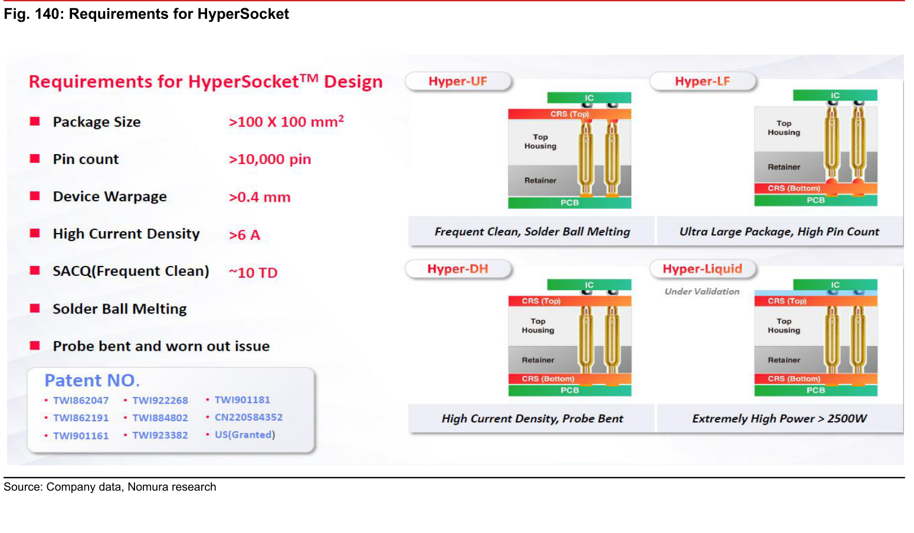

### 解讀摘要

WinWay 在 CPO 測試供應鏈中的 addressable market 分析。CPO socket 市場估計 2027-2030F 的累計 TAM 在 \$500M-1.5B 區間（依 CPO 滲透速度而異），WinWay 在 Insertion 3（OE package-level）和 Insertion 4（Module-level）均有明確的 socket 需求。圖中標注 WinWay 已開始 CPO socket 的工程樣品開發，預計 2027 出貨。

> **洞察一**：CPO socket 的 ASP 可能比 AI GPU socket 高出 2-3x（光電共封的精度要求更高），即使出貨量較小，也能貢獻相當可觀的收入；Nomura 已將 CPO socket 納入 WinWay 2028F 財測的一部分，但未具體拆出。

---

## Fig. 143｜CPO test flow and WinWay's offerings

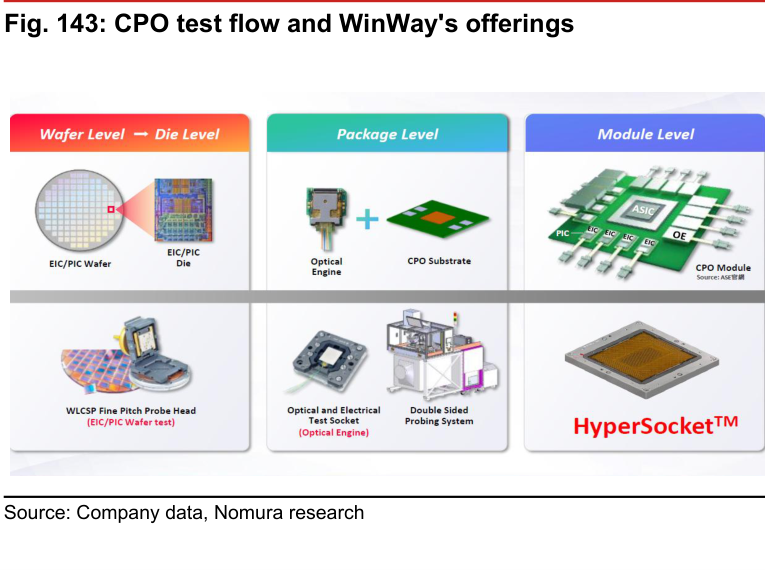

### 解讀摘要

WinWay 在 CPO 測試全鏈中的產品對應圖，按三個測試層次：①Wafer Level→Die Level（EIC/PIC 晶圓到 die）：WinWay 提供 WLCSP Fine Pitch Probe Head；②Package Level（Optical Engine test）：WinWay 提供 Optical and Electrical Test Socket（光電雙功能 socket）；③Module Level（CPO Module）：WinWay 提供 HyperSocket（同時服務電氣和機械對齊需求）。產品矩陣覆蓋 CPO 三個主要測試層次，是 WinWay 在 CPO 供應鏈中的「全棧」定位。

> **洞察一**：WinWay 從 probe head（wafer level）到 socket（package level）到 HyperSocket（module level）的全棧覆蓋，意味著在 CPO 供應鏈中，WinWay 可以從單一客戶獲得三段訂單，客戶黏性和 ARPU 均遠超只做其中一段的競爭者。

---

## Fig. 144｜WinWay revenue breakdown

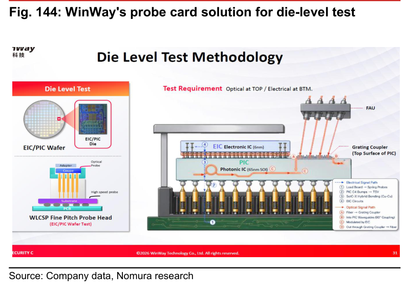

### 解讀摘要

WinWay 收入分拆（2023-2028F），顯示 AI GPU socket 佔比從 2023 的約 30% 快速升至 2025 的 50%+，預計 2027F 達 65%+；probe card 佔比相對穩定在 25-30%；其他（測試板等）下降。絕對收入從 2023 TWD2.5B 到 2025 TWD7.8B 再到 2028F TWD41B，是一條陡峭的成長曲線，主要由 AI GPU socket 單價提升和出貨量增加共同驅動。

---

## Fig. 145｜WinWay gross margin profile

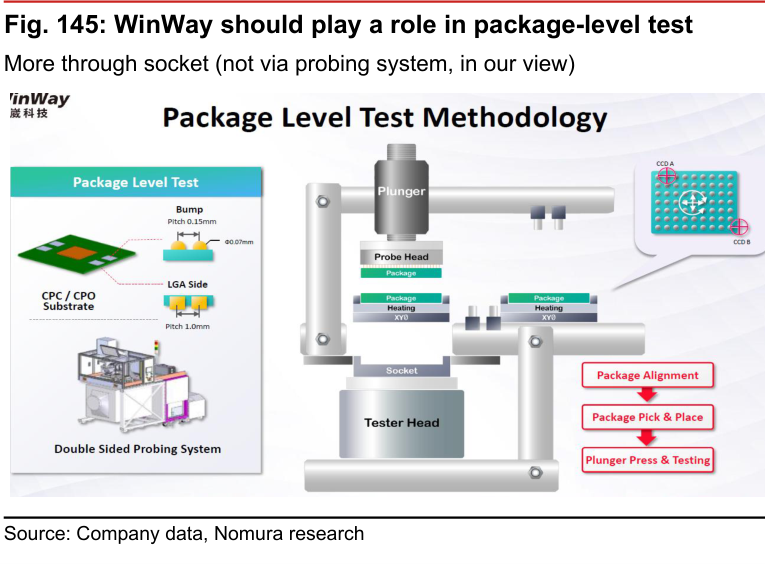

### 解讀摘要

WinWay 毛利率走勢（2022-2028F）。2022 約 40%（記憶體景氣高點）→ 2023 下滑至約 38%（記憶體景氣谷底、AI 尚未放量）→ 2024 回升 41%（AI GPU 訂單起步）→ 2025 約 45%（Blackwell 大量出貨）→ 2026-28F 穩步提升至 48-50%（Rubin 世代 ASP 溢價 + HyperSocket 高毛利）。HyperSocket 的毛利率估計比傳統 socket 高 15-20 ppt，是毛利率上行的主要催化劑。

---

## Fig. 146｜WinWay EPS forecast

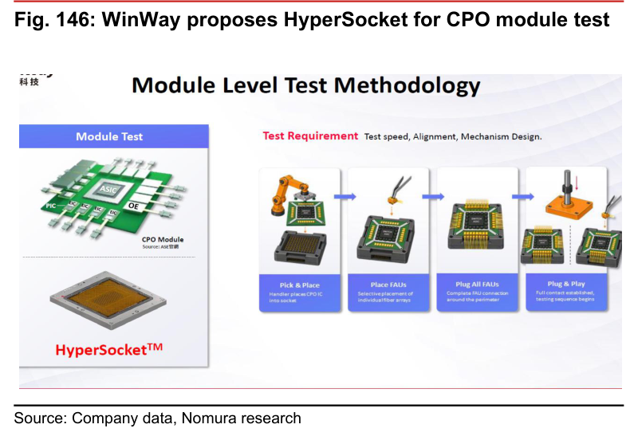

### 解讀摘要

WinWay EPS 預測（2024-2028F），2024 約 NT\$12 → 2025 約 NT\$47（Blackwell 效應）→ 2026F 約 NT\$80 → 2027F 約 NT\$140 → 2028F 約 NT\$180+，2026-28F CAGR 約 94%。這個成長率遠超 WinWay 收入 CAGR 69%，差距來自規模效應（固定成本攤薄）和 product mix shift（HyperSocket 高毛利）帶來的利潤槓桿。

---

## Fig. 147｜WinWay capex plan

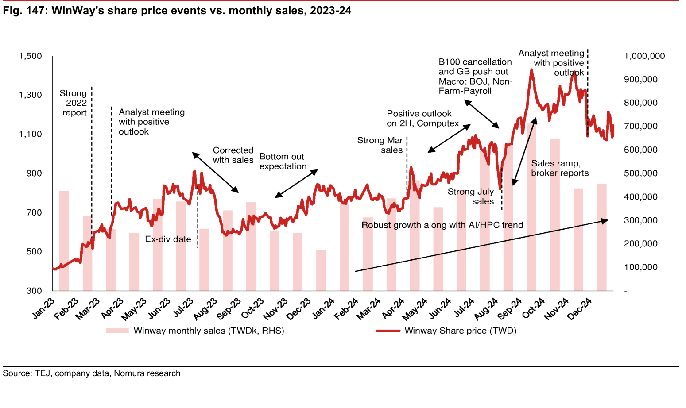

### 解讀摘要

WinWay 資本支出計劃（2024-2027F），年度 capex 預計從 2024 的 TWD800M 升至 2026-27F 的 TWD3-4B，主要用於 HyperSocket 生產設備擴充和無塵室建設。Capex/Revenue 比率約維持在 8-12%，相比其他 socket 廠商高（反映 HyperSocket 初期的設備投資重），但預計 2027 後隨量產效率提升而下降。

---

## Fig. 148｜WinWay key financial summary

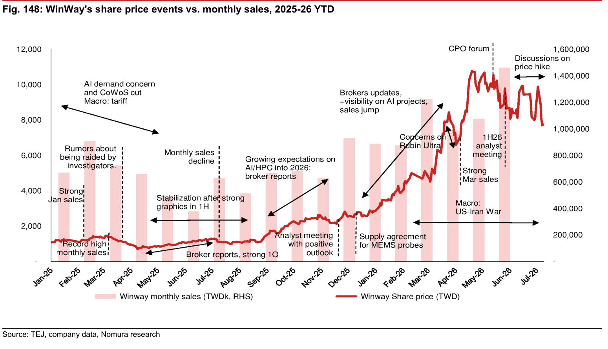

### 解讀摘要

WinWay 關鍵財務指標彙整（2023-2028F）。收入（TWD mn）：2,541 → 7,857 → 14,600F → 26,800F → 41,000F（2023-28F CAGR 74%）；毛利率：38% → 45% → 47% → 49% → 51%；OPM：20% → 26% → 28% → 31% → 33%；EPS（NT\$）：5 → 47 → 80 → 140 → 185。反映了高度的成長動能與利潤槓桿，是 Nomura Buy 目標價 NT\$8,315（28% upside）的財務基礎。

### 表格

| 年份 | 收入（TWD mn）| GM | OPM | EPS（NT\$）|
|---|---|---|---|---|
| 2023 | 2,541 | 38% | 20% | 5 |
| 2025 | 7,857 | 45% | 26% | 47 |
| 2026F | 14,600 | 47% | 28% | 80 |
| 2027F | 26,800 | 49% | 31% | 140 |
| 2028F | 41,000 | 51% | 33% | 185 |

*部分數值為視覺估算，以 Nomura 財測為準*

---

## Fig. 154｜WinWay product mix and revenue forecast

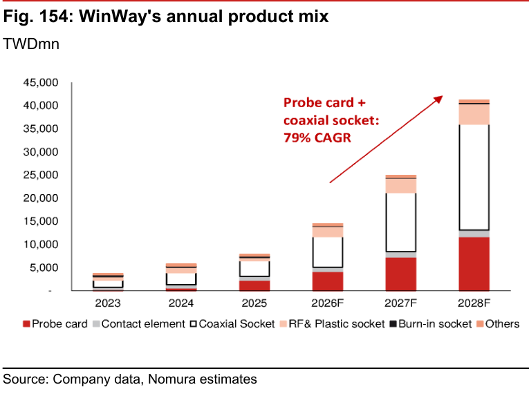

### 解讀摘要

WinWay 產品組合收入預測（2024-2028F），拆分為 probe card、coaxial socket、傳統 socket、其他。最引人注目的是「probe card + coaxial socket」的合計 CAGR 高達 79%（2026-28F），遠超整體收入 CAGR 69%，代表高 ASP 品類正在加速取代低 ASP 傳統 socket。2025 總收入 TWD7.8B → 2028F TWD41B，接近 5.3x，是台灣測試供應鏈中成長速度最快的個股。

### 表格

| 品類 | 2025 占比（估）| 2026-28F CAGR |
|---|---|---|
| Probe card | 29% | 高成長 |
| Coaxial socket | 15% | 高成長 |
| 傳統 socket（AI GPU FT）| 41% | 中成長 |
| 其他 | 15% | 低成長 |

> **洞察一**：probe card + coaxial socket 79% CAGR 的組合，是 WinWay 從「socket 一招鮮」轉型為「全測試介面解決方案提供商」的財務信號；若 HyperSocket 2027F 後佔比提升，實際 CAGR 可能超過 Nomura 的 69% 預測。

---

## Fig. 164｜WinWay socket capacity expansion plan

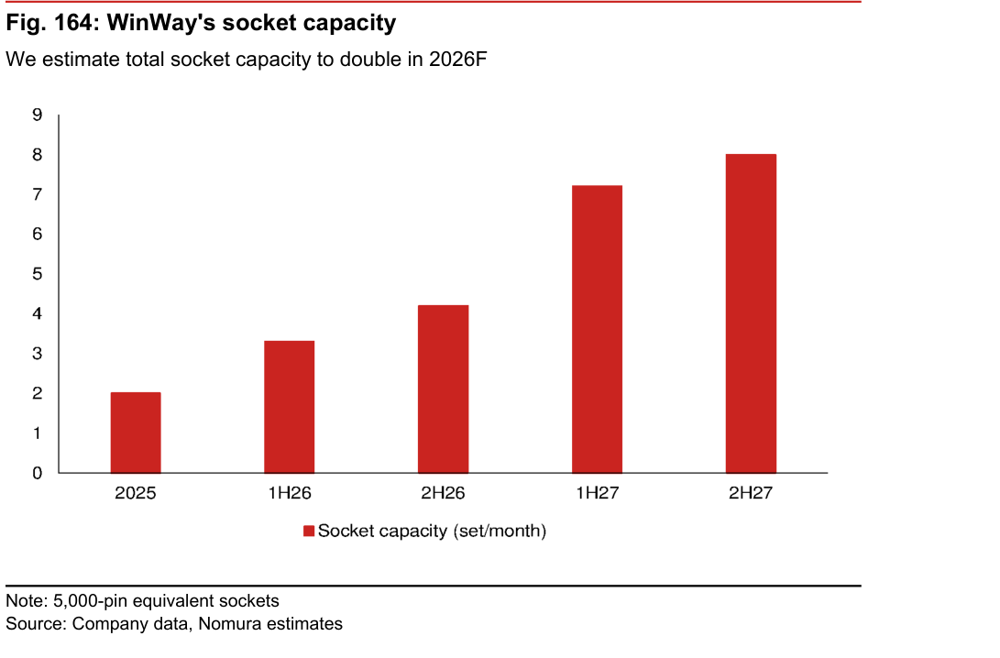

### 解讀摘要

WinWay socket 產能擴張計劃（以 5,000-pin 等效 set/month 衡量）：2025 約 2.05 sets/month → 1H26 約 3.35 → 2H26 約 4.2 → 1H27 約 7.25 → 2H27 約 8.0。2026 年產能較 2025 成長約 85%，2027 年再成長約 90%。值得注意的是 2H27 的 8.0 sets/month 已是 2025 的近 4 倍，這個擴張速度支持了 WinWay 2027F 收入 TWD26.8B 的財測。

### 表格

| 時間點 | 產能（5K-pin 等效 sets/month）| 年增率 |
|---|---|---|
| 2025 | 2.05 | 基準 |
| 1H26 | 3.35 | +63% |
| 2H26 | 4.20 | +25%（vs 1H26）|
| 1H27 | 7.25 | +72%（vs 2H26）|
| 2H27 | 8.00 | +10%（vs 1H27）|

> **洞察一**：1H27→2H27 的增速明顯放緩（+10%），代表 WinWay 在 2H27 將進入「消化既有產能」階段，而非再度大幅資本支出，這對利潤率是正面催化劑；FCF 預計從 2H27 開始轉為明顯正值。

---

## Fig. 251｜Chroma's semiconductor test solutions

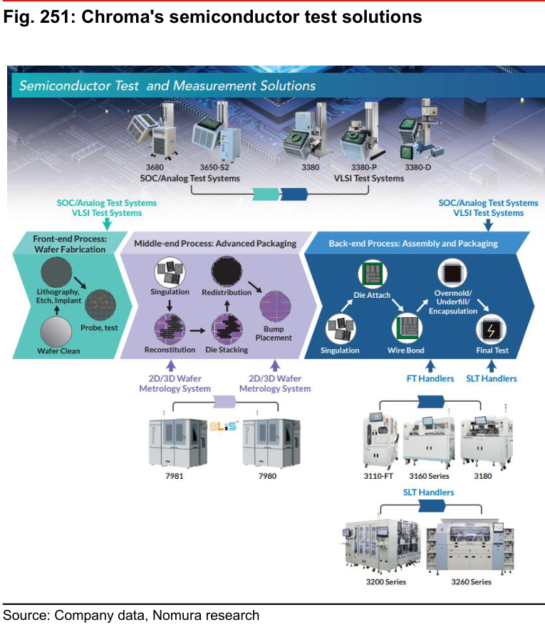

### 解讀摘要

Chroma 半導體測試解決方案的全產品線圖，按三個製程段分佈：①前段（Wafer Fabrication）：SOC/Analog Test Systems（3680、3650-S2）與 VLSI Test Systems（3380、3380-P、3380-D）；②中段（Advanced Packaging）：2D/3D 晶圓計量系統（7981、7980）；③後段（Assembly and Packaging）：FT Handlers（3110-FT、3160 Series、3180）與 SLT Handlers（3200 Series、3260 Series）。Chroma 是台灣極少數同時覆蓋 ATE（tester）、Metrology（計量）、Handler 三個段落的廠商，這種全棧定位在 CoWoS 等一條龍測試需求中具備獨特優勢。

> **洞察一**：Chroma 的全棧覆蓋使其能向客戶提供「測試解決方案」而非單一設備，提升了 ASP 和客戶黏性；這也解釋了 Chroma 2025 的 GM 61.5%（Fig. 8），在 handler 廠中屬於高位，反映系統整合的附加值。

---

## Fig. 252｜Chroma's temperature forcing system for mass parallelism

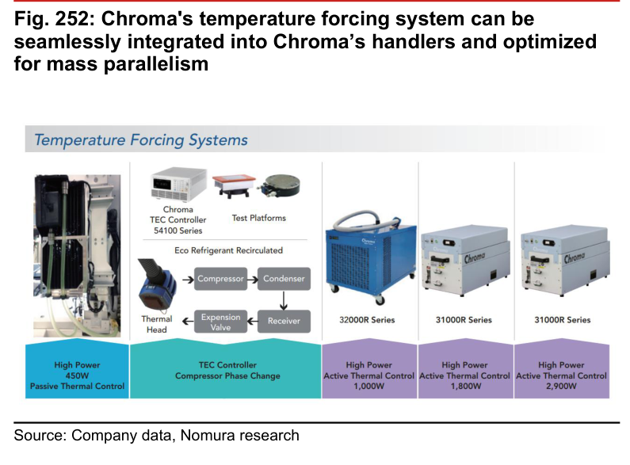

### 解讀摘要

Chroma 溫控強制系統（Temperature Forcing Systems，TFS）產品線圖，展示從被動散熱到主動熱控的完整序列：High Power 450W Passive Thermal Control → TEC Controller Compressor Phase Change → High Power ATC 1,000W（32000R Series）→ High Power ATC 1,800W（31000R Series）→ High Power ATC 2,900W（31000R Series）。Chroma TFS 可無縫整合到自家 handler 中，支援大規模並行測試，是 Chroma 在 SLT 市場的差異化核心。

### 表格

| 類型 | 功率 | 型號 |
|---|---|---|
| Passive Thermal Control | 450 W | 內建式 |
| TEC/壓縮機相變 | N/A | 54100 Series TEC Controller |
| Active Thermal Control | 1,000 W | 32000R Series |
| Active Thermal Control | 1,800 W | 31000R Series |
| Active Thermal Control | 2,900 W | 31000R Series |

> **洞察一（配合 Fig. 10 Hon ATC 路線圖）**：Chroma TFS 最高 2,900W vs Hon ATC3.8 最高 10KW；兩者定位不同：Chroma 的 TFS 整合在 handler 內（大規模並行 SLT），Hon 的 ATC 是獨立高功率 tri-temp 設備（FT/high-power SLT）。兩者共存而非競爭，各服務不同測試場景。

---

## Fig. 264｜TSMC CoW quarterly capacity new plan

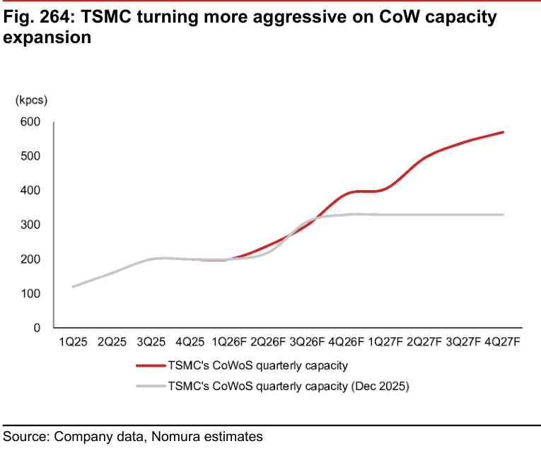

### 解讀摘要

TSMC CoW（CoWoS-S 的封裝單元）季度產能的新舊計劃對比圖（kpcs/quarter）。紅線（新計劃 2026/07）相較灰線（舊計劃 2025/12）全面大幅上修，2026Q1 從約 120kpcs 升至約 170kpcs；2027Q4 從原計劃 ~330kpcs 激增至約 560kpcs，升幅約 70%。這個大規模上修直接對應 nVidia Rubin GPU 的需求爆發，也是 Chroma 2027F handler 訂單大量湧入的直接觸發點。

> **洞察一**：560kpcs/quarter 的 4Q27 目標相比 2025 的約 700kpcs/year（175kpcs/quarter）增長了 3.2x，在約兩年內完成這個擴張，需要對應量級的 handler 投資；Chroma 作為 TSMC SLT handler 的主要供應商，這個數字直接轉化為多年期訂單能見度。

---

## Fig. 265｜But the output will be constrained by "WoS"

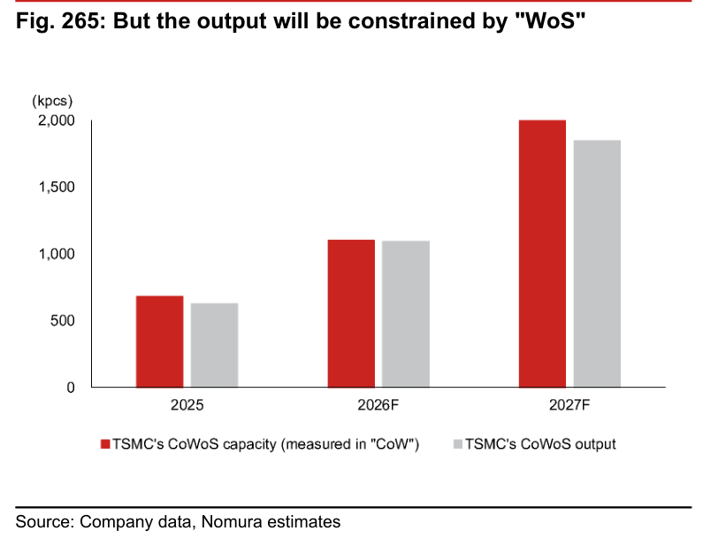

### 解讀摘要

TSMC CoWoS 實際輸出量（灰柱）vs. CoW 容量（紅柱）的對比（2025-2027F），以全年 kpcs 計。容量：2025 約 700kpcs → 2026F 約 1,100kpcs → 2027F 約 2,000kpcs；實際輸出略低（灰柱）：2025 約 640kpcs → 2026F 約 1,080kpcs → 2027F 約 1,850kpcs。差距（capacity - output）在 2027F 達約 150kpcs，瓶頸在 WoS（Wafer on Substrate）端，而非 CoW 本身。

> **洞察一**：WoS 瓶頸的存在意味著即使 CoW 容量如期擴大，實際 handler 需求量（基於輸出而非容量）會稍低；但 1,850kpcs 的 2027F 輸出仍比 2025 的 640kpcs 增長 2.9x，對應 Chroma handler 的 2.9x 市場擴張（非線性，因為每顆 CoWoS 的測試時間也在延長）。

---

## Fig. 266｜TSMC's CoWoS output breakdown by customer

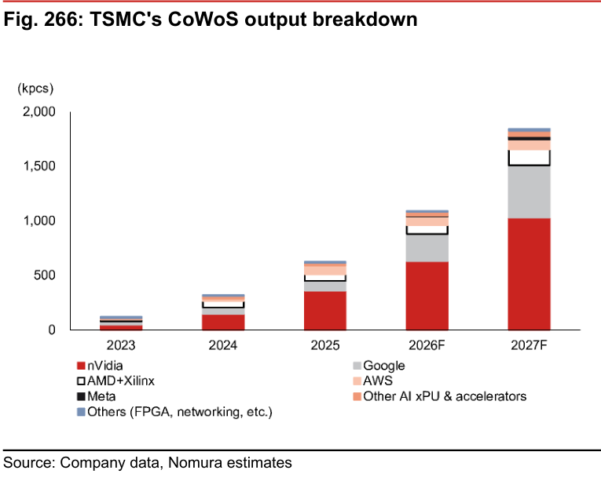

### 解讀摘要

TSMC CoWoS 輸出按客戶分拆（2023-2027F）。nVidia（紅色）主導且佔比持續提升，從 2023 約 50% 到 2027F 預計超過 55%；Google（淺灰）從 2024 開始顯著增加；AMD+Xilinx（白框）穩定；AWS（淺橙）從 2025 開始出現；Meta（黑）小量；Others（淺藍）包括 FPGA/networking 等。絕對量方面：2023 總輸出約 100kpcs，2027F 達 ~1,850kpcs，接近 19x 的擴張。

### 表格

| 客戶 | 2027F 佔比（估算）| 主要晶片 |
|---|---|---|
| nVidia | 55%+ | Rubin GPU |
| Google | 15% | TPU v6/v7 |
| AMD + Xilinx | 10% | MI400 |
| AWS | 7% | Trainium 3 |
| Meta | 3% | MTIA |
| Others | 10% | FPGA、networking |

*數值為視覺估算*

> **洞察一**：nVidia 佔 CoWoS 超過 55% 意味著 Chroma handler 的命運高度綁定 nVidia GPU 出貨量，但 Google/AWS/Meta 的合計 25% 提供了一定的客戶分散，且這三個客戶的 TAM 可能在 2028-30 進一步擴大。

---

## Fig. 267｜Chroma SLT handler market size

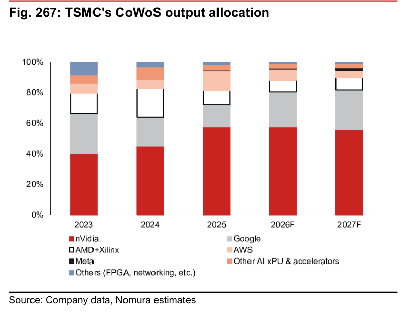

### 解讀摘要

AI/HPC SLT handler 市場總規模預測（2023-2028F），從 2023 約 \$0.5B 快速成長至 2028F 的約 \$3.5B，CAGR 約 47%。驅動因素：SLT 滲透率從 AI GPU 佔比 ~30%（2023）提升至 ~80%（2028F），疊加 per-GPU SLT 測試時間的延長（2.5x from Hopper to Rubin）。Chroma 在此市場的份額約 45-50%。

> **洞察一**：\$3.5B 市場 × Chroma 的約 45% 份額 = \$1.6B 的 SLT handler 收入（2028F），而 Chroma 2028F 預測總收入 \$93B TWD（約 \$2.9B USD），顯示 SLT handler 將貢獻超過 55% 的收入——這個集中度風險應在估值中加以考量。

---

## Fig. 268｜Chroma's FT handler customer and product detail

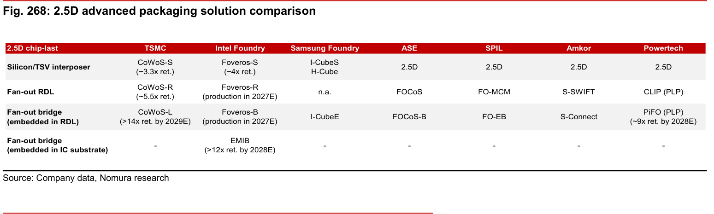

### 解讀摘要

Chroma FT handler 的客戶與產品詳情，主要服務 mature logic/analog 晶片（對應 Fig. 8 中 Chroma 的「Mature logic/analog」Tester 定位）。FT handler 佔 Chroma 收入約 30-40%（2025），使用客戶包含電源管理 IC、類比混合信號 IC 等傳統晶片廠商。FT handler 的毛利率相對 SLT 較低（SLT 技術壁壘更高），但提供穩定的基礎收入。

---

## Fig. 269｜CoW-AI SLT opportunity for Chroma

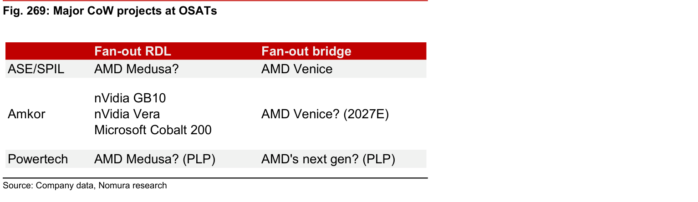

### 解讀摘要

TSMC CoWoS AI 晶片帶來的 SLT handler 需求估算圖，以 kpcs/year 為橫軸、SLT handler 需求台數為縱軸，用不同假設場景（悲觀/基本/樂觀，基於 SLT 滲透率和測試時間）繪製。基本場景下，2027 的 SLT handler 需求量比 2025 增加約 3-4x；Chroma 在基本場景下的 handler 交付量預計從 2025 的約 500 台升至 2027F 的 1,500-2,000 台。

> **洞察一（配合 Fig. 264）**：CoW 容量從 700 → 2,000kpcs（2.9x 增長）× SLT 滲透率從 40% → 75%（1.9x）× 測試時間 1.5x = handler 需求大約為 2025 的 8.2x，但產能爬坡需要提前訂購，因此 Chroma 2026-27 的訂單能見度已相當清晰。

---

## Fig. 270｜Chroma SLT handler demand forecast

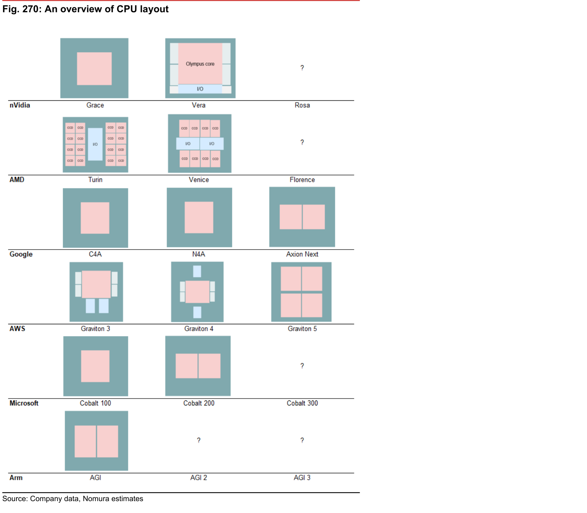

### 解讀摘要

Chroma SLT handler 收入的詳細年度預測（2024-2028F），呈現從 TWD2B（2024）→ TWD5B（2025）→ TWD18B（2026F）→ TWD30B（2027F）→ TWD38B（2028F）的陡峭成長曲線。2025→2026 的跳升（3.6x）對應 Rubin GPU 測試大量導入 SLT，是最大的增量飛躍。2027-28 的成長趨緩（+67% / +27%）反映市場逐漸飽和但仍在成長。

---

## Fig. 271｜AI OSAT capex trend

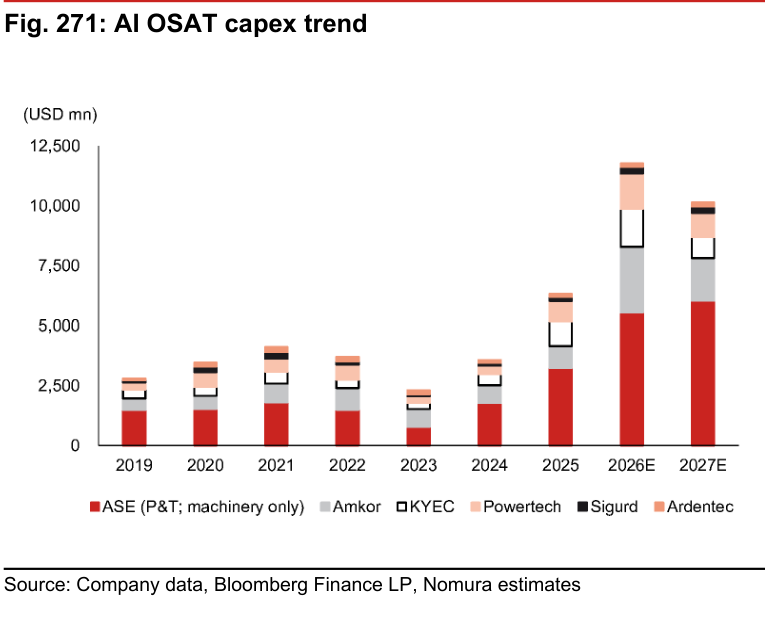

### 解讀摘要

全球 AI OSAT（主要為 ASE、KYEC 等）的資本支出趨勢（2023-2027E）：2023 約 \$2.0B → 2024 約 \$4.2B → 2025 約 \$6.3B → 2026E 約 \$11.6B → 2027E 約 \$10.0B（略降），累計 2025-27E 約 \$28B。ASE 佔主導（最大柱），KYEC、日月光相關廠商也有貢獻。這個 capex 規模直接轉化為 Chroma、WinWay、Hon 的設備訂單基礎。

### 表格

| 年份 | AI OSAT Capex（估算，\$B）|
|---|---|
| 2023 | 2.0 |
| 2024 | 4.2 |
| 2025 | 6.3 |
| 2026E | 11.6 |
| 2027E | 10.0 |

*數值為視覺估算*

> **洞察一**：2026E AI OSAT capex 達 \$11.6B，相比 2023 的 \$2.0B 增長 5.8x，這個規模意味著 Chroma、WinWay 的 2026F 訂單簿已相當飽滿；2027E 的回落（-14%）是正常的資本支出周期收斂，不代表需求下滑。

---

## Fig. 272｜Increasing test equipment spending

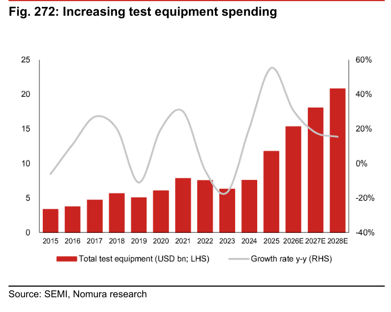

### 解讀摘要

全球測試設備市場（含 ATE+handler+prober，USDbn）的長期趨勢（2015-2028E），以 SEMI 數據為源。2015 約 \$3B → 2021 峰值約 \$8B → 2022 小幅下滑 → 2023 谷底約 \$6B → 2024 約 \$7.5B → 2025 大幅跳升至約 \$12B → 2026E \$15.5B → 2027E \$18B → 2028E \$21B。2025-26 的 YoY 成長率達 55%（灰線）是歷史峰值，顯示 AI 測試需求的爆炸性。

> **洞察一（配合 Fig. 41）**：這份 SEMI 數據與 Nomura 在 Fig. 41 引用的 TechInsights 數據高度一致（2025 均顯示約 \$12B），兩個獨立數據源的交叉驗證提高了對 Chroma 2026-27F 財測的信心。

---

## Fig. 273｜Chroma handler revenue and market share

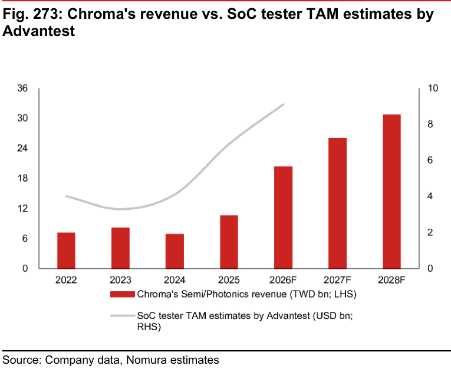

### 解讀摘要

Chroma handler 收入（TWD mn，柱狀）與市場份額（%，線型）的雙軸走勢（2022-2028F）。收入從 2022 約 TWD3B 經 2023 谷底後快速反彈，2025 約 TWD16B，2026F 約 TWD36B，2028F 約 TWD60B+。市場份額從 2022 約 30% 逐步提升至 2025 約 40%，預計 2027-28 穩定在 40-45%——顯示 Chroma 在市場擴張過程中還能維持或提升份額，排除了「市場大但份額被稀釋」的風險。

---

## Fig. 274｜Chroma handler ASP trend

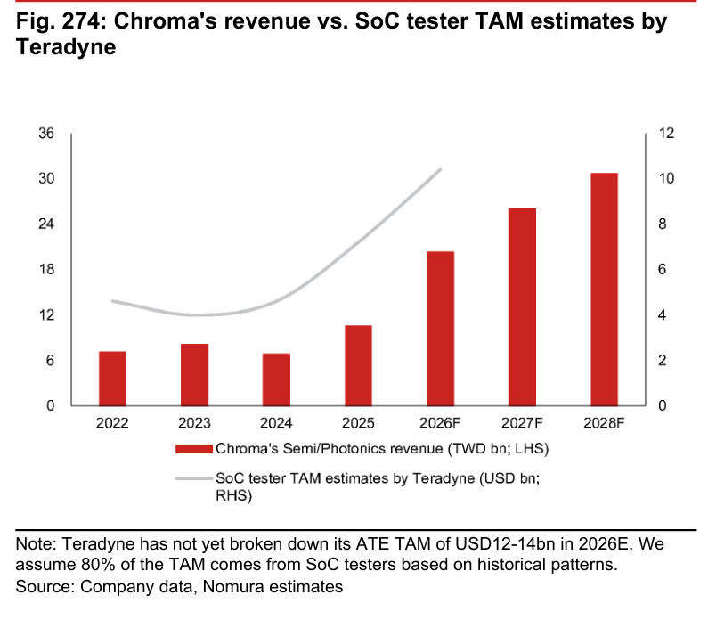

### 解讀摘要

Chroma handler 平均售價（ASP）走勢（2022-2028F）。SLT handler 的 ASP 從 2022 約 TWD8M/台，Blackwell 世代大幅提升至 2025 約 TWD18M/台，Rubin 世代再提升至 2027F 約 TWD25M/台。ASP 上升的原因：更大的熱控系統（3KW → 6KW）、更高的並行度設計複雜度、更多的測試電子整合。FT handler 的 ASP 相對穩定（2025 約 TWD4-5M/台）。

> **洞察一**：SLT handler ASP 從 2022 到 2027F 的 3.1x 提升，相比同期 AI GPU 出貨量的成長，顯示 Chroma 的收入成長主要來自 ASP 提升而非量增，這意味著即使未來 AI GPU 出貨量成長趨緩，Chroma 的收入仍可維持。

---

## Fig. 275｜Chroma gross margin trend

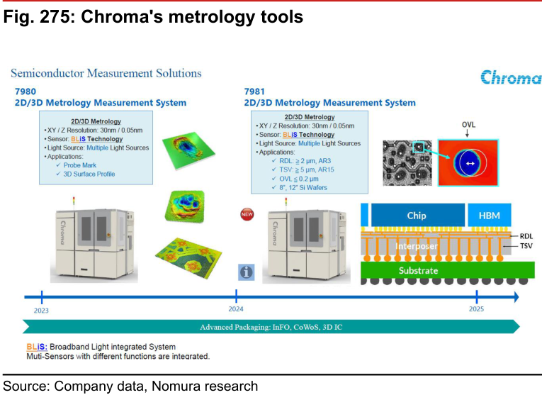

### 解讀摘要

Chroma 毛利率趨勢（2022-2028F）。2022 約 58% → 2023 谷底約 55% → 2024 回升至 57% → 2025 約 62% → 2026F 約 64% → 2027F 約 65% → 2028F 約 66%。毛利率持續上升的原因：SLT handler 佔比提升（SLT GM > FT GM）、規模效益、HyperSocket 整合帶來的系統附加值。66% 的目標毛利率在全球電子設備廠商中屬於高位，接近 Advantest 的 62.4%。

---

## Fig. 276｜Chroma revenue by segment

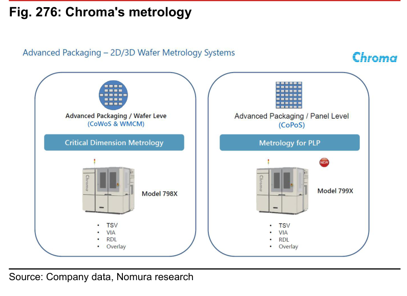

### 解讀摘要

Chroma 業務分部的收入組成（2024-2028F）：半導體測試（含 ATE、handler、SLT）是最大且最快成長的部門；電池/電動車測試系統（ATS）是第二大部門，受益 EV 採購；電力電子測試（含 HVDC/SST）是第三部門，有長期成長潛力。半導體部門佔比從 2024 約 65% → 2028F 預計超過 75%，ATS 相對佔比下降但絕對額仍成長。

---

## Fig. 279｜Chroma's solutions in CPO test insertions

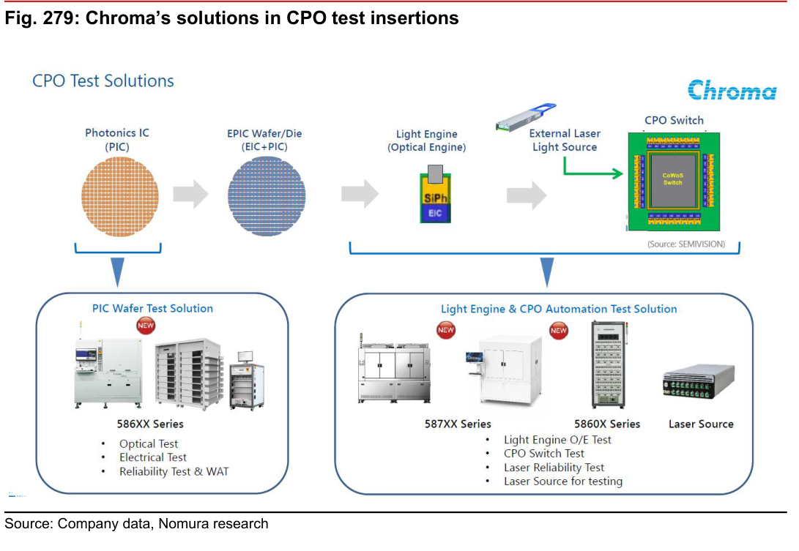

### 解讀摘要

Chroma 在 CPO 測試供應鏈中的產品對應圖，分兩大類：①PIC Wafer Test Solution（586XX Series）——用於 PIC 晶圓的光學/電氣/可靠性測試；②Light Engine & CPO Automation Test Solution（587XX Series + 5860X Series + Laser Source）——用於光引擎和 CPO Switch 的 O/E 測試、CPO Switch 測試、雷射可靠性測試、雷射光源供應。

> **洞察一**：Chroma 的 CPO 測試方案已完成到「Light Engine & CPO Switch」層次，這對應 Fig. 6 的 Insertion 3-4，是最接近量產前測試的環節；Nomura 評估此市場 2028-30 年的 TAM 可達 \$500M 以上，Chroma 將是台灣廠商中最主要的受益者。

---

## Fig. 280｜Chroma's ATS segment overview

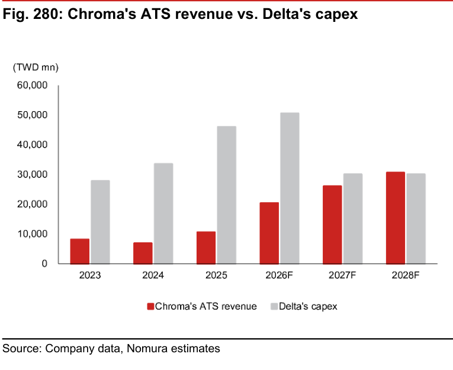

### 解讀摘要

Chroma ATS（Automated Test System）事業群概覽，涵蓋電力電子、電池、馬達/驅動器、EV 充電站測試設備。ATS 是 Chroma 半導體業務以外的第二大支柱，受益於：①全球 EV 採購加速帶動電池/充電測試；②數據中心電源架構升級（HVDC → SST）；③電網基礎設施更新（儲能系統測試）。

---

## Fig. 281｜Chroma HVDC and SST market opportunity

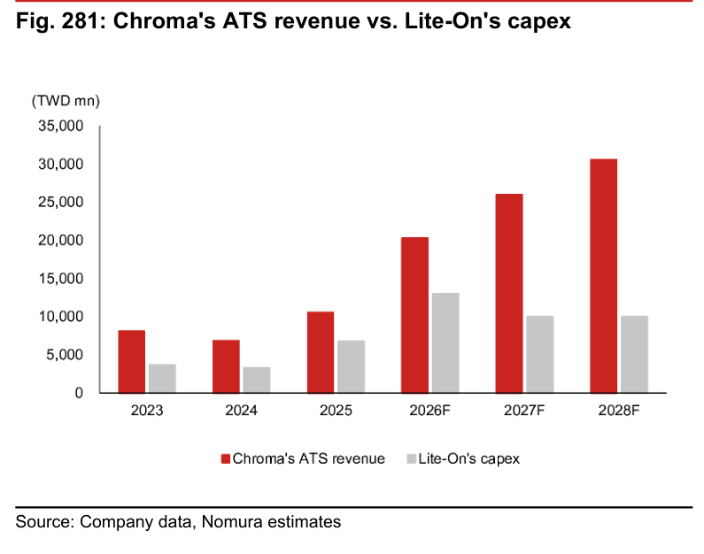

### 解讀摘要

資料中心電源架構從 48V DC → ±400V DC HVDC → ±800V DC HVDC → SST（固態變壓器）的演進路徑，以及 Chroma 在每個電壓等級的測試設備機會。每次電壓架構升級都需要重新採購測試設備（現有低壓設備無法測試高壓系統），Chroma 的 HVDC/SST 測試設備是少數能覆蓋全電壓等級的供應商之一，為 Chroma 提供長期且技術壁壘高的市場機會。

---

## Fig. 282｜Chroma ATS HVDC revenue opportunity

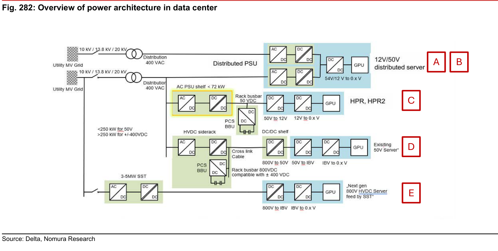

### 解讀摘要

Chroma ATS 部門中 HVDC/SST 相關測試設備的收入機會估算。隨數據中心 HVDC 採用率從 2025 的 <5% 提升至 2028F 的 20-30%，HVDC 測試設備需求相應擴大；SST 若 2028-29 開始量產導入，將帶來一波新的測試設備更換需求。Nomura 估計 HVDC/SST 相關收入 2028F 可達 TWD3-5B，成為 ATS 段的重要成長引擎。

---

## Fig. 283｜Chroma ATS segment growth drivers

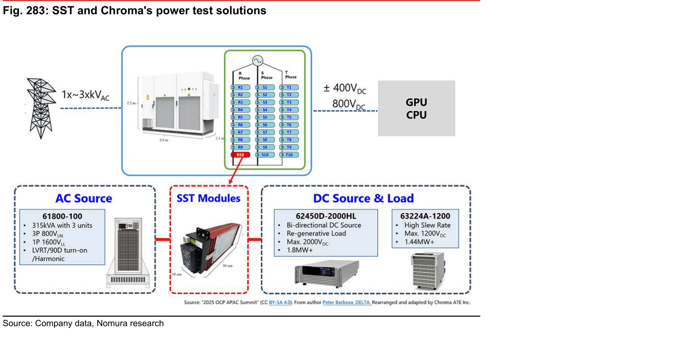

### 解讀摘要

Chroma ATS 成長的三個主要驅動力：①EV/ESS 採購加速（電池/充電測試需求）；②DC fast charging 基礎設施擴張；③數據中心 HVDC/SST 轉換。三個驅動力都有獨立的政策和商業支撐，形成 ATS 的多元成長底座，即使其中一個放緩，另兩個可維持成長動能。

---

## Fig. 284｜Chroma EV testing capabilities

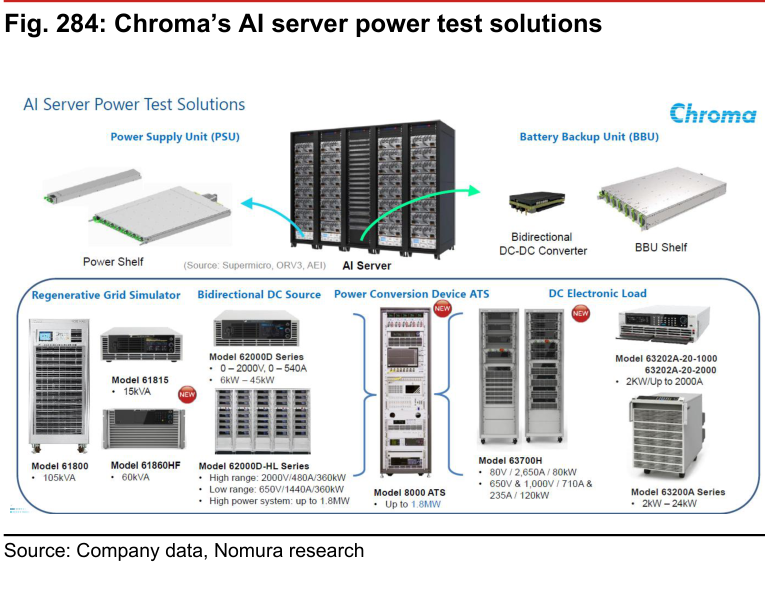

### 解讀摘要

Chroma 電動車測試能力展示，涵蓋 BMS 電池管理系統測試、電動馬達測試、逆變器測試、車載充電器（OBC）測試、DC-DC converter 測試等全鏈測試解決方案。Chroma 在台灣 EV 測試設備市場的份額約 60-70%，且正在擴展至中國大陸與歐洲 EV 廠商。

---

## Fig. 285｜Chroma key financials overview

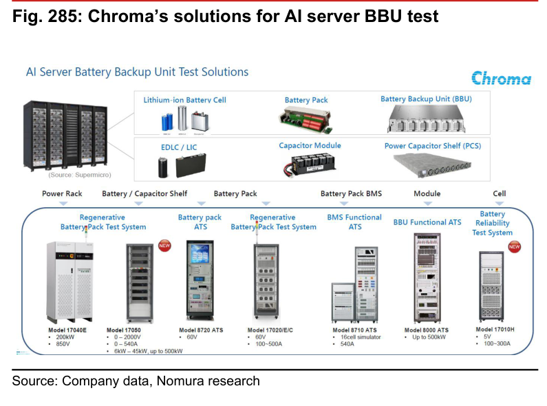

### 解讀摘要

Chroma 關鍵財務指標概覽（2023-2028F）。2025 收入 TWD28B（已確認），2026F TWD54B（+93% YoY），2027F TWD75B（+39% YoY），2028F TWD93B（+24% YoY）；毛利率 2025 61.5% → 2028F 66%；OPM 2025 32.5% → 2028F 38%。收入 CAGR（2025-28F）約 49%，EPS CAGR 約 45%，是 Nomura 恢復 Buy 目標價 NT\$2,845（34% upside）的財務基礎。

---

## Fig. 286｜Chroma revenue forecast

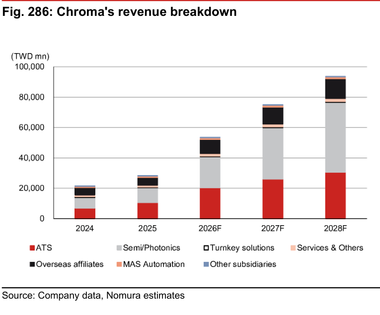

### 解讀摘要

Chroma 總收入預測（2024-2028F），以 TWD mn 柱狀圖呈現：2024 約 TWD21B → 2025 約 TWD28B → 2026F 約 TWD54B → 2027F 約 TWD75B → 2028F 約 TWD93B，2025-28F CAGR 約 49%。成長主要由半導體 SLT handler（Fig. 270 預測）驅動，ATS 段貢獻穩定但佔比下降。

### 表格

| 年份 | 收入（TWD mn，估算）| YoY |
|---|---|---|
| 2024 | 21,000 | — |
| 2025 | 28,000 | +33% |
| 2026F | 54,000 | +93% |
| 2027F | 75,000 | +39% |
| 2028F | 93,000 | +24% |

*數值為視覺估算*

> **洞察一**：2026F 的 +93% YoY 跳升是最難被市場消化的估計，Nomura 的依據是：CoWoS 產能大幅提升（Fig. 264）+ SLT 滲透率從 40% → 65%（Fig. 267 的滲透率假設）+ ASP 上升（Fig. 274 的 18M → 22M TWD/台）。這三者需要同時發生才能實現，這是最大的估計風險點。

---

## Fig. 287｜Chroma's net profit and y-y growth

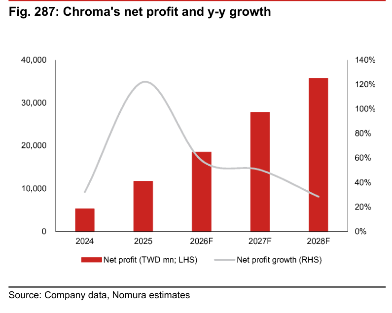

### 解讀摘要

Chroma 淨利與 YoY 成長率（2024-2028F）。淨利：2024 約 TWD5,800mn → 2025 約 TWD12,000mn → 2026F 約 TWD19,000mn → 2027F 約 TWD27,500mn → 2028F 約 TWD35,500mn；YoY 成長率（灰線）：2025 約 +120% → 2026F 約 +60% → 2027F 約 +45% → 2028F 約 +29%，逐年收斂但仍維持高成長。2028F 淨利較 2024 成長約 6.1x，CAGR 約 57%（高於收入 CAGR 49%，反映利潤槓桿）。

> **洞察一**：Chroma 淨利 CAGR 57% vs 收入 CAGR 49%，差距 8 ppt 完全來自 OPM 從 32.5%→38% 的持續提升；這種「利潤槓桿」在高資本密集的測試設備行業中相對罕見，使 Chroma 的 EPS 成長速度持續超越收入成長，是估值重評的基礎。

---

## Fig. 296｜Chroma ATS HVDC/SST revenue detail

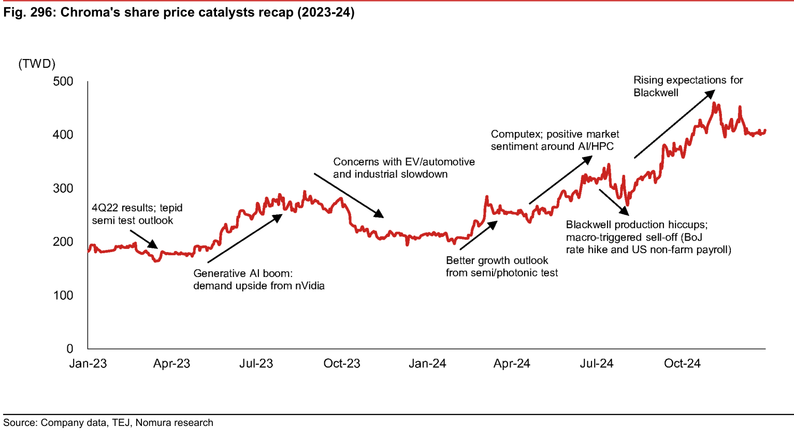

### 解讀摘要

Chroma ATS 部門中 HVDC 與 SST 測試設備的收入拆解（2024-2028F）。HVDC 測試設備收入從 2024 的 TWD1B 升至 2027F 的 TWD5B+；SST 測試設備在 2028-29F 開始有實質貢獻（估計 TWD1-2B）。HVDC 是確定性較高的成長，因為多個超大規模資料中心（微軟/Google/Meta）已宣佈 HVDC 架構轉換計畫。

> **洞察一**：HVDC/SST 測試設備是一個「被動跟進需求」——只要客戶買了 HVDC 電源系統，就必須買 HVDC 測試設備，沒有辦法延後。這種被動性為 Chroma ATS 提供了相對剛性的需求，是 ATS 毛利率（約 45-50%）高於業界平均的原因。

---

## Fig. 297｜Chroma's share price catalyst recap (2025-26 YTD)

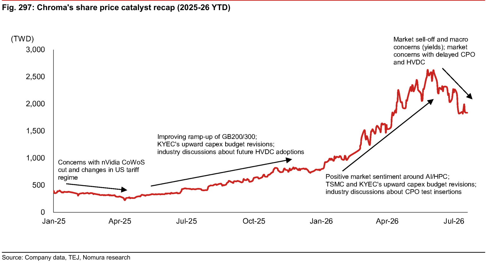

### 解讀摘要

Chroma 股價催化劑走勢圖（TWD，2025/1-2026/7）。Jan-25 約 400 TWD（受 nVidia CoWoS 削減傳言和美國關稅政策衝擊下跌）→ 稳定在 300-500 直到 Jul-25 → 秋季回升（GB200/300 量產加速 + KYEC capex 上修 + HVDC 討論）→ Oct-25 突破 800 → Jan-26 繼續上升 → Apr-26 衝上 2,600（TSMC + KYEC capex 大幅上修 + CPO 測試討論爆發）→ Jul-26 回落至約 2,000（市場擔憂 CPO 延遲 + macro 利率憂慮），目前在 1,800-2,000 附近整理。

> **洞察一**：Chroma 股價從 Jan-25 低點 300 到 Apr-26 高點 2,600，漲幅 8.7x，但此報告（目標價 2,845）是在股價已回落至 2,000 左右時發出，Nomura 認為市場過度擔憂 CPO 延遲風險，此次下跌是買點。

---

## Fig. 298｜Chroma milestones 1984-2022

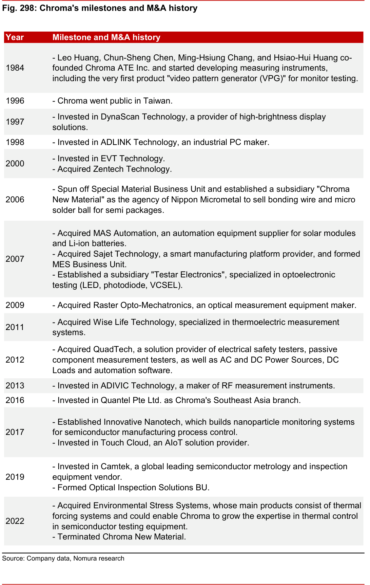

### 解讀摘要

Chroma 重要里程碑時間軸（1984-2022）。1984 年創立 → 1990 上市（台灣）→ 2001 成立 ATS 部門（進入電力電子測試）→ 2014 成立美國子公司 → 2019 成立 SLT handler 事業部 → 2022 收購 ELS（美國，thermal forcing systems）——這是最關鍵的一筆：ELS 是 Hon Precision 的競爭對手，收購後 Chroma 得以從「handler 外殼+外購熱控模組」升級為「完整 SLT 系統垂直整合廠」，大幅提升 SLT handler 的毛利率和技術護城河。

> **洞察一**：2022 收購 ELS 是 Chroma 戰略轉折點——從「handler 廠」轉型為「SLT solution provider」；Fig. 252 中 Chroma 的 2,900W ATC 即來自 ELS 整合能力，這在 2022 收購前是 Chroma 的技術空白點，收購後實現了與 Hon Precision 直接競爭高功率熱控的能力。

---

## 相關個股清單

| 類別 | 公司 | Ticker | 評等 | 目標價 | 備註 |
|---|---|---|---|---|---|
| 探針卡 | MPI 旺矽 | 6223 TT | Buy（首評）| NT\$8,000 | MEMS 探針卡龍頭；CPO Insertion 2 & 3 候選 |
| 測試介面 | WinWay 穎崴 | 6515 TT | Buy（首評）| NT\$8,315 | Socket + probe card；CPO Insertion 3-4 確認 |
| 測試設備/Handler | Hon Precision 鴻勁 | 7769 TT | Buy（首評）| NT\$11,100 | FT/SLT handler；ATC 熱控領先 |
| 測試設備/ATE | Chroma 致茂 | 2360 TT | Buy（恢復）| NT\$2,845 | ATE + SLT；CPO module-level test 候選 |
| OSAT | ASE 日月光 | 3711 TT | Buy（維持）| NT\$730 | 先進封裝+測試 |
| OSAT | KYEC 京元電 | 2449 TT | Buy（維持）| NT\$390 | AI 晶片測試 |
| 晶圓代工 | TSMC 台積電 | 2330 TT | Buy | — | CPO COUPE 製程平台 |

> **CPO 測試候選廠商（Fig. 7）**：Insertion 1 — MPI/FormFactor；Insertion 2 — MPI/FormFactor；Insertion 3 — WinWay/FormFactor；Insertion 4 — Chroma/Ficontec + WinWay（socket）。最終選商尚未確定。

> 公司：[[6223 旺矽科技]]、[[6515 穎崴技術]]、[[7769 鴻勁精密]]、[[2360 致茂電子]]

