# Nomura｜鴻勁精密 首次涵蓋：先進矽晶測試的利刃

**券商**：Nomura  
**分析師**：Eric Chen, CFA、Aaron Jeng, CFA、Vivian Yang  
**日期**：2026-07-24  
**主題**：Hon. Precision (7769) 首次涵蓋，AI/HPC 測試設備結構性受益者  
**評級**：Buy（首次）  
<a href="https://layx.uk/dl?g=產業&b=Nomura&d=20260724&h=HON-Precision-initiation">📎 下載 PDF</a>

---

## 報告總結

Nomura 以 Buy 首次涵蓋鴻勁（Hon. Precision, 7769），目標價 NT\$11,100（現價 NT\$6,405，+73% 上行空間），估值 40x 平均 2027-28F EPS NT\$277。報告撰寫時機在於 Hon 正式上市 TWSE（2025/11）後市場能見度提升，且 CoWoS 擴產路線圖、OSAT AI 資本支出上修、CPO 測試需求具現化三個催化劑同步出現，Nomura 認為現價 29x 2027F EPS 相對同業共識均值 37x 明顯折價。

核心論點：AI/HPC 晶片複雜度與封裝面積增長使測試時間結構性延長，Hon 的 ATC 熱控升級路線圖（最終到 10KW 2027F）、CPO Insertion 4 的新平台機會（ASP 估 US\$1mn/台），加上美國半導體製造回流帶動的設備境外需求，構成 2026-28F 營收 CAGR 59%、EPS CAGR 58% 的三重驅動。主要下行風險：CoWoS 及後段測試產能擴張放緩。

---

## Nomura 完整投資邏輯鏈

| 論點層次 | Exhibit | 內容 |
|---|---|---|
| 測試時間結構性延長 | Fig 15–19 | AI 晶片每代 cost per die 上升 4x（7nm），Chiplet 多顆化 + CoWoS 封裝面積增大 → FT/SLT 測試時間倍增，測試設備需求擴張有剛性基礎 |
| ATC 升級可見度高 | Fig 28 | 熱耗散規格持續拉高（GPU AI 晶片 4KW+ → 10KW 2027F），ATC 路線圖清晰；每代升級推升 handler ASP，客戶難以跳過中間規格 |
| CoWoS 供需持續緊俏 | Fig 30–33 | TSMC CoWoS 季產能 1Q25 ~120kpcs → 4Q27F ~560kpcs，nVidia 2025-27F 佔比 40%→56%；產能大幅上修仍供不應求，帶動 OSAT 加速擴建測試線 |
| 新平台增量機會 | Fig 53–56 | CPO Insertion 4（3KW ATC+handler，O/E 測試）與 MCL handler 均在基線訂單之外；前者 ASP ~US\$1mn、後者為全新消耗品 |
| 美國回流設備需求 | Fig 48–50 | TSMC P2/P3/P4 Arizona + Amkor Arizona AAPF（2028 產） + KYEC 美國設廠 → 鄰近設備採購需求；Hon 全球布局（18 個美國客戶 NPI 在進行中）已卡位 |
| 競爭護城河堅實 | Fig 47, 51 | FT handler 市佔 70%+，OPM 49.7% vs 中國最強競爭者 Changchuan 24.4%；技術壁壘（600+ 專利）+ 客戶 NPI 鎖定使替換成本極高 |
| **估值折價 → Buy** | 報告封面 | **29x 2027F EPS vs 同業共識 37x，低估；40x 目標倍數處歷史區間（19-52x）高端但 58% EPS CAGR 支撐；TP NT\$11,100** |

> **報告最大邏輯缺口**：CPO Insertion 4 的 ASP US\$1mn 為未公開數字（"estimates"），且時程（2027F）仍在 qualification 階段；若延後至 2028F+，對 2027F 估值有下修壓力但不影響 Buy 論點核心。

---

## 報告核心觀點

| 主題 | Nomura 觀點 | 市場共識 | 是否 Contra-Consensus |
|---|---|---|---|
| ATC ASP 升級週期 | 2027F 達 6KW（3.7系列），2028F 目標 10KW（3.8系列）；ASP CAGR 顯著 | 市場多關注出貨量，ASP 升級速率未充分定價 | 是 |
| CoWoS 供需 | 2026F 供需趨於平衡，2027F+ 再度吃緊；測試設備需求多年持續 | 市場對供需平衡時程判斷分歧 | 偏 contra |
| CPO 測試插入 | CPO Insertion 4 Hon 主導，2027F 初步貢獻 | 多數分析師時程更保守 | 是，Nomura 更積極 |
| 中國競爭威脅 | Changchuan 等在 AI/HPC 高端難以替代 Hon，OPM 差距 25ppt | 部分市場擔心競爭壓縮毛利 | 是，Nomura 認為威脅被誇大 |
| 美國境外產能需求 | 美國 OSAT 設廠為真實增量需求，Hon 須跟進擴大美國產能 | 市場尚未充分定價境外擴產成本/效益 | 是 |

**零件/個股偏好**：Hon Precision (7769 TT) — 唯一涵蓋個股，Buy。

---

## Fig. 1｜IC 後段測試流程

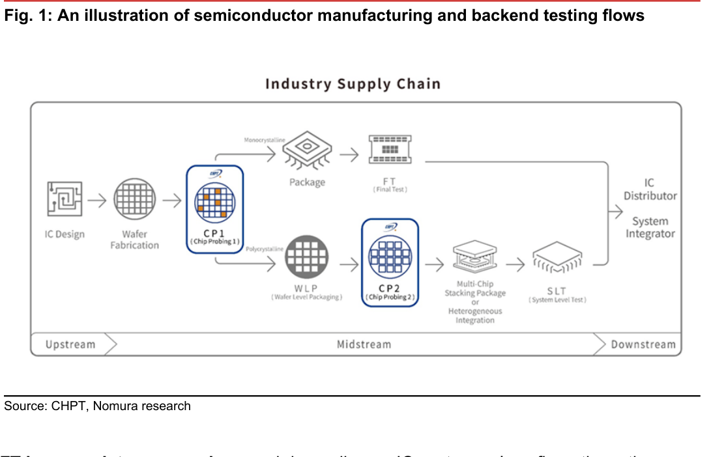

### 解讀摘要
IC 後段測試分兩條主路：傳統路徑（CP→FT）與先進封裝路徑（CP→WLP→CP2→Multi-chip→SLT）。先進封裝路徑因需要在多晶片整合後再執行系統測試（SLT），測試步驟數量多出 2-3 道，是驅動 Hon handler 需求擴張的結構性機制——每新增一道 SLT 工序對應一台新的 SLT handler 採購需求。

### 表格

| 路徑 | 工序 |
|---|---|
| 傳統路徑 | CP → FT |
| 先進封裝路徑 | CP → WLP → CP2（重測）→ Multi-chip 整合 → SLT |

> **洞察一**：先進封裝路徑比傳統路徑多 3 道工序（WLP、CP2、SLT），且每道均需 handler；AI 晶片幾乎全走先進封裝路徑，等於結構性拉高每顆晶片對應的 handler 採購量。

---

## Fig. 2｜SLT 測試架構

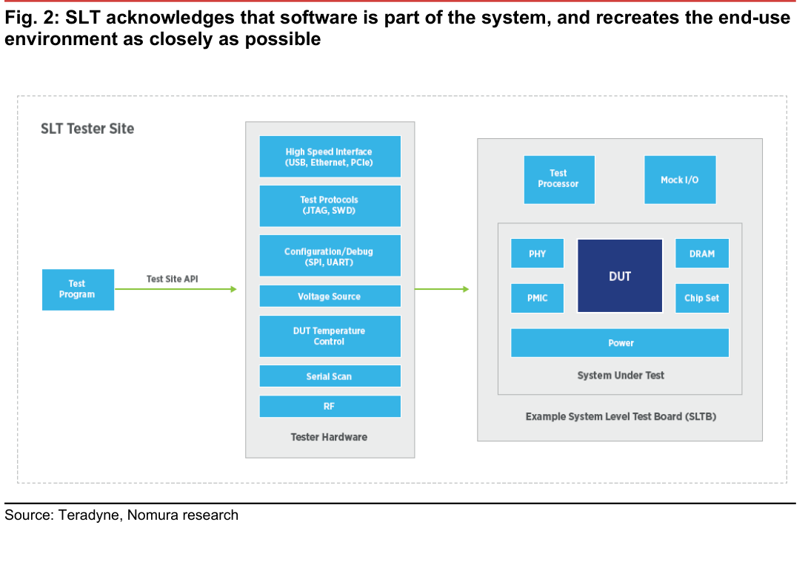

### 解讀摘要
SLT 架構由「SLT tester site」與「system under test board」兩部分組成，以接近真實使用條件執行系統層測試，能捕捉 ATE 遺漏的 system-level 故障。對 Hon 而言，SLT handler 滲透率上升（現佔 20-30%）是純增量的 ASP 升級機會，因為 SLT handler 規格遠高於 FT handler。

### 表格

| 模組 | 功能 |
|---|---|
| SLT tester site | 執行測試向量，施加熱控條件 |
| System under test board | 提供接近實際使用環境的系統互連平台 |

---

## Fig. 3｜ATE vs SLT 故障覆蓋率比較

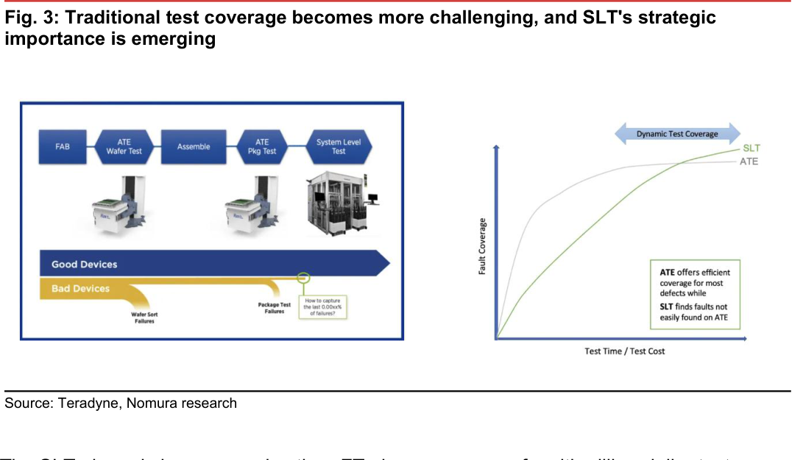

### 解讀摘要
ATE 覆蓋率高但無法捕捉 system-level 互動故障；SLT 覆蓋率在「system-level interactions」類別明顯優於 ATE，兩者互補而非替代。這是 SLT 滲透率提升的核心理由——隨 AI 晶片整合度上升，system-level 故障比率增加，SLT 的角色從可選到必需。

> **洞察一**：SLT 覆蓋 ATE 的盲區，而非取代 ATE，故兩者並存且 Hon 同時受益於 FT handler + SLT handler 需求。

---

## Fig. 4｜Adaptive SLT 流程

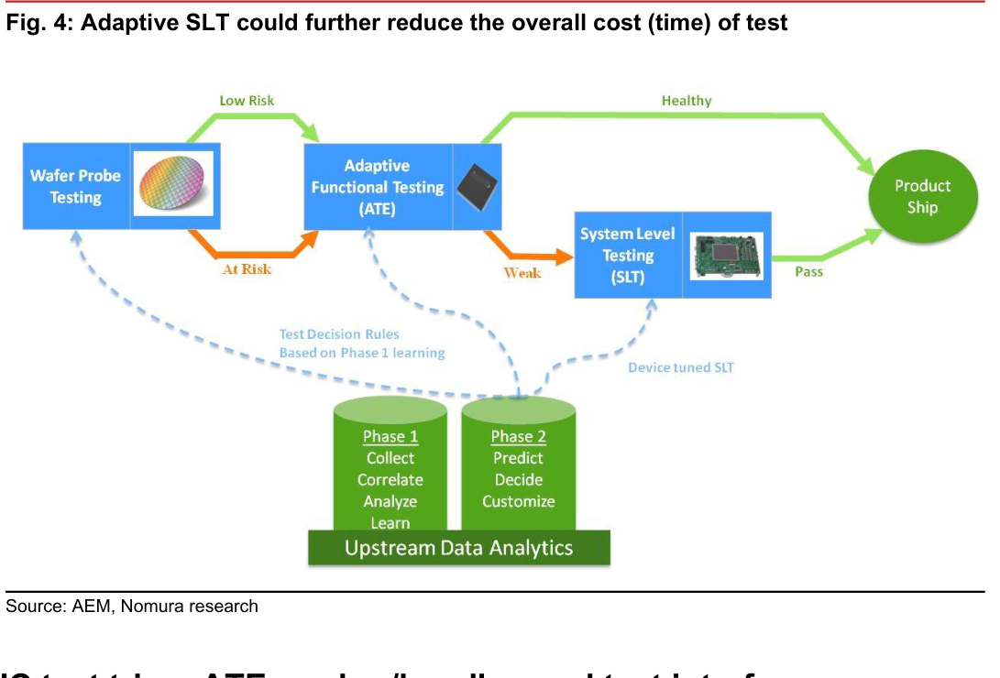

### 解讀摘要
Adaptive SLT 以 ML 演算法動態調整每顆晶片進入的測試路由（SLT 還是標準 ATE），以降低整體測試成本並維持良率。此架構對客戶提升 cost efficiency 有利，但也意味著並非所有晶片都需要完整 SLT，使 SLT handler 的實際需求量取決於客戶的 ML routing 決策。

> **值得驗證**：若 Adaptive SLT 廣泛採用，將部分晶片從 SLT 路由回 ATE，Hon 的 SLT handler 滲透率假設（20-30%）可能受壓。

---

## Fig. 5｜Chip Probe 測試站

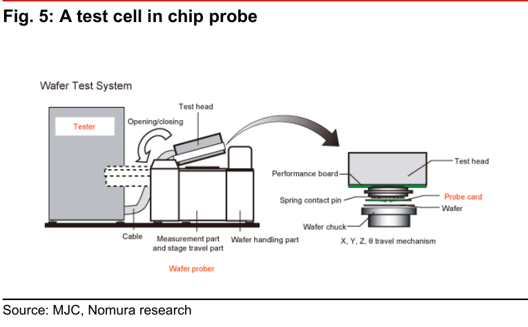

### 解讀摘要
CP 測試站（ATE + wafer prober + probe card 三件組）用於晶圓級前段測試。Hon 不做 wafer prober（FormFactor 主導），主力在後段 FT/SLT handler；此圖定位 CP 在整個測試價值鏈的上游位置，為後續討論 Hon 切入點提供背景。

---

## Fig. 6｜Final Test 測試站

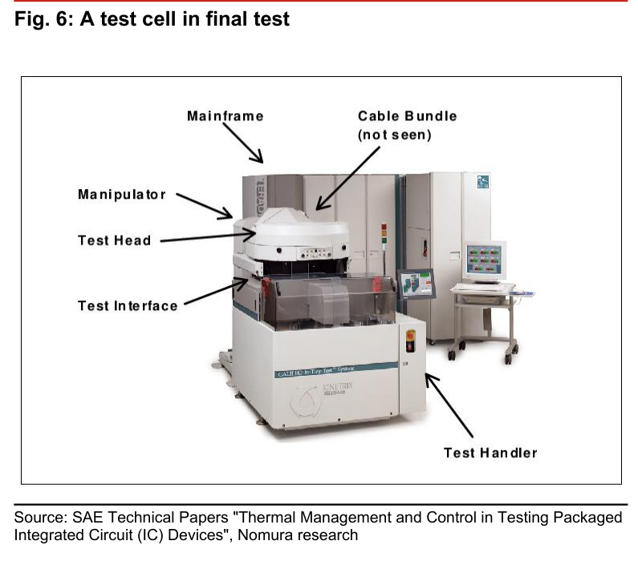

### 解讀摘要
FT 測試站（ATE + handler + ATC 三件組）是 Hon 的核心戰場。圖示說明 handler 在 FT 測試站中是**必要組件**（不可繞過），且需與 ATE 及 ATC 配套使用；Hon 同時供應 handler 和 ATC，在每次設備採購中拿下兩個項目，是同業中少見的組合供應商。

> **洞察一**：Hon 在 FT 測試站中供應 handler + ATC 兩件，每台套設備 ASP 高於單一供應商；競爭者若只賣 handler，在爭取 AI/HPC 客戶時缺乏 ATC 配套能力，是 Hon 的差異化護城河。

---

## Fig. 7｜Thermal Chuck（ATT）+ Wafer Prober

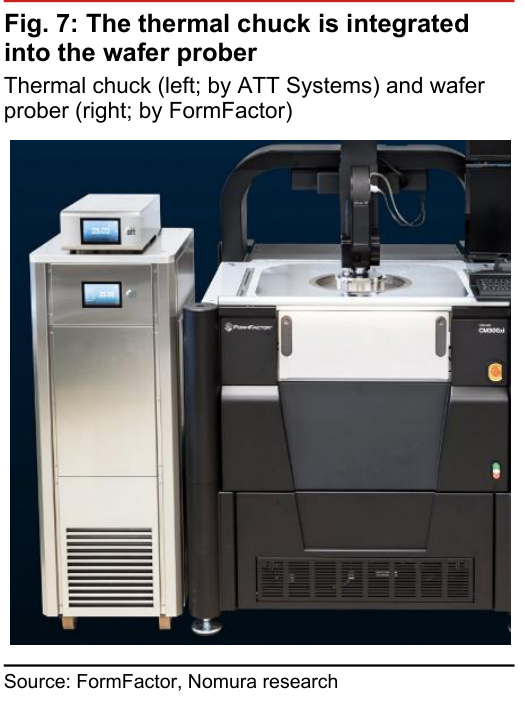

### 解讀摘要
ATT（Active Thermal Testing）與 FormFactor wafer prober 的整合照片，用於 CP 測試中的精確溫控。此圖展示 Hon 在 wafer-level 的熱控能力（ATT 系列），是 ATC 技術從 FT 向上游延伸至 CP 的示例，雖非 Hon 主力市場，但說明其熱控技術深度。

---

## Fig. 8｜ATC 整合至 FT Handler

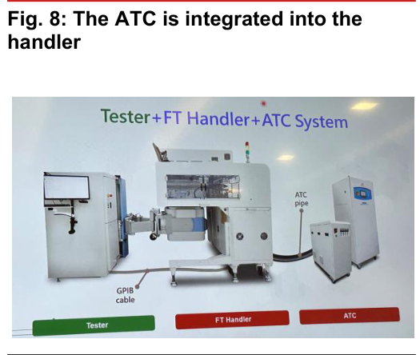

### 解讀摘要
展示 ATC 模組如何物理整合至 FT handler 系統，說明兩者高度耦合的供貨關係——採購 Hon handler 的客戶，通常同步採購 Hon ATC（因介面標準匹配）。這種組合鎖定效果使 Hon 在 handler 市場的地位遠不只是市佔數字：一旦進入某客戶 NPI，後續換機週期幾乎自動綁定。

---

## Fig. 9｜Keysight 儀器 + UF2000 Handler

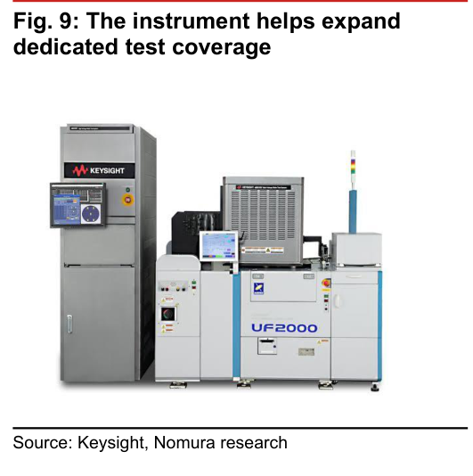

### 解讀摘要
Keysight 測試儀器與 Hon UF2000 handler 整合，展示 ATE + handler 組合在擴展測試覆蓋範圍方面的應用，說明 Hon 的 handler 不僅與 Advantest/Teradyne ATE 相容，也能對接 Keysight 儀器，提升客戶選擇彈性。

---

## Fig. 10｜全球測試設備競爭格局總表

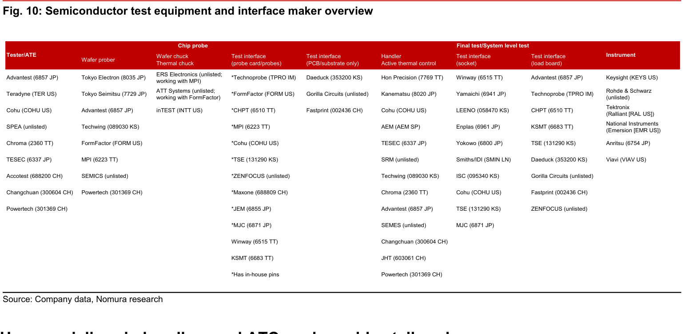

### 解讀摘要
最完整的競爭版圖快照：按 tester、prober、handler、interface 四大類，逐一列出主要廠商。Hon 在 handler 分類獨佔整欄，無任何一家全球廠商能同時覆蓋 tester + handler + ATC；這種橫向壟斷格局是 Hon 估值溢價的基礎結構。

### 表格

| 類別 | 主要廠商 |
|---|---|
| Tester | Advantest、Teradyne、Chroma |
| Wafer Prober | FormFactor、TEL、MPI、Ficontec |
| FT Handler | Hon（主導）、Changchuan（中）、JHT（中）、Powertech（中） |
| SLT Handler | Hon、JHT |
| ATC | Hon（主導） |
| Probe Card | FormFactor、MPI |
| Socket | WinWay、Sensata |

> **洞察一**：非中國廠商中，無任何一家能同時覆蓋 handler + ATC，Hon 是唯一的「組合供應商」；中國競爭者在 AI/HPC 高端的 OPM 差距（24-36% vs Hon 50%）說明技術距離仍大。

---

## Fig. 11｜ATC 產品組合

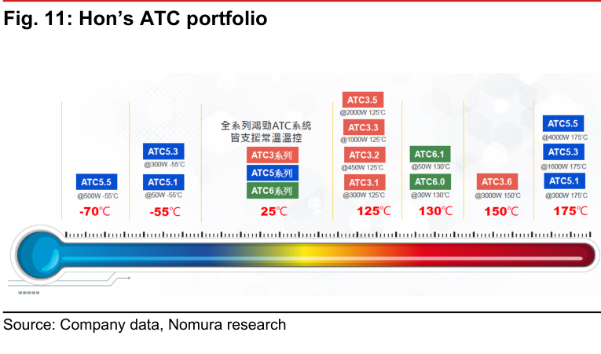

### 解讀摘要
Hon ATC 產品從 -70°C 到 175°C 覆蓋全溫區，功率從 50W（ATC2.X）到 4KW+（ATC5.X）。關鍵觀察：AI/HPC 客戶使用的 4KW+ 段（ATC5.X 三溫版）已是當前旗艦，而路線圖顯示 2027-28F 將推進至 10KW——每次客戶升規格等於重新採購新一代 ATC，ASP 大幅跳升。

### 表格

| 系列 | 溫區 | 功率 | 主要應用 |
|---|---|---|---|
| ATC2.X / ATC3.X | -70°C ~ 125°C（雙溫） | 50W ~ 4KW | FT 一般晶片 |
| ATC5.X | -70°C ~ 175°C（三溫）| 4KW+ | AI/HPC GPU/ASIC |
| ATC6.X / ATC7.X | 空冷系列 | - | 汽車/消費 |

---

## Fig. 12｜ATC 按應用分類

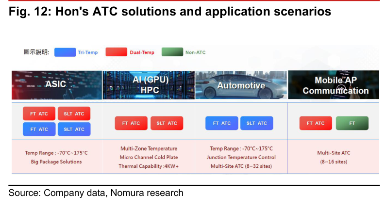

### 解讀摘要
AI/GPU HPC 應用的 ATC 需求最高規格（4KW+，需冷板），汽車晶片需求 8-32 sites（高平行度），Mobile AP 則是輕量版。AI/HPC 段的功率要求是汽車段的 5-10 倍，說明 AI/HPC 每台 ATC 的 ASP 遠高於其他應用——混合 mix 向 AI/HPC 移動對 Hon 整體 ASP 的拉升是非線性的。

### 表格

| 應用 | ATC 規格 | 特殊需求 |
|---|---|---|
| AI/HPC GPU | 4KW+（冷板式） | Cold plate 散熱 |
| Automotive | 8-32 sites | 高平行度多溫 |
| Mobile AP | 輕量版 | 標準雙溫 |
| ASIC | 依客戶規格 | 客製化溫控 |

---

## Fig. 13｜Handler 產品示意圖

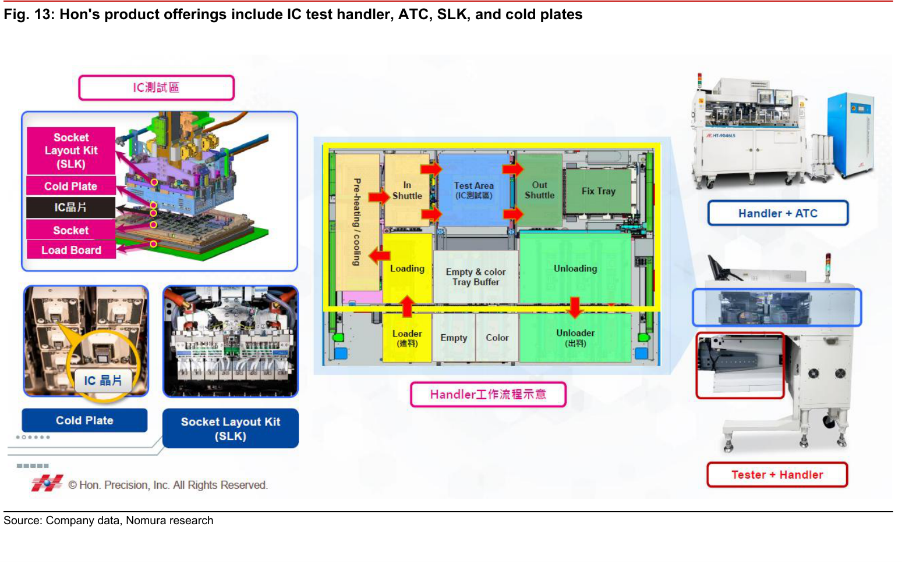

### 解讀摘要
Handler 系統由 SLK（structure）、Cold Plate、IC chip socket、Load Board 等組件構成，揭示 Hon handler 的「jigs & modules」消耗品屬性——Socket 和 Load Board 為耗材，需定期替換，形成高毛利的循環收入，這也解釋 Jigs & Modules 收入成長率（2026F +146% YoY）高於 Equipment sets（+80% YoY）的原因。

---

## Fig. 14｜營收結構 2024-2028F

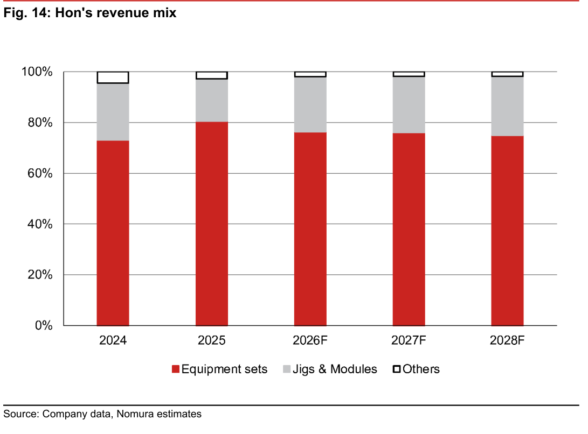

### 解讀摘要
Equipment sets 佔比 73-80%，Jigs & Modules 17-25%，Others 約 2%。J&M 佔比從 2024 年 22% 下滑至 2025 年 17%（設備出貨量暴增稀釋），預計 2026F 反彈至 22%——隨安裝基礎擴大，耗材收入將以更快速度複利增長，是中長期毛利率的支撐因素。

### 表格

| 項目 | 2024 | 2025 | 2026F | 2027F | 2028F |
|---|---|---|---|---|---|
| Equipment sets 佔比 | 73% | 80% | 76% | 76% | 75% |
| Jigs & Modules 佔比 | 22% | 17% | 22% | 22% | 23% |
| Others 佔比 | 5% | 3% | 2% | 2% | 2% |

---

## Fig. 15｜Cost per Yielded Die 與製程節點

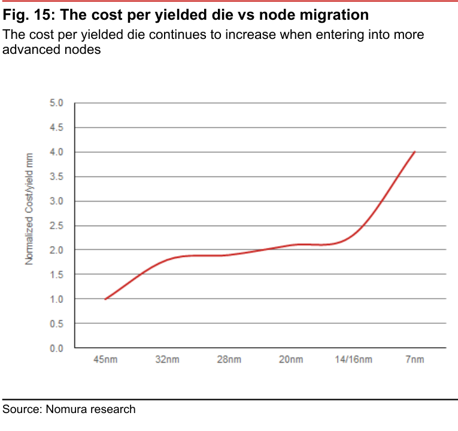

### 解讀摘要
晶片測試成本（cost per yielded die）從 45nm 的 1x 上升至 7nm 的約 4x，反映每個製程節點的良率壓力與測試複雜度同步增加。對 Hon 而言，這意味著每顆先進製程晶片的測試投入是過去的 4 倍——不僅時間拉長，還需要更精密（更貴）的 handler 與 ATC 配合。

### 表格

| 節點 | 相對 cost per die |
|---|---|
| 45nm | 1x（基準） |
| 28nm | ~1.5x |
| 16nm | ~2x |
| 7nm | ~4x |

> **洞察一**：TSMC N2/A16 量產後，cost per die 將進一步上行，且測試設備規格要求也同步提高，Hon handler 每代換機週期的 ASP 升幅有基本面依據。

---

## Fig. 16｜Chiplet vs SoC 成本比較

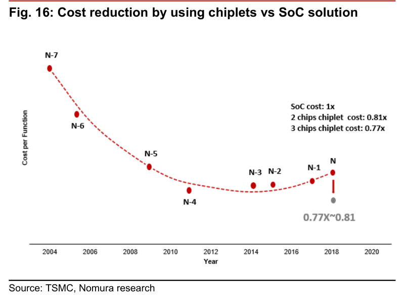

### 解讀摘要
2-chip Chiplet 成本僅 SoC 的 0.81x，3-chip 為 0.77x，說明 Chiplet 在製程成本上有優勢。但 Chiplet 每顆晶片需個別測試後才能整合，再整合後還需系統測試（SLT）——邊際測試步驟增加是 handler 需求多元化的直接驅動，而非簡單的「更多 Chiplet = 更多需求」，而是更多測試工序。

> **洞察一**：Chiplet 降低製程成本但提高測試步驟數，對 Hon 而言測試次數增加 2-3x，「成本下移至製程」的產業趨勢反而讓測試設備環節受益。

---

## Fig. 17｜晶片設計成本依製程節點

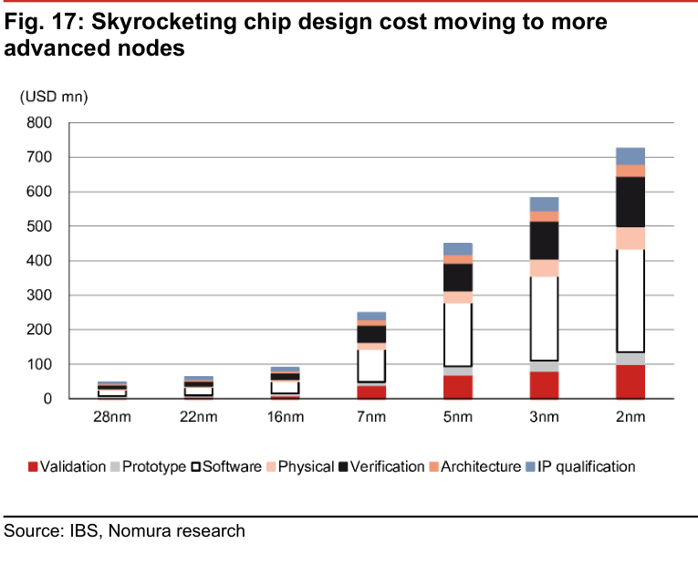

### 解讀摘要
晶片設計成本從 28nm 約 \$50mn 暴增至 2nm 約 \$730mn（約 15x）。設計成本越高，客戶對良率容忍度越低，必須更嚴格的測試來確保每顆晶片達標——這是 SLT 從可選到必需的結構性理由，也說明 AI/HPC 客戶不會因設備成本而縮減測試標準。

### 表格

| 節點 | 設計成本（估算） |
|---|---|
| 28nm | \~\$50mn |
| 16nm | \~\$100mn |
| 7nm | \~\$250mn |
| 5nm | \~\$450mn |
| 2nm | \~\$730mn |

---

## Fig. 18｜TSMC 運算效能路線圖

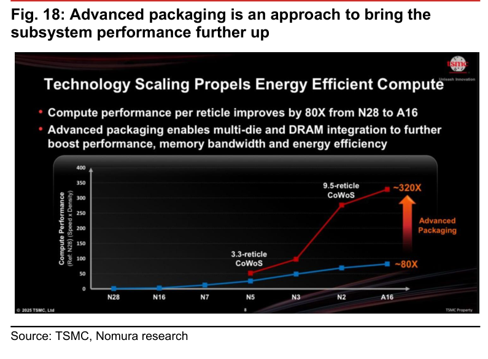

### 解讀摘要
TSMC N28→A16 路線圖顯示，die 效能提升 80x，CoWoS 效能提升 320x。CoWoS 效能提升速率遠高於單一 die，說明封裝整合層（interposer、HBM 整合）是未來效能提升的核心引擎——也是測試複雜度急增的根源，因為更大的 interposer 尺寸直接要求更大的 handler（大型封裝 handler 為 2027-28F 的換機週期驅動）。

---

## Fig. 19｜nVidia GPU 成本中的測試內容

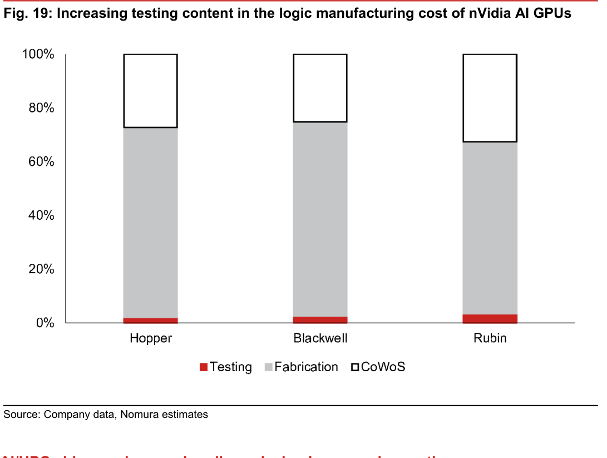

### 解讀摘要
展示 Hopper、Blackwell、Rubin 世代中，測試成本佔 GPU BOM 的比例，並顯示 CoWoS 測試內容隨世代增加。這是最直接的「AI GPU → 測試設備需求」鏈接數據：GPU 世代迭代速度快（2-3 年一代），且每一代都帶動測試設備規格同步升級採購。

> **洞察一**：nVidia Rubin GPU（2027F 預計）測試內容高於 Blackwell，若 Hon 已拿下 Rubin 測試線訂單（與 Blackwell 相同客戶），換機訂單時間點在 2026-27F，與 Nomura 的 2027F 收入加速預測吻合。

---

## Fig. 20｜TSMC CoWoS 路線圖（2025 Symposium）

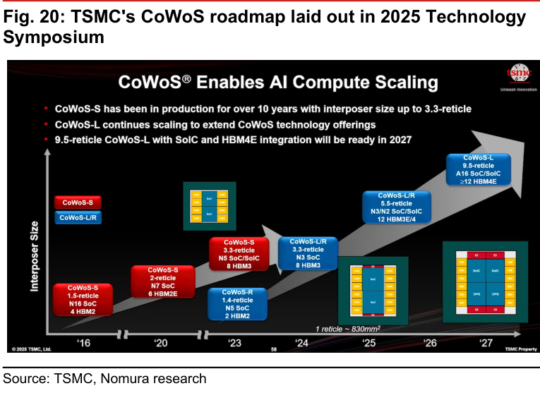

### 解讀摘要
TSMC 2025 Symposium 版路線圖：2025 CoWoS-R 到 5.5r/12HBM；2027 到 9.5r/12HBM4E；2028 到更大 reticle。路線圖的關鍵意義：每一代 reticle size 增大都對應更大的封裝面積 → 需要更大的 handler jig/socket → 推動 jigs & modules 換機訂單（高毛利耗材收入）。

---

## Fig. 21｜TSMC CoWoS 更新路線圖

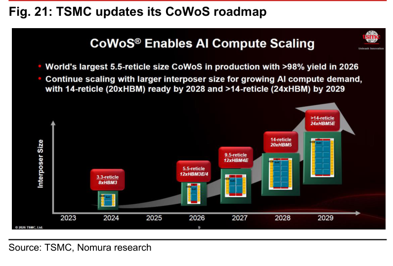

### 解讀摘要
比 Fig. 20 更新的版本（2026 資料）：2026 → 5.5r/12HBM；2028 → 14r/20HBM5；2029 → >14r。路線圖延伸至 2029 年，顯示 CoWoS 仍在快速演進，為 Hon handler 持續換機週期提供可見度。

> **洞察一（配合 Fig. 20）**：Fig. 21 比 Fig. 20 的路線圖更長且規格更激進（14r vs 9.5r 在 2028F），若以 Fig. 21 的較新版本為準，2028F+ 的 handler 換機需求更強。

---

## Fig. 22｜IC Matrix Tray

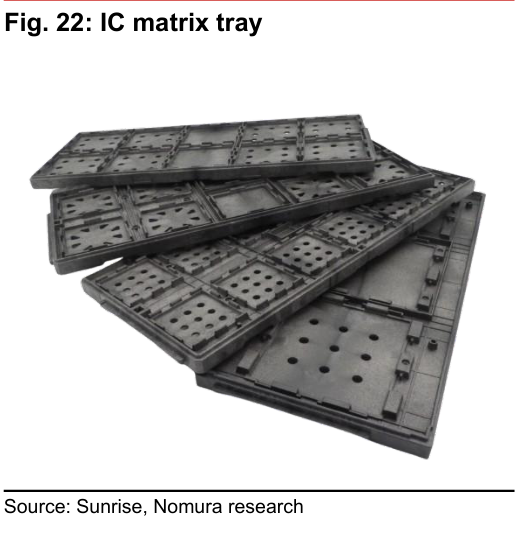

### 解讀摘要
標準 IC matrix tray（承載晶片的載具）照片，說明封裝尺寸的物理限制。JEDEC 正在更新 tray 標準（見 Fig. 23），舊 tray 無法容納新一代大尺寸封裝，是帶動 handler 換機的具體硬體原因之一。

---

## Fig. 23｜JEDEC 新 Tray 尺寸

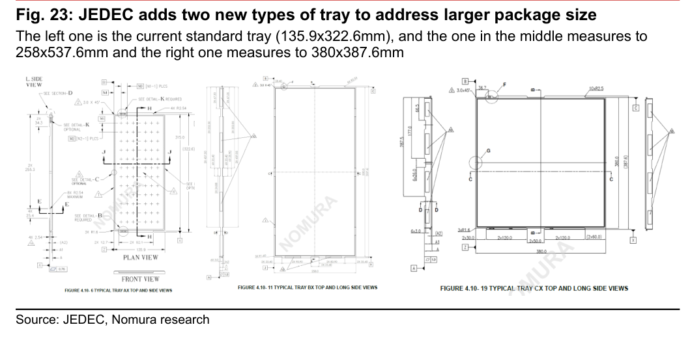

### 解讀摘要
JEDEC 標準尺寸從 135.9×322.6mm 擴大至 258×537.6mm（+~3x 面積）及 380×387.6mm。更大的 tray 標準需要全新的 handler 機械結構來承載，因此是 handler 換機週期的硬性觸發點——不升級 handler 就無法對應新尺寸封裝，AI/HPC 客戶別無選擇。

### 表格

| 規格 | 舊標準 | 新標準 A | 新標準 B |
|---|---|---|---|
| 尺寸（mm） | 135.9×322.6 | 258×537.6 | 380×387.6 |
| 相對面積 | 1x | ~3.2x | ~3.3x |

> **洞察一**：大尺寸 tray 標準化後，所有使用舊規格 handler 的 OSAT 都需換機，時程預估與 CoWoS reticle 擴大的換機週期（2027-28F）高度重疊。

---

## Fig. 24｜3.5D vs 2.5D 封裝比較

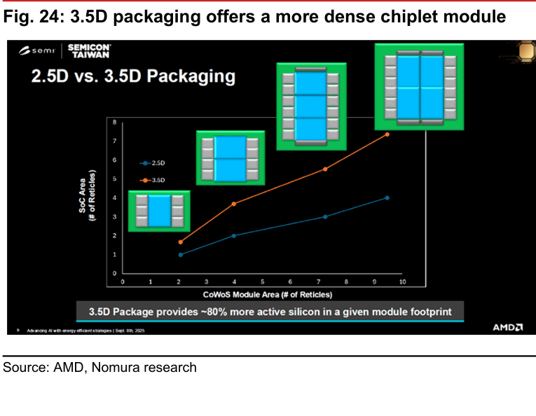

### 解讀摘要
AMD 展示 3.5D 封裝（face-to-face die stacking）vs 2.5D（face-to-back），3.5D 在相同 footprint 內可容納 ~80% 更多矽面積。3.5D 封裝的測試難度遠高於 2.5D——需要更精密的熱控（兩顆 die 疊加散熱路徑複雜），驅動更高功率 ATC 的採購需求。

---

## Fig. 25｜Broadcom Face-to-Face 3.5D

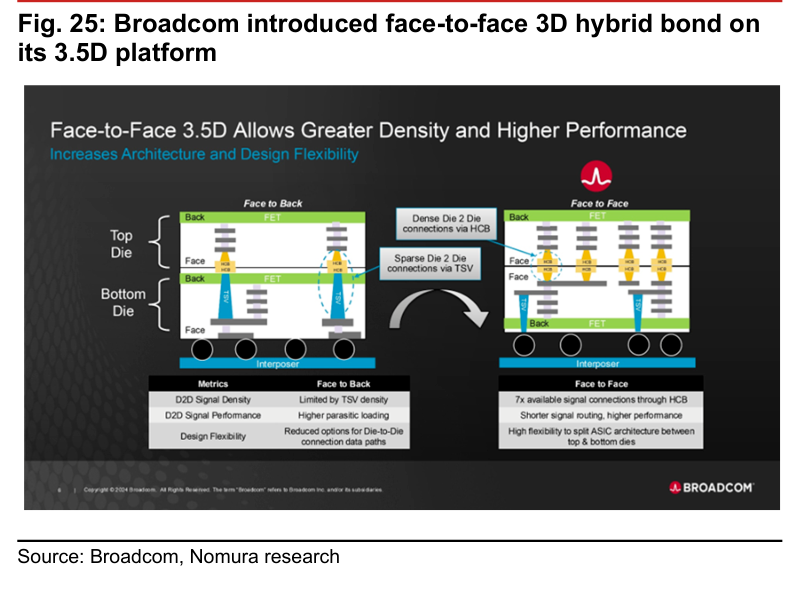

### 解讀摘要
Broadcom 3.5D 封裝透過 HCB（Hybrid Circuit Board）實現 7x 訊號連接密度（vs face-to-back）。3.5D 在測試上的挑戰：晶片積體度更高使得任何溫控偏差都會直接影響多顆 die，測試需要更精確的 ATC（更高規格、更貴），是 Hon ATC 路線圖往 10KW 升級的技術驅動之一。

---

## Fig. 26｜AMD MI455 封裝示意

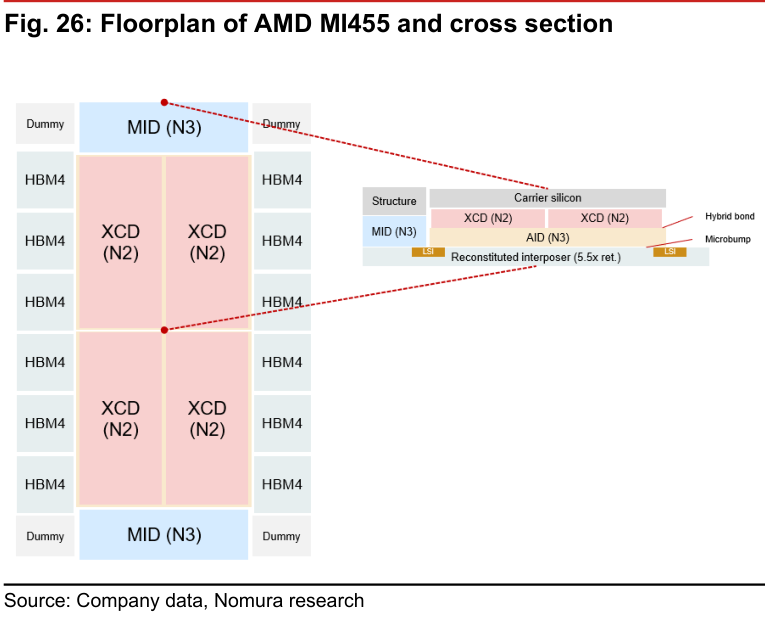

### 解讀摘要
AMD MI455（下一代 AI 加速器）採用 5.5r reconstituted interposer，整合 XCD（N2）+ MID（N3）+ HBM4 的複合封裝架構。更大的 interposer（5.5r）直接對應更大 handler 物理需求，且 N2/N3 混合封裝的測試規格（溫控精度、測試點密度）均比 MI300X 更嚴苛。

---

## Fig. 27｜nVidia Feynman GPU 示意

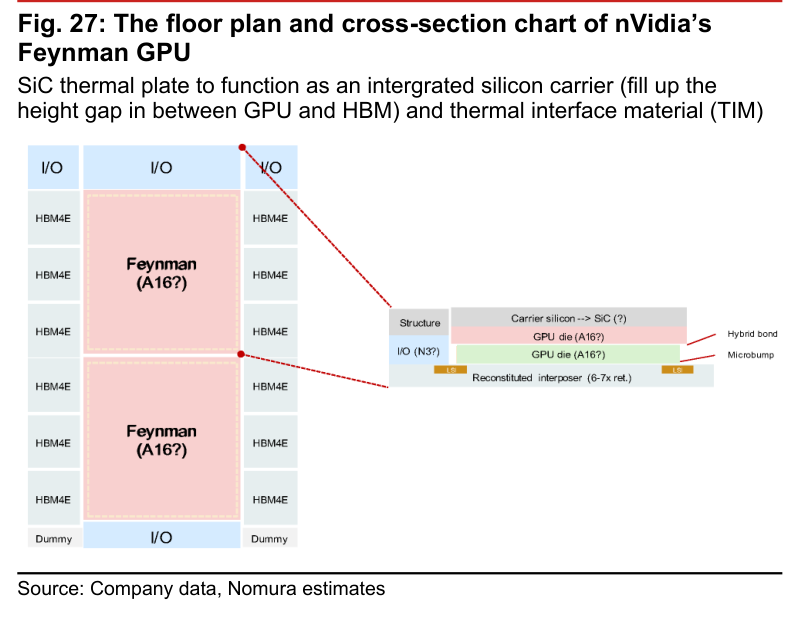

### 解讀摘要
nVidia 下一代 GPU Feynman（估 A16 製程，~6-7r interposer）採用 SiC 熱板填充間隙。SiC 熱板導入意味著封裝熱管理的複雜度再上一台階，需要與之匹配的高功率 ATC（估計 6KW+）才能有效測試——對 Hon ATC 路線圖的 3.7 系列（6KW，2026F）是直接需求訊號。

---

## Fig. 28｜Hon ATC 升級路線圖

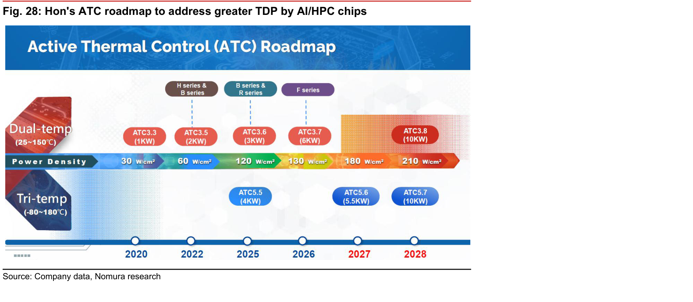

### 解讀摘要
最關鍵的 ASP 可見度圖：雙溫系列（ATC3.X）從 1KW→2KW→3KW→6KW→10KW（2027F 目標）；三溫系列（ATC5.X）從 4KW→5.5KW→10KW（2028F 目標）；功率密度推進至 210 W/cm²。每跳一個等級，ATC 單台 ASP 顯著上升，且客戶每代都需重新採購——這是 Hon ASP CAGR 的可見度基礎，比出貨量更可預測。

### 表格

| 系列 | 當前規格 | 2026F | 2027F | 2028F |
|---|---|---|---|---|
| ATC3.X（雙溫） | 3KW（3.6） | 6KW（3.7） | 10KW（3.8） | — |
| ATC5.X（三溫） | 5.5KW（5.6） | — | — | 10KW（5.7） |

> **洞察一**：ATC3.7（6KW，2026F）和 ATC3.8（10KW，2027F）是連續兩年的換機觸發點，假設 nVidia Blackwell 世代的 ATC 為 3KW（現行）、Rubin 為 6KW（2026F）、Feynman 為 10KW（2027F），則 Hon 每年都有大型 AI 客戶的換機訂單。

---

## Fig. 29｜Intel EMIB 路線圖

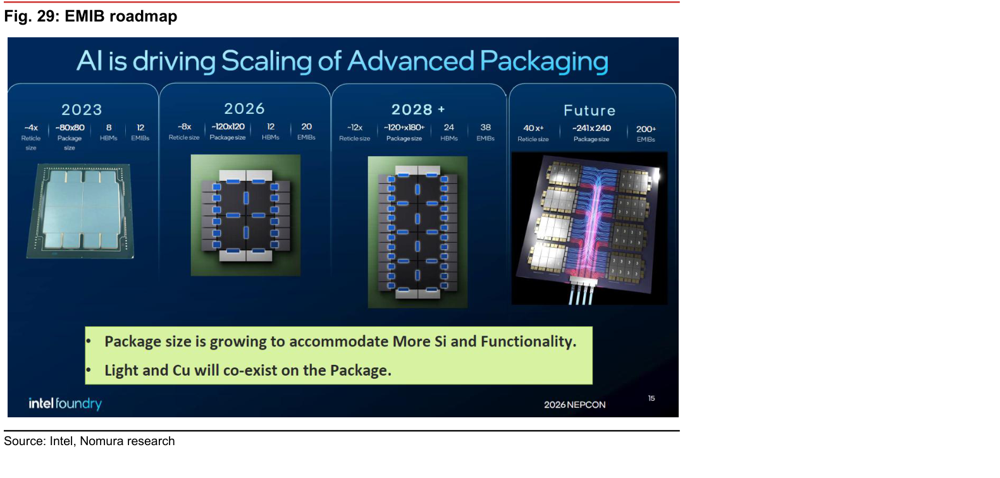

### 解讀摘要
Intel EMIB 路線圖：2023→ 4r/12EMIB；2026→ 8r/20EMIB；2028+→ 12r/38EMIB；未來→ 40r+/200+EMIB。EMIB 與 CoWoS 路線圖的共同特徵是 reticle size 持續擴大，「Light and Cu will co-exist」的備註說明矽光子整合在路線圖中。對 Hon：Intel EMIB 測試同樣需要大型封裝 handler，美國設廠帶動的本地測試需求也包括 EMIB 平台。

---

## Fig. 30｜TSMC CoWoS 季產能

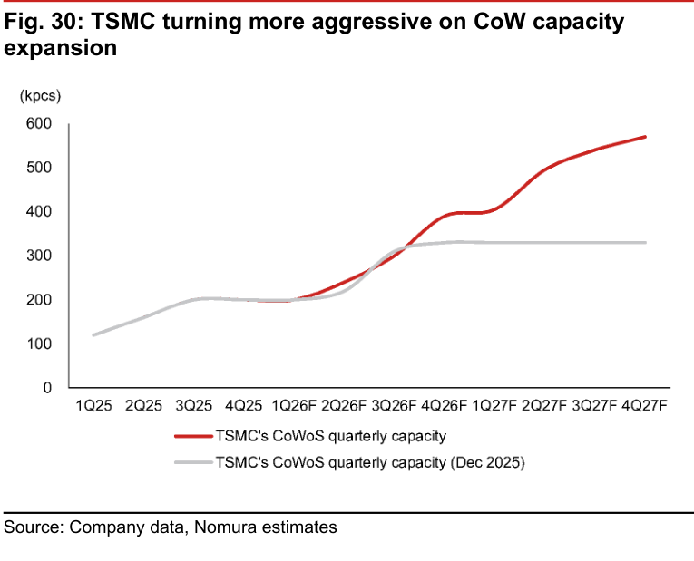

### 解讀摘要
TSMC CoWoS 季產能從 1Q25 ~120kpcs 大幅上修至 4Q27F ~560kpcs（+367% 在三年內），且 2025 年 12 月以來的預測顯著上修。CoWoS 產能快速擴張直接帶動下游 OSAT 測試設備採購需求——每個 CoWoS package 完成後都需要 FT/SLT 測試，測試產能需跟隨 CoWoS 產能成比例增加。

### 表格

| 時間點 | TSMC CoWoS 季產能（kpcs） |
|---|---|
| 1Q25 | ~120 |
| 4Q25 | ~200 |
| 4Q26F | ~350 |
| 4Q27F | ~560 |

> **洞察一**：4Q27F 產能是 1Q25 的 4.7x，對應 Hon handler 需求在同期的倍數擴張；Nomura 2026-28F 營收 CAGR 59% 與 CoWoS 產能 CAGR 67% 高度吻合，驗證假設合理性。

---

## Fig. 31｜CoWoS 供需平衡

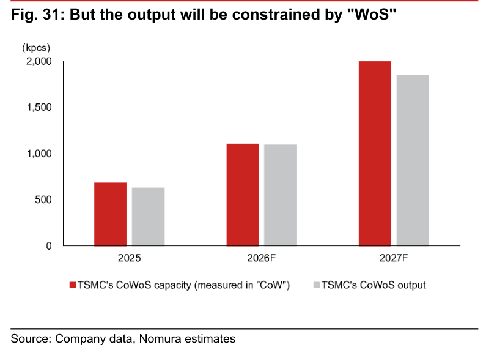

### 解讀摘要
CoWoS 受限於「WoS（Wafer on Substrate）」瓶頸，2025 供需（700kpcs capacity / 640kpcs output），2026F（1,100/1,100），2027F（2,000/1,850）。2026F 供需趨於平衡，2027F 仍有 ~8% 缺口，說明測試設備需求持續（產能不怕沒事幹），但高峰期的緊張情緒有所緩和。

### 表格

| 年份 | 產能（kpcs） | 實際/預估出貨 | 利用率 |
|---|---|---|---|
| 2025 | 700 | 640 | 91% |
| 2026F | 1,100 | 1,100 | 100% |
| 2027F | 2,000 | 1,850 | 93% |

---

## Fig. 32｜CoWoS 按客戶出貨量

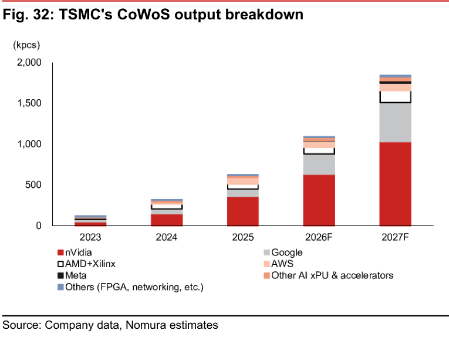

### 解讀摘要
CoWoS 出貨量按客戶分拆：nVidia 從 2023 年 ~40% 佔比擴大至 2027F ~56%；Google 維持 15-25%；AMD 佔比下滑。nVidia 的主導地位說明 Hon handler 對 nVidia 供應鏈（TSMC CoWoS → OSAT 測試）的曝險最大，2027F nVidia Rubin 換機週期是最強的單一催化劑。

---

## Fig. 33｜CoWoS 按客戶佔比

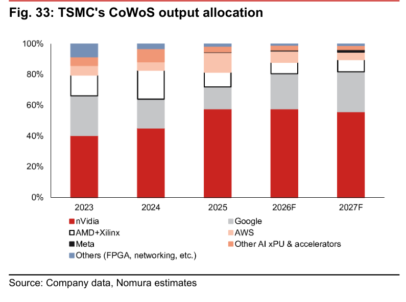

### 解讀摘要
與 Fig. 32 相同數據以百分比呈現，更清晰地顯示 nVidia 佔比持續爬升、AMD 佔比壓縮的趨勢。從 Hon 角度，nVidia 集中度上升意味著 Hon 對 nVidia 換機週期更為敏感，若 Rubin 延後（如 CoWoS 6-7r delay 風險）將直接衝擊 2027F 訂單。

> **值得驗證**：nVidia Rubin（2027F）若延後一個季度，Hon 2027F EPS 估計下修幅度為何？若 nVidia 佔 Hon 訂單 ~40%+，延後一季度影響可能達 10% 以上。

---

## Fig. 34｜大型 Interposer 推動 FOPLP 轉移

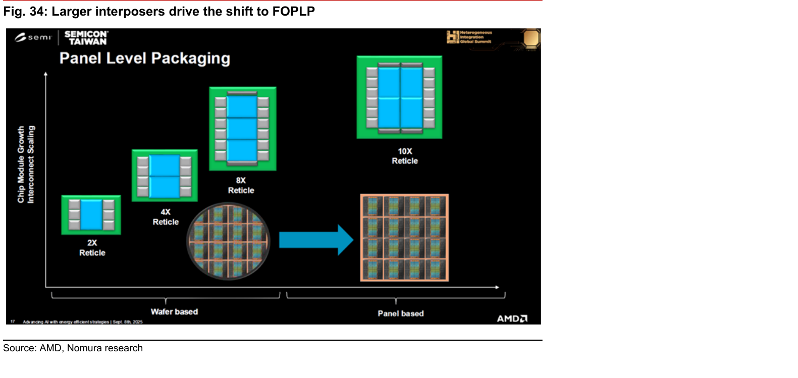

### 解讀摘要
AMD 展示：wafer-level 封裝在超過 ~10x reticle 尺寸後成本超過 panel-level，驅動 FOPLP 轉移。FOPLP（面板級扇出）對 handler 的影響：面板尺寸遠大於晶圓，需要全新型態的 handler，Hon 是否已針對 FOPLP 開發對應產品是中長期的技術驗證點。

---

## Fig. 35｜CoWoP 架構

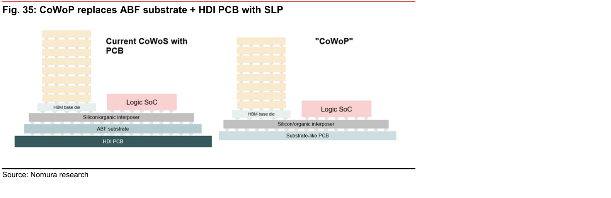

### 解讀摘要
CoWoP（Chip on Wafer on Panel）以 substrate-like PCB 取代傳統 ABF 基板 + HDI PCB，進一步降低封裝高度與成本。新型封裝結構意味著 FT/SLT handler 需配合 PCB 介面重新設計 socket/load board——消耗品換新週期將提前，推動 Jigs & Modules 業績超預期。

---

## Fig. 36｜2.5D 先進封裝解決方案比較

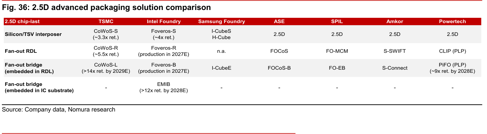

### 解讀摘要
列出 TSMC CoWoS-S/R/L、Intel Foveros-S/R/B、Samsung I-CubeS/E，以及 OSAT 的 FOCoS、FO-MCM、S-SWIFT、CLIP 等解決方案。多元化的封裝路線意味著 handler 需要更高適應性（不同封裝尺寸、不同介面標準）——這反而強化 Hon 的壁壘，因為新進者難以快速跨越多平台的 socket/jig 開發能力。

---

## Fig. 37｜主要 CoW 計畫（OSATs）

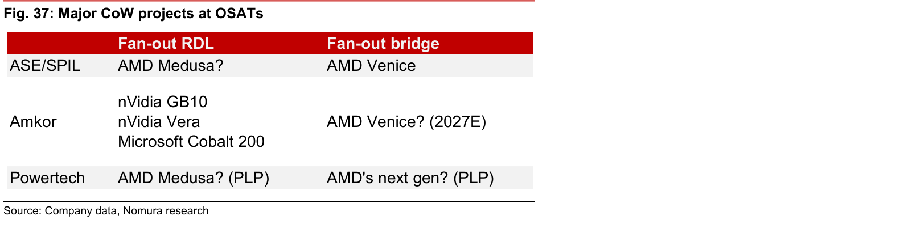

### 解讀摘要
ASE 承接 AMD Venice（2026F 量產）、Amkor 承接 nVidia GB10/Vera/MS Cobalt 200 等，OSAT CoW 計畫進入密集落地期。每個新 CoW 計畫落地都是一批新測試設備採購訂單，ASE、Amkor 是 Hon 的最大客戶之一，這些計畫的時程表即是 Hon 訂單的前瞻指標。

---

## Fig. 38｜AI OSAT 資本支出趨勢

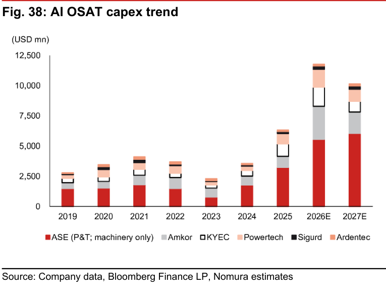

### 解讀摘要
AI OSAT 資本支出：2025 \$6.2bn → 2026E \$11.5bn（+85% YoY）→ 2027E \$10bn（小幅回落），ASE 佔比最大。OSAT capex 大幅擴張是 Hon handler/ATC 訂單的直接來源；2026E 的 \$11.5bn 為歷史最高，雖然 2027E 略回落，整體仍遠高於過去水平，構成多年訂單基礎。

### 表格

| 年份 | AI OSAT capex（\$bn） | YoY |
|---|---|---|
| 2025 | 6.2 | — |
| 2026E | 11.5 | +85% |
| 2027E | 10.0 | -13% |

> **洞察一**：2027E OSAT capex 小幅回落但仍高達 \$10bn，對 Hon 而言仍是極強的訂單環境；下行風險在於回落幅度超預期（如 nVidia 需求出現意外），但 \$10bn 水位仍為歷史第二高。

---

## Fig. 39｜全球測試設備支出

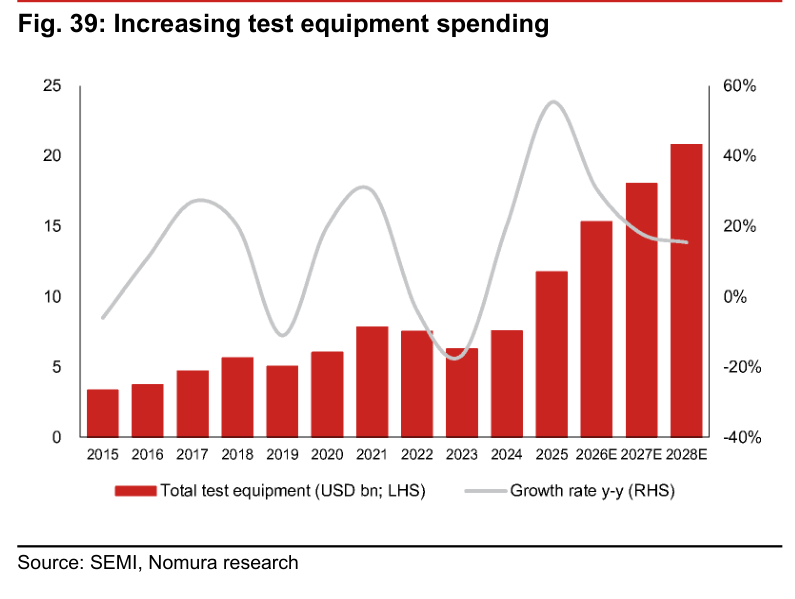

### 解讀摘要
全球測試設備支出從 2015 \$3.2bn 擴張至 2025 \$11.8bn（+54% YoY），並預測 2028E 達 \$21bn。Hon 在此 TAM 中以 handler/ATC 為主力，而非 ATE（Advantest/Teradyne 主導）；Hon 的 handler 市場滲透率從一個遠更小的 sub-market 起步，現在 TAM 擴張速度高於任何歷史時期。

### 表格

| 年份 | 全球測試設備支出（\$bn） | YoY |
|---|---|---|
| 2015 | 3.2 | — |
| 2020 | ~5 | — |
| 2024 | ~7.7 | — |
| 2025 | 11.8 | +54% |
| 2028E | 21.0 | — |

---

## Fig. 40｜Hon 設備收入 vs Advantest SoC ATE TAM

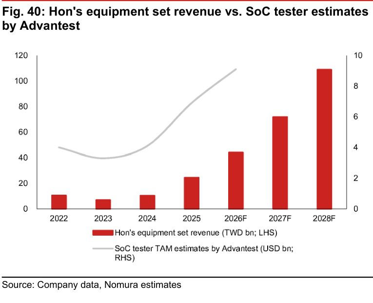

### 解讀摘要
Hon 設備收入從 2022 TWD 10bn 增至 2028F TWD 109bn（+10x），與 Advantest SoC ATE TAM（2022 \$4bn → 2027E \$9.2bn，+2.3x）相比，成長速度快約 4-5x。這反映了 handler/ATC 比 ATE 更直接受益於封裝規格升級——ATE 更換週期長（5-10 年），handler 更換週期短（2-3 年，每代新 GPU 觸發）。

### 表格

| 指標 | 2022 | 2028F/E |
|---|---|---|
| Hon 設備收入（TWD bn） | 10 | 109 |
| Advantest SoC ATE TAM（\$bn） | 4 | 9.2（2027E） |

> **洞察一**：Hon 設備收入 CAGR（2022-28F ~49%）遠高於 ATE TAM CAGR（~15%），說明 handler 市場比整體測試設備市場更受益於封裝升級週期，市佔滲透提升是次要驅動。

---

## Fig. 41｜Hon 設備收入 vs Teradyne SoC ATE TAM

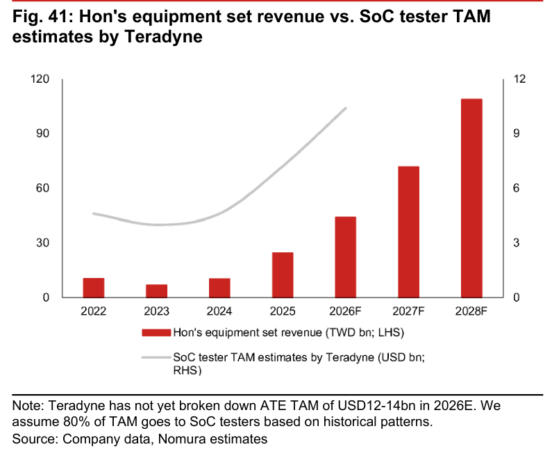

### 解讀摘要
與 Fig. 40 類似但對比 Teradyne TAM：Teradyne SoC ATE TAM 2022 \$5.5bn → 2026E \$10bn（假設 80% 為 SoC），成長 ~1.8x，Hon 設備收入同期成長 ~10x，再次確認 handler 的超高彈性。

---

## Fig. 42｜WMCM vs InFO-PoP（Apple）

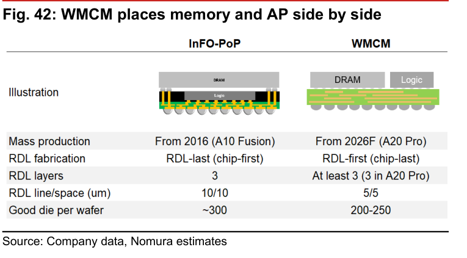

### 解讀摘要
Apple A20 Pro（2026F 預計）導入 WMCM（Wafer-Mounted Chip Module）取代 InFO-PoP，RDL-first、chip-last 架構，5/5μm L/S，DRAM 與 Logic 側並排。WMCM 的 die 排列比 InFO-PoP 更複雜，測試時需同時覆蓋 DRAM + Logic 的互動，驅動 Mobile AP 段的 SLT 需求，是 Hon Mobile AP 業務潛在上行的具體技術根據。

---

## Fig. 43｜Apple M5 Pro/Max SoIC-MH

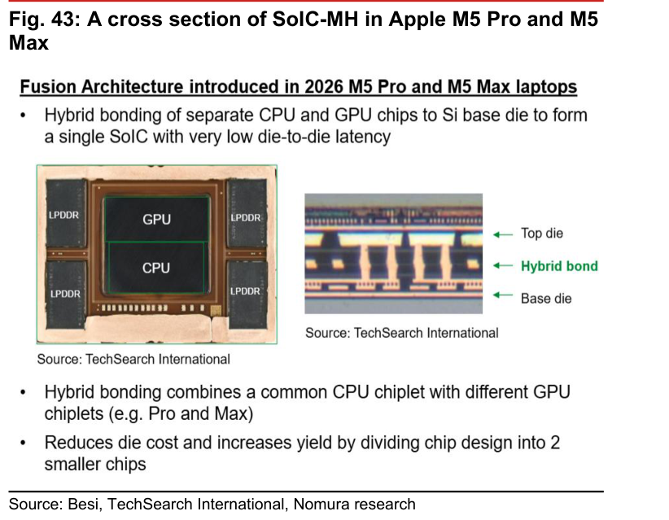

### 解讀摘要
Apple M5 Pro/Max 採用 SoIC-MH（hybrid bond），CPU+GPU die 疊加在 Si base die 上，實現同類 CPU chiplet 配不同 GPU chiplet 的彈性組合。Hybrid bond 堆疊後的測試（FT）需精確的溫控以確保各 die 介面良率——是 Hon ATC 在 Mobile/CPU 段的結構性機會，不僅限於 AI/HPC。

---

## Fig. 44｜MediaTek I/O Chiplet 架構

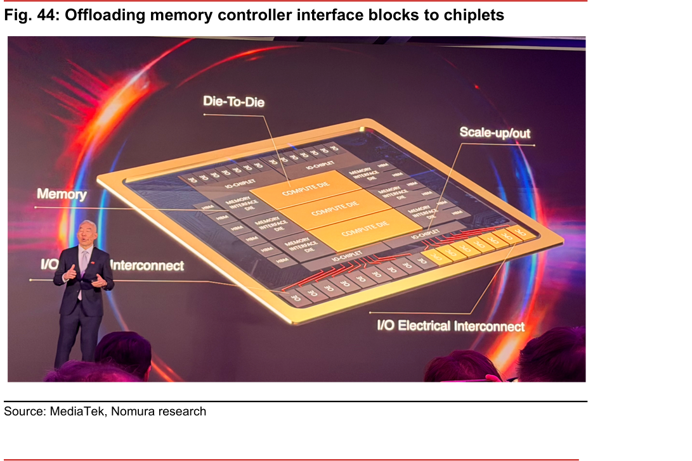

### 解讀摘要
MediaTek 將記憶體控制器 offload 至 I/O chiplet，主 compute die 只負責運算。多 chiplet 架構使 FT 階段測試項目增加（compute die + I/O die 各需測試，再整合測），Hon 的 handler 需求因此不限於 GPU 客戶，聯發科等 Mobile AP 客戶若全面採用 chiplet 也會帶動換機需求。

---

## Fig. 45｜CPU 版圖總覽

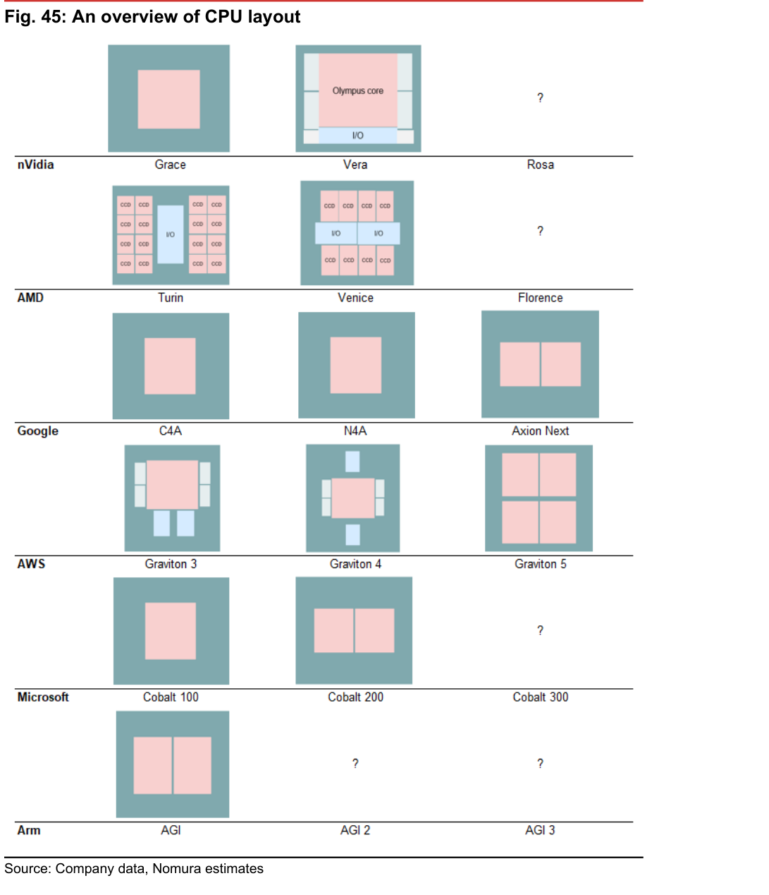

### 解讀摘要
列出 nVidia（Grace/Vera/Rosa）、AMD（Turin/Venice/Florence）、Google（C4A/N4A/Axion）、AWS（Graviton 3/4/5）、Microsoft（Cobalt 100/200/300）、Arm（AGI/2/3）六條 CPU 路線。CPU 段是 Hon 的增量市場（目前 AI/HPC/ASIC 佔 78%，CPU 尚未充分滲透）；每條路線的新一代 CPU 都採用先進封裝（CoW/SoIC），均是 Hon 潛在客戶。

---

## Fig. 46｜Hon NPI 狀態（按應用與客戶地點）

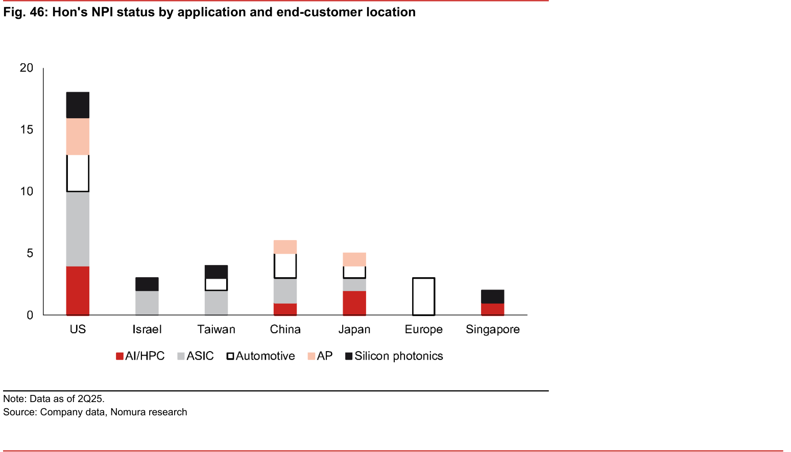

### 解讀摘要
美國 18 個 NPI 在進行中（AI/HPC、ASIC、Automotive、AP、Silicon photonics），以色列 3 個，中國 6 個，日本 5 個，其他地區若干。NPI 數量是最早期的訂單先行指標——每個 NPI 若轉量產，對應後續 2-3 年的 handler 採購。美國 18 個 NPI 是支持 Hon 美國業務擴張論點的具體數據。

### 表格

| 地點 | NPI 數量 |
|---|---|
| 美國 | 18 |
| 以色列 | 3 |
| 中國 | 6 |
| 日本 | 5 |
| 台灣 | 4 |
| 其他（歐洲/東南亞） | ~5 |

---

## Fig. 47｜全球主要 Tester/Handler 廠商比較

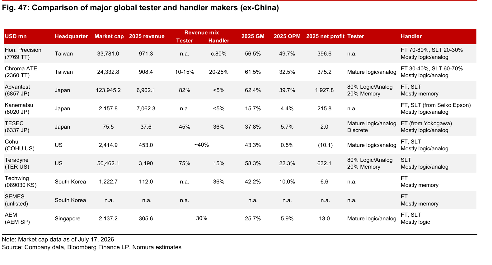

### 解讀摘要
非中國廠商中，Hon 市值 \$33.8bn、2025 營收 \$971mn、GM 56.5%、OPM 49.7%，優於 Chroma（市值 \$24.3bn，以 ATE 為主），遠高於 Advantest（\$123.9bn，ATE 龍頭）的 OPM。Hon 的 OPM 49.7% 是 handler 廠商中全球最高，反映 AI/HPC 客戶的定價能力與稀缺性溢價。

### 表格

| 公司 | 市值（\$bn） | 2025 Rev（\$mn） | GM | OPM |
|---|---|---|---|---|
| Hon. Precision（7769） | 33.8 | 971 | 56.5% | 49.7% |
| Chroma（8016） | 24.3 | — | — | — |
| Advantest | 123.9 | — | — | — |
| Teradyne | 50.5 | — | — | — |

---

## Fig. 48｜TSMC 投資美國亞利桑那州

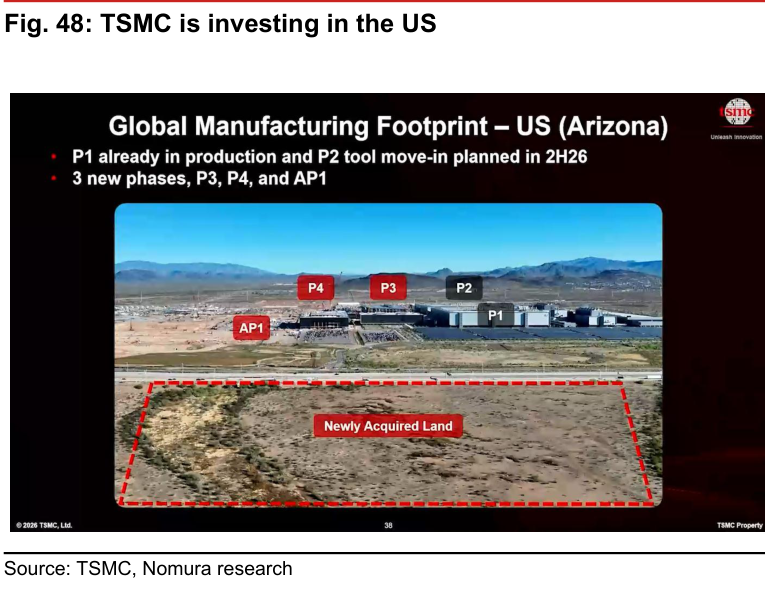

### 解讀摘要
TSMC Arizona：P1 已量產，P2 工具移入 2H26，P3/P4/AP1 規劃中，且已新購土地。TSMC 美國先進製程量產帶動的後段 OSAT 在地化是 Hon 美國業務的中期機會——美國本地化測試設備採購是必然趨勢（供應鏈在地化政策），Hon 的先行 NPI 投入具先發優勢。

---

## Fig. 49｜Amkor 美國後段封裝廠

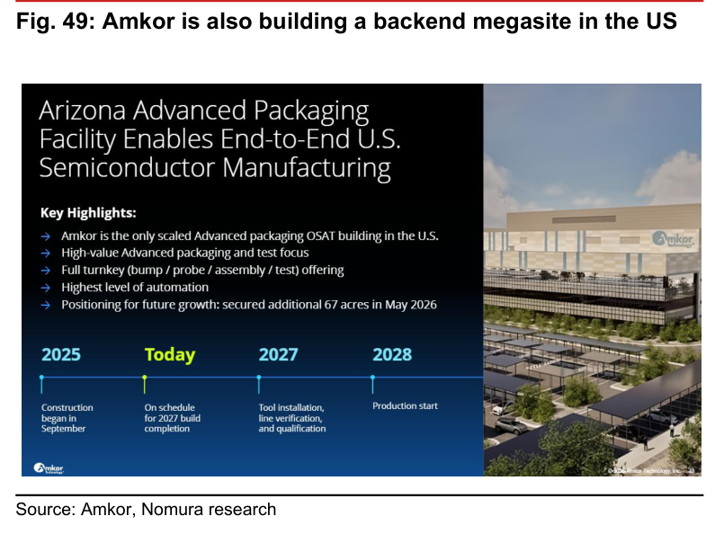

### 解讀摘要
Amkor Arizona AAPF（Advanced Packaging Facility）：施工 2025 年啟動，竣工 2027 年，量產 2028 年，近期再追加 67 英畝。Amkor 是 Hon 的重要客戶，AAPF 量產啟動（2028F）將是 Hon 最大的單一美國訂單潛在觸發點，時程與 Hon 2028F 營收高峰吻合。

---

## Fig. 50｜Hon 全球布局地圖

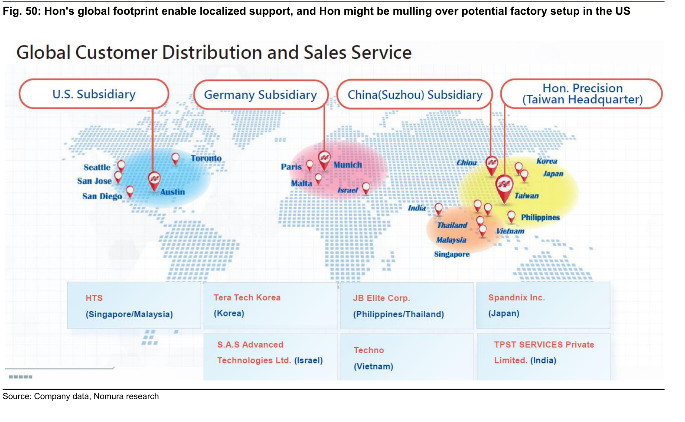

### 解讀摘要
Hon 在全球的四大直屬子公司：美國（Seattle/San Jose/San Diego/Austin/Toronto）、德國（Munich）、中國（蘇州）、台灣總部（台中）；另有韓國（Tera Tech）、馬來西亞/新加坡（HTS）、以色列（S.A.S）、越南（Techno）、印度（TPST）等代理伙伴。地理覆蓋範圍的廣度是支持美國 18 個 NPI 論點的基礎設施條件。

---

## Fig. 51｜Hon vs 中國本土競爭者比較

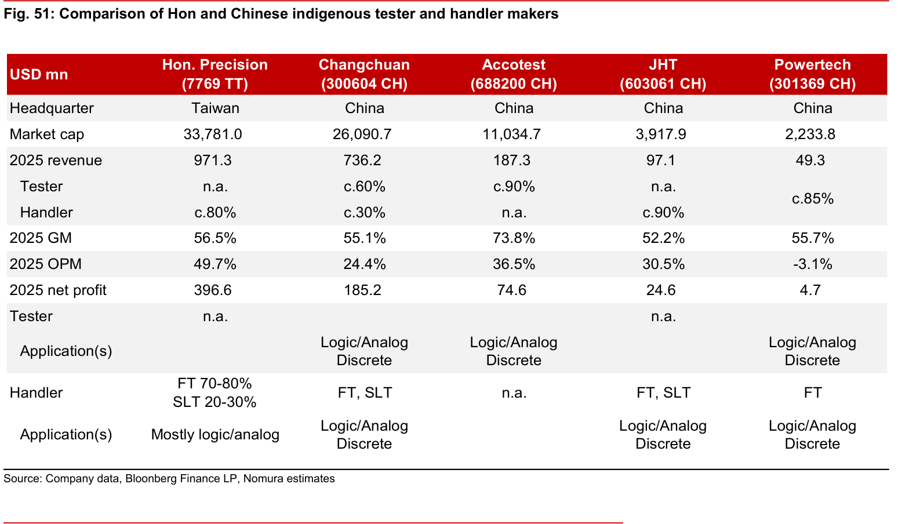

### 解讀摘要
最直接的競爭格局比較：Hon OPM 49.7% vs Changchuan 24.4%（差距 25ppt）、Accotest 36.5%、JHT 30.5%、Powertech -3.1%（虧損）。OPM 差距反映 Hon 的 AI/HPC 定價能力與產品壁壘，中國競爭者主要服務 Logic/Analog/Discrete 的非 AI 應用（毛利較低），短期難以攻入 AI/HPC 高端市場。

### 表格

| 公司 | 市值（\$mn） | 2025 Rev（\$mn） | GM | OPM |
|---|---|---|---|---|
| Hon（7769） | 33,781 | 971 | 56.5% | 49.7% |
| Changchuan（300604） | 26,091 | 736 | 55.1% | 24.4% |
| Accotest（688200） | 11,035 | 187 | 73.8% | 36.5% |
| JHT（603061） | 3,918 | 97 | 52.2% | 30.5% |
| Powertech（301369） | 2,234 | 49 | 55.7% | -3.1% |

> **洞察一**：Changchuan 毛利率（55.1%）接近 Hon（56.5%），但 OPM 差距達 25ppt（24.4% vs 49.7%），說明 Changchuan 的 OpEx 結構（R&D、SG&A）遠比 Hon 低效，難以支撐同等規模的技術投入，這是產品路線圖落後的間接指標。

---

## Fig. 52｜中國 OSAT 資本支出趨勢

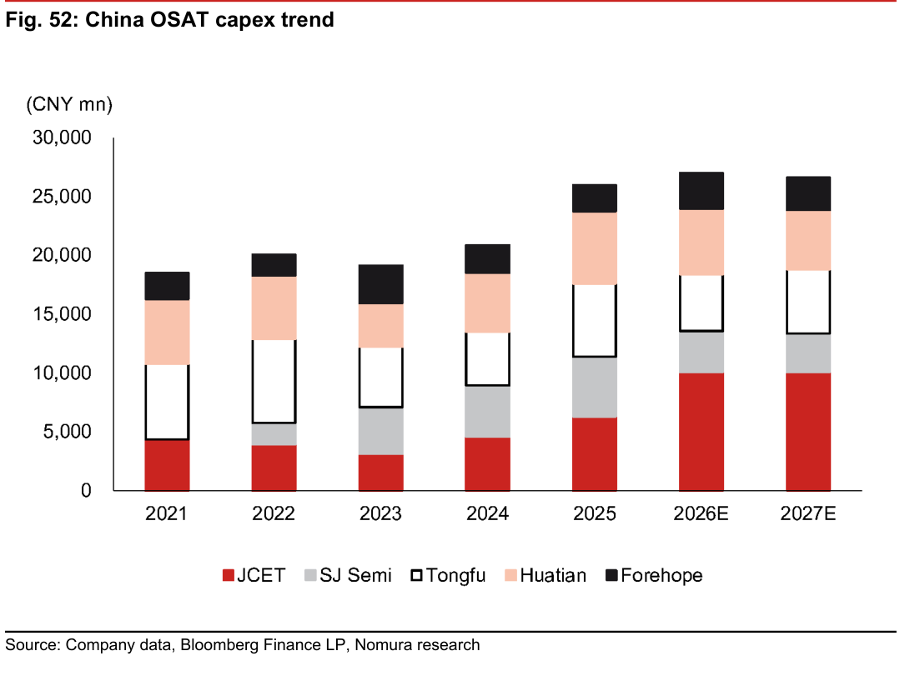

### 解讀摘要
中國主要 OSAT（JCET、SJ Semi、Tongfu、Huatian、Forehope）合計 capex 從 2021 ~CNY18.5bn 增至 2025 ~CNY26bn，2026-27E 維持在 CNY26-27bn 高原。中國 OSAT capex 穩定但不再快速擴張，且中國 OSAT 傾向採購中國本土 handler（Changchuan），對 Hon 的直接貢獻有限；Hon 的成長驅動仍以台灣/美國/韓國 OSAT 為主。

### 表格

| 年份 | 中國 OSAT capex（CNY bn） |
|---|---|
| 2021 | ~18.5 |
| 2024 | ~20.5 |
| 2025 | ~26 |
| 2026-27E | ~26-27（持平） |

---

## Fig. 53｜CPO Insertion 流程

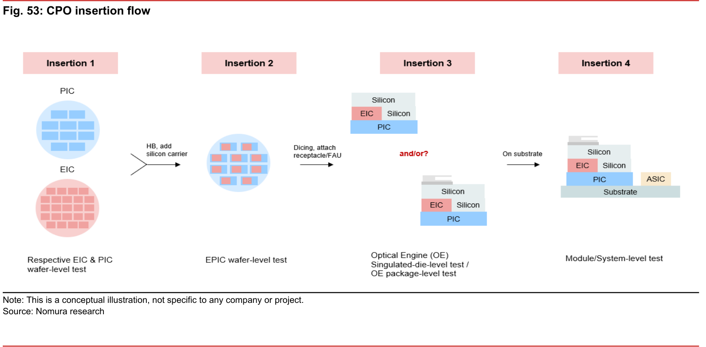

### 解讀摘要
CPO 測試分四個 Insertion：Insertion 1（PIC/EIC 晶圓級別測試，Foundry）→ Insertion 2（EPIC wafer test，HB 後，Foundry）→ Insertion 3（Optical Engine 晶片測試，OSAT）→ Insertion 4（Module/System 測試，OSAT）。Hon 在 Insertion 1-3 缺席（NA），Insertion 4 是 Hon 的切入點——Module 級別的 O/E 轉換測試需要 ATE Tester + ATC 3KW handler，ASP 最高。

---

## Fig. 54｜CPO Insertion 流程與潛在供應商

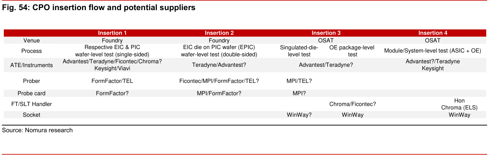

### 解讀摘要
各 Insertion 的設備供應商細分：Insertion 4 的 FT/SLT handler 由 Hon + Chroma（ELS）承接，Socket 由 WinWay。Hon 在 Insertion 4 已有明確客戶正在 Joint Development——雖然量產在 2027F+，Joint Development 階段的訂單已確保 Hon 不會被其他 handler 廠商取代。

### 表格

| Insertion | 場地 | 測試類型 | Handler | ATE |
|---|---|---|---|---|
| 1 | Foundry | PIC/EIC 晶圓 | 無 | Advantest/Tera./Ficontec |
| 2 | Foundry | EPIC 晶圓 | 無 | Teradyne/Advantest |
| 3 | OSAT | OE 晶片/封裝 | Chroma/Ficontec | Advantest/Teradyne |
| 4 | OSAT | ASIC+OE 模組 | **Hon + Chroma（ELS）** | Advantest/Teradyne |

---

## Fig. 55｜Hon 在 CPO 測試中的角色

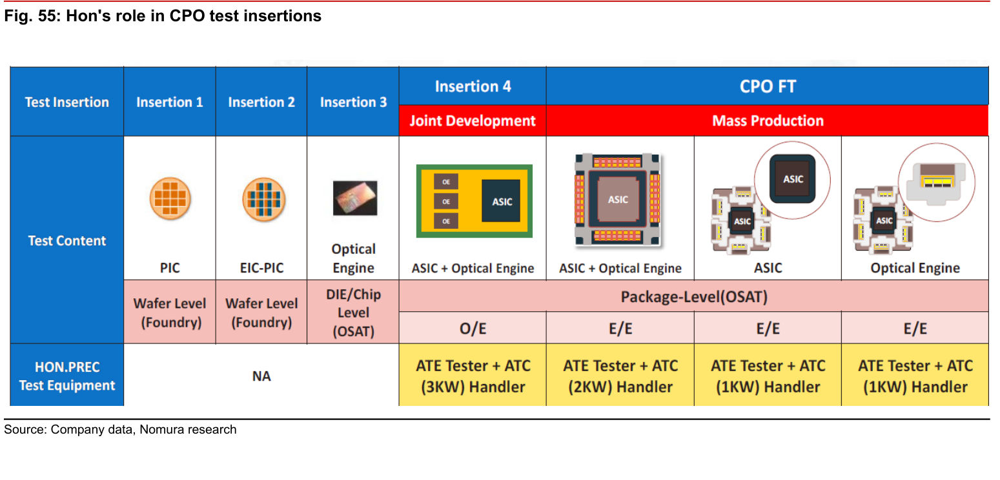

### 解讀摘要
最清晰地呈現 Hon 的 CPO 機會矩陣：Insertion 1-3 對 Hon 均為 NA，Insertion 4（Joint Development）需 ATE Tester + ATC 3KW handler；CPO FT 量產後需 1-2KW ATC handler（ASIC 和 OE 分別測試各需 1KW）。Insertion 4 是 ASP 最高的入口，量產後的 CPO FT 是規模最大的持續性需求。

---

## Fig. 56｜CPO FT vs CPO Test Insertion 4 比較

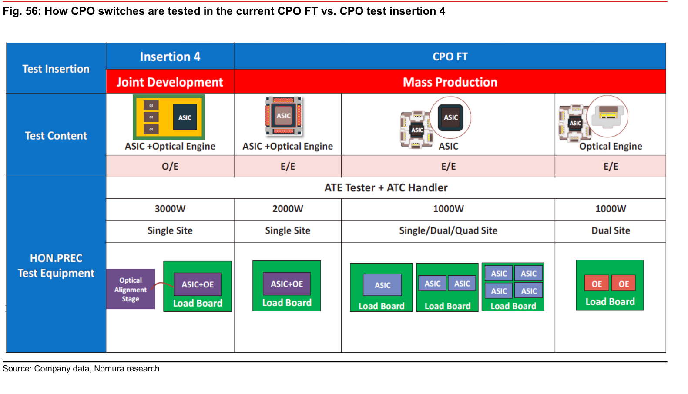

### 解讀摘要
Insertion 4（Joint Dev）：3KW 單站，ASIC+OE 一起測（O/E 轉換測試），含 Optical Alignment Stage；CPO FT 量產：2KW 單站→1KW 多站（最多 quad site），ASIC 和 OE 分開測（E/E 測試）。量產後 handler 功率需求下降（3KW→1KW）但站數增加（single→quad），整體設備採購金額維持高水位。

---

## Fig. 57｜MCL（微流道蓋）截面圖

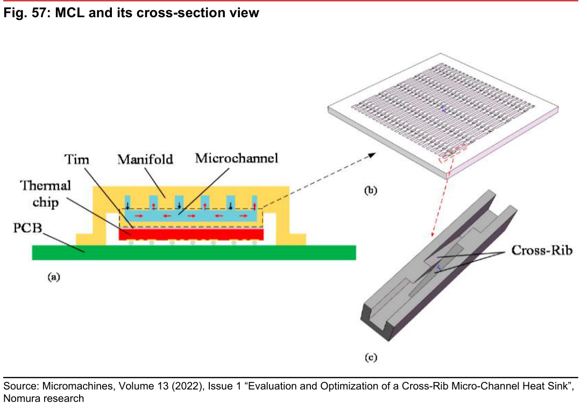

### 解讀摘要
MCL（Micro-Channel Lid）的結構：Tim（熱介面材料）+ Manifold（分流器）+ Microchannel（微流道），搭配 Cross-Rib 微流道結構提高湍流強度以增強換熱。MCL 在測試時需要精確控制進出水溫與流量，專用 MCL handler 是 Hon 的新平台機會——已有先進 AI GPU 客戶（估計 nVidia）對應採用 MCL，帶動 2026-27F 新產品線收入。

---

## Fig. 58｜Hon 營收趨勢 2024-2028F

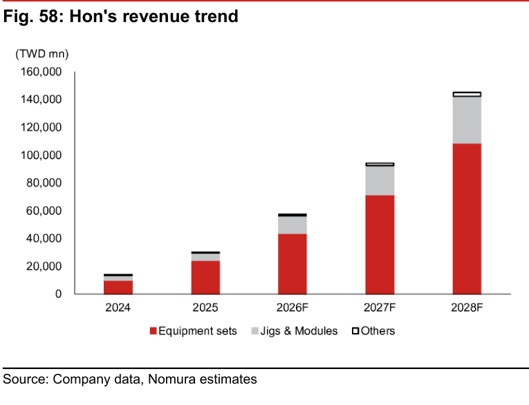

### 解讀摘要
Equipment sets 從 2024 TWD 10.2bn 跳升至 2028F TWD 108.8bn（+10.6x）；Jigs & Modules 從 3.1bn 至 33.6bn（+10.7x）；總收入從 14bn 至 145bn。兩個業務線幾乎同步增長，說明 J&M 消耗品確實隨安裝基礎成比例擴大，非只是一次性設備換機。

### 表格

| 項目（TWD mn） | 2024 | 2025 | 2026F | 2027F | 2028F |
|---|---|---|---|---|---|
| Equipment sets | 10,226 | 24,371 | 43,869 | 71,682 | 108,810 |
| Jigs & Modules | 3,147 | 5,050 | 12,419 | 20,821 | 33,571 |
| Others | 619 | 850 | 1,118 | 1,792 | 2,720 |
| **Total** | **13,992** | **30,271** | **57,406** | **94,295** | **145,102** |

---

## Fig. 59｜Hon 淨利及 YoY 成長

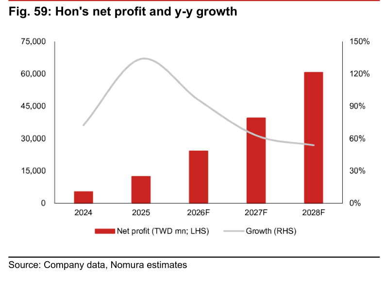

### 解讀摘要
淨利從 2024 ~TWD 5bn → 2025 ~13bn（+130%）→ 2026F ~20bn（+90%）→ 2027F ~35bn（+60%）→ 2028F ~60bn（+55%）。成長率逐年放緩屬於大數效應，但絕對增量持續擴大（每年淨利增量 ~10-20bn TWD），支撐 40x 目標倍數的盈餘持續性。

### 表格

| 年份 | 淨利（TWD mn 估算） | YoY |
|---|---|---|
| 2024 | ~5,000 | ~70% |
| 2025 | ~13,000 | ~130% |
| 2026F | ~20,000 | ~90% |
| 2027F | ~35,000 | ~60% |
| 2028F | ~60,000 | ~55% |

---

## Fig. 61｜Hon 分業務收入明細

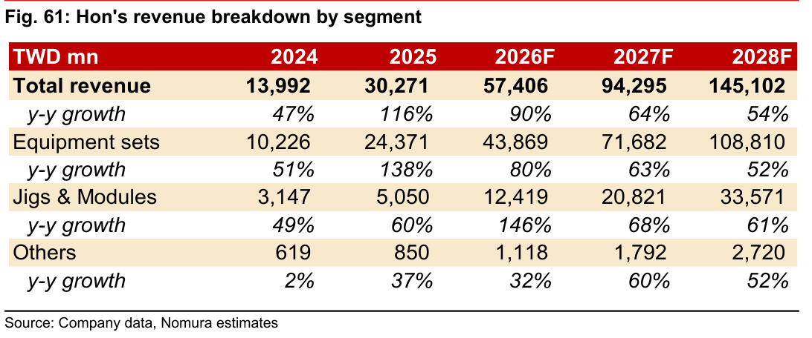

### 解讀摘要
與 Fig. 58 的視覺化圖對應的精確數字版本。2026F Jigs & Modules 成長率（+146% YoY）遠高於 Equipment sets（+80%），說明 J&M 的消耗品複利效應開始顯現：2025 大規模出貨建立安裝基礎，2026F 開始收取高毛利耗材收入，毛利率因此有支撐。

### 表格

| 項目（TWD mn） | 2024 | 2025 | 2026F | 2027F | 2028F |
|---|---|---|---|---|---|
| 總收入 | 13,992 | 30,271 | 57,406 | 94,295 | 145,102 |
| 　Equipment sets | 10,226 | 24,371 | 43,869 | 71,682 | 108,810 |
| 　Jigs & Modules | 3,147 | 5,050 | 12,419 | 20,821 | 33,571 |
| 　Others | 619 | 850 | 1,118 | 1,792 | 2,720 |
| YoY 成長 | 47% | 116% | 90% | 64% | 54% |

> **洞察一**：J&M 2026F +146% vs Equipment +80%——安裝基礎擴張後，消耗品增速超過設備本身，顯示 Hon 的「刀片 + 刀片耗材」商業模式正在成熟化。

---

## Fig. 66｜Hon 股價 vs Bloomberg 共識 EPS 修正

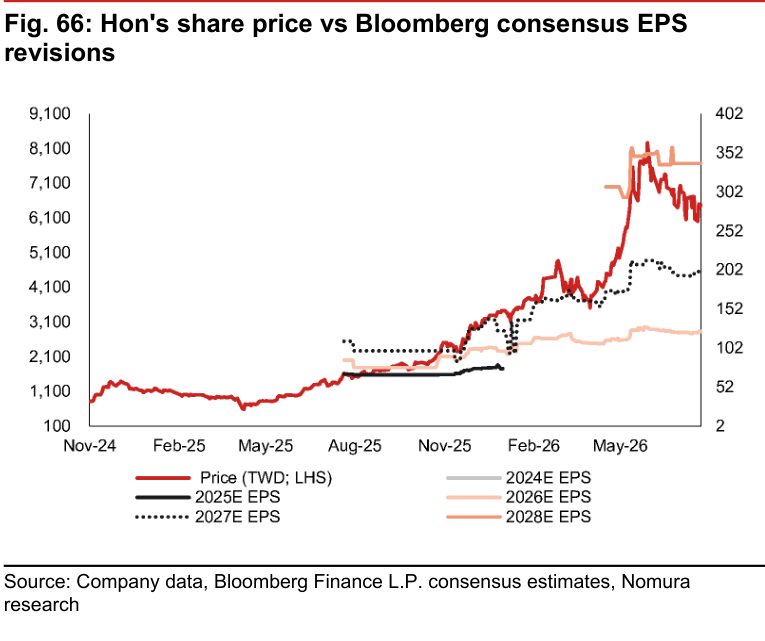

### 解讀摘要
Hon 股價從 Nov-24 上市時 ~TWD 800 漲至 2026 年 5 月高峰約 TWD 8,000（~10x），股價走勢高度追蹤共識 EPS 修正（尤其是 2027E EPS 從 ~TWD52 上修至 ~TWD200）。現價 ~TWD 6,500 已明顯低於 5 月高峰，而 2027-28E EPS 共識維持在高位，Nomura 的論點即為股價反應過度，現在是以折價買入的時機。

> **洞察一**：股價從 8,000 回落至 6,500（-19%）期間，2027E EPS 共識仍維持 ~TWD200，意味著本益比從 ~40x 壓縮至 ~32x，市場在宏觀/CPO 擔憂下給予折價，但盈利趨勢並無惡化，為 Nomura 的 Buy 論點提供支撐。

---

## Fig. 67｜Hon 股價 vs 月營收

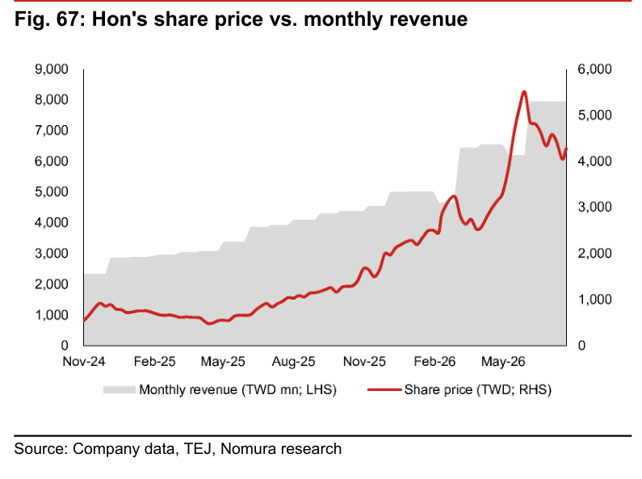

### 解讀摘要
月營收（左軸）從 Nov-24 約 TWD 2.3bn 持續成長至 2026 年 7 月約 TWD 6.5bn（+183%），股價（右軸）走勢大致追蹤月營收但在高峰後出現背離（月營收仍在成長但股價已回落）。這個背離說明市場已對近期好數字定價，轉而 focus 前瞻性的 CPO 進度與宏觀環境，而非即時營收數字。

---

## Fig. 68｜Hon 股價 vs 事件

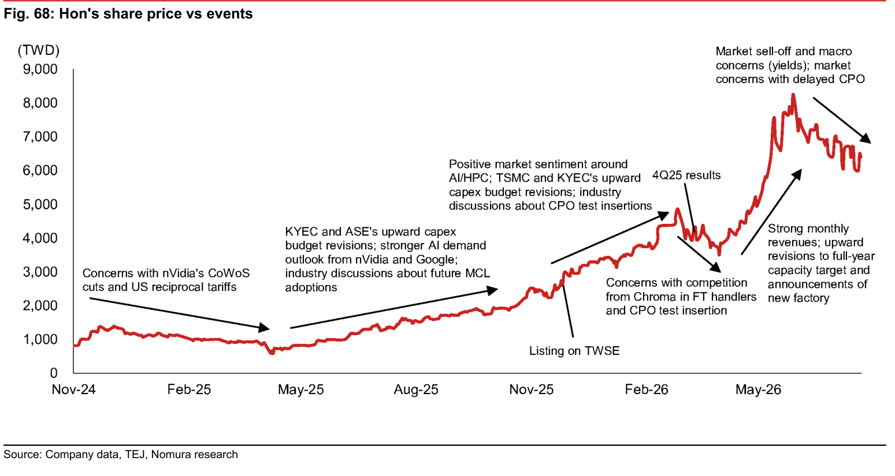

### 解讀摘要
最完整的股價路徑解釋圖：上市初期受 nVidia CoWoS 削減與美國關稅拖累 → KYEC/ASE capex 上修 + AI 需求改善帶動起漲 → TSMC capex/MCL 討論 + CPO insertion 消息進一步推升 → Chroma 競爭擔憂 + 4Q25 財報後修正 → 強勁月營收 + 新廠公告帶動再漲至高峰 → 宏觀賣壓 + CPO 延遲擔憂下拉。目前所在位置（7 月下旬）為「宏觀+CPO 擔憂期」，Nomura 認為此為進場點。

---

## Fig. 69｜Hon 設備產品線

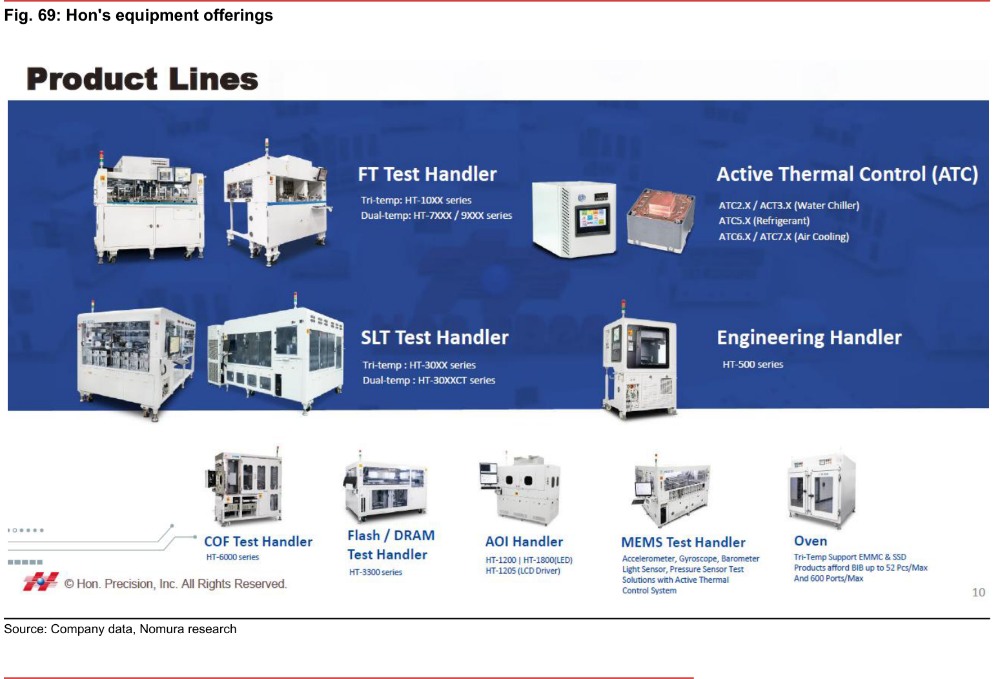

### 解讀摘要
Hon 完整產品線：FT Handler（HT-10XX 三溫；HT-7XXX/9XXX 雙溫）、SLT Handler（HT-30XX 三溫；HT-30XXCT 雙溫）、ATC（ATC2/3 水冷；ATC5 冷媒；ATC6/7 空冷）、Engineering Handler（HT-500）、COF Handler（HT-6000）、Flash/DRAM Handler（HT-3300）、AOI Handler（HT-1200/1800/1205）、MEMS Handler、Oven。產品廣度說明 Hon 不只是 AI/HPC handler 廠，整個後段測試鏈都有布局，未來滲透率提升機會多元。

---

## Fig. 70｜Hon 工具訂單 Mix（按應用）

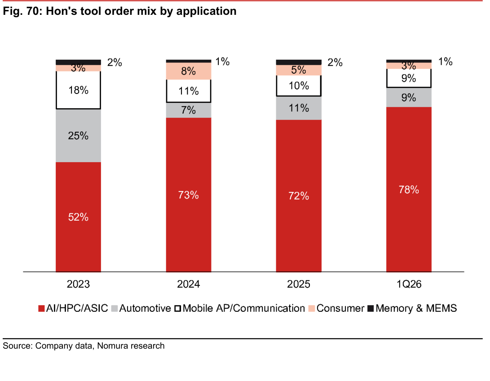

### 解讀摘要
AI/HPC/ASIC 佔比從 2023 年 52% 急升至 1Q26 年的 78%，Automotive 從 25% 降至 9%，Mobile AP 從 18% 降至 9%，其他應用均萎縮。AI/HPC 的快速主導化讓 Hon 的客戶集中度上升（優先順序問題），同時也使非 AI 應用形成潛在反彈空間——若 AI/HPC 需求意外走弱，Mobile AP 的復甦（WMCM 換機週期）可能提供部分緩衝。

### 表格

| 應用 | 2023 | 2024 | 2025 | 1Q26 |
|---|---|---|---|---|
| AI/HPC/ASIC | 52% | 73% | 72% | 78% |
| Automotive | 25% | 7% | 11% | 9% |
| Mobile AP/通訊 | 18% | 11% | 10% | 9% |
| Consumer | 3% | 8% | 5% | 3% |
| Memory & MEMS | 2% | 1% | 2% | 1% |

> **洞察一**：AI/HPC 集中度快速從 52%（2023）升至 78%（1Q26），意味著 Hon 對 AI 算力週期的暴露程度遠高於其他半導體設備廠；相應地，若 AI capex 出現意外下修，Hon 的缺乏多角化保護是最大的股價下行風險。

---

## Fig. 72｜Hon 公司里程碑

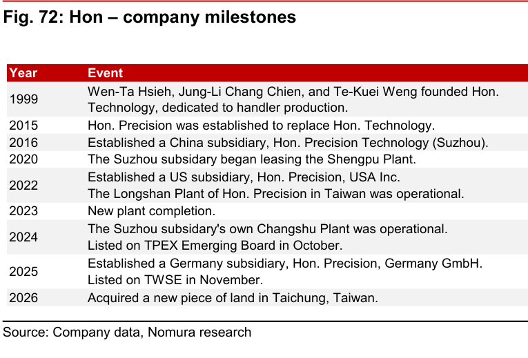

### 解讀摘要
Hon 從 1999 年由三位共同創辦人（謝文達、張建忠、翁德葵）成立 Hon. Technology 至今，27 年歷程：2015 改組為 Hon. Precision、2016 蘇州設廠、2022 成立美國子公司 + 龍山廠投產、2024 TPEX 掛牌、2025 成立德國子公司 + TWSE 上市、2026 台中新購土地。公司里程碑顯示國際化布局加速（2022-2026 年四年內增設美德中三個境外據點），為 US NPI 業務的基礎設施做準備。

### 表格

| 年份 | 事件 |
|---|---|
| 1999 | 創立 Hon. Technology（Handler 製造） |
| 2015 | 改組為 Hon. Precision |
| 2016 | 蘇州子公司成立 |
| 2020 | 蘇州盛浦廠租用 |
| 2022 | 美國子公司成立；龍山廠投產 |
| 2023 | 新廠完工 |
| 2024 | 蘇州常熟廠投產；TPEX 掛牌 |
| 2025 | 德國子公司成立；TWSE 上市 |
| 2026 | 台中新購土地 |

---

## Fig. 73｜Hon 廠房現況與規劃

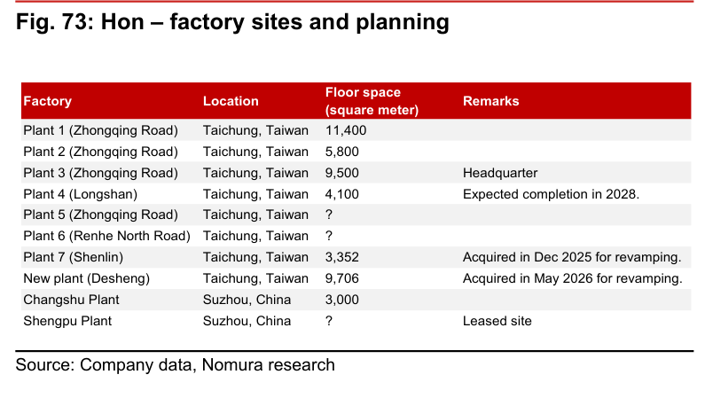

### 解讀摘要
台中 7 座廠房（含龍山廠 2028 完工）+ 新德盛廠（2026 年 5 月收購翻新中）+ 中國蘇州 2 址，總已知建坪達 ~43,352 sqm（不含未揭露尺寸的廠房）。廠房快速擴增（2025-26 年新增三址）是支撐管理層 40-50% 產能 CAGR 目標的硬體基礎；龍山廠（4,100 sqm）2028 年完工將是下一個可量化的產能里程碑。

### 表格

| 廠房 | 地點 | 建坪（sqm） | 備註 |
|---|---|---|---|
| Plant 1（忠慶） | 台中 | 11,400 | — |
| Plant 2（忠慶） | 台中 | 5,800 | — |
| Plant 3（忠慶） | 台中 | 9,500 | 總部 |
| Plant 4（龍山） | 台中 | 4,100 | 2028 完工 |
| Plant 5（忠慶） | 台中 | ? | — |
| Plant 6（仁和北路） | 台中 | ? | — |
| Plant 7（深林） | 台中 | 3,352 | 2025/12 收購翻新 |
| New Desheng | 台中 | 9,706 | 2026/5 收購翻新 |
| Changshu | 蘇州 | 3,000 | — |
| Shengpu | 蘇州 | ? | 租用 |

---

## Fig. 74｜董事會

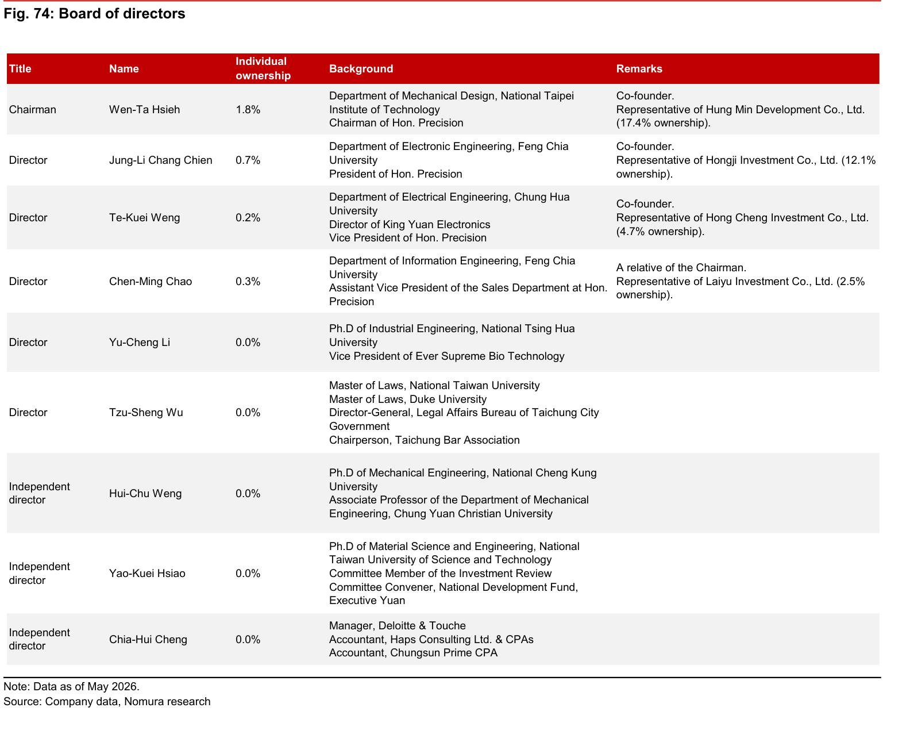

### 解讀摘要
三位共同創辦人（謝文達 Chairman、張建忠 President、翁德葵 VP）仍掌舵公司，合計直接持股 2.7%，透過投資控股公司（弘鏵、宏濟、宏晟）合計控制股權約 34.6%（見 Fig. 75）。管理階層穩定性高，創辦人仍第一線運作，為長線策略持續執行提供保障。

---

## Fig. 75｜股東結構

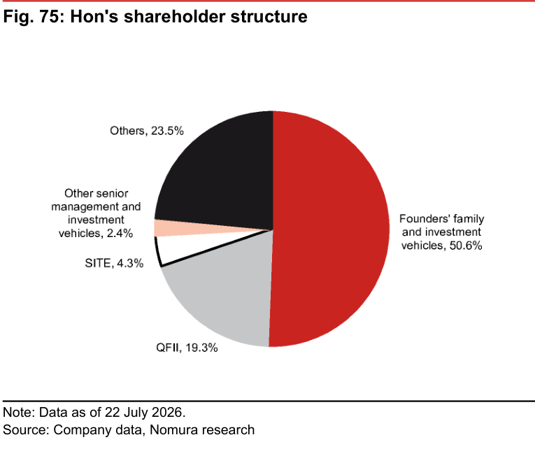

### 解讀摘要
創辦人家族及投資控股 50.6%（高度控股）、QFII 19.3%（外資持股已相當高）、SITE 4.3%、其他高管 2.4%、其餘散戶 23.5%（資料截至 2026 年 7 月 22 日）。高創辦人控股率有利於長期戰略執行，但 QFII 已達 ~20% 使新增外資購買力相對有限；進一步上漲需仰賴 SITE 或國內法人加碼。

### 表格

| 股東類別 | 持股比例 |
|---|---|
| 創辦人家族及投控 | 50.6% |
| QFII | 19.3% |
| SITE（外資自營） | 4.3% |
| 其他高管及投控 | 2.4% |
| 其他 | 23.5% |

---

## Fig. 76｜股價 vs SITE 及 QFII 持股

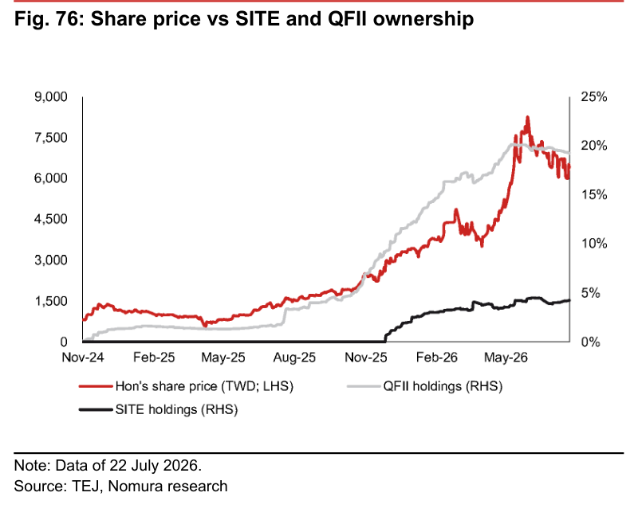

### 解讀摘要
QFII 持股從 Nov-24 上市時近 0% 快速爬升至 2026 年 7 月約 20%，SITE 持股從 0% 升至約 5%，股價同步從 ~TWD 1,000 升至峰值 ~7,800。QFII 在股價上漲過程中積極建倉，現在已達 ~20%，若達成 MSCI 持股比例約束（外資持股接近上限），邊際新增買盤空間收窄，為短期壓力因素之一。

---

## 跨 Exhibit 彙整表

### 彙整 1｜Hon 財務模型精要（Fig. 61 + Fig. 59）

| 指標（TWD mn） | 2024 | 2025 | 2026F | 2027F | 2028F |
|---|---|---|---|---|---|
| 總收入 | 13,992 | 30,271 | 57,406 | 94,295 | 145,102 |
| YoY | 47% | 116% | 90% | 64% | 54% |
| 淨利（估） | ~5,000 | ~13,000 | ~20,000 | ~35,000 | ~60,000 |
| EPS（TWD） | — | — | 134 | 219 | 336 |

> 從合表角度：2027F 淨利 ~35bn ÷ EPS NT\$219 = 約 1.6 億股流通股；2028F 淨利 ~60bn ÷ EPS NT\$336 = 同樣約 1.6-1.8 億股，稀釋壓力有限，EPS CAGR 接近淨利 CAGR。

### 彙整 2｜CoWoS 供需 vs Hon 設備需求（Fig. 30 + Fig. 31 + Fig. 40）

| 年份 | CoWoS 季產能（kpcs） | AI OSAT capex（\$bn） | Hon 設備收入（TWD bn） |
|---|---|---|---|
| 2024 | ~100 | ~4 | 10.2 |
| 2025 | ~170 | 6.2 | 24.4 |
| 2026F | ~280 | 11.5 | 43.9 |
| 2027F | ~490 | 10.0 | 71.7 |
| 2028F | ~560+ | — | 108.8 |

> 三個指標同步增長，相關性高；唯 2027F OSAT capex 小幅回落而 CoWoS 產能仍快速增加，說明既有測試線持續高利用率，新增設備訂單仍需增補，Hon 2027F 訂單不依賴 OSAT 持續加碼 capex 才能成立。

---

## 相關個股清單

| 類別 | 公司 | Ticker | 評等 | 備註 |
|---|---|---|---|---|
| 核心標的 | 鴻勁精密 | 7769 TT | Buy（首評） | 目標價 NT\$11,100；首次涵蓋 |
| ATE | Advantest | 6857 JP | 未涵蓋 | 全球 SoC ATE 龍頭；Hon handler 客戶 |
| ATE | Teradyne | TER US | 未涵蓋 | 美系 ATE；Hon 配套客戶 |
| Handler 競爭者 | Changchuan | 300604 CH | 未涵蓋 | 中國最大 handler 廠；主攻 Logic/Discrete |
| OSAT | ASE Technology | 3711 TT | 未涵蓋 | Hon 最大 OSAT 客戶之一 |
| OSAT | Amkor | AMKR US | 未涵蓋 | 美國 AAPF 2028F 啟動 |
| 先進封裝 | TSMC | 2330 TT | 未涵蓋 | CoWoS 產能驅動後段測試需求 |

> 公司：[[7769 鴻勁精密]]
