# Nomura｜MPI Corporation 旺矽科技 首評

**券商**：Nomura International (Hong Kong) Ltd., Taipei Branch (NITB)  
**分析師**：Aaron Jeng CFA、Vivian Yang、Eric Chen CFA（均為 NITB）  
**日期**：2026-07-24  
**主題**：Accelerating growth; initiate with Buy — In-house MEMS needle driving value; serving nearly all AI chip customers with low concentration risks; CPO is next catalyst  
**評級**：Buy（首評）　**目標價**：TWD 8,000（+33.3% upside）　**估值**：45x 平均 2027-28F EPS  
**EPS 預估**：2025=TWD33.49（實際）　2026F=TWD59.69　2027F=TWD128.12　2028F=TWD227.15  
<a href="https://layx.uk/dl?g=產業&b=Nomura&d=20260724&h=MPI-initiation">📎 下載 PDF</a>

---

## 報告總結

Nomura 首評旺矽科技（6223 TT），給予 Buy 評等，TP TWD8,000（+33%）。核心論點：MPI 自製 MEMS 探針具備技術護城河，正處全球 AI chip 測試需求爆發期，客戶高度分散（前五大各僅佔 5-15% 收入）抵禦集中風險，加上 CPO 測試 Insertion 2/3 進入早期放量；探針卡業務 2026-28F 收入 CAGR 91%，帶動 EPS CAGR 達 95%，估值 45x 平均 2027-28F EPS 略偏歷史高端（歷史區間 15-80x）但 CAGR 支撐。報告同步配套發布的 Anchor Report（Advanced Semi Testing，171 頁）詳述 CPO 測試生態系背景。

---

## Nomura 完整投資邏輯鏈

| 論點層次 | Exhibit | 內容 |
|---|---|---|
| 需求信號明確 | Fig. 6 | 探針卡出貨先於晶片量產 6-12 個月；2025 年底已開始接 ASIC 2H26 量產訂單 |
| 技術壁壘難以複製 | Fig. 5 | AI/HPC 晶片 pitch 100μm 正落入 MEMS 必須區；自製 MEMS 探針是轉型入場券 |
| 供給緊繃 + 議價提升 | Fig. 3 | 探針卡 CAGR 91%，已享受 FormFactor 溢出訂單；供需偏緊下議價能力提升 |
| 客戶分散降低風險 | Fig. 7, Fig. 24 | 前五大客戶各 5-15%；覆蓋幾乎所有 AI chip 客戶 |
| CPO 新增量 | Fig. 1, Fig. 2 | Insertion 2/3 探針卡機會；2H27F 初步貢獻；HON 僅在 Insertion 4 |
| 盈利加速 | Fig. 13, Fig. 14 | OPM 18%（2023）→41%（2028F）；EPS 95% CAGR，operating leverage 顯著 |
| **結論** | 封面 | **TP TWD8,000 = 45x avg 2027-28F EPS，Buy首評** |

> **報告最大邏輯缺口**：CPO Insertion 2/3 仍在業界定義測試流程的早期，最終廠商選擇未定；Nomura 的 2H27F 貢獻預估建立在技術路徑確認的假設上，若晶圓廠主導整合（如 TSMC COUPE 平台），MPI 的 CPO 機會可能延後。

---

## 報告核心觀點

| 主題 | Nomura 觀點 | 市場共識 | 是否 Contra-Consensus |
|---|---|---|---|
| 探針卡收入 CAGR | 91%（2026-28F） | — | 否（共識 2026F 銷售額略高 +7%，但方向相同） |
| EPS CAGR | 95%（2026-28F） | 55%（2023-25F 歷史節奏） | 是：加速幅度超過多數預期 |
| CPO 貢獻時序 | 2H27F 初步，2028F 個位數 | 部分共識預期 2026F 開始 | Nomura 偏保守：認為大量需等 2027F |
| Nomura vs 共識估計 | 2026-28F NMR 收入低於 BBG 各 7-8%；OPerating profit 低 13-15% | BBG 共識偏高 | Nomura 相對保守的模型（下行保護） |
| 估值合理性 | 45x 2027-28F avg EPS 在歷史高端但被 CAGR 支撐 | 歷史中樞 30x | Contra：給出高於歷史的估值 |

**偏好排序**：MPI 是 Nomura 在台灣 testing interface 鏈的首選，同步涵蓋 HON Precision（7769 TT，Buy，TP NT\$11,100）  
**個股偏好**：MPI（6223）= 探針卡 + 早期 CPO 機會；HON（7769）= FT/SLT handler + CPO Insertion 4

---

## Fig. 1｜CPO insertion flow

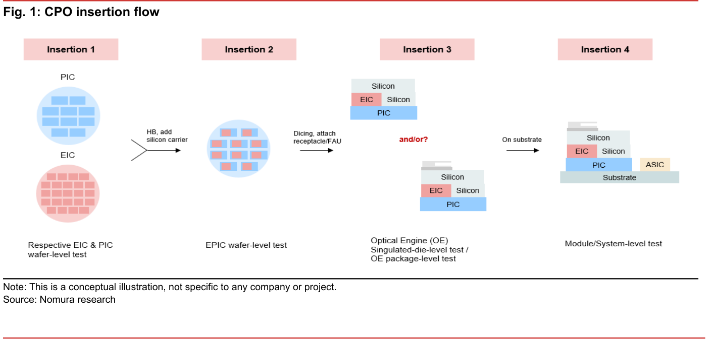

### 解讀摘要

CPO 測試鏈分四個 insertion：Insertion 1（PIC/EIC 各別晶圓級單面測試）→ Insertion 2（混合鍵合後 EPIC 雙面晶圓測試）→ Insertion 3（OE 切單後：die 級 + 封裝後兩個測試步驟，"and/or?" 顯示業界尚未定論是否兩步皆執行）→ Insertion 4（OE 上基板後模組/系統級測試）。Insertion 3 的"and/or?"符號是報告最重要的不確定性標記——若兩步均執行，TAM 翻倍；若只擇一，供應商洗牌。

> **原文補充**：MPI 已於 2H26 開始小量出貨 Insertion 3 設備；Insertion 2 被 Nomura 視為技術難度最高、各家廠商目前最積極開發的環節。

---

## Fig. 2｜CPO insertion flow and potential suppliers

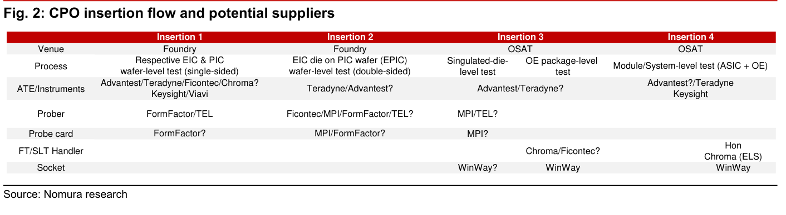

### 解讀摘要

MPI 的 CPO 出現在 Insertion 2（Prober 候選、Probe card 候選）和 Insertion 3（Prober、Probe card），"?" 表示尚未正式獲選。HON（7769）則僅在 Insertion 4 的 FT/SLT Handler 欄。兩者的 CPO 商機在架構上互補而非競爭：MPI 面向晶圓級/die 級探針（先製程、高技術壁壘），HON 面向模組/系統級 handler（後段、量大但競爭較激烈）。

### 表格

| 環節 | Venue | 測試製程 | ATE/Instruments | Prober | Probe card | FT/SLT Handler | Socket |
|---|---|---|---|---|---|---|---|
| **Insertion 1** | Foundry | EIC & PIC 晶圓級（單面） | Advantest/Teradyne/Ficontec/Chroma?; Keysight/Viavi | FormFactor/TEL | FormFactor? | — | — |
| **Insertion 2** | Foundry | EIC die on PIC (EPIC) 晶圓級（雙面） | Teradyne/Advantest? | Ficontec/MPI/FormFactor/TEL? | MPI/FormFactor? | — | — |
| **Insertion 3a** | OSAT | Singulated die 級 | Advantest/Teradyne? | MPI/TEL? | MPI? | — | WinWay? |
| **Insertion 3b** | OSAT | OE package 級 | Advantest/Teradyne? | — | — | Chroma/Ficontec? | WinWay |
| **Insertion 4** | OSAT | Module/System 級（ASIC + OE） | Advantest?/Teradyne; Keysight | — | — | Hon; Chroma (ELS) | WinWay |

> **洞察一**：MPI 的 CPO 機會集中在 Insertion 2/3（探針＋探針卡）；即使最終只在 Insertion 3 獲選，每個 chip 世代都需新設計，是比 handler（一次性資本財）更高頻的重複收入。

---

## Fig. 3｜MPI — Probe card revenue trend

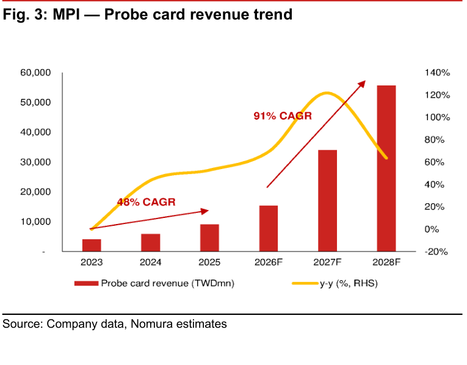

### 解讀摘要

探針卡收入從 48% CAGR（2023-25）跳升至 91% CAGR（2026-28F），絕對值從 TWD9,069mn（2025）→TWD55,735mn（2028F），三年 6.1 倍。這不是低基期效應——2025 的 TWD9bn 本身已是 2023 的 2.2x。加速的三個驅動因子：（1）MEMS 探針滲透率提升推高 ASP；（2）AI ASIC 新晶片世代每個換代需要重新設計探針卡；（3）chiplet 架構讓每個產品需要 3-5 張不同探針卡。

### 表格

| 年度 | 探針卡收入（TWDmn） | YoY |
|---|---|---|
| 2023 | 4,125 | — |
| 2024 | 5,930 | +44% |
| 2025 | 9,069 | +53% |
| 2026F | 15,352 | +69% |
| 2027F | 34,067 | +122% |
| 2028F | 55,735 | +64% |
| **2023-25 CAGR** | — | **48%** |
| **2026-28F CAGR** | — | **91%** |

> **洞察一**：2027F 探針卡收入 YoY +122% 是加速頂峰年——Nomura 預計 MEMS 產能於此年大量投產（目標 10mn kpm）撞上 AI ASIC 量產需求高峰，量＋價同步推動。  
> **值得驗證**：91% CAGR 最大假設是 MEMS 探針對 cobra 的替換速度。若 AI 晶片 pitch shrink 放慢（停在 80-100μm）延緩 MEMS 必要性，實際 CAGR 可能降至 60-70%。

---

## Fig. 4｜MPI — Probe capacity expansion trend

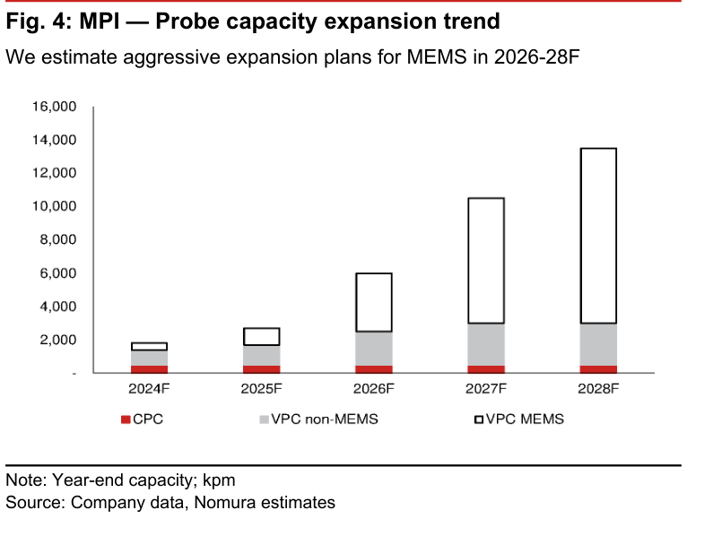

### 解讀摘要

Nomura 預估 MPI MEMS 探針卡針容量：年末 2026F=5,500 kpm（千針/月）、2027F=10,000 kpm（高於公司指引 8,000-9,000 kpm）。圖表顯示 VPC MEMS（白色）從 2024F 的極小份額，到 2027F 已佔總容量主體，意味資本密集的 MEMS 製程是 MPI 的差異化重押。MPI 同時在建自製 PCB 廠（預計 2027E 投產）以縮短生產前置時間，降低 PCB 供應鏈瓶頸風險。

### 表格（視覺估算）

| 年度 | CPC（kpm） | VPC non-MEMS（kpm） | VPC MEMS（kpm） | **合計（kpm）** |
|---|---|---|---|---|
| 2024F | ~300 | ~1,400 | ~200 | **~1,900** |
| 2025F | ~300 | ~1,700 | ~600 | **~2,600** |
| 2026F | ~300 | ~2,200 | ~3,500 | **~6,000** |
| 2027F | ~400 | ~2,600 | ~7,500 | **~10,500** |
| 2028F | ~400 | ~2,800 | ~10,500 | **~13,700** |

*以上為視覺估算；MEMS 確認值：end-2026F=5,500 kpm、end-2027F=10,000 kpm（原文）*

> **洞察一**：Nomura 的 2027F MEMS 容量預估（10,000 kpm）高於公司指引（8,000-9,000 kpm）——這是 Nomura 相對積極的一個地方，若執行落後，探針卡收入 CAGR 可能低於 91% 但仍是結構性高速成長。

---

## Fig. 5｜Typical pitch regimes and corresponding test interface solutions

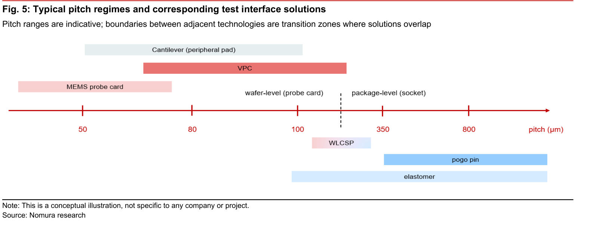

### 解讀摘要

技術選擇地圖：MEMS 探針卡覆蓋 50-100μm pitch；VPC（cobra）覆蓋 80-350μm；Cantilever 覆蓋 80-800μm（周邊 pad 用途）。AI/HPC 晶片目前 bump pitch 約 100μm 正好在 MEMS 與 VPC 的轉換區，而先進智慧型手機 AP 已降至 80μm。這意味隨晶片縮小，MEMS 將從「部分應用適用」變為「先進邏輯晶片唯一選擇」——不是市場偏好轉移，是物理邊界推動的技術替換。

> **原文補充**：Nomura 估計習慣製法的探針在 pitch < 50-70μm 後無法達到必要定位精度，即 MEMS 的技術剛需邊界。目前 AI ASIC 的 bump pitch 約 100μm，仍在 VPC 覆蓋範圍，但趨勢向 MEMS 移動。

---

## Fig. 6｜Timeline of testing equipment and interface preparation

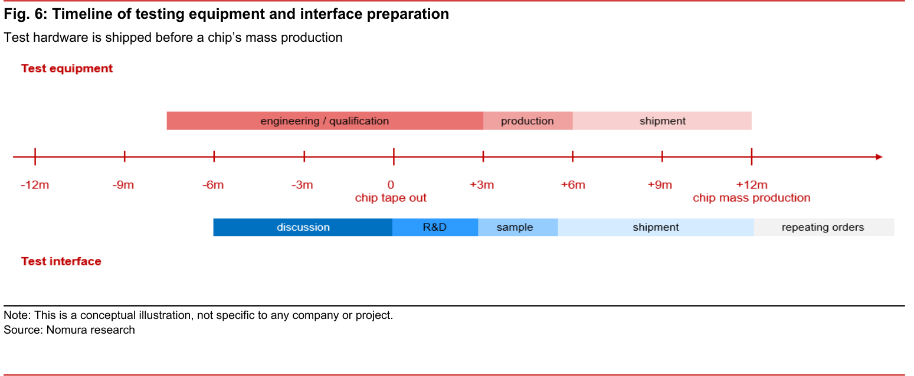

### 解讀摘要

測試設備（ATE）在晶片 tape-out 前 6 個月即進入工程驗證/資格認證，在量產前 6 個月才出貨。測試介面（探針卡）的時序更早一步：討論在 tape-out 前 6 個月開始，R&D 在 tape-out 時，樣品出貨在 tape-out 後 3 個月，bulk 出貨在 tape-out 後 6 個月（=晶片量產時）。這讓探針卡收入**先於**晶片量產數據出現——對投資人而言，已知的訂單 pipeline 是比財報更早 6-12 個月的景氣指標。

> **原文補充**：MPI 於 2025 年底至 2026 年初已開始接手 2H26 量產準備的 AI ASIC 訂單，符合此時序規律，為 2026-27F 收入加速提供早期可見度。

---

## Fig. 7｜MPI provides a broad range of probes

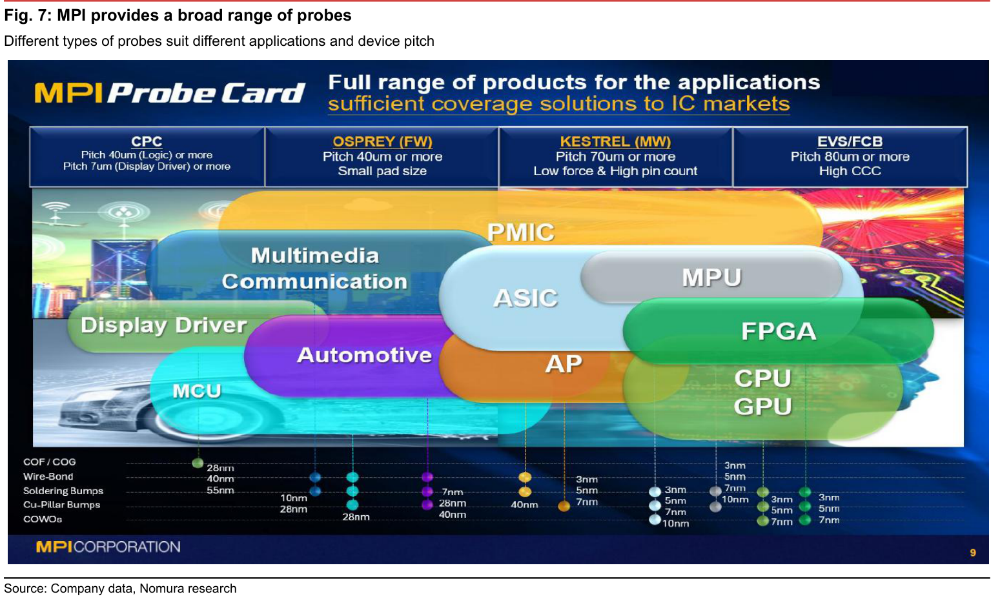

### 解讀摘要

MPI 的探針卡產品線：CPC（Cantilever，7μm+ for DDIC；40μm+ for Logic）、OSPREY/FW（40μm+，小 pad size）、KESTREL/MW（70μm+，低力高針數）、EVS/FCB（80μm+，高 CCC）。應用涵蓋 Display Driver→MCU→Automotive→AP→ASIC→MPU→CPU/GPU/FPGA，製程從 3nm 到 55nm 均有覆蓋。這個廣度印證「前五大客戶各 5-15%」的分散結構：不同客戶需要不同類型的探針卡，MPI 是少數能全覆蓋的廠商。

---

## Fig. 8｜MPI share price events vs monthly sales, 2023-24

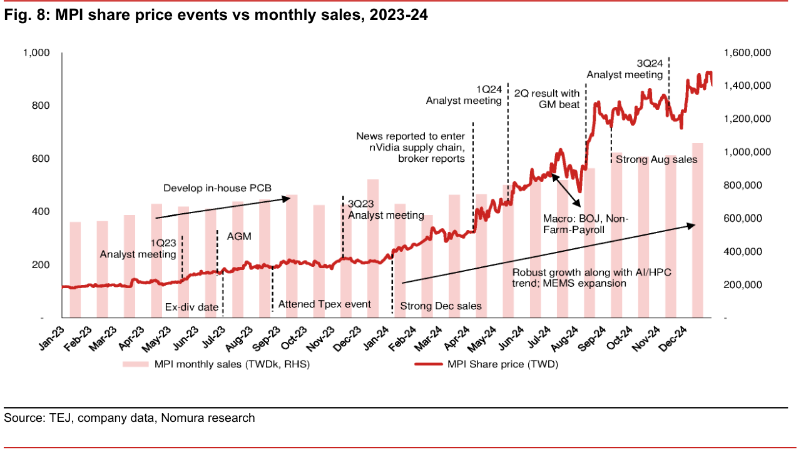

### 解讀摘要

2023-24 兩年的 re-rating 地圖：股價從 TWD118（2023 初）→TWD850+（2024 底），漲 7x。每次拉升都有基本面支撐：May-23 的 nVidia 供應鏈報導（+80%）、Nov-23「3Q23 法說」後收入可見度提升、2Q24 結果 + GM beat、3Q24 法說後確認 AI/HPC 擴張。月營收從 TWD350mn（2023 初）→TWD1,400mn（2024 底）增 4 倍，股價漲幅比收入更大，反映估值倍數擴張同步。

---

## Fig. 9｜MPI share price event chart vs monthly sales, 2025-26YTD

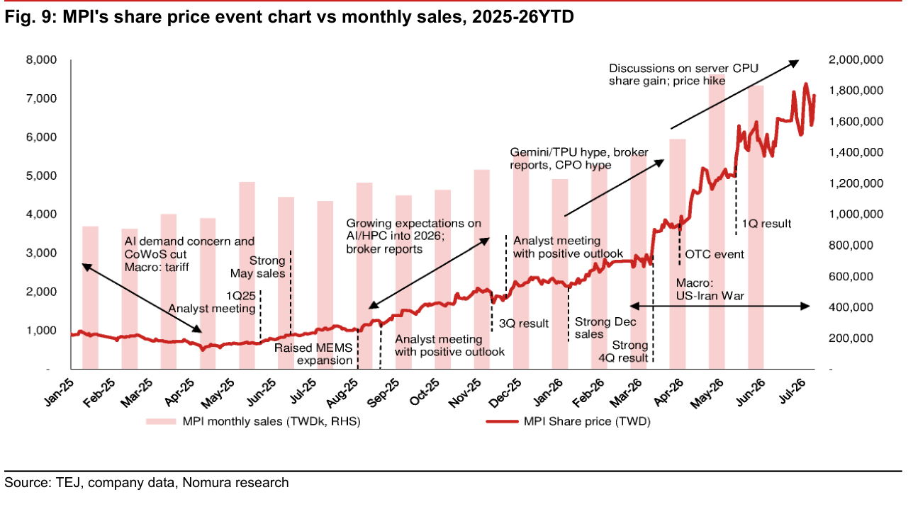

### 解讀摘要

2025-26 是更劇烈的加速：股價從 TWD1,000（2025 初）→7,500（2026 Jul 高點），再拉回至約 6,000（報告日期）。驅動因素：Gemini/TPU hype（Nov-25，+60% 以內）→CPO 題材炒作 + 法說正向展望（Jan-26）→4Q 強結果（2月）→OTC 活動（4月）→server CPU share gain 討論 + 漲價（Jul-26）。月營收同期從 TWD800mn（Jan-25）→TWD1,800mn（May-26），成長 2.3x，但股價漲幅達 7x，EPS 修正（Fig. 21）構成主要驅動力。

> **洞察一**：2026 年 Apr-26 的 US-Iran War 事件導致股價一度回調至 2,500-3,000 level，但 1Q 強結果（5月）迅速扭轉，顯示市場對 MPI 的基本面信仰已相當堅定，macro 衝擊只能提供短暫窗口。

---

## Fig. 10｜MPI — key financial figures

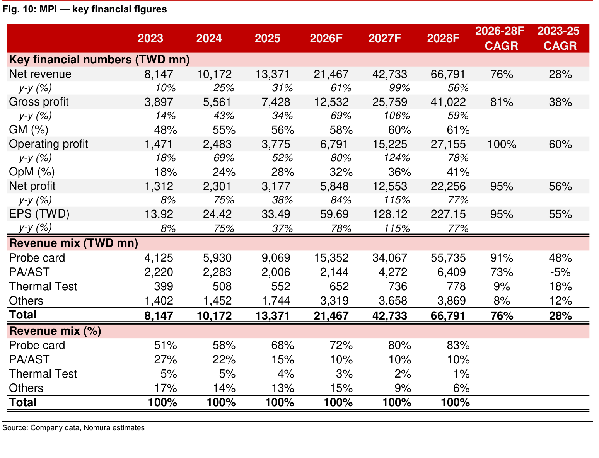

### 解讀摘要

完整財務摘要：OPM 從 18%（2023）→41%（2028F）的提升中，最大邊際增量來自 MEMS 探針卡的 mix shift——比 cobra 更高 ASP 但相近固定成本，增量毛利率更高。Revenue mix 中，探針卡從 51%→83%，PA/AST 從 27%→10%（但 CPO 若加速則 PA/AST 反彈），Thermal Test 持平萎縮（5%→1%）。

### 表格（key financial figures）

| 指標 | 2023 | 2024 | 2025 | 2026F | 2027F | 2028F | 2026-28F CAGR | 2023-25 CAGR |
|---|---|---|---|---|---|---|---|---|
| 收入（TWDmn） | 8,147 | 10,172 | 13,371 | 21,467 | 42,733 | 66,791 | 76% | 28% |
| 毛利潤 | 3,897 | 5,561 | 7,428 | 12,532 | 25,759 | 41,022 | 81% | 38% |
| **GM (%)** | **48%** | **55%** | **56%** | **58%** | **60%** | **61%** | | |
| 營業利益 | 1,471 | 2,483 | 3,775 | 6,791 | 15,225 | 27,155 | 100% | 60% |
| **OPM (%)** | **18%** | **24%** | **28%** | **32%** | **36%** | **41%** | | |
| 淨利 | 1,312 | 2,301 | 3,177 | 5,848 | 12,553 | 22,256 | 95% | 56% |
| **EPS（TWD）** | **13.92** | **24.42** | **33.49** | **59.69** | **128.12** | **227.15** | **95%** | **55%** |
| 探針卡（TWDmn） | 4,125 | 5,930 | 9,069 | 15,352 | 34,067 | 55,735 | 91% | 48% |
| PA/AST | 2,220 | 2,283 | 2,006 | 2,144 | 4,272 | 6,409 | 73% | -5% |
| Thermal Test | 399 | 508 | 552 | 652 | 736 | 778 | 9% | 18% |
| Others | 1,402 | 1,452 | 1,744 | 3,319 | 3,658 | 3,869 | 8% | 12% |
| 探針卡% | 51% | 58% | 68% | 72% | 80% | 83% | | |
| PA/AST% | 27% | 22% | 15% | 10% | 10% | 10% | | |

> **洞察一**：PA/AST 在 2023-25 收入持平甚至微降（-5% CAGR），但 2026-28F 反彈至 73% CAGR——幾乎完全對應 CPO 設備機會開始貢獻。這是「CPO 選擇權」具體化的財務印記。  
> **洞察二**：2027F 營業利益率達 36%、2028F 達 41%，與 HON（2027F OPM 約 30%）相比高出約 5-10ppt——顯示探針卡（消耗品 + design-in 先發優勢）比 handler（one-time 資本財）有更高的持續毛利。

---

## Fig. 11｜MPI — annual revenue trend

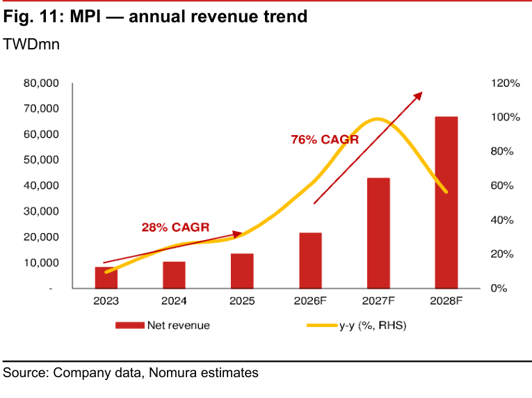

### 解讀摘要

年度收入趨勢視覺化確認：2023-25 的 28% CAGR「斜率」在 2026F 急劇上翻，2027F 幾乎是 2026F 的 2 倍（TWD42,733mn vs 21,467mn）。這個 2027F 的單年加速是模型的最大假設——需要 MEMS 容量準時交付 + AI ASIC 客戶無延遲量產。若 2027F 是真實拐點，2028F 的 TWD66,791mn 在高基期下仍成長 56%，代表成長具持續性而非僅曇花一現。

---

## Fig. 12｜MPI — annual gross profit trend

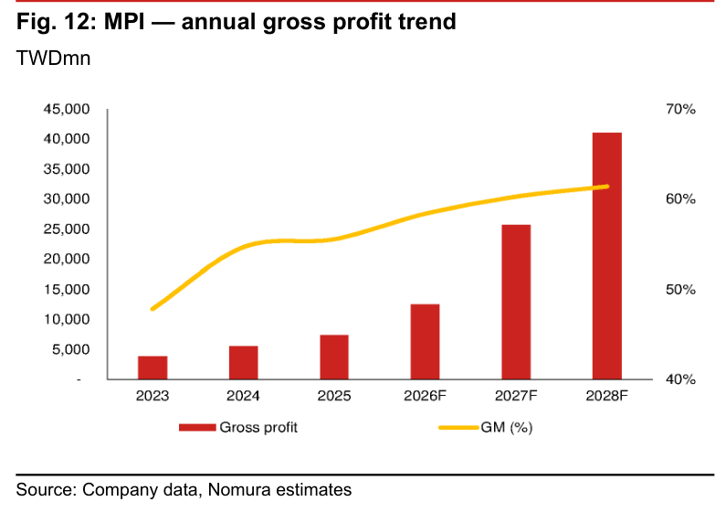

### 解讀摘要

毛利率從 48%（2023）→61%（2028F），趨勢線緩步穩定上行（非躍升型）。最關鍵的拐點在 2024（48%→55%）——從 MEMS 極低滲透跳至量產初期，一次性 ASP 改善。之後的 55%→61% 是滲透率每年小幅提升的複利效果，而非再一次的大躍進。這意味毛利率超預期需要靠 MEMS mix 比 Nomura 預估更快提升，或新 CPO 設備毛利率高於預期。

---

## Fig. 13｜MPI — annual operating profit trend

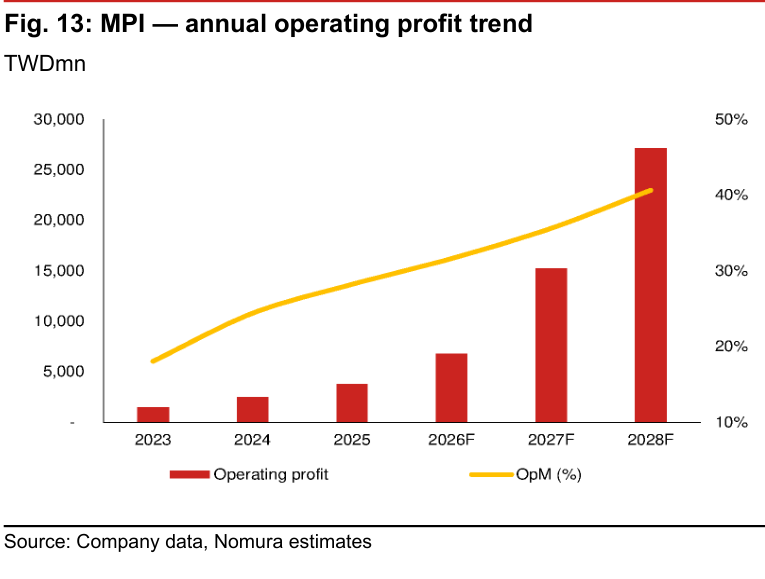

### 解讀摘要

OPM 從 18%（2023）→41%（2028F）的雙倍擴張，遠超 GM 的 13ppt 提升（48%→61%），差距由 OPEX 去槓桿化解釋：研發、銷管費用佔收入比從 27%（2025）→21%（2028F）。2028F 的 OPM 41% 對台灣半導體設備公司來說是罕見水準，接近 TSMC 的利潤等級，反映探針卡設計 know-how 的定價權。

---

## Fig. 14｜MPI — annual EPS trend

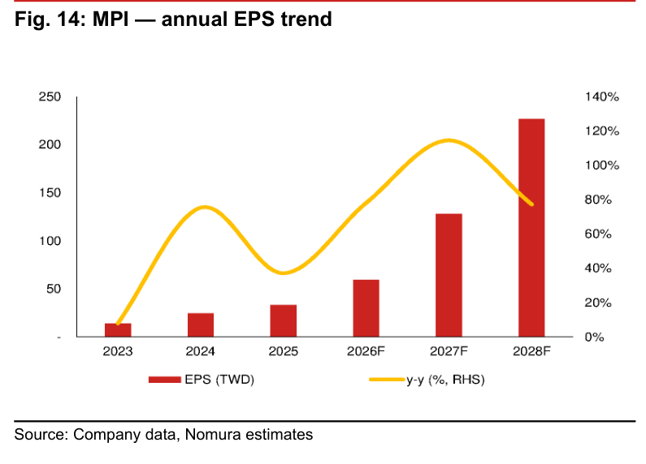

### 解讀摘要

EPS 從 TWD13.92（2023）→TWD227.15（2028F），五年 16x。2026F 的 TWD59.69 是「進場估值基準」——以報告當日股價 TWD6,000 計算，現價已在 2026F EPS 約 100x P/E，但以 2027F EPS TWD128.12 計算僅 46.8x（符合 Fig. 19 歷史區間高端），而 2028F EPS TWD227.15 僅 26.4x。估值曲線需要投資人相信 EPS 的加速而非僅看當期 P/E。

> **洞察一**：45x 2027-28F 平均 EPS（TWD177.6）= TP TWD8,000 。若 2027F EPS 被下修 20%（至約 TWD103），維持同樣倍數則 TP 下調至 ~TWD6,400——下行空間約 6%，顯示 Nomura 的 Buy 論點有一定 EPS 容錯空間。

---

## Fig. 15｜MPI's annual product mix（TWDmn）

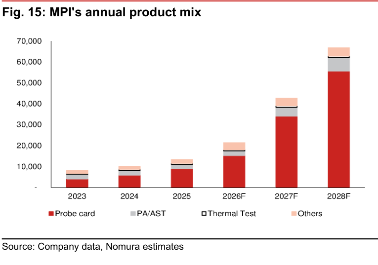

### 解讀摘要

探針卡（紅色）的絕對金額擴張是視覺震撼：從 TWD4,125mn（2023）→TWD55,735mn（2028F）幾乎完全主導增量，其他三項業務合計從 TWD4,022mn 成長至僅 TWD11,056mn。在 2028F 的 total mix 中，探針卡貢獻 55,735mn 相對於 others 的 11,056mn，業務集中度顯著——但集中在最高成長的段位，而非集中在夕陽業務。

---

## Fig. 16｜MPI's annual product mix（%）

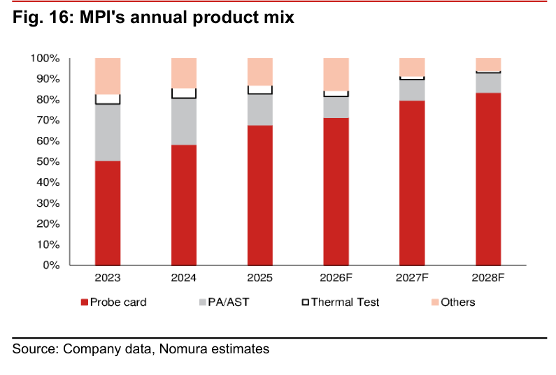

### 解讀摘要

百分比圖更清楚呈現結構變化：探針卡 51%（2023）→83%（2028F），PA/AST 27%→10%，Thermal Test 5%→1%，Others 17%→6%。PA/AST 的下降是「CPO 期前的低谷」——Nomura 預期 2027F 起 CPO 設備會讓 PA/AST 反彈至 10% 穩定後再拉升（Fig. 10 中 2027-28F PA/AST CAGR 73%）。這解釋了為何 PA/AST 絕對值在 2026F 後重新成長，但佔比維持 10%。

> **洞察一（配合 Fig. 10）**：PA/AST 在 2026F 的絕對值 TWD2,144mn 不起眼，但到 2028F 達 TWD6,409mn（+3x）。若 CPO 比 Nomura 預期提前一年規模化，PA/AST 2028F 可能達 TWD10bn+，使整體收入超過 TWD70bn。

---

## Fig. 21｜MPI's share price vs Bloomberg consensus EPS estimate revisions

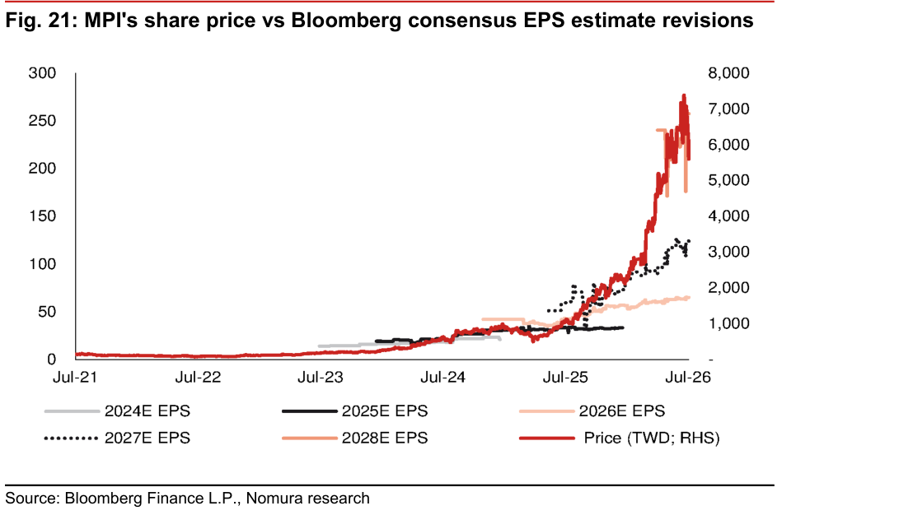

### 解讀摘要

共識 EPS 修正從 2024 中開始加速：2027E 共識從 TWD20（2025 初）→TWD125（2026 Jul），18 個月內上修 6x。這個修正幅度正好解釋同期股價 7x 的漲幅——本益比沒有大幅擴張，主要是 EPS 拉升帶動。2028E 共識目前約 TWD250，高於 Nomura 的 TWD227.15（見 Fig. 18，BBG 2028F EPS=257.50 vs NMR=227.15），顯示市場對中期有比 Nomura 更樂觀的預期。

> **洞察一**：如果 Nomura 的 2026-28F EPS 預估比共識低 8-12%（Fig. 18），卻仍給 Buy 評等，代表 Nomura 的 TP 是保守基本情境——若公司 beat 共識，上行空間更大。這也是 contra-consensus 的有趣之處：Nomura 模型相對保守但結論看多。

---

## Fig. 22｜MPI board of directors

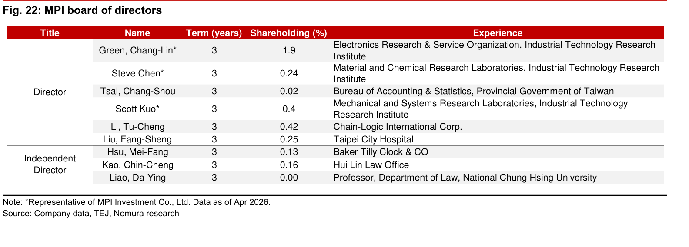

### 解讀摘要

董事會 9 人：6 位 Director（4 位標 * 代表 MPI Investment Co.）+ 3 位 Independent Director。ITRI（工研院）背景的 Director 達 4 人（Green Chang-Lin、Steve Chen、Scott Kuo 均來自不同 ITRI 實驗室），反映公司的技術創業 DNA。董事持股合計約 3.5%（最高 Green Chang-Lin 1.9%），屬輕度 inside ownership，但控制實體 MPI Investment 持股 8.51% 維繫策略一致性。

### 表格

| 職位 | 姓名 | 任期（年） | 持股（%） | 背景 |
|---|---|---|---|---|
| Director* | Green, Chang-Lin | 3 | 1.90 | ITRI 電子研究服務組織 |
| Director* | Steve Chen | 3 | 0.24 | ITRI 材料化學實驗室 |
| Director | Tsai, Chang-Shou | 3 | 0.02 | 台灣省政府主計處 |
| Director* | Scott Kuo | 3 | 0.40 | ITRI 機械系統實驗室 |
| Director | Li, Tu-Cheng | 3 | 0.42 | Chain-Logic International |
| Director | Liu, Fang-Sheng | 3 | 0.25 | 台北市立醫院 |
| Independent | Hsu, Mei-Fang | 3 | 0.13 | Baker Tilly Clock & CO |
| Independent | Kao, Chin-Cheng | 3 | 0.16 | 匯林法律事務所 |
| Independent | Liao, Da-Ying | 3 | 0.00 | 中興大學法律系教授 |

*代表 MPI Investment Co., Ltd.（資料截至 2026 年 4 月）

---

## Fig. 23｜MPI's share price vs FINI holdings

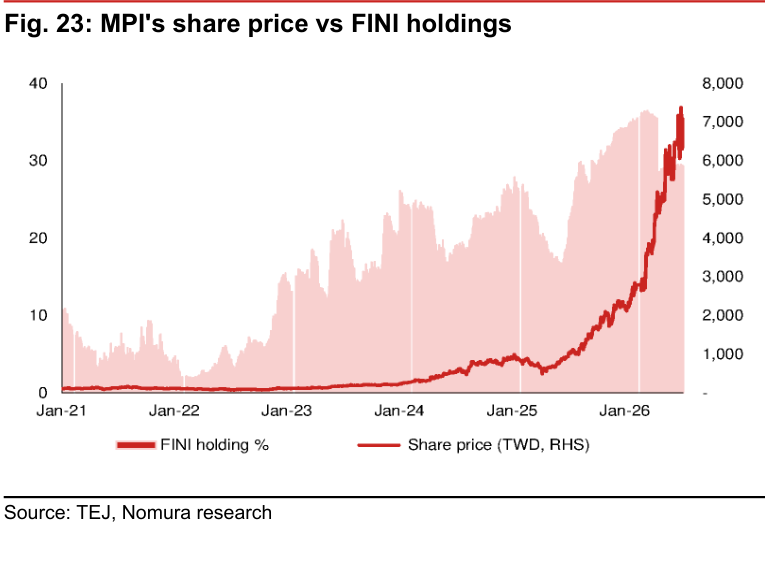

### 解讀摘要

外資持股（FINI）從 2021 年 <5% 逐步累積至 2025 年底 ~37%，和股價同步上行（TWD500→7,000+）。2026 年 Q1-Q2 FINI 持股略微下滑（從峰值 37% 回至 35-36%），與股價從 2026 初高點回調再 rebound 吻合，顯示獲利了結後重新進場的模式。FINI 37% 對台灣 TPEx（興櫃/OTC）掛牌公司屬高水位——未來外資推升股價的邊際效果降低，需靠基本面（EPS beat）延續動能。

---

## Fig. 24｜MPI's top 10 shareholders

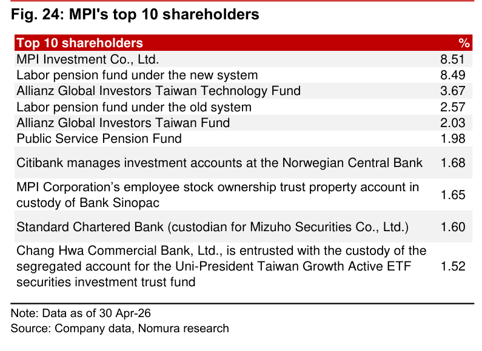

### 解讀摘要

股東結構以長線機構為主：創辦人系（MPI Investment 8.51%）＋勞退（8.49+2.57=11.06%）＋安聯（3.67+2.03=5.70%）三組合計 25.3%，均為長期持有者，提供股價穩定基礎。挪威央行（1.68%）、員工持股信託（1.65%）、瑞穗（1.60%）、統一 ETF（1.52%）均為機構長線資金，無短期活躍投資人或抗議型股東跡象。

### 表格

| 排名 | 股東 | 持股（%） |
|---|---|---|
| 1 | MPI Investment Co., Ltd. | 8.51 |
| 2 | 勞退基金（新制） | 8.49 |
| 3 | Allianz Global Investors Taiwan Technology Fund | 3.67 |
| 4 | 勞退基金（舊制） | 2.57 |
| 5 | Allianz Global Investors Taiwan Fund | 2.03 |
| 6 | 公務人員退休撫卹基金 | 1.98 |
| 7 | 挪威央行（Citibank 存管） | 1.68 |
| 8 | MPI 員工持股信託（永豐銀行） | 1.65 |
| 9 | 渣打（瑞穗證券存管） | 1.60 |
| 10 | 彰銀（統一台灣成長主動 ETF） | 1.52 |

---

## 跨 Exhibit 彙整表

### 彙整 1｜探針卡容量 vs 收入推算（Fig. 3 + Fig. 4）

| 年度 | MEMS 容量（kpm，year-end） | 探針卡收入（TWDmn） | 隱含 MEMS 年均收入/kpm（TWDmn/kpm） |
|---|---|---|---|
| 2025 | ~600 | 9,069 | — |
| 2026F | 5,500 | 15,352 | ~2.8 |
| 2027F | 10,000 | 34,067 | ~3.4 |
| 2028F | ~13,000+ | 55,735 | ~4.3 |

> 每 kpm MEMS 容量隱含的年收入持續上升（2.8→4.3 TWDmn/kpm），反映 MEMS ASP 隨 AI 晶片世代升級而提價——不僅是量的擴張，是量×價雙輪驅動。

### 彙整 2｜EPS 路徑：Nomura vs 市場共識（Fig. 14 + Fig. 18 + Fig. 21）

| 年度 | Nomura EPS（TWD） | Bloomberg 共識 EPS | Nomura 相對共識 |
|---|---|---|---|
| 2026F | 59.69 | 64.95 | -8.1% |
| 2027F | 128.12 | 124.02 | +3.3% |
| 2028F | 227.15 | 257.50 | -11.8% |

> Nomura 在 2026F 和 2028F 均低於共識，僅 2027F 略高。這提供了一個反常識視角：Nomura 給 Buy 但用保守模型——若公司 beat 2026F 共識（64.95），股價有超出 TP 的上行空間；若 2028F 落在 BBG 共識（257.50），TP 保守性更明顯。

---

## 相關個股清單

| 類別 | 公司 | Ticker | 評等 | 備註 |
|---|---|---|---|---|
| **主角（首評）** | 旺矽科技 MPI Corporation | 6223 TT | Buy（首評）TP TWD8,000 | 探針卡 + CPO Insertion 2/3；EPS CAGR 95% 2026-28F |
| Anchor Report 配套 | 鴻勁精密 HON Precision | 7769 TT | Buy（首評）TP NT\$11,100 | FT/SLT handler + CPO Insertion 4 |
| ATE（測試機） | Advantest | 6857 JP | 未評等 | CPO Insertion 1-3 最大 ATE 候選；與 MPI 互補 |
| ATE（測試機） | Teradyne | TER US | 未評等 | 同 Insertion 1-3 |
| Prober 競爭者 | FormFactor | FORM US | 未評等 | MPI 在 Insertion 2/3 直接競爭對手；MPI 享受其溢出訂單 |
| Prober 競爭者 | TEL（Tokyo Electron） | 8035 JP | 未評等 | Insertion 1/2 Prober 候選 |
| Socket（Insertion 3-4） | WinWay Technology | 2492 TT | 未評等 | Insertion 3/4 socket 主要候選 |
| FT/SLT Handler | 鴻勁精密（重複） | 7769 TT | — | Insertion 4 handler 首選，見上 |
| FT/SLT Handler | Chroma | 2360 TT | 未評等 | Insertion 3b+4 候選 |
| CPO 光模組 | 多家 | — | — | CPO volume 若落後，所有 Insertion 需求均延後 |
