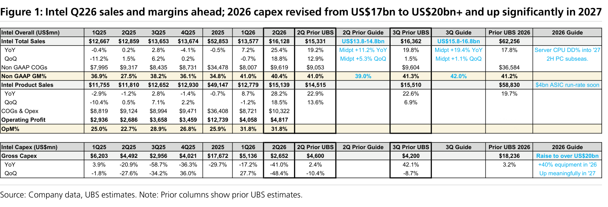

# UBS｜Intel 供應鏈影響：CPU 與封裝的上行

**券商**：UBS  
**分析師**：Randy Abrams、Timothy Arcuri、Nicolas Gaudois、Sunny Lin、Diana Chang、Annie Chen  
**日期**：2026-07-24  
**主題**：UBS Tech Views — Intel supply chain implications：upside from CPU and packaging  
**評級**：主題報告（無產業評等）；偏好傳統伺服器 ODM、DRAM、TSMC/信驊、Amkor  
<a href="https://layx.uk/dl?g=產業&b=UBS&d=20260724&h=Intel-Implication">📎 下載 PDF</a>

---

## 報告總結

Intel 2Q26 財報優於預期（盤後漲 4%、YTD +154% 遠勝 SOX +68%），Q326 財測、2026 全年至後續年度基調同步轉強，驅動力是 agentic AI 帶動的伺服器 CPU 需求與製造執行力改善。UBS 台灣團隊接續美國分析師 Tim Arcuri 的 Intel 主體報告，把重點放在對亞洲科技供應鏈的 read-across：Intel 上修 2026 資本支出（US\$17bn→US\$20bn+）、伺服器 CPU 產業單位數今明兩年強勁雙位數成長並延伸至 2028，但晶圓、記憶體、基板供給全面吃緊，供給成長偏重 3Q 末與 4Q。

投資意涵是「傳統伺服器多年上行」的結構性訊號：最受惠者為一般伺服器曝險高的 ODM（緯穎、英業達），其次廣達、鴻海；連接器 Lotes、基板 Ibiden/欣興、記憶體 DRAM（UBS 上修 2027 位元需求至 +36%）、TSMC/信驊，以及可能承接 Intel EMIB-T 外包的 Amkor 均正面。PC 端則因記憶體漲價與高階排擠，UBS 下修 2026 PC 出貨自 -4% 至 -11%。

---

## UBS 完整投資邏輯鏈

| 論點層次 | Exhibit | 內容 |
|---|---|---|
| 需求信號明確 | 1 | Intel Q226 銷售 US\$16.1bn 優於街估，資料中心 +59% YoY |
| 結構轉折 | — | 伺服器 CPU 產業單位今明年強勁雙位數成長並延伸至 2028 |
| 供給吃緊 | 1 | 晶圓/記憶體/基板全面受限，供給偏重 3Q 末與 4Q |
| 資本支出上修 | 1 | 2026 capex US\$17bn→US\$20bn+，設備投入 +40% YoY |
| 受惠傳導 | — | 一般伺服器 ODM ＞ 連接器/基板 ＞ DRAM ＞ TSMC/信驊 ＞ Amkor |
| **結論** | 報告封面 | **傳統伺服器多年上行，偏好緯穎/英業達與 DRAM、TSMC** |

> **報告最大邏輯缺口**：Intel EMIB-T 外包給 Amkor 的量能取決於「MediaTek×Google 訂單塞滿 Penang 既有升級產能」的假設，若該排擠不如預期，Amkor 承接空間與 2027 ramp 時點都會下修。

---

## 報告核心觀點

| 主題 | UBS 觀點 | 市場共識 | 是否 Contra-Consensus |
|---|---|---|---|
| 傳統伺服器需求 | agentic/inference 帶動多年換機潮 | 視 AI 資本支出為主軸、傳統伺服器平淡 | 是 |
| PC 需求 | 2026 出貨下修至 -11% YoY（記憶體漲價排擠） | 原估 -4% | 是（更保守） |
| DRAM | 2027 位元需求 +36% YoY，供給跟不上 | 2026 +22% | 是 |
| Intel 對 TSMC | Intel 訂單降至 TSMC 營收中個位數%，但 HPC 大機會不受損 | 擔憂 Intel 內製化搶單 | 部分 |

**偏好排序**：緯穎 ＞ 英業達 ＞ 廣達 ＞ 鴻海（一般伺服器曝險由高到低）  
**零件/個股偏好**：Lotes（CPU/DDR5 socket）、Ibiden/欣興（基板）、DRAM、TSMC/信驊、Amkor（EMIB-T 外包）、聯電（12nm FinFET 與 Intel 合作）

---

## 供應鏈 read-across 彙整

| 環節 | UBS 觀點 | 主要受惠 |
|---|---|---|
| 伺服器 ODM | 傳統伺服器多年上行，上修 AI＋傳統伺服器估計 | 緯穎(~50% 一般伺服器)、英業達(~30%)、廣達(~20%)、鴻海(~10%) |
| 連接器/socket | CPU 與 DDR5 socket 受惠 | Lotes(40% 一般伺服器) |
| 基板 | 較受惠於 Intel | Ibiden、欣興 |
| 記憶體 | 伺服器換機推升 DDR5/LPDDR5X/SOCAMM2；2027 DRAM 位元需求 +36% YoY，供給無法匹配 | DRAM 產業 |
| 封測/先進封裝 | Amkor 有機會承接 Intel EMIB-T 外包（MediaTek×Google 塞滿 Penang），2027 ramp | Amkor |
| 晶圓代工 | Intel 後段自建與 Terafab 不損 TSMC HPC 大機會；TSMC 續供 AMD/ARM CPU；CoPoS 面板級封裝拉進 2028 | TSMC、信驊 |
| 成熟製程 | Intel×聯電 12nm FinFET 合作續行，可能擴至 3nm；2026 test chip、2027 量產 | 聯電 |
| PC/NB | 記憶體漲價與高階排擠壓抑低中階 PC，2026 出貨下修至 -11% YoY | （偏空）聯想短期受 ISG 拉抬 |

---

## Figure 1｜Intel Q226 財報優於預期；2026 capex 自 US\$17bn 上修至 US\$20bn+、2027 顯著增加

### 解讀摘要
Intel 2Q26 總營收 US\$16,128mn（QoQ +18.8%／YoY +25.4%）優於街估 US\$15,331mn，Non-GAAP 毛利率 40.4% 高於街估 39%；產品營業利益率跳升至 31.8%（1Q26 25.9%）。Q326 財測 US\$15.8–16.8bn、毛利率指引 42% 皆高於街估。更關鍵的是資本支出——2026 gross capex 自 US\$17bn 上修至「逾 US\$20bn」、設備投入 +40% YoY，2027 再顯著增加。機制上這代表 Intel 對 agentic CPU 需求轉為樂觀、CPU:GPU 比朝 1:1 靠攏，而 capex/設備投入放大直接利多設備與供應鏈；備註欄亦點出「US\$4bn ASIC run-rate soon」與「Server CPU 雙位數成長進入 2027」。

> **原文補充**：Intel 產品營收備註「US\$4bn ASIC run-rate soon」，顯示其自研/代工 ASIC 業務將成新營收引擎；2026 PC client TAM 指引為低雙位數衰退，與 UBS 下修 PC 出貨一致。

### 表格
| Intel Overall (US\$mn) | 2Q26 | 2Q Prior UBS | 街估 | 2026 Guide |
|---|---|---|---|---|
| 總營收 | 16,128 | 15,331 | — | 62,256 |
| 　YoY | +25.4% | +19.2% | — | +17.8% |
| 　QoQ | +18.8% | +12.9% | — | — |
| Non-GAAP 毛利率 | 40.4% | 41.0% | 39.0% | 41.2% |
| 產品營收 | 15,139 | 14,515 | — | 58,830 |
| 營業利益 | 4,817 | — | — | — |
| 產品營業利益率 | 31.8% | — | — | — |
| **Gross Capex** | **2,652** | 4,600 | — | **>20,000（上修）** |
| 　設備投入 | — | — | — | +40% YoY（2026） |

> **洞察一**：Q326 財測中點 YoY +19.4%、毛利率指引 42% 皆優於街估，加上 capex 從 US\$17bn 一路上修至 US\$20bn+，構成「需求上行×供給吃緊×資本支出放大」三重訊號——這是報告判斷傳統伺服器供應鏈多年上行、且設備/基板/記憶體最先受惠的量化根據。

---

## 相關個股清單

| 類別 | 公司 | Ticker | 備註 |
|---|---|---|---|
| 伺服器 ODM | 緯穎 Wiwynn | 6669 TT | 一般伺服器曝險最高(~50%) |
| 伺服器 ODM | 英業達 Inventec | 2356 TT | ~30% 一般伺服器 |
| 伺服器 ODM | 廣達 Quanta | 2382 TT | ~20% 一般伺服器 |
| 伺服器 ODM | 鴻海 Hon Hai | 2317 TT | ~10% 一般伺服器 |
| 連接器 | Lotes | 4966 TT | CPU/DDR5 socket，40% 一般伺服器 |
| 基板 | 欣興 Unimicron | 3037 TT | 較受惠 Intel |
| 晶圓代工 | 台積電 TSMC | 2330 TT | HPC 大機會不受損 |
| IC 設計 | 信驊 Aspeed | 5274 TT | 一般＋AI 伺服器單位成長 |
| 晶圓代工 | 聯電 UMC | 2303 TT | Intel 12nm FinFET 合作 |
| 封測 | Amkor | AMKR US | EMIB-T 外包潛在受惠 |
