# MS｜AI 網路：Scale-up 技術驅動中國 AI 超級節點

**券商**：Morgan Stanley  
**分析師**：Ethan Jia、Charlie Chan、Daniel Yen, CFA、Daisy Dai, CFA、Henry Zhao、Tiffany Yeh、Lucas Wang  
**日期**：2026-07-27  
**主題**：AI Networking — Scale-up 技術如何驅動中國 AI Supernodes（含光互連與國產互連供應鏈）  
**評級**：Industry View — Attractive  
<a href="https://layx.uk/dl?g=產業&b=MS&d=20260727&h=AI-Networking">📎 下載 PDF</a>

---

## 報告總結

接續 WAIC 2026 心得，MS 深入研究中國 scale-up 技術發展、光互連角色與國產互連供應鏈含意。核心觀察：中國 AI GPU 在光網路與機櫃系統設計上強、但受限於晶片端晶圓製程，使競爭從「單晶片規格」轉向「系統方案」——WAIC 2026 少見新晶片、多見超級節點（supernode）方案，領先廠商展示 64 顆以上加速器的 rack-scale/multi-rack 超級節點，多以自研 scale-up 技術實現。

投資含意：MS 看好 Montage（瀾起，OW）受惠更大型分散式超級節點帶來的 PCIe 互連含量提升（PCIe retimer 與 switch 晶片）；並看好中國 AI GPU 廠 Hygon（海光，OW）、Cambricon（寒武紀）、Iluvatar（天數，OW）導入/運用 scale-up 技術提升 AI 伺服器機櫃效能。跨機櫃 scale-up 亦加速國產光互連（NPO/CPO）需求。美系 scale-up TAM 2024–29E CAGR 34%（scale-up 由 US\$4bn 增至 US\$17bn）。

---

## MS 完整投資邏輯鏈

| 論點層次 | Exhibit | 內容 |
|---|---|---|
| 需求結構 | 5,14 | Scale-up（機櫃內加速器互連）為 AI 超級節點核心；美系 scale-up TAM 2024–29 CAGR 34% |
| 中國定位 | 6,7 | 中國強於光網路/系統設計、弱於晶片製程；國產晶片 TCO 較低、每 token 成本相當 |
| 系統轉向 | 3,4 | 競爭從單晶片規格轉向系統超級節點方案；各廠自研 fabric（UnifiedBus/BLink/MTLink…） |
| 光互連放量 | 8–12 | 跨機櫃 scale-up 帶動 NPO/CPO 光互連（Lightelligence、Enflame、Biren 等） |
| 需求驅動 | 13 | 中國 CSP capex 為國產 AI GPU 關鍵需求驅動 |
| **結論** | 報告封面 | **系統方案時代受惠：Montage（PCIe 互連）＋國產 AI GPU（Hygon/Cambricon/Iluvatar）** |

> **報告最大邏輯缺口**：中國 scale-up 快速追趕，但多數自研 fabric 的單通道速率、總頻寬仍「未揭露」（Exhibit 4 多欄 Undisclosed），實際效能與美系差距難量化；光互連（NPO/CPO）商用時程亦多屬原型/announced。

---

## 報告核心觀點

| 主題 | MS 觀點 | 市場共識 | 是否 Contra-Consensus |
|---|---|---|---|
| 中國 AI 競爭焦點 | 從單晶片規格轉向系統超級節點 | 仍聚焦晶片規格/製程落差 | 是 |
| 國產晶片經濟性 | TCO 較低、每 token 成本相當 | 視製程落後為決定性劣勢 | 部分 |
| PCIe 互連含量 | 分散式超級節點提升 retimer/switch 需求 | — | — |
| 光互連 | 跨機櫃 scale-up 驅動國產 NPO/CPO | CPO 尚早期 | 部分 |

**偏好排序**：Montage 瀾起（OW，PCIe 互連含量）  
**個股偏好**：Hygon 海光（OW，＋Sugon 曙光生態）、Cambricon 寒武紀、Iluvatar 天數（OW）

---

## Exhibit 1｜Scale-up 介面每通道資料速率

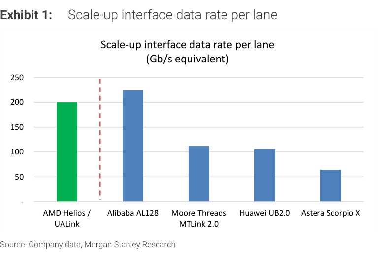

### 解讀摘要
各家 scale-up 介面每通道速率（Gb/s 等效）對比：AMD Helios/UALink、Alibaba AL128、Moore Threads MTLink 2.0、Huawei UB2.0、Astera Scorpio X 等。意義：中國自研 fabric 的單通道速率正快速追近國際規格，是「系統方案追趕」的底層技術指標。

---

## Exhibit 2｜每加速器 Scale-up 頻寬（TB/s）

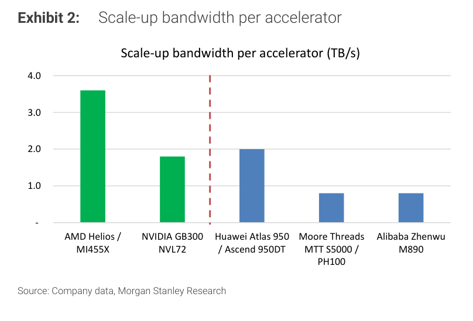

### 解讀摘要
每加速器總 scale-up 頻寬對比：NVIDIA GB300 NVL72、AMD Helios/MI455X（3.6TB/s 最高）、Huawei Atlas 950/Ascend 950DT（2TB/s）、Moore Threads、Alibaba Zhenwu M890 等。中國領先者（華為 2TB/s）已達 NVIDIA GB300（1.8TB/s）級距，但仍落後 AMD 次世代。

---

## Exhibit 3｜美系 AI 網路 scale-up 技術

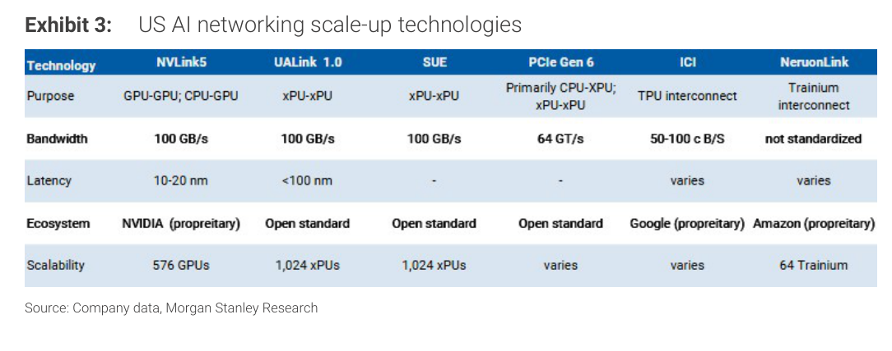

### 解讀摘要
美系 scale-up 技術地圖（NVLink/NVSwitch、UALink/UALoE、AsteraLabs Scorpio 等），作為中國自研 fabric 的對照基準。

---

## Exhibit 4｜AI 超級節點 scale-up 方案總覽

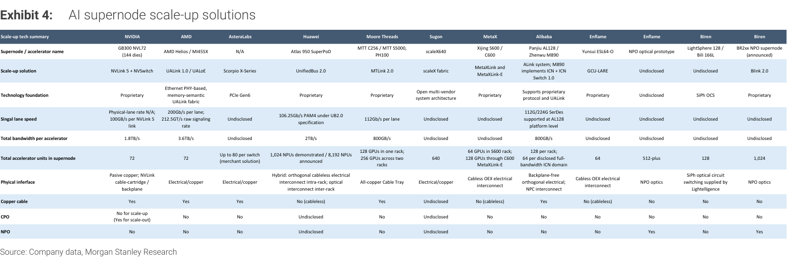

### 解讀摘要
橫跨 NVIDIA/AMD/AsteraLabs 與中國 Huawei/Moore Threads/Sugon/MetaX/Alibaba/Enflame/Biren 的 scale-up 方案對照。華為 Atlas 950（UnifiedBus 2.0，展示 1,024 NPU、宣稱可擴至 8,192）為國產規模領先；Biren BR2xx NPO（BLink 2.0）目標 1,024 GPU；Sugon scaleX640（640）；Moore Threads MTT C256（單櫃 128／雙櫃 256）。物理介面多為電氣/銅纜，跨機櫃導入光互連。

### 表格
| 廠商 | 超級節點/fabric | 加速器數 | 每加速器總頻寬 | 物理介面 |
|---|---|---|---|---|
| NVIDIA | GB300 NVL72（NVLink 5＋NVSwitch） | 72 | 1.8TB/s | 被動銅纜背板 |
| AMD | Helios（UALink 1.0/UALoE） | 72 | 3.6TB/s | 電氣/銅 |
| Huawei | Atlas 950（UnifiedBus 2.0） | 1,024 展示／8,192 宣稱 | 2TB/s | 櫃內電氣＋跨櫃光互連 |
| Sugon | scaleX640 | 640 | 未揭露 | 全銅纜 |
| Moore Threads | MTT C256（MTLink 2.0） | 128／櫃、256／雙櫃 | 800GB/s | 電氣/銅 |
| Alibaba | Panjiu AL128（ALink／ICN） | 128／櫃 | 800GB/s | 無纜正交電氣 |
| Biren | BR2xx NPO（BLink 2.0，announced） | 1,024 | 未揭露 | NPO 光互連 |

---

## Exhibit 5｜Scale-up vs Scale-out 網路

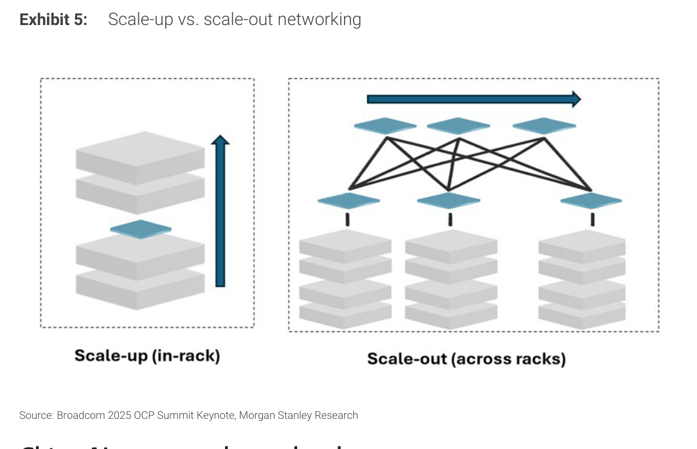

### 解讀摘要
Scale-up＝同一伺服器/機櫃內 GPU/加速器高速互連，使其如單一超級電腦共用記憶體處理同一工作負載；Scale-out＝跨多系統的資料中心互連。理解兩者分工是判讀互連含量與 TAM 的基礎。

---

## Exhibit 6｜美中 AI 產業相對優勢 — 光網路

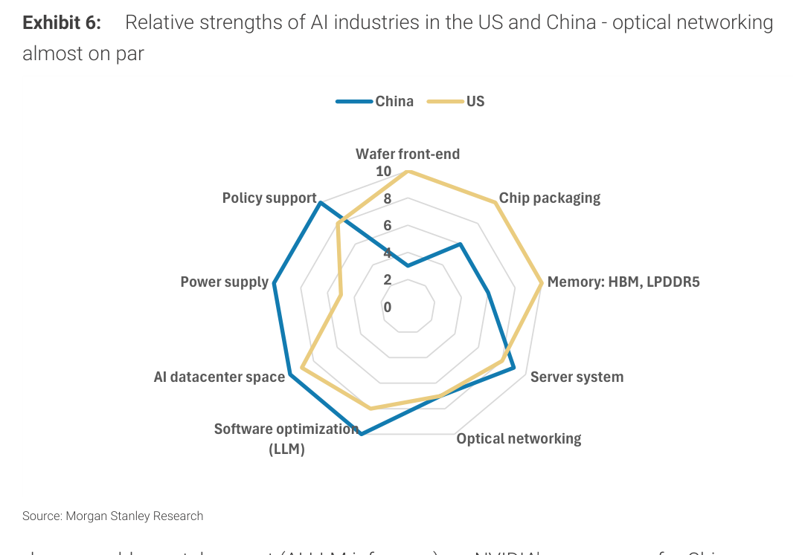

### 解讀摘要
美中 AI 產業各環節相對強弱對比：中國於光網路、機櫃系統設計上具優勢，但晶片端晶圓製程受限。這是報告核心論點——晶片端劣勢促使中國以「系統/光互連方案」取勝。

---

## Exhibit 7｜國產晶片 TCO 較低、每 token 成本相當（AI LLM 推論）

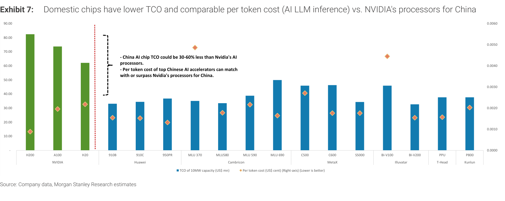

### 解讀摘要
在 AI LLM 推論情境下，國產晶片的總持有成本（TCO）較低、每 token 成本與國際方案相當。意義：即便單晶片規格落後，系統層級的經濟性讓國產 AI GPU 在中國市場具實質競爭力。

---

## Exhibit 8｜51.2T CPO 交換模組

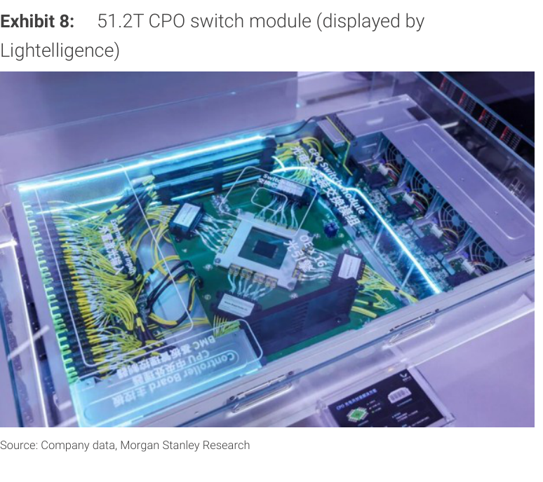

### 解讀摘要
WAIC 展示的 51.2T CPO（共同封裝光學）交換模組實體，顯示國產高頻寬光交換硬體已進入展示階段，是跨機櫃 scale-up 光互連的關鍵元件。

---

## Exhibit 9｜NPO 交換模組（Lightelligence）

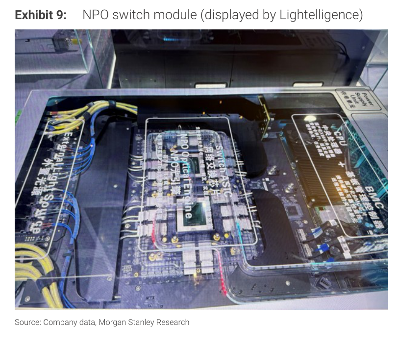

### 解讀摘要
Lightelligence 的 NPO（near-package optics）交換模組，屬 CPO 之外的另一光互連路徑，用於超級節點跨櫃連接。

---

## Exhibit 10｜Enflame NPO 光互連方案

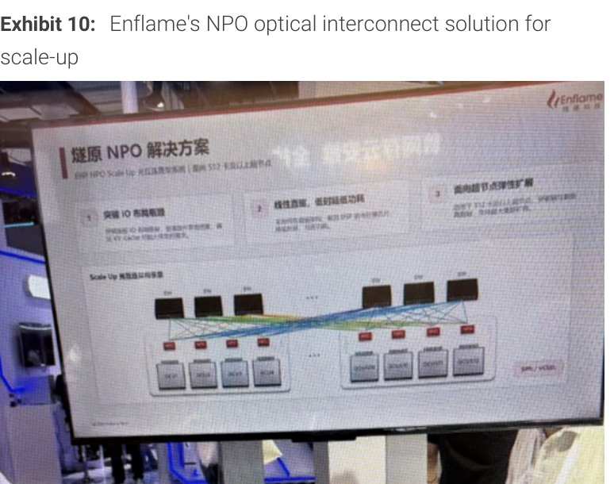

### 解讀摘要
Enflame（燧原）的 NPO 光互連 scale-up 方案，展示國產加速器廠自建光互連能力。

---

## Exhibit 11｜Biren NPO 光互連方案

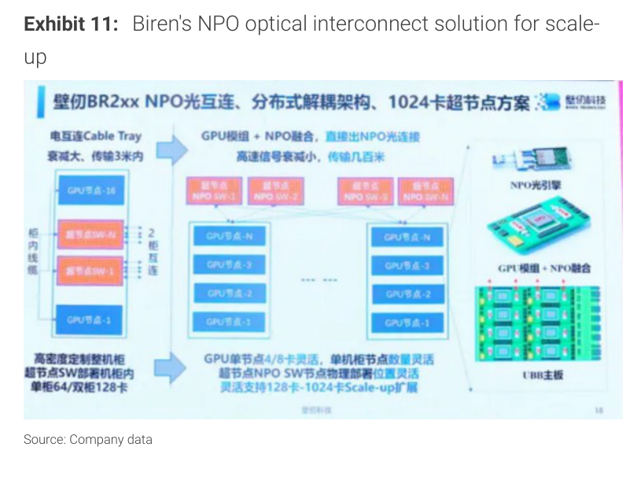

### 解讀摘要
Biren（壁仞）BR2xx 的 NPO 光互連 scale-up 方案，對應 Exhibit 4 中 BLink 2.0／1,024 GPU 目標。

---

## Exhibit 12｜LightSphere X（Lightelligence）

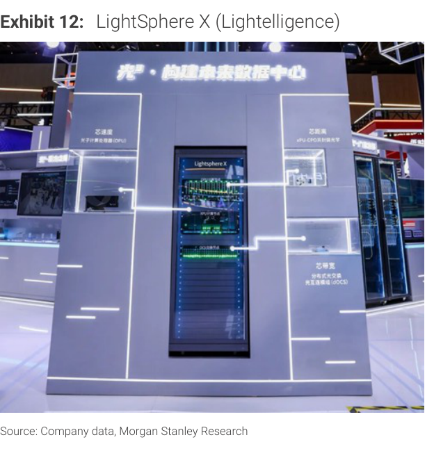

### 解讀摘要
Lightelligence 的 LightSphere X 光交換/互連產品，為國產 SiPh（矽光子）OCS 光路交換的代表方案（華為 Atlas 950 即採 Lightelligence 供應的 SiPh OCS）。

---

## Exhibit 13｜中國 CSP capex 為國產 AI GPU 關鍵需求驅動

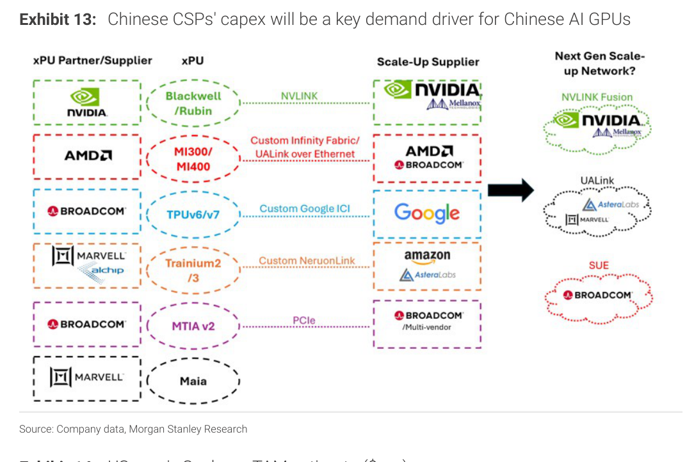

### 解讀摘要
中國雲端服務商（CSP）資本支出是國產 AI GPU 的關鍵需求驅動。CSP capex 上行直接拉動國產加速器與其 scale-up/光互連供應鏈。

---

## Exhibit 14｜美系 Scale-up TAM 估計（$mn）

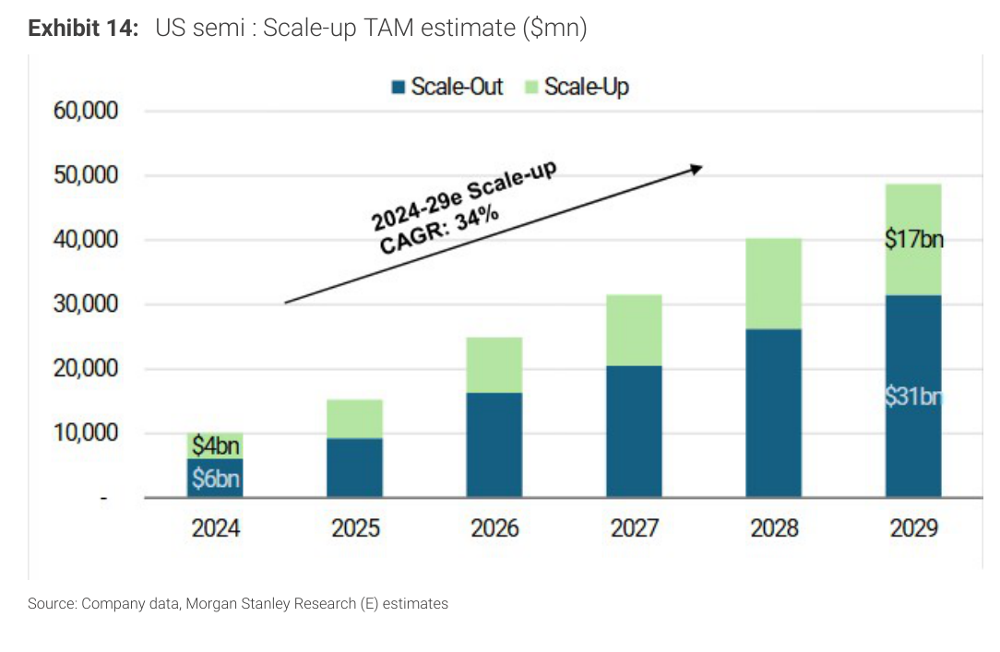

### 解讀摘要
美系半導體 scale-up + scale-out TAM 自 2024 的 US\$10bn（scale-out $6bn＋scale-up $4bn）成長至 2029E 的 US\$48bn（scale-out $31bn＋scale-up $17bn）；其中 scale-up 2024–29E CAGR 達 34%，是成長最快的環節——這是「機櫃內互連」結構性放量的量化根據，亦為國產供應鏈追趕的市場空間參照。

### 表格
| 年度 | Scale-out | Scale-up | 合計 |
|---|---|---|---|
| 2024 | US\$6bn | US\$4bn | US\$10bn |
| 2029E | US\$31bn | US\$17bn | US\$48bn |
| CAGR（24–29E） | — | 34% | — |

> **洞察一**：scale-up（US\$4bn→17bn，CAGR 34%）成長快於 scale-out，代表 AI 資本支出正從「跨系統網路」往「機櫃內加速器互連」傾斜——這是 PCIe retimer（Montage）與光互連（NPO/CPO）含量提升的結構性根據。

---

## 相關個股清單

| 類別 | 公司 | Ticker | 評等 | 備註 |
|---|---|---|---|---|
| PCIe 互連 IC | Montage 瀾起 | 688008 CH | OW | 分散式超級節點提升 PCIe retimer/switch 含量 |
| AI GPU | Hygon 海光 | — | OW | ＋Sugon 曙光生態，導入 scale-up |
| AI GPU | Cambricon 寒武紀 | — | — | 系統方案升級 |
| AI GPU | Iluvatar 天數 | — | OW | scale-up 機櫃效能 |
| 光互連 | Lightelligence / Enflame / Biren | — | — | NPO/CPO/SiPh OCS 光互連方案 |
