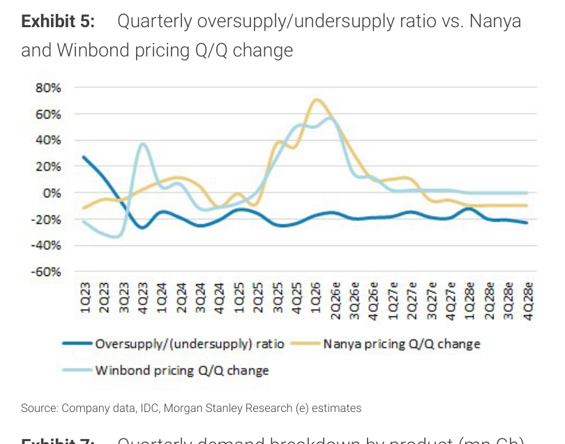
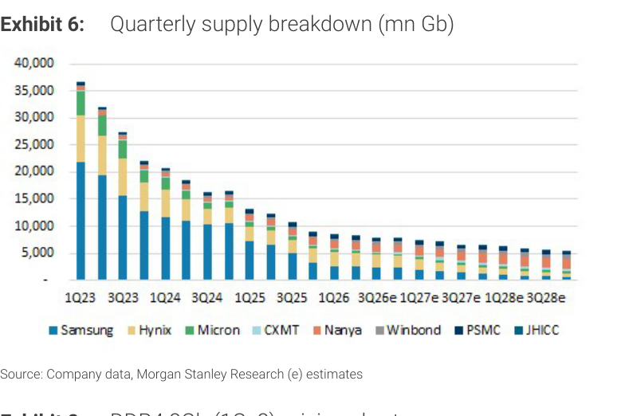
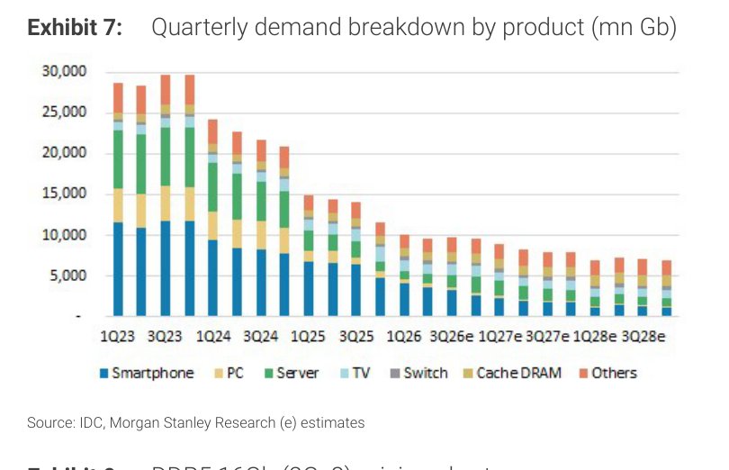

# MS｜舊記憶體：近期分歧走勢

**券商**：Morgan Stanley  
**分析師**：Daniel Yen, CFA、Charlie Chan、Daisy Dai, CFA、Tiffany Yeh、Ethan Jia  
**日期**：2026-07-27  
**主題**：Old Memory — Divergent Trends in the Near Term（DDR4／legacy flash／NOR 定價與供需）  
**評級**：Industry View — Attractive  
<a href="https://layx.uk/dl?g=產業&b=MS&d=20260727&h=Old-Memory">📎 下載 PDF</a>

---

## 報告總結

舊記憶體股近期因記憶體週期爭論、CSP 自由現金流疑慮、與中國記憶體部位減碼而 derate，但 MS 看到更強的 DDR4 漲價與前所未見的 legacy flash 定價力延續至 3Q，認為 1.0x 2028E BVPS 提供良好下檔支撐，維持 Attractive。

主流記憶體（Trendforce，Exhibit 1）：3Q26 傳統 DRAM 混合報價估季增 13–18%（PC DDR5 +15–20%、伺服器 DDR5 +13–18%、行動 LPDDR5X +8–13%、NAND +10–15%），4Q26 DRAM +3–8%、NAND 0–5%——略低於部分投資人先前預期。但 legacy 端更強：MS 認為 DDR4 3Q 月漲 20%+（季漲至少 30%），CSP 願給更高 DDR4 報價、甚至簽 1–2 年 LTA（僅量）；SLC/MLC NAND 3Q 季漲 50–60%、NOR flash 季漲 30–40%。GigaDevice 警告利基記憶體未來或大幅跌價，MS 視為長期趨勢而非近期，因 DDR4/SLC-MLC NAND/NOR 結構性供給缺口續撐漲價。下檔支撐：旺宏/南亞科/華邦電交易於 1.5x/1.2x/1.2x 2028E BVPS，1.0x 為大中華 IDM 歷史強支撐位。

---

## MS 完整投資邏輯鏈

| 論點層次 | Exhibit | 內容 |
|---|---|---|
| 主流定價 | 1 | 3Q26 傳統 DRAM +13–18%、NAND +10–15%（略低於預期） |
| legacy 更強 | 8,9 | DDR4 3Q 季漲 30%+、SLC/MLC NAND +50–60%、NOR +30–40% |
| 供需缺口 | 2,3,4,6,7 | DDR4/NAND/NOR 結構性供給缺口，支撐續漲 |
| 供需追蹤 | 5 | 季度超額供給/需求比率，判讀週期位置 |
| 下檔支撐 | — | 1.0x 2028E BVPS 為大中華 IDM 歷史強支撐 |
| **結論** | 報告封面 | **維持 Attractive；legacy 定價力強、估值下檔有撐** |

> **報告最大邏輯缺口**：DDR4/NOR 的超強漲價（3Q 季漲 30–60%）繫於「結構性供給缺口」與 CSP 願簽 LTA；若 GigaDevice 所警告的利基記憶體跌價提前到來、或 CSP 需求轉弱，legacy 定價力可能較預期更快反轉。

---

## 報告核心觀點

| 主題 | MS 觀點 | 市場共識 | 是否 Contra-Consensus |
|---|---|---|---|
| DDR4/legacy 定價 | 3Q 季漲 30%+，定價力前所未見 | 週期爭論、擔憂反轉 | 是 |
| 主流 DRAM/NAND | 3Q +13–18%/+10–15%（略低於預期） | 部分投資人預期更高 | 部分（較保守） |
| A 股部位減碼 | 可望止穩，供給缺口續撐 | 減碼壓力 | 是 |
| 估值 | 1.0x 2028E BVPS 強支撐 | derating | 是 |

**個股偏好/對照**：旺宏 Macronix、南亞科 Nanya、華邦電 Winbond（1.5x/1.2x/1.2x 2028E BVPS）；GigaDevice（603986）已自高點回檔 45.6%

---

## Exhibit 1｜DRAM 與 NAND 最新定價預估（Trendforce）

### 解讀摘要
Trendforce 對 3Q26/4Q26 各類記憶體的季度定價預估：3Q26 傳統 DRAM +13–18%（PC DDR5 +15–20%、伺服器 DDR5 +13–18%、LPDDR5X +8–13%）、NAND +10–15%；4Q26 DRAM +3–8%、NAND 0–5%。這是主流記憶體定價的基準，MS 認為 legacy 端（DDR4/NOR）漲勢更強。

### 表格
| 產品 | 3Q26 Q/Q | 4Q26 Q/Q |
|---|---|---|
| 傳統 DRAM（混合） | +13–18% | +3–8% |
| 　PC DDR5 | +15–20% | — |
| 　伺服器 DDR5 | +13–18% | — |
| 　行動 LPDDR5X | +8–13% | — |
| NAND | +10–15% | 0–5% |
| DDR4（MS 估） | 季漲 ≥30%（月漲 20%+） | — |
| SLC/MLC NAND（MS 估） | +50–60% | — |
| NOR flash（MS 估） | +30–40% | — |

---

## Exhibit 2｜NOR flash 需求與供給成長率

### 解讀摘要
NOR flash 的需求與供給成長率對比，顯示供給成長跟不上需求——結構性供給缺口，是 NOR 3Q 季漲 30–40% 的根本。

---

## Exhibit 3｜NOR flash 需求成長與供給成長（分項）

### 解讀摘要
NOR flash 需求與供給成長的分項拆解，進一步佐證供需失衡的來源與持續性。

---

## Exhibit 4｜DDR4 季度供需摘要

### 解讀摘要
DDR4 季度供給與需求摘要，是判讀 DDR4 定價力（3Q 季漲 30%+）的供需依據——供給缺口支撐 CSP 願給更高報價並簽 LTA。

---

## Exhibit 5｜季度超額供給/供給不足比率 vs 南亞科

### 解讀摘要
季度超額供給/供給不足比率的時間序列（對照南亞科），用以定位記憶體週期位置——比率轉向供給不足對應定價上行，支撐 legacy 記憶體漲價論點。

---

## Exhibit 6｜季度供給拆解（mn Gb）

### 解讀摘要
以 mn Gb 計的季度供給拆解，量化供給端的絕對規模與變化。

---

## Exhibit 7｜季度需求拆解（依產品，mn Gb）

### 解讀摘要
以產品別拆解的季度需求（mn Gb），配合 Exhibit 6 供給可推算供需平衡與缺口方向。

> **洞察一（配合 Exhibit 4、6、7）**：DDR4/NOR 的超強漲價本質是「供給端因產能轉向先進製程而萎縮、需求端因 legacy 應用延續而不墜」的剪刀差；供需缺口才是定價力的根源，而非單純週期反彈——這也是 MS 認為漲勢可延續至 3Q 的依據。

---

## Exhibit 8｜DDR4 8Gb（1Gx8）定價走勢

### 解讀摘要
DDR4 8Gb 現貨/合約定價走勢，直接呈現 legacy DRAM 的漲價軌跡（MS 估 3Q 月漲 20%+）。

---

## Exhibit 9｜DDR5 16Gb（2Gx8）定價走勢

### 解讀摘要
DDR5 16Gb 定價走勢，對照 DDR4 可見主流與 legacy 的分歧——DDR5 隨主流週期上行，DDR4 則因供給缺口漲勢更陡。

---

## 相關個股清單

| 類別 | 公司 | Ticker | 備註 |
|---|---|---|---|
| 記憶體 IDM | 旺宏 Macronix | 2337 TT | 1.5x 2028E BVPS；NOR/NAND 受惠 legacy 漲價 |
| 記憶體 IDM | 南亞科 Nanya | 2408 TT | 1.2x 2028E BVPS；DDR4 受惠 |
| 記憶體 IDM | 華邦電 Winbond | 2344 TT | 1.2x 2028E BVPS；NOR/DRAM |
| 記憶體 IC 設計 | GigaDevice | 603986 CH | 自高點回檔 45.6%；警示利基記憶體長期跌價 |
