# UBS｜萬潤 All Ring 首評：先進封裝擴張 TAM 的份額贏家

**券商**：UBS  
**分析師**：Sunny Lin、Ryan Sun、Christine Chen, CFA  
**日期**：2026-07-27  
**主題**：Initiation of Coverage — All Ring Tech（6187）：先進封裝設備商，CoWoS→CoPoS→CPO 多引擎  
**評級**：Buy（首評，PT NT\$1,550，+65% 上行）  
<a href="https://layx.uk/dl?g=產業&b=UBS&d=20260727&h=AllRing-Initiation">📎 下載 PDF</a>

---

## 報告總結

UBS 首評萬潤（All Ring，6187）給予 Buy、目標價 NT\$1,550（+65% 上行）。萬潤是半導體後段封裝的自動化與設備供應商，為 TSMC、ASE 的 CoWoS 封裝提供 underfill（底部填充）、heatsink attach（散熱片貼合）與 AOI（自動光學檢測）設備。撰寫時機：股價自 2026 年 4 月高點回檔 32%（大盤去槓桿、hyperscaler capex 疑慮、CPO ramp 預期重設），UBS 認為在 15x 2027–28E PE 的估值下風險報酬具吸引力（2027–30E 獲利 CAGR 35%）。

投資主軸是「先進封裝資本支出多年循環」：近期 TSMC/ASE 於 2H26–2027 加速 CoWoS 擴產（產業產能 2026 底 160kwpm → 2027 底 >250kwpm）；中期 2028–29 由 CoPoS（FO PLP）、SoIC、CPO 接棒。CoPoS 可將萬潤設備 ASP 提升 15%+，CPO（FAU 耦合設備）則自 2027 起放量、占營收 13%/23%（2027/28）。UBS 預估萬潤 SEMI 營收 2026/27/28 成長 78%/53%/70%。主要風險為 hyperscaler capex 放緩與對 Sungho（韓）等對手在 CPO 設備失份額。

---

## UBS 完整投資邏輯鏈

| 論點層次 | Exhibit | 內容 |
|---|---|---|
| 需求瓶頸 | 1 | 產業 CoWoS 產能 2027 底衝上 >250kwpm（2025 底 90kwpm） |
| 資本支出上行 | 2 | TSMC/ASE/Amkor 先進封裝與設備 capex 同步走高 |
| 訂單能見度 | 3 | CoWoS 訂單能見度延續至 2026–27，支撐萬潤營收 |
| 技術升級 ASP | 4,5,6 | CoPoS（FO PLP）載板更大、單位產能營收較 CoWoS 高 10–15%+ |
| 新引擎 | 7,9 | CPO FAU 耦合自 2027 放量，2028 占營收 23% |
| 估值折價 | 19 | 21x 2027E PE，較先進封裝同業折價，市場低估 CPO/CoPoS/SoIC |
| **結論** | 報告封面 | **首評 Buy、PT NT\$1,550（25x 2027–28E PE），35% 長期 EPS CAGR** |

> **報告最大邏輯缺口**：CPO 仍處量產早期，2027 貢獻 13%/2028 貢獻 23% 的預估繫於「FAU 耦合設備出貨 100/300 台」與萬潤能否領先 Sungho；若 CPO 商用化延後或份額不如預期，2028E EPS（較共識高 18%）下行風險最大。

---

## 報告核心觀點

| 主題 | UBS 觀點 | 市場共識 | 是否 Contra-Consensus |
|---|---|---|---|
| CoWoS 循環後成長 | SoIC/CoPoS/CPO 接棒，成長不中斷 | 擔憂 CoWoS 見頂後動能 | 是 |
| CPO 貢獻 | 2027/28 占營收 13%/23%，設備領先 Sungho | 對 CPO ramp 預期已重設下修 | 是 |
| 估值 | 21x 2027E PE 折價、市場低估新驅動 | 回檔反映 capex 疑慮 | 是 |
| 2028E EPS | UBS 較共識高 18%（77.90 vs 52.01） | 較保守 | 是 |

**偏好排序**：萬潤（首評 Buy）為先進封裝設備份額贏家  
**零件/個股偏好**：萬潤 6187；CPO 設備競爭對手為韓國 Sungho；估值對照 Grand Process（GPTC）

---

## Fig. 1｜產業 CoWoS 產能：2025 底 90kwpm → 2027 底 >250kwpm

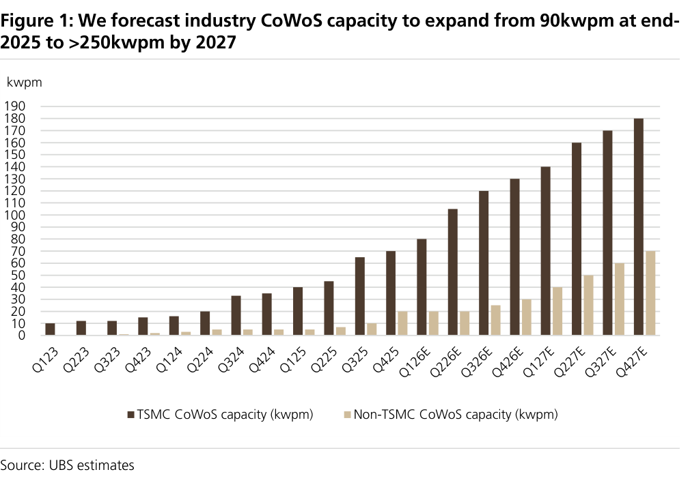

### 解讀摘要
產業 CoWoS 季度產能自 2025 底約 90kwpm 一路擴張至 2027 底逾 250kwpm（TSMC 由約 180kwpm 主導、Non-TSMC 約 70kwpm 補上）。機制是雲端 AI 對 2.5D die-to-die 先進封裝的結構性需求；意義在於萬潤作為 CoWoS 產線的 underfill/heatsink/AOI 設備供應商，產能擴張直接轉為設備訂單，且 Non-TSMC（ASE 等）份額上升擴大其可及客戶群。

### 表格
| 時點 | 產業 CoWoS 產能 |
|---|---|
| 2025 底 | ~90 kwpm |
| 2026 底 | ~160 kwpm |
| 2027 底 | >250 kwpm（TSMC ~180＋Non-TSMC ~70） |

---

## Fig. 2｜TSMC、ASE、Amkor 先進封裝與設備 capex 走高

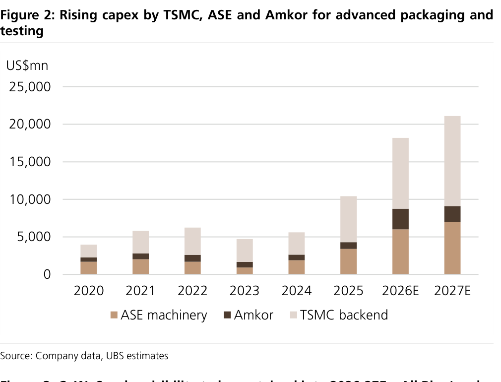

### 解讀摘要
三大先進封裝業者（TSMC、ASE、Amkor）的先進封裝與設備資本支出同步上行，是 Fig.1 產能擴張的資金面佐證。對萬潤的意義：客戶 capex 上行＝後段設備採購上行；Amkor（承接 Intel EMIB-T 外包）亦是潛在新增客戶。

---

## Fig. 3｜CoWoS 訂單能見度延續至 2026–27，支撐萬潤營收

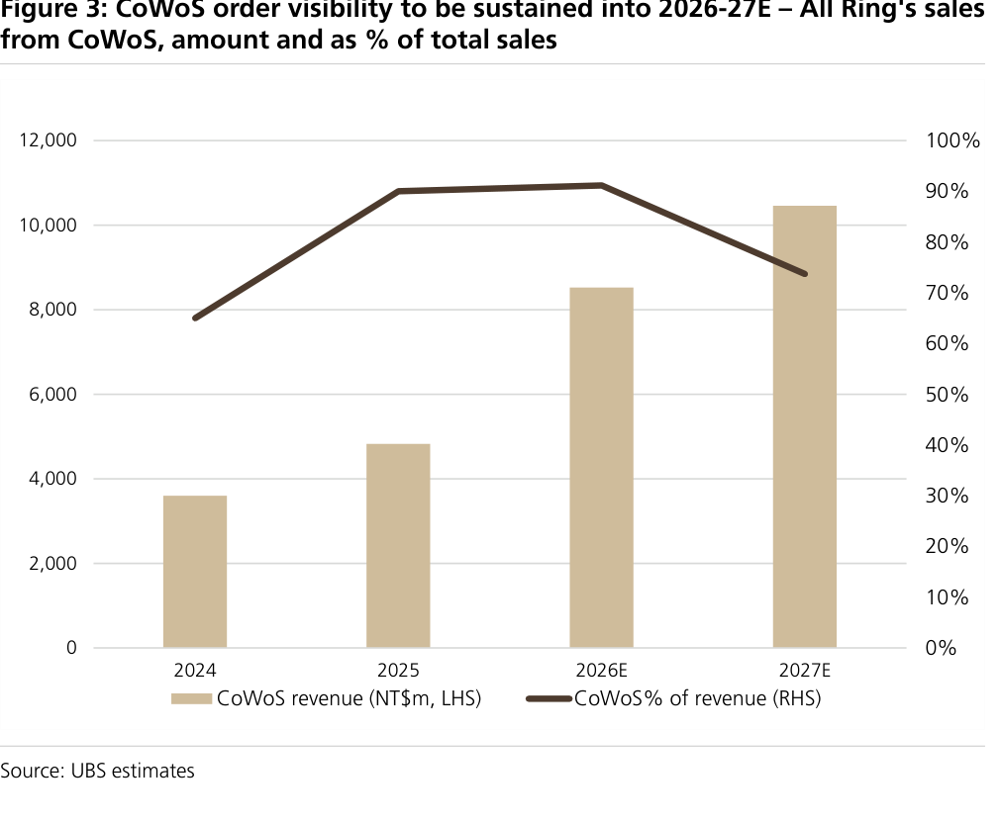

### 解讀摘要
CoWoS 訂單能見度延伸至 2026–27，對照萬潤的營收走勢，顯示其近期營收成長（2026 SEMI +78%）主要由 CoWoS 設備訂單支撐、能見度高。這是「成長真實性」的核心證據，降低短期營收不確定性。

---

## Fig. 4｜CoPoS（FO PLP）vs CoWoS 面積利用率

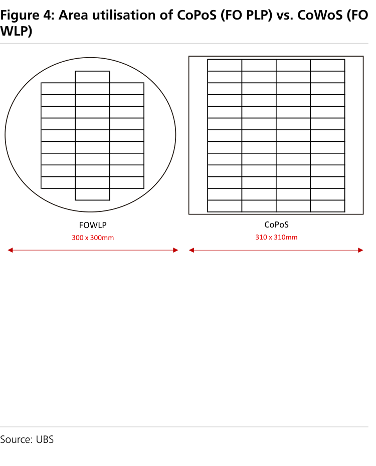

### 解讀摘要
CoPoS（採 FO PLP 面板級）相較 CoWoS（晶圓級）具更高的面積利用率——面板矩形拼版浪費少於圓形晶圓。意義：CoPoS 單位面積可產出更多封裝體，是產業從晶圓級轉向面板級的根本經濟誘因，也是萬潤設備 ASP 升級的技術基礎。

---

## Fig. 5｜CoPoS 可採用更大載板尺寸

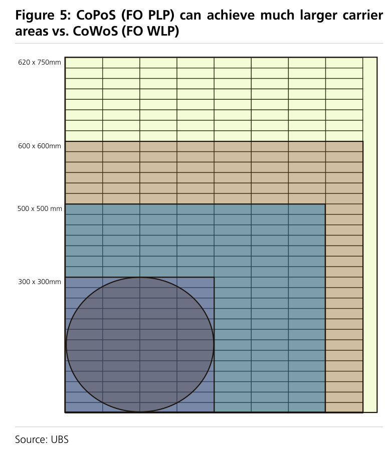

### 解讀摘要
CoPoS（FO PLP）可使用遠大於 CoWoS 晶圓的矩形載板，單批處理面積大增。對設備商的含意：更大載板需要更高規格的搬運、對位與檢測設備，推升萬潤單機 ASP（報告估 CoPoS 使 ASP 提升 15%+）。

---

## Fig. 6｜每 1 kwpm 產能的營收機會：CoWoS vs CoPoS

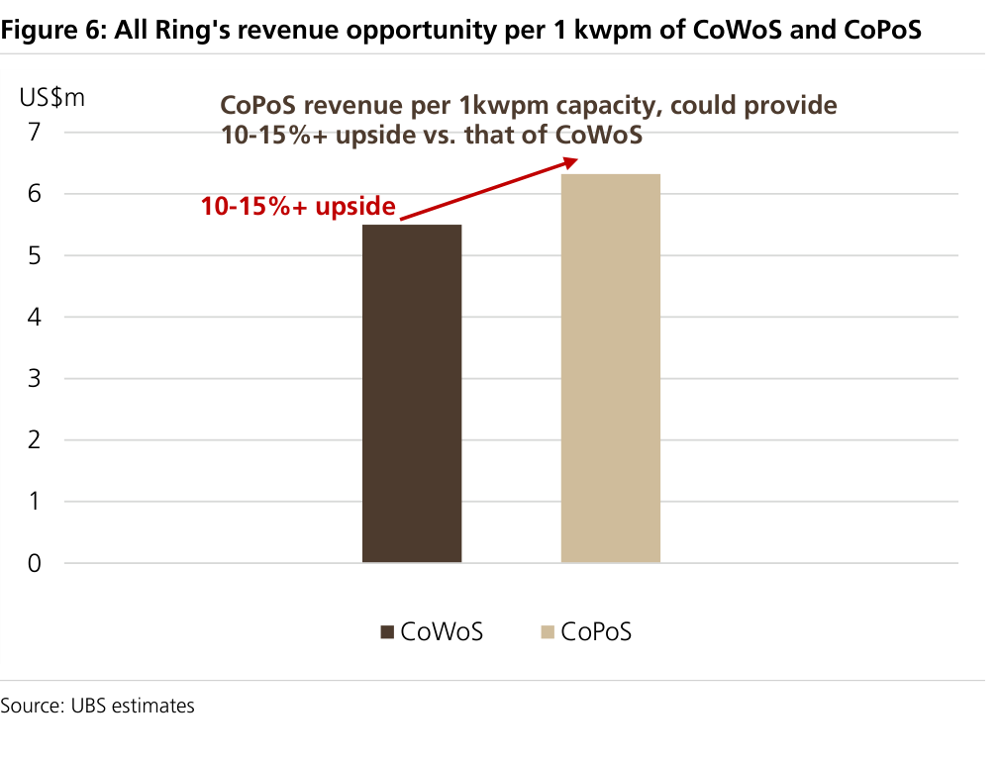

### 解讀摘要
萬潤每 1 kwpm 產能對應的營收機會：CoWoS 約 US\$5.5m、CoPoS 約 US\$6.3m，CoPoS 高出 10–15%+。機制＝CoPoS 更大載板與更高規格設備使單位產能的設備採購金額提升。意義：產業從 CoWoS 往 CoPoS 遷移時，即使產能單位數相同，萬潤的營收池仍會擴大——這是「技術升級驅動 ASP」的量化根據。

### 表格
| 技術 | 每 1 kwpm 營收機會 |
|---|---|
| CoWoS | ~US\$5.5m |
| CoPoS | ~US\$6.3m（+10–15%） |

---

## Fig. 7｜萬潤 SEMI 營收結構（CoWoS/CoPoS/SoIC/CPO/其他）2024–28E

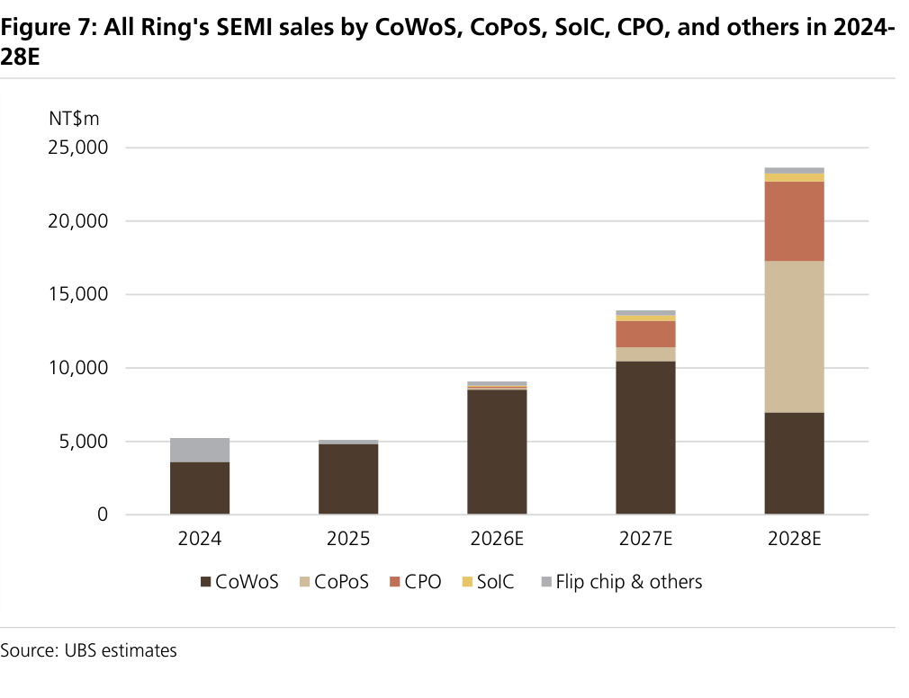

### 解讀摘要
萬潤 SEMI 營收由 2024 約 NT\$5,200m 成長至 2028E 約 NT\$23,500m；結構上 2024–26 幾乎全為 CoWoS，2027E 起 CoPoS、CPO 明顯挹注，2028E CoPoS 躍升為最大單一來源（約 NT\$10,000m）、CPO 約 NT\$5,000m。意義：成長引擎自單一 CoWoS 分散到 CoPoS/CPO/SoIC 多引擎，降低對 CoWoS 循環的依賴——這是「CoWoS 見頂後成長能否延續」問題的直接回答。

### 表格
| 年度 | SEMI 營收（NT\$m，視覺估算） | 主結構 |
|---|---|---|
| 2024 | ~5,200 | CoWoS＋Flip chip |
| 2025 | ~4,900 | CoWoS |
| 2026E | ~9,000 | CoWoS 為主 |
| 2027E | ~14,000 | CoWoS＋CoPoS＋CPO |
| 2028E | ~23,500 | CoPoS 最大＋CPO＋CoWoS |

> **洞察一**：2028E CoPoS＋CPO 合計約 NT\$15,000m、占 SEMI 營收逾六成，等於萬潤未來三年的增量幾乎全由「非 CoWoS 新技術」貢獻；CoWoS 反而自 2027 高點回落——投資這檔的核心其實是 CoPoS/CPO 放量的執行力，而非 CoWoS 本身。

---

## Fig. 8｜Nvidia CPO 封裝佈局與主要供應商

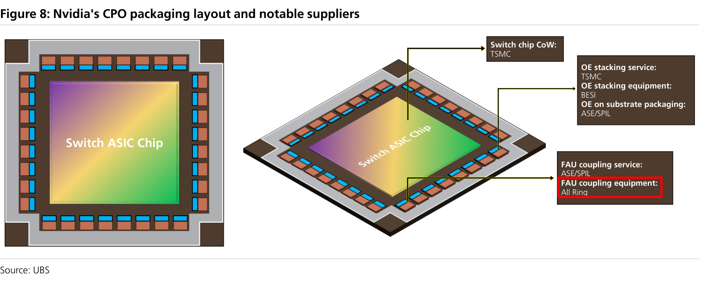

### 解讀摘要
Nvidia CPO 封裝的結構佈局與各環節主要供應商地圖，說明 CPO（共同封裝光學）如何整合光引擎與交換晶片。對萬潤的意義：其切入點在 FAU（fiber array unit）與光引擎的耦合設備——CPO 供應鏈中屬設備/自動化環節，機器人手臂與軟體演算法是其相對 Sungho 的優勢所在。

---

## Fig. 9｜萬潤 CPO FAU 耦合設備營收預估

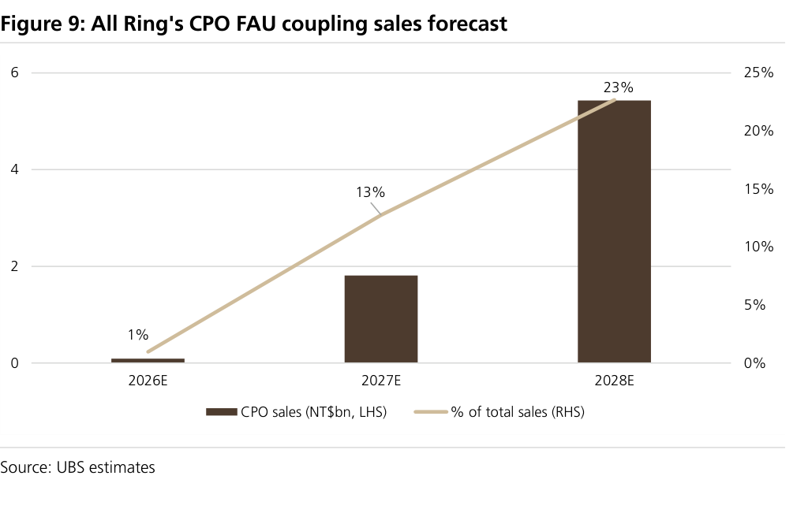

### 解讀摘要
萬潤 CPO FAU 耦合設備營收自 2026E 約 NT\$0.1bn（占 1%）成長至 2027E 約 NT\$1.8bn（13%）、2028E 約 NT\$5.4bn（23%）。對應出貨 100 台（2027）、300 台（2028）FAU 耦合設備。意義：CPO 是本首評相對市場最具差異化的成長引擎，也是估值上行的關鍵變數。

### 表格
| 年度 | CPO 設備營收 | 占總營收 | FAU 耦合設備出貨 |
|---|---|---|---|
| 2026E | ~NT\$0.1bn | 1% | — |
| 2027E | ~NT\$1.8bn | 13% | 100 台 |
| 2028E | ~NT\$5.4bn | 23% | 300 台 |

> **值得驗證**：2028E 23% 營收來自 CPO 且繫於「300 台 FAU 耦合設備出貨＋領先 Sungho」。若 CPO 商用化延後或份額被瓜分，這 23%（約 NT\$5.4bn）大部分落空，2028E EPS（較共識高 18%）將顯著下修——這是全案最大單一估算風險。

---

## Fig. 10｜SEMI 已占營收 >95%，SEMI 絕對金額持續放大

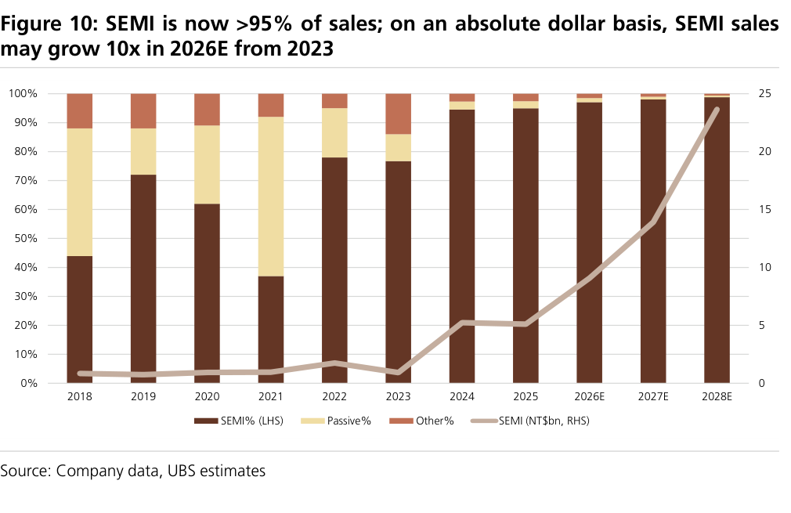

### 解讀摘要
萬潤 SEMI（半導體設備）業務已占營收逾 95%，且絕對金額持續攀升——公司已從早期被動元件設備商轉型為純半導體後段設備商。意義：營收結構高度綁定先進封裝 capex 循環，純度高（既是題材集中度，也是週期曝險）。

---

## Fig. 11｜萬潤 Piezo dispenser（UV 膠/underfill 點膠設備）

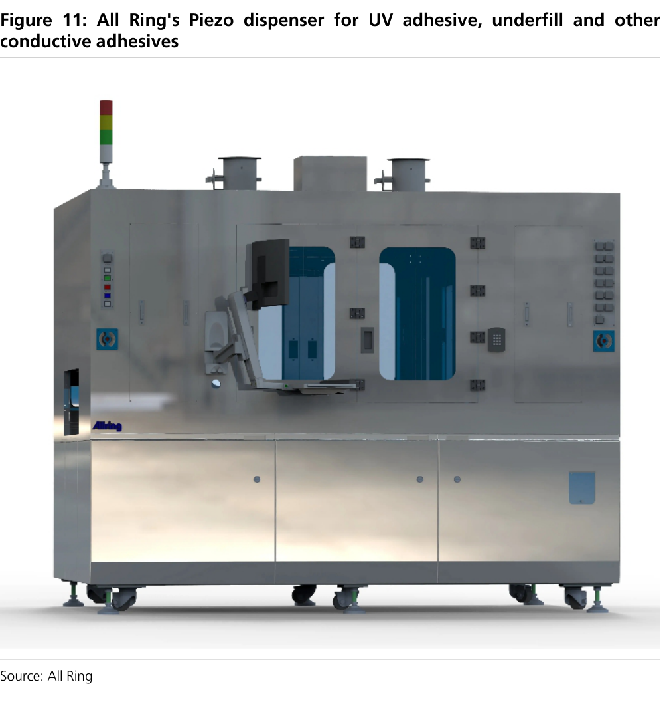

### 解讀摘要
萬潤的 Piezo（壓電）點膠設備，用於 UV 膠、underfill（底部填充）與導電膠等製程——CoWoS/先進封裝的關鍵設備之一。展示其在點膠環節的產品實體。

---

## Fig. 12｜萬潤 Heatsink placement 散熱片貼合設備

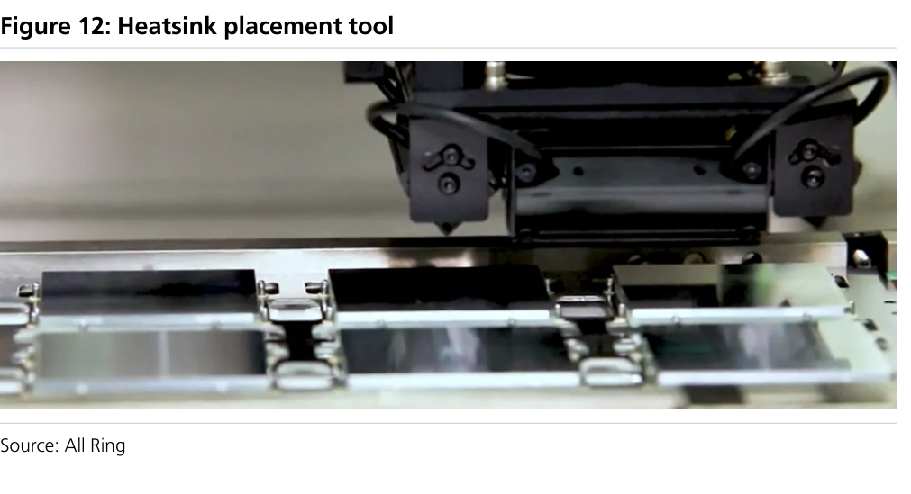

### 解讀摘要
散熱片貼合設備，用於先進封裝的 heatsink attach 製程，是萬潤供應 TSMC/ASE CoWoS 產線的主力機種之一。

---

## Fig. 13｜萬潤 AOI 自動光學檢測設備

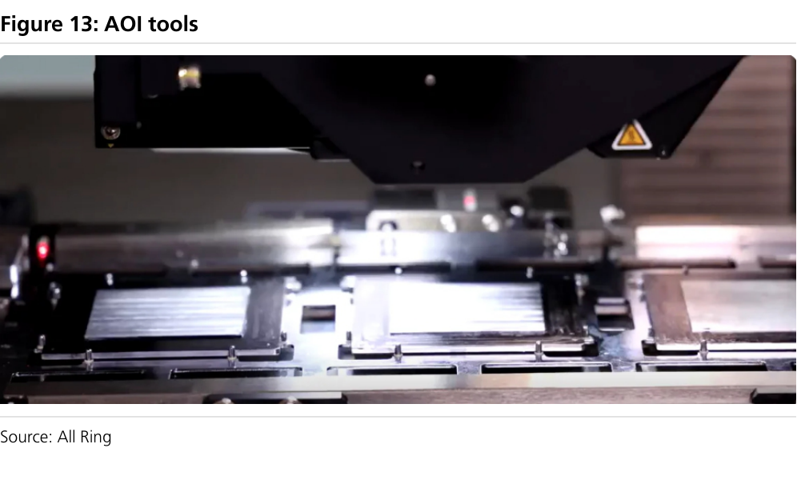

### 解讀摘要
AOI（自動光學檢測）設備，用於封裝製程的品質檢測。點膠、貼合、檢測三大機種共同構成萬潤在 CoWoS 產線的設備組合，也是其能隨新技術（CoPoS/CPO）升級 ASP 的產品基礎。

---

## Fig. 19｜萬潤 vs Grand Process（GPTC）12 個月前瞻 PE

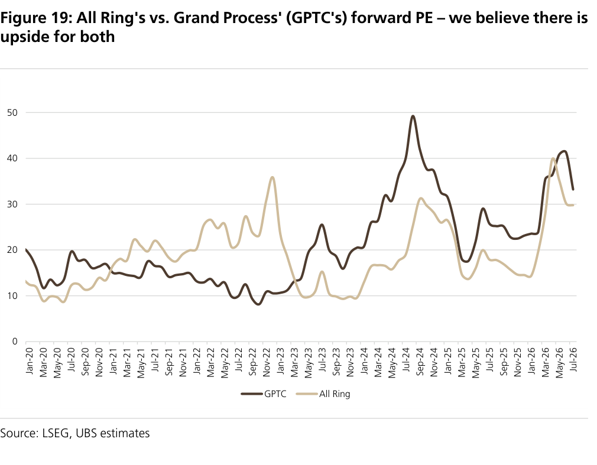

### 解讀摘要
萬潤與同業 Grand Process（GPTC）的 12 個月前瞻 PE 對照（2020–2026）：目前萬潤約 30x、GPTC 約 33x，回檔後萬潤交易於約 21x 2027E PE，較先進封裝同業折價。UBS 認為兩者皆有上行空間，市場低估 CPO/CoPoS/SoIC 新驅動。目標價 NT\$1,550 對應 25x 2027–28E 平均 PE（接近歷史區間高端，以 35% 長期 EPS CAGR 合理化）。

> **洞察二**：目標價 25x vs 現價 21x（2027E PE）的差距不大，65% 上行主要來自「EPS 上調」而非「本益比擴張」——即投資報酬繫於 CoPoS/CPO 帶動的 EPS 兌現（2028E EPS 77.90，2026–28E 近乎翻三倍），而非單純估值修復。

---

## 相關個股清單

| 類別 | 公司 | Ticker | 評等 | 備註 |
|---|---|---|---|---|
| 封裝設備 | 萬潤 All Ring | 6187 TT | Buy（首評，PT NT\$1,550） | CoWoS→CoPoS→CPO 設備份額贏家 |
| 對照/競爭 | Grand Process GPTC | 3131 TT | — | 估值對照同業 |
| CPO 設備競爭 | Sungho（韓） | — | — | FAU 耦合設備主要對手 |
| 客戶 | TSMC / ASE / Amkor | 2330／3711 TT | — | CoWoS/先進封裝設備客戶 |
