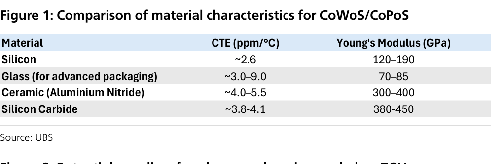
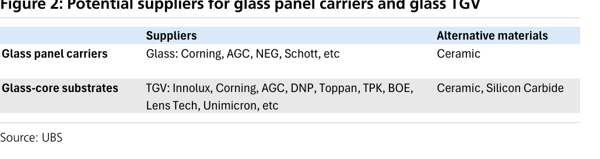

# UBS｜玻璃於先進封裝：台灣面板廠近期上行有限

**券商**：UBS  
**分析師**：Jerry Su、Annie Chen  
**日期**：2026-07-27  
**主題**：Glass in advanced packaging — 台灣面板廠在玻璃載板/interposer/玻璃核心基板的機會評估  
**評級**：主題報告（APAC Technology）  
<a href="https://layx.uk/dl?g=產業&b=UBS&d=20260727&h=Glass-Advanced-Packaging">📎 下載 PDF</a>

---

## 報告總結

UBS 對台灣面板廠切入先進封裝玻璃機會抱持較保守看法。三大機會中：(1) **玻璃載板**（CoPoS 用）——面板廠不易供應，主由 Corning/AGC/NEG/Schott 等玻璃廠主導，且產業正評估以**陶瓷**取代玻璃作次世代載板；(2) **玻璃 interposer**——技術門檻高（面板製程線寬約 5um vs 晶圓廠次微米）、成本結構不佳，近期採用不太可能；(3) **玻璃核心基板（glass-core substrate）**——面板廠最可行的切入點（可運用玻璃處理 know-how 供應 TGV 面板給 ABF 基板廠），但仍有製程複雜、翹曲、尺寸放大後可靠度、替代材料競爭等挑戰。

雖然 UBS 估先進封裝 TAM 自 2026 的 US\$19bn 擴至 2030 的 US\$122bn（CAGR 59%），但預期未來數年先進封裝對台灣面板廠（AUO 友達、Innolux 群創）的營收貢獻仍有限，**不會是有意義的成長引擎**。與 MS（07-26）較樂觀的看法相比，UBS 明顯保守。註：TSMC 已在 JPCA 揭露與 Ibiden、Innolux 合作開發玻璃核心基板。

---

## UBS 完整投資邏輯鏈

| 論點層次 | Exhibit | 內容 |
|---|---|---|
| TAM 擴張 | — | 先進封裝 TAM US\$19bn(2026)→US\$122bn(2030)，CAGR 59% |
| 載板材料 | 1 | 玻璃 Young's Modulus 最低（70–85），抗翹曲不如陶瓷（300–400） |
| 載板競爭 | 1,2 | 陶瓷（AlN）CTE 近矽、剛性 4–5x → 或取代玻璃載板；玻璃廠已主導 |
| interposer | — | 面板線寬 ~5um vs 晶圓次微米，門檻過高、近期不採用 |
| 玻璃核心基板 | 2 | 面板廠最可行切入點（供 TGV 面板），但挑戰多、量產尚遠 |
| **結論** | 報告封面 | **TAM 雖大，但台灣面板廠貢獻未來數年仍有限、非成長引擎** |

> **報告最大邏輯缺口**：TSMC CoPoS 初期採 310x310mm 玻璃面板載板，但 UBS 認為長期可能轉向陶瓷；玻璃載板究竟是「過渡」還是「長期」方案，決定面板廠（及玻璃廠）的可及空間，報告未給明確時程。

---

## 報告核心觀點

| 主題 | UBS 觀點 | 市場共識/他行 | 是否 Contra-Consensus |
|---|---|---|---|
| 面板廠切入玻璃 | 近期上行有限、非成長引擎 | MS(07-26) 較樂觀看進展 | 是（更保守） |
| 玻璃載板 | 面板廠難供應，玻璃廠主導、陶瓷或取代 | 期待面板廠受惠 | 是 |
| 玻璃 interposer | 近期採用不太可能 | — | — |
| 玻璃核心基板 | 最可行切入點，但量產尚遠 | 視為重大機會 | 部分 |

**個股/生態**：面板廠 AUO 友達、Innolux 群創（切入有限）；玻璃廠 Corning/AGC/NEG/Schott 主導載板；玻璃核心基板生態 Ibiden、DNP、Toppan、TPK、BOE、Lens Tech

---

## Fig. 1｜CoWoS/CoPoS 載板材料特性對比

### 解讀摘要
玻璃雖 CTE 可調（~3.0–9.0）但 Young's Modulus 僅 70–85 GPa（四種材料最低），抗翹曲能力弱；陶瓷（氮化鋁 AlN）CTE 近矽（~4.0–5.5）且剛性 300–400 GPa（約玻璃 4–5x）、碳化矽更達 380–450。機制：隨 RDL 層數增加、封裝複雜度上升，翹曲控制愈關鍵，高剛性的陶瓷更能抑制翹曲——這是 UBS 判斷「陶瓷或取代玻璃成次世代 CoWoS 載板」、進而壓縮面板廠玻璃載板機會的技術根據。

### 表格
| 材料 | CTE (ppm/°C) | Young's Modulus (GPa) |
|---|---|---|
| Silicon | ~2.6 | 120–190 |
| Glass（先進封裝用） | ~3.0–9.0 | 70–85 |
| Ceramic（氮化鋁 AlN） | ~4.0–5.5 | 300–400 |
| Silicon Carbide | ~3.8–4.1 | 380–450 |

> **洞察一**：玻璃在四種載板材料中剛性最低，正是其在高層數/大尺寸先進封裝被質疑的核心弱點；面板廠即使切入玻璃載板，也面臨「材料本身可能被陶瓷取代」的上位風險——這是比「面板廠 vs 玻璃廠競爭」更根本的結構問題。

---

## Fig. 2｜玻璃面板載板與玻璃 TGV 的潛在供應商

### 解讀摘要
玻璃面板載板與玻璃 TGV（through-glass via）的潛在供應商地圖，涵蓋 Corning、AGC、NEG、Schott（玻璃載板主導者）與 DNP、Toppan、TPK、BOE、Lens Tech、Innolux 等玻璃核心基板/TGV 生態參與者。意義：玻璃載板環節既有玻璃大廠盤據、差異化有限，台灣面板廠較可能的著力點在 TGV 面板（供 ABF 基板廠），而非載板本身。

---

## 相關個股清單

| 類別 | 公司 | Ticker | 備註 |
|---|---|---|---|
| 面板 | 友達 AUO | 2409 TT | 玻璃載板切入機會有限 |
| 面板 | 群創 Innolux | 3481 TT | 與 TSMC/Ibiden 合作玻璃核心基板；最可行切入點 |
| 基板 | Ibiden | 4062 JP | TSMC 玻璃核心基板合作方 |
| 玻璃廠 | Corning／AGC／NEG／Schott | — | 玻璃載板主導供應商 |
| TGV/玻璃生態 | TPK／Lens Tech／BOE／DNP／Toppan | — | 玻璃核心基板/TGV 生態 |
