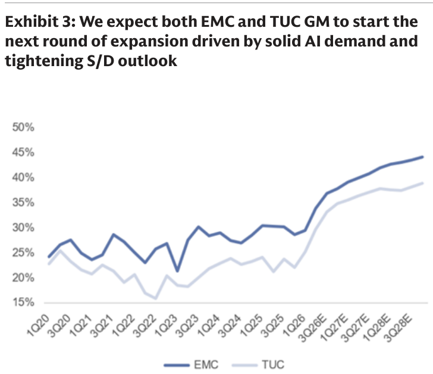
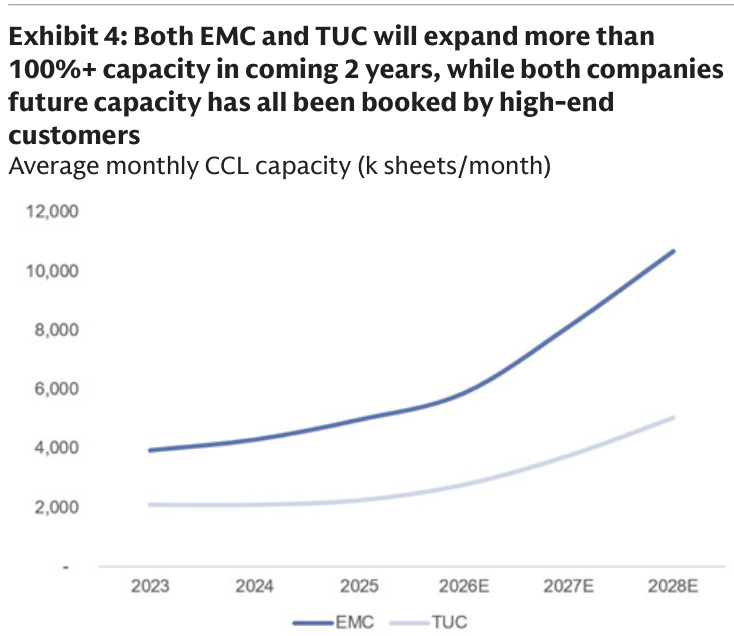

# GS｜台灣 CCL：高階毛利擴張＋2H26 漲價，Buy on EMC & TUC

**券商**：Goldman Sachs  
**分析師**：Chao Wang、Allen Chang、Al Wang  
**日期**：2026-07-29  
**主題**：Taiwan CCL — 高階 CCL 毛利擴張、2H26 漲價，2028 後新產能已被 AI/LEO/Switching 客戶預訂滿  
**評級**：Buy on EMC（台光電 2383）& TUC（台燿 6274）  
<a href="https://layx.uk/dl?g=產業&b=GS&d=20260729&h=CCL">📎 下載 PDF</a>

---

## 報告總結

GS 推薦高品質 CCL 龍頭，Buy 台光電（EMC）與台燿（TUC）。2Q26 兩家核心營業利益均符合 GS（GS 為街上最樂觀）、且高於 BBG 共識（EMC +18%、TUC +7%），毛利率/營業利益率大幅季增，受惠高階 M8 CCL 早期放量與 10–60% 漲價。3Q26 展望：EMC 營收季增 21%、毛利率 33.9%→36.8%（基板 CCL 業務 3Q 過驗證、4Q 起貢獻，量產後毛利上看 40–50%+）；TUC 營收季增 23%、毛利率 +3.4ppt（泰國新廠提前爬坡，Trainium 3 市佔 1H26 的 10–20% 升至 2H26 的 30–40%）。

投資主軸：2H26 及之後漲價續行推升毛利＋2028 後新產能已被 AI/LEO/Switching 客戶全數預訂。M7 及以下 CCL 2H26 每季漲 10–40%+；高階 M8+ 自 3Q26 末起漲 10%+。4Q26 傳統消費電子放緩（占低階 CCL 需求 90%+）將促使資金自低階流向高階 CCL 玩家。長線 AI 需求續升使高品質高階產能更短缺，ASP 續揚。

---

## GS 完整投資邏輯鏈

| 論點層次 | Exhibit | 內容 |
|---|---|---|
| 需求結構 | — | 高階 M8 CCL 受 AI server 早期放量拉動，2Q26 起毛利擴張 |
| 漲價 | — | M7 以下每季漲 10–40%+；M8+ 自 3Q26 末漲 10%+ |
| 毛利上行 | 3 | EMC/TUC 毛利率進入新一輪擴張（2028E EMC ~44%/TUC ~39%） |
| 供給吃緊 | 4 | 兩家未來 2 年產能擴逾 100%，但全被高階客戶預訂 |
| 分化 | — | 4Q26 消費放緩，資金自低階流向高階 CCL |
| **結論** | 報告封面 | **Buy on EMC & TUC（高品質高階 CCL 龍頭）** |

> **報告最大邏輯缺口**：長線論點繫於「AI 需求續升使高階產能持續短缺」；若 AI server 建置放緩或高階 CCL 產能超建，漲價與 ASP 擴張的持續性將受挑戰。

---

## 報告核心觀點

| 主題 | GS 觀點 | 市場共識 | 是否 Contra-Consensus |
|---|---|---|---|
| 高階 CCL 毛利 | 2H26 漲價續行、毛利續揚 | 擔憂需求可持續性 | 部分 |
| 高階 vs 低階 | 高階定價/毛利展望優於中低階 | — | — |
| 產能 | 未來 2 年擴逾 100%、全被高階客戶預訂 | 憂心供給過剩 | 是 |
| 個股 | Buy EMC & TUC | — | — |

**個股偏好**：台光電 EMC（2383，Buy）、台燿 TUC（6274，Buy）

---

## Exhibit 3｜EMC 與 TUC 毛利率進入新一輪擴張

### 解讀摘要
EMC 與 TUC 毛利率（1Q20–3Q28E）在 2022–23 谷底約 15–25% 後，自 2026 起進入 AI 需求驅動、供需吃緊的新一輪擴張：EMC 由約 30% 升至 2028E 約 44%、TUC 升至約 39%。機制是高階 M8+ CCL 占比提升與漲價；意義在於 CCL 龍頭的獲利品質結構性上移，且 EMC 領先 TUC。

### 表格
| 公司 | 2026 毛利率（約） | 2028E 毛利率（約） |
|---|---|---|
| EMC（台光電） | ~30% → 上行 | ~44% |
| TUC（台燿） | ~28% → 上行 | ~39% |

---

## Exhibit 4｜EMC 與 TUC 未來 2 年產能擴逾 100%、且全被高階客戶預訂

### 解讀摘要
月均 CCL 產能（k sheets/月）：EMC 自 2023 約 3,900 增至 2028E 約 10,700（約 +175%）、TUC 自約 2,100 增至約 5,000（約 +140%），兩家未來 2 年皆擴逾 100%。關鍵在於這些新產能已被高階客戶全數預訂——供給雖大增但非過剩，反而支撐漲價與高稼動。

### 表格
| 公司 | 2023 產能（k/月） | 2028E 產能（k/月） | 增幅 |
|---|---|---|---|
| EMC | ~3,900 | ~10,700 | ~+175% |
| TUC | ~2,100 | ~5,000 | ~+140% |

> **洞察一（配合 Exhibit 3）**：產能擴逾 100% 卻仍毛利擴張，關鍵在「新產能全被高階客戶預訂」——供給增量鎖定在高毛利 M8+ 而非中低階，因此是「量增＋價升＋組合優化」三重同向，而非傳統擴產壓價的週期。這是 GS 對 EMC/TUC 維持 Buy 的核心量化根據。

---

## 相關個股清單

| 類別 | 公司 | Ticker | 評等 | 備註 |
|---|---|---|---|---|
| CCL | 台光電 EMC | 2383 TT | Buy | 高階 M8+ 龍頭，基板 CCL 4Q26 貢獻 |
| CCL | 台燿 TUC | 6274 TT | Buy | 泰國新廠爬坡，Trainium 3 市佔升 |
