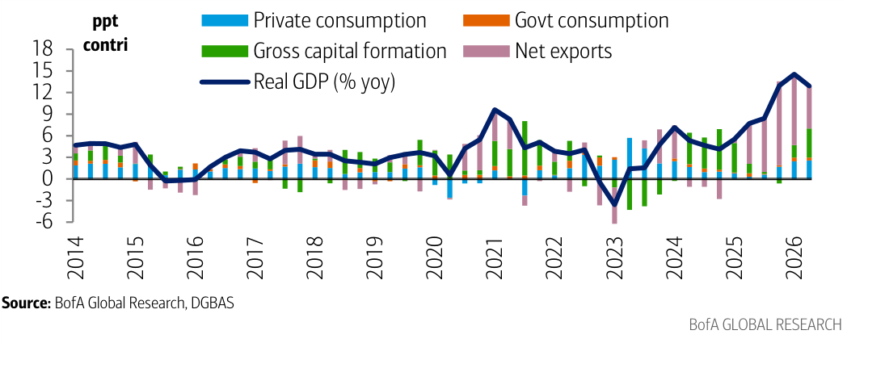
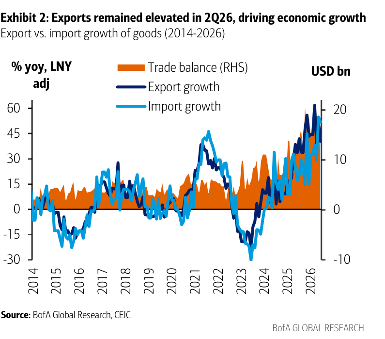
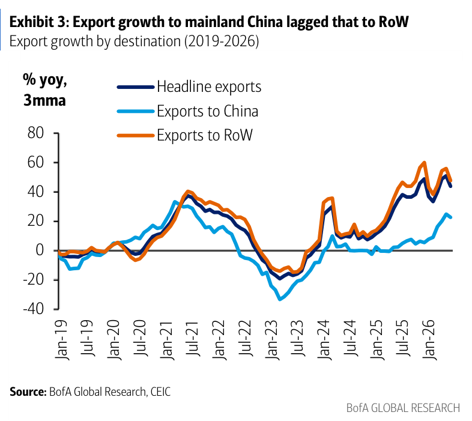
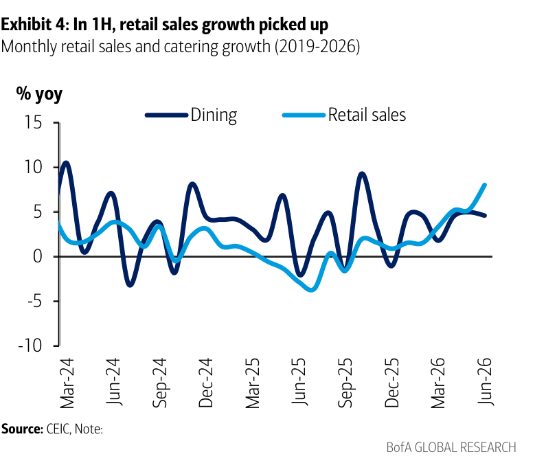
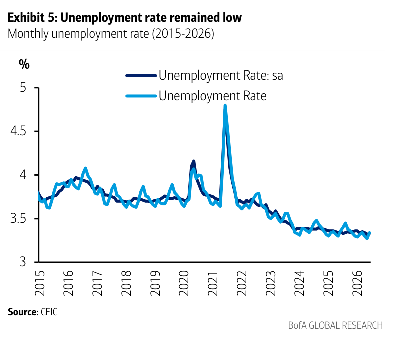

# BofA｜台灣 Watch：2Q GDP — 內需加入 AI 榮景

**券商**：BofA Global Research（美銀美林）  
**分析師**：Anna Zhou、Helen Qiao（China & Asia Economists）  
**日期**：2026-07-31  
**主題**：台灣 2Q26 GDP 解讀 — 成長由「出口單引擎」轉向「出口＋內需」雙引擎，重申 9 月央行升息  
**評級**：總經觀點（無個股評等）  
<a href="https://layx.uk/dl?g=產業&b=BofA&d=20260731&h=Taiwan-2Q-GDP-AI-Boom">📎 下載 PDF</a>

---

## 報告總結

台灣 2Q26 實質 GDP 年增 12.92%，雖較 1Q 的 14.55% 放緩，但大幅優於彭博共識 10.5%；季增年率（saar）9.91%（1Q 6.94%），1H26 年增 13.72%。這份報告的重點不在「成長多強」，而在「成長結構質變」：過去靠 AI 出口單引擎，本季內需貢獻 7ppt 首度超越淨外需的 5.93ppt——資本形成年增 15.14%、民間消費加速至 5.88%，顯示 AI 出口榮景正外溢到企業資本支出與家庭消費。

對投資人而言最直接的可交易結論在政策面：內需轉強讓央行（CBC）更有底氣專注抑制通膨、不必擔心緊縮傷及成長，美銀因此重申 CBC 將於 9 月升息 12.5bp。這對金融股利差與台幣走向具指向性；受惠面則從單一 AI 出口鏈，擴散到內需消費（零售、餐飲、交通通訊、休閒）與資本財（機械設備、IP 投資）。

---

## BofA 完整投資邏輯鏈

| 論點層次 | Exhibit | 內容 |
|---|---|---|
| 成長確認 | 1 | 2Q26 GDP +12.92% yoy，優於共識 10.5% |
| 結構質變 | 1 | 內需貢獻 7ppt 首度超越淨外需 5.93ppt |
| 外需動能 | 2、3 | 出口 +21.64% 續強，但對 RoW 遠強於對中國 |
| 內需動能 | 1、4 | 資本形成 +15.14%、民間消費 +5.88%，零售/餐飲回升 |
| 勞動支撐 | 5 | 失業率維持約 3.3% 低檔，支撐消費 |
| **結論** | 封面 | **重申央行 9 月升息 12.5bp（內需韌性給央行抗通膨空間）** |

> **報告最大邏輯缺口**：升息預測建立在「內需韌性可延續」的假設上；而撐起民間消費的關鍵之一是「股市財富效果」（equity-market wealth effects）。若 AI 出口週期轉弱、股市回檔使財富效果消退，內需動能與升息路徑都可能生變。

---

## 報告核心觀點

| 主題 | BofA 觀點 | 市場共識 | 是否 Contra-Consensus |
|---|---|---|---|
| 2Q26 GDP | +12.92% yoy | 共識 +10.5% | 是（顯著優於共識） |
| 成長結構 | 內需接棒，雙引擎更均衡 | 市場多聚焦 AI 出口單引擎 | 是 |
| 央行 9 月會議 | 升息 12.5bp | 分歧 | 偏鷹 |

**受惠方向**：內需/消費（零售、餐飲、交通通訊、休閒）、資本財（機械設備、IP 投資）；金融股受惠潛在升息（利差擴張）。

---

## Exhibit 1｜2Q26 成長由出口與內需共同驅動

### 解讀摘要
本報告的核心圖：2026 年 GDP 年增衝上約 13-15%，且綠色（資本形成）與粉色（淨外需）貢獻同時放大。對比 2021 上一波高峰幾乎由淨外需（粉色）獨撐，本次綠色資本形成明顯加厚——成長引擎由「純出口」轉為「出口＋投資」雙軌。內需貢獻 7ppt 首度超越淨外需 5.93ppt，是 2014 年以來少見的均衡結構，代表台灣對單一 AI 出口週期的依賴度下降、成長品質提升。

### 表格
| 成長貢獻（ppt） | 2Q26 | 1Q26 |
|---|---|---|
| 內需 | 7.00 | 4.22 |
| 淨外需 | 5.93 | 10.33 |
| **實質 GDP（% yoy）** | **12.92** | **14.55** |

> **洞察一**：成長結構反轉——1Q 淨外需:內需約 2.4:1，2Q 逆轉為 0.85:1。同一份數據裡「GDP 放緩但結構轉佳」並存，市場若只看 headline 放緩會低估這次成長的韌性。

---

## Exhibit 2｜出口 2Q26 維持高檔、驅動成長

### 解讀摘要
出口年增與進口年增雙雙攀至約 +50-60%（2026 右側），為 2014 年以來最強一段；但進口 +18.27% 同步走高，使淨出口對成長的貢獻較 1Q 縮小。橘色貿易餘額（RHS）維持正值、擴張趨緩。關鍵在於：高進口不是需求轉弱，而是中間投入與資本設備需求旺盛。

> **原文補充**：分析師指進口攀升反映對「中間投入與資本設備」的強勁需求——本身是資本形成／未來產能擴張的領先訊號，與 Exhibit 1 資本形成 +15.14% 相互印證。

> **洞察二**：出口與進口同步飆升，是「AI 供應鏈在台灣加值再出口」放大的證據；淨出口貢獻縮小不代表外需轉弱，而是進口的資本財日後會轉化為產能與再出口。

---

## Exhibit 3｜出口對中國落後於對其他地區

### 解讀摘要
對其他地區（RoW，橘線）出口年增領先衝上約 55%，Headline（深藍）居中約 45%，對中國（淺藍）明顯落後、僅約 20%。這波出口榮景由非中國市場（美系 AI 供應鏈）主導，台灣出口結構持續往歐美 AI 客戶集中、對中國敏感度下降。

> **洞察三**：出口動能與地緣脫鉤——對 RoW 與對中國的成長差距擴大到約 35ppt，意味這輪台灣出口景氣即使中國需求疲弱仍能維持，降低了地緣/關稅對台灣總體的傳導風險。

---

## Exhibit 4｜上半年零售銷售回升

### 解讀摘要
零售銷售（淺藍）年增自 2025 年中的負值一路回升至 2026 年中約 +8%，餐飲（Dining，深藍）維持震盪但轉正。內需消費回溫，呼應民間消費加速至 +5.88%，部分來自股市財富效果與交通/通訊/休閒支出增加。

> **洞察四（配合 Exhibit 1）**：零售回升為「內需接棒」提供月頻微觀佐證——不是單季統計波動，而是趨勢確認，強化 Exhibit 1「內需貢獻超越外需」的可持續性。

---

## Exhibit 5｜失業率維持低檔

### 解讀摘要
失業率（季調，深藍）自 2021 疫情尖峰約 4.8% 後穩步下滑至 2026 約 3.3%，為歷史低檔。緊俏的勞動市場支撐薪資與家庭消費，是內需韌性的結構底層。

> **洞察五**：低失業＋股市財富效果＝民間消費雙支撐；這也是美銀認為央行可安心升息抗通膨（而不傷成長）的關鍵依據，與封面「9 月升息」結論一致。

---

## 相關個股／受惠方向

| 類別 | 受惠邏輯 | 備註 |
|---|---|---|
| 金融股 | 央行 9 月升息 12.5bp → 利差擴張 | 報告未點名個股 |
| 內需消費 | 零售/餐飲回升、民間消費 +5.88% | 零售、餐飲、交通通訊、休閒 |
| 資本財 | 資本形成 +15.14%（機械設備、IP） | 自動化、工具機、設備 |

> 本篇為總體經濟（GDP）報告，無個股評等；上表為依報告論點推導的受惠方向，非報告明列標的。
