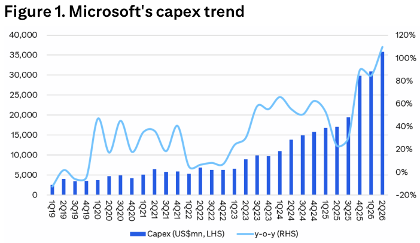
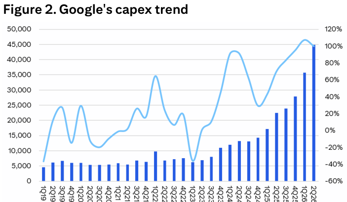
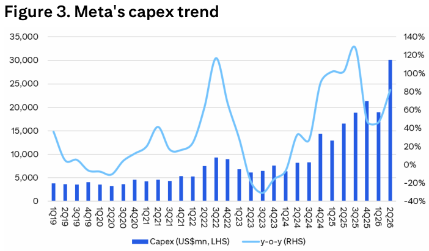
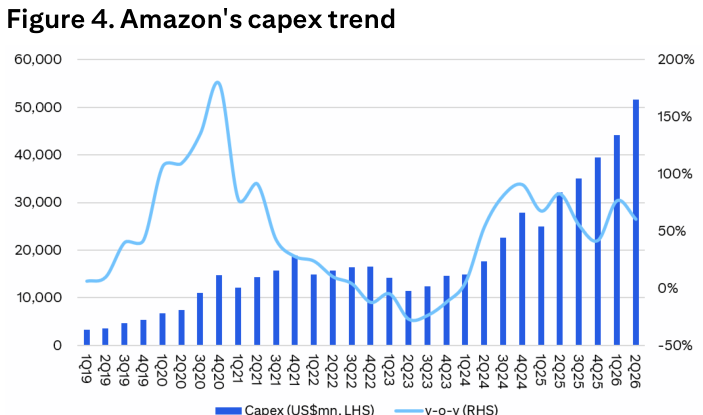

# Citi｜台灣半導體：財報季期中回顧

**券商**：Citi Research（花旗）  
**分析師**：Laura (Chia Yi) Chen、Jack Chen、Michael Hung、Nicholas Lai  
**日期**：2026-08-02（封面標示 08-03 ET，系統日期以檔名 08-02 為準）  
**主題**：台灣半導體 2Q26 財報季期中回顧 — AI 投資循環正橫向擴散至整個硬體生態系  
**評級**：偏正面（AI 基建投資仍處多年擴張早期）  
<a href="https://layx.uk/dl?g=產業&b=Citi&d=20260802&h=Taiwan-Semiconductors">📎 下載 PDF</a>

---

## 報告總結

台灣科技財報季走到一半，Citi 這份 Flash 的核心訊息是：近期市場震盪之際，供應鏈公司反而集體確認「AI 投資循環正從運算橫向擴散到整個硬體生態系」。撰寫時機是趁 2Q26 財報密集公布、且美系 CSP 才剛公布財報，把「上游雲端資本支出 → 台灣供應鏈受惠」的傳導鏈重新盤點一次。Citi 觀察到供應鏈普遍上調 guidance、增加資本支出、或對 2027 AI 需求能見度轉樂觀，強化其「AI 基建投資仍處多年擴張早期」的看法。

四張圖是核心證據——微軟、Google、Meta、Amazon 的季度資本支出全數在 2Q26 創新高、YoY 大幅上揚，且管理層一致把近期 FCF 壓力視為「加速部署的自然結果」而非基本面惡化。受惠面正從大規模訓練叢集，擴大到企業 AI 與推論基建，需求外溢到 custom ASIC、網通、先進封裝、記憶體與電源。台廠受益排序：TSMC（製造龍頭、CoWoS 續緊）＞ ASEH（封測複雜度上升）＞ MediaTek／GUC（ASIC 動能）＞ UMC（特殊製程切入）＋ Delta（系統電源含量提升）。

---

## Citi 完整投資邏輯鏈

| 論點層次 | Figure | 內容 |
|---|---|---|
| 需求源頭確認 | 1-4 | 四大 US CSP capex 2Q26 同創新高、YoY 大幅上揚 |
| FCF 疑慮化解 | 1-4 | 管理層視近期 FCF 壓力為加速部署的自然結果，非基本面惡化 |
| 需求結構擴散 | 封面 | 從訓練叢集擴至企業 AI／推論，外溢 ASIC／網通／封裝／記憶體／電源 |
| 供給緊俏 | 封面 | TSMC CoWoS 續售罄、上修全年 +40% YoY、capex US\$60-64bn |
| 受惠擴散 | 封面 | UMC 特殊製程切入、ASEH 封測升級、MTK/GUC ASIC、Delta 電源 |
| **結論** | 封面 | **AI 基建投資仍處多年擴張早期，受惠面將遠超運算延伸至網通與電源** |

> **報告最大邏輯缺口**：報告以「上游 capex 創高」推論台廠全面受惠，但未量化各台廠營收對 CSP capex 的敏感度（彈性係數），也未討論若 2027 CSP capex 增速放緩時哪些環節最先受衝擊——受惠排序偏定性。

---

## 報告核心觀點

| 主題 | Citi 觀點 | 市場共識／疑慮 | 是否 Contra-Consensus |
|---|---|---|---|
| CSP FCF 壓力 | 加速部署的自然結果，非基本面惡化 | 市場擔憂 capex 侵蝕 FCF | 是（正面解讀） |
| AI 投資階段 | 多年擴張早期 | 部分擔憂見頂 | 是 |
| 受惠廣度 | 從運算擴散至網通、電源 | 多聚焦 GPU／運算 | 是 |
| TSMC 2026 | 上修全年 +40% YoY、capex US\$60-64bn | — | 上修 |
| UMC | 特殊製程（SiPh／AI power IC）切入 AI | 視 UMC 為 AI 落後者 | 偏正面 |

**受惠排序**：TSMC ＞ ASEH ＞ MediaTek／GUC ＞ UMC、Delta。  
**個股偏好**：報告提及個股評等多為 Buy（1）——TSMC(2330)、UMC(2303)、ASEH(3711)、Delta(2308)、MediaTek(2454)、GUC(3443, 1H=Buy/High Risk)。

---

## Figure 1｜Microsoft 資本支出趨勢

### 解讀摘要
微軟季度 capex 從 2024 起加速攀升，2Q26 達約 US\$36bn 創新高、YoY 約 +110%——這是 2019 年以來最陡的一段，且 4Q25-2Q26 連三季跳升，顯示 AI 基建投資不是單季衝刺而是趨勢性加速。微軟明確重申或上調創紀錄的資本支出計畫，是「CSP 資本支出未見頂」的最直接證據。

> **原文補充**：微軟管理層將近期 FCF 壓力定調為「加速基建部署的自然結果」，而非基本面惡化；投資重心也從大規模訓練叢集轉向企業 AI 與推論基建。

### 表格
| 指標 | 值（2Q26） |
|---|---|
| Capex（US\$mn，LHS） | 約 36,000（歷史新高） |
| YoY（RHS） | 約 +110% |
| 加速起點 | 2024 起，4Q25-2Q26 連三季跳升 |

---

## Figure 2｜Google 資本支出趨勢

### 解讀摘要
Google 季度 capex 2Q26 達約 US\$45bn（四大 CSP 中絕對金額最高）、YoY 約 +100%，2024 以來持續墊高。Citi 指其增加投資是為支撐 Search、Cloud、Gemini 快速成長的 AI 需求——反映 AI 需求已從實驗性支出轉為核心業務的必要基建投入。

### 表格
| 指標 | 值（2Q26） |
|---|---|
| Capex（US\$mn，LHS） | 約 45,000（四大 CSP 最高） |
| YoY（RHS） | 約 +100% |
| 投資驅動 | Search／Cloud／Gemini AI 需求 |

---

## Figure 3｜Meta 資本支出趨勢

### 解讀摘要
Meta 季度 capex 2Q26 跳升至約 US\$30bn 創高、YoY 約 +80%，且相對前幾季有明顯 step-up。Meta 與微軟同被 Citi 點名「上調或重申創紀錄資本支出」，顯示非雲端服務商（社群平台）同樣在 AI 基建大舉投入，需求基礎比純 CSP 更廣。

### 表格
| 指標 | 值（2Q26） |
|---|---|
| Capex（US\$mn，LHS） | 約 30,000（歷史新高） |
| YoY（RHS） | 約 +80% |
| 特徵 | 2Q26 相對前季明顯 step-up |

---

## Figure 4｜Amazon 資本支出趨勢

### 解讀摘要
Amazon 季度 capex 2Q26 達約 US\$51bn（四大 CSP 絕對金額最大），2024 起持續攀升。AWS 表示 AI 基建仍是最高投資優先項，需求持續超越可用產能——「需求 > 產能」的表態，直接呼應 TSMC CoWoS 續售罄的供給緊俏，是供需雙邊互證的關鍵。

> **原文補充**：AWS 強調 AI 基建為最高投資優先，需求持續 outpace 可用產能；此與 Figure 中 capex 絕對值最高一致，指向 Amazon 為 AI 基建絕對投入的領頭。

### 表格
| 指標 | 值（2Q26） |
|---|---|
| Capex（US\$mn，LHS） | 約 51,000（四大 CSP 絕對值最大） |
| YoY（RHS） | 約 +65% |
| 管理層表態 | AI 基建為最高投資優先，需求 > 產能 |

> **洞察一（配合 Figure 1-4）**：四大 CSP 2Q26 capex 合計已達約 US\$162bn/季（36+45+30+51），且全數同向創高、YoY 皆 +65% 以上——四家同步而非輪動，代表這是產業級 AI 基建投資潮而非個別公司決策，對台灣供應鏈是「需求源頭同時開閘」的訊號。
> **洞察二**：Amazon「需求 > 產能」的表態 × TSMC CoWoS 續售罄，供需兩端互證緊俏——瓶頸不在需求而在先進封裝／CoWoS 產能，這使先進封裝（ASEH、CoWoS 相關）成為受惠鏈中能見度最高、最不受需求波動影響的環節。

---

## 供應鏈受惠重點（封面文字摘要）

| 環節 | 公司 | 關鍵更新 |
|---|---|---|
| 晶圓代工（先進） | TSMC (2330) | 上修全年 +40% YoY、capex 上調至 US\$60-64bn；CoWoS 續售罄 |
| 晶圓代工（成熟） | UMC (2303) | 2026 capex +33%（US\$1.5bn→2.0bn，SiPh／先進封裝）；AI 營收 3 年內 US\$300m→US\$1bn；12 吋矽光子平台 2027 放量 |
| 封裝測試 | ASEH (3711) | 先進封裝／測試強勁；LEAP 營收今年 >US\$3.5bn、2027 倍增 |
| 電源 | Delta (2308) | AI 相關營收佔比今年升至 25%（原估 20%）；高效電源／液冷／高 rack 功率受惠 |
| ASIC | MediaTek (2454) | AI ASIC 營收 US\$12-16bn（US\$80bn 市場 ×15-20% 市佔，Citi 估 US\$18bn）；確認第二家 ASIC 客戶 |
| ASIC | GUC (3443) | hyperscaler CPU ASIC 擴張；CPU 業務明年倍增，營收貢獻 2026/27 達 +30%/50% |

---

## 相關個股清單

| 類別 | 公司 | Ticker | 評等 | 備註 |
|---|---|---|---|---|
| 晶圓代工 | TSMC 台積電 | 2330 | Buy (1) | 製造龍頭，受惠排序第一 |
| 晶圓代工 | UMC 聯電 | 2303 | Buy (1) | 特殊製程（SiPh／AI power IC）切入 |
| 封裝測試 | ASEH 日月光 | 3711 | Buy (1) | 封測複雜度上升 |
| 電源 | Delta 台達電 | 2308 | Buy (1) | 系統電源含量提升 |
| ASIC | MediaTek 聯發科 | 2454 | Buy (1) | AI ASIC 擴張至邊緣／企業 |
| ASIC | GUC 創意 | 3443 | Buy (1H) | hyperscaler CPU ASIC |
| 雲端（客戶） | Alphabet | GOOGL | Buy (1) | capex 創高 |
| 雲端（客戶） | Amazon | AMZN | Buy (1) | capex 絕對值最大 |
| 雲端（客戶） | Meta | META | Buy (1) | capex 創高 |
| 雲端（客戶） | Microsoft | MSFT | Buy (1) | capex 創高 |
