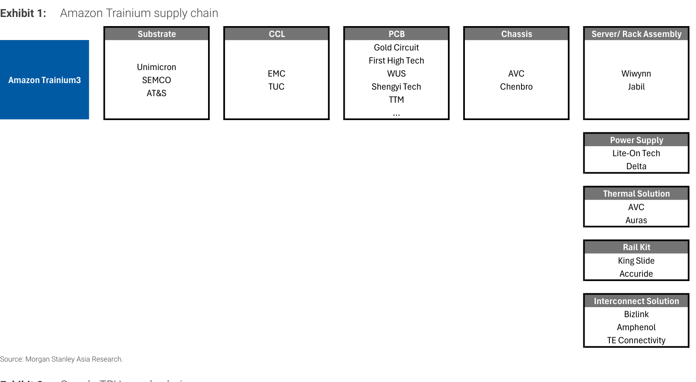
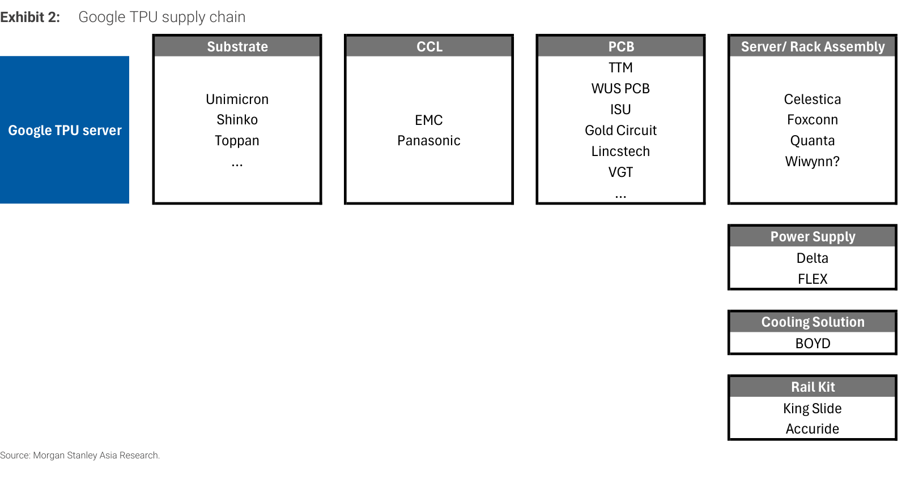
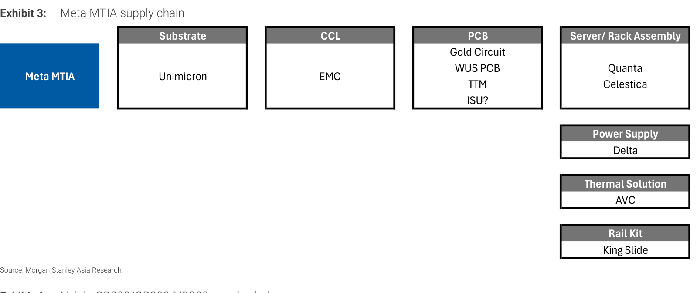
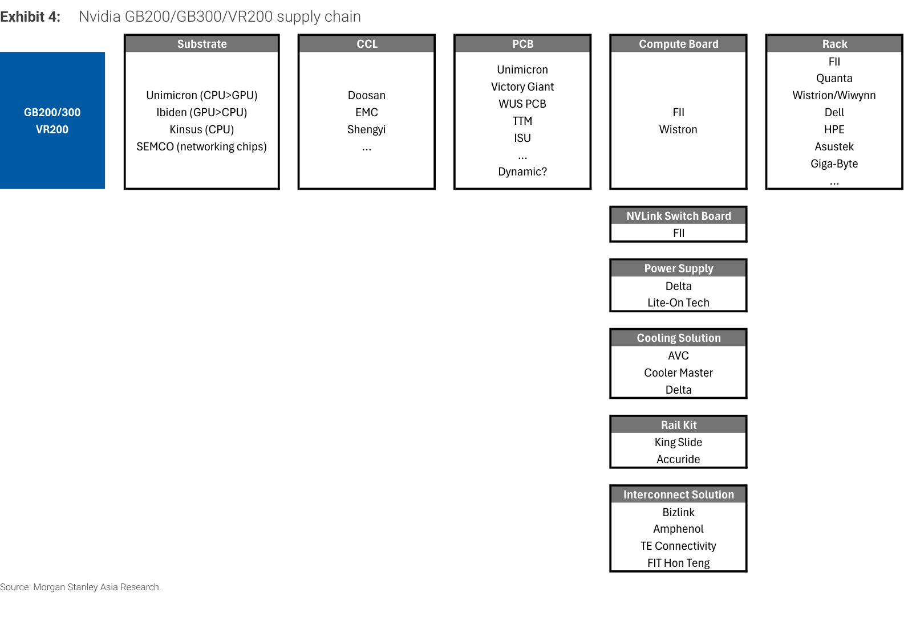
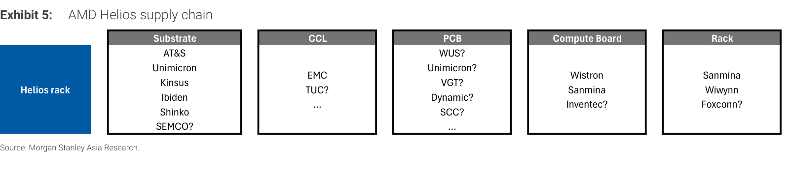

# MS｜美系 Hyperscaler 2Q26 財報對台灣供應鏈 Read-across

**券商**：Morgan Stanley（摩根士丹利）  
**分析師**：Howard Kao、Irene Yen、Andy Meng（CFA）  
**日期**：2026-08-02  
**主題**：美系四大 hyperscaler 2Q26 財報與 capex guidance，對大中華硬體供應鏈的 read-across  
**評級**：Industry View In-Line（供應鏈維持 OW）  
<a href="https://layx.uk/dl?g=產業&b=MS&d=20260802&h=US-Hyperscalers-2Q26-Readacross">📎 下載 PDF</a>

---

## 報告總結

這份 MS「Idea」的撰寫時機是美系四大 hyperscaler 2Q26 財報剛公布完，MS 把上游雲端資本支出訊號 read-across 到大中華硬體供應鏈。核心訊息是：hyperscaler 評論「一致正面」、需求仍超越供給；capex guidance 上調雖部分反映零組件（記憶體）漲價，但關鍵在於「hyperscaler 選擇拉高支出吸收成本，而非砍伺服器採購量」——這化解了「零件漲價會壓縮伺服器單位數」的投資人疑慮。多數 hyperscaler 未給 CY27-28 guidance，但語氣暗示需求續強至 2027，Amazon 甚至形容 CY28 需求「striking（驚人）」。

投資意涵：MS 維持供應鏈 OW，點名受惠者 Wiwynn（三家 hyperscaler 的一般伺服器主力、Trainium 與 Meta AMD Helios 機櫃供應商）、Wistron（Nvidia/AMD 關鍵 L6，AI 伺服器 L10/L11 曝險）、Gold Circuit（一般伺服器與 ASIC PCB）、Unimicron 與 NYPCB（compute 與網通 ABF 基板）、Lenovo（微軟/Oracle 一般伺服器）。五張供應鏈地圖把各 AI 平台（Amazon Trainium／Google TPU／Meta MTIA／Nvidia GB200-VR200／AMD Helios）逐環節的台廠對應清楚攤開。

---

## MS 完整投資邏輯鏈

| 論點層次 | Exhibit | 內容 |
|---|---|---|
| 需求源頭確認 | 封面 | 四大 hyperscaler 評論一致正面，需求超越供給 |
| 疑慮化解 | 封面 | capex 上調為吸收零件漲價、非砍單量 → 伺服器採購量無虞 |
| 需求延續性 | 封面 | 語氣暗示 2027 續強，Amazon 稱 CY28 需求「striking」 |
| 受惠對應 | 1-5 | 各 AI 平台供應鏈地圖，定位台廠受惠環節 |
| **結論** | 封面 | **維持供應鏈 OW：Wiwynn／Wistron／GCE／Unimicron／NYPCB／Lenovo** |

> **報告最大邏輯缺口**：capex guidance 上調有一部分來自記憶體漲價（成本被動墊高），報告未拆分「量增」與「價漲」各佔 capex 上修多少——若上修主要來自漲價而非新增部署量，對「伺服器單位數」受惠的推論會打折。

---

## 報告核心觀點

| 主題 | MS 觀點 | 市場疑慮 | 是否 Contra-Consensus |
|---|---|---|---|
| capex 上調含意 | 拉高支出吸收成本、不砍量 | 零件漲價恐壓縮伺服器採購量 | 是（化解疑慮） |
| CY27-28 需求 | 暗示續強，CY28「striking」 | 擔憂 2027 見頂 | 偏正面 |
| 受惠廣度 | ABF 基板／PCB／機櫃組裝全鏈受惠 | — | — |

**四大 hyperscaler capex guidance 更新**：

| 公司 | capex guidance 更新 |
|---|---|
| MSFT | 維持 CY 約 US\$190B（計入租賃調整後 US\$175B）；F1Q27/C3Q26 capex 指引 >US\$50B（較 C2Q26 的 US\$41B 明顯 step-up） |
| Meta | CY26 capex 由 US\$125-145B 收窄至 US\$130-145B；CY27 仍無指引 |
| GOOG | CY26 capex 上調 US\$15B 至 US\$195-205B；重申 CY27 將「顯著」YoY 成長 |
| AWS | CY26 capex 上調 US\$20B 至 US\$220B（記憶體成本較高）；2027 多數運算產能已預留、2028 需求「striking」 |

**供應鏈偏好**：Wiwynn(6669)、Wistron(3231)、Gold Circuit(2368)、Unimicron(3037)、Nan Ya PCB(8046)、Lenovo(0992.HK)。

---

## Exhibit 1｜Amazon Trainium 供應鏈

### 解讀摘要
Amazon Trainium3 的台廠對應：基板 Unimicron，PCB 有 Gold Circuit／First High Tech／WUS／Shengyi／TTM，機櫃組裝 Wiwynn／Jabil，電源 Lite-On／Delta，散熱 AVC／Auras，滑軌 King Slide。Wiwynn 作為 Trainium 機櫃組裝主力，是 Amazon capex 上修（CY26 US\$220B）最直接的台廠受惠者。

### 表格
| 環節 | 供應商 |
|---|---|
| Substrate | Unimicron、SEMCO、AT&S |
| CCL | EMC、TUC |
| PCB | Gold Circuit、First High Tech、WUS、Shengyi Tech、TTM… |
| Chassis | AVC、Chenbro |
| Server/Rack Assembly | **Wiwynn**、Jabil |
| Power Supply | Lite-On Tech、Delta |
| Thermal | AVC、Auras |
| Rail Kit | King Slide、Accuride |
| Interconnect | Bizlink、Amphenol、TE Connectivity |

---

## Exhibit 2｜Google TPU 供應鏈

### 解讀摘要
Google TPU server 的組裝以 Celestica／Foxconn／Quanta 為主（Wiwynn 標「?」代表尚未確認），基板 Unimicron／Shinko／Toppan，PCB 有 Gold Circuit／WUS／TTM 等。相較 Trainium，Google TPU 的組裝環節台廠參與度較低（EMS 由 Celestica 主導），台廠主要受惠在基板與 PCB。

### 表格
| 環節 | 供應商 |
|---|---|
| Substrate | Unimicron、Shinko、Toppan… |
| CCL | EMC、Panasonic |
| PCB | TTM、WUS PCB、ISU、Gold Circuit、Lincstech、VGT… |
| Server/Rack Assembly | Celestica、Foxconn、Quanta、Wiwynn? |
| Power Supply | Delta、FLEX |
| Cooling | BOYD |
| Rail Kit | King Slide、Accuride |

---

## Exhibit 3｜Meta MTIA 供應鏈

### 解讀摘要
Meta 自研 ASIC（MTIA）供應鏈相對精簡：組裝 Quanta／Celestica，基板 Unimicron，PCB 有 Gold Circuit／WUS／TTM，電源 Delta，散熱 AVC。台廠核心受惠仍是 Unimicron（基板）、Gold Circuit（PCB）、Delta（電源）。

### 表格
| 環節 | 供應商 |
|---|---|
| Substrate | Unimicron |
| CCL | EMC |
| PCB | Gold Circuit、WUS PCB、TTM、ISU? |
| Server/Rack Assembly | Quanta、Celestica |
| Power Supply | Delta |
| Thermal | AVC |
| Rail Kit | King Slide |

---

## Exhibit 4｜Nvidia GB200/GB300/VR200 供應鏈

### 解讀摘要
Nvidia 主流機櫃（GB200/GB300/VR200）供應鏈最複雜、台廠參與最深：基板分工 Unimicron（CPU>GPU）／Ibiden（GPU>CPU）／Kinsus（CPU）／SEMCO（網通晶片），compute board FII／Wistron，機櫃 FII／Quanta／Wistron／Wiwynn／Dell／HPE 等，NVLink switch board 由 FII 獨供。這是 Nvidia 平台，台廠幾乎涵蓋每個環節，也是 AI 伺服器 BOM 價值量最高的平台。

### 表格
| 環節 | 供應商 |
|---|---|
| Substrate | Unimicron（CPU>GPU）、Ibiden（GPU>CPU）、Kinsus（CPU）、SEMCO（網通） |
| CCL | Doosan、EMC、Shengyi… |
| PCB | Unimicron、Victory Giant、WUS PCB、TTM、ISU、Dynamic?… |
| Compute Board | FII、Wistron |
| Rack | FII、Quanta、Wistron/Wiwynn、Dell、HPE、Asustek、Giga-Byte… |
| NVLink Switch Board | FII |
| Power Supply | Delta、Lite-On Tech |
| Cooling | AVC、Cooler Master、Delta |
| Rail Kit | King Slide、Accuride |
| Interconnect | Bizlink、Amphenol、TE Connectivity、FIT Hon Teng |

> **洞察一（配合 Exhibit 1-5）**：Unimicron 與 Delta 出現在全部五張供應鏈地圖（基板／電源），是「不論哪個 AI 平台勝出都受惠」的中立受惠者；反觀機櫃組裝依平台分流（Trainium→Wiwynn、TPU→Celestica、Nvidia→多家），選機櫃股須押對平台，選 Unimicron/Delta 則規避了平台路線風險。

---

## Exhibit 5｜AMD Helios 供應鏈

### 解讀摘要
AMD Helios rack 供應鏈多處標「?」（尚未定案），反映 AMD AI 機櫃仍在導入早期。基板 AT&S／Unimicron／Kinsus／Ibiden／Shinko，組裝 Wistron／Sanmina／Inventec?，機櫃 Sanmina／Wiwynn／Foxconn?。MS 特別點名 Wiwynn 是 Meta 的 AMD Helios 機櫃供應商——AMD 平台放量將是 Wiwynn 的額外選擇權。

### 表格
| 環節 | 供應商 |
|---|---|
| Substrate | AT&S、Unimicron、Kinsus、Ibiden、Shinko、SEMCO? |
| CCL | EMC、TUC? |
| PCB | WUS?、Unimicron?、VGT?、Dynamic?、SCC?… |
| Compute Board | Wistron、Sanmina、Inventec? |
| Rack | Sanmina、Wiwynn、Foxconn? |

> **洞察二**：AMD Helios 供應鏈大量標「?」（CCL/PCB/機櫃多未定案），代表 AMD AI 機櫃供應商認證仍在進行——這對已卡位的 Wistron（compute board）與 Wiwynn（Meta Helios 機櫃）是先發卡位優勢，也意味後續認證結果是尚未定價的催化劑。

---

## 相關個股清單

| 類別 | 公司 | Ticker | MS 觀點 | 備註 |
|---|---|---|---|---|
| 伺服器組裝 | Wiwynn 緯穎 | 6669 | OW | 三家 hyperscaler 一般伺服器主力、Trainium/Helios 機櫃 |
| 伺服器組裝 | Wistron 緯創 | 3231 | OW | Nvidia/AMD 關鍵 L6，AI 伺服器 L10/L11 曝險 |
| PCB | Gold Circuit 金像電 | 2368 | OW | 一般伺服器與 ASIC PCB |
| ABF 基板 | Unimicron 欣興 | 3037 | OW | compute（CPU/GPU/ASIC）與網通基板，全平台受惠 |
| ABF 基板 | Nan Ya PCB 南電 | 8046 | OW | compute 與網通 ABF 基板 |
| 伺服器 | Lenovo 聯想 | 0992.HK | OW | 微軟/Oracle 一般伺服器 |
