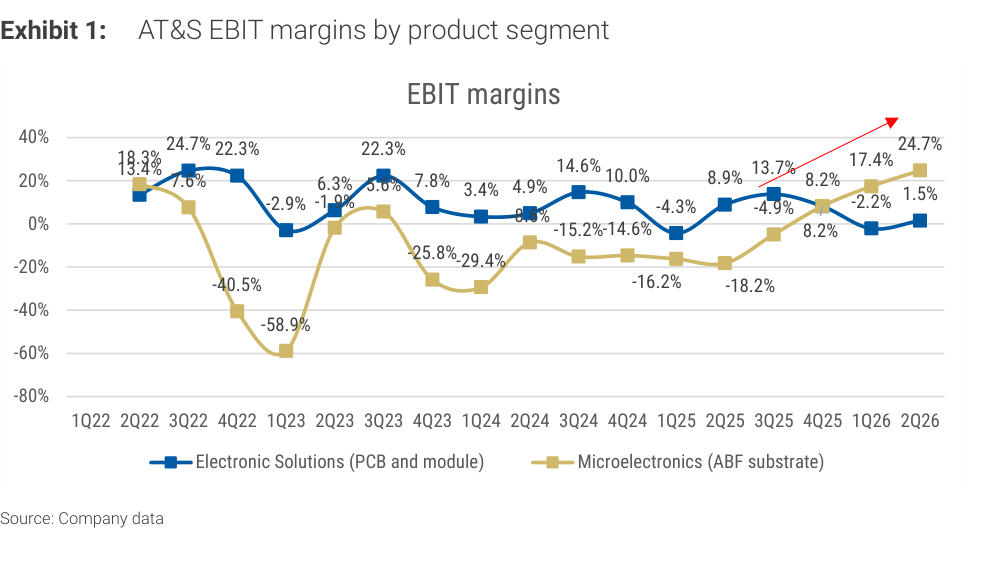

# MS｜ABF 基板：AT&S F1Q26/27 財報 Read-across

**券商**：Morgan Stanley（摩根士丹利）  
**分析師**：Howard Kao、Irene Yen、Andy Meng（CFA）  
**日期**：2026-08-04  
**主題**：ABF 基板廠 AT&S（奧地利）F1Q 財報對台灣 ABF 供應鏈（欣興、南電）的 read-across  
**評級**：Industry View In-Line  
<a href="https://layx.uk/dl?g=產業&b=MS&d=20260804&h=ABF-Substrates-ATS">📎 下載 PDF</a>

---

## 報告總結

這份 MS update 的催化劑是 ABF 基板大廠 AT&S 公布 F1Q26/27（C2Q）財報，MS 用它 read-across 到覆蓋的台灣 ABF 名（欣興、南電）。AT&S C2Q 營收 €549m（+15% QoQ），其中 Microelectronics（ABF）+18% QoQ，且 ABF 部門 EBIT 利潤率單季跳升 730bp 至 24.7%（管理層歸因量增＋定價環境改善）。更關鍵的是 AT&S 大幅上調全年 guidance：營收 YoY 由 +30-35% 上修至 +45-55%、EBITDA 利潤率由 25-29% 上修至 32-37%——這是 ABF 基板上行週期的強力佐證。

投資意涵：MS 指 AT&S 的強勁數字與欣興法說的正面看法一致，且 AT&S 的擴產（馬來西亞 Kulim €1.5-2.0B、中國重慶）同樣有長約客戶承諾撐腰，與 MS 覆蓋的 ABF 廠模式相同。上修的 AT&S guidance 進一步強化 MS 對欣興（Unimicron）與南電（NYPCB）的信心。

---

## MS 完整投資邏輯鏈

| 論點層次 | Exhibit | 內容 |
|---|---|---|
| 需求/定價確認 | 1 | AT&S ABF 部門 EBIT 利潤率單季 +730bp 至 24.7% |
| 上行趨勢 | 1 | ABF 利潤率自 2Q23 谷底 -58.9% 一路回升至 24.7% |
| Guidance 上修 | 封面 | AT&S 全年營收 +45-55% YoY（原 +30-35%）、EBITDA 利潤率 32-37%（原 25-29%） |
| 供給紀律 | 封面 | 擴產（Kulim、重慶）皆由長約客戶承諾支撐，同 MS 覆蓋 ABF 廠模式 |
| **結論** | 封面 | **強化對欣興、南電的信心（read-across 正面）** |

> **報告最大邏輯缺口**：AT&S 的產品組合、客戶結構與地域（歐洲/馬來西亞）與台廠欣興/南電不完全相同，AT&S 利潤率大幅改善能否等比例 read-across 到台廠，報告以定性連結為主、未量化台廠的利潤率敏感度。

---

## 報告核心觀點

| 主題 | MS 觀點 | 意義 |
|---|---|---|
| AT&S ABF 利潤率 | +730bp QoQ 至 24.7% | ABF 定價/量能同步改善 |
| AT&S guidance | 營收/利潤率雙上修 | ABF 上行週期加速 |
| 擴產性質 | 長約客戶承諾支撐 | 供給紀律佳、非投機擴產 |
| 台廠 read-across | 強化欣興、南電信心 | 正面 |

**受惠標的**：Unimicron 欣興(3037)、Nan Ya PCB 南電(8046)。

---

## Exhibit 1｜AT&S 分部 EBIT 利潤率

### 解讀摘要
AT&S 的 Microelectronics（ABF 基板，黃線）EBIT 利潤率從 2Q23 谷底 -58.9% 一路回升至 2Q26 的 24.7%，且 2Q26 單季 +730bp QoQ，反轉幅度驚人——這條曲線把「ABF 基板從深度虧損到高獲利」的完整上行週期視覺化。相對地，Electronic Solutions（PCB/模組，藍線）維持相對平穩（近期約 1.5%），凸顯本輪獲利彈性主要來自 ABF 基板而非一般 PCB。

> **原文補充**：管理層將 ABF 利潤率跳升歸因於「量增＋定價環境改善」；AT&S 同步大幅上調全年 guidance（營收 +45-55% YoY、EBITDA 利潤率 32-37%），且 Kulim（€1.5-2.0B）與重慶擴產均有長約客戶承諾支撐。

### 表格
| AT&S ABF（Microelectronics）EBIT 利潤率 | 值 |
|---|---|
| 2Q23（谷底） | -58.9% |
| 1Q26 | 17.4% |
| 2Q26 | 24.7%（+730bp QoQ） |
| Electronic Solutions（PCB）2Q26 | 1.5% |

> **洞察一**：ABF 利潤率從 -58.9% 到 +24.7% 的 V 型反轉（約 83ppt 擺盪），且 2Q26 單季就 +730bp，反映 ABF 基板產業從嚴重供過於求進入緊俏＋漲價階段——這對同屬 ABF 的欣興/南電是「利潤率彈性遠大於營收彈性」的訊號，獲利上修空間可能被低估。
> **洞察二（配合封面 guidance）**：AT&S 把全年 EBITDA 利潤率 guidance 從 25-29% 一次上修到 32-37%（中值 +7.5ppt），與 Exhibit 的單季跳升方向一致，代表利潤率改善不是單季偶發而是趨勢；擴產有長約撐腰則降低了「漲價引來擴產、擴產壓垮漲價」的傳統週期風險。

---

## 相關個股清單

| 類別 | 公司 | Ticker | MS 觀點 | 備註 |
|---|---|---|---|---|
| ABF 基板 | Unimicron 欣興 | 3037 | 正面 | AT&S 數字與欣興法說一致 |
| ABF 基板 | Nan Ya PCB 南電 | 8046 | 正面 | AT&S 上修 guidance 強化信心 |
| 參考（未覆蓋） | AT&S | ATSV.VI | not covered | 歐洲 ABF 基板廠，本報告 read-across 來源 |
