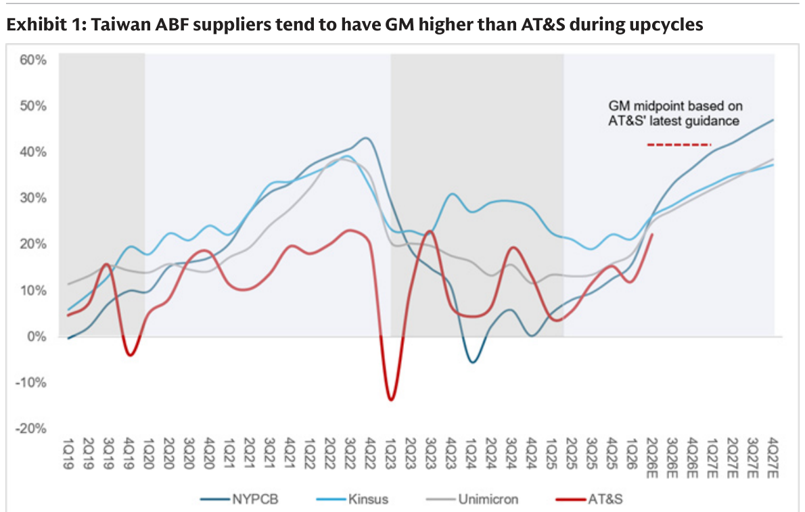
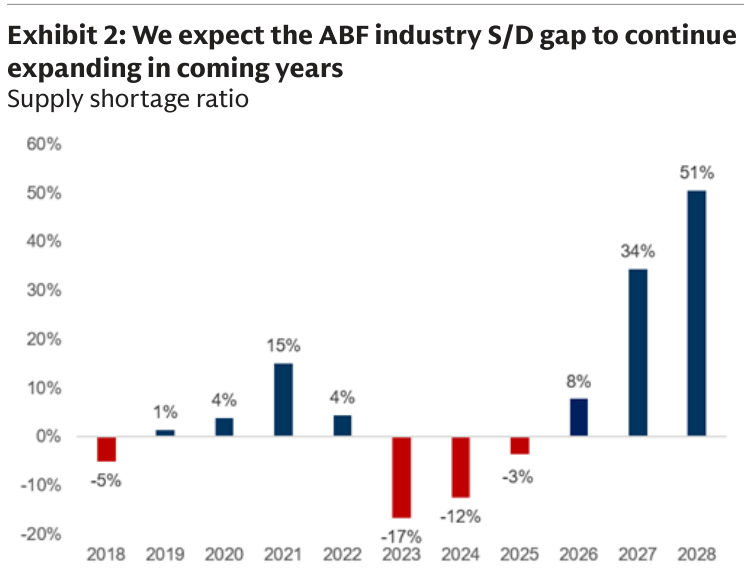
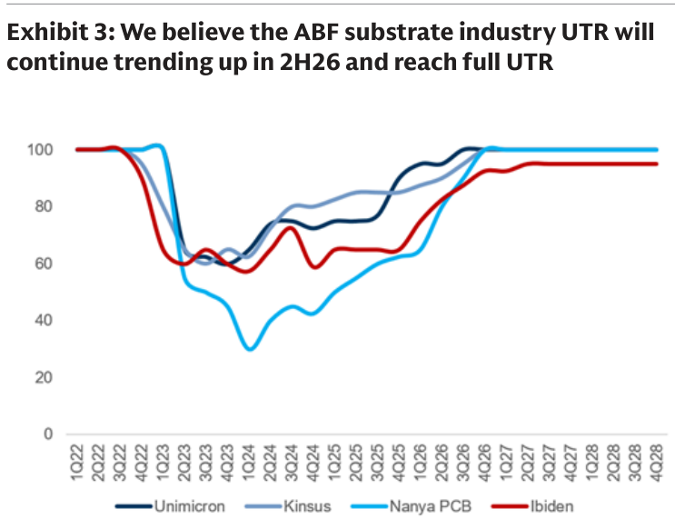

# GS｜台灣 ABF：AT&S 財報 Read-across

**券商**：Goldman Sachs（高盛）  
**分析師**：Chao Wang、Allen Chang、Al Wang  
**日期**：2026-08-05（封面標示 08-06 CST，系統日期以檔名 08-05 為準）  
**主題**：ABF 基板廠 AT&S FY1Q26/27 財報，對台灣 ABF 供應鏈（欣興、景碩、南電）的 read-across  
**評級**：對 ABF 基板需求維持正面；key Buy = NYPCB 南電  
<a href="https://layx.uk/dl?g=產業&b=GS&d=20260805&h=ATS-Implication">📎 下載 PDF</a>

---

## 報告總結

繼 MS 之後，GS 也對 AT&S FY1Q26/27（C2Q26）財報做 ABF read-across。AT&S 上修全年營收 guidance 至 45-55% YoY（中值 EUR2.7bn，vs FY25/26 的 EUR1.8bn）、EBITDA 利潤率上修至 32-37%（原 25-29%、FY25/26 為 23%），並不排除 rush order 帶來進一步上檔。GS 認為這與其對 ABF 產業「供給短缺、漲價、客戶出資擴產、高階基板拉抬獲利」的觀察一致，維持對 ABF 需求的正面看法。

與 MS 版純 read-across 不同，GS 這份帶了三張產業級數據圖，把論點量化：(1) 台灣 ABF 廠（欣興/景碩/南電）在上行週期的毛利率通常「高於」AT&S；(2) ABF 產業供需缺口（supply shortage ratio）將從 2026 的 8% 擴大到 2027/28 的 34%/51%；(3) 稼動率（UTR）2H26 續升、可望達滿載。投資結論：key Buy 為南電（NYPCB，受惠 8/34/51% 供需缺口帶來的定價上行），欣興、景碩同為受惠者；客戶已在爭取 2029 後的 ABF 產能。

---

## GS 完整投資邏輯鏈

| 論點層次 | Exhibit | 內容 |
|---|---|---|
| 需求/漲價確認 | 封面 | AT&S 上修營收 guidance 至 45-55% YoY、EBITDA 利潤率 32-37% |
| 獲利彈性 | 1 | 台灣 ABF 廠上行週期 GM 通常高於 AT&S |
| 供給短缺 | 2 | ABF 供需缺口 2026/27/28 = 8%/34%/51% 持續擴大 |
| 稼動率上行 | 3 | ABF 產業 UTR 2H26 續升、趨近滿載 |
| 供給紀律 | 封面 | 擴產（Kulim/重慶）由長約＋客戶預付/出資支撐，含稼動率保證 |
| **結論** | 封面 | **維持 ABF 需求正面，key Buy 南電（NYPCB）；欣興、景碩受惠** |

> **報告最大邏輯缺口**：供需缺口 2027/28 擴大到 34%/51% 是 GSe 的模型假設，高度依賴「需求端 AI 封裝拉貨續強＋供給端擴產受長約約束不超建」兩個前提；若任一鬆動（如 AI 需求放緩或廠商為搶單超建），缺口與漲價幅度會大幅收斂。

---

## 報告核心觀點

| 主題 | GS 觀點 | 市場疑慮 | 是否 Contra-Consensus |
|---|---|---|---|
| ABF 供需 | 缺口續擴大（8%→51%，2026-28） | 擔憂擴產壓垮漲價 | 是（看多缺口） |
| 台廠 GM | 上行週期高於 AT&S | — | — |
| 漲價延續性 | rush order＋高階基板拉抬 | — | 偏正面 |
| 擴產性質 | 長約＋客戶出資＋稼動率保證 | 擴產＝供給過剩風險 | 是（供給有紀律） |

**受惠排序／個股偏好**：key Buy = 南電 NYPCB(8046)；欣興 Unimicron(3037)、景碩 Kinsus(3189) 同受惠。原料瓶頸：玻纖布（E-glass/T-glass）。

---

## Exhibit 1｜台灣 ABF 廠上行週期毛利率通常高於 AT&S

### 解讀摘要
南電、景碩、欣興三家台廠的毛利率曲線在上行週期普遍位於 AT&S（紅線）之上，且 GS 預估 2026E 起三家 GM 一路走升至 2027 末的 37-47%，遠高於 AT&S guidance 中值（紅色虛線約 40%）。這條圖的投資含義是：AT&S 上修 guidance 是「read-across 的下限」——既然台廠上行週期 GM 結構性高於 AT&S，AT&S 都能上修，台廠獲利上修空間更大。

### 表格
| GM（上行週期） | 趨勢 |
|---|---|
| 南電 NYPCB | 2027 末估升至約 47%（三家最高） |
| 景碩 Kinsus | 2027 末估約 37-38% |
| 欣興 Unimicron | 2027 末估約 37% |
| AT&S（對照） | 最新 guidance 中值約 40% |

> **洞察一**：AT&S 作為 read-across 錨點是保守下限——台廠上行週期 GM 高於 AT&S，代表「AT&S 上修」對台廠是保守訊號，台廠 GM 上修空間被低估；三家中南電彈性最大（GM 拉升幅度最陡）。

---

## Exhibit 2｜ABF 產業供需缺口將持續擴大

### 解讀摘要
GS 的 supply shortage ratio 顯示 ABF 供需從 2023/24 的嚴重過剩（-17%/-12%）反轉為 2026 的 +8% 短缺，並在 2027/28 急劇擴大到 +34%/+51%。這不是溫和復甦而是加速短缺——2028 的 51% 缺口意味需求超出供給逾半，是強力的定價上行背書，也是 GS key Buy 南電的核心依據。

### 表格
| 年度 | 供給短缺率 |
|---|---|
| 2023 | -17%（嚴重過剩） |
| 2024 | -12% |
| 2025 | -3% |
| 2026 | +8%（轉短缺） |
| 2027 | +34% |
| 2028 | +51% |

> **洞察二**：缺口從 2026 的 8% 到 2028 的 51%，兩年擴大 43ppt 且逐年加速——這種「加速而非趨緩」的短缺曲線，是漲價可延續多年（而非單年）的關鍵；對照 Exhibit 3 的 UTR 趨近滿載，供給端已無短期解方，漲價議價權完全在基板廠一側。

---

## Exhibit 3｜ABF 產業稼動率 2H26 續升趨近滿載

### 解讀摘要
欣興、景碩、南電、Ibiden 四家 ABF 廠的 UTR 從 2024 谷底（南電一度低至約 30%）一路回升，GS 預估 2H26 續升、2027 起趨近或達到滿載（100%）。滿載代表短期內無法再靠既有產能增量滿足需求，只能靠漲價與新建產能——呼應 Exhibit 2 的供需缺口擴大，供給彈性已耗盡。

### 表格
| ABF 廠 UTR | 谷底 | 2027 起 |
|---|---|---|
| 欣興 Unimicron | 約 60%（2H23） | 趨近滿載 |
| 景碩 Kinsus | 約 60% | 趨近滿載 |
| 南電 Nanya PCB | 約 30%（1Q24 最低） | 達滿載 |
| Ibiden | 約 57% | 約 95% |

> **洞察三（配合 Exhibit 2）**：UTR 趨近滿載 × 供需缺口擴大到 51%，兩圖互證「供給端已無彈性」——需求增量只能靠新建產能（12-18 個月 lead time）與漲價消化。南電從 30% 谷底拉到滿載的營運槓桿最大，這也是 GS 獨押南電為 key Buy 的量化依據。

---

## 相關個股清單

| 類別 | 公司 | Ticker | GS 觀點 | 備註 |
|---|---|---|---|---|
| ABF 基板 | 南電 Nanya PCB | 8046 | key Buy | 受惠 8/34/51% 供需缺口定價上行；UTR 谷底 30%→滿載，槓桿最大 |
| ABF 基板 | 欣興 Unimicron | 3037 | 受惠 | 上行週期 GM 高於 AT&S |
| ABF 基板 | 景碩 Kinsus | 3189 | 受惠 | 上行週期 GM 高於 AT&S |
| 參考（未覆蓋） | AT&S | ATS.VI | Not Covered | 歐洲 ABF 廠，read-across 來源；guidance 上修 |
| 參考 | Ibiden | 4062.JP | — | 日系 ABF 廠，UTR 對照 |
