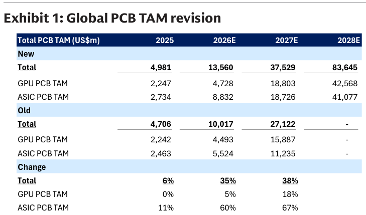
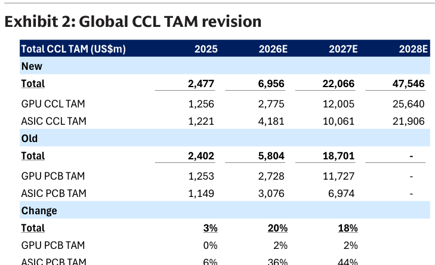
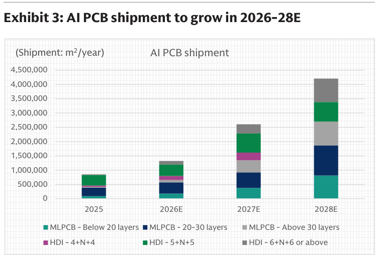
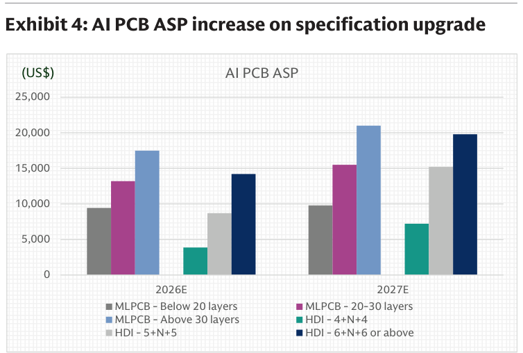
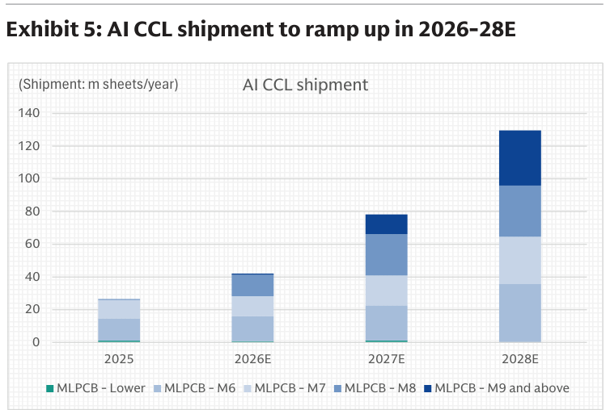
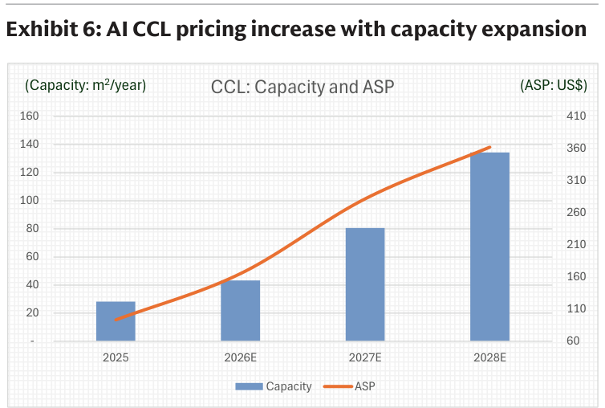
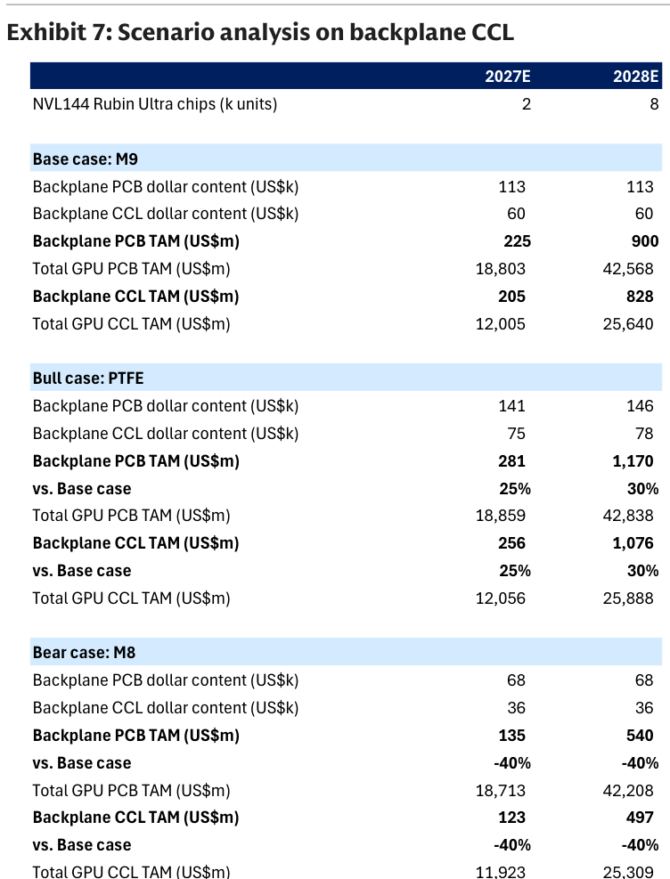
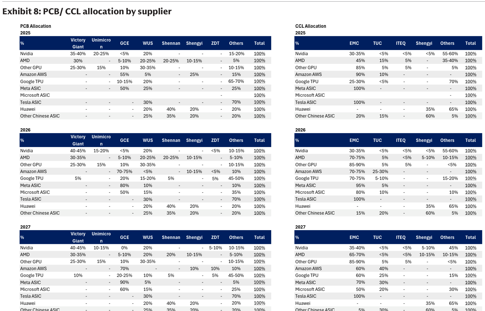

# GS｜全球 PCB／CCL：AI TAM 大幅上修

**券商**：Goldman Sachs（高盛）  
**分析師**：Allen Chang、Verena Jeng、Chao Wang、Atsushi Ikeda、Ting Song、James Schneider、Mark Delaney 等  
**日期**：2026-08-05  
**主題**：全球 AI PCB／CCL TAM 上修（2027E +38%/+18%），2028E 前三位數成長，新增 backplane 情境分析  
**評級**：對 AI PCB／CCL 維持正面（constructive）  
<a href="https://layx.uk/dl?g=產業&b=GS&d=20260805&h=Global-PCB-CCL">📎 下載 PDF</a>

---

## 報告總結

GS 大幅上修全球 AI PCB／CCL TAM，反映 AI 伺服器機櫃放量與次世代高階伺服器帶動的規格升級。AI PCB TAM 上修 2026E/27E +35%/+38%、AI CCL TAM +20%/+18%，並首度給出 2028E。全球 AI 伺服器 PCB／CCL 市場估 2027E 達 US\$38bn/22bn（原 27bn/19bn）、2028E 進一步到 US\$84bn/48bn，隱含 2026-28E TAM CAGR 148%/161%。價值成長來自量價齊揚：PCB 出貨 2026-28E CAGR 85%（2028E 達 4.5m m²）、CCL 出貨 CAGR 77%；PCB/CCL ASP CAGR 34%/48%（規格升級＋每台 AI rack PCB 用量增加）。

撰寫時機是趁 Global Server TAM 更新與次世代 AI 伺服器規格確立，重新校準整條 PCB/CCL 價值鏈。GS 維持正面（產能持續擴充但稼動率維持高檔），並新增 Rubin Ultra backplane 的 M8/M9/PTFE 情境分析。Buy 名單橫跨兩岸三地日：陸系 Shengyi（生益，CL）、Victory Giant（勝宏）、WUS（滬電）、Shennan（深南）；日系 Panasonic、Mitsui Kinzoku、Nittobo；台系 GCE 金像電(2368)、EMC 台光電(2383)、Zhen Ding 臻鼎(4958)、TUC 台燿(6274)。

---

## GS 完整投資邏輯鏈

| 論點層次 | Exhibit | 內容 |
|---|---|---|
| TAM 上修 | 1、2 | AI PCB TAM 2027E +38%、AI CCL +18%，新增 2028E |
| 量成長 | 3、5 | PCB 出貨 2026-28E CAGR 85%、CCL CAGR 77% |
| 價成長 | 4、6 | PCB/CCL ASP CAGR 34%/48%（規格升級） |
| 供給/稼動 | 6 | CCL 產能持續擴充，ASP 同步上行 |
| 情境彈性 | 7 | Rubin Ultra backplane M8/M9/PTFE 情境，bull vs bear ±25-40% |
| 供應鏈分配 | 8 | 各 AI 平台 PCB/CCL 供應商市佔矩陣 |
| **結論** | 封面 | **維持正面；Buy 台系 GCE/EMC/臻鼎/TUC＋陸日多檔** |

> **報告最大邏輯缺口**：2026-28E TAM CAGR 148%/161% 建立在「AI 伺服器機櫃放量 × 規格升級（層數/材料等級）雙擊」；ASP CAGR 34-48% 假設高階規格（M8/M9、HDI 高階疊構）滲透如期。若 Rubin Ultra 走 bear case（M8、見 Exhibit 7），backplane TAM 較 base case 低 40%——規格路線是最大變數。

---

## 報告核心觀點

| 主題 | GS 觀點 | 意義 |
|---|---|---|
| AI PCB TAM 2027E | US\$38bn（+38% 上修） | 量價齊揚 |
| AI CCL TAM 2027E | US\$22bn（+18% 上修） | 高階材料拉抬 |
| 2026-28E CAGR | PCB 148%／CCL 161% | 三位數成長 |
| PCB/CCL ASP CAGR | 34%／48% | 規格升級為主軸 |
| Rubin Ultra backplane | M9 base，PTFE 為 bull（+25-30%） | 材料升級選擇權 |

**個股偏好（Buy）**：台系 GCE 金像電(2368)、EMC 台光電(2383)、臻鼎 Zhen Ding(4958)、TUC 台燿(6274)；陸系生益(600183)、勝宏(300476)、滬電(002463)、深南(002916)；日系 Panasonic(6752)、Mitsui Kinzoku(5706)、Nittobo(3110)。

---

## Exhibit 1｜全球 PCB TAM 上修

### 解讀摘要
全球 AI PCB TAM 從 2025 的 US\$4,981m 一路跳增到 2026E US\$13,560m、2027E US\$37,529m、2028E US\$83,645m——新估較舊估 2026E/27E 上修 35%/38%。上修主要來自 ASIC PCB（2026E +60%、2027E +67%），遠高於 GPU PCB（+5%/+18%），反映 ASIC AI 伺服器（各家自研晶片）的 PCB 用量與規格被低估。

### 表格
| PCB TAM（US\$m） | 2025 | 2026E | 2027E | 2028E |
|---|---|---|---|---|
| **Total（新）** | 4,981 | 13,560 | 37,529 | 83,645 |
| 　GPU PCB | 2,247 | 4,728 | 18,803 | 42,568 |
| 　ASIC PCB | 2,734 | 8,832 | 18,726 | 41,077 |
| Total（舊） | 4,706 | 10,017 | 27,122 | — |
| 上修幅度 | +6% | +35% | +38% | — |
| 　ASIC 上修 | +11% | +60% | +67% | — |

> **洞察一**：上修集中在 ASIC PCB（2027E +67% vs GPU +18%）——市場低估的是「自研 ASIC 陣營」的 PCB TAM，而非 Nvidia GPU 鏈；押注點應偏向 ASIC PCB 供應商（Meta/Google/Amazon 鏈的金像電、勝宏）而非純 GPU 鏈。

---

## Exhibit 2｜全球 CCL TAM 上修

### 解讀摘要
全球 AI CCL TAM 2025 US\$2,477m → 2026E US\$6,956m → 2027E US\$22,066m → 2028E US\$47,546m，2026E/27E 上修 20%/18%。CCL 上修幅度小於 PCB（PCB 38% vs CCL 18%），反映 PCB 端的規格升級（層數增加）比 CCL 端更劇烈——同樣一片 CCL 可做出更高價值的 PCB。

### 表格
| CCL TAM（US\$m） | 2025 | 2026E | 2027E | 2028E |
|---|---|---|---|---|
| **Total（新）** | 2,477 | 6,956 | 22,066 | 47,546 |
| 　GPU CCL | 1,256 | 2,775 | 12,005 | 25,640 |
| 　ASIC CCL | 1,221 | 4,181 | 10,061 | 21,906 |
| Total（舊） | 2,402 | 5,804 | 18,701 | — |
| 上修幅度 | +3% | +20% | +18% | — |

> **洞察二（配合 Exhibit 1）**：PCB TAM 上修 38% > CCL TAM 上修 18%，兩者差距約 20ppt——差距代表「PCB 加工端的價值增量（層數/HDI 疊構）大於材料端」，PCB 廠（金像電/勝宏/滬電）的營收彈性應高於純 CCL 廠。

---

## Exhibit 3｜AI PCB 出貨 2026-28E 成長

### 解讀摘要
AI PCB 出貨（m²/年）從 2025 約 0.85m m² 增至 2028E 約 4.5m m²（CAGR 85%），且組合往高層數/高階 HDI 移動——2028E 中 MLPCB 20-30 層、Above 30 層、HDI 6+N+6 以上等高階疊構佔比顯著擴大。量增之外的組合升級是 ASP 上行的實體基礎。

### 表格
| AI PCB 出貨（m² /年） | 值 |
|---|---|
| 2025 | 約 0.85m |
| 2026E | 約 1.3m |
| 2027E | 約 2.6m |
| 2028E | 約 4.5m（2026-28E CAGR 85%） |

---

## Exhibit 4｜AI PCB ASP 隨規格升級上行

### 解讀摘要
各疊構等級 AI PCB 的 ASP（US\$）2026E→2027E 全面上行，且層數越高漲越多：MLPCB Above 30 層從約 US\$17,500 升至 US\$21,000、HDI 6+N+6 以上從約 US\$14,200 升至 US\$19,800。這證明 ASP 上行不只是「漲價」，而是產品組合往高單價高階疊構移動的結構性升級。

### 表格
| AI PCB ASP（US\$） | 2026E | 2027E |
|---|---|---|
| MLPCB Above 30 層 | 約 17,500 | 約 21,000 |
| MLPCB 20-30 層 | 約 13,200 | 約 15,500 |
| HDI 6+N+6 以上 | 約 14,200 | 約 19,800 |
| HDI 5+N+5 | 約 8,600 | 約 15,200 |

> **洞察三**：HDI 5+N+5 的 ASP 2026→2027 從約 8,600 跳升至 15,200（+77%），漲幅在各等級中最大——中高階 HDI 的升級彈性最強，供應商的產品組合若能卡在 5+N+5→6+N+6 的升級帶，ASP 增益最豐厚。

---

## Exhibit 5｜AI CCL 出貨 2026-28E 放量

### 解讀摘要
AI CCL 出貨（m sheets/年）從 2025 約 27m 增至 2028E 約 130m（2026-28E CAGR 77%），且組合往高等級材料（M7/M8/M9 以上）移動——2028E 中 M8、M9 以上佔比明顯放大，低階 M6 佔比縮小。這是 CCL ASP 上行（Exhibit 6）的實體基礎。

### 表格
| AI CCL 出貨（m sheets/年） | 值 |
|---|---|
| 2025 | 約 27m |
| 2026E | 約 42m |
| 2027E | 約 78m |
| 2028E | 約 130m（CAGR 77%；2027E 131m sheets） |

---

## Exhibit 6｜AI CCL 定價隨產能擴充上行

### 解讀摘要
CCL 產能（m²/年，長條）與 ASP（US\$，橘線）2025-2028E 同步上行——產能從約 28 擴至約 135（近 5 倍），ASP 從約 US\$90 升至約 US\$360（近 4 倍）。「擴產＋漲價並存」是本輪最反直覺處：一般週期擴產壓垮價格，但 AI CCL 因高階材料（M8/M9）供不應求，擴產與漲價可並行。

### 表格
| AI CCL | 2025 | 2026E | 2027E | 2028E |
|---|---|---|---|---|
| 產能（m²/年） | 約 28 | 約 43 | 約 80 | 約 135 |
| ASP（US\$） | 約 90 | 約 155 | 約 260 | 約 360 |

> **洞察四**：產能近 5 倍、ASP 近 4 倍同步成長——這是「高階材料供不應求」的典型訊號；量價齊揚代表需求增速超過擴產增速，對高階 CCL 廠（生益、台光電）是營收 double-whammy（量×價）。

---

## Exhibit 7｜Rubin Ultra backplane CCL 情境分析

### 解讀摘要
GS 對 NVL144 Rubin Ultra 的 backplane 材料給三情境：base（M9）、bull（PTFE）、bear（M8）。Base case 下 backplane PCB/CCL dollar content 各 US\$113k/60k；bull（PTFE 高階材料）拉高至 US\$141-146k/75-78k（較 base +25-30%）；bear（M8 降階）降至 US\$68k/36k（較 base -40%）。材料等級（M8 vs M9 vs PTFE）是 backplane 價值量的最大搖擺因子。

### 表格（2028E，NVL144 Rubin Ultra 8k 顆）
| 情境 | backplane PCB content | backplane CCL content | PCB TAM | CCL TAM | vs base |
|---|---|---|---|---|---|
| Base（M9） | US\$113k | US\$60k | US\$900m | US\$828m | — |
| Bull（PTFE） | US\$146k | US\$78k | US\$1,170m | US\$1,076m | +30% |
| Bear（M8） | US\$68k | US\$36k | US\$540m | US\$497m | -40% |

> **值得驗證**：Rubin Ultra backplane 材料走 M9（base）／PTFE（bull）／M8（bear）——單一材料選擇使 backplane TAM 在 -40% 到 +30% 間擺盪（區間達 70ppt）。這是全報告最大的單一假設風險：材料定案前，backplane 相關供應商的 TAM 有 ±40% 不確定性。

---

## Exhibit 8｜各 AI 平台 PCB／CCL 供應商分配

### 解讀摘要
GS 給出 2025-2027 各 AI 平台（Nvidia/AMD/各 GPU/Amazon/Google/Meta/MS/Tesla/Huawei/其他中系 ASIC）的 PCB 與 CCL 供應商市佔矩陣。關鍵趨勢：PCB 端勝宏（Victory Giant）在 Nvidia 市佔升至 40-45%、金像電（GCE）在 Amazon AWS 佔 55-75%、Meta ASIC 佔 50-90%；CCL 端台光電（EMC）在 AMD 佔 45-70%、Meta ASIC 佔 95-100%、Tesla ASIC 佔 100%。可見台廠在「特定平台」高度集中卡位。

### 表格（重點市佔，PCB Allocation）
| 平台 | 主力 PCB 供應商（2026） |
|---|---|
| Nvidia | 勝宏 40-45%、WUS 20%、欣興 15-20% |
| Amazon AWS | 金像電 70-75% |
| Meta ASIC | 金像電 80% |
| Google TPU | 其他 45-50%、GCE 20% |

### 表格（重點市佔，CCL Allocation）
| 平台 | 主力 CCL 供應商（2026） |
|---|---|
| AMD | 台光電 70-75% |
| Amazon AWS | 台光電 70-75%、TUC 25-30% |
| Meta ASIC | 台光電 95% |
| Tesla ASIC | 台光電 100% |
| Google TPU | 台光電 70-75% |

> **洞察五（配合 Exhibit 1）**：金像電（PCB）與台光電（CCL）在「ASIC 平台」市佔極高（金像電 Amazon/Meta 70-80%、台光電 Meta/Tesla 95-100%）——這與 Exhibit 1「上修集中在 ASIC PCB（+67%）」形成強力交叉印證：ASIC TAM 上修的最大受惠者正是這兩家在 ASIC 平台卡位最深的台廠。

---

## 相關個股清單

| 類別 | 公司 | Ticker | GS 評等 | 備註 |
|---|---|---|---|---|
| PCB | 金像電 GCE | 2368 | Buy | Amazon/Meta ASIC PCB 市佔 70-80%，ASIC TAM 上修最大受惠 |
| CCL | 台光電 EMC | 2383 | Buy | AMD/Meta/Tesla/Google CCL 高市佔 |
| PCB | 臻鼎 Zhen Ding | 4958 | Buy | — |
| CCL | 台燿 TUC | 6274 | Buy | Amazon AWS CCL 25-30% |
| PCB/CCL | 生益 Shengyi | 600183.SS | Buy (CL) | 陸系 CCL 龍頭 |
| PCB | 勝宏 Victory Giant | 300476.SZ | Buy | Nvidia PCB 市佔 40-45% |
| PCB | 滬電 WUS | 002463.SZ | Buy | — |
| PCB | 深南 Shennan | 002916.SZ | Buy | — |
| 材料 | Panasonic HD | 6752.T | Buy | — |
| 材料 | Mitsui Kinzoku | 5706.T | Buy | — |
| 材料 | Nittobo | 3110.T | Buy | 玻纖布 |
