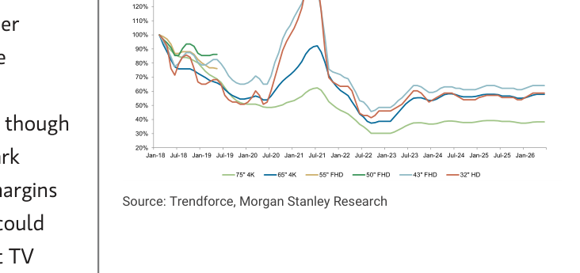
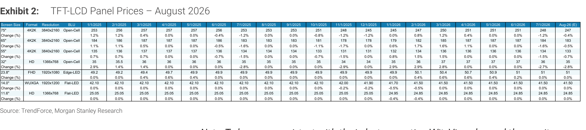
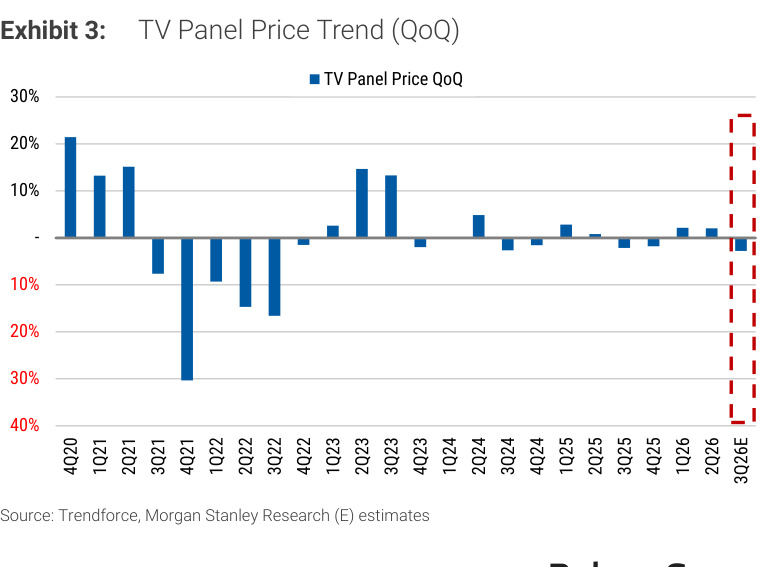
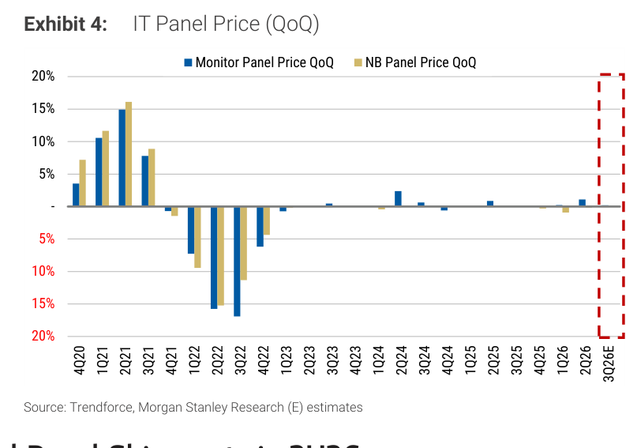

# MS｜TFT-LCD 面板價 8 月展望

**券商**：Morgan Stanley（摩根士丹利）  
**分析師**：Derrick Yang、Shawn Kim、Vivi Huang、Andy Meng（CFA）  
**日期**：2026-08-05  
**主題**：8 月 TFT-LCD 面板價展望——TV -1% MoM、監視器與 NB 持平  
**評級**：大中華科技硬體 In-Line；南韓科技 Attractive  
<a href="https://layx.uk/dl?g=產業&b=MS&d=20260805&h=TFT-LCD-Panel-Price-Aug">📎 下載 PDF</a>

---

## 報告總結

MS 月度面板價 databook：8 月主流 TV 面板價估跌 1% MoM（32"/43"/55"/65"/75" 各跌 3%/2%/1%/0.5%/0.4%），監視器與 NB 面板價持平。TV 跌幅收斂是因年底促銷備貨帶動季節性需求回溫，但面板廠可能需靠 rebate（退佣）維持 benchmark 價穩定，成為 3Q26 毛利率觀察點；供給端 output control 紀律仍在，防止價格大幅下探。季均看，3Q26 TV 面板價估低個位數 % QoQ 下滑、IT 面板價持平。

投資看法偏保守：MS 認為近期修正後台廠評價已合理（友達 2409 1.2x P/B、群創 3481 1.6x P/B），且「先進封裝玻璃基板」的增量貢獻要更久才實現、隨產業邁向量產競爭恐加劇——重申「以玻璃機會評價面板股仍為時過早」。中國偏好京東方 BOE（規模優勢、玻璃核心基板進展快）勝過 TCL。

---

## MS 完整投資邏輯鏈

| 論點層次 | Exhibit | 內容 |
|---|---|---|
| 價格趨勢 | 1、2 | TV 面板價 8 月 -1% MoM，跌幅收斂 |
| TV 季度 | 3 | 3Q26 TV 面板價低個位數 % QoQ 下滑 |
| IT 持平 | 4 | 監視器/NB 面板價 8 月持平、3Q26 QoQ 持平 |
| 供需 | 5 | 稼動率回升至約 86%（3Q26E），output control 紀律在 |
| 評價看法 | 封面 | 台廠評價合理，玻璃先進封裝增量言之過早 |
| **結論** | 封面 | **風險報酬不佳；中國偏好 BOE > TCL** |

> **報告最大邏輯缺口**：跌幅收斂靠「面板廠提供 rebate 維穩 benchmark 價」——benchmark 價持平但實收價（扣 rebate 後）可能更低，MS 已提示這是 3Q26 毛利率風險；換言之「面板價 -1%」低估了面板廠實際承受的價格壓力。

---

## 報告核心觀點

| 主題 | MS 觀點 | 意義 |
|---|---|---|
| 8 月 TV 面板價 | -1% MoM（跌幅收斂） | 季節性需求回溫，但靠 rebate |
| 8 月 IT 面板價 | 持平 | 面板廠成本壓力下不讓價 |
| 3Q26 TV 季均 | 低個位數 % QoQ 下滑 | — |
| 面板股評價 | 合理、風險報酬不佳 | 玻璃機會言之過早 |
| 中國偏好 | BOE > TCL | 規模＋玻璃核心基板進展 |

**個股**：友達 AUO(2409, 1.2x P/B)、群創 Innolux(3481, 1.6x P/B)、BOE(000725.SZ, 偏好)、TCL(000100.SZ)。

---

## Exhibit 1｜TFT-LCD TV 面板價趨勢（指數化）

### 解讀摘要
各尺寸 TV 面板價（以 2018 年初為基期指數化）2021 中因缺料急漲至 120-140%，2022-23 崩跌至 30-60%，2024 起低檔震盪。目前所有尺寸都在基期以下（32" HD 約 60%、75" 4K 約 60%），反映 TV 面板長線結構性走弱；近期趨於平緩但無明顯上行動能。

### 表格（8 月面板價 MoM）
| 尺寸 | 8 月 MoM |
|---|---|
| 32" | -3% |
| 43" | -2% |
| 55" | -1% |
| 65" | -0.5% |
| 75" | -0.4% |

> **洞察一**：尺寸越小跌越多（32" -3% vs 75" -0.4%）——大尺寸價格更抗跌，反映需求往大尺寸集中；面板廠產品組合若偏大尺寸，價格壓力較小。

---

## Exhibit 2｜TFT-LCD 面板價明細表

### 解讀摘要
逐月各尺寸/規格面板實價（US\$）與 MoM 變化表。TV 面板（75"/65"/55" 4K）2026 全年緩跌，8 月估價 247/183/133；IT 面板（23.8" FHD 監視器、14" NB、11.6" NB）近月大致持平（8 月 MoM 多為 0%）。此表為前述所有價格結論的原始數據來源。

### 表格（8 月估價 US\$，重點尺寸）
| 尺寸/規格 | Aug-26E | MoM |
|---|---|---|
| 75" 4K2K Open-Cell | 247 | -0.4% |
| 65" 4K2K | 183 | -0.4% |
| 55" 4K2K | 133 | -0.5% |
| 32" HD | 35 | -2.8% |
| 23.8" FHD 監視器 | 51 | 0.0% |
| 14.0" WUXGA NB | 41.50 | 0.0% |

---

## Exhibit 3｜TV 面板價趨勢（QoQ）

### 解讀摘要
TV 面板價 QoQ 變化：2021 缺料期大漲（+10-20%）、2021-22 大跌（-30% 至 -16%）後，2023 起波動收斂至 ±5% 內。3Q26E（紅框）估小幅負值，延續近年「窄幅震盪、略偏下行」格局——面板價已無 2021 那種暴漲暴跌，進入低波動成熟期。

---

## Exhibit 4｜IT 面板價趨勢（QoQ）

### 解讀摘要
監視器與 NB 面板價 QoQ：同樣在 2021 大漲、2022 大跌後收斂，2024 起幾乎持平。3Q26E（紅框）估持平——IT 面板價因面板廠成本壓力（零件漲價）下不願讓價而僵持，波動比 TV 更小。

---

## Exhibit 5｜面板廠產業平均稼動率

### 解讀摘要
產業平均稼動率自 2022 中谷底（約 65%）回升，2024-26 在 78-86% 間震盪，3Q26E 估約 86%（近期高點）。稼動率回升＋output control 紀律，是 MS 認為「價格不會大幅下探」的供給端依據；但 86% 未達滿載，代表面板廠仍有調節產出、控盤價格的空間。

> **洞察二（配合 Exhibit 3-4）**：稼動率回升至 86% 但面板價仍偏弱——這與 ABF/CCL（GS 報告的滿載＋漲價）形成鮮明對比：TV/IT 面板是「供給可調節、需求成熟」的產業，稼動率回升不等於漲價；面板股缺乏 ABF 那種量價齊揚的向上彈性，這也是 MS 對面板股風險報酬保守的根本原因。

---

## 相關個股清單

| 類別 | 公司 | Ticker | MS 觀點 | 備註 |
|---|---|---|---|---|
| 面板 | 友達 AUO | 2409 | 評價合理 | 1.2x P/B；玻璃先進封裝增量言之過早 |
| 面板 | 群創 Innolux | 3481 | 評價合理 | 1.6x P/B |
| 面板 | 京東方 BOE | 000725.SZ | 偏好 | 規模優勢、玻璃核心基板進展快 |
| 面板 | TCL | 000100.SZ | 次於 BOE | 1.8x P/B |
