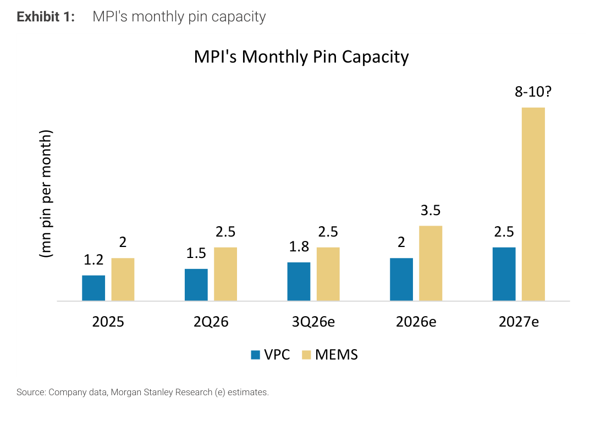
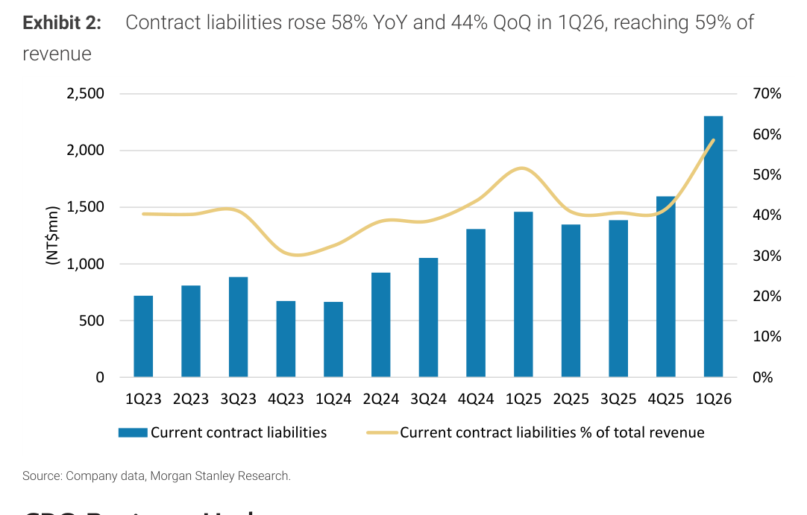
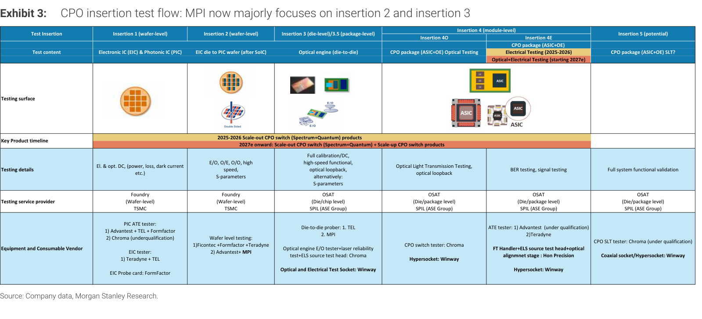

# MS｜測試耗材 2Q26 財報預覽

**券商**：Morgan Stanley（摩根士丹利）  
**分析師**：Tiffany Yeh、Charlie Chan、Daniel Yen（CFA）、Daisy Dai（CFA）  
**日期**：2026-08-05（封面標示 08-04 GMT，系統日期以檔名 08-05 為準）  
**主題**：半導體測試耗材 2Q26 財報預覽——聚焦 MPI（旺矽 6223）、Winway（穎崴 6515）  
**評級**：Industry View Attractive；MPI／Winway 均 OW  
<a href="https://layx.uk/dl?g=產業&b=MS&d=20260805&h=Testing-Interface-2Q26-Preview">📎 下載 PDF</a>

> 本篇聚焦 MPI(6223)、Winway(6515) 兩檔，建議同步參閱 [[6223_旺矽]]、[[6515_穎崴]]。

---

## 報告總結

MS 這份測試耗材 2Q26 預覽的核心觀點是「投資焦點正從漲價受惠股轉向多年期規格升級題材」——半導體測試設備/耗材在 AI 晶片封裝變大、測試時間拉長下受惠最深，維持對 MPI、Winway 的 OW。撰寫時機是 2Q 財報季，兩檔均將公布（Winway 8/6 盤後、MPI 8/14 法說）。

投資結論分歧：MPI PT 上調至 NT\$8,000（原 7,500），2Q 初步營收 +33% QoQ、超 MSe/市場 6%/7%（Trainium 3、Google TPU 放量），全產品線漲價帶動 3Q 營收 +25-30% QoQ、毛利率約 60%，CPO insertion test 進度佳（無設備被 disqualify）；股價 50x 2027E EPS、2025-28 EPS CAGR 112%。Winway 反遭下修 PT 至 NT\$12,000（原 15,000），2Q 初步營收符預期但毛利率恐低於 40%（智慧機塑膠 socket 組合較高、新產能 ramp 沖銷不良品），中期成長率假設下修至 13.2%（原 16.4%），惟 2H 毛利率可望回升至 43-45%。

---

## MS 完整投資邏輯鏈

| 論點層次 | Exhibit | 內容 |
|---|---|---|
| 題材轉向 | 封面 | 焦點從漲價受惠轉向多年期規格升級 |
| 需求驅動 | 3 | AI 晶片封裝變大、測試時間拉長，CPO 帶新測試流程 |
| 產能佐證 | 1 | MPI MEMS pin 產能 2027E 大幅擴至 8-10m/月 |
| 訂單能見度 | 2 | MPI 合約負債 +58% YoY，達營收 59% |
| 個股分歧 | 封面 | MPI 上修（漲價＋CPO）、Winway 下修（毛利率不穩） |
| **結論** | 封面 | **維持 MPI／Winway OW；偏好 MPI（PT↑）勝 Winway（PT↓）** |

> **報告最大邏輯缺口**：MPI 50x／Winway 58x 2027E EPS 的高評價，建立在「AI 測試時間拉長＋CPO insertion test 放量」的多年期題材上；CPO 量產時程（insertion 3 prober 4Q 出貨、insertion 2 中 2027）若遞延，高本益比缺乏獲利支撐的風險大。

---

## 報告核心觀點

| 主題 | MS 觀點 | 意義 |
|---|---|---|
| 題材主軸 | 規格升級 > 漲價 | 測試時間拉長為長線驅動 |
| MPI 2Q | 營收 +33% QoQ beat 6% | Trainium 3／Google TPU 放量 |
| MPI 評價 | PT↑ NT\$8,000（50x 2027E） | EPS CAGR 112%（2025-28） |
| Winway 2Q | 營收符預期、GM <40% | 塑膠 socket 組合、產能 ramp 沖銷 |
| Winway 評價 | PT↓ NT\$12,000（58x 2027E） | 中期成長假設下修 |

**個股偏好**：MPI 旺矽(6223, OW, PT↑)、Winway 穎崴(6515, OW, PT↓)。

---

## Exhibit 1｜MPI 月 pin 產能

### 解讀摘要
MPI 的 MEMS pin 月產能從 2025 的 2m 一路擴到 2027E 的 8-10m（VPC 由 1.2m 增至 2.5m），MEMS 2027E 相對 2025 增 4-5 倍。這條產能曲線是「MPI 高成長」的實體背書——測試耗材是 consumable（重複消耗），產能即營收上限，2027 的產能跳增對應 EPS CAGR 112% 的高成長假設。

### 表格
| MPI 月 pin 產能（m pin/月） | VPC | MEMS |
|---|---|---|
| 2025 | 1.2 | 2 |
| 2Q26 | 1.5 | 2.5 |
| 3Q26E | 1.8 | 2.5 |
| 2026E | 2 | 3.5 |
| 2027E | 2.5 | 8-10 |

> **洞察一**：MEMS 產能 2027E 跳至 8-10m（vs 2026E 3.5m，增逾 2 倍）是產能曲線的最大不連續點——這對應法說會焦點「MEMS probe pin 擴產計畫」；若此擴產如期，是 2027 營收再加速的關鍵，也是 50x 高本益比的支撐。

---

## Exhibit 2｜MPI 合約負債 +58% YoY

### 解讀摘要
MPI 流動合約負債 1Q26 達 NT\$2.3bn（+58% YoY／+44% QoQ），佔營收比重升至 59%（歷史約 40%）。合約負債＝客戶預付款，是需求的領先指標——大幅跳升代表客戶提前下單卡產能，佐證封面「AI 需求可延續」的論點，也降低了近期營收能見度的風險。

### 表格
| MPI 合約負債 | 值 |
|---|---|
| 1Q26 金額 | NT\$2.3bn |
| YoY | +58% |
| QoQ | +44% |
| 佔營收比重 | 59%（歷史約 40%） |

> **洞察二**：合約負債佔營收從約 40% 常態跳到 59%——這 19ppt 的跳升是「需求超過產能、客戶預付卡位」的訊號，與 Exhibit 1 的產能擴張互為因果（客戶預付支持 MPI 擴產）。

---

## Exhibit 3｜CPO insertion test 流程與供應商

### 解讀摘要
這是全報告最有價值的產業圖：把 CPO（共封裝光學）的測試流程拆成 insertion 1-5（wafer→die→package→module），逐段列出測試內容、服務商與設備/耗材供應商。關鍵在於 MPI 主攻 insertion 2-3（wafer-level EIC-to-PIC、die-level 光引擎），Winway 的 Hypersocket 卡位 insertion 3-4E（光電測試座）。CPO 帶來的「新增測試環節」是兩檔的結構性增量來源——不是搶既有市場，而是 CPO 這個新製程創造的全新測試需求。

### 表格（各 insertion 的台廠測試耗材供應商）
| Insertion | 測試內容 | 關鍵設備/耗材供應商 |
|---|---|---|
| Insertion 1（wafer） | EIC & PIC 電性/光性 | Advantest/TEL/FormFactor、Chroma、Teradyne |
| Insertion 2（wafer） | EIC die→PIC wafer（SoIC 後） | Ficontec/FormFactor/Teradyne、Advantest＋**MPI** |
| Insertion 3（die/package） | 光引擎 die-to-die | TEL、Chroma、光電測試座 **Winway** |
| Insertion 4O（module） | CPO 封裝光學測試 | CPO switch tester Chroma、**Hypersocket Winway** |
| Insertion 4E（module） | CPO 電性/光電測試 | Advantest、Hon Precision、**Hypersocket Winway** |
| Insertion 5（potential） | CPO 系統級 SLT | Chroma、Coaxial socket/**Hypersocket Winway** |

> **洞察三（配合封面）**：Winway 的 Hypersocket 幾乎卡在每一段 module-level（insertion 3-5）CPO 測試——CPO 放量對 Winway 是純增量的結構機會；但 MS 卻下修 Winway PT，反映「CPO 長線題材」與「當前毛利率不穩」的時間差：長線受惠明確，短期獲利品質是壓抑股價的主因。

---

## 相關個股清單

| 類別 | 公司 | Ticker | MS 評等 | 備註 |
|---|---|---|---|---|
| 探針卡/測試 | MPI 旺矽 | 6223 | OW | PT↑ NT\$8,000；2Q +33% QoQ，CPO insertion 2-3 卡位，MEMS 擴產 |
| 測試介面/socket | Winway 穎崴 | 6515 | OW | PT↓ NT\$12,000；2Q GM <40%，Hypersocket 卡位 CPO module 測試 |
