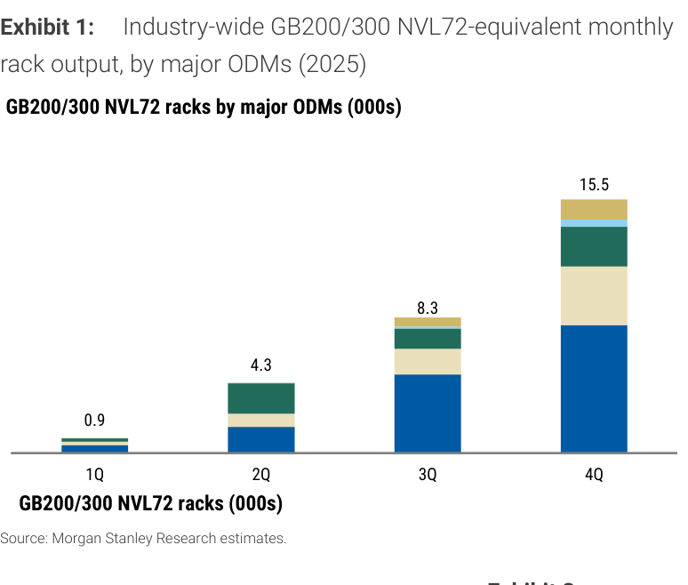
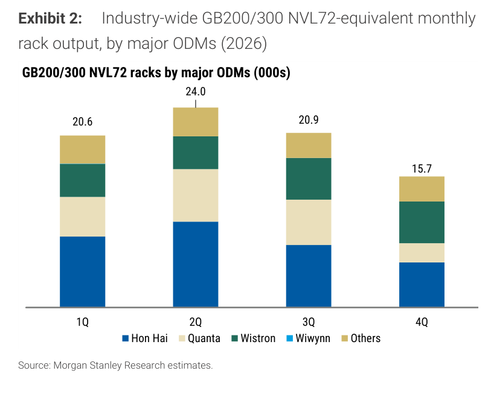
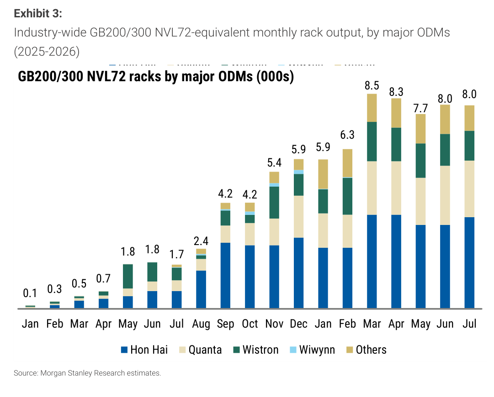
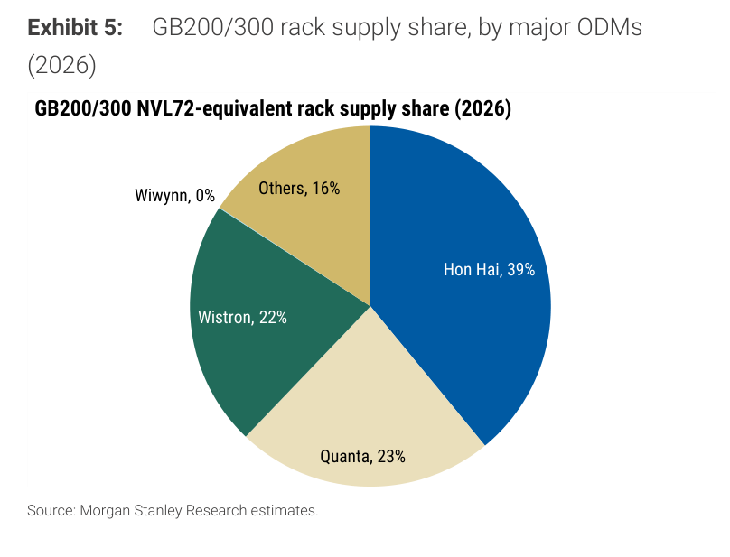

# Morgan Stanley｜GB200 and GB300 NVL72 Racks in July 2026

**券商**：Morgan Stanley  
**分析師**：Howard Kao、Andy Meng CFA、Irene Yen (RA)  
**日期**：2026-08-07  
**主題**：NVL72 rack 月度追蹤：2026 年 7 月出貨  
**評級**：In-Line（產業評等）  
<a href="https://layx.uk/dl?g=產業&b=MS&d=20260807&h=NVL72-Racks">📎 下載 PDF</a>

---

## 報告總結

本報告為 MS 每月發布的 GB200/300 NVL72 Rack 出貨追蹤，觸發時點為三大 ODM（鴻海、廣達、緯創）公布 7 月月營收後。7 月產業合計約 8.0k racks（與 6 月持平），其中鴻海 ~3.6k（+9% m/m）、廣達 2.2-2.25k、緯創 1.1-1.2k。相較上月最大變化為 **MS 將 CY26 全年預估從 70-80k 上修至 80-85k**，主因近期調升緯創 rack-equivalent 預估（自約 14k 上修至 ~17.9k）；2026 全年產業合計估 ~81.2k（+180% YoY vs 2025 的 ~29k）。

個股偏好排序維持 Wistron > Hon Hai > Quanta（based on upside to PT）。緯創 2026 份額自上月 18% 升至 22%，是本次追蹤的結構性亮點。2026 季度型態 1Q 20.6k、2Q 24.0k、3Q 20.9k、4Q 15.7k，仍呈前高後低，與 Blackwell 收尾、Rubin 4Q26 接棒的轉換時程一致。

---

## Morgan Stanley 完整投資邏輯鏈

| 論點層次 | Exhibit | 內容 |
|---|---|---|
| 需求信號持續 | 1, 2, 3 | 2026 全年上修至 80-85k racks（+180% YoY vs 2025 ~29k）；7 月 8.0k，月出貨維持高位 |
| 預估上修 | 2 | CY26 產業合計自 ~77k 升至 ~81.2k，3Q/4Q 較上月分別 19.1→20.9k、13.7→15.7k |
| 個股分化 | 4, 5 | 鴻海份額 51%（2025）→39%（2026）；緯創 20%→22%（上月 18%，本月上修）；Others 6%→16% |
| 個股偏好排序 | 報告封面 | Wistron > Hon Hai > Quanta（上行空間 to PT）；緯創為最偏好 |
| **結論** | 報告封面 | **2026 NVL72 rack 出貨軌道續強、全年上修；緯創份額提升為本月主軸，4Q 隨 Rubin 接棒自然降速** |

---

## 報告核心觀點

| 主題 | MS 觀點 | 市場共識 | 是否 Contra-Consensus |
|---|---|---|---|
| 2026 全年 NVL72 racks | 80-85k（自 70-80k 上修） | ~75-80k | 偏多（上修） |
| 7 月產業出貨 | ~8.0k（m/m 持平） | — | 中性 |
| Hon Hai 7 月 | ~3.6k racks（+9% m/m）；全年 ~31.7k 不變 | — | 中性 |
| Quanta 7 月 | 2.2-2.25k（-4% m/m）；全年 ~18.7k 不變 | — | 中性 |
| Wistron 7 月 | 1.1-1.2k（-6% m/m）；全年上修至 ~17.9k | — | 偏多（上修） |
| 個股偏好 | Wistron > Hon Hai > Quanta | — | — |

**零件/個股偏好**：Wistron（3231）最偏好；Hon Hai（2317）次之；Quanta（2382）第三

---

## Exhibit 1｜2025 各季 NVL72 Rack 出貨（by ODM）

### 解讀摘要
2025 全年 NVL72 racks 合計約 29k（0.9 + 4.3 + 8.3 + 15.5），呈典型後端集中型態，4Q 佔全年 53%（15.5k）。此為 GB200 從小批驗收到大批量交付的 ramp 曲線基準，作為 2026 年同比放大的對照組。

### 表格（2025 各季 NVL72 Rack 出貨，k racks）

| 季度 | 出貨量（k racks） |
|---|---|
| 1Q25 | 0.9 |
| 2Q25 | 4.3 |
| 3Q25 | 8.3 |
| 4Q25 | 15.5 |
| **全年 2025** | **~29.0** |

---

## Exhibit 2｜2026 各季 NVL72 Rack 出貨預測（by ODM）

### 解讀摘要
2026 全年 NVL72 racks 約 81.2k（20.6 + 24.0 + 20.9 + 15.7），較上月追蹤（~77.4k）上修 ~5%，主要來自 3Q（19.1→20.9k）與 4Q（13.7→15.7k）調升，反映緯創全年估值上修。全年落在 MS 新指引 80-85k 區間。前端（1H）仍較重（55%），後端隨世代轉換遞減。

### 表格（2026 各季 NVL72 Rack 出貨預測，k racks）

| 季度 | 出貨量（k racks） | 各季佔比 | vs 上月追蹤 |
|---|---|---|---|
| 1Q26 | 20.6 | 25% | 持平 |
| 2Q26 | 24.0 | 30% | 持平 |
| 3Q26e | 20.9 | 26% | +1.8（19.1） |
| 4Q26e | 15.7 | 19% | +2.0（13.7） |
| **全年 2026e** | **~81.2** | **100%** | **+3.8（77.4）** |

### 洞察

> **洞察一（配合 Exhibit 1）**：2025→2026 YoY +180%（29k→81.2k），2Q26 單季 24.0k 已達 2025 全年 29k 的 83%。規模持續脫離供給制約（CoWoS/HBM），進入大規模量產交付。

> **洞察二**：本月上修 3Q/4Q 而非砍量，顯示 Blackwell 世代後半段能見度改善；4Q 降至 15.7k（較 2Q -35%）仍為 Rubin 接棒前的自然轉換，非需求疲軟。

---

## Exhibit 3｜月度 NVL72 Rack 出貨追蹤（2025 Jan - 2026 Jul）

### 解讀摘要
月度出貨自 2025 Jan 0.1k 穩步爬升至 2026 Mar 峰值 8.5k，此後於 7.7-8.3k 高位盤整；2026 Jul 8.0k（與 Jun 持平），無下滑訊號。2026 前 7 月月均 ~7.5k，動能穩健。

### 表格（月度 NVL72 Rack 出貨，k racks）

| 月份 | 2025 | 2026 |
|---|---|---|
| Jan | 0.1 | 5.9 |
| Feb | 0.3 | 6.3 |
| Mar | 0.5 | 8.5 |
| Apr | 0.7 | 8.3 |
| May | 1.8 | 7.7 |
| Jun | 1.8 | 8.0 |
| Jul | 1.7 | 8.0 |
| Aug | 2.4 | — |
| Sep | 4.2 | — |
| Oct | 4.2 | — |
| Nov | 5.4 | — |
| Dec | 5.9 | — |

### 洞察

> **洞察一**：2026 Mar 觸及 8.5k 後連續 5 個月維持 7.7-8.0k 平台，顯示產業月出貨已進入「高位飽和」而非續升——後續增量將來自 4Q Rubin 接棒的新一波爬坡，而非 Blackwell 月產能再突破。

---

## Exhibit 4｜2025 NVL72 Rack 供應份額（by ODM）

### 解讀摘要
2025 年供應份額：Hon Hai 51%、Quanta 21%、Wistron 20%、Wiwynn 2%、Others 6%。鴻海以絕對優勢主導 2025 年，廣達與緯創幾乎並列第二。作為 2026 份額重組的對照基準。

### 表格（2025 NVL72 Rack 供應份額）

| ODM | 份額 |
|---|---|
| Hon Hai（2317） | 51% |
| Quanta（2382） | 21% |
| Wistron（3231） | 20% |
| Wiwynn（6669） | 2% |
| Others | 6% |

---

## Exhibit 5｜2026 NVL72 Rack 供應份額（by ODM）

### 解讀摘要
2026 份額：Hon Hai 39%（-12ppt vs 2025）、Quanta 23%（+2ppt）、Wistron 22%（+2ppt）、Wiwynn 0%、Others 16%（+10ppt）。與上月追蹤（HH 41%、Q 24%、W 18%、Others 17%）相比，**緯創份額自 18% 跳升至 22%** 為最大變化，對應其全年 rack 預估上修至 ~17.9k；鴻海份額續降但絕對量仍成長。

### 表格（2026 NVL72 Rack 供應份額）

| ODM | 份額 | vs. 2025 | vs. 上月追蹤 |
|---|---|---|---|
| Hon Hai（2317） | 39% | -12ppt | -2ppt（41%） |
| Quanta（2382） | 23% | +2ppt | -1ppt（24%） |
| Wistron（3231） | 22% | +2ppt | +4ppt（18%） |
| Wiwynn（6669） | 0% | -2ppt | 持平 |
| Others | 16% | +10ppt | -1ppt（17%） |

### 洞察

> **洞察一（配合 Exhibit 2）**：緯創份額 22% × 全年 81.2k ≈ 17.9k，與 MS 上修後的緯創個股預估（~17.9k）完全吻合，印證份額圖與個股模型一致；緯創是本月唯一被上修的大 ODM，也是 MS 最偏好標的的量化依據。

> **洞察二**：鴻海份額 39%（絕對量 ~31.7k 不變）持續被稀釋，但量能仍為三大 ODM 之首；Others 16% 維持高檔，代表非傳統 ODM（Inventec、Pegatron 等）在 NVL72 rack 的滲透已成常態，長期牽動 NVIDIA 對 ODM 的議價結構。

---

## 相關個股清單

| 類別 | 公司 | Ticker | 評等 | 備註 |
|---|---|---|---|---|
| Server ODM | Wistron（緯創） | 3231 | OW（MS） | 2026 份額 22%（上修）；全年上修至 ~17.9k；**個股最偏好** |
| Server ODM | Hon Hai（鴻海） | 2317 | OW（MS） | 2026 份額 39%；7 月 rack ~3.6k（+9% m/m）；全年 ~31.7k 不變；偏好第二 |
| Server ODM | Quanta（廣達） | 2382 | OW（MS） | 2026 份額 23%；7 月 2.2-2.25k（-4% m/m）；全年 ~18.7k 不變；偏好第三 |
| Server ODM | Wiwynn（緯穎） | 6669 | OW（MS） | 2026 rack 份額 0%（並入緯創）；7 月營收 NT\$117.7B（+6% m/m） |
