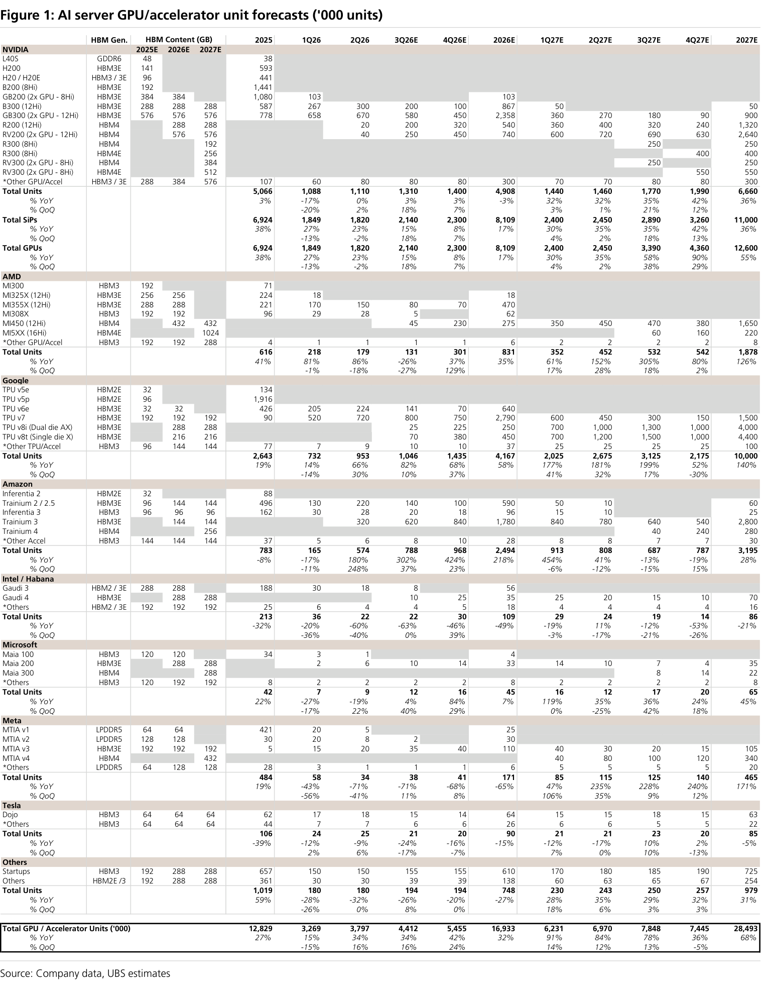
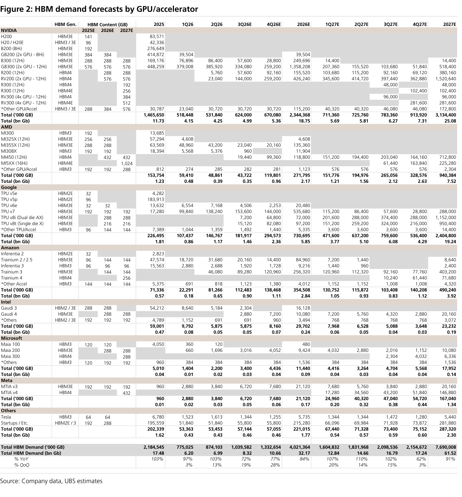
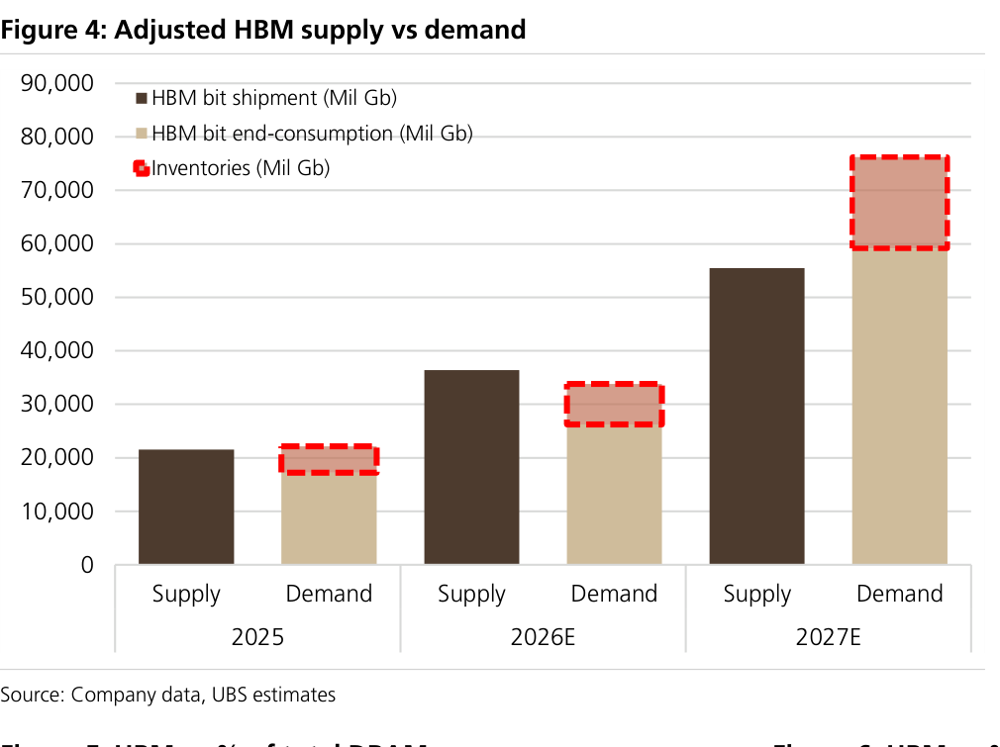
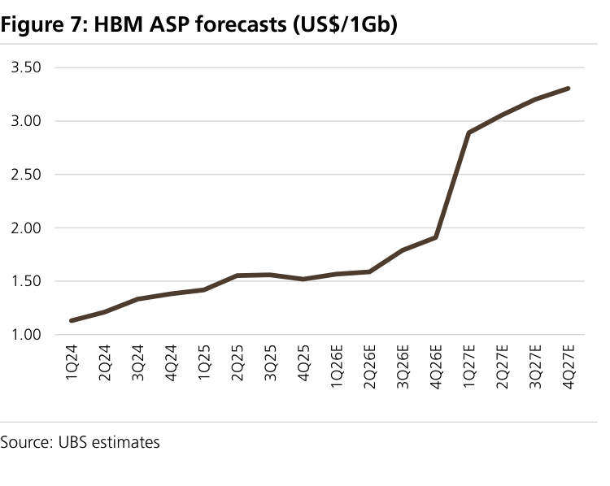
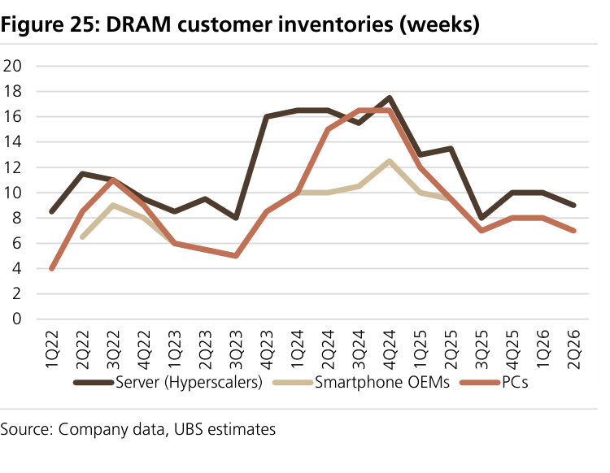
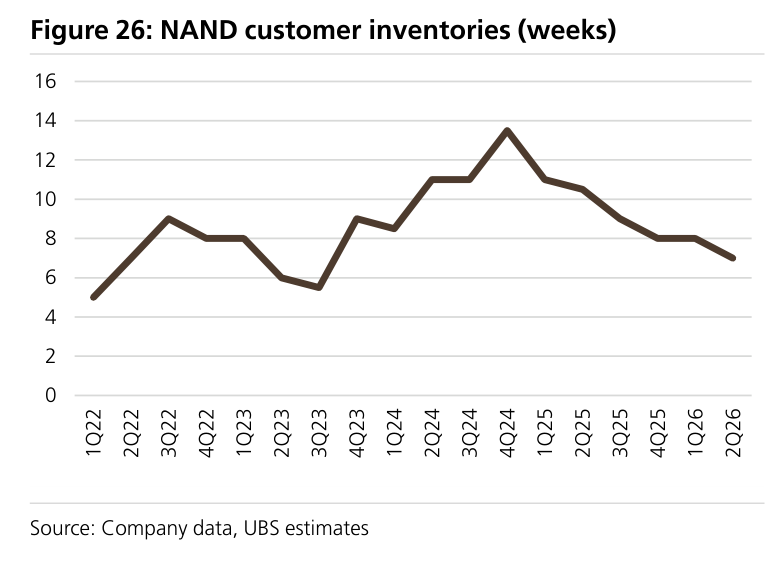
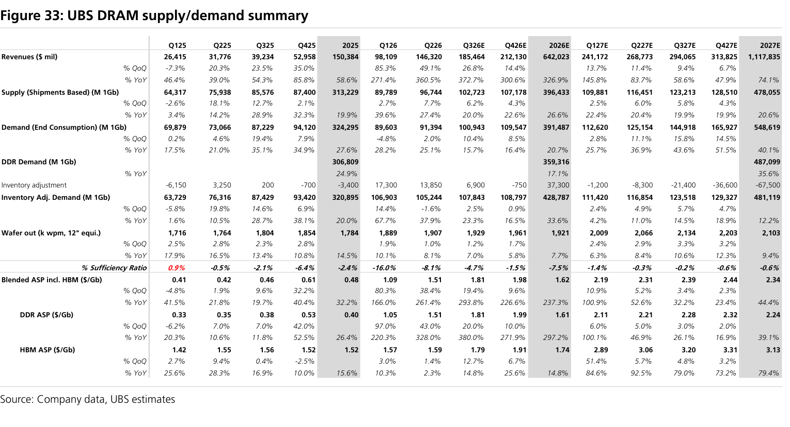
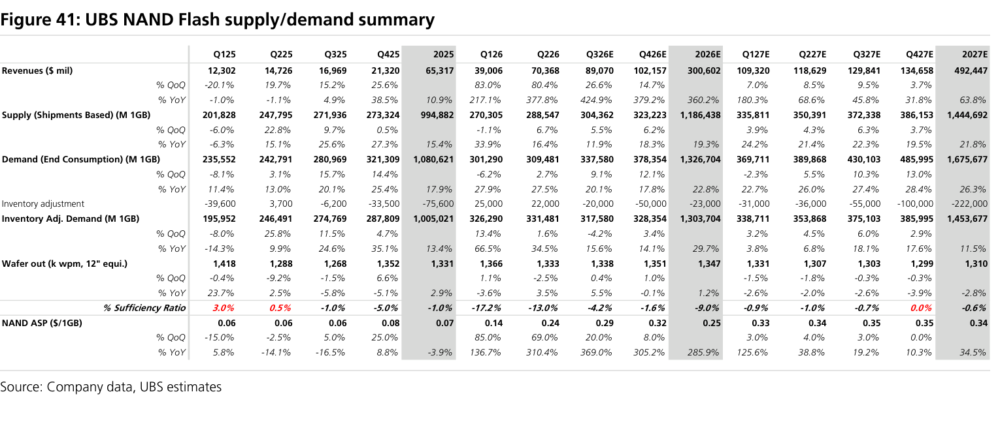

# UBS｜Memory Semis Monthly（August '26 Edition）

**券商**：UBS  
**分析師**：Nicolas Gaudois、Timothy Arcuri、Kenji Yasui、Jimmy Yu、Randy Abrams、Sunny Lin 等  
**日期**：2026-08-07  
**主題**：記憶體月報八月號——回應投資人三大疑慮（HBM de-spec／NAND 定價／CXMT）  
**評級**：偏多（Buy the pullback；Prefer DRAM，三星為 Top Pick）  
<a href="https://layx.uk/dl?g=產業&b=UBS&d=20260807&h=Memory-Monthly">📎 下載 PDF</a>

---

## 報告總結

UBS 八月記憶體月報聚焦回應近期股價回檔（記憶體股自 6 月底高點平均 -36%）下投資人的三大疑慮，結論是「拉回買進、循環更持久、偏好 DRAM」。三大疑慮的回應為：(1) **HBM 為 Rubin Ultra 降規**——Nvidia 可能初期改用 HBM4 8-Hi、續轉 HBM4E 8-Hi（原預期 HBM4E 12-Hi），因供給持續緊；但 GPU 出貨量上修（'27 Nvidia HBM end-consumption 反升至 25.1bn Gb），整體 HBM 需求無虞，2027 產業 HBM end-consumption 上修至 61.5bn Gb（+91% YoY）。(2) **NAND 合約價分散但趨勢仍正向**（3Q26E ex-LTA +20% 至 >30% QoQ，均值 +23%）。(3) **CXMT 非 DRAM 供需威脅**（'27 位元市佔 9%，製程/良率落後前三大）。

投資結論：LTAs 壓抑部分漲價上檔，UBS 下修 '27E 記憶體產業營收至 US\$1.61tn（低於前估 9%），但 LTAs 對 OPM/ROE/FCF 是加分。DRAM 上行循環（至 2Q28E）較 NAND（4Q27E）更持久，故偏好 DRAM；三星列 Key Call Buy，另 Buy CXMT、Kioxia、MU、南亞科（Nanya Tech）、SK Hynix。

---

## UBS 完整投資邏輯鏈

| 論點層次 | Exhibit | 內容 |
|---|---|---|
| 需求信號強 | 1, 2 | AI GPU/加速器出貨 2027E 28.5m 台（+68% YoY）；HBM 需求 2027E 61.5bn Gb（+91% YoY） |
| 降規不減量 | 2, 4 | Rubin Ultra 改 HBM4/HBM4E 8-Hi，但 GPU 量上修抵銷，HBM 需求反升 |
| 供需結構性緊 | 4, 33, 41 | HBM 2027E 需求 > 供給；DRAM/NAND 充足率全期為負（-7.5%/-9.0% 於 2026E） |
| 漲價延續 | 7, 33 | HBM 混合 ASP 2027E +79% YoY；DRAM 混合 ASP +44%；NAND ASP +35% |
| 庫存健康 | 25, 26 | 伺服器 DRAM 庫存降至 ~9 週、PC ~7 週、NAND ~7 週，支撐循環延續 |
| **結論** | 報告封面 | **拉回買進、循環更久；偏好 DRAM，三星 Top Pick；LTAs 壓價但利 ROE** |

---

## 報告核心觀點

| 主題 | UBS 觀點 | 市場共識 | 是否 Contra-Consensus |
|---|---|---|---|
| Rubin Ultra HBM | 降規至 HBM4→HBM4E 8-Hi（原估 HBM4E 12-Hi） | 預期 12-Hi | 偏空規格、但需求持平 |
| 2027 HBM end-consumption | 61.5bn Gb（+91% YoY，自 58.7bn 上修） | ~58-60bn | 偏多 |
| 3Q26 NAND 合約價（ex-LTA） | +20% 至 >30% QoQ（均值 +23%） | high-teens % | 偏多 |
| NAND 需求結構 | 手機/client SSD 弱、server/storage SSD 強（+62% '26） | — | 分化 |
| CXMT 威脅 | 非威脅（'27 位元 9%，製程/良率落後） | 市場估過高 | 偏多（駁斥空方） |
| 循環持續性 | DRAM 至 2Q28E > NAND 至 4Q27E | 較短 | 偏多 |
| 記憶體偏好 | Prefer DRAM，三星 Key Call Buy | — | — |

**零件/個股偏好**：Samsung（Key Call Buy）＞ 其餘；另 Buy CXMT、Kioxia、Micron、南亞科（2408）、SK Hynix。台股相關：南亞科（2408）。

---

## Figure 1｜AI server GPU/加速器出貨量預測（'000 台）

### 解讀摘要
AI GPU/加速器總出貨自 2025 年 12,829k 台成長至 2026E 16,933k（+32% YoY）、2027E 28,493k（+68% YoY）。成長由 Google TPU（2027E 10,000k，+140%）與 AMD（1,878k，+126%）領跑，Nvidia 仍為量體最大（2027E GPU 12,600k，+55%）。GPU 單位數的上修正是 HBM 需求即使降規仍能維持的根本原因。

### 表格（各家 GPU/加速器出貨，'000 台）

| 廠商 | 2025 | 2026E | 2027E | 2027E YoY |
|---|---|---|---|---|
| NVIDIA（GPU） | 6,924 | 8,109 | 12,600 | +55% |
| Google TPU | 2,643 | 4,167 | 10,000 | +140% |
| Amazon | 783 | 2,494 | 3,195 | +28% |
| AMD | 616 | 831 | 1,878 | +126% |
| **總計** | **12,829** | **16,933** | **28,493** | **+68%** |

### 洞察

> **洞察一（配合 Figure 2）**：GPU 出貨 +68% 對應 HBM 需求 +91%，HBM 需求成長快於單位數，反映單機 HBM 含量續升（GB300 12-Hi、Rubin 系列）——即使 Rubin Ultra 降至 8-Hi，世代整體 HBM 含量仍在上行軌道。

---

## Figure 2｜HBM 需求預測（by GPU/加速器，bn Gb）

### 解讀摘要
HBM 總需求自 2025 年 17.48bn Gb 增至 2026E 32.17bn（+84% YoY）、2027E 61.52bn（+91% YoY）。2027E 以 Nvidia 25.08bn、Google 19.24bn、AMD 7.52bn、Amazon 3.92bn 為主。Google TPU 的 HBM 需求成長最猛（自 5.85bn 增至 19.24bn），是本月上修 HBM 需求的關鍵驅動。

### 表格（HBM 需求，bn Gb）

| 廠商 | 2025 | 2026E | 2027E |
|---|---|---|---|
| NVIDIA | 11.73 | 18.75 | 25.08 |
| Google | 1.81 | 5.85 | 19.24 |
| AMD | 1.23 | 2.17 | 7.52 |
| Amazon | 0.57 | 2.84 | 3.92 |
| **總計** | **17.48** | **32.17** | **61.52** |
| **% YoY** | +103% | +84% | +91% |

### 原文補充
> **原文補充**：Rubin Ultra（VR300）初期用 384GB HBM4/GPU（8-Hi×24Gb×8×2），後轉 512GB HBM4E（8-Hi×32Gb×8×2），低於原估 768GB；但 Nvidia GPU 單位數自 11.0m 上修至 12.6m，'27 Nvidia HBM end-consumption 反升至 25.1bn Gb。

---

## Figure 4｜HBM 供需平衡（調整後）

### 解讀摘要
2026E HBM 供給（~36k M Gb）略高於需求（~33k，含庫存回補），呈小幅寬鬆；但 2027E 需求（end-consumption ~59.5k＋庫存 ~16.5k，合計逼近 76k）明顯超越供給（~55.5k），呈結構性短缺。這是 UBS 看多 HBM ASP 續揚、循環延長的核心供給側依據。

### 表格（HBM 供需，M Gb，目測估算）

| 年度 | 供給（出貨） | 需求（end-consumption） | 狀態 |
|---|---|---|---|
| 2025 | ~21,000 | ~17,000（+庫存） | 大致平衡 |
| 2026E | ~36,000 | ~27,000（+庫存 ~6,000） | 小幅寬鬆 |
| 2027E | ~55,500 | ~59,500（+庫存 ~16,500） | 結構性短缺 |

### 洞察

> **洞察一**：2027E HBM 供給 55.5k 低於 end-consumption 61.5k（Figure 2），供不應求 ~10%——這是 HBM ASP 在 1Q27E 大幅跳升（Figure 7）的物理基礎，也解釋為何降規（8-Hi）並未鬆動漲價預期。

---

## Figure 7｜HBM ASP 預測（US\$/1Gb）

### 解讀摘要
HBM ASP 自 1Q24 ~US\$1.13 溫和爬升至 2Q26E ~US\$1.6，於 4Q26E→1Q27E 出現陡升（~US\$1.9→~US\$2.9），至 4Q27E 達 ~US\$3.3。此跳升對應 HBM4/HBM4E 世代切換與結構性短缺：UBS 估 '27 HBM4E US\$3.9/Gb（+75% YoY vs '26 HBM4）、HBM4 US\$3.5（+60% YoY），混合 ASP +79% YoY（前估 +66%）。

### 洞察

> **洞察一**：ASP 曲線在 2025-2026 上半僅緩升（US\$1.5-1.6 盤整），真正爆發在 1Q27E——這意味 HBM 獲利彈性主要落在 2027，是「循環延長」論點的價格側證據；降規至 8-Hi 反而因供給更緊而支撐漲價。

---

## Figure 25｜DRAM 客戶庫存（週）

### 解讀摘要
DRAM 客戶庫存已自 4Q24 高點（伺服器 ~17.5 週、PC ~16 週）大幅去化，至 2Q26 伺服器（hyperscalers）~9 週、PC ~7 週、手機 OEM ~7-8 週，均處健康偏低水位。低庫存為漲價與循環延續提供支撐（客戶無庫存緩衝、須持續下單）。

### 洞察

> **洞察一**：伺服器庫存自 17.5 週降至 9 週且未再堆高，顯示 hyperscaler 需求為真實拉貨而非提前囤積——這是 UBS 駁斥「AI 記憶體支出不可持續」空方論點的關鍵微觀證據。

---

## Figure 26｜NAND 客戶庫存（週）

### 解讀摘要
NAND 客戶庫存自 4Q24 高點 ~13.5 週持續去化至 2Q26 ~7 週，同為健康偏低。配合 server/storage SSD 需求強勁（+62% '26、+51% '27），支撐 NAND 合約價 3Q26E 續漲（ex-LTA 均值 +23% QoQ）。

### 洞察

> **洞察一**：NAND 庫存 7 週低檔＋合約價漲幅分散（+20% 至 >30%），顯示漲價由 server/storage SSD 拉動、而非全面性——手機/client SSD 需求仍弱，是 NAND 循環（4Q27E 見頂）較 DRAM（2Q28E）短的原因。

---

## Figure 33｜UBS DRAM 供需總表

### 解讀摘要
DRAM 產業營收自 2025 US\$150bn 爆增至 2026E US\$642bn（+327%）、2027E US\$1,118bn（+74%）。充足率（Sufficiency Ratio）2025/2026E/2027E 分別 -2.4%/-7.5%/-0.6%，全期為負＝結構性供不應求。混合 ASP（含 HBM）US\$0.48→1.62→2.34（'27 +44%）；DDR ASP US\$0.40→1.61→2.24（'27 +39%）；HBM ASP US\$1.52→1.74→3.13（'27 +79%）。

### 表格（DRAM 產業關鍵指標）

| 指標 | 2025 | 2026E | 2027E |
|---|---|---|---|
| 營收（US\$mn） | 150,384 | 642,023 | 1,117,835 |
| 供給（M 1Gb） | 313,229 | 396,433 | 478,055 |
| 需求（M 1Gb） | 324,295 | 391,487 | 548,619 |
| 充足率 | -2.4% | -7.5% | -0.6% |
| 混合 ASP（US\$/Gb） | 0.48 | 1.62 | 2.34 |
| HBM ASP（US\$/Gb） | 1.52 | 1.74 | 3.13 |

### 洞察

> **洞察一**：DRAM 充足率 2027E 仍 -0.6%（供不應求），配合 UBS 判斷 DRAM 上行循環延至 2Q28E——即使 2026 產能開出（供給 +27%），需求（+21%）與 HBM 排擠標準 DRAM 產能，供給缺口難補，支撐「偏好 DRAM」的類股配置。

---

## Figure 41｜UBS NAND Flash 供需總表

### 解讀摘要
NAND 產業營收自 2025 US\$65bn 增至 2026E US\$301bn（+360%）、2027E US\$492bn（+64%），與 SNDK 預估（US\$300bn/500bn）相近。充足率 2025/2026E/2027E 為 -1.0%/-9.0%/-0.6%，2026E 為缺口最深的一年。NAND ASP US\$0.07→0.25→0.34（'27 +35%）。

### 表格（NAND 產業關鍵指標）

| 指標 | 2025 | 2026E | 2027E |
|---|---|---|---|
| 營收（US\$mn） | 65,317 | 300,602 | 492,447 |
| 供給（M 1Gb） | 994,882 | 1,186,438 | 1,444,692 |
| 需求（M 1Gb） | 1,080,621 | 1,326,704 | 1,675,677 |
| 充足率 | -1.0% | -9.0% | -0.6% |
| NAND ASP（US\$/Gb） | 0.07 | 0.25 | 0.34 |

### 洞察

> **洞察一（配合 Figure 33）**：NAND 2026E 充足率 -9.0% 深於 DRAM -7.5%，但 2027E 兩者收斂至約 -0.6%——NAND 漲價彈性集中在 2026（ASP +286%），2027 增幅（+35%）遠小於 DRAM，量化印證「NAND 循環較短、DRAM 較久」，故 UBS 類股上偏好 DRAM。

---

## 相關個股清單

| 類別 | 公司 | Ticker | 評等 | 備註 |
|---|---|---|---|---|
| DRAM | Samsung | 005930.KS | Buy（Key Call） | Top Pick；股價回檔已折現 pre-AI ROE |
| DRAM | SK Hynix | 000660.KS | Buy | HBM 領導者 |
| DRAM | Micron | MU | Buy | HBM/DRAM 受惠 |
| DRAM | 南亞科（Nanya Tech） | 2408 | Buy | 台股 DRAM，標準 DRAM 漲價受惠 |
| DRAM | CXMT | 未上市 | Buy（新啟動） | '27 位元市佔 9%，非供需威脅 |
| NAND | Kioxia | 285A.T | Buy | NAND 循環 2026 高峰受惠 |
