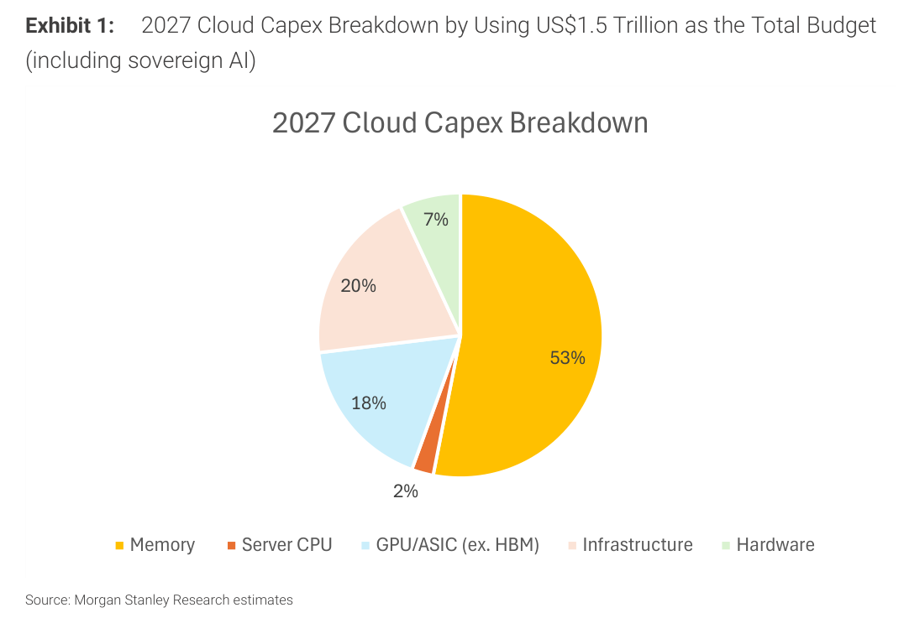
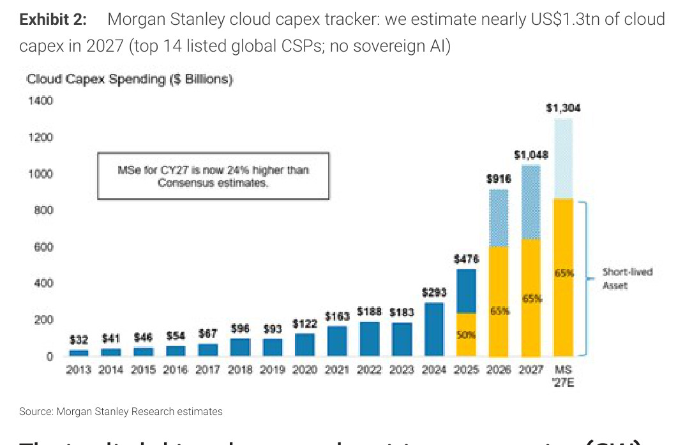
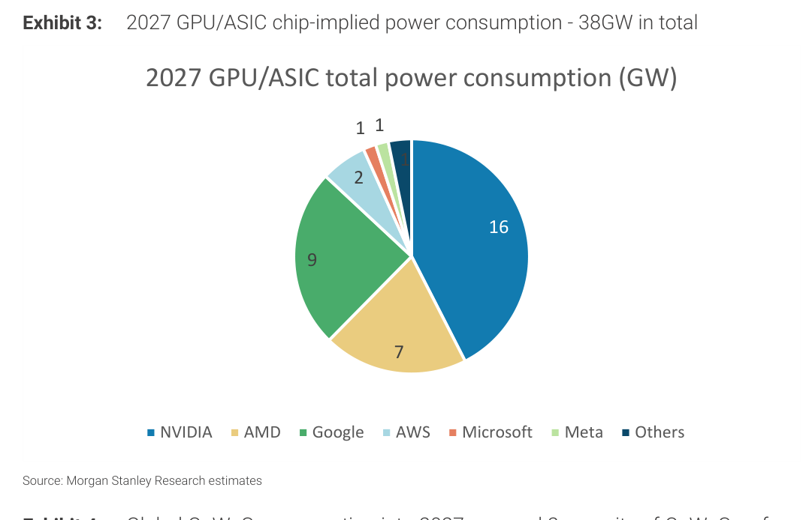
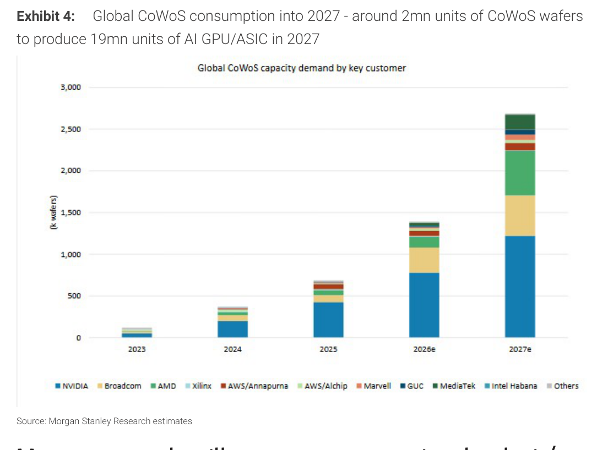
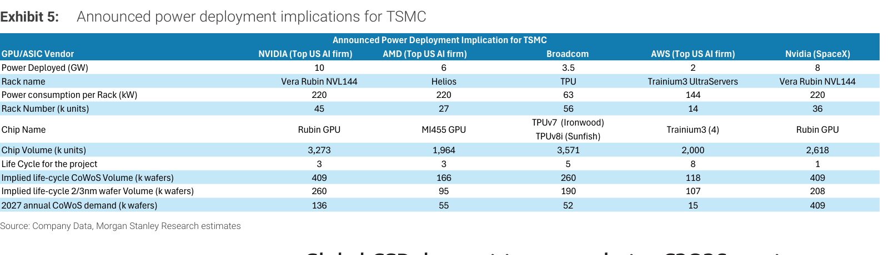
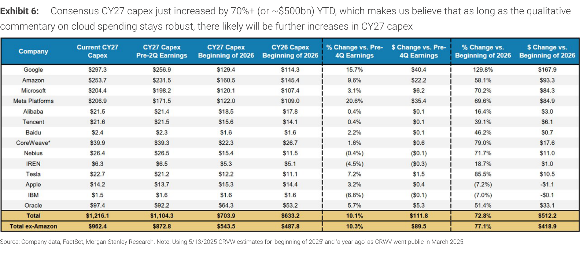
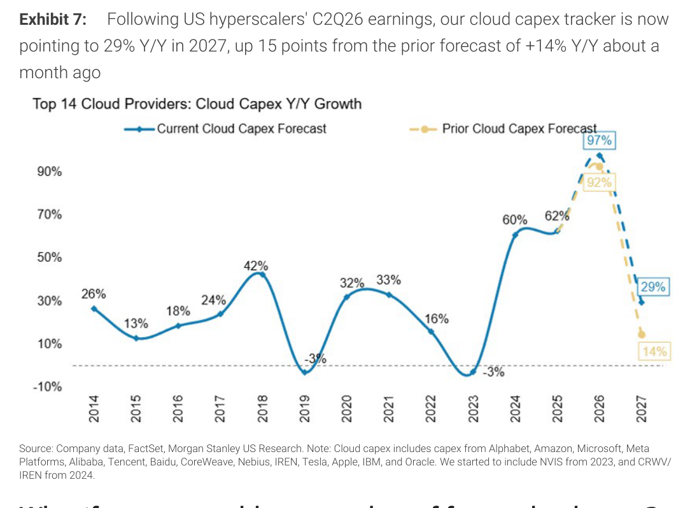

# Morgan Stanley｜Connecting Dots：香港投資人對亞洲半導體的回饋

**券商**：Morgan Stanley  
**分析師**：Charlie Chan、Andy Meng CFA、Derrick Yang、Howard Kao、Daniel Yen CFA 等  
**日期**：2026-08-09  
**主題**：香港 3 日 Greater China 半導體 marketing 回饋＋TSMC CoWoS 隱含耗電量（GW）分析  
**評級**：In-Line（產業評等）  
<a href="https://layx.uk/dl?g=產業&b=MS&d=20260809&h=HK-Investor-Feedback">📎 下載 PDF</a>

---

## 報告總結

本報告為 MS 於香港 3 日 Greater China 半導體投資人 marketing 的回饋彙整，並附上以「耗電量（GW）」反推 TSMC CoWoS 與晶圓需求的原創分析。核心觀察：投資人焦點正從「漲價動能」轉向「量的成長（volume play）」，且愈來愈關注 AI 資本支出的 ROIC、以及晶片量與電力（GW）的對應——電力供給已成全球瓶頸。「記憶體大餅該多大」（Exhibit 1 顯示記憶體佔 2027 雲端資本支出 US\$1.5tn 的 53%）是升溫中的辯論。

投資結論：若「漲價」動能放緩、資金可能轉向「量」的標的。MS 在 Greater China 半導體的關鍵 OW 為 **台積電（TSMC）、日月光（ASE）、ASM Pacific、聯發科（MediaTek）、信驊（Aspeed）、海光（Hygon）、瀾起（Montage）**。同時 MS 雲端資本支出追蹤顯示 2027 上看 US\$1.3tn（較共識高 24%），且 C2Q26 財報後 2027 YoY 成長預估由 +14% 上修至 +29%，資本支出上行趨勢未歇。

---

## Morgan Stanley 完整投資邏輯鏈

| 論點層次 | Exhibit | 內容 |
|---|---|---|
| 需求真實且上修 | 2, 6, 7 | MS 估 2027 雲端資本支出 US\$1.3tn（高於共識 24%）；共識 CY27 資本支出 YTD +72.8% |
| 電力為瓶頸 | 3, 5 | 2027 GPU/ASIC 隱含耗電 38GW；以 GW 反推晶片量與 CoWoS 需求 |
| CoWoS 續爆發 | 4, 5 | 2027 全球 CoWoS ~2mn（圖示近 2.7mn）片，生產 19mn 顆 AI GPU/ASIC |
| 記憶體大餅之辯 | 1 | 記憶體佔 2027 雲端資本支出 53%，投資人辯論其可持續性 |
| 焦點轉向「量」 | 報告封面 | 若漲價動能放緩，資金轉向 volume play |
| **結論** | 報告封面 | **AI 資本支出上行未歇、電力為瓶頸；OW：台積電、日月光、ASMPT、聯發科、信驊、海光、瀾起** |

---

## 報告核心觀點

| 主題 | MS 觀點 | 市場共識 | 是否 Contra-Consensus |
|---|---|---|---|
| 2027 雲端資本支出 | MSe US\$1.3tn | 較 MSe 低 24% | 偏多（高於共識） |
| CY27 資本支出趨勢 | C2Q26 後由 +14% 上修至 +29% YoY | +14%（一個月前） | 偏多（上修） |
| 記憶體佔雲端資本支出 | 53%（US\$1.5tn 中） | 辯論中 | 中性（引發辯論） |
| 電力（GW） | 2027 GPU/ASIC 隱含 38GW，為全球瓶頸 | 關注度上升 | 中性 |
| 投資風格 | 焦點由「漲價」轉「量」 | — | — |

**零件/個股偏好（Greater China 半導體 OW）**：台積電（2330）、日月光（3711）、ASM Pacific、聯發科（2454）、信驊（5274）、海光（Hygon）、瀾起（Montage）

---

## Exhibit 1｜2027 雲端資本支出結構（以 US\$1.5tn 為總預算）

### 解讀摘要
以 US\$1.5tn（含 sovereign AI）為 2027 雲端資本支出總額，記憶體佔 53%、基礎設施 20%、GPU/ASIC（不含 HBM）18%、硬體 7%、伺服器 CPU 2%。記憶體單一項目就過半，是「記憶體大餅該多大」辯論的量化起點——若記憶體佔比未來下修，對其他環節（運算/硬體）反是空間釋放。

### 表格（2027 雲端資本支出結構）

| 項目 | 佔比 |
|---|---|
| Memory | 53% |
| Infrastructure | 20% |
| GPU/ASIC（不含 HBM） | 18% |
| Hardware | 7% |
| Server CPU | 2% |

### 洞察

> **洞察一**：記憶體 53% vs 運算（GPU/ASIC ex-HBM）18%，比例近 3:1——這解釋了為何當前記憶體漲價循環吸引最多資金（Key Observation 4：記憶體關注度高於邏輯/運算）。但也是風險點：若「記憶體大餅」被質疑過大，資金可能回流運算與硬體標的。

---

## Exhibit 2｜MS 雲端資本支出追蹤：2027 估近 US\$1.3tn

### 解讀摘要
MS 追蹤前 14 大全球 CSP（不含 sovereign AI）雲端資本支出：2024 US\$293bn → 2025 US\$476bn → 2026 US\$916bn → 2027 US\$1,048bn，MS 自身 2027E 估 US\$1,304bn，較共識高 24%。2025 起「短生命週期資產」佔比升至 50%→65%，反映 GPU/加速器折舊快、汰換頻繁。

### 表格（雲端資本支出，US\$bn）

| 年度 | 金額 |
|---|---|
| 2024 | 293 |
| 2025 | 476 |
| 2026 | 916 |
| 2027 | 1,048 |
| MS 2027E | 1,304 |

### 洞察

> **洞察一**：MSe 2027 US\$1,304bn 較公式追蹤值 US\$1,048bn 再高一截，且較市場共識高 24%——MS 對雲端資本支出的樂觀程度顯著領先市場，若後續財報驗證，對整條 AI 硬體/半導體供應鏈是持續的上修動能。

---

## Exhibit 3｜2027 GPU/ASIC 隱含耗電量——合計 38GW

### 解讀摘要
以晶片量反推，2027 GPU/ASIC 隱含總耗電量約 38GW，其中 NVIDIA 16GW（42%）、Google 9GW、AMD 7GW、AWS 2GW，微軟/Meta/其他各約 1GW。此圖回應投資人最常問的「晶片量 vs 電力」對應——電力已是全球部署瓶頸（Key Observation 3）。

### 表格（2027 GPU/ASIC 隱含耗電量，GW）

| 廠商 | 耗電量（GW） |
|---|---|
| NVIDIA | 16 |
| Google | 9 |
| AMD | 7 |
| AWS | 2 |
| Microsoft | 1 |
| Meta | 1 |
| Others | 1 |
| **合計** | **~38** |

### 洞察

> **洞察一（配合 Exhibit 5）**：NVIDIA 單一廠商 16GW 佔 38GW 的 42%，若加上其向 SpaceX 供貨的 8GW（Exhibit 5），NVIDIA 生態系相關耗電逼近 24GW——電力供給若跟不上，反成 GPU 出貨的實體天花板，這是「量的成長」故事的最大變數。

---

## Exhibit 4｜2027 全球 CoWoS 消耗——約 2mn 片晶圓生產 19mn 顆 AI GPU/ASIC

### 解讀摘要
全球 CoWoS 產能需求（by 客戶）自 2023 ~100k 片增至 2027e ~2,680k 片（近 2.7mn），對應生產約 19mn 顆 AI GPU/ASIC。NVIDIA 為最大用量（2027e ~1,220k 片），Broadcom、AMD、聯發科成長顯著。此為 TSMC 先進封裝續擴產的需求依據。

### 表格（全球 CoWoS 產能需求，k 片晶圓）

| 年度 | CoWoS 需求 |
|---|---|
| 2023 | ~100 |
| 2024 | ~350 |
| 2025 | ~680 |
| 2026e | ~1,380 |
| 2027e | ~2,680 |

### 洞察

> **洞察一**：CoWoS 需求 2025→2027e 近 4 倍（680k→2,680k 片），成長斜率遠陡於 GPU 顆數，反映單顆晶片的 CoWoS 用量（更大 interposer、多 die）持續上升——對台積電 CoWoS 與 OSAT（日月光、ASMPT）是量價齊揚。

---

## Exhibit 5｜各家宣布的電力部署對 TSMC 的含義

### 解讀摘要
以各廠宣布的 GW 電力部署，反推機櫃數、晶片量、CoWoS 與 2/3nm 晶圓需求。NVIDIA 10GW（Vera Rubin NVL144，45k 櫃）、AMD 6GW（Helios）、Broadcom 3.5GW（TPU）、AWS 2GW（Trainium3）、NVIDIA-SpaceX 8GW（Vera Rubin NVL144）。關鍵：SpaceX 8GW 因專案生命週期僅 1 年（前置集中），單獨貢獻 2027 年 CoWoS 需求高達 409k 片，與 NVIDIA 本身相當。

### 表格（各家電力部署對 TSMC 含義）

| 項目 | NVIDIA | AMD | Broadcom | AWS | NVIDIA(SpaceX) |
|---|---|---|---|---|---|
| 電力部署（GW） | 10 | 6 | 3.5 | 2 | 8 |
| 機櫃 | Vera Rubin NVL144 | Helios | TPU | Trainium3 US | Vera Rubin NVL144 |
| 每櫃耗電（kW） | 220 | 220 | 63 | 144 | 220 |
| 機櫃數（k 台） | 45 | 27 | 56 | 14 | 36 |
| 晶片量（k 顆） | 3,273 | 1,964 | 3,571 | 2,000 | 2,618 |
| 專案生命週期（年） | 3 | 3 | 5 | 8 | 1 |
| 2027 年 CoWoS 需求（k 片） | 136 | 55 | 52 | 15 | 409 |

### 洞察

> **洞察一（值得驗證）**：SpaceX 8GW 專案假設生命週期僅 1 年，使其 2027 CoWoS 年需求灌到 409k 片（vs NVIDIA 本身 136k）——這個「1 年 vs 3 年」的生命週期假設是最大擺動因子；若 SpaceX 部署拉長或延後，2027 CoWoS 需求會大幅下修。這是 volume play 論述中最需要盯的單一假設。

---

## Exhibit 6｜共識 CY27 資本支出 YTD 已上修 70%+（約 US\$500bn）

### 解讀摘要
市場共識對 14 家 CSP 的 CY27 資本支出，自 2026 年初的 US\$703.9bn 上修至目前 US\$1,216.1bn（+72.8%，約 +US\$512bn）。Google 上修最猛（+129.8% YTD 至 US\$297.3bn），Meta、微軟、亞馬遜均大幅上修。MS 認為只要雲端支出的質化評論維持強勁，CY27 資本支出還會續升。

### 表格（主要 CSP CY27 資本支出，US\$bn；vs 2026 年初）

| 公司 | 目前 CY27 | 2026 年初 | YTD 變化 |
|---|---|---|---|
| Google | 297.3 | 129.4 | +129.8% |
| Amazon | 253.7 | 160.5 | +58.1% |
| Meta Platforms | 206.9 | 122.0 | +69.6% |
| Microsoft | 204.4 | 120.1 | +70.2% |
| Oracle | 97.4 | 64.3 | +51.4% |
| **合計** | **1,216.1** | **703.9** | **+72.8%** |

### 洞察

> **洞察一**：共識已 YTD 上修 +72.8%，卻仍低於 MSe（US\$1,304bn）——顯示即使市場已大幅追高，MS 認為仍有上修空間；資本支出上修的「時間差」是 AI 供應鏈估值續揚的支撐。

---

## Exhibit 7｜C2Q26 財報後，雲端資本支出追蹤指向 2027 +29% YoY

### 解讀摘要
前 14 大 CSP 雲端資本支出 YoY：2024 +60%、2025 +62%、2026 +97%（原估 +92%），2027 由一個月前的 +14% 上修至 +29%（+15 個百分點）。C2Q26 財報成為關鍵上修觸發點，顯示 2027 並非市場擔心的「斷崖」而是續增。

### 表格（前 14 大 CSP 雲端資本支出 YoY）

| 年度 | YoY 成長 |
|---|---|
| 2024 | +60% |
| 2025 | +62% |
| 2026 | +97%（原 +92%） |
| 2027 | +29%（原 +14%） |

### 洞察

> **洞察一**：2027 YoY 由 +14% 上修至 +29% 是本報告最重要的邊際變化——市場先前擔心 2027 資本支出「見頂回落」，但 C2Q26 財報後追蹤值翻倍上修，緩解了 AI 硬體「2027 斷崖」的最大空方論點。

---

## 相關個股清單

| 類別 | 公司 | Ticker | 評等 | 備註 |
|---|---|---|---|---|
| 晶圓代工/先進封裝 | 台積電（TSMC） | 2330 | OW（MS） | CoWoS 續爆發、AI 資本支出上修最大受惠 |
| 半導體封測 | 日月光（ASE） | 3711 | OW（MS） | CoWoS/先進封裝量價齊揚 |
| 半導體設備 | ASM Pacific | 0522.HK | OW（MS） | 先進封裝設備 |
| IC 設計 | 聯發科（MediaTek） | 2454 | OW（MS） | ASIC/運算 |
| IC 設計 | 信驊（Aspeed） | 5274 | OW（MS） | 伺服器 BMC，volume play 受惠 |
| 運算 | 海光（Hygon） | 688041.SH | OW（MS） | 中國運算 |
| 記憶體介面 | 瀾起（Montage） | 688008.SH | OW（MS） | DDR5/記憶體介面 |
