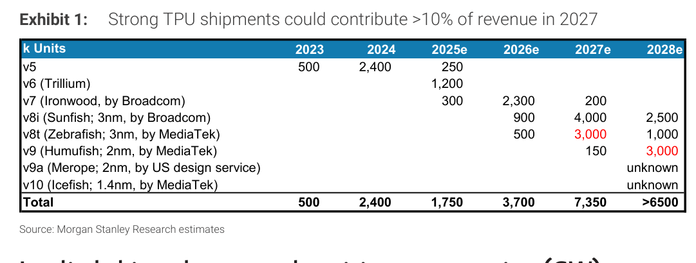
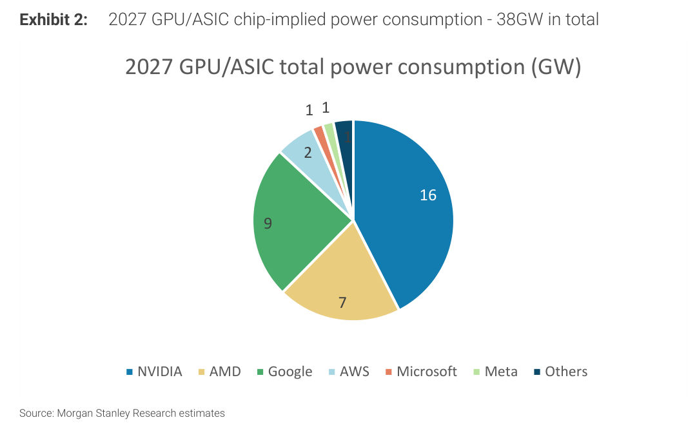
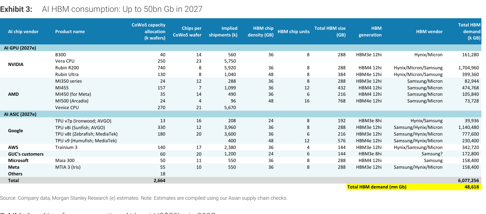
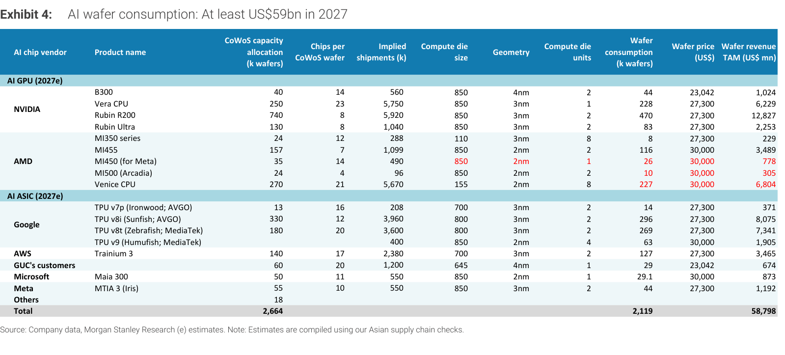
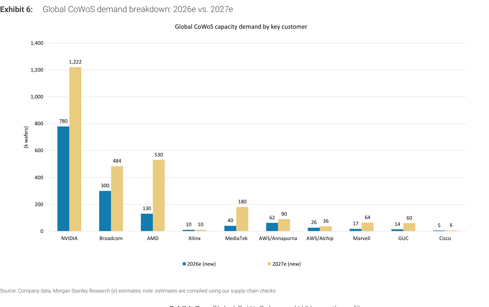
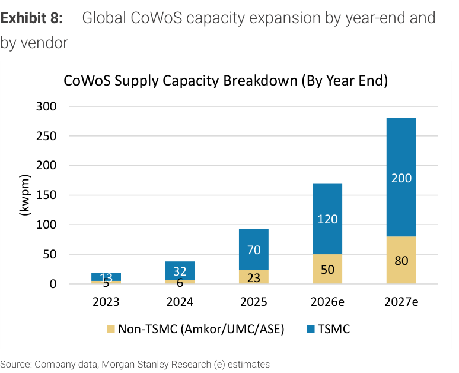
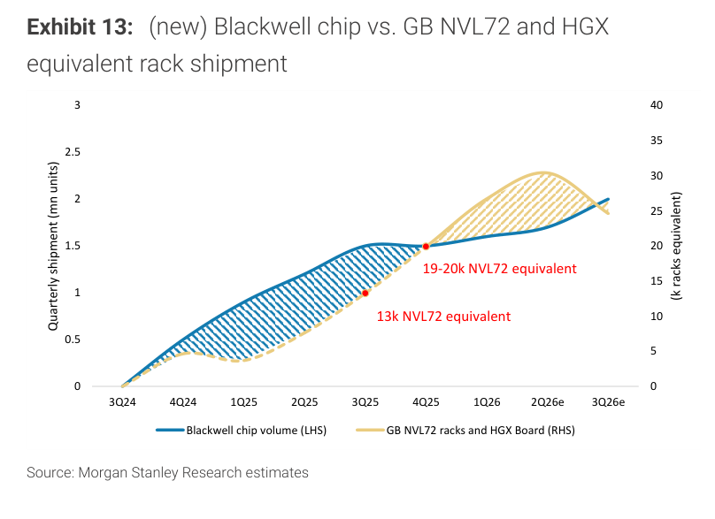
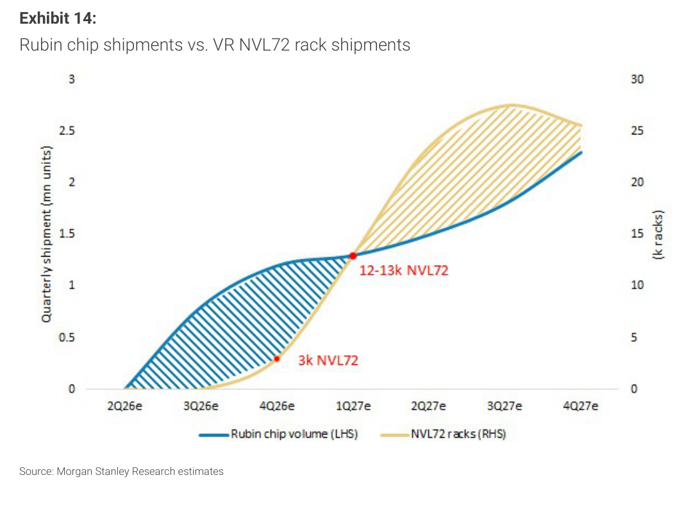
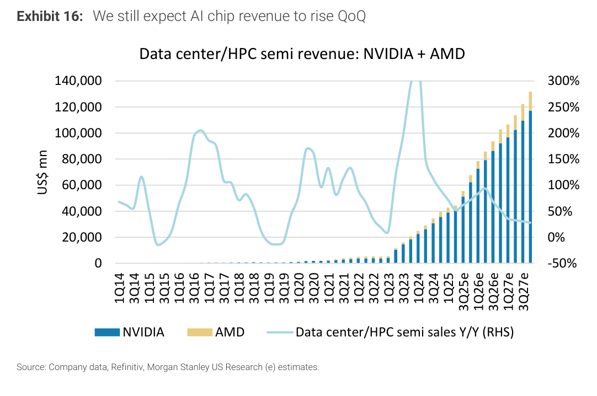
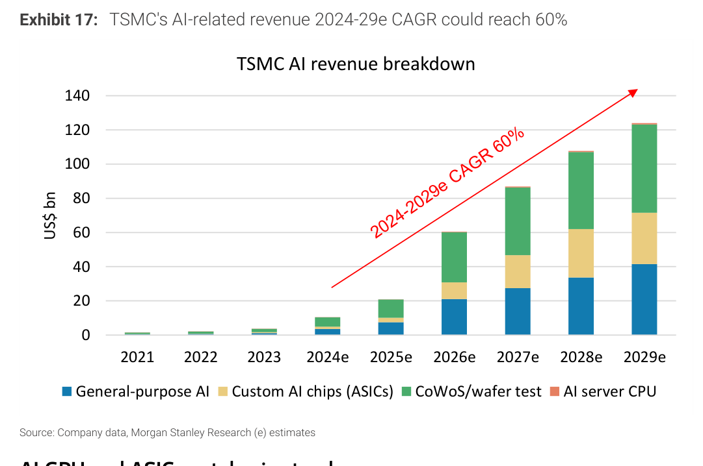

# Morgan Stanley｜AI 供應鏈：記憶體短缺與 Supernode 挑戰下的 GPU 架構優化

**券商**：Morgan Stanley  
**分析師**：Charlie Chan、Daniel Yen CFA、Daisy Dai CFA、Tiffany Yeh、Lucas Wang (RA)  
**日期**：2026-08-10  
**主題**：GPU 硬體架構優化（HBM 降規、Kyber 機櫃、CPO）＋中國 supernode 挑戰＋CoWoS/HBM/晶圓需求追蹤  
**評級**：In-Line（產業評等）  
<a href="https://layx.uk/dl?g=產業&b=MS&d=20260810&h=AI-Supply-Chain">📎 下載 PDF</a>

---

## 報告總結

MS 供應鏈調查指出，Nvidia 為平衡供給、成本與工作負載，Rubin Ultra 可能採「分層 HBM 規格」，並以較短測試時間緩解近期產能瓶頸。核心三大 GPU 架構優化：(1) **HBM 降規**——Rubin Ultra 多 SKU（高階 HBM4e 8Hi、低階 HBM4 12Hi 或 8Hi），反映 HBM 短缺＋成本壓力＋不同工作負載需求，3Q26 底前定案；降規對 decoding（尤其長上下文 LLM）影響大於 pre-fill，但降低單顆記憶體含量反而可能增加晶片出貨量、利好「量」的供應商。(2) **Kyber 機櫃延遲**（無明確時程），Rubin Ultra 首代機櫃續用 Oberon 方案做 NVL72、並導入 CPO/NPO 實現 NVL576 規模；MS 看好 Nvidia 以 CPO 作為 scale-up 效能對抗中國 supernode 的關鍵差異化。(3) **中國 AI supernode** 採 NPO（非 CPO）做機櫃間互連（本地 GPU SerDes 受製程限制停在 100Gb/s/lane），以支援 >2tn 參數 LLM。

需求量級：2027 CoWoS 產能配置 2,664k 片、HBM 需求最高 48.6bn Gb、晶圓 revenue TAM ~US\$59bn；TSMC AI 相關營收 2024-29e CAGR 上看 60%。ASIC 方面聯發科 guide 2027 ASIC 市佔 15-20%、2028 隨 2nm TPU 放量續升。

---

## Morgan Stanley 完整投資邏輯鏈

| 論點層次 | Exhibit | 內容 |
|---|---|---|
| HBM 降規 | 3 | Rubin Ultra 分層 HBM（HBM4e 8Hi/HBM4 12Hi），2027 HBM 需求最高 48.6bn Gb |
| 降規利好「量」 | 1, 6 | 降低單顆記憶體含量→晶片出貨量增；TPU 2027e 7,350k、CoWoS 需求 AMD 4x |
| CPO 差異化 | 報告封面 | Rubin Ultra 用 Oberon+CPO/NPO 實現 NVL576；對抗中國 NPO supernode |
| 供給擴張 | 8 | TSMC CoWoS 產能 2027e 200kwpm（2025 70）；仍需追上需求 |
| 需求量級 | 4, 17 | 2027 晶圓 TAM US\$59bn；TSMC AI 營收 2024-29e CAGR 60% |
| ROIC 訊號 | 18 | H100 租金企穩/回升，暗示供需趨緊、AI capex 回報改善 |
| **結論** | — | **架構優化（降規/CPO）緩解瓶頸並利好台廠；CoWoS/HBM/晶圓需求續強** |

---

## 報告核心觀點

| 主題 | MS 觀點 | 市場疑慮 | 是否 Contra-Consensus |
|---|---|---|---|
| Rubin Ultra HBM | 分層規格（HBM4e 8Hi / HBM4 12Hi-8Hi） | 疑「全面降規」 | 澄清：非全砍、按工作負載分層 |
| 降規對出貨 | 降低單顆記憶體→增晶片出貨量，利好「量」供應商 | 擔心 HBM 需求下修 | 偏多（量增抵銷） |
| Kyber 機櫃 | 延遲、無時程；首代 Rubin Ultra 用 Oberon+CPO | 期待 Kyber | 偏空時程、偏多 CPO |
| 中國 supernode | 採 NPO（非 CPO），受 SerDes 製程限制 | — | 中性 |
| ASIC/TPU | 聯發科 2027 ASIC 市佔 15-20%、2028 續升 | — | 偏多聯發科 |
| TSMC AI 營收 | 2024-29e CAGR 60% | — | 偏多 |

**個股/零件偏好**：TSMC（CoWoS/晶圓）、聯發科（TPU v8t/v9/v10）、CPO 供應鏈；HBM 降規利好「量」的封測/基板供應商

---

## Exhibit 1｜Google TPU 出貨（強勁 TPU 2027 貢獻 TSMC >10% 營收）

### 解讀摘要
Google TPU 總出貨自 2023 500k 增至 2026e 3,700k、2027e 7,350k、2028e >6,500k。世代供應商轉移明顯：v7（Ironwood）與 v8i（Sunfish）由 Broadcom，v8t（Zebrafish, 3nm）/v9（Humufish, 2nm）/v10（Icefish, 1.4nm）由**聯發科**。聯發科在 TPU 的滲透（v8t 起）是台廠 ASIC 最大受惠點。

### 表格（Google TPU 出貨，k units）

| 世代 | 2025e | 2026e | 2027e | 2028e |
|---|---|---|---|---|
| v7（Ironwood, Broadcom） | 300 | 2,300 | 200 | — |
| v8i（Sunfish, Broadcom） | — | 900 | 4,000 | 2,500 |
| v8t（Zebrafish, MediaTek） | — | 500 | 3,000 | 1,000 |
| v9（Humufish, MediaTek） | — | — | 150 | 3,000 |
| **總計** | **1,750** | **3,700** | **7,350** | **>6,500** |

---

## Exhibit 2｜2027 GPU/ASIC 隱含耗電量——38GW

### 解讀摘要
2027 GPU/ASIC 隱含總耗電 38GW（NVIDIA 16GW、Google 9GW、AMD 7GW、AWS 2GW，微軟/Meta/其他各約 1GW），與同日 MS「HK 投資人回饋」報告一致。電力為 AI 部署的實體瓶頸，也是 supernode 架構（提高單櫃 GPU 密度）的驅動因素。

### 表格（2027 GPU/ASIC 耗電，GW）

| 廠商 | GW |
|---|---|
| NVIDIA | 16 |
| Google | 9 |
| AMD | 7 |
| AWS | 2 |
| Microsoft／Meta／Others | 各 ~1 |
| **合計** | **~38** |

---

## Exhibit 3｜AI HBM 消耗——2027 最高 48.6bn Gb

### 解讀摘要
2027 AI HBM 總需求最高 48,618 mn Gb（≈48.6bn Gb），對應 CoWoS 產能配置 2,664k 片。單一產品最大 HBM 需求為 Rubin R200（1,704,960k Gb，HBM4 12Hi）與 TPU v8i（1,140,480k Gb）。Rubin Ultra 於此「up to」情境列 HBM4e 12Hi（384GB），但正文指出實際可能降規至 8Hi——即本表為上限、降規後需求會下修。

### 表格（主要產品 HBM 需求，2027e）

| 產品 | HBM 世代 | 單顆容量(GB) | HBM 需求(k Gb) |
|---|---|---|---|
| NVIDIA Rubin R200 | HBM4 12Hi | 288 | 1,704,960 |
| NVIDIA Rubin Ultra | HBM4e 12Hi | 384 | 399,360 |
| Google TPU v8i | HBM3e 12Hi | 288 | 1,140,480 |
| AMD MI455 | HBM4 12Hi | 432 | 474,768 |
| **總計** | | | **~48,618（mn Gb）** |

### 洞察

> **洞察一（值得驗證）**：本表 Rubin Ultra 用 HBM4e 12Hi 384GB，但正文明指 Nvidia 傾向降至 8Hi——若成真，Rubin Ultra HBM 需求由 ~399k Gb 下修約 1/3；惟 MS 認為單顆記憶體減少會使晶片出貨量增加，對「量」的供應商（封測/基板）反而是利多。這是 HBM「值 vs 量」的核心擺動點。

---

## Exhibit 4｜AI 晶圓消耗——2027 至少 US\$59bn

### 解讀摘要
2027 AI 晶圓總消耗 2,119k 片、晶圓 revenue TAM US\$58,798mn（~US\$59bn）。TSMC 晶圓報價假設：3nm US\$27,300、2nm US\$30,000、4nm US\$23,042。NVIDIA Rubin R200 貢獻最大晶圓營收（US\$12,827mn）。

### 表格（AI 晶圓消耗，2027e）

| 指標 | 值 |
|---|---|
| 總晶圓消耗（k 片） | 2,119 |
| 晶圓 revenue TAM（US\$mn） | 58,798 |
| Rubin R200 晶圓營收（US\$mn） | 12,827 |

---

## Exhibit 6｜全球 CoWoS 需求（2026e vs 2027e，by 客戶）

### 解讀摘要
全球 CoWoS 需求（k 片）2026e→2027e：NVIDIA 780→1,222、Broadcom 300→484、AMD 130→530、MediaTek 40→180、Marvell 17→64、GUC 14→60。AMD（+4.1x）與 GUC（+4.3x）成長最猛，反映 ASIC/客製晶片與 MI 系列 GPU 放量。

### 表格（CoWoS 需求，k 片）

| 客戶 | 2026e | 2027e | 倍數 |
|---|---|---|---|
| NVIDIA | 780 | 1,222 | 1.6x |
| Broadcom | 300 | 484 | 1.6x |
| AMD | 130 | 530 | 4.1x |
| MediaTek | 40 | 180 | 4.5x |
| Marvell | 17 | 64 | 3.8x |
| GUC | 14 | 60 | 4.3x |

### 洞察

> **洞察一**：非 NVIDIA 客戶（AMD、MediaTek、GUC）CoWoS 需求 4x+ 成長遠快於 NVIDIA 的 1.6x——CoWoS 需求結構正快速分散化，ASIC/客製晶片是 2027 增量主力，利好聯發科、創意（GUC）等台廠 ASIC 設計服務。

---

## Exhibit 8｜全球 CoWoS 產能擴張（by year-end, by vendor）

### 解讀摘要
全球 CoWoS 產能（kwpm，年底）：TSMC 2025 70 → 2026e 120 → 2027e 200；非 TSMC（Amkor/UMC/ASE）2025 23 → 2026e 50 → 2027e 80。2027e 合計 280kwpm。TSMC 仍主導約 71% 產能。

### 表格（CoWoS 產能，kwpm）

| 年底 | TSMC | 非 TSMC | 合計 |
|---|---|---|---|
| 2025 | 70 | 23 | 93 |
| 2026e | 120 | 50 | 170 |
| 2027e | 200 | 80 | 280 |

### 洞察

> **洞察一（配合 Exhibit 6）**：2027e CoWoS 產能 280kwpm ×12 月 ≈ 3,360k 片年產能，vs Exhibit 6 需求 2,664k 片——名目上供給略高於需求，但考量良率、產品切換與 HBM 排擠，實際仍偏緊；非 TSMC（ASE/Amkor）產能佔比升至 29%，日月光等 OSAT 是外溢受惠者。

---

## Exhibit 13｜(new) Blackwell 晶片 vs GB NVL72＋HGX 等效機櫃出貨

### 解讀摘要
Blackwell 晶片季出貨於 3Q26e 達約 2mn 顆；GB NVL72＋HGX 板等效機櫃自 3Q25 13k、4Q25 19-20k，於 2Q26e 達約 30k 峰值。新版加入 HGX board（相對舊版僅 NVL72），反映部分 Blackwell 以 HGX 形態出貨。

---

## Exhibit 14｜Rubin 晶片 vs VR NVL72 機櫃出貨

### 解讀摘要
Rubin 晶片季出貨自 2Q26e 起爬升，至 4Q27e 達約 2.3mn 顆；VR NVL72 機櫃自 4Q26e 3k、1Q27e 12-13k，至 3Q27e 約 27k 峰值。Rubin 於 4Q26 接棒 Blackwell，2027 全年為 Rubin 放量主年。

### 洞察

> **洞察一（配合 Exhibit 13）**：Blackwell 機櫃 2Q26e 見頂（~30k）、Rubin 機櫃 4Q26e 才起（3k），兩代之間 3Q26 為轉換空窗——這與 MS NVL72 月追蹤報告的「4Q 降速」一致，是供應鏈短期出貨波動的根源，非需求疲軟。

---

## Exhibit 16｜資料中心/HPC 半導體營收（NVIDIA＋AMD）續季增

### 解讀摘要
NVIDIA＋AMD 資料中心/HPC 半導體營收持續季增，至 3Q27e 達約 US\$130bn/季。YoY 成長率雖自 2024 高峰回落，但至 3Q27e 仍維持約 +25% 正成長，顯示絕對規模續創高、成長雖減速但未失速。

---

## Exhibit 17｜TSMC AI 相關營收（2024-29e CAGR 60%）

### 解讀摘要
TSMC AI 相關營收自 2024e ~US\$10bn 增至 2026e ~US\$60bn、2027e ~US\$87bn、2029e ~US\$124bn，2024-29e CAGR 上看 60%。組成含 general-purpose AI、custom AI chips（ASIC）、CoWoS/晶圓測試、AI server CPU；ASIC 與 CoWoS 佔比逐年升。

### 表格（TSMC AI 營收，US\$bn，目測估算）

| 年度 | AI 營收 |
|---|---|
| 2025e | ~21 |
| 2026e | ~60 |
| 2027e | ~87 |
| 2028e | ~107 |
| 2029e | ~124 |

---

## Exhibit 18｜AI GPU H100 租金（per GPU per hour）

### 解讀摘要
H100 雲端租金自 2024 高點（GCP ~US\$7、AWS ~US\$8.7）大幅回落至 2025 低點（~US\$1.2-2.2），2025 下半起企穩並回升（GCP 至 ~US\$3.4、AWS ~US\$2）。租金止跌回升是 AI 運算供需趨緊、AI capex 回報（ROIC）改善的市場化訊號。

### 洞察

> **洞察一**：H100 租金回升呼應「投資人最重視 AI capex 的 ROIC」（見同日 HK 投資人回饋報告 Key Observation 1）——租金若持續走穩/回升，代表 AI 運算需求真實、hyperscaler 續投的財務基礎穩固，是支撐整條供應鏈估值的底層證據。

---

## 相關個股清單

| 類別 | 公司 | Ticker | 備註 |
|---|---|---|---|
| 晶圓代工/先進封裝 | 台積電（TSMC） | 2330 | CoWoS 產能 2027e 200kwpm；AI 營收 CAGR 60% |
| ASIC 設計服務 | 聯發科（MediaTek） | 2454 | TPU v8t/v9/v10；2027 ASIC 市佔 15-20% |
| ASIC 設計服務 | 創意（GUC） | 3443 | CoWoS 需求 2027e +4.3x |
| 半導體封測 | 日月光（ASE） | 3711 | 非 TSMC CoWoS/OSAT 外溢受惠 |
| 光通訊 | CPO/NPO 供應鏈 | — | Nvidia NVL576 導入 CPO/NPO；vs 中國 NPO supernode |
