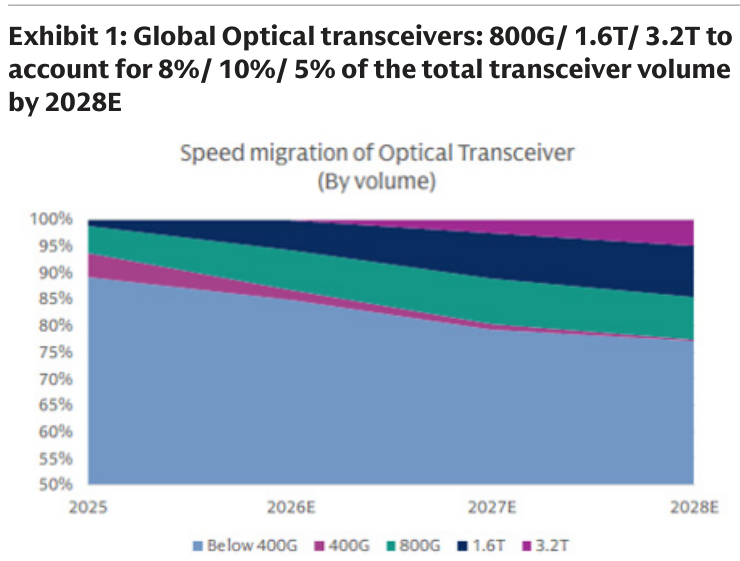
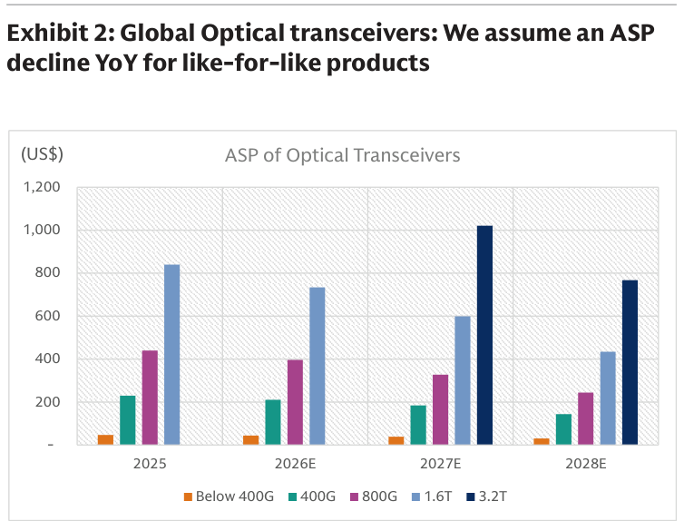
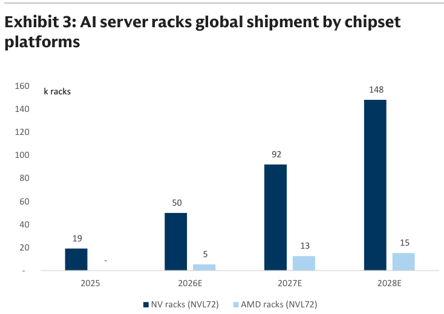
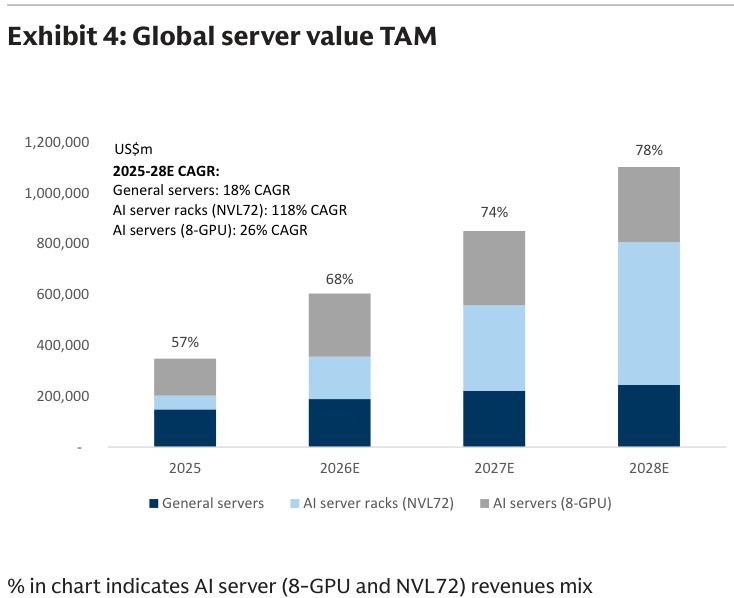

# Goldman Sachs｜光通訊：美國可能限制中國光模組進口的三大投資人辯論

**券商**：Goldman Sachs  
**分析師**：Allen Chang、Verena Jeng、Ting Song  
**日期**：2026-08-11  
**主題**：潛在美國禁止進口中國光收發模組的影響——三大投資人辯論  
**評級**：對中國光通訊龍頭維持正面  
<a href="https://layx.uk/dl?g=產業&b=GS&d=20260811&h=Optical-Networking">📎 下載 PDF</a>

---

## 報告總結

近期媒體報導川普政府正草擬禁止進口中國資料中心零組件、FCC 研擬禁止中國製光模組進口。GS 就此彙整投資人三大辯論：(1) 為何產業龍頭仍持續取得客戶訂單，(2) 產能與成本效率含義，(3) 生產基地分散化。GS 對政策結果不表意見，但**對中國光通訊龍頭（FOCI/上詮、RoboTechnik、Landmark、Eoptolink、VPEC/聯亞）維持正面**——強勁 AI 需求、原材料供給緊、技術快速迭代，使客戶主要仍仰賴既有龍頭。

核心論點：龍頭與 CSP 早期合作、掌握需求與設計方向；光模組 SKU 繁多（速率 1.6T/2.4T/3.2T、形態 pluggable/LPO/NPO/CPO、材料 SiPh/EML/鈮酸鋰、光纖 SMF/MMF）需強大 R&D，強化龍頭競爭力（延續全球首發 400G(2018)/800G(2020)/1.6T(2023) 紀錄）。同時光模組廠正擴產泰國/東南亞以分散供應鏈風險、降低宏觀不確定性衝擊。Buy：FOCI、RoboTechnik、Landmark、Eoptolink、VPEC。

---

## Goldman Sachs 完整投資邏輯鏈

| 論點層次 | Exhibit | 內容 |
|---|---|---|
| 需求結構 | 3, 4 | AI server rack 出貨 NVL72 2025-28E CAGR 118%；伺服器 TAM AI 佔比升至 2028E 78% |
| 速率遷移 | 1 | 800G/1.6T/3.2T 2028E 佔量 8%/10%/5%（高速滲透中，但 Below 400G 仍主導量） |
| 價格趨勢 | 2 | 高速率 ASP 較高但 like-for-like 逐年下滑 |
| 龍頭護城河 | 報告封面 | SKU 繁多＋長開發期＋早期 CSP 合作＝R&D 壁壘，客戶仰賴既有龍頭 |
| 供應鏈分散 | 報告封面 | 擴產泰國/東南亞降低美國進口限制風險 |
| **結論** | 報告封面 | **政策不確定下對中國光龍頭仍正面；Buy：FOCI、RoboTechnik、Landmark、Eoptolink、VPEC** |

---

## 報告核心觀點

| 主題 | GS 觀點 | 市場疑慮 | 是否 Contra-Consensus |
|---|---|---|---|
| 美國進口限制影響 | 不表態結果，但龍頭護城河與需求足以消化 | 擔心中國光模組被禁衝擊 | 偏多（淡化風險） |
| 龍頭客戶黏著 | 早期合作＋R&D 壁壘使客戶續用龍頭 | 疑慮替代 | 偏多 |
| 產能/成本 | 泰國/東南亞擴產分散風險 | 產能外移成本 | 中性 |
| AI server rack | NVL72 2025-28E CAGR 118% | — | 偏多 |

**個股偏好（Buy）**：FOCI（上詮 3363）、RoboTechnik、Landmark、Eoptolink、VPEC（聯亞 3081）

---

## Exhibit 1｜全球光收發模組速率遷移（by volume）

### 解讀摘要
800G/1.6T/3.2T 至 2028E 分別佔總光模組量 8%/10%/5%，高速率持續滲透，但 Below 400G 至 2028E 仍佔約 77%（量的主體仍在低速）。這說明「量」由低速支撐、「值」由高速拉動，兩者需搭配 Exhibit 2 ASP 才能看出營收結構。

### 表格（2028E 各速率佔量）

| 速率 | 2028E 佔量 |
|---|---|
| Below 400G | ~77% |
| 800G | 8% |
| 1.6T | 10% |
| 3.2T | 5% |

---

## Exhibit 2｜全球光收發模組 ASP（like-for-like 逐年下滑）

### 解讀摘要
GS 假設同規格產品 ASP 逐年下滑，但速率升級帶來新的高單價層級：1.6T 自 2025 ~US\$835 降至 2028E ~US\$430；3.2T 2027E 登場即約 US\$1,020、2028E 降至 ~US\$765。高速率導入的「量增」可抵銷「單價年降」，是龍頭營收成長的關鍵。

### 表格（光模組 ASP，US\$，目測估算）

| 速率 | 2025 | 2026E | 2027E | 2028E |
|---|---|---|---|---|
| 400G | ~230 | ~210 | ~185 | ~145 |
| 800G | ~440 | ~390 | ~330 | ~245 |
| 1.6T | ~835 | ~725 | ~595 | ~430 |
| 3.2T | — | — | ~1,020 | ~765 |

### 洞察

> **洞察一（配合 Exhibit 1）**：3.2T 2027E 即達 US\$1,020（1.6T 的 ~1.7 倍），且 2028E 佔量 5%——高速率雖佔量小，但單價數倍於低速，對龍頭是「量小值大」的獲利增量；美國限制若真落地，最受影響的反而是低值標準品，高值 AI 光模組龍頭護城河更穩。

---

## Exhibit 3｜全球 AI server rack 出貨（by chipset）

### 解讀摘要
NV racks（NVL72）自 2025 19k 增至 2026E 50k、2027E 92k、2028E 148k；AMD racks 自 2026E 5k 增至 2028E 15k。NVIDIA rack 是光模組需求的最大拉動來源（NVL72 內含大量高速光互連），與光模組速率遷移（Exhibit 1）互為因果。

### 表格（AI server rack 出貨，k racks）

| 年度 | NV racks（NVL72） | AMD racks |
|---|---|---|
| 2025 | 19 | - |
| 2026E | 50 | 5 |
| 2027E | 92 | 13 |
| 2028E | 148 | 15 |

---

## Exhibit 4｜全球伺服器 value TAM

### 解讀摘要
全球伺服器 value TAM 自 2025 ~US\$350bn 增至 2028E ~US\$1,090bn。2025-28E CAGR：一般伺服器 18%、AI server rack（NVL72）118%、AI server（8-GPU）26%。AI 伺服器（8-GPU＋NVL72）營收占比自 2025 的 57% 升至 2028E 的 78%。

### 表格（伺服器 value TAM，US\$bn，目測估算）

| 年度 | 總 TAM | AI 伺服器營收占比 |
|---|---|---|
| 2025 | ~350 | 57% |
| 2026E | ~605 | 68% |
| 2027E | ~840 | 74% |
| 2028E | ~1,090 | 78% |

### 洞察

> **洞察一**：AI server rack（NVL72）2025-28E CAGR 118% 遠高於一般伺服器 18%——NVL72 是光模組含量最高的機種，其爆發性成長是 GS 看好光龍頭的根本；即使美國進口限制帶來短期雜訊，AI rack 需求的量級擴張足以支撐龍頭營收。

---

## 相關個股清單

| 類別 | 公司 | Ticker | 評等 | 備註 |
|---|---|---|---|---|
| 光通訊 | FOCI（上詮） | 3363 | Buy（GS） | CPO FAU 龍頭，台股相關 |
| 光通訊 | VPEC（聯亞） | 3081 | Buy（GS） | 磊晶，台股相關 |
| 光通訊 | RoboTechnik | 中國 | Buy（GS） | 中國光模組龍頭 |
| 光通訊 | Landmark | 中國 | Buy（GS） | 中國光模組龍頭 |
| 光通訊 | Eoptolink | 中國 | Buy（GS） | 中國光模組龍頭 |
