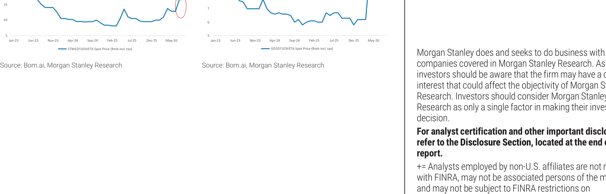
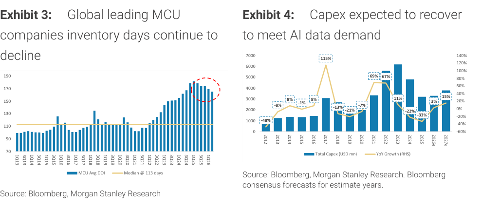

# MS｜MCU – 2H26 晶片通膨持續

**券商**：Morgan Stanley  
**分析師**：Daniel Yen、Charlie Chan、Daisy Dai、Tiffany Yeh  
**日期**：2026-08-12  
**主題**：MCU 晶片通膨延續 2H26（spot 定價 flat MoM，合約價持續上漲）  
**評級**：Industry View Attractive  
<a href="https://layx.uk/dl?g=產業&b=MS&d=20260812&h=MCU">📎 下載 PDF</a>

---

## 報告總結

8 月現貨報價持平 MoM（STMicro 32F103VET6 Rmb16.5、GigaDevice Rmb8.5），但合約端持續通膨：STMicro 6 月 28 日起合約調漲 29% MoM，Nationstech 本年第二輪漲價 +10-20%。成熟製程晶圓廠持續將產能優先分配給 AI 電源應用，MCU 設計廠供應依然偏緊，MS 認為業者將持續轉嫁成本。

需求分化：AI 資料中心相關（光收發器、電池管理、電源控制）強勁；消費型疲弱；工業持平。MS 偏好 GigaDevice 與 Espressif（WiFi MCU，長期 edge AI 受益），對 Nuvoton 維持 UW 等待毛利率回升。

---

## MS 完整投資邏輯鏈

| 論點層次 | 數據 | 內容 |
|---|---|---|
| 現貨定價穩定 | Rmb16.5 / Rmb8.5 flat MoM | STMicro / GD 現貨 8 月持平，合約端漲幅 29% 已 locked in |
| 合約通膨信號 | STMicro +29% MoM；Nationstech +10-20% | 合約調漲代表供應鏈對 2H26 pricing power 的共識 |
| 供給側持續偏緊 | 成熟製程轉 AI 電源 | 晶圓廠分配效應壓縮 MCU 設計廠可用產能，漲價能力增強 |
| 庫存正常化 | 1Q26 ~160天，峰值 ~175天，中位 113天 | 庫存去化過半，補庫需求有望在 2H26 支撐出貨量 |
| 需求分化 | DC 強、消費弱、工業持平 | AI power/光收發器相關成長抵消消費型疲軟 |
| Capex 回升 | 2026e +3% YoY；2027e +15% YoY | 成熟製程 capex 下行週期近尾聲，供給端壓力或延續至 2027 |
| **結論** | 維持 Attractive | 偏好 GigaDevice（大型）/ Espressif（WiFi MCU edge AI）；UW Nuvoton |

---

## 報告核心觀點

| 主題 | MS 觀點 | 備註 |
|---|---|---|
| STMicro 現貨 | 8 月 flat MoM at Rmb16.5 | 合約端 6/28 起 +29% MoM 已生效 |
| GigaDevice 現貨 | 8 月 flat MoM at Rmb8.5 | 跟隨 STMicro 節奏 |
| Nationstech | 第二輪漲價 +10-20% | 本地廠商也掌握定價權 |
| 供應端 | 成熟製程轉 AI 電源 → MCU 產能偏緊 | 部分晶圓廠再次調漲 MCU 代工價 |
| 需求端 | DC 強；消費弱；工業持平 MoM | 光收發器 / 電池管理 / 電源控制驅動 DC 需求 |
| 個股偏好 | GigaDevice、Espressif（OW）；Nuvoton（UW） | GD: NOR/MCU 雙驅動；Espressif: edge AI WiFi MCU |

---

## Exhibit 1+2｜STMicro / GigaDevice 32-bit MCU 現貨價格走勢

### 解讀摘要

STMicro 32F103VET6 現貨 8 月持平 MoM at Rmb16.5，但合約端 6 月 28 日起調漲 29% MoM，兩者背離反映現貨市場消化中、合約端率先鎖住漲幅。GigaDevice 32F103VET6 同樣 flat MoM at Rmb8.5，走勢與 STMicro 高度同步，顯示市場已形成共識定價。從 2023 年初高點（STMicro ~Rmb15、GD ~Rmb11）→ 2024 年低谷（STMicro ~Rmb7、GD ~Rmb6）→ 2026 年回升，這輪週期的漲幅已超越前高，且合約端 +29% 意味現貨可能尚未完全反映供應端壓力。

### 表格

| 品項 | 2026-08 現貨價 | MoM 變化 | 合約調整 |
|---|---|---|---|
| STMicro 32F103VET6 | Rmb16.5（含稅） | Flat | 6/28 起合約 +29% |
| GigaDevice 32F103VET6 | Rmb8.5（含稅） | Flat | 跟進調整中 |
| Nationstech（本土廠） | 未揭露 | 第二輪 +10-20% | 本年累計兩輪上漲 |

> **洞察一**：現貨 flat 而合約已漲 29%，意味現貨市場的消化仍落後合約端至少 1-2 個月；若 9 月現貨補漲，上游 MCU 設計廠的報價能見度將進一步改善。

---

## Exhibit 3+4｜MCU 庫存天數持續下降 / Capex 回升迎接 AI 資料需求

### 解讀摘要（Exhibit 3）

全球主要 MCU 廠平均庫存天數（DOI）自 2024 年底峰值約 175 天持續下降，1Q26 已回落至 ~160 天，但仍明顯高於長期中位數 113 天。去化速度若維持，估計 2026 下半年或接近正常化水位，屆時補庫效應將放大出貨量。MS 用紅色虛線圈出 1Q26 數據，強調去化動能仍在持續。

### 解讀摘要（Exhibit 4）

成熟製程半導體 Capex 2025 年 YoY -33%（兩年連跌），2026e 回升 +3% YoY，2027e 預估 +15% YoY。回升幅度溫和，說明供給端擴產相對謹慎，AI 電源相關需求（光收發器、電池管理）已形成新的 baseline 需求。即便 2027 capex 成長 15%，成熟製程整體利用率仍可望偏高，支撐 MCU 合約定價能力。

### 表格

**Exhibit 3：MCU 平均庫存天數**

| 時期 | 平均 DOI | vs 中位數（113 天） |
|---|---|---|
| 峰值（2024 年底） | ~175 天 | +55% |
| 1Q26 | ~160 天 | +42% |
| 長期中位數 | 113 天 | — |

**Exhibit 4：成熟製程 Capex YoY 成長**

| 年份 | YoY 成長 |
|---|---|
| 2023 | +11% |
| 2024 | -22% |
| 2025 | -33% |
| 2026e | +3% |
| 2027e | +15% |

> **洞察一**：MCU DOI 仍比中位數高 42%（160 vs 113 天），去庫未完成——但方向向下、速度穩定，是「週期向上」而非「已在高點」的訊號。  
> **洞察二**：Capex 2025 兩年累計跌約 48%（-22%→-33%），2026/27 的溫和回升（+3%/+15%）遠低於前次上行（2021-22 年 +69%/+67%），代表供給側不會大幅過剩，有利維持定價紀律。

---

## 相關個股清單

| 類別 | 公司 | Ticker | 評等 | 備註 |
|---|---|---|---|---|
| MCU（中國） | GigaDevice | 603986.SS | OW | 大型 MCU 玩家，NOR/MCU 雙引擎，長期 edge AI |
| WiFi MCU | Espressif Systems | 688271.SS | OW | WiFi MCU 龍頭，edge AI 長期受益 |
| MCU（台灣） | Nuvoton | 4919.TW | UW | 等待 GM 回升，殘差收益模型估值 |
| MCU（國際） | STMicro | STM | 未評等 | 合約調漲 29% MoM 作為業界定價錨點 |
| MCU（本土） | Nationstech | 未揭露 | 未評等 | 本年第二輪漲價 +10-20% |
