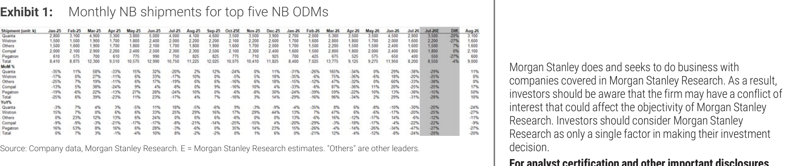
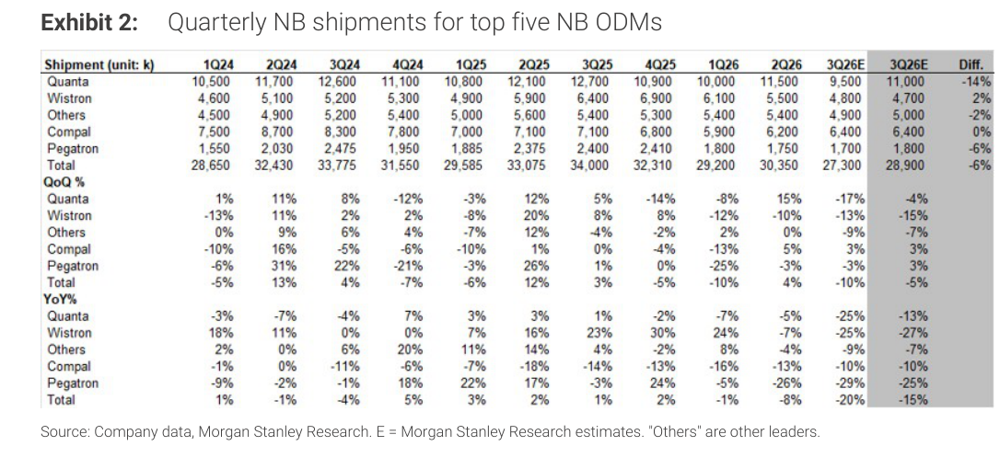

# MS｜NB 月度出貨量追蹤 — 7 月 miss 4%，3Q26E 下調 6% 至 27.3mn

**券商**：Morgan Stanley  
**分析師**：Howard Kao、Irene Yen、Andy Meng (CFA)  
**日期**：2026-08-13  
**主題**：NB 月度出貨追蹤（Jul-26 實際 vs 預估；3Q26E 下調）  
**評級**：Industry View In-Line  
<a href="https://layx.uk/dl?g=產業&b=MS&d=20260813&h=Monthly-Databook-PC">📎 下載 PDF</a>

---

## 報告總結

MS 月度 NB 出貨追蹤顯示 2026 年 7 月五大 ODM 合計出貨 8.2mn（-31% m/m、-24% y/y），較 MS 預估 8.55mn 低 4%，主因零件供給瓶頸持續壓制低端機型出貨、以及拉貨潮消退。Chromebook 在 2Q26 因價格敏感性 + 零件限制而低於季節性，佔比降至 <10%。

MS 據 2Q26 法說後 ODM 最新指引，將 3Q26E NB builds 下調 6% 至 27.3mn（-10% q/q、-20% y/y），低於歷史季節性（15 年均值 3Q 通常 +5% q/q）；各 ODM 也坦言 2H NB builds 將弱於 1H，這是歷史罕見的 2H<1H 格局。正面訊號是 product mix 持續朝高端、高毛利機型傾斜。

---

## MS 完整投資邏輯鏈

| 論點層次 | Exhibit | 內容 |
|---|---|---|
| 7 月出貨確認弱勢 | E1 | 8.2mn miss MS est -4%，-31% m/m、-24% y/y，零件限制壓低端 |
| 8 月估值 | E1 | 9.0mn (+10% m/m、-20% y/y)，低端供給仍受制 |
| 3Q26 下修 | E2 | 27.3mn（↓ 6% vs 前次 28.9mn），-10% q/q、-20% y/y，創次佳季節性 |
| 需求結構轉變 | E2 | 2H<1H（atypical），Chromebook sub-seasonal，高端 mix 上升 |
| **結論** | 封面 | **In-Line；3Q26 下修，低端受限、高端 mix 支撐 ASP；觀察 4Q 季節性回升能否彌補** |

> **報告最大邏輯缺口**：零件供給何時解除瓶頸、低端 Chromebook 需求是季節性遞延還是結構性萎縮，兩者都未說清楚，是 4Q26 能否反彈的關鍵未知數。

---

## 報告核心觀點

| 主題 | MS 觀點 | 市場共識 | 是否 Contra-Consensus |
|---|---|---|---|
| 7 月 NB 出貨 | 8.2mn，miss MS est -4%，弱於季節性 | 市場預期低（已知弱） | In-line（確認弱） |
| 3Q26E NB builds | 27.3mn（↓ 6%），-10% q/q | 市場預期約 29mn | 下修（contra-consensus） |
| 季節性格局 | 2H<1H（罕見），3Q -10% q/q vs 歷史 +5% | 歷史 2H>1H 預期 | Contra-consensus |
| 低端 vs 高端 | 高端 mix 上升抵銷量減，ASP 支撐 | — | — |
| Chromebook | 2Q sub-seasonal，價格敏感 + 零件限制 | — | — |

**偏好排序**：高端/商用 NB（ASP 優）> 低端/Chromebook（量受限，敏感度高）

---

## Exhibit 1｜Monthly NB shipments for top five NB ODMs

### 解讀摘要

7 月 2026 五大 ODM NB 合計出貨 8.2mn（8,200k）單位，較 MS 預估 8.55mn 低 4%，MoM -31%、YoY -24%。-31% MoM 的跌幅反映 6 月出貨的高基期（11.95mn，季末集中出貨）與 7 月初零件取得仍受限，並非需求崩潰信號。8 月預估 9.0mn（+10% MoM），顯示月度節奏將小幅回溫，但 YoY 仍 -20%，全年弱基調不變。

> **原文補充**：MS 指出 Compal 等 ODM 在 2Q 法說中確認 2H NB 出貨將弱於 1H，此為歷史罕見（通常 2H>1H）；成因是 1H26 出現反常高拉貨（關稅前備貨 + 地緣政治備貨），導致下半年需求提前耗用。

### 表格（關鍵彙總列）

| 指標 | Jun-26 | Jul-26 | Jul-26E | Diff | Aug-26e |
|---|---|---|---|---|---|
| 總出貨量（k units） | 11,950 | 8,200 | 8,550 | -4% | 9,000 |
| MoM% | — | -31% | — | — | +10% |
| YoY% | — | -24% | — | — | -20% |

> **洞察一**：7 月 MoM -31% 的劇降有大量基期效應（6 月=11.95mn），不宜解讀為需求走弱；更具參考意義的是 YoY -24%——這反映真實需求不足，與 3Q26E 下調一致。

---

## Exhibit 2｜Quarterly NB shipments for top five NB ODMs

### 解讀摘要

3Q26E NB builds 從 28.9mn 下調 6% 至 27.3mn（-10% q/q、-20% y/y），各 ODM 皆有下修（Quanta -14%、Wistron +2%、Compal 0%、Pegatron -6%）。-10% q/q 遠低於過去 15 年的 3Q 均值 +5% q/q，這是歷史上較罕見的「旺季不旺」形態，MS 主要歸因於零件供給瓶頸持續壓制低端機型 + 需求拉貨效應在上半年已提前耗盡。

### 表格（3Q26E 彙總）

| 公司 | 1Q26 | 2Q26 | 3Q26E（新） | 3Q26E（前次） | Diff |
|---|---|---|---|---|---|
| Quanta | 10,000 | 11,500 | 9,500 | 11,000 | -14% |
| Wistron | 6,100 | 5,500 | 4,800 | 4,700 | +2% |
| Others | 5,400 | 5,400 | 4,900 | 5,000 | -2% |
| Compal | 5,900 | 6,200 | 6,400 | 6,400 | 0% |
| Pegatron | 1,800 | 1,750 | 1,700 | 1,800 | -6% |
| **Total** | **29,200** | **30,350** | **27,300** | **28,900** | **-6%** |
| QoQ% | — | +4% | **-10%** | -5% | — |
| YoY% | — | -8% | **-20%** | -15% | — |

> **洞察二**：Quanta 下修 -14% 幅度最大，但 Compal 和 Wistron 幾乎不動甚至小升，顯示下修集中在低端/Chromebook 機型（由 Quanta 主導），而非全面需求崩潰。高端商用機型供應鏈（Compal）相對抗跌。

---

## 相關個股清單

| 類別 | 公司 | Ticker | 評等 | 備註 |
|---|---|---|---|---|
| NB ODM | 廣達電腦 | 2382 TT | N/A | 最大 NB ODM，Quanta 3Q26E 下修 -14% |
| NB ODM | 仁寶電腦 | 2324 TT | UW（MS） | Compal，3Q26E 0%（相對穩） |
| NB ODM | 緯創資通 | 3231 TT | N/A | Wistron，3Q26E +2% |
| NB ODM | 和碩聯合 | 4938 TT | N/A | Others 部分 |
| NB ODM | 英業達 | 2356 TT | N/A | Pegatron，3Q26E -6% |
