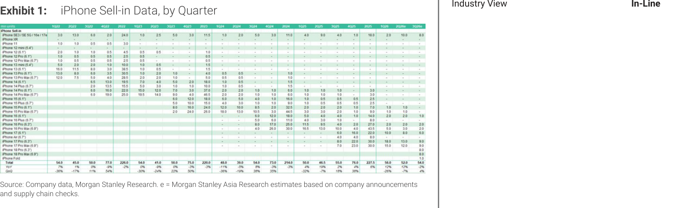
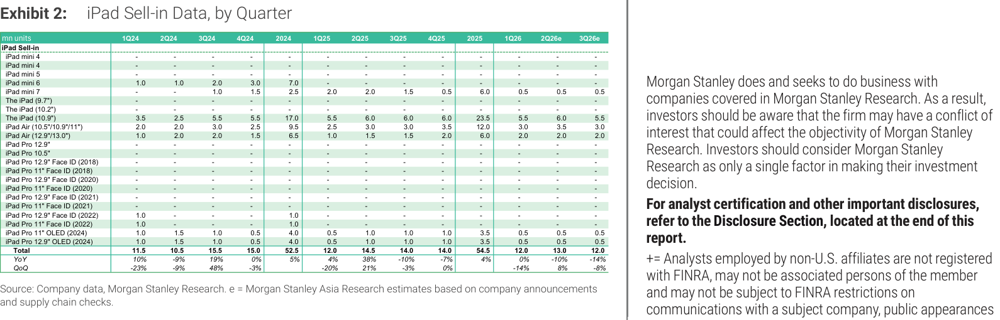

# MS｜iPhone & iPad 月度出貨量追蹤 — iPhone 不變，iPad 3Q26e 下調 1M

**券商**：Morgan Stanley  
**分析師**：Howard Kao、Derrick Yang、Andy Meng (CFA)、Irene Yen、Vivi Huang、Betty Chen  
**日期**：2026-08-13  
**主題**：iPhone & iPad 季度出貨量更新（3Q26e 月度更新）  
**評級**：Industry View In-Line  
<a href="https://layx.uk/dl?g=產業&b=MS&d=20260813&h=Monthly-Databook-iOS">📎 下載 PDF</a>

---

## 報告總結

MS 本月 iOS 出貨追蹤維持 3Q26e iPhone build 54M（+4% q/q、-2% y/y）不變，SKU 組合仍偏 premium（18 Pro/Pro Max + iPhone Fold 7-8M），標準 iPhone 18 延至 1H27 上市。iPhone Fold 7-8M 2H26 預估也維持不動，MS 表示將持續觀察爬坡進度以決定是否調整。

iPad 方面，3Q26e 下調 1M 至 12M（-8% q/q、-14% y/y），原因是 1H 已有部分提前拉貨、加上漲價影響後續需求。iPad 2Q26e 維持 13M，但 3Q26e 由前次 13M 下修為 12M。整體而言，iPhone 供應鏈無需調整，iPad 供應鏈小幅下修。

---

## MS 完整投資邏輯鏈

| 論點層次 | Exhibit | 內容 |
|---|---|---|
| iPhone 需求維持 | E1 | 3Q26e 54M 不變（+4% q/q、-2% y/y），YoY 略負反映 SKU 向 premium 傾斜而非需求走弱 |
| Fold 量產追蹤 | E1 | 7-8M 2H26 預估不動，爬坡進度是後續上/下修關鍵 |
| SKU mix 解讀 | E1 | iPhone 18 標準版延至 1H27，3Q26 全靠 Pro/Pro Max + Fold，ASP 高 |
| iPad 下修 | E2 | 3Q26e 12M（↓ 1M），1H 拉貨效應 + 漲價壓制 2H 需求 |
| **結論** | 封面 | **In-Line；iPhone 無調整，iPad 3Q 下修 1M；關注 Fold 量產進度** |

> **報告最大邏輯缺口**：iPhone Fold 7-8M 預估仍屬估計區間、且 2H26 內 3Q/4Q 分佈未說明——若 Fold 3Q26 拉貨低於預期，54M total 有下修空間。

---

## 報告核心觀點

| 主題 | MS 觀點 | 市場共識 | 是否 Contra-Consensus |
|---|---|---|---|
| 3Q26e iPhone build | 54M（不變），+4% q/q、-2% y/y | 約 54M | In-line |
| iPhone Fold 2H26 | 7-8M（不變），持續觀察爬坡 | 市場看法分歧 | 偏保守（未上修） |
| iPhone 18 時間 | 1H27（標準版），3Q26 僅 Pro/Fold | 部分預期 2H26 | 確認 |
| 3Q26e iPad build | 12M（↓ 1M），-8% q/q、-14% y/y | 前次 13M | 下修 |
| iPad 下修原因 | 1H 提前拉貨 + 漲價影響 2H 需求 | — | — |

**偏好排序**：iPhone（3Q 不動，premium mix ASP 高）> iPad（3Q 下修，量弱）

---

## Exhibit 1｜iPhone Sell-in Data, by Quarter

### 解讀摘要

iPhone 3Q26e build 維持 54M，與上月預估完全一致。2Q26 實際 build 52M（-7% q/q、+12% y/y），好於季節性（歷史通常 -15~25% q/q），顯示 sell-through 動能穩健。3Q26 YoY -2% 反映的是 SKU 結構而非需求走弱——今年 3Q26 沒有標準 iPhone 18（延至 1H27），純 premium 組合雖然 ASP 高但絕對出貨量偏保守。iPhone Fold 貢獻 ~8M 在 2H26（3Q26e 看約 7-8M）。

### 表格（關鍵彙總列）

| 指標 | 1Q26 | 2Q26e | 3Q26e |
|---|---|---|---|
| iPhone 合計（mn units） | 56 | 52 | 54 |
| QoQ | — | -7% | +4% |
| YoY | — | +12% | -2% |
| iPhone Fold（mn units） | — | — | ~8 |

> **洞察一**：3Q26 YoY -2% 是 SKU 拆分發布帶來的基期效應（2025 同期 55M 含標準型），並非需求轉弱信號——售完率若維持，premium 組合的實際消費強度被季節性數字掩蓋。

---

## Exhibit 2｜iPad Sell-in Data, by Quarter

### 解讀摘要

iPad 3Q26e 下調 1M 至 12M（-8% q/q、-14% y/y），為本月唯一異動。下修原因是 1H26 拉貨效應提前耗用後續需求、加上料件漲價抑制終端需求。2Q26e 維持 13M 不變（+8% q/q vs 1Q26=12M），1H26 合計 25M。YoY -14% 主要反映 2Q25（含新機發布）高基期效應，而非 iPad 需求長期下滑。

### 表格（關鍵彙總列）

| 指標 | 1Q26 | 2Q26e | 3Q26e |
|---|---|---|---|
| iPad 合計（mn units） | 12 | 13 | 12 |
| QoQ | -14% | +8% | -8% |
| YoY | — | — | -14% |

> **洞察二**：本月下修幅度（-1M）不大，但 1H pull-forward + 漲價雙重壓制若延伸，4Q26 也存在下行風險。iPad 供應鏈整體偏弱，相比 iPhone 沒有 Fold 量產爬坡的正向催化劑。

---

## 相關個股清單

| 類別 | 公司 | Ticker | 評等 | 備註 |
|---|---|---|---|---|
| 組裝（iOS） | 鴻海精密 | 2317 TT | N/A | 主要 iPhone 組裝廠 |
| 組裝（iOS） | 和碩聯合 | 4938 TT | N/A | 次要組裝廠 |
| 零組件（iOS） | 台積電 | 2330 TT | N/A | A18/A18 Pro/Fold AP 晶片製造 |
