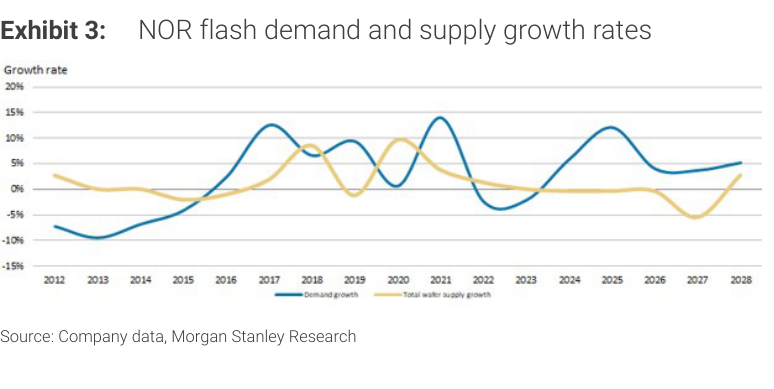
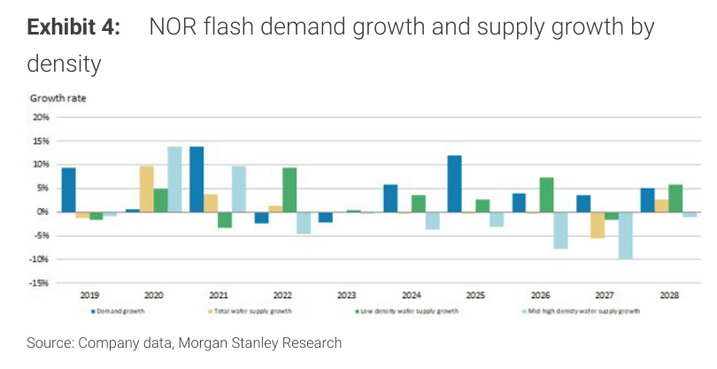
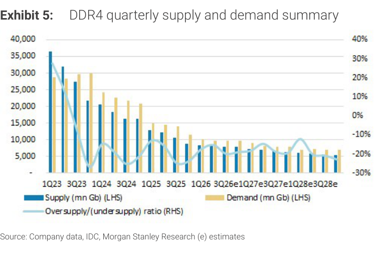
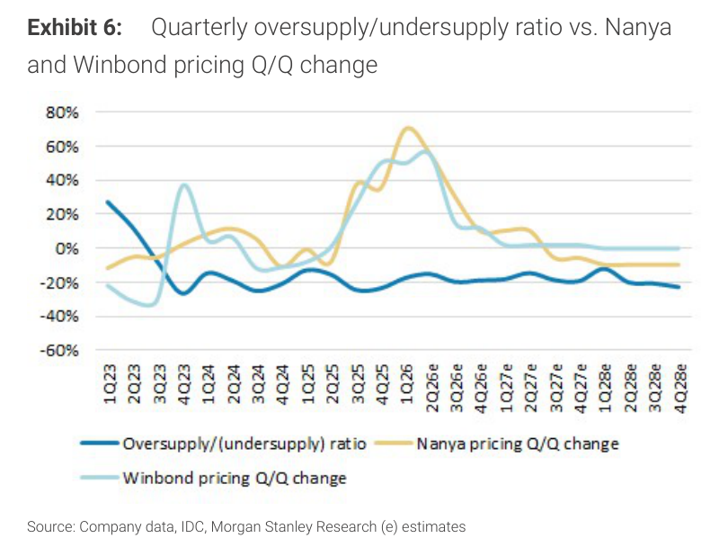
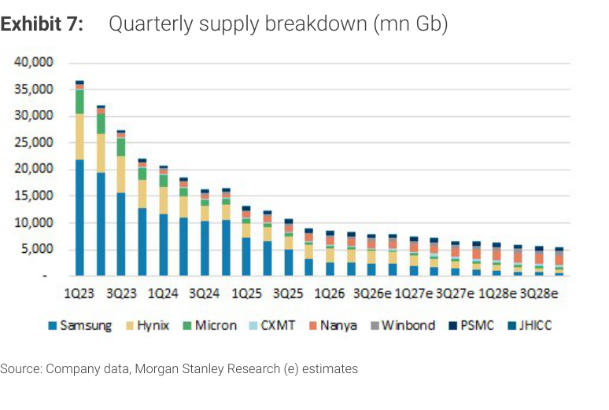
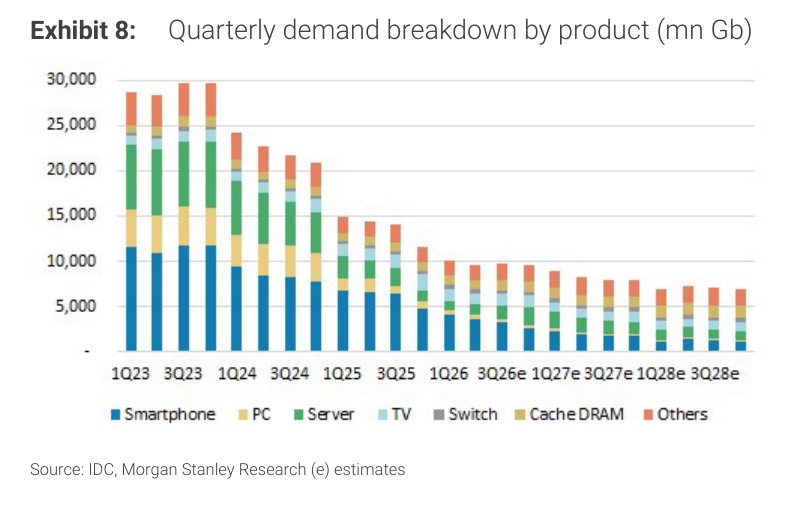
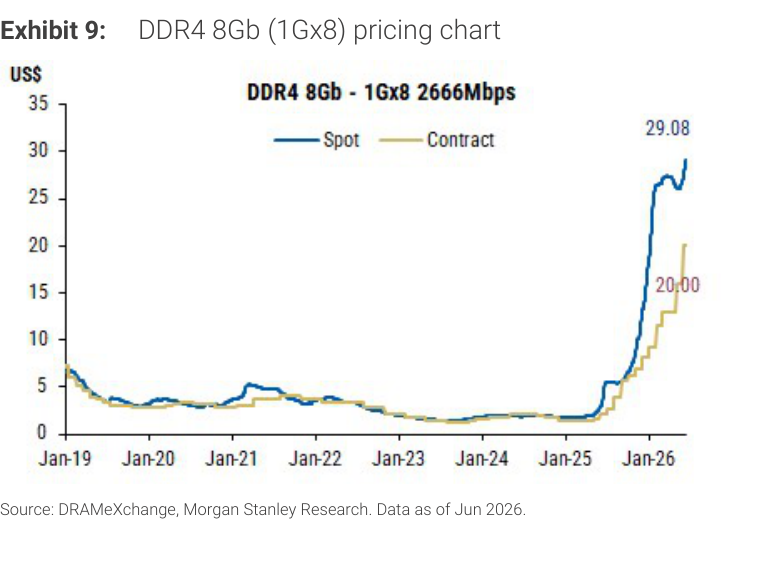
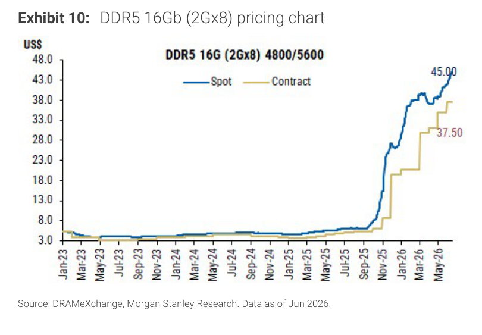

# Morgan Stanley｜Old Memory: No LTAs Is Not Necessarily Bad

**券商**：Morgan Stanley  
**分析師**：Daniel Yen、Charlie Chan、Daisy Dai、Tiffany Yeh、Ethan Jia  
**日期**：2026-08-16  
**主題**：Old Memory（DDR4/NOR Flash/SLC NAND）定價上行持續  
**評級**：Attractive（Industry View）  
<a href="https://layx.uk/dl?g=產業&b=MS&d=20260816&h=Old-Memory">📎 下載 PDF</a>

---

## 報告總結

MS 認為舊記憶體（Legacy DRAM DDR4、NOR Flash、SLC NAND）的基本面持續改善，且市場對「沒有 LTA 固定合約」的擔憂過度悲觀——缺乏 LTA 實際上反映供需緊張、賣方掌握定價主導權。MS 預估 DDR4 3Q26 漲價 +50%、4Q26 再度雙位數漲幅；SLC NAND 3Q/4Q 均 50%+ 漲幅；NOR Flash 3Q 漲 30-40% 並延伸至 4Q，動能甚至可能延續至 1H27。四家受益公司的 EPS 大幅上調（Macronix +139%/144%/147% 幅度最大），唯 GigaDevice 因 CXMT IPO 後估值重設而目標價下調至 Rmb750。Top Pick 仍為 AP Memory（SiCap 業務）。

---

## MS 完整投資邏輯鏈

| 論點層次 | Exhibit | 內容 |
|---|---|---|
| 需求底部厚實 | Exh. 8 | DDR4 需求來源從 Server 擴展至 Consumer（TV、Switch、Cache DRAM），Server 退出後底部未如預期崩塌 |
| 供給快速萎縮 | Exh. 7 | Samsung/Hynix/Micron 持續退出 DDR4；CXMT 填補有限（2028E 佔比 ~20%） |
| 供需缺口加深 | Exh. 5-6 | DDR4 undersupply -20% 貫穿 2027-2028E；NOR 中高密度 2027E 供給 -10%+ |
| 定價滯後空間 | Exh. 9 | DDR4 Spot US\$29.08 vs Contract US\$20.00，合約仍有 45% 滯後上行空間 |
| NOR 結構性短缺 | Exh. 3-4 | 廠商優先轉產 SLC NAND 壓縮 NOR 供給成長，中高密度缺口最嚴重 |
| 無 LTA ≠ 壞事 | 封面 | 賣方掌握定價主導，漲幅彈性更大；消費端應用需求也在增加 |
| **結論** | 封面 | **Macronix（2337）、Winbond（2344）首選；GigaDevice PT 下調；Top Pick AP Memory** |

> **報告最大邏輯缺口**：CXMT 產能爬坡速度不確定，若實際供給突破預期可壓縮 DDR4 undersupply 比率。另，NOR 供需估算假設中高密度產能持續受擠壓（廠商轉產 SLC NAND），若 SLC 毛利率下滑使廠商回流 NOR，供給恢復速度可能超預期。

---

## 報告核心觀點

| 主題 | MS 觀點 | 市場共識 | 是否 Contra-Consensus |
|---|---|---|---|
| DDR4 定價 | 3Q +50%、4Q double-digit；無 LTA 反映定價主導 | 擔心缺乏 LTA 代表上行動能轉弱 | ✅ 是 |
| SLC NAND 定價 | 3Q/4Q 各 50%+；供給緊張延伸至 2027；MLC→SLC 遷移帶來 1H27 上行 | 預期 3Q 漲後 4Q 趨緩 | ✅ 是 |
| NOR 定價 | 3Q 30-40%；4Q 再漲；AI server 需求是新驅動力 | 已知 NOR 上漲，但幅度預估偏保守 | ⚠️ 部分 |
| GigaDevice | EPS 大幅上調但 PT 下調（CXMT IPO 後估值重設） | 預期 PT 隨 EPS 同步上調 | ✅ 是 |
| Top Pick | AP Memory（SiCap，非傳統記憶體業務）首選 | 多數人偏好 Macronix/Winbond | ⚠️ 部分 |

**偏好排序**：AP Memory（Top Pick）→ Macronix → Winbond → PSMC → GigaDevice（PT 下調）

---

## Exhibit 3｜NOR Flash 需求與供給成長率

### 解讀摘要
NOR flash 供需成長率在 2026-2028E 出現結構性分歧：需求成長率（藍線）維持 +3~5% YoY，而總晶圓供給成長率（黃線）幾近零或微負。關鍵機制是 NOR 廠商優先將晶圓產能轉向高毛利 SLC NAND，導致 NOR 有效供給成長落後需求，支撐定價持續上行。這一缺口在 2027-2028E 預估延續，是首次出現持續性「不對稱」格局而非一次性反彈。

### 表格
| 期間 | 需求成長率 | 供給成長率 | 格局 |
|---|---|---|---|
| 2012-2016 | 負 | 正 | 供給過剩 |
| 2017-2021 | +10~15% | 相近 | 均衡→偏緊 |
| 2022-2024 | 負 | 正 | 供給過剩/庫存消化 |
| 2026E | +3~5% | ~0% | 供給緊缺 |
| 2027-2028E | +3~5% | ~0~2% | 供給緊缺延續 |

> **洞察一**：2026-2028E 需求正成長+供給零成長的「不對稱」是多年來首次出現的結構性轉變，不同於 2017-2022 的週期性供需錯配，支持定價持續正面而非一次性反彈。

---

## Exhibit 4｜NOR Flash 各密度需求與供給成長率

### 解讀摘要
按密度拆解 NOR 供給可見更嚴峻的分化：2027E 中高密度 NOR 供給成長率跌至 -10% 以下，而低密度 NOR 供給相對穩定。機制是廠商將中高密度晶圓（更接近先進節點）優先轉向 SLC NAND 或更高毛利產品，中高密度 NOR 短缺因此最為嚴重。Macronix 作為最主要的中高密度 NOR 供應商，定價議價能力最強。

### 表格
| 期間 | 需求成長 | 總供給成長 | 低密度供給 | 中高密度供給 |
|---|---|---|---|---|
| 2024E | +4% | +2% | +2% | +1% |
| 2025E | +2% | 0% | 0% | 0% |
| 2026E | +4% | +1% | +2% | -3% |
| 2027E | +5% | -2% | 0% | -10%+ |
| 2028E | +4% | +2% | +4% | -5% |

> **洞察一**：中高密度 NOR 供給 2027E 跌逾 10%，意味著最稀缺的不是整體 NOR 而是高密度規格。Macronix 作為唯一能填補此空缺的廠商，定價彈性最大。

---

## Exhibit 5｜DDR4 季供需總量摘要

### 解讀摘要
DDR4 供給從 1Q23 的 ~35,000 mn Gb 急萎縮至 3Q26E 的 ~8,000 mn Gb（-77%），而需求下滑相對溫和（從 ~28,000 降至 ~9,000 mn Gb，-68%）。供需比率在 2024Q4 轉為負值（undersupply），並在 2026-2028E 持續維持 -20% 水準。此格局直接驅動了 2025-2026 年的強勁漲價，且 undersupply 預計延續至 2027-2028E。

### 表格
| 期間 | 供給 (mn Gb) | 需求 (mn Gb) | 供需比率 |
|---|---|---|---|
| 1Q23 | ~35,000 | ~28,000 | +25% 過剩 |
| 1Q25 | ~13,000 | ~13,500 | ~均衡 |
| 1Q26 | ~10,000 | ~11,000 | -10% 短缺 |
| 3Q26E | ~8,000 | ~9,500 | ~-20% 短缺 |
| 2027-2028E | ~6,000-7,000 | ~7,500-8,500 | -20%+ 短缺 |

> **洞察一**：DDR4 供需缺口放大的驅動力是供給退出速度快於需求自然萎縮，是「被動式短缺」——不依賴需求成長假設，即使需求持平或小幅下滑，undersupply 仍會加深。這比需求推動的短缺更具韌性。

---

## Exhibit 6｜DDR4 供需比率 vs. 那艾/華邦定價 Q/Q 變化

### 解讀摘要
此圖直接連結供需缺口與定價行為：Nanya（黃線）和 Winbond（淺藍線）的定價 Q/Q 漲幅在 1Q26 達到高峰（各約 +65% 和 +60%），之後正常化至 +10-20% 水準。MS 論點是：只要 undersupply（深藍線）維持 -20%，後續每季仍可維持正漲幅，DDR4 定價上行週期尚未結束。

### 表格
| 期間 | Undersupply 比率 | Nanya Q/Q 漲幅 | Winbond Q/Q 漲幅 |
|---|---|---|---|
| 1Q26 | ~-20% | +65% | +60% |
| 2Q26E | ~-20% | +20% | +18% |
| 3Q26E | ~-22% | 預期 +50% | 預期 +50% |
| 4Q26E | ~-22% | 預期 double-digit | 預期 double-digit |
| 2027-2028E | ~-20% | 低個位數正漲 | 低個位數正漲 |

> **洞察一**：Nanya/Winbond 定價漲幅從高峰 +65% 回落，若以「漲幅縮小 = 利多出盡」解讀是誤判。只要 undersupply 維持 -20%，Q/Q 漲幅為正（即使只有 double-digit）意味著 ASP 仍在上升，全年 EPS 仍在提升。

> **洞察二（配合 Exhibit 5）**：Exhibit 5 顯示 undersupply -20% 貫穿至 2028E，Exhibit 6 顯示 -20% undersupply 對應持續正漲幅，兩者結合意味著 2027-2028 定價成長軸線仍屬正向。

---

## Exhibit 7｜DDR4 季供給拆解（mn Gb）

### 解讀摘要
供給結構顯示退出路徑清晰：Samsung（藍）從 1Q23 ~20,000 mn Gb 急降至 2028E ~1,500 mn Gb，Hynix/Micron 也大幅退出；唯一擴張的 CXMT（橘）到 2028E 僅達 ~1,000 mn Gb。Winbond 和 PSMC 在整體萎縮中維持並稍升份額，形成「主流廠退出、利基廠維持」的格局，使利基廠的定價議價力相對提升。

### 表格
| 供給來源 | 1Q23 (mn Gb) | 1Q26E (mn Gb) | 2028E (mn Gb) |
|---|---|---|---|
| Samsung | ~20,000 | ~3,000 | ~1,500 |
| Hynix | ~8,000 | ~1,500 | ~500 |
| Micron | ~4,000 | ~500 | ~300 |
| CXMT | 0 | ~800 | ~1,000 |
| Nanya | ~2,000 | ~1,500 | ~1,200 |
| Winbond | ~1,000 | ~1,200 | ~1,300 |
| PSMC | ~500 | ~800 | ~900 |

> **洞察一**：CXMT 2028E 供給 ~1,000 mn Gb 僅佔總供給 ~5,000 mn Gb 的 20%，即使 CXMT 再翻倍，也不足以改變 -20% undersupply 的整體格局。CXMT 風險被市場高估。

---

## Exhibit 8｜DDR4 季需求拆解（mn Gb，按產品類別）

### 解讀摘要
需求拆解揭示 DDR4 需求底部比預期厚實：Server（綠）因 AI server 遷移 DDR5/HBM 而快速萎縮至幾乎為零（2028E ~200 mn Gb），但 Smartphone、Cache DRAM、TV、Switch 等 Consumer 端持續支撐底部，使整體需求萎縮速度遠比純 server 遷移的線性外推更緩慢。這正是 MS 主張「Consumer demand is emerging」的數據基礎。

### 表格
| 期間 | 總需求 (mn Gb) | Smartphone | PC | Server | TV | Cache/Others |
|---|---|---|---|---|---|---|
| 1Q23 | ~28,000 | ~11,000 | ~10,000 | ~4,000 | ~2,000 | ~1,000 |
| 1Q26E | ~10,000 | ~3,500 | ~2,500 | ~1,000 | ~1,500 | ~1,500 |
| 1Q28E | ~7,000 | ~2,000 | ~1,500 | ~200 | ~1,500 | ~1,800 |

> **洞察一**：Consumer 端（TV、Switch、Cache DRAM、Others）合計 2027-2028E 穩定貢獻約 4,000-5,000 mn Gb，代表「不依賴 Server 的需求底部」已形成。市場若過度聚焦 Server 退出 DDR4 的線性外推，會低估需求底部的厚度，進而低估 undersupply 的深度。

---

## Exhibit 9｜DDR4 8Gb (1Gx8) 定價走勢圖

### 解讀摘要
DDR4 8Gb spot 定價從 2024 年低點 ~US\$0.8-1 暴漲至 2026 年 6 月的 US\$29.08（+29-36x），contract 定價達 US\$20.00。Spot 比 contract 高出 45%（US\$29.08 vs US\$20.00），通常 spot 先行、合約滯後 1-2 季跟進，意味著合約定價仍有明顯上升空間。此次漲幅遠超過前一輪週期高峰（2019-2021 約 US\$4-5 spot），印證 DDR4 短缺深度的質變。

### 表格
| 時點 | Spot 定價（US\$） | Contract 定價（US\$） | Spot 溢價 |
|---|---|---|---|
| 2023-2024 低點 | ~0.8 | ~0.8 | ~0% |
| Jan 2026 | ~12 | ~5 | +140% |
| Jun 2026 | 29.08 | 20.00 | +45% |

> **洞察一**：US\$29.08 的 spot 已接近 DDR5 contract 定價（US\$37.50，Exhibit 10），是罕見的「舊規格 spot ≈ 新規格 contract」收斂。此現象顯示 DDR4 短缺深度已達臨界點；然而主流廠商重返 DDR4 的誘因是否因此增加，是需要持續監控的反向風險。

> **值得驗證**：US\$29.08 為 2026 年 6 月資料；若 3Q26 合約漲幅已實現 +50%，Sep 合約定價可能達 US\$30+，從 Nanya/Winbond 法說可確認。

---

## Exhibit 10｜DDR5 16Gb (2Gx8) 定價走勢圖

### 解讀摘要
DDR5 16Gb spot 從 2024 年低點 ~US\$3-4 升至 2026 年 6 月的 US\$45.00，contract US\$37.50。此圖的主要功能是作為比較基準：DDR5（新規格）自身也在漲價，印證整個記憶體市場處於 up-cycle，DDR4 的漲價並非孤立現象。規格溢價（DDR5 vs DDR4）在 spot 端約 55%（US\$45 vs US\$29），合約端約 88%（US\$37.50 vs US\$20），主流廠商遷移 DDR5 的動機不會因 DDR4 漲價而逆轉。

### 表格
| 時點 | DDR5 Spot（US\$） | DDR5 Contract（US\$） |
|---|---|---|
| 2024 低點 | ~3-4 | ~3 |
| Jan 2026 | ~27 | ~18 |
| Jun 2026 | 45.00 | 37.50 |

> **洞察一（配合 Exhibit 9）**：DDR4 spot US\$29.08 vs DDR5 spot US\$45.00，規格溢價 ~55%。兩者均在漲、但溢價尚屬合理，不存在 DDR4 「搶食」DDR5 市場的跡象。市場的新舊規格分層結構穩定，對 old memory 廠商有利（不需擔憂 DDR5 降價衝擊）。

---

## 相關個股清單

| 類別 | 公司 | Ticker | 評等 | 目標價 | 備註 |
|---|---|---|---|---|---|
| Top Pick | AP Memory | 3260.TW | OW | — | SiCap 業務首選 |
| NOR/DDR4/SLC NAND | Winbond | 2344.TW | OW | NT\$288 | PT 維持；EPS +17%/30%/34% |
| NOR/SLC NAND/ROM | Macronix | 2337.TW | OW | NT\$220 | Bear case NT\$130→100↓；EPS +139%/144%/147% |
| DDR4 Foundry | PSMC | 6770.TW | OW | NT\$111 | PT 維持；EPS +18%/17%/13% |
| NOR/MCU/DDR4（中國） | GigaDevice | 603986.SS | OW | Rmb750 | PT 從 Rmb888↓（CXMT IPO 估值重設）；EPS +108%/49%/48% |
