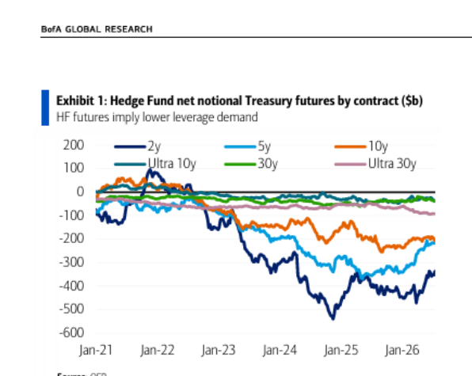
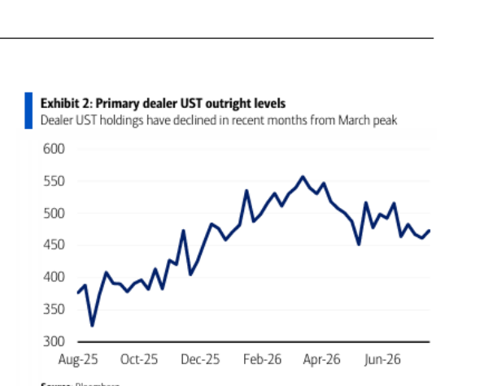
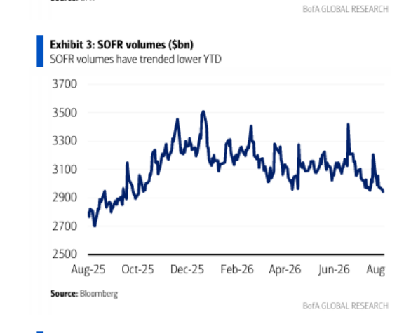
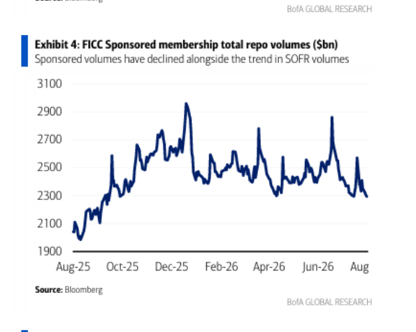
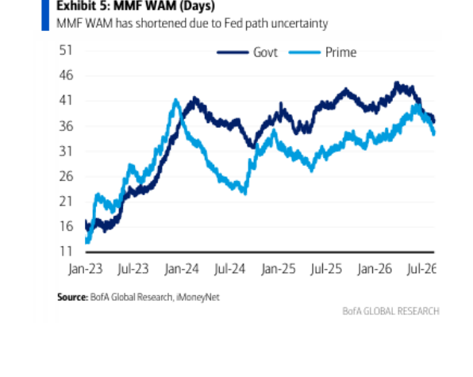
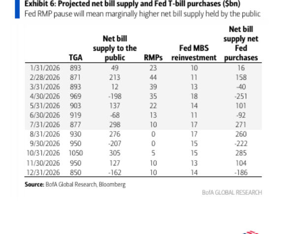

# BofA｜US Rates Watch: Easy Funding — Leverage, MMF, & Structure

**券商**：BofA Securities  
**分析師**：Mark Cabana、Katie Craig  
**日期**：2026-08-17  
**主題**：美國資金市場寬鬆成因分析與展望  
**評級**：N/A（利率策略報告）  
<a href="https://layx.uk/dl?g=產業&b=ml&d=20260817&h=US-Rates-Watch-Easy-Funding">📎 下載 PDF</a>

---

## 報告總結

BofA 分析美國近期資金市場持續寬鬆的三大驅動力：(1) 對沖基金去槓桿（削減 Treasury futures 淨空頭，降低回購融資需求）、(2) 貨幣市場基金（MMF）加權平均期限（WAM）縮短（因應 Fed 升息不確定，現已開始延伸）、(3) 市場結構改善（槓桿比率改革、sponsored repo 擴張、collateral-in-lieu 計畫）。展望方面，BofA 預估資金市場維持相對穩定，但需關注 Fed RMPs（reserve management purchases）走向及國庫券供給：9 月淨還款 \$207b 屬資金市場正面因素，10-11 月淨增發 \$270b 則為輕微壓力；BofA 維持做多 Dec '26 SOFR/FF 的長期策略部位，對短期淡出寬鬆資金條件缺乏信心。

---

## BofA 完整投資邏輯鏈

| 論點層次 | Exhibit | 內容 |
|---|---|---|
| 槓桿需求下降 | Exh. 1 | HF Treasury futures 淨空頭持倉持續縮減，repo 融資需求降低 |
| 融資需求外溢 | Exh. 2-4 | 券商 UST 持倉下降、SOFR 及 sponsored repo 成交量同步走低 |
| WAM 縮短支撐 | Exh. 5 | MMF WAM 縮短（Govt/Prime 均 ~36 天）提供額外現金；勞動/通膨數據後延伸趨勢可期 |
| 結構性改善 | 封面 | 槓桿比率改革 + sponsored repo + collateral-in-lieu 降低中介成本，是長期性尾風 |
| RMP/Bills 展望 | Exh. 6 | 9 月 UST 淨還款 -\$207b；10-11 月淨增 +\$270b；全年資金格局偏穩 |
| **結論** | 封面 | **維持做多 Dec '26 SOFR/FF；對短期淡出寬鬆條件缺乏信心** |

---

## 報告核心觀點

| 主題 | BofA 觀點 | 市場共識 | 是否 Contra-Consensus |
|---|---|---|---|
| 資金寬鬆原因 | 三因素共同驅動（HF 去槓桿 + MMF WAM + 結構改善） | 多聚焦 TGA 或 RRPs 單一因素 | ⚠️ 部分 |
| RMP 路徑 | Sept 暫停（\$0）後 Oct-Dec 以 \$10b/m 重啟 | 不確定 | — |
| 國庫券影響 | 9 月淨還款 -\$207b 利於流動性，但年底淨增發抵銷 | 大致已知 | ➖ 無 |
| SOFR/FF 展望 | 維持做多 Dec '26 SOFR/FF | — | — |

---

## Exhibit 1｜Hedge Fund Treasury Futures 淨名義部位（\$b）

### 解讀摘要
對沖基金在 2023-2025 年大幅累積 Treasury futures 淨空頭部位（5y 最大達 -500b，10y 約 -300b），代表高槓桿的基差套利策略（cash-futures basis trade）。2025 年下半年起，這些淨空頭部位開始縮減（5y 從 -500 回升至 -350，10y 從 -300 回升至約 -200），直接降低了對現金 UST 的 repo 融資需求。這是當前資金市場寬鬆的最主要驅動力。

### 表格
| 合約 | 2025 低點（\$b）| 2026-Jan 水準（\$b）| 近期趨勢 |
|---|---|---|---|
| 5y | ~-500 | ~-350 | ↑ 縮減中 |
| 10y | ~-300 | ~-200 | ↑ 縮減中 |
| Ultra 10y | ~-100 | ~-100 | 持平 |
| 30y | ~-100 | ~-80 | ↑ 微縮 |
| 2y | ~+100 | ~+50 | ↓ 多頭縮減 |

> **洞察一**：5y/10y 合約的空頭縮減最為明顯，正好對應到前端 repo 融資需求的下降（反映在 Exhibit 3 的 SOFR 成交量走低）。基差套利持倉的拆解是此次資金寬鬆的機制核心，而非純粹是 TGA 或 RRP 的被動流量效應。

---

## Exhibit 2｜Primary Dealer UST 持倉水準（\$b）

### 解讀摘要
主要券商的 UST 持倉從 2026 年 4 月高峰（~\$540b）降至 6 月的約 \$460b，印證 HF 減少 repo 融資需求後，券商也相應降低 UST 持倉的中介行為。持倉下降意味著券商的資產負債表壓力減輕，這在槓桿比率接近限制時尤其重要。

### 表格
| 時點 | 持倉水準（\$b）|
|---|---|
| Aug 2025 | ~\$360 |
| Mar 2026（高峰）| ~\$540 |
| Jun 2026 | ~\$460 |

> **洞察一（配合 Exhibit 1）**：HF 淨空頭縮減（Exh.1）→ 券商協助 HF 進行 repo 的需求降低 → 券商 UST 持倉隨之下降（Exh.2）。這是一個完整的機制鏈：HF 去槓桿的影響通過 repo 市場傳導至券商資產負債表。

---

## Exhibit 3｜SOFR 成交量（\$bn）

### 解讀摘要
SOFR 日成交量從 2025 年 12 月高峰約 \$3,500bn 持續下降，至 2026 年 8 月約 \$2,900bn（-17%）。SOFR 成交量是 repo 市場活躍度的直接衡量指標，成交量走低直接反映整體 repo 融資需求下降，與 HF 去槓桿的論點相互印證。

### 表格
| 時點 | SOFR 成交量（\$bn）|
|---|---|
| Aug 2025 | ~\$2,700 |
| Dec 2025（高峰）| ~\$3,500 |
| Apr 2026 | ~\$3,100 |
| Aug 2026 | ~\$2,900 |

> **洞察一**：SOFR 成交量從高峰下跌 17%，幅度顯著，且趨勢持續。這不是季節性因素，而是結構性需求降低（HF 去槓桿 + market structure improvements）的結果。

---

## Exhibit 4｜FICC Sponsored Repo 成交量（\$bn）

### 解讀摘要
FICC sponsored repo 成交量從 2025 年 12 月高峰約 \$2,950bn 下滑至 2026 年 8 月約 \$2,300bn（-22%），與 SOFR 成交量走勢高度吻合（相關性強）。Sponsored repo 是利用 FICC 的中央對手方地位降低槓桿比率佔用的結構，其成交量下降顯示 HF 連 sponsored 管道的需求也在下降。

### 表格
| 時點 | Sponsored Repo（\$bn）|
|---|---|
| Dec 2025（高峰）| ~\$2,950 |
| Jun-26 | ~\$2,500 |
| Aug 2026 | ~\$2,300 |

> **洞察一（配合 Exhibit 3）**：SOFR 和 Sponsored repo 同步下降（分別 -17%/-22%）且走勢幾乎一致，確認是需求端（HF 去槓桿）而非供給端（市場結構）的驅動。若是結構性缺口，兩者走勢會分歧。

---

## Exhibit 5｜MMF WAM（天數）

### 解讀摘要
政府型 MMF（Govt）和優先型 MMF（Prime）的 WAM 均從 2024 年初高峰（~41-42 天）大幅縮短至 2025 年中的 ~16 天（Fed 升息預期高峰），之後隨 Fed 政策路徑轉清而重新延伸至當前約 36-38 天。WAM 縮短意味著 MMF 大量持有短期工具（T-bills、overnight repo），為資金市場提供了額外流動性供給。WAM 延伸趨勢則顯示未來短端供給可能溫和減少。

### 表格
| 時點 | Govt WAM（天）| Prime WAM（天）|
|---|---|---|
| Jan 2024（高峰）| ~42 | ~41 |
| Jul 2025（低點）| ~18 | ~22 |
| Jul 2026 | ~37 | ~35 |

> **洞察一**：WAM 的縮短-再延伸週期直接對應 Fed 政策路徑的不確定性起伏。目前 WAM 回到 ~36-38 天，意味著 MMF 「預防性縮短」的額外流動性支撐已大部分消退，這個驅動因素的邊際效果正在減弱。往後資金寬鬆的維持更多靠市場結構改善，而非 MMF WAM 效應。

---

## Exhibit 6｜預計淨國庫券供給及 Fed T-bill 購買（\$bn）

### 解讀摘要
BofA 的 T-bill 供需預測顯示全年格局不均：8 月大量淨增發（+\$276b，主因 \$220b MTD + 剩餘月份），9 月大幅淨還款（-\$207b），10 月大幅淨增（+\$305b），12 月再次淨還款（-\$162b）。「Net bill supply net Fed purchases」欄（最右）是投資人實際需要吸收的淨增量，8 月 +260b、9 月 -222b（淨還款為流動性正面）、10 月 +285b 為年內最大淨增月。

### 表格
| 月份 | TGA（\$b）| Net bill supply to public（\$b）| RMPs（\$b）| Fed MBS reinvest（\$b）| Net supply net Fed（\$b）|
|---|---|---|---|---|---|
| 7/31/2026 | 877 | 298 | 10 | 17 | 271 |
| 8/31/2026 | 930 | 276 | 0 | 17 | 260 |
| 9/30/2026 | 950 | -207 | 0 | 15 | -222 |
| 10/31/2026 | 1,050 | 305 | 5 | 15 | 285 |
| 11/30/2026 | 950 | 127 | 10 | 13 | 104 |
| 12/31/2026 | 850 | -162 | 10 | 14 | -186 |

> **洞察一**：9 月淨還款 -\$222b 是今年最大的單月流動性回流，理論上對資金市場有支撐效果；但 10 月緊接著 +\$285b 的最大淨增發，意味著 9 月的「寬鬆期」短暫。BofA 的 RMP 假設 9 月暫停（\$0），若 Fed 超預期維持購買，則 10 月壓力可進一步緩衝。

> **值得驗證**：RMPs 在 9 月的實際金額（BofA 假設 \$0）是最關鍵的不確定因素。若 Fed 在 9/30 的 RMP 操作金額超出 \$0，整條「net supply net Fed」欄的預估都需上調（即市場壓力比預估小）。

---

## 相關個股清單

| 類別 | 說明 |
|---|---|
| 利率策略 | 本報告為美國利率/資金市場策略報告，不涉及個股推薦 |
| 關鍵策略部位 | 做多 Dec '26 SOFR/FF（長期維持）|
