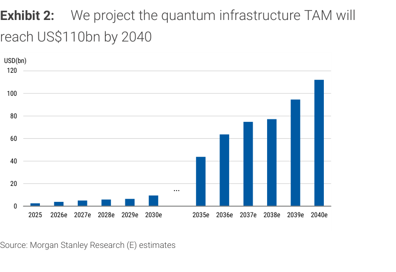
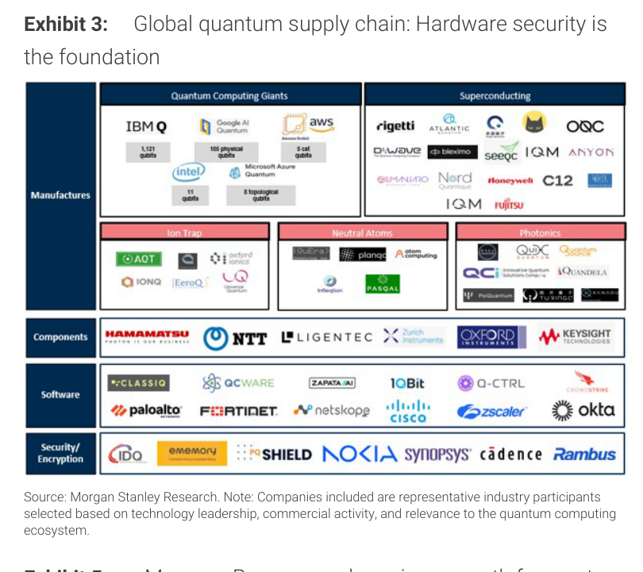
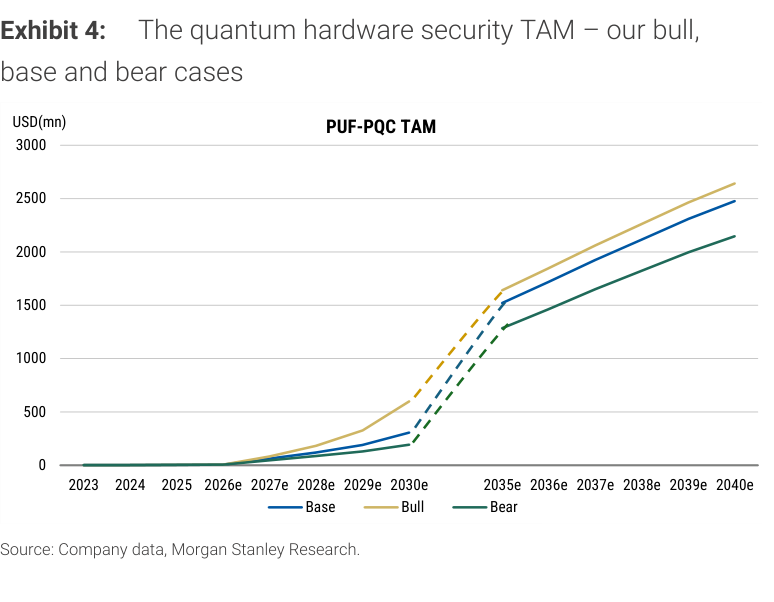
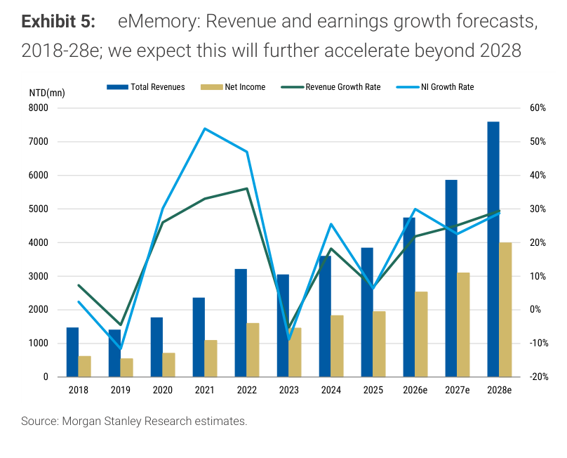
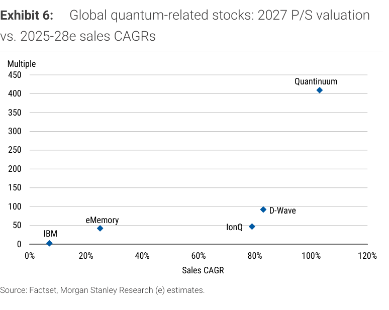
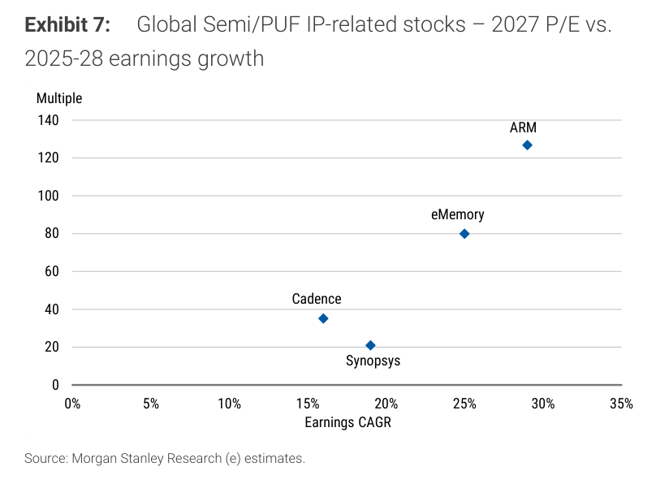
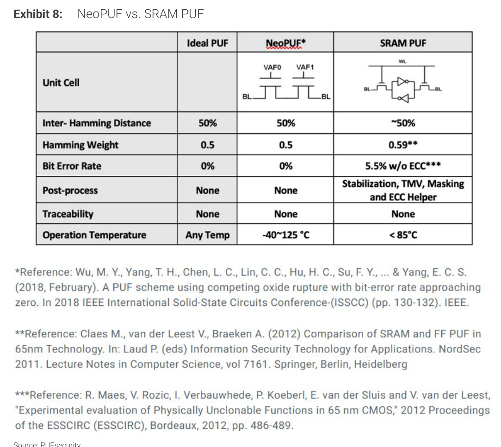
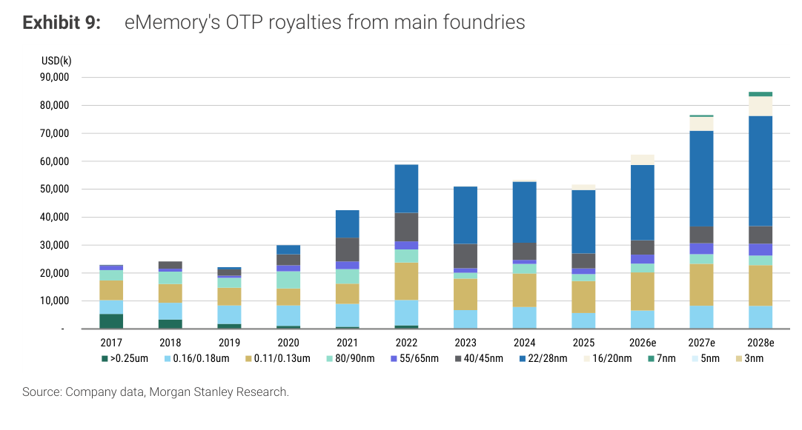
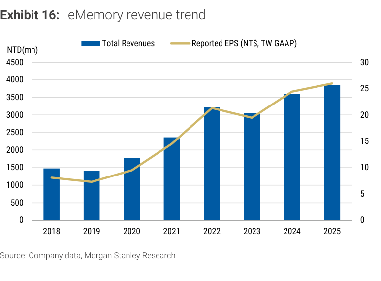
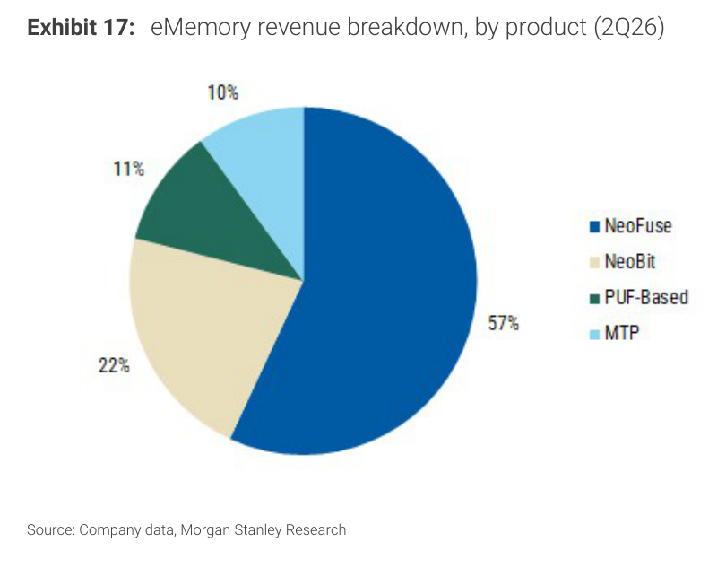

# MS｜eMemory（力旺）首評 OW — 被低估的量子安全與 IP 複合成長引擎

**券商**：Morgan Stanley  
**分析師**：Daniel Yen CFA、Charlie Chan、Daisy Dai CFA  
**日期**：2026-08-17  
**主題**：eMemory Technology（3529）首評 Overweight — NeoFuse OTP + NeoPUF/PQC 雙引擎論點  
**評級**：Overweight（首評），目標價 NT\$3,330（RI model；implied 80x 2027E P/E）  
<a href="https://layx.uk/dl?g=產業&b=MS&d=20260817&h=eMemory-Initiation">📎 下載 PDF</a>

---

## 報告總結

MS 首評 eMemory（力旺，3529）OW，目標價 NT\$3,330。報告時機為 1Q26 獲利 miss 後股價從高點修正約 50%（52 週高點 NT\$4,785 → 現 NT\$2,390），MS 認為此次修正為時機性（1Q26 的鑄造廠漲價效益尚未反映，管理層預期 2H26 見效），創造具吸引力的進場點。MS 核心論點是：市場把 eMemory 主要定位為 OTP IP 供應商，幾乎完全忽略其多年投入的 NeoPUF 技術在後量子密碼學（PQC）時代的潛在第二成長引擎價值，以及 NeoFuse 在先進製程遷移中的系統性滲透機會。

MS 預估 eMemory 2025-28E EPS CAGR 27%（NT\$25.99→NT\$53.31），優於半導體 IP 同業的 15-20%；但當前估值（80x 2027E P/E）已低於 ARM（127x）且遠低於量子相關股（Quantinuum 415x P/S），MS 認為這個定價差距反映市場尚未定價 PUF/PQC 機會。

---

## MS 完整投資邏輯鏈

| 論點層次 | Exhibit | 內容 |
|---|---|---|
| 市場 TAM 確立 | Exh. 2 | 量子基礎設施 TAM 預估 2040 年達 USD110bn；PUF-PQC 硬體安全 TAM 2030 年 ~USD250mn，2040 年 ~USD2,480mn（基本情境） |
| 生態位確認 | Exh. 3 | eMemory 在全球量子供應鏈中位處「Security/Encryption」層，是少數具盈利能力的量子相關公司 |
| 競爭優勢 | Exh. 8 | NeoPUF 位元錯誤率 0%（vs SRAM PUF 5.5%，需 ECC 輔助），無需後處理，操作溫度 -40~125°C；技術護城河清晰 |
| 核心業務 OTP 成長 | Exh. 9 | OTP royalties 隨先進製程遷移（7nm/5nm/3nm 佔比快速提升），2025-28E 從 USD50,000k→USD80,000k+ |
| 收入結構 | Exh. 17 | 2Q26 NeoFuse 57%、NeoBit 22%、PUF 11%、MTP 10%；PUF 已佔 11%，但被市場忽視 |
| 估值錨定 | Exh. 6/7 | 量子同業普遍 80-415x P/S（無盈利），半導體 IP 同業 35-127x 2027E P/E；eMemory 80x 2027E P/E 兼具兩個框架的吸引力 |
| **結論** | 封面 | **首評 OW；NT\$3,330（RI model；base case 80x 2027E P/E / 25.9% revenue CAGR）** |

> **報告最大邏輯缺口**：PUF 目前僅佔 ~1% royalties（Exh. 17 顯示 11% 含 PUF-based revenue，但 MS 說 royalty 貢獻更低），MS 預估 2027 年才開始有意義貢獻，時間表相對模糊；TP 主要由 OTP 業務支撐，PUF/PQC 為 upside option，市場難以定價。

---

## 報告核心觀點

| 主題 | MS 觀點 | 市場共識 | 是否 Contra-Consensus |
|---|---|---|---|
| 公司定位 | eMemory = OTP IP + PUF/PQC 硬體安全雙引擎 | 純 OTP IP 供應商 | ✅ 是 |
| 1Q26 miss | 時機性（鑄造廠漲價 2H26 反映），非結構性惡化 | 擔憂近期 OTP royalty 成長放緩 | ⚠️ 部分 |
| EPS 預估 | 2026-28E EPS 低於共識（更保守的漸進式成長路徑） | 共識樂觀 | 反向 Contra |
| NeoPUF 時機 | PQC 採用加速驅動，2027 年起開始有意義貢獻 | 未定價 | ✅ 是 |
| 估值 | 80x 2027E P/E 相對量子同業（400x+）與 IP 同業（ARM 127x）均有吸引力 | — | — |

---

## Exhibit 2｜量子基礎設施 TAM 預估（USD bn）

### 解讀摘要
MS 預估全球量子基礎設施 TAM 在 2030 年仍相對有限（~USD9bn），但 2035 年後急速擴張，2040 年達 USD110bn。前期（2025-2030）成長以量子硬體建設為主，後期（2035+）才會是量子應用與硬體安全的大規模商業化階段。對 eMemory 而言，前期的 PUF 貢獻來自 PQC migration 驅動的硬體安全需求，而非量子電腦直接採購——這個區分對理解 NeoPUF 早期商業化時機至關重要。

### 表格
| 年份 | 量子基礎設施 TAM（USD bn）|
|---|---|
| 2025 | ~2 |
| 2026e | ~4 |
| 2030e | ~9 |
| 2035e | ~45 |
| 2040e | ~110 |

> **洞察一**：量子 TAM 的爆發在 2030 年後，但 eMemory 的 PUF 商業化依賴的是「後量子密碼標準推廣」（NIST 2024 年已完成 PQC 標準化），而非量子電腦真正成熟——因此 NeoPUF 的市場窗口比這張圖顯示的「量子 TAM 爆發」更早，MS 估 2027 年即開始有意義貢獻。

---

## Exhibit 3｜全球量子供應鏈架構

### 解讀摘要
此圖展示量子計算生態的分層：Manufactures（IBM、Google、AWS、D-Wave、Rigetti…）、Components（NTT、HAMAMATSU…）、Software（Classiq、Quantinuum…）、Security/Encryption（IDQ、eMemory、nSHIELD、Nokia、Synopsys、Cadence、Rambus）。eMemory 所在的「Security/Encryption」層最靠近最終應用，且 eMemory 是該層中唯一來自台灣、以 IP 授權驅動盈利的公司——其餘多為儀器或安全設備供應商，盈利模式差異顯著。

> **洞察一**：eMemory 在量子供應鏈中的競爭對手是 Synopsys（Kilopass OTP + Intrinsic ID SRAM PUF）、Rambus、IDQ（量子金鑰分發）等，但 eMemory 的 NeoPUF 是唯一基於量子穿隧效應（quantum tunneling）的硬體 RoT 解決方案，而非 SRAM 起始行為——物理原理差異形成技術區隔。

---

## Exhibit 4｜PUF-PQC 硬體安全 TAM 情境分析（USD mn）

### 解讀摘要
MS 的 PUF-PQC TAM 模型顯示：2030 年基本情境 ~USD250mn，2035 年 ~USD1,500mn，2040 年 ~USD2,480mn。牛熊差異主要來自 PQC 政府/企業強制時間表的快慢（美國 CISA 要求關鍵基礎設施 2030 年完成 PQC migration）。eMemory 當前 IP royalty 規模（2025A USD~50mn）相對於此 TAM 幅度極小，代表長期市占擴張的空間相當可觀——但前提是 NeoPUF 能在 PQC 採購決策中取得硬體 RoT 標準地位。

### 表格
| 年份 | Base（USD mn）| Bull（USD mn）| Bear（USD mn）|
|---|---|---|---|
| 2025 | ~1 | ~1 | ~1 |
| 2028e | ~100 | ~150 | ~65 |
| 2030e | ~250 | ~280 | ~175 |
| 2035e | ~1,500 | ~1,580 | ~1,295 |
| 2040e | ~2,480 | ~2,600 | ~2,130 |

> **值得驗證**：MS 並未明確說明 eMemory NeoPUF 在 PUF-PQC TAM 中的預期市占率，也未說明哪些終端市場（政府 vs 企業 vs 數據中心 vs 汽車）是 2027 年的主要貢獻來源。若政府強制採購延後或競爭者（Synopsys 的 SRAM PUF）取得標準地位，此 TAM 對 eMemory 的可及性將大幅縮小。

---

## Exhibit 5｜eMemory 營收與淨利成長預測（2018-2028e）

### 解讀摘要
eMemory 的歷史成長軌跡呈兩段式：2018-2022 年受惠於 IoT/消費性晶片的 OTP 滲透快速成長（CAGR ~17%），2022 年後因半導體下行週期而 2023 回調。2025 年起進入 AI 基礎設施驅動的第二成長曲線，MS 預估 2025-2028E Revenue CAGR 25.9%、EPS CAGR 27%，且認為此成長「2028 年後將進一步加速」——這句話暗示 NeoPUF 的商業化才是長期成長的真正引擎，而不是 OTP 的成熟滲透。

### 表格
| 年份 | 營收（NT\$ mn）| 淨利（NT\$ mn）| 營收成長 | 淨利成長 |
|---|---|---|---|---|
| 2023 | ~3,024 | ~1,440 | ~-6% | ~-16% |
| 2024 | ~3,619 | ~1,900 | ~20% | ~32% |
| 2025A | 3,849 | 1,959 | ~6% | ~3% |
| 2026E | 4,628 | 2,539 | ~20% | ~30% |
| 2027E | 5,818 | 3,085 | ~26% | ~21% |
| 2028E | 7,571 | 3,988 | ~30% | ~29% |

> **洞察一**：2025A NI 成長僅 ~3%（相對 2024A +32%）是 1Q26 miss 的背景，反映 royalty 週期性波動（鑄造廠調價時間差）。MS 認為此為短期干擾而非結構性，2026E NI 恢復 +30% 的假設依賴 2H26 鑄造廠漲價效益實現。

---

## Exhibit 6｜量子相關股 2027 P/S vs 2025-28E 銷售 CAGR

### 解讀摘要
MS 將 eMemory 定位在量子相關股同業（P/S vs Sales CAGR 散點圖）中的右下區域：eMemory 約 ~45x 2027 P/S，銷售 CAGR ~26%。相比之下，Quantinuum 約 415x P/S（CAGR ~115%）、D-Wave 約 88x P/S（CAGR ~105%）、IonQ 約 45x P/S（CAGR ~80%）。eMemory 的 P/S 相對偏低但 CAGR 也相對保守——關鍵洞察是 eMemory 是這組中唯一真正有盈利的公司（其他都燒錢），但估值並未因此享有溢價。

### 表格
| 公司 | 2027 P/S（估）| 銷售 CAGR 2025-28E（估）| 是否盈利 |
|---|---|---|---|
| IBM | ~3x | ~8% | ✅ |
| eMemory | ~45x | ~26% | ✅ |
| IonQ | ~45x | ~80% | ❌ |
| D-Wave | ~88x | ~105% | ❌ |
| Quantinuum | ~415x | ~115% | ❌ |

> **洞察一（配合 Exhibit 7）**：量子框架（Exh.6）vs 半導體 IP 框架（Exh.7）對 eMemory 的定價給出截然不同的結果：量子框架下 45x P/S 略低同業（其他都燒錢），半導體 IP 框架下 80x 2027E P/E 高於 Cadence/Synopsys 但低於 ARM。MS 的 OW 論點建立在「雙框架皆合理，但市場目前只用 IP 框架定價」——若未來 PUF 貢獻兌現，市場可能部分採用量子框架重新定價。

---

## Exhibit 7｜半導體/PUF IP 同業 2027 P/E vs 2025-28E 盈利 CAGR

### 解讀摘要
在半導體/PUF IP 同業框架中，eMemory ~80x 2027E P/E（Earnings CAGR ~25%）位於散點圖右上方，P/E 高於 Cadence（~35x/17%）與 Synopsys（~20x/19%），但低於 ARM（~127x/30%）。eMemory 的 CAGR 優於 Cadence/Synopsys，估值溢價有一定基本面支撐，但能否持續 premium 取決於 NeoPUF 能否貢獻增量成長。

### 表格
| 公司 | 2027 P/E（估）| EPS CAGR 2025-28E（估）|
|---|---|---|
| Synopsys | ~20x | ~19% |
| Cadence | ~35x | ~17% |
| eMemory | ~80x | ~25% |
| ARM | ~127x | ~30% |

> **洞察一**：eMemory 的 25% EPS CAGR 若無 PUF 貢獻則難以持續（純 OTP 成熟期通常 10-15%），支撐 80x P/E 需要 PUF 在 2027-28 年開始有意義兌現。這是整個估值論點最脆弱的環節。

---

## Exhibit 8｜NeoPUF vs SRAM PUF 技術比較

### 解讀摘要
核心差異在位元錯誤率（BER）：NeoPUF BER=0%（量子穿隧效應形成永久性缺陷，無溫度/電壓漂移問題），SRAM PUF BER=5.5%（需穩定化/ECC 輔助電路）。BER=0% 意味著 NeoPUF 不需要 Error-Correcting Code（ECC） helper data 電路，可以生成更簡潔、面積更小的硬體根信任設計——在先進製程面積極為昂貴的背景下，這是重要的差異化優勢。

### 表格
| 指標 | 理想 PUF | NeoPUF | SRAM PUF |
|---|---|---|---|
| 單元架構 | — | Quantum tunneling（VAF0/VAF1）| SRAM cell + sense amp |
| Inter-Hamming Distance | 50% | 50% | ~50% |
| Hamming Weight | 0.5 | 0.5 | 0.59** |
| 位元錯誤率 | 0% | **0%** | 5.5%（需 ECC）|
| 後處理 | None | **None** | Stabilization, TMV, Masking, ECC Helper |
| 可追蹤性 | None | None | None |
| 操作溫度 | 任意 | -40~125°C | <85°C |

> **洞察一**：SRAM PUF 的後處理需求（TMV masking + ECC helper data）不只增加晶片面積，更重要的是引入了可攻擊面——如果 helper data 被截取，PUF fingerprint 可能被破解。NeoPUF 的無後處理特性從根本上消除了這個風險，這在政府/軍事/金融級安全應用中是決定性優勢。

---

## Exhibit 9｜eMemory OTP Royalties（依製程節點分，USD 千）

### 解讀摘要
此圖是理解 OTP 業務成長邏輯的核心。從 2017 年到 2025 年，royalty 組成逐漸從成熟節點（55/65nm 主導）向先進節點（22/28nm、16/20nm、7nm、5nm、3nm）遷移。2025 年以後的預估顯示 7nm 以下節點快速放量，2027-28E 7nm 貢獻預計翻倍，5nm 和 3nm 也從幾乎為零到明顯佔比。由於先進節點晶圓成本遠高於成熟節點（3nm wafer 約 55/65nm 的 6-8 倍），即使晶圓片數相同，royalty 也能大幅成長。

### 表格
| 年份 | OTP Royalties 合計（USD k）| 7nm+ 佔比（估）|
|---|---|---|
| 2021 | ~43,000 | <5% |
| 2023 | ~51,000 | ~15% |
| 2024 | ~53,000 | ~25% |
| 2025A | ~50,000 | ~30% |
| 2026E | ~59,000 | ~40% |
| 2027E | ~70,000 | ~55% |
| 2028E | ~80,000 | ~65% |

> **洞察一**：OTP royalties 在 2022 年達到峰值（~USD59,000k）後回落至 2025A ~USD50,000k，這就是市場擔憂的「近期 OTP royalty 成長放緩」。但 MS 的邏輯是：2025 年的低點反映半導體週期下行（整體晶圓出貨減少），而 2026E 開始的回升是先進節點晶圓量增加 + 鑄造廠漲價的雙重驅動，應以結構性成長框架而非週期性波動看待。

---

## Exhibit 16｜eMemory 歷史營收與 EPS 趨勢（2018-2025）

### 解讀摘要
歷史數據顯示 eMemory 是一家高度穩定的 IP 授權公司：營收從 2018 年 NT\$1,500mn 成長至 2025 年 NT\$3,800mn，年複合成長率 ~14%；EPS 從 NT\$9 成長至 NT\$26（+189%，同期複合 ~16%）。2022 年的 EPS 高峰（~NT\$21）後 2023 回調是週期性因素，2024-25 年逐步恢復。此圖建立了 eMemory 作為高品質 IP 授權商的長期成長基準，也顯示其盈利在半導體下行週期仍維持正數（vs 設備/設計公司大幅虧損），印證 royalty 模型的護城河。

### 表格
| 年份 | 營收（NT\$ mn）| 報告 EPS（NT\$）|
|---|---|---|
| 2018 | ~1,500 | ~9 |
| 2020 | ~1,750 | ~10 |
| 2022 | ~3,200 | ~21 |
| 2023 | ~3,050 | ~17 |
| 2024 | ~3,600 | ~22 |
| 2025 | ~3,800 | ~26 |

> **洞察一**：2022→2023 EPS 從 NT\$21 下降至 NT\$17（-19%），對比 2022→2023 半導體週期是相對輕微的衰退。這印證了 royalty 模型的抗週期特性——即使整體晶圓出貨大幅下滑，eMemory 的既有設計 win 仍產生持續收入，不像設備廠商出現 -40/50% 的業績崩塌。

---

## Exhibit 17｜eMemory 營收產品結構（2Q26）

### 解讀摘要
2Q26 產品佔比：NeoFuse 57%、NeoBit 22%、PUF-Based 11%、MTP 10%。NeoFuse（先進製程 OTP）已超過一半，印證先進節點滲透的成長論點。PUF-Based 已佔 11%，遠高於 MS 引用的「royalties 僅 1%」——這個差距顯示部分 PUF 貢獻來自 license fee 而非 recurring royalties，royalty 複製能力（scale）尚待建立，這是 PUF 現階段商業化仍處早期的佐證。

### 表格
| 產品 | 2Q26 佔比 |
|---|---|
| NeoFuse（OTP 先進節點）| 57% |
| NeoBit（OTP 成熟節點）| 22% |
| PUF-Based（NeoPUF 等）| 11% |
| MTP（Multi-Time Programmable）| 10% |

> **洞察一（配合 Exhibit 9）**：NeoFuse 57% + NeoBit 22% = OTP 合計 79%，而 Exh. 9 顯示 OTP royalties 由先進節點驅動。2Q26 的 NeoFuse 主導地位確認先進節點轉移已發生，後續的 royalty uplift（先進節點每片 wafer royalty 更高）是業績加速的關鍵機制。

> **洞察二**：PUF-Based 11% 的收入貢獻中，多為 license fee（一次性），royalty 規模仍小。若 PUF 能從 license-heavy 轉向 royalty-heavy 模式（如 OTP 的成功案例），將是業務模式的重大升級，MS 預估 2027 年起見效。

---

## 相關個股清單

| 類別 | 公司 | Ticker | 評等 | 備註 |
|---|---|---|---|---|
| 報告主體 | 力旺電子 | 3529.TWO | OW（首評）| NT\$3,330 PT；RI model implied 80x 2027E P/E |
| 同業（OTP/Security IP）| Synopsys | SNPS | — | Kilopass OTP + Intrinsic ID SRAM PUF，最直接競爭者 |
| 量子安全同業 | Quantinuum | — | — | 415x P/S，燒錢階段 |
| 量子安全同業 | IonQ | IONQ | — | 45x P/S，燒錢階段 |
