# UBS｜勤誠（Chenbro）首次覆蓋深度報告

**券商**：UBS  
**分析師**：Diana Chang、Randy Abrams  
**日期**：2026-08-17  
**主題**：Chenbro Micom Initiation — The backbone of AI server/rack  
**評級**：Buy（首次覆蓋）  
<a href="https://layx.uk/dl?g=產業&b=UBS&d=20260817&h=Chenbro-Initiation">📎 下載 PDF</a>

---

## 報告總結

UBS 首次以 Buy 覆蓋勤誠（8210）並給出 NT\$1,450 目標價（+43% upside），催化劑是 8月17日股價因 7 月月營收 -24% MoM（物流/零件短缺延遲出貨）已回落 18%，提供入場機會。報告核心論點：勤誠從 L3-L6 標準底盤廠正在演變為 L11 機架系統整合商，AI 伺服器底盤 ASP 是傳統底盤 5-10 倍，且 AWS ASIC 規模化架構每個 scale-up unit 底盤內容高達 US\$4,000-12,000，NVIDIA GPU 機架更達 US\$20,000-25,000——而這些需求均處於多年 ramp 前夕。估值面，現價隱含 15x/12x 2027/28E P/E，低於 AI 週期後的 14-27x 歷史區間中位，UBS 認為 19x 2027-28E 均值更合理，0.6x PEG（基於 30% 2026-30E EPS CAGR）提供安全邊際。

---

## UBS 完整投資邏輯鏈

| 論點層次 | Exhibit | 內容 |
|---|---|---|
| 需求信號明確 | Fig 3, 4, 5 | 2026 全球前 12 大 hyperscaler+neocloud 資本支出 ~US\$958bn，+89% YoY；2027E 再 +46%；NVIDIA GB200 NVL72 rack 2026E 77.5k 台 |
| 內容機會擴大 | Fig 6, 7, 8 | AWS ASIC rack content US\$2,000-12,000/scale-up unit；NVIDIA GPU rack up to US\$20,000-25,000；機架業務 <1% 2024 → 15%+ 2027E |
| 勤誠定位獨特 | Fig 1, 9 | 99% 收入來自伺服器底盤（AI 比重 ~65% 2Q26）；2025-30E 收入 CAGR 35%（AI chassis+racks CAGR 43%）；NVIDIA MGX 1U/2U 底盤設計合作夥伴 |
| 毛利韌性 | Fig 2 | 客製機架 GM 20%+、機架元件 GM 30-35%，UBS 估 2026-28E GM 維持 30-31% |
| 產能到位 | Fig 27 | 馬來西亞 Q426 量產、越南 H127、德州 H227，解除產能瓶頸疑慮 |
| 估值折價 | Fig 34, 35 | 現價 15x/12x 2027/28E PE（後 AI 週期區間 14-27x 中低端）；0.6x PEG |
| **結論** | 封面 | **Buy，PT NT\$1,450（19x 2027-28E 均值 P/E）；43% 上行空間** |

> **報告最大邏輯缺口**：機架業務毛利率假設（客製機架 20%+ 是 UBS 估計，非公司揭露）；若規模化後定價壓力使機架 GM 低於預期，整體 GM 30%+ 維持難度升高。

---

## 報告核心觀點

| 主題 | UBS 觀點 | 市場共識 | Contra-Consensus |
|---|---|---|---|
| AI 底盤 ASP 趨勢 | AI server chassis ASP 為傳統底盤 5-10x，且隨架構演進（密度、散熱）持續提升 | 擔心客製化帶來毛利壓縮 | ✅ UBS 認為複雜度上升反而提高勤誠議價力 |
| 機架業務毛利 | 客製機架 GM 20%+，元件 GM 30-35%，不低於底盤主業 | 機架 = 低毛利、威脅整體 GM | ✅ Contra-consensus |
| 7 月月營收下滑 | 物流（海運轉換）+零件短缺造成延誤，非需求下滑 | 市場解讀為需求惡化（股跌 18%） | ✅ UBS 視為出貨時間點差異，Q3/Q4 回補 |
| 競爭格局 | AVC 熱管理強，勤誠機械設計強，兩者市場定位差異明顯 | 競爭加劇侵蝕份額 | ➡️ 中性，各有所長 |
| 估值 | 應享有高於 ODM/OEM 的 18-24x P/E，低於同業頂端元件股 20-30x | 現價 15x/12x 已反映成長 | ✅ UBS 認為成長未完全定價 |

**零件/個股偏好**：勤誠（8210）直接受益機架 TAM 擴張；間接相關：AVC（3017）競爭者/對照

---

## Fig. 1｜Chenbro 年度銷售按產品別分解

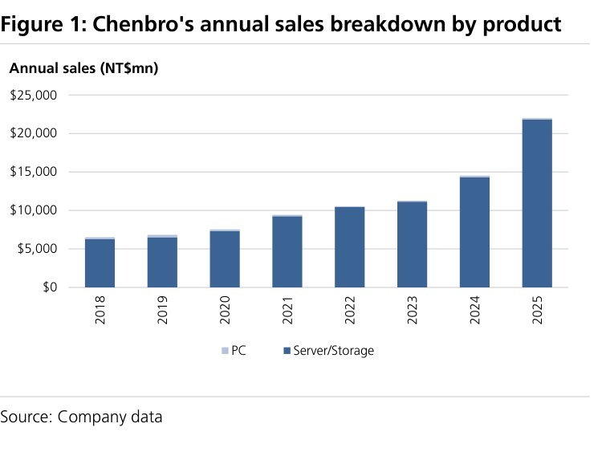

### 解讀摘要
伺服器底盤從 2023 年即佔總收入 99%，PC 底盤貢獻 <1%，業務集中度遠高於競爭對手（AVC、In Win 仍有 PC/電源等分散業務）。這種高度集中使勤誠的成長幾乎完全繫於 AI 伺服器週期，但也意味著每個 AI 底盤業務的 upside 都能直接反映在整體財務。

> **原文補充**：2024 年伺服器底盤中，AI 伺服器佔比約 47%，預計 2026E 升至 63%（含 AI chassis AI mix）；一般伺服器底盤佔比持續萎縮但仍貢獻部分穩定收入。

---

## Fig. 2｜Chenbro 2026E 收入組合（產品別）

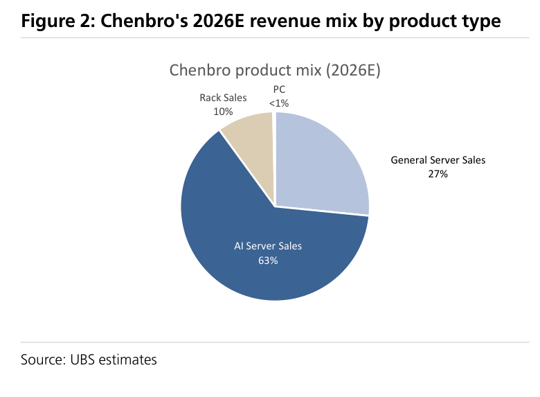

### 解讀摘要
UBS 估 2026E 收入結構：AI server chassis ~63%（+74% YoY）、一般伺服器底盤縮減至 ~27%、機架及元件 ~8%，PC <1%。機架從 <1%（2024）成長至 8% 是關鍵結構性轉變——這是盈利品質提升的信號，因為機架元件 GM（30-35%）高於一般底盤。

### 表格
| 產品類別 | 2026E 佔比（估） | YoY 變化 |
|---|---|---|
| AI server chassis | ~63% | +74% YoY |
| 一般伺服器底盤 | ~27% | 下滑 |
| 機架及元件 | ~8% | 新增（2024 <1%） |
| PC 底盤 | <1% | 持平 |

> **洞察一**：機架業務從 <1% 跳到 8%（估 2026E），管理層指引 2026 年 >10%、2027 年 20%——這一細分的 GM（20-35%）高於整體，是 UBS 認為 2027-28E 整體 GM 30%+ 能維持的核心假設。

---

## Fig. 3｜前 5 大 CSP YoY 資本支出成長 vs. 勤誠 YoY 營收成長

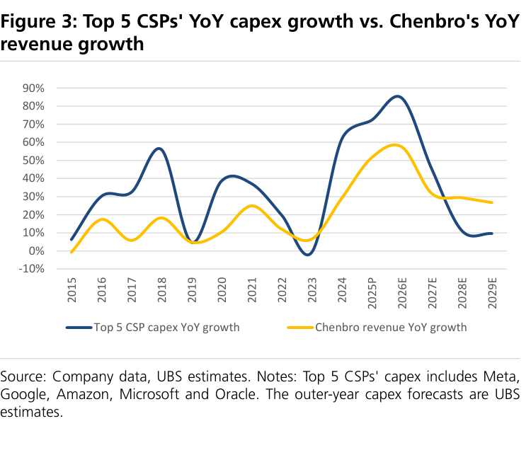

### 解讀摘要
CSP 資本支出（Meta、Google、Amazon、Microsoft、Oracle）與勤誠營收的 YoY 相關性高度正相關，且勤誠的成長幅度通常高於 CSP capex（槓桿效應）。2025 年勤誠 +52% YoY 對應 CSP capex 也是強勁成長年，顯示產品需求能有效傳導。圖表支撐 UBS 對 2026-27E 持續高成長的信心，因為 CSP capex 2027E 預估再 +46%。

> **原文補充**：外年度 CSP capex 為 UBS 自行估計，並非 Visible Alpha 等共識數字，帶有模型假設風險。

> **洞察一**：勤誠的 YoY 成長通常**倍增**於 CSP capex 成長，來源是 content expansion（每台伺服器/機架底盤內容值增加）。這意味著即使 CSP capex 成長放緩，勤誠仍能保持 AI mix 提升帶來的收入成長。

---

## Fig. 4｜美國前 4 大 hyperscaler 共識資本支出預估

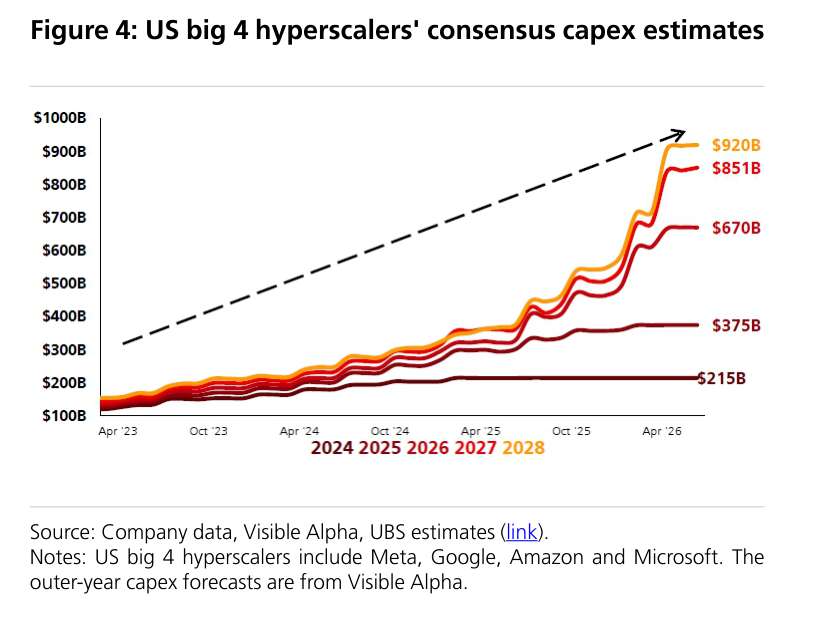

### 解讀摘要
美國前 4 大（Meta、Google、Amazon、Microsoft）資本支出呈現多年加速，UBS 追蹤 2026 年最新上修幅度約 +4%。2026 年已接近 US\$958bn 的 12 家 hyperscaler+neocloud 合計數字，說明 AI 基礎設施建設週期長度和強度均超過市場原先預期。

> **原文補充**：所有 5 大 US CSP 法說均描述 AI 需求強勁、2026 年仍處於供需不平衡狀態，儘管 capex 持續加速。NVIDIA 管理層指出 AI 基礎設施支出到本世紀末可達 US\$3-4trn。

### 表格
| 指標 | 數值 |
|---|---|
| 前 12 大 hyperscaler+neocloud 合計 capex（2026E） | ~US\$958bn |
| 2026E capex YoY 成長（UBS 估） | +89% |
| 2027E capex YoY 成長（UBS 估） | +46% |
| NVIDIA Blackwell/Rubin 訂單（2025-26） | ~US\$500bn |

---

## Fig. 5｜UBS NVIDIA 機架出貨模型

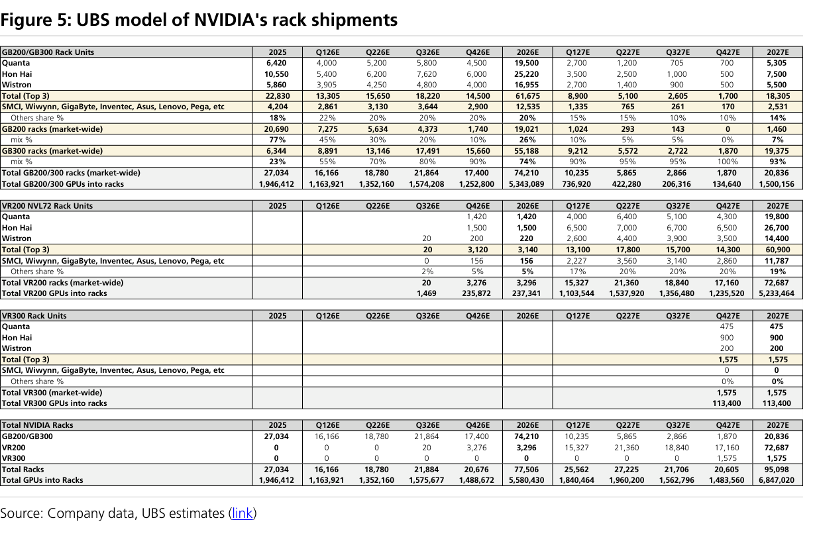

### 解讀摘要
UBS 全球科技團隊估 NVIDIA NVL72 機架 2026E 出貨 77.5k 台，2027E 達 95k 台（含 Blackwell+Rubin 平台）。每台 NVL72 rack 的底盤/機架內容可高達 US\$20,000-25,000，這意味著 95k 台 2027E 對應的 NVIDIA GPU rack 底盤市場規模達 US\$1.9-2.4bn——相對勤誠的規模足以支撐 35%+ 的年複合成長。

> **洞察一（配合 Fig 3）**：77.5k × US\$20-25k/rack = US\$1.55-1.94bn 的 NVIDIA GPU rack 底盤年市場（2026E），而勤誠僅是其中主要供應商之一，說明整體 TAM 支撐 35% CAGR 假設是合理的。

---

## Fig. 6｜從 L3-L6 機殼解決方案擴展至客製化機架層級

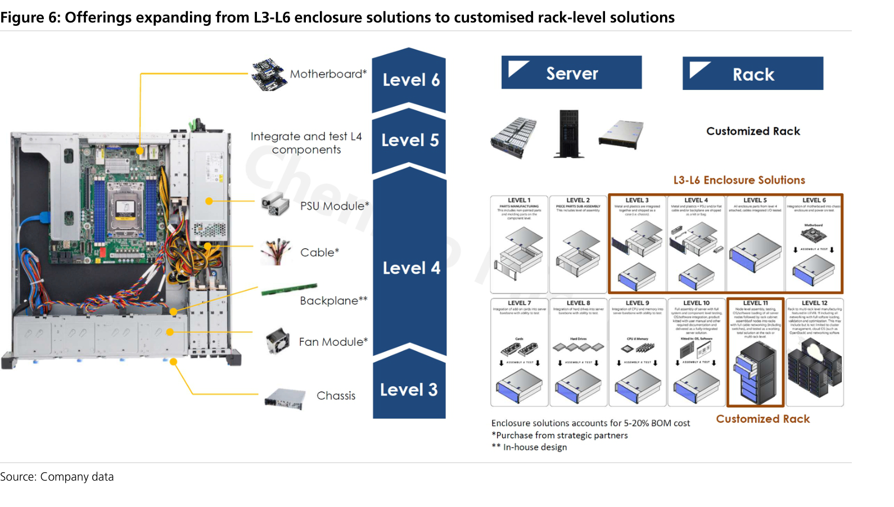

### 解讀摘要
勤誠從 L3（金屬/塑膠底盤成型）到 L6（伺服器裸機），再到 2025 年起擴展至 L11（機架組裝/測試、多機架部署、包含網路管理軟體）。L11 是高度客製化的整合工程，需要跨元件配置優化、冷卻流道設計、噪音管理等專業能力——這正是勤誠 40 年機械設計積累的核心優勢，也是機架業務毛利能優於預期的基礎。

> **原文補充**：現有機架產品包含降噪機架（noise-cancelling rack）、液冷機架（CDU rack）、PSU 聚合電源機架；已取得 NVIDIA MGX、AMD Helios、ORW（Open Rack Wide）標準認證。

---

## Fig. 7｜亞馬遜 ASIC 伺服器機架 scale-up SKU 架構

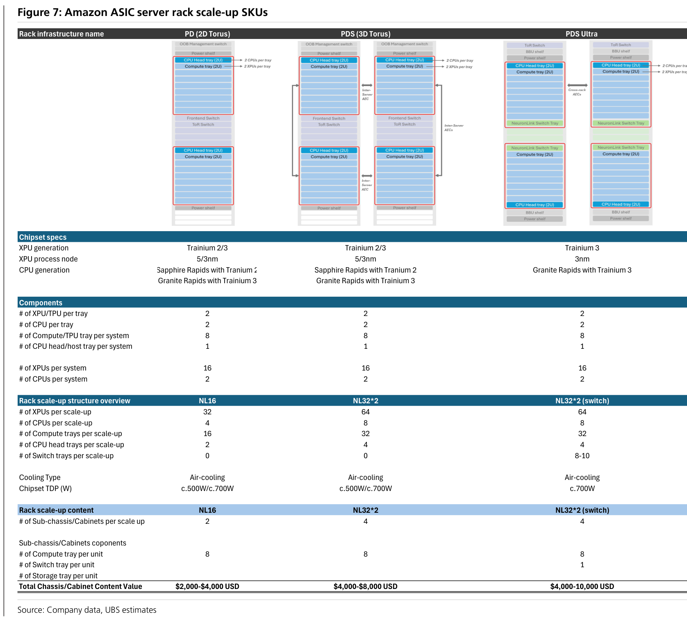

### 解讀摘要
AWS ASIC（Trainium）機架從 PD（2D torus）到 Teton Max（3D torus+液冷）逐代演進，底盤內容值隨複雜度升高而大幅增加。UBS 認為勤誠是 PDS ultra 和 Teton Max 機架 SKU 的主要供應商，同時是 noise-reduction rack 的主要來源，AVC 則為計算托盤底盤的主要供應商（勤誠為第二來源）。每個 scale-up unit 的底盤內容上限從 US\$4,000（PD）升至 US\$12,000（Teton Max），代表 3 倍的 ASP 擴張空間。

### 表格
| AWS ASIC SKU | 架構 | 組成 | 底盤內容（勤誠估） |
|---|---|---|---|
| PD（4×4 2D torus） | 2 台 16-Trainium 伺服器/rack | 1 個機架，2 個 cabinet | US\$2,000-4,000/rack |
| PDS（4×4×4 3D torus） | 4 台伺服器/2 racks，AEC 連接 | 4 個 cabinet/scale-up unit | US\$4,000-8,000/scale-up unit |
| PDS ultra（switch） | 2 racks，64 Trainium，NeuronLink switch 托盤 | 4 cabinet+switch 托盤 | US\$4,000-10,000/scale-up unit |
| Teton Max（switch+液冷） | 2 racks，144 Trainium，36 CPUs，液冷 | 8 計算托盤+2 switch+2 storage | US\$4,000-12,000/scale-up unit |
| 降噪機架 | 附加解決方案 | 1 noise-cancelling rack | US\$2,000-3,000/rack |

> **原文補充**：勤誠是 switch 托盤底盤的主要來源，在計算托盤底盤為第二來源（主要是 AVC），分配比例約 30% UBS 估計。

> **洞察一**：Teton Max 的 144 Trainium + 液冷採用使底盤內容從 PD 的 US\$2,000-4,000 跳升至 US\$4,000-12,000——即同樣「一個 scale-up unit」的底盤 ASP 可提升 3-6 倍。這還沒計入降噪機架的附加。只要 AWS ASIC 部署從 PD 向 Teton Max 遷移，即使出貨量持平，勤誠的 AWS 相關收入也可以翻倍以上。

> **洞察二（配合 Fig 5）**：AWS ASIC + NVIDIA GPU 兩條線同時規模化，且每條的底盤 ASP 都在上升，解釋了為何 AI chassis 收入 CAGR 43% 比整體公司 35% CAGR 更高。

---

## Fig. 8｜NVIDIA GPU 伺服器機架架構

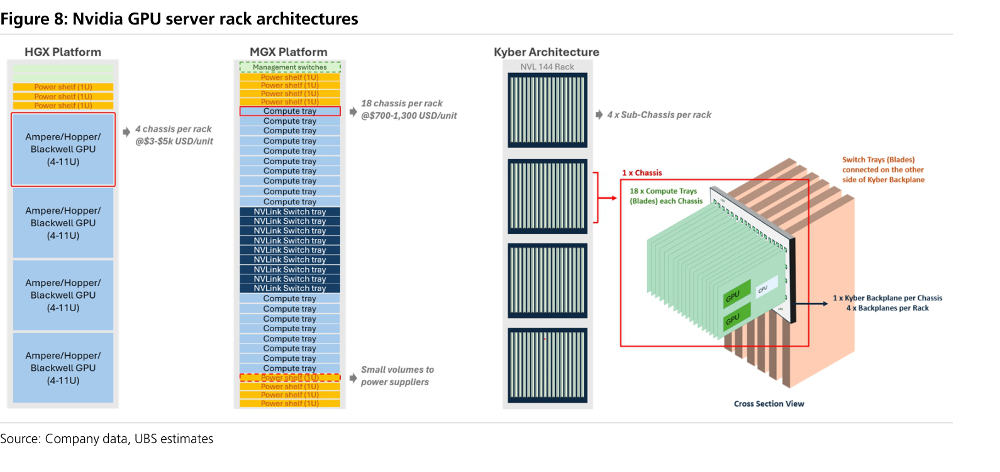

### 解讀摘要
從 Hopper（4-7U HGX）到 Blackwell（7-11U HGX + 1/2U MGX），再到潛在的 Kyber（<1U 垂直刀片），底盤設計複雜度和內容值持續升級。HGX 路線的底盤內容從 US\$3,000-5,000（量產），MGX 從 US\$700-1,300，Kyber 架構設計尚未定案但更高密度預期帶來更高 content。勤誠是 NVIDIA MGX 1U/2U 底盤的設計合作夥伴（僅一家），在 HGX 有一個主要 US CSP 客戶，近期已新增第二個。

### 表格
| NVIDIA 平台 | 型態 | 底盤規格 | 底盤內容值（量產） | 勤誠定位 |
|---|---|---|---|---|
| HGX（Ampere/Hopper） | 4-7U，L5 出貨 | 外殼+GPU board 抽屜 | US\$3,000-5,000/chassis（量產）；首次 US\$10,000-15,000 | 1 個主要 US CSP，新增第二 |
| MGX（Oberon，GB200/GB300） | 1-2U，L3 出貨 | 計算托盤（無 switch 托盤） | US\$700-1,300/chassis | NVIDIA MGX 設計合作夥伴 |
| Kyber（潛在次代） | 垂直刀片 <1U 寬 | 4 個 sub-chassis/rack，18 垂直刀片/chassis | 設計未定，預期更高 | 待確認 |

> **原文補充**：GB200 MGX 為 1U 主流，GB300 有較高 2U 比例；每代 MGX 底盤內容增幅估 15-50%，反映額外工裝需求。Kyber 設計完成後有可能改寫整個機架底盤市場格局。

> **洞察一**：HGX U 數從 4-7U 增至 7-11U，意味著每台伺服器佔更多機架空間，每個機架可容納的伺服器數量減少，但每台伺服器的底盤 content 增加。這是一個「質量勝於數量」的 ASP 驅動因素。

---

## Fig. 9｜AI 伺服器底盤/機架推動 2025-30 收入 35% CAGR

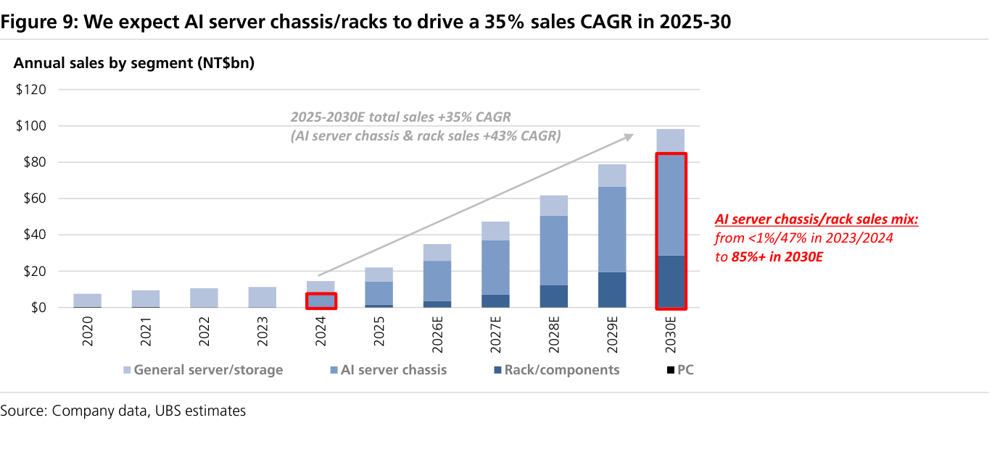

### 解讀摘要
UBS 模型顯示勤誠總收入從 2025 年 NT\$22bn 成長至 2030E NT\$98.3bn，CAGR 35%；其中 AI chassis+rack 的 CAGR 高達 43%。2026E 的 +59% YoY 是 AI platform 全面 ramp（HGX/MGX/ASIC）與機架業務初步貢獻的疊加，2027E+ 成長稍緩但仍達 35% YoY 以上，主要由機架佔比從 15% 提升及 Rubin 平台轉換驅動。

### 表格
| 年度 | 收入（NT\$m） | YoY 成長 | AI chassis+rack 佔比（估） |
|---|---|---|---|
| 2023 | 11,247 | - | 低 |
| 2024 | 14,517 | +29% | ~47% |
| 2025 | 22,001 | +52% | ~60% |
| 2026E | 34,946 | +59% | ~70-75% |
| 2027E | 47,296 | +35% | 更高 |
| 2028E | 61,696 | +30% | 85%+ |
| 2029E | 78,858 | +28% | — |
| 2030E | 98,275 | +25% | — |

> **洞察一**：2030E 達 NT\$98.3bn = 2025 年的 4.5 倍，在 5 年內實現，對應的 CAGR 35% 意味著每兩年翻一番略不到——比 2025 年 52% 的跳躍式成長更為平滑，反映 UBS 對機架業務逐步爬升（非爆發式）的假設。若機架業務加速（管理層樂觀指引），上行空間即為 NT\$1,750 情境。

---

## Fig. 17｜AI 伺服器底盤市場規模

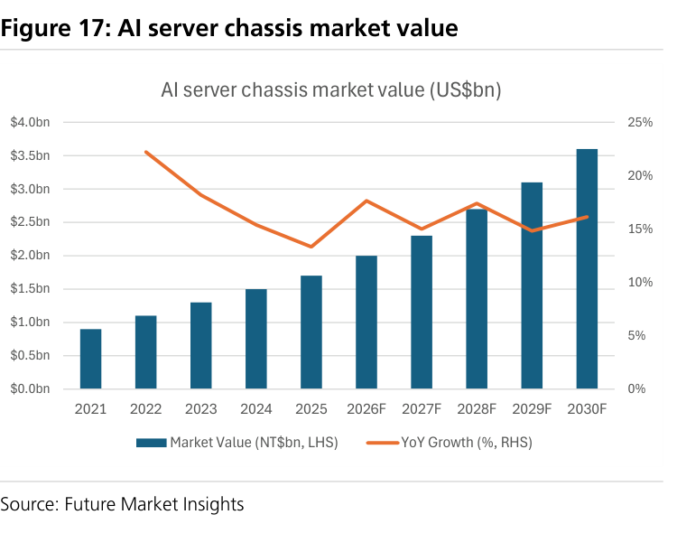

### 解讀摘要
AI 伺服器底盤市場為全球成長最快的 AI 供應鏈細分之一，規模從 2024 年開始加速。市場相對分散（勤誠全球市占 11-13%），說明即使市場規模大幅增長，勤誠要提高市占率（從技術升級和設計合作身份切入）仍有充足空間。

> **原文補充**：數據來源為 Future Market Insights，非 UBS 原始模型。

---

## Fig. 18｜AI 伺服器底盤按冷卻方式分類

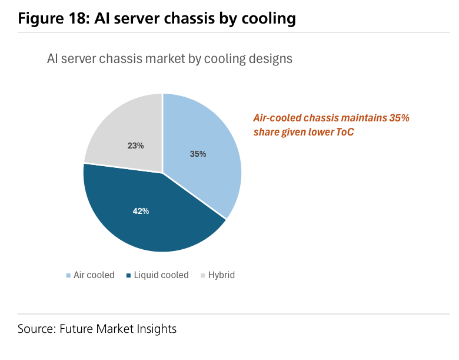

### 解讀摘要
AI 伺服器底盤按冷卻分類顯示液冷佔比正在上升（對應 Teton Max、AMD Helios、CDU rack 等高功率架構）。液冷底盤設計更複雜、更高 ASP，且勤誠已開發 CDU rack、噪音+液冷整合機架，有能力切入這個附加值更高的市場。

> **洞察一（配合 Fig 7）**：Teton Max 已採用冷板液冷（cold plates for XPU/CPU），而勤誠的 CDU rack 和液冷兼容設計正好對應這個需求——液冷佔比上升對勤誠是 double upside：ASP 提升 + 新業務機會。

---

## Fig. 25｜勤誠公司結構（2025 年）

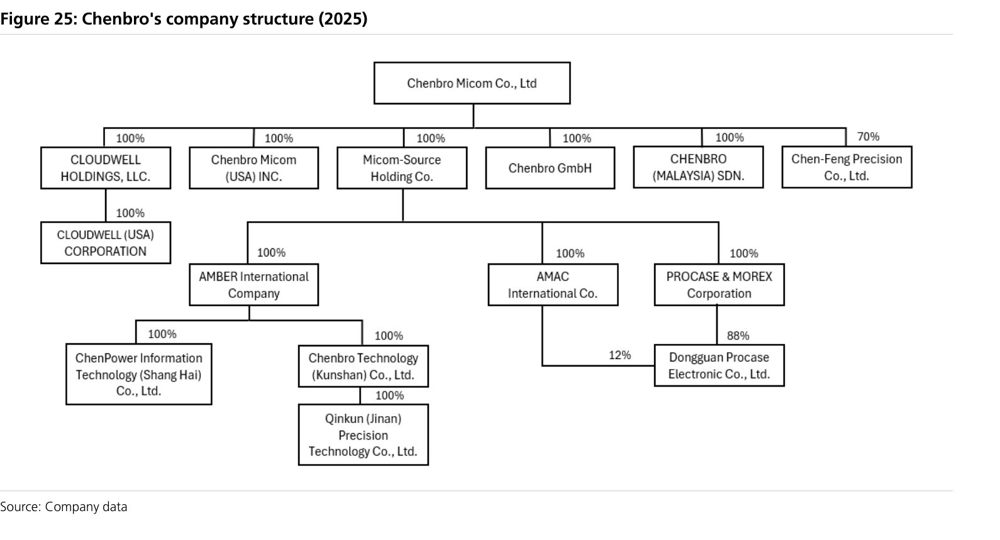

### 解讀摘要
勤誠母公司直接持有主要生產子公司（陳峰精密 NCT 廠、崑山/東莞中國廠），並透過投資架構掌握核心製造資產。公司結構相對簡單，沒有複雜的交叉持股，有助於財務透明度。創辦人家族透過鵬威、聯梅、明廣等投資公司合計持有約 51% 股份，確保長期策略穩定性。

---

## Fig. 26｜勤誠業務模式

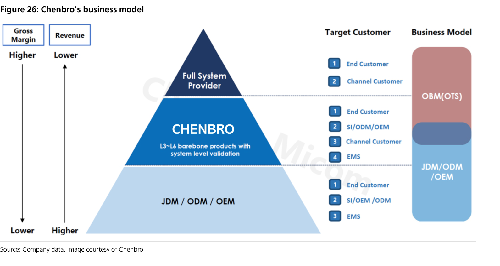

### 解讀摘要
三種業務模式差異化定位：JDM/ODM 與 CSP 深度共同開發（60-65% 銷售），OTS 標準化現貨型產品（10-20%），OEM Plus 代工+優化服務（15-25%）。JDM/ODM 模式是勤誠高毛利的來源——與客戶從設計階段介入，提高了切換成本，也是 AI 伺服器時代最受益的業務模式（客戶願為定制設計支付溢價）。

> **原文補充**：JDM/ODM 業務從前端設計、R&D、試產（NCT 工廠）到量產（嘉義、崑山、東莞）提供端到端服務，是勤誠與一般代工廠最大的差異化。

---

## Fig. 27｜勤誠生產基地分佈

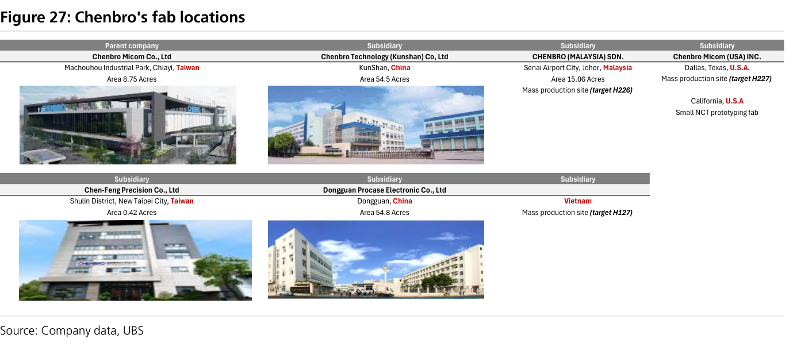

### 解讀摘要
勤誠正在建立真正的全球生產網絡：台灣（嘉義量產、樹林 NCT）、中國（崑山 54.5 畝、東莞 54.8 畝）、馬來西亞柔佛（Q426 量產，80-100K unit/月）、美國加州（2026 年 3 月開業，取樣+原型）、美國德州達拉斯（H227 量產，80-100K unit/月）、越南（H127，主攻機架生產）。這個多元化製造佈局直接回應地緣政治風險，並降低客戶對「台灣/中國集中」的疑慮——而且是在 AI 需求最熱時做到的，時間點恰當。

### 表格
| 基地 | 地點 | 定位 | 量產時間 | 月產能（1U） |
|---|---|---|---|---|
| 嘉義廠 | 台灣 | 主要量產 | 2022 年起 | — |
| 樹林 NCT | 台灣 | 取樣/原型 | 2025 年初 | — |
| 崑山廠 | 中國 | 量產 | 2006 年起 | — |
| 東莞廠 | 中國 | 量產 | 2007 年起 | — |
| 柔佛廠 | 馬來西亞 | 底盤+機架量產 | Q426 | 80-100K |
| 加州 NCT | 美國 | 取樣+原型 | 2026 年 3 月 | — |
| 達拉斯廠 | 美國德州 | 量產（機架 50%+） | H227 | 80-100K |
| 越南廠 | 越南 | 機架生產 | H127 | — |

> **洞察一**：資本支出 NT\$2.8bn（2026E）遠超歷史峰值 NT\$2.0bn（2021年），且僅是計劃投資的第一步（越南 NT\$600mn 8 月剛批准）。自由現金流 2026E/27E NT\$8.7bn/11.6bn 遠大於 capex，顯示擴產完全靠內生資金——不需要增資稀釋股權。

---

## Fig. 34｜2025 年按產品類型收入分解

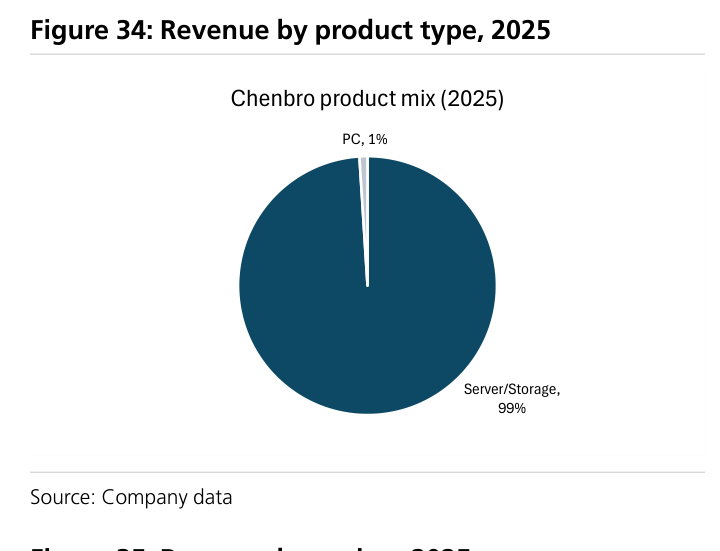

### 解讀摘要
2025 年勤誠收入中伺服器底盤及周邊產品佔 99%，PC 底盤 1%，業務高度集中。對照 UBS 估計的 2026E 產品組合（Fig.2），核心驅動是 AI 伺服器底盤在 server 總業務中的比重提升，而機架業務的加入是增量而非替代。

---

## Fig. 35｜2025 年按地區收入分解

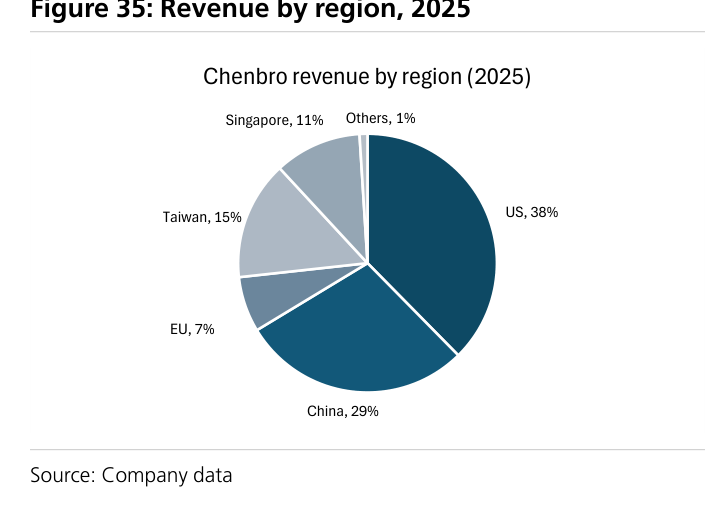

### 解讀摘要
2025 年地區收入結構反映勤誠以北美超大規模 CSP 為主要客戶基礎，台灣（間接出貨給 ODM 夥伴）亦貢獻重要份額。隨著馬來西亞、越南、德州廠相繼投產，未來美洲直接出貨比例將上升，同時中國業務因地緣政治風險而需結構性評估。

---

## 跨 Exhibit 彙整表

### 彙整 1｜AI 底盤 ASP 矩陣（不同平台/架構）

| 平台 | 架構 | 底盤 ASP（量產） | 勤誠份額定位 |
|---|---|---|---|
| NVIDIA HGX（Blackwell） | 7-11U，L5 | US\$3,000-5,000/chassis | 主要 CSP 1 個（+新增 1 個） |
| NVIDIA MGX（GB200/300） | 1-2U，L3 | US\$700-1,300/chassis | NVIDIA 設計合作夥伴 |
| AWS ASIC PD | 2D torus | US\$2,000-4,000/rack | 次要供應商 |
| AWS ASIC PDS ultra | 3D+switch | US\$4,000-10,000/scale-up unit | 主要供應商 |
| AWS ASIC Teton Max | 3D+switch+液冷 | US\$4,000-12,000/scale-up unit | 主要供應商 |
| AWS 降噪機架 | 附加 | US\$2,000-3,000/rack | 主要供應商 |
| NVIDIA GPU rack（整機架） | NVL72 | US\$20,000-25,000/rack | 含 MGX+HGX 元件 |

> 從最低端 MGX（US\$700-1,300）到最高端 Teton Max（US\$4,000-12,000），同樣的「一個機架系統」，勤誠的潛在底盤內容差距高達 9-17 倍。AI 架構往複雜度演進本身就是 ASP 升級引擎，不需要市占提升就能驅動 ASP 成長。

---

## 相關個股清單

| 類別 | 公司 | Ticker | 評等 | 備註 |
|---|---|---|---|---|
| 首次覆蓋目標 | 勤誠（Chenbro Micom） | 8210.TW | Buy, PT NT\$1,450 | 本報告主角 |
| 主要競爭者 | AVC（亞維） | 3017.TW | 未覆蓋 | 熱管理強，ASIC rack 主供應商 |
| 競爭者 | Foxconn Group | 2317.TW | 未覆蓋 | GPU/ASIC AI 伺服器競爭者 |
| 競爭者 | ChenMing（晨名） | 3013.TW | 未覆蓋 | 高度依賴 Meta，GB300 side-car |
| 競爭者 | In Win（迎廣） | 6117.TW | 未覆蓋 | PC/工作站起家，Blackwell 曝險小 |
| 競爭者 | AIC | 3693.TW | 未覆蓋 | 與 AMD、NVIDIA 合作機架整合 |
