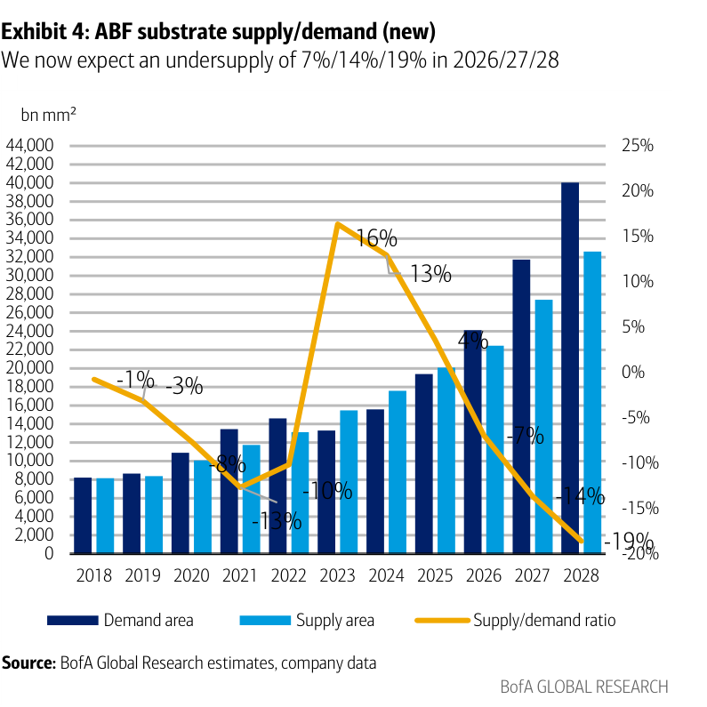
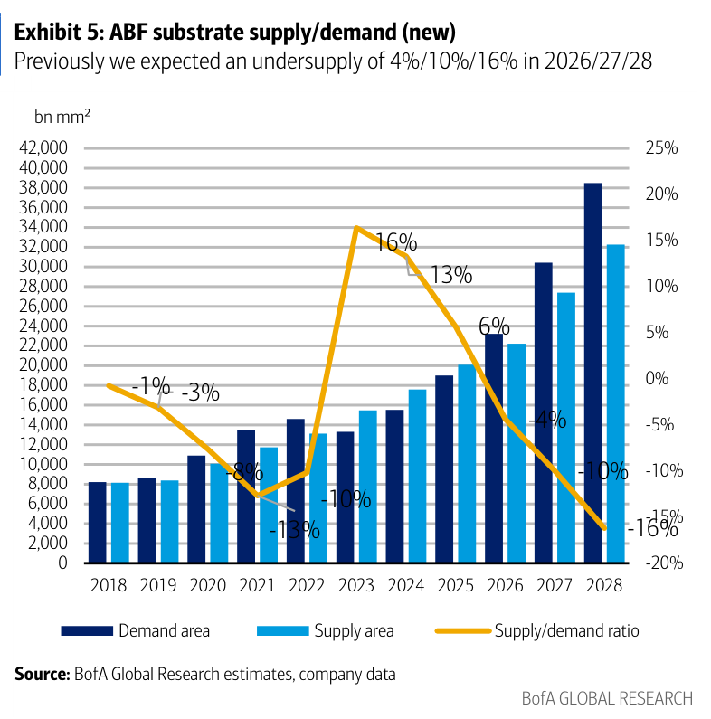
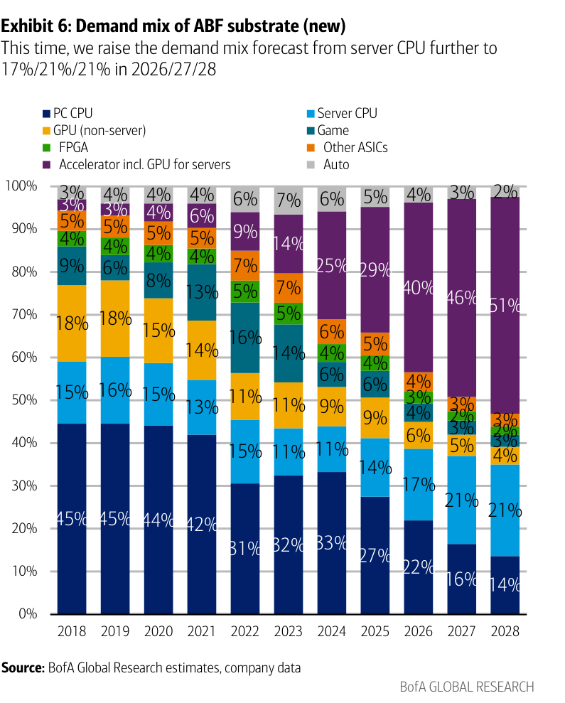
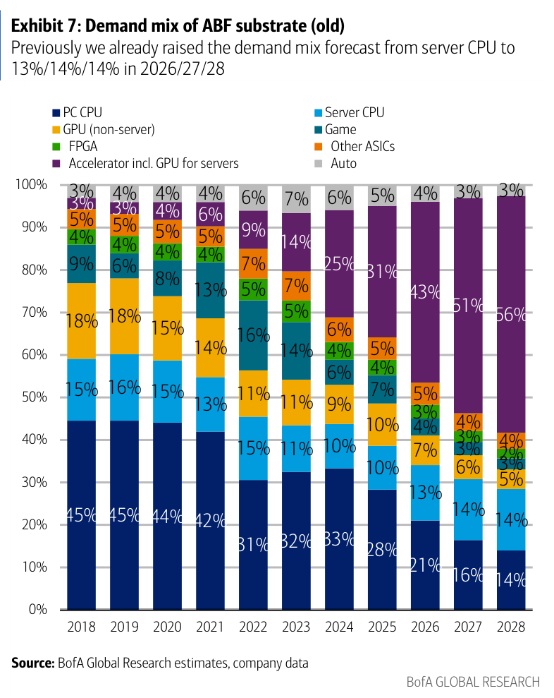
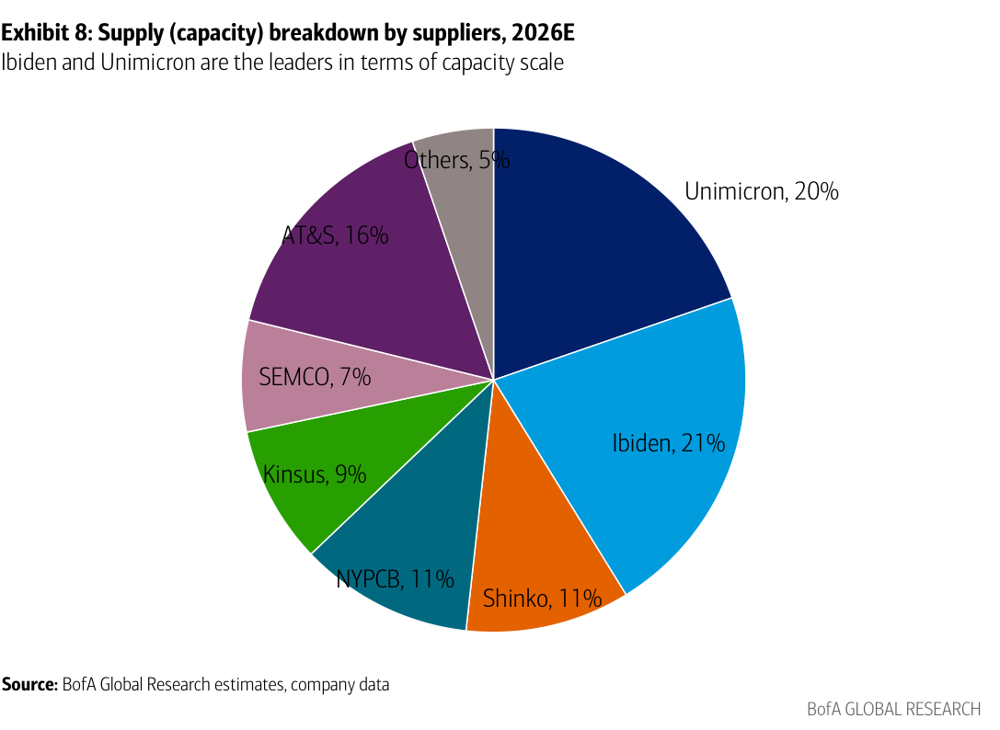

# BofA｜ABF Substrate：走向賣方市場

**券商**：BofA Securities (Merrill Lynch Taiwan / BofAS Japan)  
**分析師**：Mike Yang、Cathy Hsu（Merrill Lynch Taiwan）、Masashi Kubota（BofAS Japan）  
**日期**：2026-08-19  
**主題**：ABF substrate — progress toward a seller's market with a wider S/D gap driven by AI  
**評級**：Buy（Unimicron 3037、NYPCB 8046、Kinsus 3189）  
<a href="https://layx.uk/dl?g=產業&b=BofA&d=20260819&h=ABF-Substrate">📎 下載 PDF</a>

---

## 報告總結

伺服器 CPU 需求上修（server CPU 佔 ABF substrate 需求比 2026/27/28E 從 13%/14%/14% 上調至 17%/21%/21%），連帶拉大 S/D 缺口，BofA 上調 2026-28E ABF 供不應求程度至 -7%/-14%/-19%（前次 -4%/-10%/-16%）。目前供給份額由 Ibiden（21%）與 Unimicron（20%）領先，台灣三廠（Unimicron + NYPCB + Kinsus）合計佔 40%。三家台廠目標價均調升 +17-19%，重申 Buy。BofA 同步引入 2030 EPS 情境分析，基案下 2030 淨利相對目前 2028E 估計有 27-96% 上行空間。

---

## BofA 完整投資邏輯鏈

| 論點層次 | Exhibit | 內容 |
|---|---|---|
| 需求上修催化劑 | 6 vs 7 | Server CPU 佔比上調（2027E：14%→21%），背後是 CPU TAM 大幅上修 |
| 供需缺口加劇 | 4 vs 5 | 新預測：undersupply -7%/-14%/-19%（前 -4%/-10%/-16%） |
| 供給高度集中 | 8 | Ibiden 21% + Unimicron 20% 主導；台廠 40% 合計份額 |
| 台廠各具護城河 | 文字 | Unimicron 擴產最積極（+30%/年）；NYPCB 網路交換機 50%+份額；Kinsus 客戶預付資本 |
| 2030 長線 EPS 上行 | 9-16（已跳過） | 基案 2030 淨利 vs prior 2028E：Unimicron +39%, NYPCB +27%, Kinsus +96% |
| **結論** | 封面 | **重申 Buy 三廠；目標價各升 +17%/+19%/+17%；35x 2H27-1H28E P/E** |

> **報告最大邏輯缺口**：供給預測排除 Ibiden Gama 廠的 EMIB-T 產能（不同基板結構）；若 Intel EMIB-T 規模化，實際供給彈性可能大於 BofA 模型。

---

## 報告核心觀點

| 主題 | BofA 觀點 | 市場共識 | Contra-Consensus |
|---|---|---|---|
| Server CPU 需求 | 2027E 佔 ABF 需求 21%（大幅上修） | 前次 BofA 估 14% | 是，上調 +7pp |
| S/D 缺口 | 2028E undersupply -19% | 前次 -16% | 更悲觀（賣方市場加深） |
| Unimicron | PO NT\$1,400；P/E 升至 35x（前 33x）；高值專案 2H26 佔 50%+ | — | 估值倍數上調 |
| NYPCB | PO NT\$1,700；高端網路交換機份額 50%+；2Q26 GM +890bps QoQ（最佳） | — | 漲價最受益 |
| Kinsus | PO NT\$1,250；AI CPU 2027E 約 15% 營收（前 5%）；客戶預付 NT\$60-80bn | — | 最大 EPS 彈性（基案 +96%） |

---

## Exhibit 4｜ABF Substrate Supply/Demand（新預測）

### 解讀摘要
需求面持續快速擴張，2026-28E 需求年均成長約 20-25%（bn mm²），而供給增速明顯落後，導致 S/D 缺口逐年擴大：2026E -7% → 2027E -14% → 2028E -19%。Server CPU 需求上修是本次修正的核心驅動力——與前次預測（Exhibit 5）相比，2026E S/D ratio 從接近平衡惡化至 -7%，反映一個季度內的重大上修。

### 表格
| 年度 | Demand Area (bn mm²) | Supply Area (bn mm²) | S/D Ratio |
|------|----------------------|----------------------|-----------|
| 2024 | ~16,000 | ~15,000 | +13% (surplus) |
| 2025 | ~19,000 | ~20,000 | +14% (surplus) |
| 2026E | ~24,000 | ~23,000 | **-7%** |
| 2027E | ~31,000 | ~27,000 | **-14%** |
| 2028E | ~40,000 | ~33,000 | **-19%** |

> **洞察一**：2025→2026E 是 S/D 由正轉負的轉折點（+14% → -7%，落差 21pp）。需求在一年內跳升 ~26%（~19K→~24K bn mm²），供給只增長 ~15%（~20K→~23K bn mm²）。AI 加速器 + server CPU 雙重拉動導致需求彈性遠高於供給彈性。

---

## Exhibit 5｜ABF Substrate Supply/Demand（舊預測）

### 解讀摘要
本張顯示 BofA 前次預測的 S/D 數據，2026-28E 預計 undersupply 僅 4%/10%/16%。對比 Exhibit 4 的新預測（7%/14%/19%），每年缺口擴大約 3-4pp。主要差異來自 server CPU TAM 上修——舊預測 server CPU 2026/27/28E 佔需求 13%/14%/14%（見 Exhibit 7），新預測為 17%/21%/21%（Exhibit 6）。

> **洞察二（配合 Exhibit 4）**：兩版本 supply 預測相近（需求方是主要修正變量）。需求上修純係 server CPU TAM 重新評估，與 AI 加速器無關——這意味著若 AMD/Intel CPU 路線圖進一步上調，缺口可再次惡化。

---

## Exhibit 6｜ABF Substrate 需求組成（新預測）

### 解讀摘要
AI 加速器（Accelerator，含 GPU for servers）持續為最大成長來源，2028E 預計佔 51%；更顯著的是 server CPU 佔比大幅上調至 2027-28E 各 21%，成為本次需求上修的核心。PC CPU 持續萎縮（2028E 僅 14%）。AI 相關需求（Accelerator + Server CPU）合計：2025 43% → 2026 57% → 2027 67% → 2028 72%，三年內翻 29pp。

### 表格
| 應用 | 2025 | 2026E | 2027E | 2028E |
|------|------|-------|-------|-------|
| PC CPU | 27% | 22% | 16% | 14% |
| Server CPU | 14% | 17% | 21% | 21% |
| Accelerator（GPU for servers） | 29% | 40% | 46% | 51% |
| GPU (non-server) | 9% | 6% | 5% | 4% |
| FPGA | 6% | 4% | 3% | 3% |
| Other ASICs + Auto | 9% | 6% | 5% | 4% |
| Game | 6% | 5% | 4% | 3% |

> **洞察三（配合 Exhibit 7）**：Server CPU 的跳升（2027E：14%→21%，+7pp）是本次報告最大修正。Accelerator 反而略微下調（2027E：51%→46%）——整體 AI 需求比重不變，只是 GPU/ASIC 加速器佔比讓路給 server CPU。這意味 ABF 基板需求基礎更廣（不只 NVIDIA），對供需比更穩固。

---

## Exhibit 7｜ABF Substrate 需求組成（舊預測）

### 解讀摘要
舊預測中 server CPU 2026/27/28E 佔比僅 13%/14%/14%，Accelerator 佔比更高（2027E 51%、2028E 56%）。與 Exhibit 6 對比，核心差異在 server CPU：+4pp（2026）、+7pp（2027）、+7pp（2028）。舊預測假設 CPU 需求貢獻相對穩定，新預測反映 Intel/AMD 高效能 server CPU 的 ABF 面積密度大幅提升。

### 表格
| 應用 | 2025 | 2026E | 2027E | 2028E |
|------|------|-------|-------|-------|
| PC CPU | 28% | 21% | 16% | 14% |
| Server CPU | 10% | 13% | 14% | 14% |
| Accelerator（GPU for servers） | 31% | 43% | 51% | 56% |
| GPU (non-server) | 9% | 7% | 6% | 5% |
| FPGA | 4% | 3% | 3% | 3% |

---

## Exhibit 8｜供給（產能）份額：各廠商，2026E

### 解讀摘要
ABF substrate 供給高度集中於 Ibiden（21%）與 Unimicron（20%），兩者合計 41%。台灣三廠（Unimicron + NYPCB + Kinsus）合計 40%，是本報告 Buy 推薦的主要標的群。AT&S（奧地利）以 16% 位居第三，而中韓廠商（SEMCO 7%）比重相對低。

### 表格
| 廠商 | 2026E 份額 |
|------|-----------|
| Ibiden（日本） | 21% |
| Unimicron（3037 TT） | 20% |
| AT&S（奧地利） | 16% |
| NYPCB（8046 TT） | 11% |
| Shinko（日本） | 11% |
| Kinsus（3189 TT） | 9% |
| SEMCO（韓國） | 7% |
| Others | 5% |

> **洞察四**：台灣三廠合計 40% 份額，且均在積極擴張（Unimicron +30%/年、Kinsus +50% 至 2029E、NYPCB debottleneck）。日本廠商（Ibiden + Shinko）合計 32% 但擴產節奏較保守。隨台廠份額提升，2027-28E 台灣製造商在賣方市場中話語權加大（定價能力升）。

---

## 相關個股清單

| 類別 | 公司 | Ticker | 評等 | 目標價 | 備注 |
|---|---|---|---|---|---|
| ABF substrate | Unimicron | 3037 TT | Buy | NT\$1,400（↑自1,200） | 擴產最積極；高值專案 2H26 50%+ |
| ABF substrate | NYPCB | 8046 TT | Buy | NT\$1,700（↑自1,430） | 高端網交換機 50%+份額；GM漲幅最大 |
| ABF substrate | Kinsus | 3189 TT | Buy | NT\$1,250（↑自1,070） | AI CPU/GPU ASIC 35%+GM；客戶預付資本 |
| ABF substrate | Ibiden | 4062 JP | — | — | 供給領先（21%），Gama廠EMIB-T排除在外 |
| ABF substrate | AT&S | ATS AV | — | — | 16% 份額；FY26/27 指引上調為正面信號 |
| ABF substrate | SEMCO | 009150 KS | — | — | 7% 份額，信號正面（見報告引述） |
