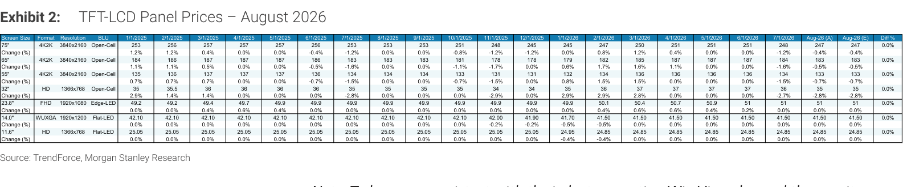
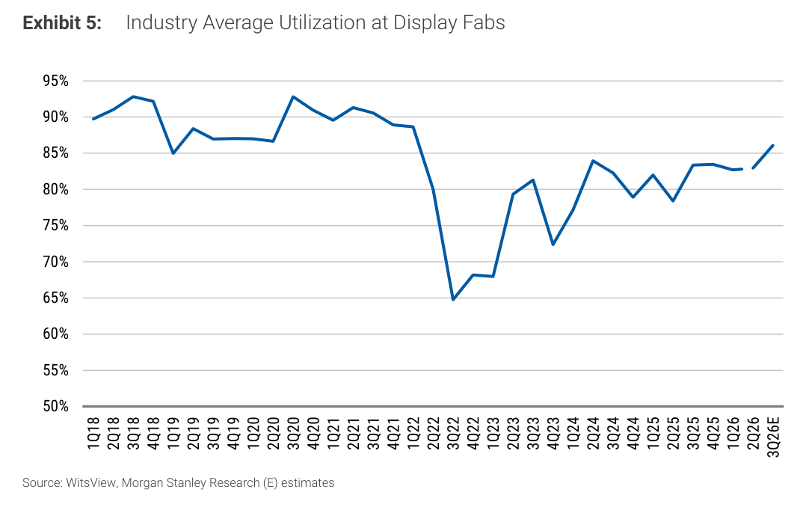
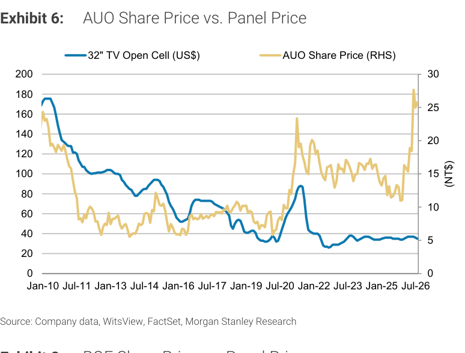
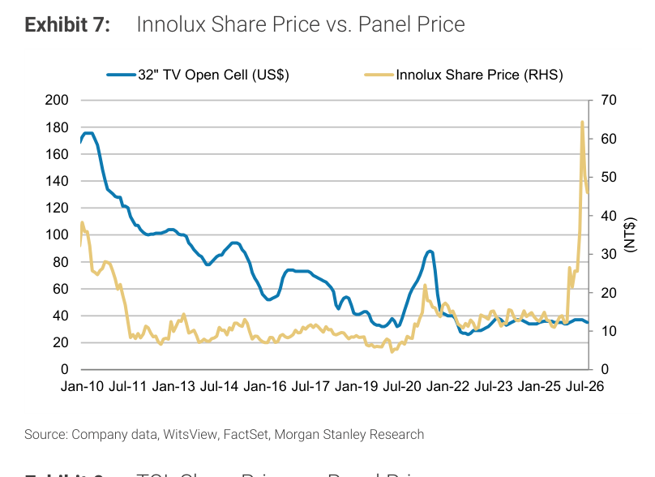
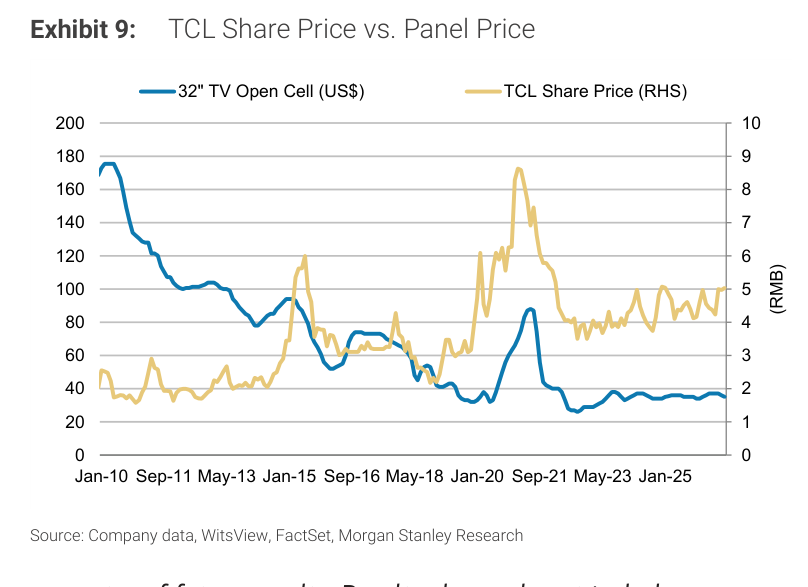

# MS｜TFT-LCD Panel Prices Aug-26：TV -1%、螢幕/NB 持平

**券商**：Morgan Stanley  
**分析師**：Derrick Yang、Shawn Kim、Ryan Kim、Vivi Huang、Andy Meng  
**日期**：2026-08-20  
**主題**：TFT-LCD Panel Prices for Aug-26 — TVs -1%, Monitors and Notebooks Flat MoM  
**評級**：Industry View In-Line（大中華）；Attractive（南韓）  
<a href="https://layx.uk/dl?g=產業&b=MS&d=20260820&h=TFT-LCD-Panel-Prices-Aug">📎 下載 PDF</a>

---

## 報告總結

2026 年 8 月面板報價：TV 面板 MoM -1%（32" -3%、43" -2%、55" -1%、65" -0.5%、75" -0.4%），螢幕與 NB 面板持平，走勢符合 MS 預期。3Q26E TV QoQ 仍呈小幅負值，產能利用率回升至 ~86%（接近但未達歷史正常區間 88-93%），不足以驅動面板漲價。面板股（AUO、Innolux）近期大幅拉升已反映玻璃先進封裝題材（AUO 股價 NT\$5 → NT\$27+、Innolux NT\$15 → NT\$60+），但 MS 指出進展慢於預期，整體風險報酬 Unattractive——面板基本面偏弱、股價重估後空間有限。

---

## MS 完整投資邏輯鏈

| 論點層次 | Exhibit | 內容 |
|---|---|---|
| 面板報價月度更新 | 2 | TV -1% MoM；螢幕/NB 持平；全尺寸明細如表 |
| TV 季度趨勢仍偏空 | 3 | 3Q26E TV QoQ 小幅負值（紅框標示），整體動能未見轉正 |
| IT 面板 QoQ 持平 | 4 | 螢幕 + NB QoQ 約 0%（3Q26E），無明顯量價驅動 |
| 利用率回升但不足 | 5 | 產能利用率 3Q26E ~86%，距 2018-22 均值 ~90% 仍有差距，不構成漲價條件 |
| 股價大幅超漲基本面 | 6-9 | AUO/Innolux 股價近期急漲，BOE/TCL 相對跟漲但幅度較小；面板價格仍低迷 |
| **結論** | 封面 | **Risk/reward Unattractive；面板股股價重估已定價玻璃封裝題材；短期基本面無催化劑** |

---

## 報告核心觀點

| 主題 | MS 觀點 | 備注 |
|---|---|---|
| TV 面板報價 | 8 月 MoM -1%；32"-75" 尺寸均微幅下滑（-0.4% 至 -3%） | 符合 MS 預期，無意外 |
| 螢幕/NB 面板 | 8 月 MoM 持平 | IT 需求穩定但無成長 |
| 3Q26E TV QoQ | 小幅負值 | 季度漲價動能不足 |
| 利用率 | ~86%（3Q26E），由 2022 年 65% 低谷回升 | 尚未回到 ~90% 的健康水位 |
| 面板股風險報酬 | Unattractive；近期 AUO/Innolux 大漲定價玻璃先進封裝成長 | 玻璃在先進封裝的進展慢於預期（MS 觀點） |
| 南韓面板股 | Industry View Attractive | 可能指三星顯示器等差異化面板廠 |

---

## Exhibit 2｜TFT-LCD Panel Prices – August 2026（全尺寸報價表）

### 解讀摘要
8 月面板報價表涵蓋 TV（32"-75"）、螢幕（23.8" FHD）、NB（14" WUXGA、11.6" HD）等規格，從 2025 年 1 月到 2026 年 8 月的月度追蹤。TV 各尺寸普遍微幅走低，但幅度有限（最大跌幅 32" -3%）；螢幕與 NB 完全持平，顯示 IT 需求穩定但無議價能力。

### 表格（2026-08 報價摘要）

| 規格 | 尺寸 | 格式 | Aug-26 (A)（US\$） | MoM 變動 |
|------|------|------|--------------------|---------|
| TV | 32" | 4K2K Open-Cell | 35 | -3.0% |
| TV | 43" | 4K2K Open-Cell | 134 | -2.2% |
| TV | 55" | 4K2K Open-Cell | 133 | -0.7% |
| TV | 65" | 4K2K HD Open-Cell | 34 | -0.5% |
| TV | 75" | 4K2K HD Open-Cell | 35 | -0.4% |
| 螢幕 | 23.8" | FHD Edge-LED | 51 | 0.0% |
| NB | 14" | WUXGA Flat-LED | 41.50 | 0.0% |
| NB | 11.6" | HD Flat-LED | 24.85 | 0.0% |

> **洞察一**：TV 面板價格持續長期下行後在 US\$33-36 區間盤整，螢幕面板 US\$51 已接近歷史低點，NB 面板則維持多年穩定低位。面板報價本身提供不了漲價催化劑，支撐股價的是題材（玻璃先進封裝）而非基本面。

---

## Exhibit 3｜TV Panel Price Trend（QoQ）

### 解讀摘要
TV 面板季度 QoQ 走勢從 2020 年 COVID 拉貨高峰（最高 +20% QoQ）後反轉，2022 年 3Q 重挫接近 -30% QoQ，此後逐步修復至 ±5% 區間波動。3Q26E（紅框標示）仍在零軸以下，顯示季度環比仍呈小幅負值——面板進入緩慢正常化但無明顯漲價跡象。

> **洞察二**：TV 面板 QoQ 自 2023 年後已無大幅正/負波動，「穩中偏弱」成為新常態。缺乏 V 型反轉的基本面，意味面板股股價的上漲動能需要仰賴業外題材（玻璃先進封裝）而非面板景氣本身。

---

## Exhibit 4｜IT Panel Price（QoQ）

### 解讀摘要
螢幕（Monitor）與 NB 面板 QoQ 走勢並列呈現。2022 年兩者同步重挫（-15% 以上），2023 年後各自回到 ±3% 窄幅波動。3Q26E（紅框）兩者均接近 0%，與月度報價持平一致——IT 面板市場進入低活性、小波動的成熟穩定期，無明顯方向性。

---

## Exhibit 5｜Industry Average Utilization at Display Fabs

### 解讀摘要
面板廠產能利用率長期趨勢：2018-21 年均維持在 88-93% 高位，2022 年 2Q 因需求崩跌驟降至 65% 歷史低點，之後緩慢回升，3Q26E 預估約 86%。目前利用率低於歷史正常水位約 4-7pp，代表仍有閒置產能，不構成供給緊張條件，難以支撐大幅漲價。

> **洞察三**：利用率從 65% 回升至 86% 看似健康，但面板漲價的歷史條件是利用率 >90% 且需求持續成長。目前 86% 的水位停留在「不夠差也不夠好」的中間地帶，既無減產壓力迫使漲價、也無過熱訊號。對面板股而言，基本面既不構成壓力也不構成催化劑。

---

## Exhibit 6｜AUO Share Price vs. Panel Price

### 解讀摘要
長期來看，AUO 股價（NT\$，右軸）與 32" TV 面板價格（US\$，左軸）走勢高度相關——2010 年至 2022 年均在同一大週期。2026 年中起，AUO 股價急升至 NT\$27+ 而面板價格仍停留在 ~US\$35 的歷史低位附近，兩者出現顯著背離。這是玻璃先進封裝題材推動的重估，並非面板景氣改善。

> **洞察四（配合 Exhibit 7-9）**：AUO 與 Innolux 的股價近期急漲幅度遠大於 BOE、TCL，反映台灣廠商在玻璃先進封裝的技術布局（與 IC 封裝廠合作進展）被市場給予更高期待。MS 對此持懷疑態度（進展「慢於預期」），若玻璃先進封裝落地時程再延遲，台廠股價將失去題材支撐。

---

## Exhibit 7｜Innolux Share Price vs. Panel Price

### 解讀摘要
Innolux 股價走勢與 AUO 類似：長期與面板價格相關，2026 年中後股價急升至 NT\$60+ 歷史高位，而面板價格依然低迷。Innolux 的漲幅比例更大（相對底部倍數更高），顯示市場對小市值廠商的玻璃封裝題材給予更高的想像空間。

---

## Exhibit 8｜BOE Share Price vs. Panel Price

### 解讀摘要
BOE（京東方，A股）股價（RMB，右軸）歷史週期與面板價格高度同步，2016-18 年股價衝至 ~6.5 RMB 高點對應當時面板超級週期。2026 年股價在 ~6 RMB 附近，接近前高，但面板價格 ~US\$35 遠低於 2016-18 年水準。BOE 的股價支撐更多來自中國半導體/顯示政策預期，而非面板基本面。

---

## Exhibit 9｜TCL Share Price vs. Panel Price

### 解讀摘要
TCL（中國，A股）股價（RMB）與面板價格走勢相關但 beta 較低，目前約 ~5 RMB，接近 2021 年高點的約 8.5 RMB 後回落的中間位置。與 BOE 相似，TCL 股價的波動部分受中國政策與消費電子週期影響，面板本身的邊際定價能力有限。

---

## 相關個股清單

| 類別 | 公司 | Ticker | MS 評等 | 備注 |
|---|---|---|---|---|
| 面板 | AUO | 2409 TT | — | 股價急漲反映玻璃封裝題材；面板基本面偏弱 |
| 面板 | Innolux | 3481 TT | — | 漲幅比例更大；風險報酬 Unattractive |
| 面板 | BOE | 000725 CH | — | A股；政策預期支撐；面板週期偏弱 |
| 面板 | TCL | 000100 CH | — | A股；低 beta；面板議價能力有限 |
| 玻璃 | Corning (GLW) | GLW US | — | Display 玻璃核心廠；Exhibit 10-11 已略過（GLW 個股資料） |
