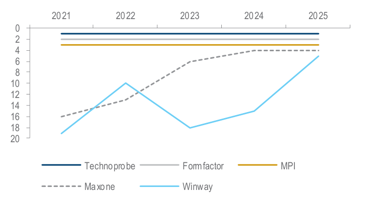
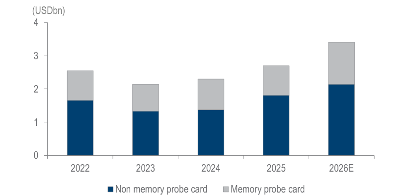
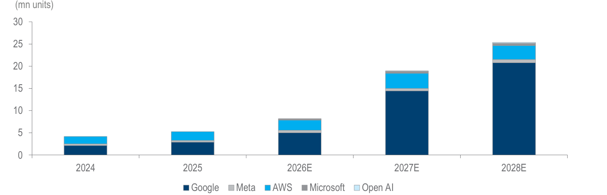
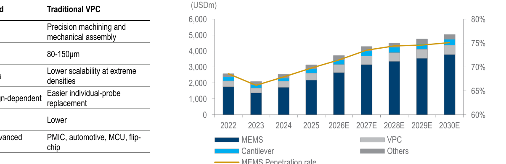
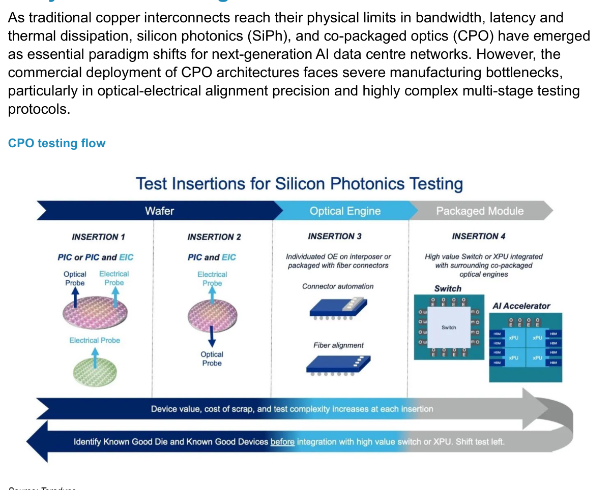
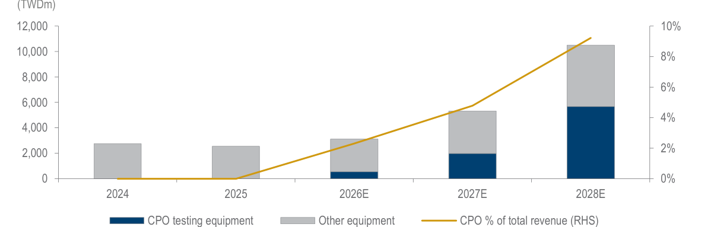
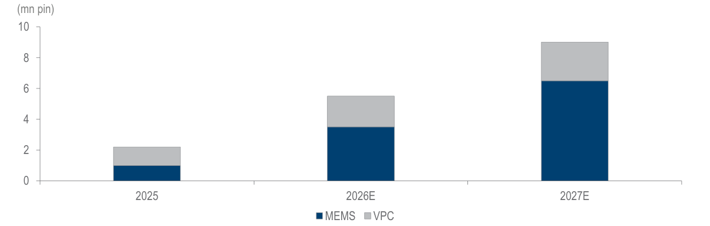
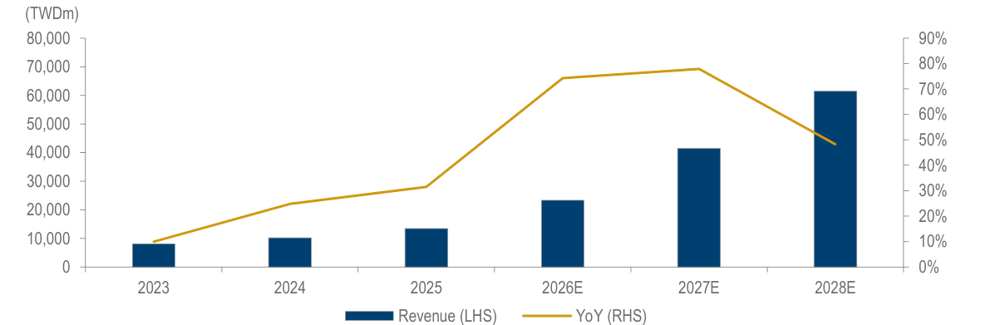
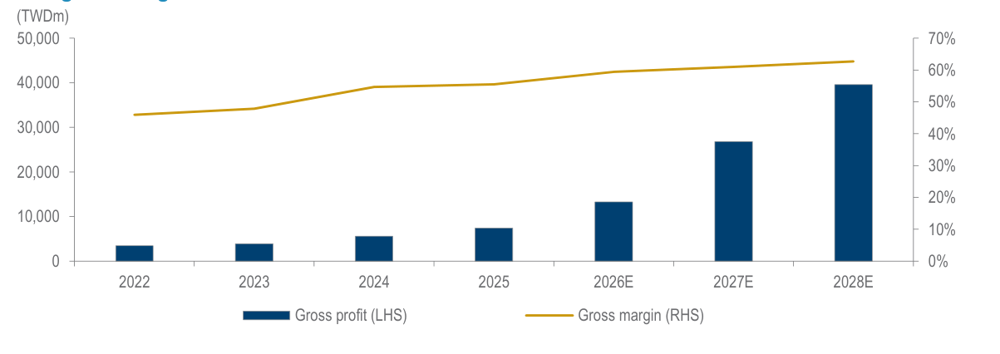
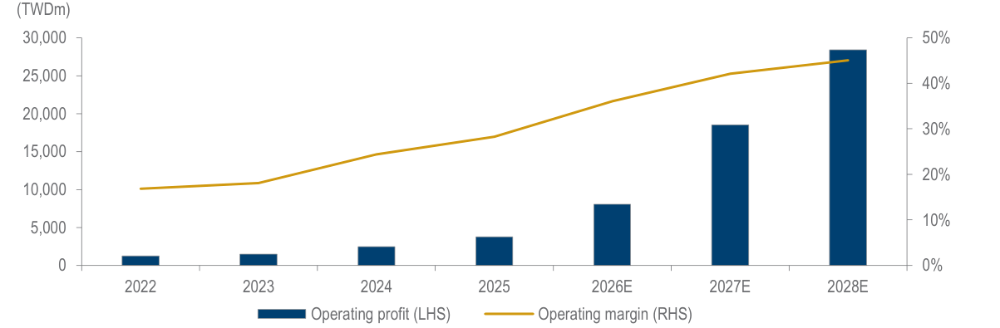

# Daiwa｜MPI Corp Initiation: mining the AI ASIC & CPO build-out

**券商**：Daiwa Securities Capital Markets  
**分析師**：Leon Chen、Stacy Lin  
**日期**：2026-08-21  
**主題**：旺矽科技首次覆蓋——AI ASIC 探針卡市場領導者＋CPO 測試先行者  
**評級**：Buy (1)，12M TP TWD8,415（+48.9% upside vs. TWD5,650）  
<a href="https://layx.uk/dl?g=產業&b=Daiwa&d=20260821&h=MPI-Initiation">📎 下載 PDF</a>

---

## 報告總結

Daiwa 以 Buy(1) 首次覆蓋旺矽科技（6223 TT），目標價 TWD 8,415（65x 4-quarter-forward EPS），2Q26 財報後股價因管理層保守 2H26 指引回落（Daiwa 認為係短期雜訊），提供長線進場窗口。報告圍繞三大結構性驅動力：①近乎獨家供應美系 CSP 定製 AI ASIC 探針卡（高轉換成本護城河）；②先進節點（3nm/2nm）驅動 MEMS 探針卡取代 VPC（ASP 高 20-30%），毛利率 2026-28E 由 59.7%→63%；③ CPO 測試設備 4Q26 起開始貢獻營收，2028E 佔總收入 9.2%，形成第二成長引擎。容量方面，月產 MEMS+VPC 針腳數 end-2026 5.5mn→end-2027 9.0mn，新竹 PCB 廠將達 50%+ 自製率，壓縮 NPI 週期與消除外購基板溢價，催化毛利率進一步擴張。

---

## Daiwa 完整投資邏輯鏈

| 論點層次 | Exhibit | 內容 |
|---|---|---|
| 市場地位確立 | Exhibit 1 | 全球非記憶體探針卡前三強，VPC 市占 31%（Yole Intelligence），與美系 CSP 近乎獨家供應關係 |
| AI ASIC 需求加速 | Exhibit 3 | Google/Meta/AWS/MS/OpenAI ASIC 出貨量 2024-28E CAGR ~58%，Google 2028E 佔 ~80% |
| MEMS 升級帶動 ASP | Exhibit 4 | MEMS 探針卡 ASP 高於 VPC 20-30%（USD13-15/pin vs USD10-13/pin）；2027E 滲透率>70% |
| CPO 先行優勢 | Exhibit 5, 6 | Insertion 2/3 雙節點佈局；設備 2027E 佔總收入 4.8%，2028E 9.2% |
| 產能倍增執行 | Exhibit 7 | 月針腳數 2.2mn（2025）→9.0mn（end-2027E），可能提前完成 |
| 估值支撐 | 封面 | 65x 4Q-forward EPS；EPS CAGR 78%（2026-28E）；Daiwa 估值 vs 共識高 12.8%/9.8% |
| **結論** | 報告封面 | **首次覆蓋 Buy(1)，TP TWD8,415（65x 4Q-forward EPS）；管理層保守指引≠需求放緩，2H26 為長線佈局窗口** |

> **報告最大邏輯缺口**：CPO 測試設備 4Q26 revenue recognition 高度依賴客戶驗收時程（Insertion 2 仍在 qualification），若延至 1Q27 將使 2026E EPS 下滑。

---

## 報告核心觀點

| 主題 | Daiwa 觀點 | 市場共識 | 是否 Contra-Consensus |
|---|---|---|---|
| 2H26 指引保守 | 係管理層慣性審慎＋產能爬坡節奏，非需求放軟；pull-in 可能 beat 指引 | 市場隨股價下跌 priced in 需求疑慮 | ✅ 是 |
| MEMS 全平台化 | 2026 起幾乎所有 AI GPU/ASIC 平台均採用 MEMS，標準化趨勢不可逆 | 市場尚未完全反映 MEMS ASP 溢價對毛利率的結構性貢獻 | ✅ 是 |
| CPO 設備 4Q26 | Insertion 3 設備 4Q26 開始出貨；Insertion 2 預計 2Q27 商業化 | CPO 商業化延遲疑慮持續壓制估值 | ✅ 是 |
| EPS CAGR 78% | 遠高於同業（FormFactor 20%、Technoprobe 36%、MJC 99%、Winway 101%） | 共識估值 12-10% 低於 Daiwa（2026-27E） | ✅ 是 |

**偏好排序**：MPI > Winway（6515）> CHPT（6510）  
**個股偏好**：旺矽為探針卡首選，AI ASIC 需求能見度最高、CPO 佈局最早期

---

## Exhibit 1｜Global: Non-Memory Probe Card Supplier Ranking

### 解讀摘要

Techinsights 數據顯示全球非記憶體探針卡市場由 Technoprobe 和 Formfactor 佔據前兩席，MPI 穩定保持前五名，而 Winway（曜達）近四年排名快速竄升——這張圖的投資意義在於：MPI 在一個相對集中的市場中具有「前幾大供應商」的地位，而市場正在走向更高技術壁壘的 MEMS 升級週期，中小型競爭者（Maxone、Winway 等後進者）要追上需要更長的資本累積與技術驗證週期。

### 表格

| 供應商 | 2021 相對排名 | 2025 相對排名 | 趨勢 |
|---|---|---|---|
| Technoprobe | 最高（領先） | 最高（穩定） | 穩定領先 |
| Formfactor | 第二 | 第二 | 穩定 |
| MPI | 前四 | 前四 | 穩定 |
| Maxone | 中段 | 改善 | 上升 |
| Winway | 較低 | 中段 | 顯著竄升 |

> **洞察一**：Winway 排名快速竄升代表台灣探針卡供應商整體技術能力提升，對 MPI 形成潛在競爭壓力；但 MPI 在美系 CSP 的近乎獨家認證地位是 Winway 短期難以複製的差異化護城河。

---

## Exhibit 2｜Global: Non-Memory Probe Card TAM

### 解讀摘要

非記憶體探針卡市場規模 2022-2025 在 2.1-2.8 USDbn 間盤整（因 2022-23 半導體下行），2026E 起隨 AI ASIC 需求啟動明顯擴大至約 3.4 USDbn。這個市場本身規模不大但集中度高（前三大佔多數），而 MPI 以 TWD 23bn（≈USD 720m）的 2026E 探針卡收入已是全球領先規模，顯示其市占率在上行週期中正快速擴大。

### 表格

| 年份 | 非記憶體探針卡（USDbn） | 記憶體探針卡（USDbn） | 合計（USDbn） |
|---|---|---|---|
| 2022 | ~1.65 | ~0.90 | ~2.55 |
| 2023 | ~1.35 | ~0.80 | ~2.15 |
| 2024 | ~1.42 | ~0.88 | ~2.30 |
| 2025 | ~1.82 | ~0.93 | ~2.75 |
| 2026E | ~2.15 | ~1.20 | ~3.35 |

> **洞察一**：MPI 2026E 探針卡收入（TWD 17,077m ≈ USD 530m）除以非記憶體 TAM（USD ~2.15bn）= 市占率約 24-25%，已是極高集中度；若含 MEMS 在 AI ASIC 平台快速滲透，MPI 的絕對份額仍有向上空間（特別是從 FormFactor/Technoprobe 手中搶入 CPU 端溢出訂單）。

---

## Exhibit 3｜Global: ASIC Shipments by CSP

### 解讀摘要

Daiwa 預測 CSP 定製 AI ASIC 出貨量將在 2024-28E 間從約 4mn unit 跳增至約 25mn unit（CAGR ~58%），且 2027E 起 Google 佔總出貨量比重超過 75%，成為絕對主導力量。這張圖直接支撐了 MPI 的核心投資命題：MPI 與美系 CSP 的近乎獨家供應關係意味著 Google/AWS/Meta/MS 的每一顆 ASIC 晶片都需要探針卡測試，而測試接口成本不到 COGS 的 1-2%，換廠成本極高。

### 表格

| 年份 | Google | AWS | Microsoft | Meta | OpenAI | 合計（mn units） |
|---|---|---|---|---|---|---|
| 2024 | ~2.5 | ~1.2 | ~0.2 | ~0.1 | ~0.0 | ~4 |
| 2025 | ~2.5 | ~1.5 | ~0.8 | ~0.1 | ~0.3 | ~5.2 |
| 2026E | ~5.0 | ~2.0 | ~0.6 | ~0.2 | ~0.3 | ~8.1 |
| 2027E | ~14 | ~4.0 | ~0.4 | ~0.3 | ~0.1 | ~18.8 |
| 2028E | ~20 | ~4.0 | ~0.6 | ~0.3 | ~0.1 | ~25 |

> **洞察一**：Google 2027-28E ASIC 出貨量大幅超越其他 CSP（14mn → 20mn vs. AWS 4mn），顯示 Google TPU 系列（Broadcom 代工）是 MPI 最重要的單一客戶成長驅動力，高度集中在單一客戶是最大風險點。
>
> **值得驗證**：Daiwa 預測 Google 2027E ASIC 出貨量跳升 3 倍（5mn→14mn），這一假設若偏差 30%（下修至 10mn）將使 MPI 2027E 探針卡收入下移約 TWD 4-5bn（~10-12%），EPS 下修幅度相近。

---

## Exhibit 4｜MEMS vs 傳統 VPC 比較 ＋ Global MEMS 探針卡滲透率

### 解讀摘要

左側表格（含 MEMS 欄位，圖片僅顯示 Traditional VPC 欄，MEMS 欄從原文補全）清楚呈現技術差異：MEMS 採用光刻微製程、最小間距 35-45μm、可支援 >20k 針腳，是 3nm/2nm 先進節點大封裝 AI ASIC 的唯一可行測試方案；傳統 VPC 的 80-150μm 間距在 40k+ 針腳需求下物理上不可行。右側圖表顯示 MEMS 滲透率從 2022 年的 ~63% 穩步升至 2030E 的 ~75%，絕對金額從 ~USD 1.5bn 升至 ~USD 3.5bn，整體市場盤子也在擴大。

> **原文補充**：Daiwa 的渠道調查顯示針腳數已從幾千根升至 40k+ 根，這個轉折點是 MEMS 市場加速的技術驅動因素；MPI 的 MEMS ASP 為 USD 13-15/pin，傳統 VPC 為 USD 10-13/pin，差距 20-30%。

### 表格（MEMS vs 傳統 VPC 完整比較，從原文重建）

| 比較項目 | MEMS 探針卡 | 傳統 VPC |
|---|---|---|
| 製造技術 | 光刻/微製程 | 精密機械加工/機械組裝 |
| 最小接觸間距 | 35–45μm | 80-150μm |
| 針數擴展性 | 高（>20k 探針） | 極高密度時受限 |
| 可修復性 | 專用設計（依設計而定） | 較易個別換針 |
| 相對成本 | 較高 | 較低 |
| 主要應用 | AI/HPC、HBM、先進封裝 | PMIC、車用、MCU、倒裝晶片 |

### 表格（Global MEMS 探針卡市場，視覺估算）

| 年份 | MEMS（USDbn） | VPC + 其他（USDbn） | 總計（USDbn） | MEMS 滲透率 |
|---|---|---|---|---|
| 2022 | ~1.5 | ~1.0 | ~2.5 | ~63% |
| 2023 | ~1.3 | ~0.7 | ~2.0 | ~65% |
| 2024 | ~1.7 | ~0.8 | ~2.5 | ~67% |
| 2025 | ~2.0 | ~1.0 | ~3.0 | ~67% |
| 2026E | ~2.5 | ~1.0 | ~3.5 | ~69% |
| 2027E | ~3.0 | ~1.0 | ~4.0 | ~72% |
| 2028E | ~3.5 | ~1.0 | ~4.5 | ~74% |
| 2030E | ~3.8 | ~1.0 | ~4.8 | ~75% |

> **洞察一**：MEMS 滲透率已在相對高位（63%），未來 10pp 的上升空間（到 75%）代表的是「填滿剩餘 VPC 市場」而非憑空創造新市場，真正的成長動力來自整體探針卡市場的擴大（AI ASIC 需求驅動 TAM 擴張），MPI 在此市場的份額提升則疊加其上。

---

## Exhibit 5｜CPO Testing Flow（矽光子測試插入點架構）

### 解讀摘要

這張 Teradyne 的架構圖清楚說明為什麼 CPO 測試如此複雜且高門檻：從 Wafer 到 Packaged Module 共有四個測試插入點（Insertion 1-4），每個插入點的設備價值、報廢成本、測試複雜度均逐步遞增，而「Shift test left」原則要求在早期低成本階段就識別良品，避免不良晶片進入後段高成本封裝。MPI 的核心優勢在於同時佈局 Insertion 2（晶圓級電光雙面測試，hybrid bonding 後）和 Insertion 3（光引擎個化測試），是少數能提供完整電光測試解決方案的供應商。

### 表格

| 插入點 | 階段 | 測試內容 | MPI 產品定位 |
|---|---|---|---|
| Insertion 1 | Wafer | PIC 或 PIC+EIC，光學＋電氣探針 | 目前未明確提及 |
| Insertion 2 | Wafer（hybrid bonding 後） | PIC+EIC 雙面電光測試 | 設備目前在客戶 qualification 中，預計 2Q27 商業化 |
| Insertion 3 | Optical Engine | 個化光引擎（OE）測試、連接器自動化、光纖對準 | 4Q26 開始出貨認列收入 |
| Insertion 4 | Packaged Module | 高價值 Switch/XPU 整合 CPO | 未在此次報告中具體佈局 |

> **洞察一**：從 Insertion 3（個化光引擎，相對低複雜度）先啟動，再推進 Insertion 2（晶圓級電光，高複雜度），這是 MPI 降低商業化風險的兩段策略——即使 Insertion 2 延遲，Insertion 3 的 4Q26 出貨仍可支撐 CPO 論點。

---

## Exhibit 6｜MPI CPO Testing Equipment Revenue Growth

### 解讀摘要

CPO 測試設備從 2026E 開始少量貢獻（~TWD 300m，~1.3% 總收入），到 2028E 快速成長至 TWD 5,653m（佔總收入 9.2%），Daiwa 預測 CPO 設備 3 年成長幾乎從零到每年近六十億台幣。這代表一個全新的高毛利設備業務從無到有，是 MPI 估值中「CPO 期權」的量化體現。

### 表格

| 年份 | CPO 設備（TWDm） | 非 CPO 設備（TWDm） | 設備合計（TWDm） | CPO 佔總收入 |
|---|---|---|---|---|
| 2024 | 0 | ~2,746 | ~2,746 | 0% |
| 2025 | 0 | ~2,550 | ~2,550 | 0% |
| 2026E | ~300 | ~2,817 | ~3,117 | ~1.3% |
| 2027E | ~1,990 | ~3,324 | ~5,314 | 4.8% |
| 2028E | ~5,653 | ~4,848 | ~10,501 | 9.2% |

計算：2027E CPO = 4.8% × TWD41,448m = ~TWD1,990m；2028E CPO = 9.2% × TWD61,445m = ~TWD5,653m

> **洞察一**：CPO 設備的 2027-28E 成長不只是新業務，還帶動整體設備部門從 TWD3,117m（2026E）跳升至 TWD10,501m（2028E），成長 3.4 倍——CPO 設備是設備部門的乘數，不是邊際貢獻。
>
> **值得驗證**：Daiwa 假設 Insertion 3 設備 4Q26 順利認列收入，且 2027E 已商業規模化，若延至 2Q27 認列，全年 2027E CPO 設備收入可能腰斬，影響 Daiwa EPS 估計 vs 共識的溢價（12.8% 高於共識）。

---

## Exhibit 7｜MPI Capacity Expansion Plan

### 解讀摘要

月產 MEMS 針腳數從 2025 年的 ~1.0mn 根倍增至 2026E 的 ~3.3mn 根，再到 2027E 的 ~6.3mn 根，加上 VPC 部分，總月產能從 2.2mn → 5.5mn → 9.0mn 根（2025→2026E→2027E end），整體翻倍。Daiwa 認為執行速度可能快於官方指引，且 2028 年產能有望再超越 2027 年水準（CPO 量產帶動）。

### 表格

| 年份 | MEMS 月產能（mn pin） | VPC 月產能（mn pin） | 合計（mn pin） | YoY 增幅 |
|---|---|---|---|---|
| 2025 | ~1.0 | ~1.2 | ~2.2 | — |
| 2026E | ~3.3 | ~2.2 | ~5.5 | +150% |
| 2027E | ~6.3 | ~2.7 | ~9.0 | +64% |

> **洞察一**：MEMS 容量擴張（1.0→3.3→6.3mn，三倍在兩年）速度遠快於 VPC（1.2→2.2→2.7mn），代表產品組合正在向高 ASP 的 MEMS 快速傾斜，這是毛利率擴張的物理基礎——並非只靠漲價，而是組合改善。
>
> **洞察二（配合 Exhibit 3）**：ASIC 出貨量 2027E 達 ~18.8mn unit，若每單位需要 1 套探針卡且 MPI 佔其中 50%（保守估），需求量約 9.4mn unit；對應 MPI 月產能 9.0mn 根（年化 108mn 根），每套探針卡有數千到萬根針，供需關係顯示 2027E 產能可能仍然緊張。

---

## Exhibit 8｜MPI Total Revenue Trend and Forecasts

### 解讀摘要

MPI 總收入從 2025 年的 TWD 13.4bn 跳升至 2026E 的 TWD 23.3bn（+74%），2027E 的 TWD 41.4bn（+78%），2028E 的 TWD 61.4bn（+48%），三年 CAGR 達 62%。關鍵特徵是 2026E 的「起跳」——從 2021-2025 的緩步成長（年均 +20%）突然轉向，代表 AI ASIC 探針卡需求的結構性爆發，而非景氣循環回升。

### 表格

| 年份 | 總收入（TWDm） | YoY 成長 |
|---|---|---|
| 2023 | 8,147 | +10% |
| 2024 | 10,172 | +25% |
| 2025 | 13,371 | +31% |
| 2026E | 23,299 | +74% |
| 2027E | 41,448 | +78% |
| 2028E | 61,445 | +48% |

探針卡 vs 設備 vs 其他收入（TWDm）：

| 年份 | 探針卡 | 設備 | 其他 | 探針卡佔比 |
|---|---|---|---|---|
| 2025 | 9,050 | 2,550 | 1,771 | 68% |
| 2026E | 17,077 | 3,117 | 3,106 | 73% |
| 2027E | 32,685 | 5,314 | 3,449 | 79% |
| 2028E | 47,137 | 10,501 | 3,808 | 77% |

> **洞察一**：探針卡收入 2025-28E 成長 5.2 倍（9,050→47,137），但設備收入同期成長 4.1 倍（含 CPO 設備拉動），其他收入相對平穩；這代表「其他收入」（含授權/服務等）不是成長引擎，報告的核心押注是探針卡+CPO 設備這兩條腿。

---

## Exhibit 10｜MPI Gross Margin

### 解讀摘要

MPI 毛利率從 2021-23 年的 42-48% 區間，在 2024 年 AI ASIC 需求啟動後跳升至 54.7%，2025 年小幅下滑至 55.6%（2Q26 回到 58.4%，管理層預估 3Q26 恢復 59.5%），Daiwa 預測 2026-28E 穩步擴張至 59.7%→61.4%→63.0%。驅動因子為三層：①MEMS 探針卡（高 ASP）比重提升；②CPO 測試設備（高毛利）開始貢獻；③新竹 PCB 廠 2027E 委託達 50%+ 自製率，消除外購基板溢價。

### 表格

| 年份 | 毛利（TWDm） | 毛利率 |
|---|---|---|
| 2022 | 3,406 | 45.9% |
| 2023 | 3,897 | 47.8% |
| 2024 | 5,561 | 54.7% |
| 2025 | 7,428 | 55.6% |
| 2026E | 13,908 | 59.7% |
| 2027E | 25,469 | 61.4% |
| 2028E | 38,730 | 63.0% |

> **洞察一**：從 47.8%（2023）到 63.0%（2028E）的 +15.2pp 毛利率擴張，每 1pp 毛利率對應 2028E EPS 約 TWD 6-7 元的貢獻（以 2028E 收入 61,445m × 1% = 614m → EPS 約 6.3 元）。若毛利率多 1pp，EPS 多 2.7%，說明毛利率擴張是 Daiwa 高於共識的核心 alpha 來源。
>
> **值得驗證**：新竹 PCB 廠 2027E 達 50%+ 自製率是毛利率加速擴張的催化劑；若 PCB 廠爬坡延遲，2028E 毛利率目標 63% 可能受壓，影響 ~1-2pp。

---

## Exhibit 11｜MPI Operating Margin Trend and Forecasts

### 解讀摘要

MPI 的營業利益率從 2022 年的 16.9% 大幅擴張至 2028E 的 46.1%，驅動力為顯著的營業槓桿效應——收入三年成長 4.6 倍但 SG&A 比率從 2025 年的 59% 降至 2028E 的 44%（報告文字數據），R&D 比率從 26% 升至 31%（強化技術壁壘而非降低）。這代表 MPI 在快速成長時期每一塊收入的利潤含量在持續提升。

### 表格

| 年份 | 營業利益（TWDm） | 營益率 |
|---|---|---|
| 2022 | 1,250 | 16.9% |
| 2023 | 1,471 | 18.1% |
| 2024 | 2,483 | 24.4% |
| 2025 | 3,775 | 28.2% |
| 2026E | 8,583 | 36.8% |
| 2027E | 17,274 | 41.7% |
| 2028E | 28,350 | 46.1% |

> **洞察一（配合 Exhibit 10）**：Exhibit 10 顯示毛利率 2026-28E 擴張 +3.3pp（59.7%→63.0%），而 Exhibit 11 顯示營益率同期擴張 +9.3pp（36.8%→46.1%），差距達 6pp——這 6pp 全來自費用槓桿（SG&A/R&D 絕對金額成長比收入慢）。MPI 的 EPS CAGR 78% 不只靠收入成長，費用槓桿貢獻了 EPS 成長的相當部分。

---

## 相關個股清單

| 類別 | 公司 | Ticker | Daiwa 評等 | 備註 |
|---|---|---|---|---|
| 探針卡（主角） | 旺矽科技 | 6223 TT | Buy(1) TP TWD8,415 | AI ASIC 近乎獨家；CPO Insertion 2/3 |
| 探針卡（同業） | Winway 曜達 | 6515 TT | Buy | EPS CAGR 101%；Daiwa 也覆蓋 |
| 探針卡（同業） | CHPT 中華精測 | 6510 TT | Buy | EPS CAGR 57% |
| 探針卡（美國競爭者） | FormFactor | FORM US | Not Rated | EPS CAGR 20%；容量瓶頸使 MPI 獲溢出訂單 |
| 探針卡（歐洲競爭者） | Technoprobe | TPRO IM | Not Rated | EPS CAGR 36%；全球領先者 |
| 探針卡（日本） | MJC 三菱化工 | 6871 JP | Not Rated | EPS CAGR 99% |
| 探針卡（韓國） | Leeno Industries | 058470 KS | Buy | EPS CAGR 16%；較低成長 |
