# Morgan Stanley｜AI Supply Chain: Google ASIC，設計服務誰拿到什麼？

**券商**：Morgan Stanley  
**分析師**：Charlie Chan、Daniel Yen CFA、Daisy Dai CFA、Tiffany Yeh、Lucas Wang、Ethan Jia、Henry Zhao  
**日期**：2026-08-24  
**主題**：Google AI ASIC 設計服務供應鏈釐清；GUC、Alchip 目標價上調  
**評級**：MediaTek OW 維持；GUC OW PT NT\$5,688→6,288；Alchip OW PT NT\$5,088→5,888  
<a href="https://layx.uk/dl?g=產業&b=MS&d=20260824&h=AI-Supply-Chain">📎 下載 PDF</a>

---

## 報告總結

本報告由 GUC（7/31）、Alchip（8/14）相繼公開宣稱涉入 Google TPU 設計服務引發投資人混淆觸發，MS 亞洲團隊澄清：TPU v10（IceFish）因採 KGD 架構、3.5D 封裝與更大 reticle，確實允許多家設計服務商分擔不同「區塊」，但 MediaTek 仍是主要整合者，負責 I/O die 設計與 Intel EMIB-T 封裝整合，且單晶片 ASP 在 v10 仍可提升至 US\$18k（高於 v9 的 \$13k），2029 年 MediaTek TPU 收入目標 US\$70bn。上調 GUC（Meta MTIA 600 新勝局 + Tesla 2027 新客戶）與 Alchip（Trainium4 2028 收入目標 US\$8bn）目標價；CoWoS 2027 年需求預估達 2,694k 晶圓，AI 晶圓代工 TAM 2027 年達 US\$59bn，TSMC AI 收入 2024-2029 CAGR 維持 60%。

---

## Morgan Stanley 完整投資邏輯鏈

| 論點層次 | Exhibit | 內容 |
|---|---|---|
| 市場疑慮釐清 | 1 | TPU v10 採 KGD 架構，多家設計服務商可分工不同「區塊」；但 MediaTek 仍是整合者，非被取代 |
| 需求規模確認 | 13-15 | CoWoS 需求 2026e=1,394k wafers（+102% YoY），2027e=2,694k wafers（+93% YoY），NVIDIA 佔 45% |
| 供給瓶頸持續 | 16 | CoWoS 供給 2027e 年底僅 280kwpm（含 TSMC+Amkor/ASE），需求遠超供給 |
| AI 晶圓 TAM 爆發 | 11-12, 18-19 | AI HBM 需求 2026=30bn Gb → 2027=50bn Gb；wafer TAM 2026=\$26bn → 2027=\$59bn |
| 個別受益排序 | 2-8 | MediaTek=2029 \$70bn TPU；GUC=2027 \$5.8bn（Google+Meta+Tesla）；Alchip=2028 \$9.8bn（Trainium4） |
| Blackwell/Rubin 出貨健康 | 20-22 | 含 HGX 修正後 Blackwell 4Q25 達 19-20k 等效 NVL72；Rubin 3Q26 啟動，2027 年全年 90k racks |
| 算力定價壓力 | 26-27 | H100 雲端租價跌至 \$2-3.3/hr；Trainium 算力 \$3/hr；ASIC 推理成本快速商品化 |
| 中國需求新增量 | 28 | 5090D TaoBao 灰市價 2026/7-8 急漲至 Rmb33,000，中國 AI 推理需求成 NVIDIA 卡額外去化動能 |
| 估值水位 | 23-24 | AI semis P/E：NVIDIA \~22-24x；ASIC設計商（Alchip/AMD/Broadcom）\~35-40x；enablers（TSMC/BESI）\~40-45x |
| **結論** | 報告封面 | **上調 GUC PT NT\$6,288（25x 2028E EPS）、Alchip PT NT\$5,888（10x 2028E EPS）；MediaTek OW 維持，建議趁近期回調買入（12x 2028E EPS）** |

> **報告最大邏輯缺口**：Tesla 2027 GUC turnkey US\$800mn 為新進入、尚無公開確認，且為估算中一大跳躍貢獻（+US\$800mn YoY 2026→2027）；Trainium4 Alchip 份額 30% 的假設若偏差將大幅影響 US\$8bn 目標。

---

## 報告核心觀點

| 主題 | MS 觀點 | 市場共識 | 是否 Contra-Consensus |
|---|---|---|---|
| TPU v10 設計服務誰主導 | MediaTek 仍為主要整合者，其他人填補特定區塊 | 市場困惑 GUC/Alchip/AMD 均聲稱相關 | 部分 Contra（市場高估 GUC 接手 MediaTek 主位的可能） |
| GUC 2027 revenue | US\$5.8bn（Google+Meta MTIA+Tesla 新進入） | 市場未反映 Tesla 和 Meta MTIA 600 | Contra（Meta MTIA 600 為新供應鏈資訊） |
| Alchip 2028 Trainium4 revenue | US\$8bn（較初始預期 US\$4bn 倍增） | 未普遍追蹤 Trainium4 規模 | Contra |
| CoWoS 需求 2027 | 2,694k wafers（+93% YoY），供需持續緊張 | 多數模型尚未反映 MediaTek/GUC 新配額 | Contra（總需求高於市場預期） |
| NVIDIA Blackwell 庫存疑慮 | 全部為供應鏈緩衝庫存，2026 前吸收完畢 | 市場擔心庫存問題 | Contra |

**偏好排序**：MediaTek（最大確定性，OW，12x 2028E）> GUC（新客戶催化劑多，25x 2028E）> Alchip（最大上行空間但最多假設，10x 2028E）

---

## Exhibit 1｜MediaTek/Intel EMIB-T 先進封裝架構：TPU v10 分工圖

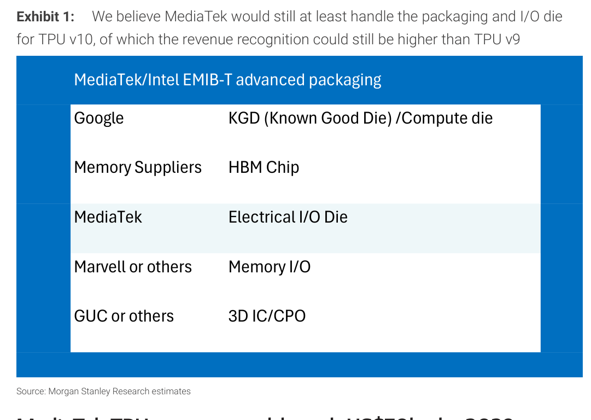

### 解讀摘要

TPU v10 採 COT（Customer-Owned Tooling）模式，Google 自行設計並持有 compute die 光罩，以 KGD（Known Good Die）形式交給 MediaTek；MediaTek 負責 Electrical I/O Die 設計（自有 SerDes IP）並在 Intel EMIB-T 完成最終封裝整合。Marvell 或其他廠商接管 Memory I/O，GUC 或其他廠商承接 3D IC/CPO 設計。這個架構說明為何 GUC/Alchip 都可以宣稱涉及 TPU 而不與 MediaTek 衝突——他們填補的是不同「區塊」，而非取代 MediaTek 的整合者角色。

### 表格

| 功能角色 | 負責方 | 具體工作 |
|---|---|---|
| Compute Die (KGD) | Google（自持） | 自行設計計算核心，以 Known Good Die 交付 |
| Electrical I/O Die | MediaTek | SerDes IP 設計，含 HBM interface |
| Memory I/O | Marvell 或其他 | HBM 記憶體介面設計 |
| 3D IC / CPO | GUC 或其他 | 3D 堆疊 IC 設計，CPO 光學互連 |
| 封裝整合 | MediaTek + Intel EMIB-T | 最終 CoW/3.5D 封裝 |
| HBM Chips | 三星/海力士/美光等 | 記憶體顆粒 |

---

## Exhibit 2｜MediaTek 2029 年 TPU 收入預估達 US\$70bn

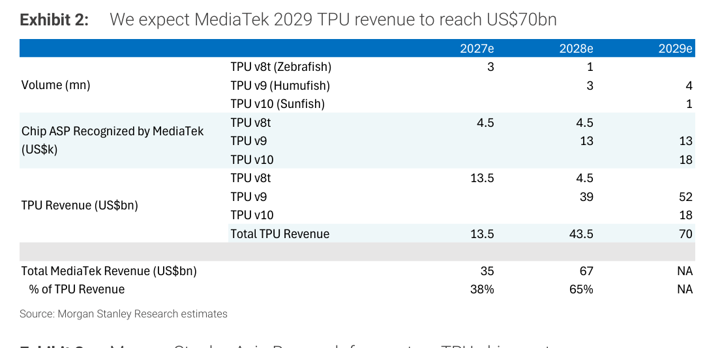

### 解讀摘要

MediaTek TPU 收入軌跡呈指數加速：2027 年 US\$13.5bn（3mn v8t chips）→ 2028 年 US\$43.5bn（1mn v8t + 3mn v9，平均 ASP v9=\$13k/chip）→ 2029 年 US\$70bn（4mn v9 + 1mn v10，v10 ASP=\$18k/chip 較 v9 高 38%）。更關鍵的是 TPU 占 MediaTek 總收入比例：2027=38%、2028=65%，顯示 MediaTek 的 AI ASIC 暴露度在 2028 年急速提升，業務性質根本改變。

### 表格

| 指標 | 2027e | 2028e | 2029e |
|---|---|---|---|
| TPU v8t 出貨量（mn units） | 3 | 1 | — |
| TPU v9 出貨量（mn units） | — | 3 | 4 |
| TPU v10 出貨量（mn units） | — | — | 1 |
| v8t ASP（US\$k/chip） | 4.5 | 4.5 | — |
| v9 ASP（US\$k/chip） | 13 | 13 | 13 |
| v10 ASP（US\$k/chip） | — | — | 18 |
| v8t TPU Revenue（US\$bn） | 13.5 | 4.5 | — |
| v9 TPU Revenue（US\$bn） | — | 39 | 52 |
| v10 TPU Revenue（US\$bn） | — | — | 18 |
| **Total TPU Revenue（US\$bn）** | **13.5** | **43.5** | **70** |
| Total MediaTek Revenue（US\$bn） | 35 | 67 | NA |
| TPU 佔比 | 38% | 65% | NA |

> **洞察一**：v10 ASP US\$18k 較 v9 高 38%（US\$13k），即使 COT 模式下 MediaTek 不認列 compute die 收入，I/O die 尺寸增大（>12 reticles vs 目前 9 reticles）仍帶動 ASP 升級——這是報告的核心假設，若 Google 將更多設計工作帶回自身或分給其他廠商，此假設面臨下調風險。

---

## Exhibit 3｜Google TPU 出貨預估（k 顆）

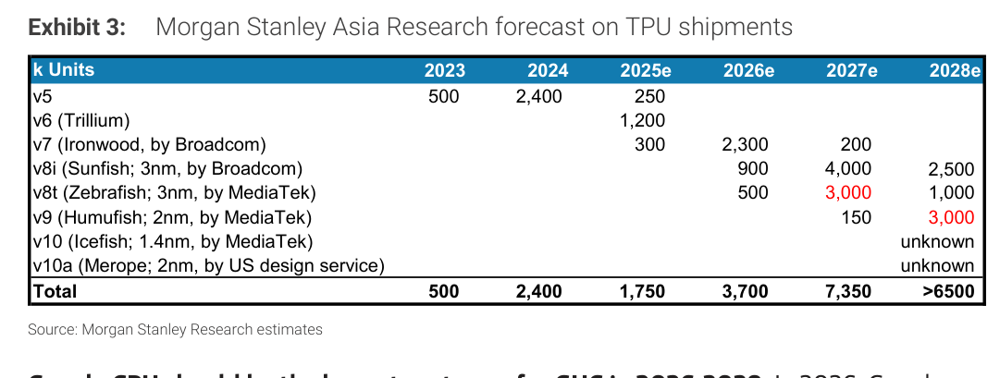

### 解讀摘要

TPU 出貨從 2025 年 1,750k 急增至 2027 年 7,350k（+320%），其中 2027 年最大單一來源為 v8t Zebrafish（MediaTek 設計）3,000k 顆（紅字=上調）與 v8i Sunfish（Broadcom 設計）2,500k 顆；v9 Humufish 2027 年僅 150k 為試跑，主力放量在 2028 年（3,000k）。v10 IceFish（1.4nm）與 v10a Merope（2nm，美國設計服務）2028 年均列「unknown」，顯示 MS 尚未有足夠供應鏈能見度。

### 表格

| 版本 | 設計方 | 2023 | 2024 | 2025e | 2026e | 2027e | 2028e |
|---|---|---|---|---|---|---|---|
| v5 | — | 500 | 2,400 | 250 | — | — | — |
| v6 Trillium | — | — | — | 1,200 | — | — | — |
| v7 Ironwood | Broadcom | — | — | 300 | 2,300 | 200 | — |
| v8i Sunfish（3nm） | Broadcom | — | — | — | 900 | 4,000 | 2,500 |
| v8t Zebrafish（3nm） | MediaTek | — | — | — | 500 | **3,000** | 1,000 |
| v9 Humufish（2nm） | MediaTek | — | — | — | — | 150 | **3,000** |
| v10 Icefish（1.4nm） | MediaTek | — | — | — | — | — | unknown |
| v10a Merope（2nm） | 美國設計服務 | — | — | — | — | — | unknown |
| **Total** | | **500** | **2,400** | **1,750** | **3,700** | **7,350** | **>6,500** |

> **洞察一**：v8t 出貨 2027=3,000k（紅字上調）意味著 MediaTek 在 v8t 單一型號的 CoWoS 配額從 500k（2026）到 3,000k（+500%），是 Google CPU（Axion）以外最大的 MediaTek 量。

---

## Exhibit 4｜Alchip 2028 Trainium 收入可達 US\$8bn

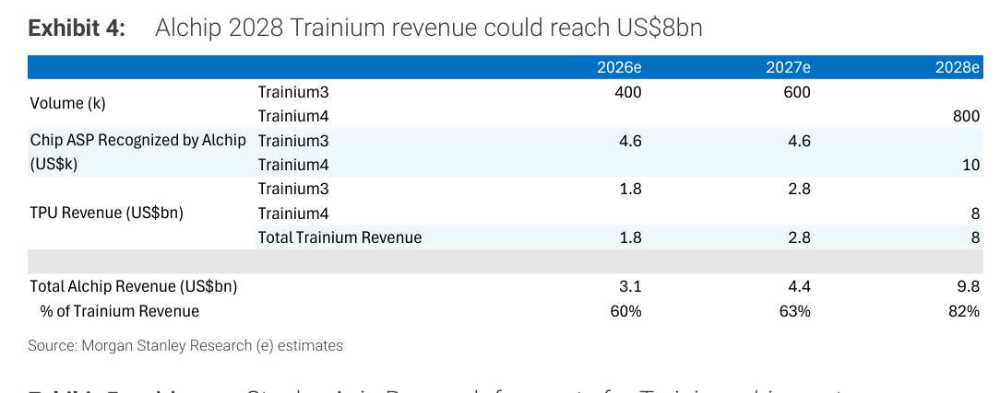

### 解讀摘要

Alchip 的 Trainium4 機會是本報告中最大的數字躍升：2028 年 Trainium4 出貨 800k 顆，ASP US\$10k/chip（vs Trainium3 的 US\$4.6k），帶動 Trainium 收入從 2027 年 US\$2.8bn 跳升至 2028 年 US\$8bn（+186%）。MS 假設 Alchip 拿到約 30% 的 Trainium4 turnkey 配額（與 Trainium3 相似份額），這個假設是本報告最大的「值得驗證」事項。

### 表格

| 指標 | 2026e | 2027e | 2028e |
|---|---|---|---|
| Trainium3 出貨量（k units） | 400 | 600 | — |
| Trainium4 出貨量（k units） | — | — | 800 |
| Trainium3 ASP（US\$k） | 4.6 | 4.6 | — |
| Trainium4 ASP（US\$k） | — | — | 10 |
| Trainium3 Revenue（US\$bn） | 1.8 | 2.8 | — |
| Trainium4 Revenue（US\$bn） | — | — | 8 |
| **Total Trainium Revenue（US\$bn）** | **1.8** | **2.8** | **8** |
| Total Alchip Revenue（US\$bn） | 3.1 | 4.4 | 9.8 |
| Trainium 佔比 | 60% | 63% | 82% |

> **值得驗證**：Alchip 拿到 30% Trainium4 配額的假設。Trainium4 總 TAM 約 2.5mn 顆，Alchip 拿 800k（32%），剩餘約 68% 將由其他廠商（如 AWS/Annapurna 直接 + 其他亞洲設計服務商）分擔。若 Alchip 配額實際低於 20%，2028E revenue 將跌破 US\$5.5bn，目標價需重估。

---

## Exhibit 5｜Trainium 出貨預估（k 顆）

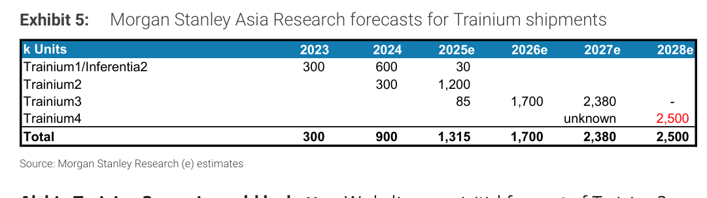

### 解讀摘要

Trainium4 2028 年出貨 2,500k 顆是核心假設——從 2027 年「unknown（Alchip 法說管理層稱 TAM 可與 Google TPU 相比）」直接跳至 2,500k，與 Google TPU v9 的 3,000k 規模相當，支撐了 Alchip US\$8bn 的收入目標。

### 表格

| 版本 | 2023 | 2024 | 2025e | 2026e | 2027e | 2028e |
|---|---|---|---|---|---|---|
| Trainium1/Inferentia2 | 300 | 600 | 30 | — | — | — |
| Trainium2 | — | 300 | 1,200 | — | — | — |
| Trainium3 | — | — | 85 | 1,700 | 2,380 | — |
| Trainium4 | — | — | — | — | unknown | **2,500** |
| **Total** | **300** | **900** | **1,315** | **1,700** | **2,380** | **2,500** |

---

## Exhibit 6｜Alchip 主要客戶明細（US\$ mn）

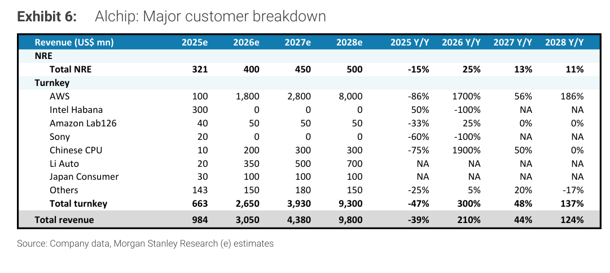

### 解讀摘要

Alchip 的客戶組合在 2026 年出現根本性轉型：AWS Trainium 貢獻從 US\$100mn（2025）暴增至 US\$1,800mn（2026，+1700% YoY），取代 Intel Habana（已歸零）成為絕對主力；中國 CPU（US\$200mn，+1900%）與 Li Auto（US\$350mn，新客戶）同步放量，說明 Alchip 不只押注 AWS 單一客戶。2028 年 AWS 貢獻預計達 US\$8,000mn（=Trainium4 展望），佔總 turnkey 的 86%。

### 表格

| 客戶 | 2025e | 2026e | 2027e | 2028e | 2026 YoY |
|---|---|---|---|---|---|
| **NRE 合計** | **321** | **400** | **450** | **500** | +25% |
| AWS（Trainium） | 100 | 1,800 | 2,800 | 8,000 | +1700% |
| Intel Habana | 300 | 0 | 0 | 0 | -100% |
| Amazon Lab126 | 40 | 50 | 50 | 50 | +25% |
| Sony | 20 | 0 | 0 | 0 | -100% |
| 中國 CPU | 10 | 200 | 300 | 300 | +1900% |
| Li Auto | 20 | 350 | 500 | 700 | NA |
| Japan Consumer | 30 | 100 | 100 | 100 | NA |
| Others | 143 | 150 | 180 | 150 | +5% |
| **Total turnkey** | **663** | **2,650** | **3,930** | **9,300** | +300% |
| **Total revenue** | **984** | **3,050** | **4,380** | **9,800** | +210% |

> **洞察一**：Intel Habana 在 2026 年完全歸零（-100%）且不再重返，代表 Alchip 完成從 Intel AI ASIC 到 AWS Trainium 的客戶轉移——這個切換在 2025 年已發生（從 \$300mn 降至 \$100mn），2026 年確認歸零。
> **洞察二（配合 Exhibit 4）**：Alchip 中國 CPU 業務 2026=US\$200mn 雖規模不大，但 +1900% 的成長率顯示這是獨立於 AWS 之外的第三成長軸，MS 報告已反映在 PT 中（+50% 上行空間暗含「第二 CSP 客戶潛力」）。

---

## Exhibit 7｜GUC：美國 CSP 專案預計貢獻 GUC 2026 年逾 50% 收入

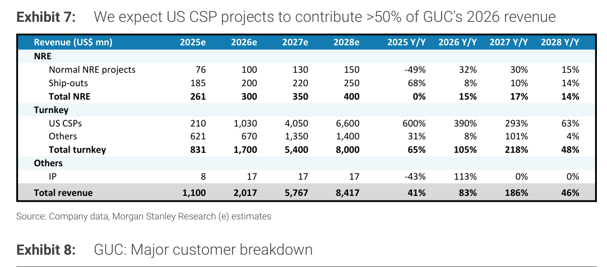

### 解讀摘要

GUC 的轉型比 Alchip 更劇烈：2026 年 US CSPs turnkey 從 US\$210mn 跳至 US\$1,030mn（+390%），2027 年再至 US\$4,050mn（+293%）。Turnkey 佔總收入比重從 2025 年 76% 升至 2028 年 95%，毛利率因此從 2026 年 20.8% 壓縮至 2028 年 15.3%（Turnkey 2/3 模式毛利約 10%）——高成長、低毛利是 GUC 未來業務結構的核心特徵。

### 表格

| 業務 | 2025e | 2026e | 2027e | 2028e | 2026 YoY | 2027 YoY |
|---|---|---|---|---|---|---|
| NRE（含 ship-outs）| 261 | 300 | 350 | 400 | +15% | +17% |
| Turnkey US CSPs | 210 | 1,030 | 4,050 | 6,600 | +390% | +293% |
| Turnkey Others | 621 | 670 | 1,350 | 1,400 | +8% | +101% |
| **Total turnkey** | **831** | **1,700** | **5,400** | **8,000** | +105% | +218% |
| IP | 8 | 17 | 17 | 17 | +113% | 0% |
| **Total revenue** | **1,100** | **2,017** | **5,767** | **8,417** | +83% | +186% |

---

## Exhibit 8｜GUC 主要客戶明細（US\$ mn）

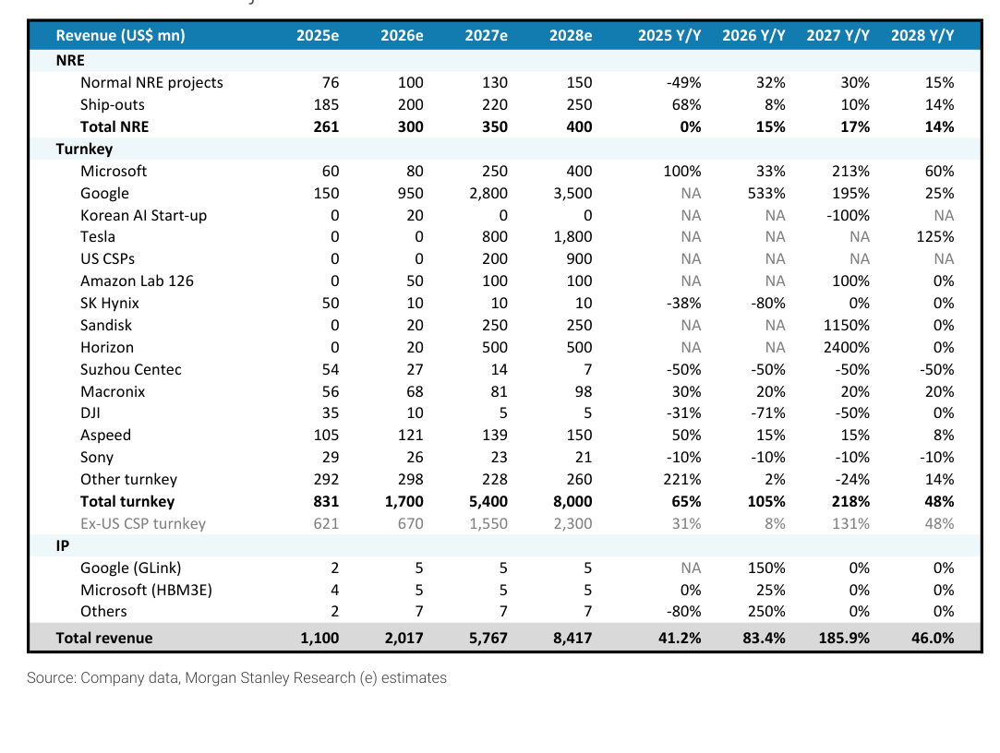

### 解讀摘要

GUC 客戶組合中有兩大驚喜：(1) Tesla 2027 年以 US\$800mn（+NA）新進入，2028 年擴至 US\$1,800mn，成為僅次於 Google 的第二大 turnkey 客戶；(2) Meta MTIA 600 雖未在此表列出（因尚在研發），但在本報告文字中明確提及 GUC 有機會取得。Google CPU（Axion 系列）是目前最大貢獻，2026 年 US\$950mn，2027 年 US\$2,800mn（+195%）。

### 表格

| 客戶 | 2025e | 2026e | 2027e | 2028e | 2026 YoY | 2027 YoY |
|---|---|---|---|---|---|---|
| **NRE 合計** | **261** | **300** | **350** | **400** | +15% | +17% |
| Microsoft（Maia） | 60 | 80 | 250 | 400 | +33% | +213% |
| Google（CPU Axion） | 150 | 950 | 2,800 | 3,500 | +533% | +195% |
| Korean AI Start-up | 0 | 20 | 0 | 0 | NA | -100% |
| Tesla | 0 | 0 | 800 | 1,800 | NA | NA |
| US CSPs（其他） | 0 | 0 | 200 | 900 | NA | NA |
| Amazon Lab 126 | 0 | 50 | 100 | 100 | NA | +100% |
| SK Hynix | 50 | 10 | 10 | 10 | -80% | 0% |
| Sandisk | 0 | 20 | 250 | 250 | NA | +1150% |
| Horizon | 0 | 20 | 500 | 500 | NA | +2400% |
| Suzhou Centec | 54 | 27 | 14 | 7 | -50% | -50% |
| Macronix | 56 | 68 | 81 | 98 | +20% | +20% |
| DJI | 35 | 10 | 5 | 5 | -71% | -50% |
| Aspeed | 105 | 121 | 139 | 150 | +15% | +15% |
| Sony | 29 | 26 | 23 | 21 | -10% | -10% |
| Other turnkey | 292 | 298 | 228 | 260 | +2% | -24% |
| **Total turnkey** | **831** | **1,700** | **5,400** | **8,000** | +105% | +218% |
| IP（Google+MS+Others） | 8 | 17 | 17 | 17 | — | — |
| **Total revenue** | **1,100** | **2,017** | **5,767** | **8,417** | +83% | +186% |

> **洞察一**：Tesla 2027 年 GUC turnkey US\$800mn 是本報告最大單一新資訊（非之前版本所有），但目前仍未有公開確認，MS 未明確標注來源。若此項目不落地，GUC 2027E revenue 將減少約 14%（\$5.8bn→\$5.0bn），估值影響可觀。
> **洞察二**：Horizon（中國 ADAS/自動駕駛）2027=US\$500mn（+2400%）是另一大新增長點，加上 Sandisk 2027=US\$250mn，中國+其他非美 CSP 客戶合計 US\$1.1bn（2027）提供了一定程度的地緣政治多元化。

---

## Exhibit 9｜2027 GPU/ASIC 總耗電：38GW

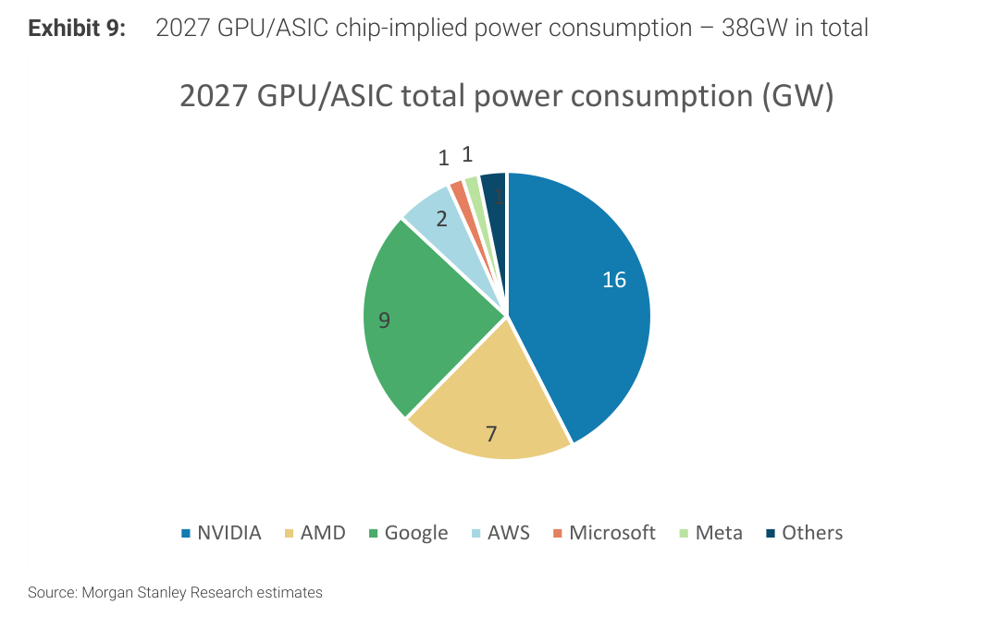

### 解讀摘要

以每顆 GPU/ASIC 平均 TDP 2kW 計算，2027 年 MS 預估的 CoWoS 隱含晶片出貨量（約 19mn 顆）合計耗電 38GW。NVIDIA 獨佔 16GW（42%），Google 9GW（24%），AMD 7GW（18%），顯示算力電力需求高度集中於三大玩家。此電力規模相當於台灣全國用電量的 85%，是本報告拋出的電力基礎設施瓶頸概念。

### 表格

| 廠商 | 2027 耗電（GW） | 佔比 |
|---|---|---|
| NVIDIA | 16 | 42% |
| AMD | 7 | 18% |
| Google | 9 | 24% |
| AWS | 2 | 5% |
| Microsoft | 1 | 3% |
| Meta | 1 | 3% |
| Others | \~2 | 5% |
| **Total** | **38** | **100%** |

---

## Exhibit 10｜GPU/ASIC 耗電趨勢（TSMC CoWoS 出貨隱含）

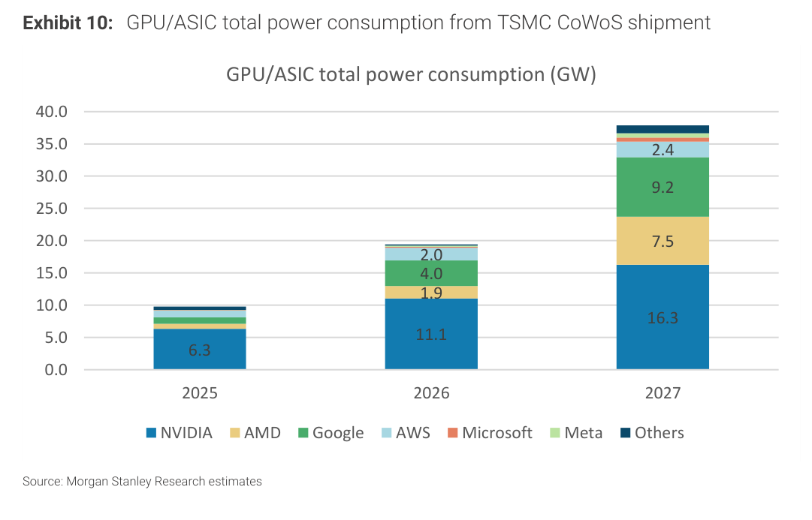

### 解讀摘要

AI 耗電需求呈加速增長：2025 年約 10GW，2026 年翻近倍至 \~20GW，2027 年再翻倍至 38GW。成長驅動力從 NVIDIA 一家獨大（2025 年 NVIDIA=6.3/10GW=63%）逐漸多元化：2027 年 Google（9.2GW）與 AMD（7.5GW）合計佔 44%，NVIDIA 雖絕對量仍最大（16.3GW）但佔比降至 43%。這個趨勢直接對應 CoWoS 客戶需求多元化（Exhibit 14-15）。

### 表格

| 廠商 | 2025（GW） | 2026（GW） | 2027（GW） |
|---|---|---|---|
| NVIDIA | 6.3 | 11.1 | 16.3 |
| AMD | \~0.5 | 1.9 | 7.5 |
| Google | \~1.0 | 4.0 | 9.2 |
| AWS | \~0.5 | 2.0 | 2.4 |
| Microsoft+Meta+Others | \~1.7 | \~0.9 | \~2.6 |
| **Total** | **\~10** | **\~19.9** | **\~38** |

---

## Exhibit 11｜AI HBM 需求：2027 年達 50bn Gb

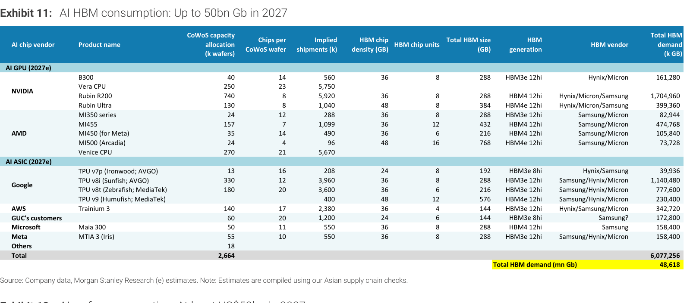

### 解讀摘要

2027 年 AI HBM 需求 48,618 mn Gb（≈50bn Gb），以總 CoWoS 配額 2,664k wafers 為基礎推算。最大貢獻者為 NVIDIA Rubin R200（740k wafers × 8 chips/wafer × 8顆 HBM4 12hi 288GB = 1,704,960k GB，佔總量 28%），其次是 Google TPU v8i Sunfish by Broadcom（1,140,480k GB，19%）與 TPU v8t Zebrafish by MediaTek（777,600k GB，13%）。HBM4 與 HBM4e 世代比重在 2027 年大幅提升（Rubin、AMD MI455/MI500 均用 HBM4/4e）。

### 表格（主要行節選）

| 廠商 | 產品 | CoWoS（k wafers） | 出貨（k chips） | HBM GB | HBM units | Total HBM（k GB） |
|---|---|---|---|---|---|---|
| NVIDIA | Rubin R200 | 740 | 5,920 | 288（HBM4） | 8 | 1,704,960 |
| NVIDIA | Rubin Ultra | 130 | 1,040 | 384（HBM4e） | 8 | 399,360 |
| NVIDIA | B300 | 40 | 560 | 288（HBM3e） | 8 | 161,280 |
| AMD | MI455 | 157 | 1,099 | 432（HBM4） | 12 | 474,768 |
| Google | TPU v8i（Broadcom） | 330 | 3,960 | 288（HBM3e） | 8 | 1,140,480 |
| Google | TPU v8t（MediaTek） | 180 | 3,600 | 216（HBM3e） | 6 | 777,600 |
| AWS | Trainium3 | 140 | 2,380 | 144（HBM3e） | 4 | 342,720 |
| Microsoft | Maia 300 | 50 | 550 | 288（HBM4） | 8 | 158,400 |
| Meta | MTIA 3（Iris） | 55 | 550 | 288（HBM3e） | 8 | 158,400 |
| **Total** | | **2,664** | | | | **6,077,256 k GB** |
| **Total HBM demand（mn Gb）** | | | | | | **48,618** |

---

## Exhibit 12｜AI 晶圓消耗：2027 年至少 US\$59bn

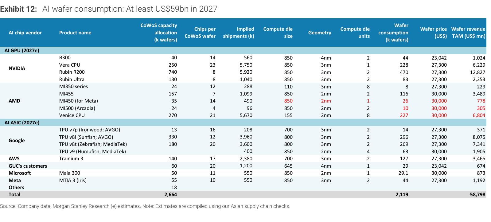

### 解讀摘要

AI 晶圓代工 TAM 2027 年達 US\$58,798mn（≈\$59bn），以 2,664k CoWoS wafers 配額換算出 2,119k 實際計算核心晶圓需求為基礎。NVIDIA Rubin R200 單品佔 US\$12,827mn（22%），是最大單一貢獻；AMD Venice CPU（2nm，US\$30,000/wafer）以 US\$6,804mn 排第三；2nm 製程貢獻（AMD MI455/MI500/Venice + NVIDIA B300/Rubin Ultra CoW）合計帶動整體 wafer ASP 提升。

### 表格（節選）

| 廠商 | 產品 | Geometry | Wafer 消耗（k wafers） | Wafer 單價（US\$） | Wafer Revenue TAM（US\$ mn） |
|---|---|---|---|---|---|
| NVIDIA | Rubin R200 | 3nm | 470 | 27,300 | 12,827 |
| NVIDIA | Vera CPU | 3nm | 228 | 27,300 | 6,229 |
| AMD | Venice CPU | 2nm | 227 | 30,000 | 6,804 |
| AMD | MI455 | 2nm | 116 | 30,000 | 3,489 |
| Google | TPU v8i（Sunfish） | 3nm | 296 | 27,300 | 8,075 |
| Google | TPU v8t（Zebrafish） | 3nm | 269 | 27,300 | 7,341 |
| **Total** | | | **2,119** | | **58,798** |

> **洞察一**：2nm 製程（AMD Venice CPU + MI455/MI500、部分 NVIDIA）合計 wafer 消耗約 380k wafers，均以 US\$30,000/wafer 計算，較 3nm（US\$27,300）溢價 10%；2027 年 2nm 佔比約 18%（vs 2026 年幾乎為零），是晶圓代工 ASP 提升的新引擎。

---

## Exhibit 13｜CoWoS 配額：依 CoW 廠商拆分（k wafers）

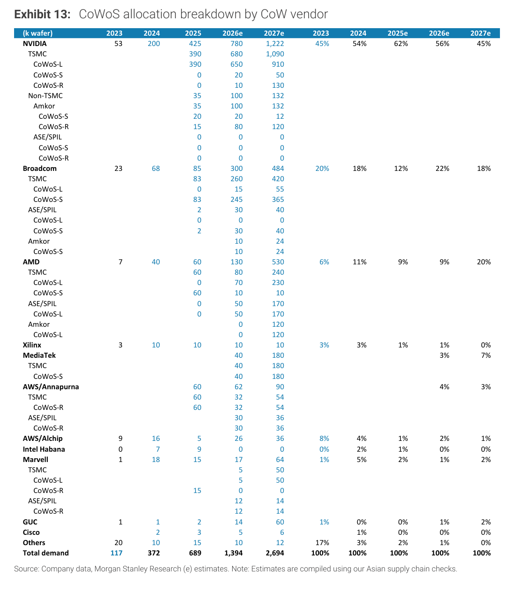

### 解讀摘要

此為本報告最核心的供應鏈追蹤表，呈現 2023-2027 年 CoWoS 配額按客戶（NVIDIA/Broadcom/AMD等）× 廠商（TSMC/ASE/Amkor）的全面拆分。NVIDIA 在 TSMC CoWoS-L 幾乎壟斷（2027 年 TSMC 1,090k 中 NVIDIA 佔 910k），Broadcom（Google ASIC）主攻 TSMC CoWoS-S（365k，2027e），AMD 因廣泛使用 CoWoS-L/S/R 且也引入 ASE/SPIL/Amkor（2027 年 ASE 170k）而顯示出封裝多元化策略。GUC 的 CoWoS 配額從 2023 年 1k 跳至 2027 年 60k（+5,900% 三年），是成長最快的 ASIC 設計服務商。

### 表格（摘要行）

| 客戶 | 2023 | 2024 | 2025 | 2026e | 2027e | 2026e 佔比 | 2027e 佔比 |
|---|---|---|---|---|---|---|---|
| NVIDIA | 53 | 200 | 425 | 780 | 1,222 | 56% | 45% |
| Broadcom | 23 | 68 | 85 | 300 | 484 | 22% | 18% |
| AMD | 7 | 40 | 60 | 130 | 530 | 9% | 20% |
| MediaTek | — | — | — | 40 | 180 | 3% | 7% |
| AWS/Annapurna | — | — | 60 | 62 | 90 | 4% | 3% |
| AWS/Alchip | 9 | 16 | 5 | 26 | 36 | 2% | 1% |
| Marvell | 1 | 18 | 15 | 17 | 64 | 1% | 2% |
| GUC | 1 | 1 | 2 | 14 | 60 | 1% | 2% |
| Cisco | — | 2 | 3 | 5 | 6 | 0% | 0% |
| Others | 20 | 10 | 15 | 10 | 12 | 1% | 0% |
| **Total demand** | **117** | **372** | **689** | **1,394** | **2,694** | **100%** | **100%** |

---

## Exhibit 14｜Global CoWoS 需求：2026e vs. 2027e（k wafers）

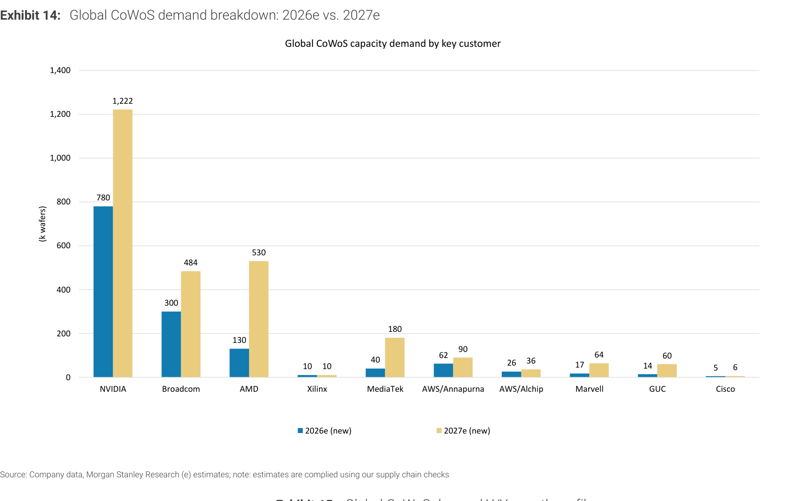

### 解讀摘要

2027 年相比 2026 年，成長最顯著的三個客戶是：NVIDIA（+57%，780→1,222k），AMD（+308%，130→530k），以及 GUC（+329%，14→60k）。AMD 的 +308% 成長率最高，主要因 MI455（2nm）與 Venice CPU（2nm）在 2027 年大量放量；GUC 的高成長率反映 Google CPU（Axion）從 2026 年到 2027 年 +195% 的急劇提升。

### 表格

| 客戶 | 2026e（k wafers） | 2027e（k wafers） | YoY |
|---|---|---|---|
| NVIDIA | 780 | 1,222 | +57% |
| Broadcom | 300 | 484 | +61% |
| AMD | 130 | 530 | +308% |
| Xilinx | 10 | 10 | 0% |
| MediaTek | 40 | 180 | +350% |
| AWS/Annapurna | 62 | 90 | +45% |
| AWS/Alchip | 26 | 36 | +38% |
| Marvell | 17 | 64 | +276% |
| GUC | 14 | 60 | +329% |
| Cisco | 5 | 6 | +10% |
| **Total** | **1,394** | **2,694** | **+93%** |

---

## Exhibit 15｜CoWoS 需求 Y/Y 成長率

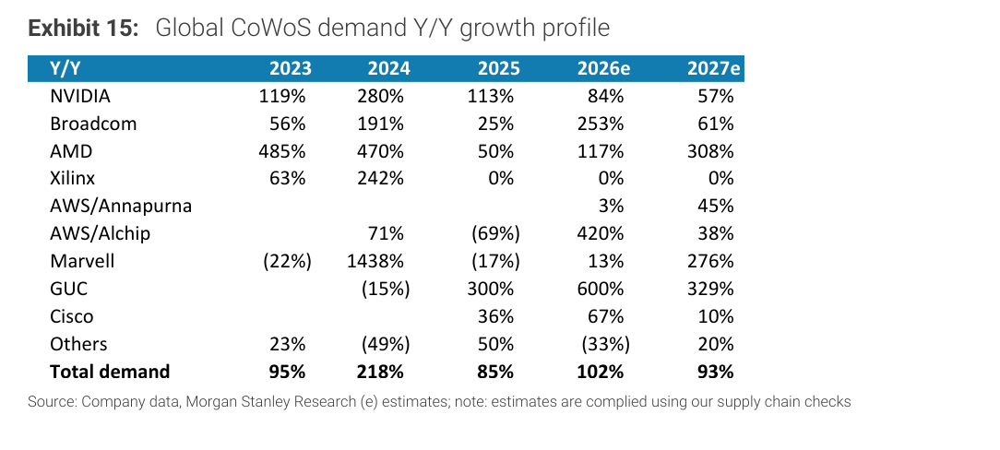

### 解讀摘要

歷史上 CoWoS 需求成長高度不均：2023=+95%、2024=+218%、2025=+85%，2026e=+102% 重新加速，2027e=+93% 維持高位。最值得注意的是 GUC 在 2026（+600%）、2027（+329%）連續兩年達到極端高成長率，Marvell 的 2027 年 +276% 也反映其 Google 生態系統設計服務擴張。

---

## Exhibit 16｜CoWoS 供給擴張：年底產能（kwpm）

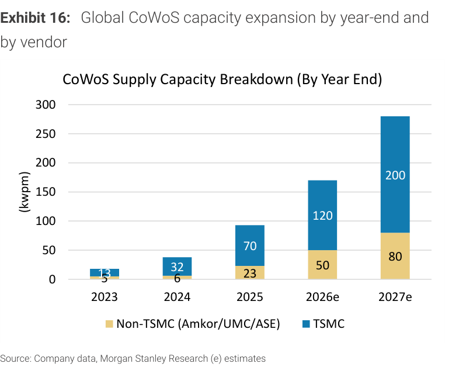

### 解讀摘要

CoWoS 供給擴張強勁但仍落後需求：2027 年底 TSMC+Non-TSMC 合計 280kwpm，換算成年度產能約 280×12 = 3,360k wafers，而 2027 年需求估計 2,694k wafers。但此產能是「年底」數字——2027 年上半年產能仍顯著低於年底水位，全年有效產能應低於 2,800k wafers，供需仍維持緊張格局（即非帶量可以隨時取用）。

### 表格

| 年底 | TSMC（kwpm） | Non-TSMC（Amkor/UMC/ASE，kwpm） | 合計 |
|---|---|---|---|
| 2023 | 13 | 5 | 18 |
| 2024 | 32 | 6 | 38 |
| 2025 | 70 | 23 | 93 |
| 2026e | 120 | 50 | 170 |
| 2027e | 200 | 80 | 280 |

---

## Exhibit 17｜CoWoS 需求趨勢：按客戶堆疊（k wafers/年）

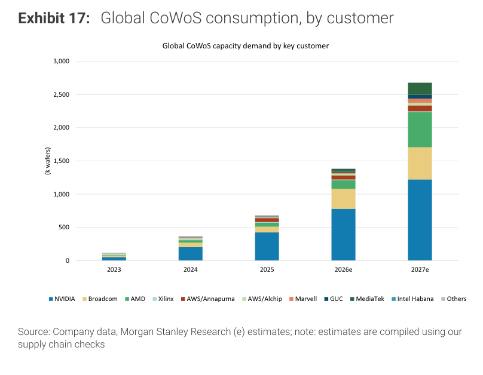

### 解讀摘要

堆疊圖直觀呈現 CoWoS 需求從 2023 年的 117k 到 2027 年的 2,694k（+23 倍）的爆發歷程。NVIDIA 仍是最大貢獻（深藍色）但佔比從 2025 年 62% 降至 2027 年 45%，顯示 ASIC（Google Broadcom/MediaTek）與 AMD 的比例上升——這對 CoWoS 廠商（尤其 TSMC）意味著客戶結構更加多元。

---

## Exhibit 18｜AI HBM 需求：2026 年達 30bn Gb

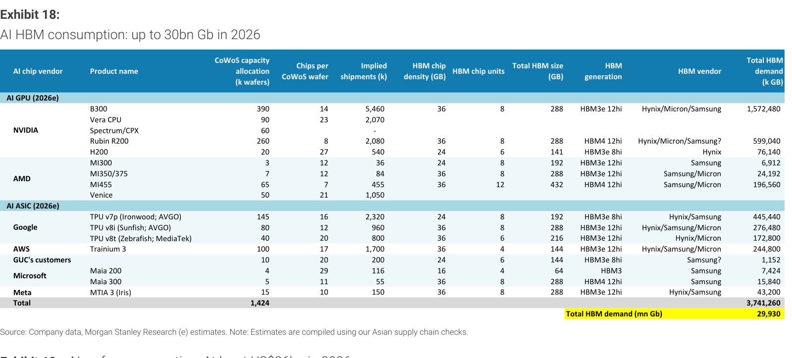

### 解讀摘要

2026 年 AI HBM 總需求 29,930 mn Gb（≈30bn Gb），以 1,424k CoWoS wafers 為計算基礎。NVIDIA B300（390k wafers）貢獻最大單品 1,572,480k GB（HBM3e 12hi，+Hynix/Micron/Samsung 供應）。值得注意的是 Microsoft Maia 200 僅用 HBM3（4顆，64GB/chip），是技術上最落後的 HBM 世代，反映 Microsoft 自研 ASIC 在 2026 年仍處於早期部署階段。

### 表格（節選）

| 廠商 | 產品 | CoWoS（k wafers） | 晶片數（k） | HBM Generation | Total HBM demand（k GB） |
|---|---|---|---|---|---|
| NVIDIA | B300 | 390 | 5,460 | HBM3e 12hi | 1,572,480 |
| NVIDIA | Rubin R200 | 260 | 2,080 | HBM4 12hi | 599,040 |
| AMD | MI455 | 65 | 455 | HBM4 12hi | 196,560 |
| Google | TPU v7p（Ironwood） | 145 | 2,320 | HBM3e 8hi | 445,440 |
| Google | TPU v8i（Sunfish） | 80 | 960 | HBM3e 12hi | 276,480 |
| AWS | Trainium3 | 100 | 1,700 | HBM3e 12hi | 244,800 |
| Microsoft | Maia 200 | 4 | 116 | HBM3 | 7,424 |
| Microsoft | Maia 300 | 5 | 55 | HBM4 12hi | 15,840 |
| Meta | MTIA 3（Iris） | 15 | 150 | HBM3e 12hi | 43,200 |
| **Total** | | **1,424** | **18,526** | | **3,741,260 k GB** |
| **Total HBM（mn Gb）** | | | | | **29,930** |

---

## Exhibit 19｜AI 晶圓消耗：2026 年至少 US\$26bn

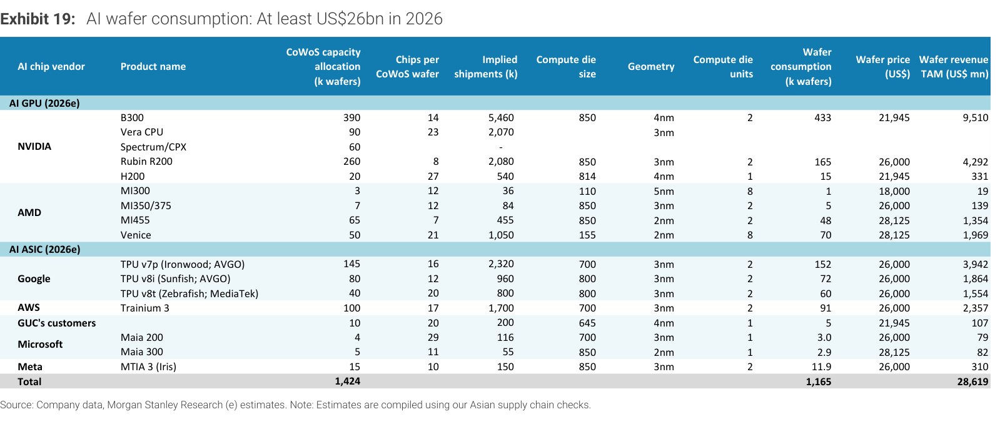

### 解讀摘要

2026 年 AI 晶圓 TAM US\$28,619mn（標題「至少 US\$26bn」為保守估），以 1,424k CoWoS wafers 換算出 1,165k 計算核心晶圓。2026 年以 3nm 為主（3nm wafer US\$26,000），整體加權平均晶圓單價低於 2027 年（後者有更多 2nm 佔比）。NVIDIA B300（4nm，US\$21,945/wafer）是唯一顯著用 4nm 的大客戶，Wafer Revenue US\$9,510mn 是 2026 年最大單品。

### 表格（節選）

| 廠商 | 產品 | Geometry | Wafer（k） | 單價（US\$） | Revenue（US\$ mn） |
|---|---|---|---|---|---|
| NVIDIA | B300 | 4nm | 433 | 21,945 | 9,510 |
| NVIDIA | Rubin R200 | 3nm | 165 | 26,000 | 4,292 |
| Google | TPU v7p（Ironwood） | 3nm | 152 | 26,000 | 3,942 |
| AWS | Trainium3 | 3nm | 91 | 26,000 | 2,357 |
| AMD | MI455 | 2nm | 48 | 28,125 | 1,354 |
| AMD | Venice CPU | 2nm | 70 | 28,125 | 1,969 |
| **Total** | | | **1,165** | | **28,619** |

---

## Exhibit 20｜（舊方法）Blackwell 晶片 vs. GB NVL72 機架出貨對比

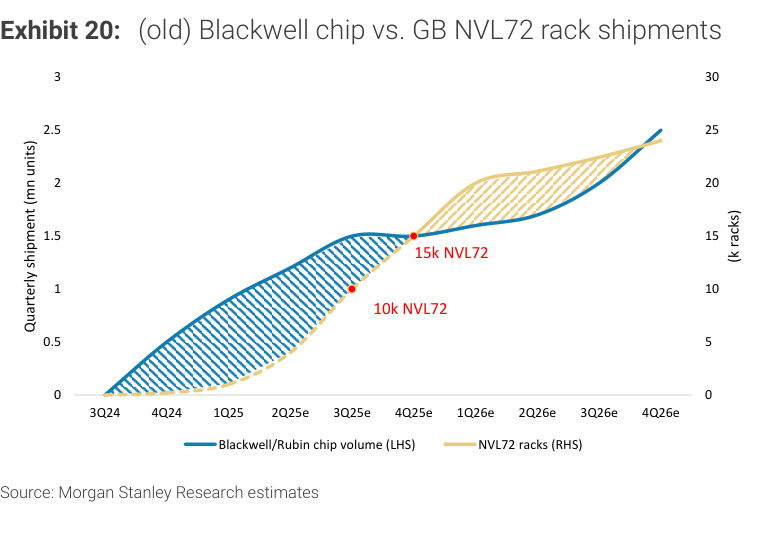

### 解讀摘要

舊版方法論僅用 NVL72（72 GPUs/rack）對比 Blackwell chip 出貨，發現 4Q25e 出貨缺口（chip=1.55mn vs NVL72 racks 僅 10-15k 等效）引發庫存疑慮。但此方法遺漏 HGX 伺服器（8 GPUs/server，9台=1個 NVL72），導致需求端低估，因此報告修正為 Exhibit 21。

---

## Exhibit 21｜（新方法）Blackwell 晶片 vs. NVL72+HGX 等效機架出貨對比

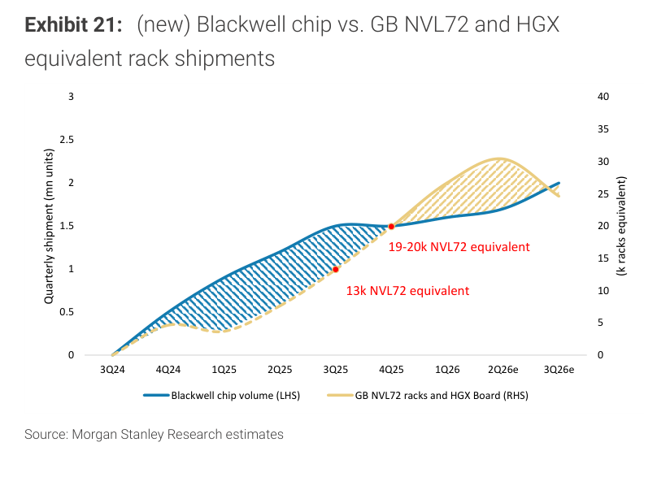

### 解讀摘要

加入 HGX 後修正：3Q25 Blackwell 等效需求為 13k NVL72，4Q25 提升至 19-20k NVL72 等效，與 Blackwell chip 出貨量的差距大幅收窄——殘存差距（hatch zone）代表供應鏈緩衝庫存（buffer stock），MS 認為此部分會在 2026 年全部吸收消化，無需擔心庫存積壓。2Q26e 起需求端等效機架數持續追上晶片出貨量。

> **洞察一（配合 Exhibit 20）**：兩版方法論的主要差異在於「9台 HGX = 1 NVL72 等效」的假設，這一假設若有偏差（實際 HGX:NVL72 比例不同）將影響「庫存已消化」的結論，是驗證 Blackwell 需求健康度的關鍵變數。

---

## Exhibit 22｜Rubin 晶片 vs. VR NVL72 機架出貨節奏

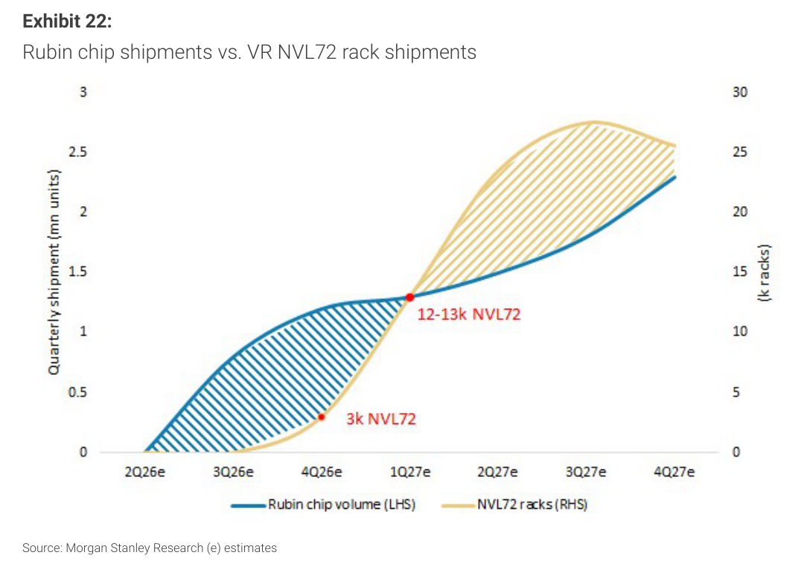

### 解讀摘要

Rubin 預計 2Q26e 開始出貨 chip，3Q26e 機架出貨啟動，4Q26e 達到 3k NVL72 的初始部署規模，1Q27e 爆發到 12-13k NVL72/季，3Q27e 達到峰值約 28-30k/季（等效全年 90k racks）。起步慢、加速快的 S 曲線反映先進封裝（CoWoS-L）的產能爬坡限制：早期晶片出貨先堆緩衝庫存，再在封裝產能到位後集中轉換為機架出貨。

---

## Exhibit 23｜AI 半導體族群 P/E 走勢

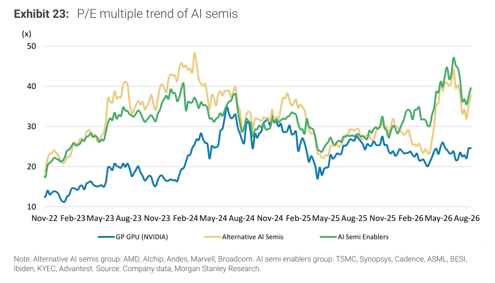

### 解讀摘要

AI 半導體估值在 2026 年 Aug 仍處於相對健康水位：GP GPU（NVIDIA）\~22-24x（歷史區間 12-30x，目前偏中低），Alternative AI Semis（AMD/Alchip/Andes/Marvell/Broadcom）\~35-40x，AI Semi Enablers（TSMC/BESI/ASML 等）\~40-45x。三個族群均未接近 2024 年 2-3 月的峰值（GP GPU \~48x），顯示市場對 AI 算力成長的信心仍在但無過熱訊號。

### 表格

| 族群 | 組成成員 | 2026 Aug 大約 P/E | 歷史峰值 |
|---|---|---|---|
| GP GPU | NVIDIA | \~22-24x | \~50x（2024/2） |
| Alternative AI Semis | AMD/Alchip/Andes/Marvell/Broadcom | \~35-40x | \~50x（2024/2） |
| AI Semi Enablers | TSMC/Synopsys/Cadence/ASML/BESI/Ibiden/KYEC/Advantest | \~38-45x | \~40x（2024/5） |

---

## Exhibit 24｜AI 晶片收入（NVIDIA+AMD）仍預期 QoQ 成長

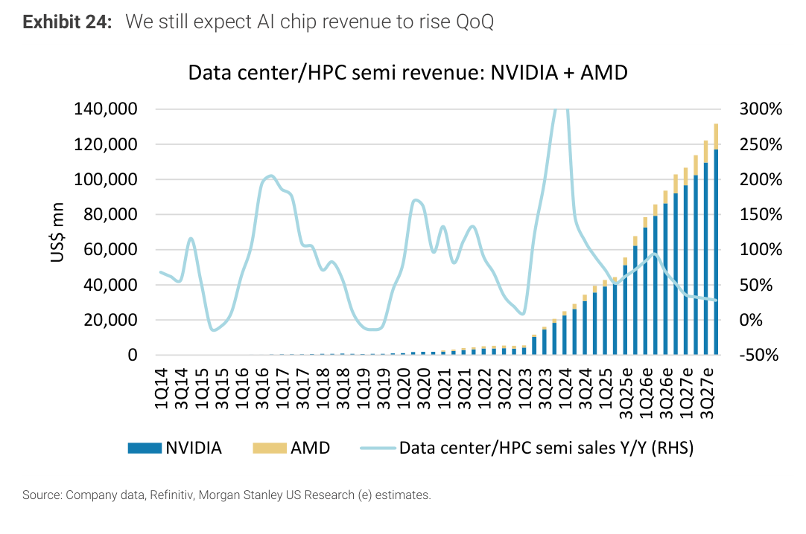

### 解讀摘要

NVIDIA+AMD 數據中心/HPC 半導體合計季收入從 2Q24 約 US\$30bn 持續爬升，MS 預估 3Q27e 達到約 US\$120bn（季），YoY 成長率從 2024 年高峰 +300% 逐步正常化至 2027 年約 +30-50%。AMD 佔比雖小（2027e 約 US\$6-10bn/季）但絕對量持續增加。圖示也呈現 2013-2022 年 GPU DC 收入近乎為零的歷史背景，凸顯 2022 年 ChatGPT 觸發的結構性突破。

---

## Exhibit 25｜TSMC AI 相關收入 2024-2029 CAGR 60%

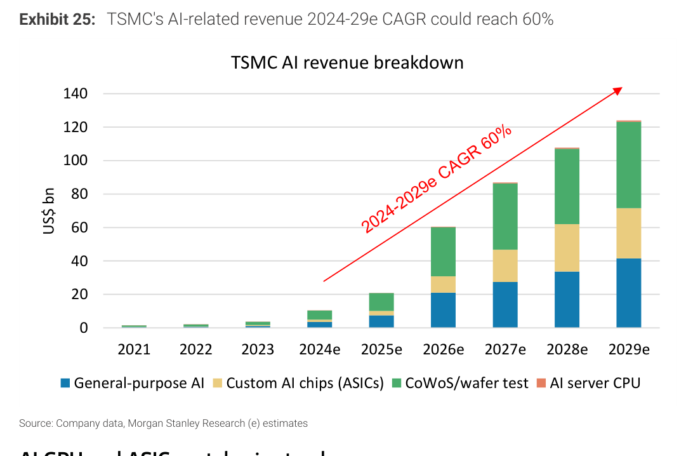

### 解讀摘要

TSMC AI 收入預估從 2024 年約 US\$10bn 擴張至 2029 年 US\$124bn（60% CAGR）。成長動力拆分：GP AI GPU（深藍，NVIDIA/AMD）、Custom AI chips/ASICs（黃，Google/AWS/Microsoft）、CoWoS/wafer test（綠，先進封裝製造）、AI server CPU（紅，少量）。2026 年後 CoWoS 收入佔比急升（對應 Ex13-17 的 1,394k→2,694k wafer 需求），反映 CoWoS 已成 TSMC AI 收入第二大柱。

---

## Exhibit 26｜H100 雲端租用價格追蹤（GCP vs. AWS）

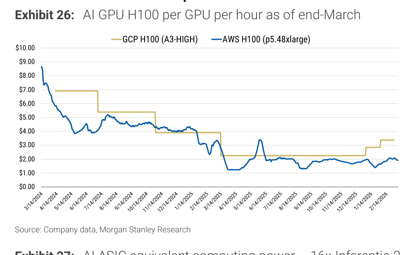

### 解讀摘要

H100 雲端租價從 2023-2024 年高峰（GCP \$6.9/hr，AWS \$8.7/hr）持續下跌至 2026 年初 GCP \~\$2.8-3.3/hr、AWS \~\$2.0/hr（下跌超過 60%）。此趨勢反映兩件事：(1) H100 供給從稀缺走向充裕（新增 Blackwell/Rubin 替換需求）；(2) AI 雲端算力的商品化速度超出預期，對雲端 GPU 租用業者（CoreWeave 等）的議價能力構成壓力，但對下游 AI 應用層反而是利多（推理成本降低）。

---

## Exhibit 27｜AWS Trainium 等效算力租用價格（vs. 16x Inferentia2）

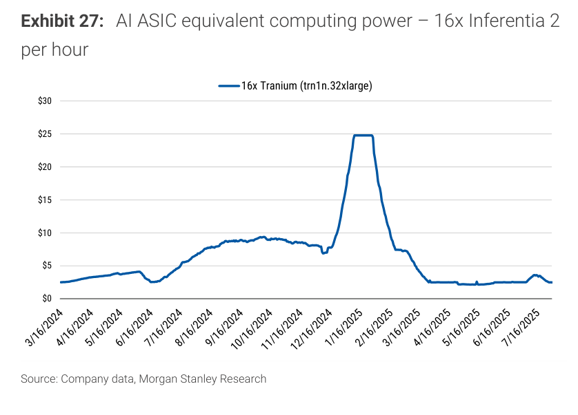

### 解讀摘要

Trainium 算力租價在 2025 年 1-2 月出現異常高峰（US\$25/hr），之後急速崩落至 2026 年的 US\$3/hr 左右——幾乎與 GPU 市場定價接軌。這條曲線說明 ASIC 推理算力定價的市場效率已大幅提升；早期 ASIC 的「算力溢價」正在消失，競爭優勢移向供應鏈執行力（誰能提供足夠數量的 Trainium4）而非技術壟斷。

> **原文補充**：MS 以 16x Inferentia2 等效算力（trn1n.32xlarge 機型）追蹤 AWS 自研 ASIC 租價，此為標準化後的比較基準，非原始 Trainium 機型租價。

---

## Exhibit 28｜NVIDIA 5090 顯卡中國灰市定價反彈

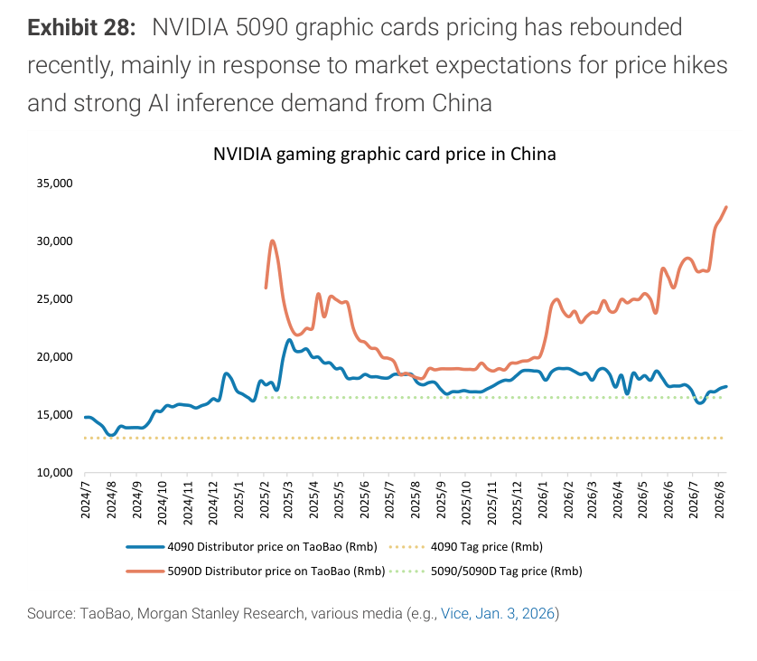

### 解讀摘要

5090D TaoBao 定價從 2025 年 8 月的 Rmb19,000 低點反彈至 2026 年 7-8 月的 Rmb30,000-33,000（+70%），反映中國 AI 推理需求出現新一波拉貨。4090 定價同期相對穩定（Rmb17,000-19,000），5090D 的溢價從近乎持平擴大至 75-90%，顯示中國市場對最新世代 GPU 的需求在 2026 年下半年明顯增溫。MS 認為此為 NVIDIA Blackwell chip 庫存的額外去化動能，有助於提前消化供應鏈緩衝庫存（對應 Exhibit 21 的論點）。

### 表格

| 時間 | 4090 TaoBao（Rmb） | 5090D TaoBao（Rmb） | 5090D/4090 溢價 |
|---|---|---|---|
| 2024/7 | \~15,000 | — | — |
| 2025/8（低點） | \~17,000 | \~19,000 | +12% |
| 2026/1（反彈前） | \~18,000 | \~19,000-25,000 | 0-39% |
| 2026/7-8（近況） | \~17,000-18,000 | \~30,000-33,000 | +75-90% |

---

## 跨 Exhibit 彙整表

### 彙整 1｜CoWoS 供需平衡（來源：Exhibit 13, 16）

| 年度 | 需求（k wafers/年） | 供給上限（kwpm×12，k wafers/年） | 供需缺口 |
|---|---|---|---|
| 2023 | 117 | \~216（18kwpm） | 寬裕 |
| 2024 | 372 | \~456（38kwpm） | 接近緊張 |
| 2025 | 689 | \~1,116（93kwpm） | 寬裕（供給擴張超需求） |
| 2026e | 1,394 | \~2,040（170kwpm，年底） | 緊張（年初/中供給不足） |
| 2027e | 2,694 | \~3,360（280kwpm，年底） | 緊張（年中前供給仍落後） |

> 2026-2027 年「供給年底 kwpm × 12 ≥ 需求」並不代表供應充裕，因為年底產能是擴張後的數字，全年有效產能顯著低於此數字；加上客戶配額通常提前半年至一年鎖定，短缺方的溢價仍存在。

### 彙整 2｜AI HBM+晶圓代工 TAM 成長（來源：Exhibit 11-12, 18-19）

| 年度 | AI HBM 需求（bn Gb） | AI Wafer TAM（US\$bn） |
|---|---|---|
| 2026e | 30 | 26-29 |
| 2027e | 50 | 59 |
| YoY | +67% | +103-127% |

---

## 相關個股清單

| 類別 | 公司 | Ticker | 評等 | 備註 |
|---|---|---|---|---|
| 台股 ASIC 設計 | 聯詠（待確認：應為聯發科） | 2454.TW | OW 維持 | TPU v10 主要整合者，建議趁回調買入，12x 2028 EPS |
| 台股 ASIC 設計 | 世芯-KY（GUC） | 3443.TW | OW | PT NT\$5,688→**6,288**（+10%）；25x 2028E EPS；Meta MTIA + Tesla 新客戶 |
| 台股 ASIC 設計 | 世界先進（Alchip） | 3661.TW | OW | PT NT\$5,088→**5,888**（+16%）；10x 2028E EPS；Trainium4 US\$8bn 2028 目標 |
| 美股 GPU | NVIDIA | NVDA | OW（Joe Moore，美國團隊） | Rubin 2027 90k NVL72 racks，庫存疑慮消散 |
| 美股 GPU | AMD | AMD | — | CoWoS 2027 需求 530k wafers（+308%），MI455 2nm 放量 |
| 美股雲端 | Google（Alphabet） | GOOGL | — | TPU v10 客戶，自持 compute die；GUC 最大客戶 2027 US\$2.8bn |
| 美股雲端 | Amazon（AWS） | AMZN | — | Trainium4 2028 US\$2.5mn 顆；Alchip 最大客戶 |
| 美股雲端 | Microsoft | MSFT | — | Maia 300（HBM4 12hi，Samsung），GUC 客戶 2027 US\$250mn |
| 台股封測 | 日月光/矽品 | 3711.TW | — | CoWoS 非 TSMC 產能 2027 80kwpm；AMD 指定 ASE |
| 台股記憶體 | 三星/海力士/美光 | — | — | AI HBM 2027 需求 50bn Gb，HBM4 12hi 主流 |
